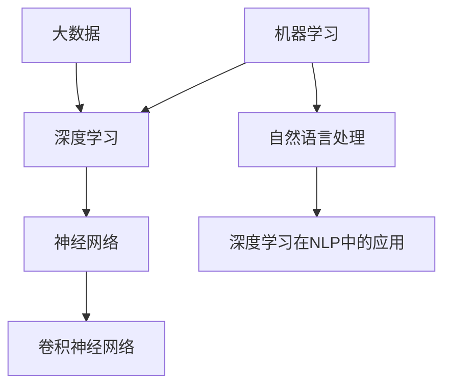

                 

关键词：人工智能，未来展望，深度学习，技术发展，应用场景

摘要：本文旨在探讨人工智能（AI）在未来的发展趋势与潜在应用。通过对人工智能核心概念、算法原理、数学模型以及实际应用场景的深入分析，本文将提供对人工智能未来发展的独到见解，帮助读者了解这一领域的广阔前景与面临的挑战。

## 1. 背景介绍

人工智能（AI）作为计算机科学的一个重要分支，旨在通过模拟、延伸和扩展人的智能，实现机器在感知、推理、学习和决策等方面的能力。自20世纪50年代人工智能概念首次提出以来，AI技术经历了多个发展阶段，从早期的符号主义、知识表示到现代的基于数据的机器学习，特别是深度学习的发展，人工智能取得了惊人的进展。

本文将重点关注深度学习这一近年来迅速崛起的人工智能分支，探讨其在各个领域的应用潜力，分析其面临的挑战，并展望人工智能未来的发展趋势。

### 1.1 深度学习的发展历程

深度学习起源于20世纪40年代，但其真正的大规模发展始于21世纪初。随着计算能力的提升和大数据的出现，深度学习在图像识别、语音识别、自然语言处理等领域取得了显著的成果。尤其是在2012年，深度学习在ImageNet图像识别挑战赛上取得的突破性成果，标志着深度学习时代的到来。

### 1.2 人工智能的现状

目前，人工智能已经广泛应用于各个行业，从自动驾驶、医疗诊断到金融预测、智能制造，AI技术的应用正在不断拓展。同时，人工智能也在推动社会变革，改变着人们的生活方式和工作方式。

## 2. 核心概念与联系

为了更好地理解人工智能，我们需要了解一些核心概念和它们之间的联系。

### 2.1 机器学习与深度学习

机器学习是人工智能的一个分支，它通过算法让计算机从数据中学习，从而做出预测或决策。深度学习是机器学习的一种，它使用多层神经网络来提取数据中的特征。

### 2.2 神经网络与卷积神经网络

神经网络是模仿人脑工作原理的计算机模型，而卷积神经网络（CNN）是深度学习中最常用的架构之一，特别适用于图像处理任务。

### 2.3 自然语言处理与深度学习

自然语言处理（NLP）是人工智能的重要应用领域，深度学习在NLP中的应用，如文本分类、机器翻译等，取得了显著的效果。

#### 2.4 人工智能与大数据

大数据是人工智能的重要驱动力，大量的数据为机器学习提供了丰富的训练资源，推动了人工智能的发展。

下面是一个关于核心概念和联系的Mermaid流程图：



## 3. 核心算法原理 & 具体操作步骤

### 3.1 算法原理概述

深度学习的核心在于神经网络，它由大量节点（神经元）组成，每个节点通过权重连接到其他节点。神经网络通过前向传播和反向传播来学习和优化权重，从而实现对数据的建模。

### 3.2 算法步骤详解

深度学习的过程可以分为以下几个步骤：

1. **数据预处理**：清洗和格式化数据，使其适合训练。
2. **模型设计**：选择适当的神经网络架构，如CNN、RNN等。
3. **训练**：使用训练数据来训练模型，通过优化算法调整权重。
4. **验证**：使用验证数据来评估模型性能。
5. **测试**：使用测试数据来测试模型在未知数据上的表现。

### 3.3 算法优缺点

深度学习具有强大的表示能力和适应性，能够处理复杂的数据类型，但在数据需求、模型解释性和泛化能力上存在一些挑战。

### 3.4 算法应用领域

深度学习在图像识别、语音识别、自然语言处理、自动驾驶等领域都有广泛的应用。

#### 3.4.1 图像识别

在图像识别领域，深度学习通过CNN提取图像特征，实现了对人眼无法识别的复杂图像的准确分类。

#### 3.4.2 语音识别

深度学习在语音识别中的应用，使得语音转化为文字的准确率大大提高。

#### 3.4.3 自然语言处理

深度学习在自然语言处理中的应用，如文本分类、机器翻译等，取得了显著的成果。

#### 3.4.4 自动驾驶

深度学习在自动驾驶中的应用，使得无人驾驶车辆能够在复杂的交通环境中安全行驶。

## 4. 数学模型和公式 & 详细讲解 & 举例说明

### 4.1 数学模型构建

深度学习中的数学模型主要包括神经网络模型和损失函数。神经网络模型用于描述网络的参数，而损失函数用于衡量模型预测结果与真实值之间的差距。

### 4.2 公式推导过程

神经网络的正向传播过程可以表示为：
$$
Z^{[l]} = \sigma(W^{[l]} \cdot A^{[l-1]} + b^{[l]})
$$
其中，$Z^{[l]}$ 是第 $l$ 层的激活值，$\sigma$ 是激活函数，$W^{[l]}$ 是第 $l$ 层的权重矩阵，$A^{[l-1]}$ 是前一层输出，$b^{[l]}$ 是第 $l$ 层的偏置。

反向传播过程用于计算梯度，可以表示为：
$$
\frac{\partial C}{\partial W^{[l]}} = \frac{\partial C}{\partial Z^{[l]}} \cdot \frac{\partial Z^{[l]}}{\partial W^{[l]}}
$$
其中，$C$ 是损失函数，$\frac{\partial C}{\partial Z^{[l]}}$ 是关于 $Z^{[l]}$ 的梯度，$\frac{\partial Z^{[l]}}{\partial W^{[l]}}$ 是关于 $W^{[l]}$ 的梯度。

### 4.3 案例分析与讲解

以一个简单的二元分类问题为例，我们使用逻辑回归模型来预测数据。逻辑回归的损失函数是二元交叉熵损失函数，可以表示为：
$$
C = -\frac{1}{m} \sum_{i=1}^{m} y^{[i]} \log(h_{\theta}(x^{[i]})) + (1 - y^{[i]}) \log(1 - h_{\theta}(x^{[i]}))
$$
其中，$m$ 是样本数量，$y^{[i]}$ 是第 $i$ 个样本的真实标签，$h_{\theta}(x^{[i]}) = \sigma(\theta^T x^{[i]})$ 是逻辑函数。

## 5. 项目实践：代码实例和详细解释说明

### 5.1 开发环境搭建

为了实践深度学习，我们需要搭建一个合适的开发环境。我们可以使用Python和TensorFlow等工具来构建和训练深度学习模型。

### 5.2 源代码详细实现

以下是一个简单的深度学习模型，用于二分类问题：

```python
import tensorflow as tf

# 初始化模型参数
W = tf.Variable(tf.random.normal([input_dim, output_dim]))
b = tf.Variable(tf.zeros([output_dim]))

# 定义模型
model = tf.keras.Sequential([
    tf.keras.layers.Dense(units=output_dim, activation='sigmoid', input_shape=input_dim),
])

# 编译模型
model.compile(optimizer='adam', loss='binary_crossentropy', metrics=['accuracy'])

# 训练模型
model.fit(x_train, y_train, epochs=10, batch_size=32)
```

### 5.3 代码解读与分析

在上面的代码中，我们首先导入了TensorFlow库，并初始化了模型参数。然后，我们定义了一个简单的逻辑回归模型，使用sigmoid函数作为激活函数。接下来，我们编译模型，选择Adam优化器和二元交叉熵损失函数，并使用训练数据进行模型训练。

### 5.4 运行结果展示

训练完成后，我们可以使用测试数据来评估模型性能。以下是一个简单的示例：

```python
# 评估模型
loss, accuracy = model.evaluate(x_test, y_test)

print(f"Test accuracy: {accuracy:.2f}")
```

## 6. 实际应用场景

深度学习在各个领域都有广泛的应用，以下是一些典型的实际应用场景：

### 6.1 图像识别

在图像识别领域，深度学习已经取代传统方法，成为图像分类、目标检测等任务的利器。

### 6.2 语音识别

深度学习在语音识别中的应用，使得语音转化为文字的准确率大幅提升。

### 6.3 自然语言处理

深度学习在自然语言处理中的应用，如文本分类、机器翻译、情感分析等，取得了显著的效果。

### 6.4 自动驾驶

深度学习在自动驾驶中的应用，使得无人驾驶车辆能够实现复杂的环境感知和路径规划。

## 7. 工具和资源推荐

### 7.1 学习资源推荐

- 《深度学习》（Goodfellow, Bengio, Courville著）
- Coursera上的“深度学习”课程

### 7.2 开发工具推荐

- TensorFlow
- PyTorch

### 7.3 相关论文推荐

- “A Guide to Deep Learning Resources”
- “Deep Learning on Medium”

## 8. 总结：未来发展趋势与挑战

### 8.1 研究成果总结

深度学习在图像识别、语音识别、自然语言处理等领域取得了显著的成果，推动了人工智能的发展。

### 8.2 未来发展趋势

随着计算能力的提升和数据量的增长，深度学习将继续在各个领域发挥重要作用。同时，研究重点也将转向模型的可解释性、高效性和泛化能力。

### 8.3 面临的挑战

深度学习在数据需求、模型解释性和泛化能力上仍面临挑战。解决这些问题将是未来研究的重要方向。

### 8.4 研究展望

未来，深度学习将与其他技术相结合，如增强学习、联邦学习等，实现更加智能化、自主化的应用。

## 9. 附录：常见问题与解答

### 9.1 什么是深度学习？

深度学习是机器学习的一个分支，它使用多层神经网络来提取数据中的特征。

### 9.2 深度学习如何工作？

深度学习通过前向传播和反向传播来学习和优化神经网络的权重，从而实现对数据的建模。

### 9.3 深度学习有哪些应用？

深度学习在图像识别、语音识别、自然语言处理、自动驾驶等领域都有广泛的应用。

### 9.4 如何开始学习深度学习？

可以通过阅读相关书籍、参加在线课程、实践项目等方式来学习深度学习。

# 作者：禅与计算机程序设计艺术 / Zen and the Art of Computer Programming
```<|im_sep|>

