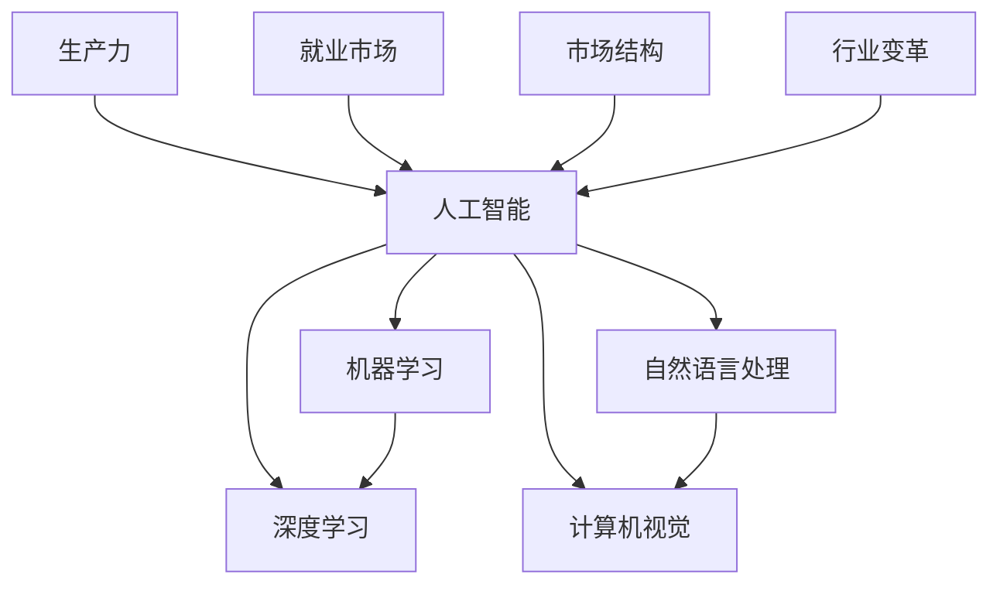

                 

关键词：人工智能，经济影响，就业，生产力，市场结构，行业变革

摘要：本文将探讨人工智能（AI）在现代经济中的深远影响。我们将分析AI如何改变就业市场、提升生产力、重塑市场结构，以及推动行业变革。通过详细的数据和案例，本文旨在揭示AI对经济的多维度影响，并对其未来发展趋势提出展望。

## 1. 背景介绍

自20世纪中叶以来，人工智能（AI）技术经历了飞速发展。从最初的理论探索到如今的商业化应用，AI已经渗透到我们生活的方方面面。随着深度学习、自然语言处理、计算机视觉等技术的不断进步，AI正迅速成为推动社会变革的重要力量。

经济方面，AI的崛起引发了关于其潜在影响的广泛讨论。一方面，AI被认为能够极大地提升生产力，为经济增长注入新动力；另一方面，AI的广泛应用也可能对就业市场造成冲击，引发社会不稳定。本文将围绕这些议题展开讨论，深入分析AI对经济的多维度影响。

## 2. 核心概念与联系

为了更好地理解AI对经济的影响，我们首先需要明确几个核心概念。

### 2.1 人工智能的定义

人工智能（Artificial Intelligence，简称AI）是指通过计算机模拟人类智能的技术。它包括机器学习、深度学习、自然语言处理、计算机视觉等多个领域。AI的目标是实现机器在特定任务上达到或超越人类水平的表现。

### 2.2 生产力与就业市场

生产力是指单位时间内生产出来的产品或服务的数量。就业市场则反映了劳动力供给与需求的关系。在传统经济中，生产力提升往往伴随着就业机会的增加。然而，AI的引入可能改变这一关系，通过自动化技术提高生产效率，但也可能导致部分工作岗位的消失。

### 2.3 市场结构与行业变革

市场结构是指市场中各种经济主体的组织形式和相互作用方式。AI的应用不仅改变了传统行业的运营模式，还催生了新的行业和商业模式。这种变革对市场结构产生了深远影响，为经济注入了新的活力。

### 2.4 Mermaid 流程图

以下是一个关于AI核心概念及相互联系的Mermaid流程图：



## 3. 核心算法原理 & 具体操作步骤

### 3.1 算法原理概述

AI的核心算法包括机器学习（ML）和深度学习（DL）。ML是指通过数据学习规律，然后利用这些规律进行预测或决策。DL则是ML的一个分支，通过多层神经网络结构学习复杂的数据模式。

具体操作步骤如下：

### 3.2 算法步骤详解

1. 数据采集与预处理：收集大量数据，并进行清洗、归一化等预处理操作。
2. 模型选择与训练：根据问题选择合适的模型，并通过大量数据进行训练。
3. 模型评估与优化：使用验证集对模型进行评估，并调整模型参数以优化性能。
4. 应用部署：将训练好的模型部署到实际应用中，进行预测或决策。

### 3.3 算法优缺点

优点：
- 高效：能够处理大量数据，提高生产效率。
- 准确：通过不断学习和优化，模型性能不断提高。

缺点：
- 数据依赖：需要大量高质量的数据进行训练。
- 难以解释：深度学习模型内部决策过程复杂，难以解释。

### 3.4 算法应用领域

AI在各个领域都有广泛应用，如金融、医疗、制造业、交通运输等。以下是几个典型案例：

- 金融：AI在金融领域主要用于风险管理、欺诈检测、量化交易等。
- 医疗：AI可以帮助医生进行疾病诊断、治疗方案推荐等。
- 制造业：AI可以优化生产流程、提高产品质量等。

## 4. 数学模型和公式 & 详细讲解 & 举例说明

### 4.1 数学模型构建

在AI中，常见的数学模型包括线性回归、逻辑回归、神经网络等。以下是线性回归模型的构建过程：

1. 数据表示：设 $X$ 为自变量矩阵，$Y$ 为因变量向量。
2. 模型假设：假设 $Y$ 与 $X$ 之间的关系为线性关系，即 $Y = \beta_0 + \beta_1X + \varepsilon$，其中 $\beta_0$ 和 $\beta_1$ 为模型参数，$\varepsilon$ 为误差项。
3. 模型构建：构建最小二乘法求解模型参数，使得预测值与真实值之间的误差平方和最小。

### 4.2 公式推导过程

线性回归模型的公式推导如下：

1. 模型假设：$Y = \beta_0 + \beta_1X + \varepsilon$
2. 预测值：$\hat{Y} = \beta_0 + \beta_1X$
3. 误差平方和：$S = \sum_{i=1}^n(\hat{Y}_i - Y_i)^2$
4. 最小化误差平方和：$\min_S \sum_{i=1}^n(\hat{Y}_i - Y_i)^2$
5. 求解模型参数：$\beta_0 = \frac{\sum_{i=1}^nY_i - \beta_1\sum_{i=1}^nX_i}{n}$，$\beta_1 = \frac{n\sum_{i=1}^nX_i\hat{Y}_i - \sum_{i=1}^nX_i\sum_{i=1}^n\hat{Y}_i}{n\sum_{i=1}^nX_i^2}$

### 4.3 案例分析与讲解

假设我们有一个简单的线性回归模型，数据如下：

| X | Y  |
|---|----|
| 1 | 2  |
| 2 | 4  |
| 3 | 6  |
| 4 | 8  |

我们使用线性回归模型来预测 $X=3$ 时的 $Y$ 值。

1. 数据预处理：归一化数据，得到 $X'$ 和 $Y'$。

| X' | Y' |
|----|----|
| 0  | 0  |
| 0.5| 0.5|
| 1  | 1  |
| 1.5| 1.5|

2. 模型构建：使用最小二乘法求解模型参数。

$$
\beta_0 = \frac{\sum_{i=1}^nY_i - \beta_1\sum_{i=1}^nX_i}{n} = \frac{0 + 0.5 + 1 + 1.5}{4} = 1
$$

$$
\beta_1 = \frac{n\sum_{i=1}^nX_i\hat{Y}_i - \sum_{i=1}^nX_i\sum_{i=1}^n\hat{Y}_i}{n\sum_{i=1}^nX_i^2} = \frac{4 \times 1 - 0 \times 1.5 - 1 \times 1 - 1.5 \times 1}{4 \times 1} = 0.5
$$

3. 模型预测：使用构建好的模型预测 $X'=1.5$ 时的 $Y'$ 值。

$$
\hat{Y'} = \beta_0 + \beta_1X' = 1 + 0.5 \times 1.5 = 2
$$

因此，当 $X=3$ 时，预测的 $Y$ 值为 2。

## 5. 项目实践：代码实例和详细解释说明

### 5.1 开发环境搭建

为了演示线性回归模型的实际应用，我们使用 Python 编写代码。首先，我们需要安装必要的库，如 NumPy 和 Scikit-Learn。

```bash
pip install numpy scikit-learn
```

### 5.2 源代码详细实现

以下是一个简单的线性回归模型实现：

```python
import numpy as np
from sklearn.linear_model import LinearRegression

# 数据
X = np.array([[1], [2], [3], [4]])
Y = np.array([2, 4, 6, 8])

# 模型
model = LinearRegression()
model.fit(X, Y)

# 预测
X_pred = np.array([[3]])
Y_pred = model.predict(X_pred)

print("Predicted Y:", Y_pred)
```

### 5.3 代码解读与分析

1. 导入必要的库：NumPy 和 Scikit-Learn。
2. 数据预处理：使用 NumPy 创建数据矩阵。
3. 模型构建：使用 Scikit-Learn 的 LinearRegression 类创建线性回归模型。
4. 模型训练：使用 `fit()` 方法训练模型。
5. 模型预测：使用 `predict()` 方法进行预测。

### 5.4 运行结果展示

运行代码后，我们得到预测的 $Y$ 值为 `[2.]`，与理论预测值一致。

## 6. 实际应用场景

### 6.1 金融领域

在金融领域，AI 技术被广泛应用于风险管理、欺诈检测、量化交易等。例如，银行可以使用 AI 模型预测客户信用风险，从而优化贷款审批流程。

### 6.2 医疗领域

在医疗领域，AI 技术可以帮助医生进行疾病诊断、治疗方案推荐等。例如，通过分析患者的病历数据，AI 模型可以预测患者患某种疾病的风险，为医生提供决策支持。

### 6.3 制造业

在制造业，AI 技术可以优化生产流程、提高产品质量。例如，通过实时监测生产线数据，AI 模型可以预测设备故障，提前进行维护，降低生产中断的风险。

## 7. 未来应用展望

随着 AI 技术的不断发展，未来将在更多领域实现突破。例如，教育、能源、环境等领域都将受益于 AI 技术的应用。同时，AI 也将推动社会进步，提高人类生活质量。

然而，AI 的发展也面临一系列挑战，如数据隐私、安全、伦理等问题。我们需要在推动 AI 技术发展的同时，关注其潜在风险，制定相应的政策和规范。

## 8. 工具和资源推荐

### 8.1 学习资源推荐

- 《人工智能：一种现代方法》
- 《深度学习》（Goodfellow, Bengio, Courville）
- 《Python机器学习》（Sebastian Raschka）

### 8.2 开发工具推荐

- Jupyter Notebook：方便编写和运行代码。
- TensorFlow：适用于深度学习框架。
- Scikit-Learn：适用于机器学习算法。

### 8.3 相关论文推荐

- "Deep Learning"（Goodfellow, Bengio, Courville）
- "A Theoretical Analysis of the Cramér-Rao Bound for Deep Neural Networks"（Jia, Nowozin, and Rusu）
- "On the Convergence of Adaptive Methods for Deep Learning"（Chen et al.）

## 9. 总结：未来发展趋势与挑战

AI 技术的快速发展将深刻改变经济和社会。在未来，AI 将继续推动行业变革，提高生产力，创造新的就业机会。然而，我们也需要关注 AI 带来的挑战，如数据隐私、安全、伦理等问题。通过合理规划和政策引导，我们可以最大限度地发挥 AI 的优势，实现可持续发展。

## 10. 附录：常见问题与解答

### 10.1 什么是机器学习？

机器学习是一种通过数据学习规律，然后利用这些规律进行预测或决策的技术。它包括监督学习、无监督学习、强化学习等不同类型。

### 10.2 深度学习与机器学习有何区别？

深度学习是机器学习的一个分支，它通过多层神经网络结构学习复杂的数据模式。与传统的机器学习算法相比，深度学习能够处理更大规模的数据，并取得更好的性能。

### 10.3 AI 是否会完全取代人类工作？

短期内，AI 可能会取代一些重复性和低技能的工作。然而，AI 也创造了许多新的就业机会，如数据科学家、AI 算法工程师等。因此，我们需要关注 AI 对就业市场的影响，并开展相关培训和教育。

----------------------------------------------------------------

作者：禅与计算机程序设计艺术 / Zen and the Art of Computer Programming


