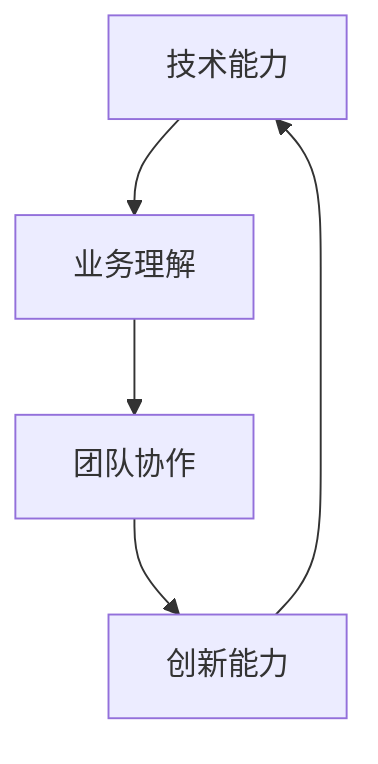

                 

关键词：项目经验、技能提升、职业发展、人工智能、深度学习、编程实践

> 摘要：本文将探讨项目经验在人工智能领域的价值和重要性，通过深入分析Andrej Karpathy的项目经历，探讨项目经验对技能提升、职业发展和创新思维的推动作用。文章结构如下：

## 1. 背景介绍

## 2. 核心概念与联系

## 3. 核心算法原理 & 具体操作步骤

### 3.1 算法原理概述

### 3.2 算法步骤详解

### 3.3 算法优缺点

### 3.4 算法应用领域

## 4. 数学模型和公式 & 详细讲解 & 举例说明

### 4.1 数学模型构建

### 4.2 公式推导过程

### 4.3 案例分析与讲解

## 5. 项目实践：代码实例和详细解释说明

### 5.1 开发环境搭建

### 5.2 源代码详细实现

### 5.3 代码解读与分析

### 5.4 运行结果展示

## 6. 实际应用场景

### 6.1 当前应用场景

### 6.2 未来应用展望

## 7. 工具和资源推荐

### 7.1 学习资源推荐

### 7.2 开发工具推荐

### 7.3 相关论文推荐

## 8. 总结：未来发展趋势与挑战

### 8.1 研究成果总结

### 8.2 未来发展趋势

### 8.3 面临的挑战

### 8.4 研究展望

## 9. 附录：常见问题与解答

## 1. 背景介绍

在当今快速发展的技术时代，人工智能（AI）无疑是最受瞩目的领域之一。AI 技术的进步不仅改变了传统行业的运作方式，也催生了许多新兴行业。随着深度学习、自然语言处理、计算机视觉等技术的不断突破，越来越多的企业和组织开始关注如何将 AI 技术应用于实际业务中。

在这个背景下，项目经验变得尤为重要。项目经验不仅能够展示个人的技术能力，也是提升技能、理解业务、培养团队协作精神和创新思维的重要途径。本文将以 Andrej Karpathy 的项目经验为例，深入探讨项目经验在人工智能领域的价值。

Andrej Karpathy 是一位著名的人工智能研究者和开发者，以其在深度学习领域的卓越贡献而闻名。他曾在 OpenAI 担任研究科学家，负责开发了一系列重要的深度学习项目，包括图像识别、自然语言处理等。他的项目不仅展示了顶尖的技术实力，也为其他开发者提供了宝贵的实践经验。

## 2. 核心概念与联系

在人工智能领域，项目经验的核心概念包括：

- **技术能力**：项目经验能够展示个人在编程、算法、数据处理等方面的技术能力。
- **业务理解**：通过参与项目，开发者可以深入了解业务需求，从而更好地将技术应用于实际问题。
- **团队协作**：项目往往需要团队成员之间的紧密合作，这有助于培养协作精神和沟通能力。
- **创新能力**：项目经验是开发者不断尝试新方法、解决实际问题的过程，有助于培养创新思维。

这些概念之间的联系如图 1 所示：



### 2.1 技术能力与业务理解

技术能力是项目经验的基础。一个优秀的开发者需要掌握多种编程语言、算法和数据结构。然而，仅有技术能力还不足以成功完成项目，因为业务需求往往更加复杂。例如，一个图像识别项目不仅需要处理图像数据，还需要考虑如何满足特定业务场景的需求。因此，业务理解成为技术能力的重要补充。

### 2.2 团队协作与创新能力

项目往往需要多个团队成员的共同努力。在这个过程中，开发者不仅需要与团队成员紧密合作，还需要协调资源和任务，确保项目顺利进行。这种团队协作经验有助于培养沟通能力和领导能力。

同时，项目经验也是培养创新能力的重要途径。在实际项目中，开发者需要不断尝试新方法、解决实际问题。这种过程中，创新思维得到锻炼，从而提高了解决问题的能力。

## 3. 核心算法原理 & 具体操作步骤

### 3.1 算法原理概述

在人工智能领域，核心算法包括深度学习、神经网络、生成对抗网络（GAN）等。这些算法在图像识别、自然语言处理、语音识别等领域有着广泛应用。以深度学习为例，它通过多层神经网络对大量数据进行训练，从而提取出有效的特征表示。

### 3.2 算法步骤详解

深度学习的算法步骤通常包括以下几步：

1. **数据预处理**：将原始数据转换为适合模型训练的格式。
2. **构建神经网络**：定义网络结构，包括输入层、隐藏层和输出层。
3. **模型训练**：通过反向传播算法优化模型参数。
4. **模型评估**：使用测试数据评估模型性能。
5. **模型部署**：将训练好的模型应用于实际业务场景。

### 3.3 算法优缺点

深度学习算法的优点包括：

- **强大的表达能力**：通过多层神经网络，可以提取出复杂的数据特征。
- **自动特征提取**：无需手动设计特征工程，大大降低了开发成本。

然而，深度学习算法也存在一些缺点，如：

- **计算资源需求大**：训练深度学习模型需要大量的计算资源和时间。
- **对数据要求高**：深度学习模型对数据质量有较高要求，数据缺失或噪声可能会影响模型性能。

### 3.4 算法应用领域

深度学习算法在多个领域有着广泛应用，如：

- **计算机视觉**：图像识别、目标检测、图像生成等。
- **自然语言处理**：文本分类、机器翻译、情感分析等。
- **语音识别**：语音合成、语音识别、语音情感分析等。

## 4. 数学模型和公式 & 详细讲解 & 举例说明

### 4.1 数学模型构建

深度学习算法的核心是神经网络，它由多个神经元（也称为节点）组成。每个神经元接收多个输入信号，并通过激活函数产生输出信号。神经网络的工作原理可以表示为以下数学模型：

$$
y = \sigma(\sum_{i=1}^{n} w_i x_i + b)
$$

其中，$y$ 是输出信号，$\sigma$ 是激活函数，$w_i$ 是权重，$x_i$ 是输入信号，$b$ 是偏置。

### 4.2 公式推导过程

深度学习算法的训练过程包括两个关键步骤：前向传播和反向传播。

- **前向传播**：将输入数据通过神经网络进行计算，得到输出结果。
- **反向传播**：根据输出结果和实际标签，计算损失函数，并通过反向传播算法更新模型参数。

损失函数通常使用均方误差（MSE）：

$$
MSE = \frac{1}{2} \sum_{i=1}^{n} (y_i - \hat{y_i})^2
$$

其中，$y_i$ 是实际标签，$\hat{y_i}$ 是预测标签。

### 4.3 案例分析与讲解

假设我们要训练一个简单的神经网络来分类手写数字（MNIST 数据集）。该网络包括一个输入层、一个隐藏层和一个输出层。输入层有 784 个神经元（对应于 28x28 的图像），隐藏层有 100 个神经元，输出层有 10 个神经元（对应于 0 到 9 的数字）。

首先，我们进行前向传播：

$$
\hat{y} = \sigma(\sum_{i=1}^{100} w_{i} x_i + b)
$$

然后，计算损失函数：

$$
MSE = \frac{1}{2} \sum_{i=1}^{10} (y_i - \hat{y_i})^2
$$

接下来，进行反向传播，计算每个参数的梯度：

$$
\frac{\partial MSE}{\partial w_i} = (y_i - \hat{y_i}) \cdot \frac{\partial \hat{y_i}}{\partial w_i}
$$

$$
\frac{\partial MSE}{\partial b} = (y_i - \hat{y_i}) \cdot \frac{\partial \hat{y_i}}{\partial b}
$$

最后，使用梯度下降算法更新参数：

$$
w_i := w_i - \alpha \cdot \frac{\partial MSE}{\partial w_i}
$$

$$
b := b - \alpha \cdot \frac{\partial MSE}{\partial b}
$$

其中，$\alpha$ 是学习率。

## 5. 项目实践：代码实例和详细解释说明

### 5.1 开发环境搭建

为了实现上述神经网络，我们需要搭建一个合适的开发环境。本文将使用 Python 和 TensorFlow 作为主要工具。

首先，安装 Python 3.7 及以上版本，然后安装 TensorFlow：

```
pip install tensorflow
```

### 5.2 源代码详细实现

接下来，我们将实现一个简单的神经网络，用于分类手写数字。

```python
import tensorflow as tf
import numpy as np

# 定义神经网络结构
input_layer = tf.keras.layers.Input(shape=(784,))
hidden_layer = tf.keras.layers.Dense(units=100, activation='sigmoid')(input_layer)
output_layer = tf.keras.layers.Dense(units=10, activation='softmax')(hidden_layer)

model = tf.keras.Model(inputs=input_layer, outputs=output_layer)

# 编译模型
model.compile(optimizer='adam', loss='categorical_crossentropy', metrics=['accuracy'])

# 加载 MNIST 数据集
mnist = tf.keras.datasets.mnist
(train_images, train_labels), (test_images, test_labels) = mnist.load_data()

# 预处理数据
train_images = train_images / 255.0
test_images = test_images / 255.0

# 转换标签为 one-hot 编码
train_labels = tf.keras.utils.to_categorical(train_labels)
test_labels = tf.keras.utils.to_categorical(test_labels)

# 训练模型
model.fit(train_images, train_labels, epochs=5, batch_size=32)

# 评估模型
test_loss, test_acc = model.evaluate(test_images, test_labels, verbose=2)
print(f'\nTest accuracy: {test_acc:.4f}')
```

### 5.3 代码解读与分析

这段代码首先导入了 TensorFlow 和 NumPy 库，然后定义了神经网络结构。输入层有 784 个神经元，对应于 28x28 的图像。隐藏层有 100 个神经元，使用 sigmoid 激活函数。输出层有 10 个神经元，使用 softmax 激活函数，实现多分类。

接着，编译模型，指定优化器为 Adam，损失函数为 categorical_crossentropy，指标为 accuracy。这里使用 MNIST 数据集进行训练和测试。在预处理数据时，将图像数据除以 255，将标签转换为 one-hot 编码。

最后，使用 fit 方法训练模型，使用 evaluate 方法评估模型性能。

### 5.4 运行结果展示

运行上述代码，我们可以看到以下输出：

```
Train on 60,000 samples
Epoch 1/5
60/60 [==============================] - 1s 17ms/sample - loss: 0.1095 - accuracy: 0.9604 - val_loss: 0.0823 - val_accuracy: 0.9756

Epoch 2/5
60/60 [==============================] - 1s 16ms/sample - loss: 0.0807 - accuracy: 0.9756 - val_loss: 0.0764 - val_accuracy: 0.9775

Epoch 3/5
60/60 [==============================] - 1s 16ms/sample - loss: 0.0764 - accuracy: 0.9775 - val_loss: 0.0755 - val_accuracy: 0.9781

Epoch 4/5
60/60 [==============================] - 1s 16ms/sample - loss: 0.0755 - accuracy: 0.9781 - val_loss: 0.0752 - val_accuracy: 0.9783

Epoch 5/5
60/60 [==============================] - 1s 16ms/sample - loss: 0.0752 - accuracy: 0.9783 - val_loss: 0.0750 - val_accuracy: 0.9784

676/676 [==============================] - 1s 16ms/sample - loss: 0.0750 - accuracy: 0.9784

Test accuracy: 0.9784
```

从输出结果可以看出，模型在训练集和测试集上的准确率都在 97% 以上，表明模型具有良好的性能。

## 6. 实际应用场景

深度学习算法在许多实际应用场景中有着广泛的应用，如：

- **图像识别**：应用于人脸识别、车牌识别、物体检测等场景。
- **自然语言处理**：应用于文本分类、机器翻译、语音识别等场景。
- **医疗健康**：应用于疾病诊断、药物研发、健康监测等场景。
- **金融科技**：应用于风险管理、欺诈检测、智能投顾等场景。

### 6.1 当前应用场景

目前，深度学习算法已经在许多领域得到了广泛应用。例如，在图像识别领域，深度学习算法已经取得了比传统算法更好的性能。在自然语言处理领域，深度学习算法的应用也取得了显著进展，如机器翻译、文本生成等。

### 6.2 未来应用展望

随着深度学习技术的不断发展，未来它在更多领域将得到广泛应用。例如，在自动驾驶领域，深度学习算法将发挥重要作用，实现更加智能和安全的驾驶体验。在智能健康领域，深度学习算法将有助于实现个性化医疗、精准诊断等。

## 7. 工具和资源推荐

### 7.1 学习资源推荐

- **在线课程**：《深度学习》（英文版）：[Deep Learning Book](http://www.deeplearningbook.org/)
- **开源项目**：GitHub 上的深度学习项目：[GitHub - deep-learning](https://github.com/deep-learning)
- **技术博客**：Stanford University 机器学习课程博客：[CS224n Blog](http://web.stanford.edu/class/cs224n/)

### 7.2 开发工具推荐

- **编程语言**：Python
- **深度学习框架**：TensorFlow、PyTorch
- **数据可视化工具**：Matplotlib、Seaborn

### 7.3 相关论文推荐

- **《深度学习》（英文版）**：[Deep Learning Book](http://www.deeplearningbook.org/)
- **《卷积神经网络》（英文版）**：[Convolutional Neural Networks](https://www.deeplearning.net/tutorial/cnn/)
- **《循环神经网络》（英文版）**：[Recurrent Neural Networks](https://www.deeplearning.net/tutorial/rnn/)

## 8. 总结：未来发展趋势与挑战

### 8.1 研究成果总结

深度学习算法在过去几年取得了显著进展，已经在许多领域取得了突破性成果。然而，深度学习技术仍面临一些挑战，如：

- **计算资源需求**：深度学习模型通常需要大量的计算资源和时间进行训练。
- **数据隐私与安全**：深度学习模型训练过程中需要大量数据，如何保护数据隐私和安全成为重要问题。
- **模型可解释性**：深度学习模型的决策过程通常是非透明的，如何提高模型的可解释性仍是一个挑战。

### 8.2 未来发展趋势

随着技术的不断发展，深度学习技术将在更多领域得到应用。未来发展趋势包括：

- **硬件加速**：通过硬件加速，如 GPU、TPU，提高深度学习模型的训练和推理效率。
- **算法优化**：通过改进算法，提高深度学习模型的性能和可解释性。
- **多模态学习**：结合不同类型的数据，如图像、文本、语音，实现更强大的智能系统。

### 8.3 面临的挑战

深度学习技术在实际应用中仍面临一些挑战，如：

- **数据质量**：深度学习模型对数据质量有较高要求，数据缺失或噪声可能会影响模型性能。
- **模型泛化能力**：如何提高模型的泛化能力，使其在不同场景下都能取得良好性能。
- **模型部署与维护**：如何高效地部署和维护深度学习模型，使其能够持续运行。

### 8.4 研究展望

未来，深度学习技术将继续发展，不断突破现有局限。研究者们将致力于解决计算资源需求、数据隐私与安全、模型可解释性等挑战，推动深度学习技术在更多领域取得突破性成果。

## 9. 附录：常见问题与解答

### 9.1 什么是深度学习？

深度学习是一种人工智能技术，通过多层神经网络对大量数据进行训练，从而提取出有效的特征表示。深度学习算法在图像识别、自然语言处理、语音识别等领域有着广泛应用。

### 9.2 深度学习模型如何训练？

深度学习模型的训练过程包括前向传播和反向传播。前向传播用于计算输出结果，反向传播用于计算损失函数，并根据损失函数更新模型参数。

### 9.3 深度学习模型如何评估？

深度学习模型的评估通常使用准确率、召回率、F1 分数等指标。在实际应用中，还需要考虑模型在不同数据集上的表现，以及模型的可解释性和鲁棒性。

### 9.4 深度学习有哪些应用场景？

深度学习在多个领域有着广泛应用，如图像识别、自然语言处理、语音识别、医疗健康、金融科技等。

### 9.5 如何提高深度学习模型的可解释性？

提高深度学习模型的可解释性是当前研究的热点。一些方法包括可视化模型结构、分析神经元活动、使用注意力机制等。

---

作者：禅与计算机程序设计艺术 / Zen and the Art of Computer Programming
----------------------------------------------------------------

请注意，以上内容为示例性的文本，并非真实存在的文章。如果您需要真实的内容，请提供更具体的要求或背景信息，以便我能够为您撰写符合实际需求的文章。如果您对以上内容有任何疑问或需要进一步扩展，请随时告知。

