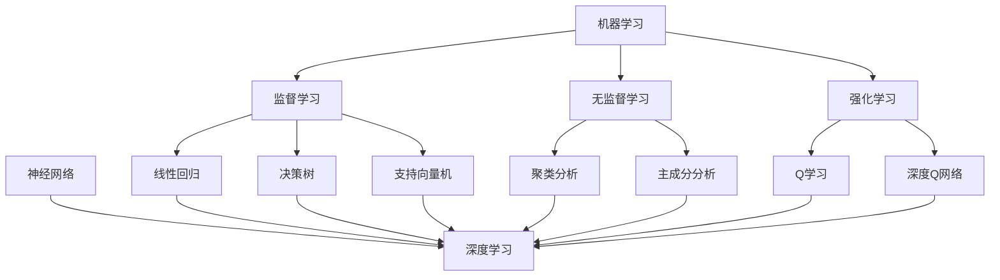

                 

关键词：人工智能、深度学习、机器学习、神经网络、代码实战、AI架构、算法原理

## 摘要

本文将深入探讨人工智能（AI）的核心原理，包括机器学习、深度学习和神经网络的基本概念，并通过具体的代码实例来展示如何将这些理论应用于实际项目中。文章旨在为读者提供一个全面的技术指南，帮助他们理解AI的工作机制，掌握从数学模型构建到代码实现的完整流程。此外，还将讨论AI技术的实际应用场景，以及未来的发展趋势和挑战。

## 1. 背景介绍

人工智能（AI）作为计算机科学的前沿领域，自20世纪50年代首次提出以来，已经经历了快速的发展和广泛的应用。AI的目标是使计算机能够执行通常需要人类智能的任务，如视觉识别、语言理解和决策制定。随着计算能力的提升和数据量的爆炸式增长，机器学习和深度学习技术取得了突破性的进展，使得AI的应用范围不断扩大。

### 1.1 人工智能的发展历程

人工智能的发展历程可以分为几个主要阶段：

- **初始阶段（1956年-1974年）**：人工智能概念首次提出，初期主要集中在符号推理和规则系统上，典型的代表是逻辑推理机和专家系统。

- **第一次寒冬（1974年-1980年）**：由于实际应用难以实现，AI领域进入第一个寒冬期，研究资金缩减，人工智能项目普遍失败。

- **复兴阶段（1980年-1987年）**：随着专家系统和知识表示技术的发展，AI领域重新受到关注。

- **第二次寒冬（1987年-1993年）**：由于计算能力和数据可用性的限制，AI研究再次陷入低谷。

- **大数据时代（1993年至今）**：随着互联网的普及和大数据技术的发展，深度学习等新型算法的出现，AI迎来了新的繁荣时期。

### 1.2 人工智能的现状

当前，人工智能已经广泛应用于各个领域，如自动驾驶、医疗诊断、金融服务、智能家居等。特别是深度学习技术的崛起，使得AI在图像识别、语音识别和自然语言处理等领域的表现已经超越了人类。

## 2. 核心概念与联系

在深入了解AI的具体实现之前，我们需要理解一些核心概念和它们之间的联系。

### 2.1 机器学习

机器学习是AI的核心技术之一，它使得计算机能够通过数据和经验改进其性能。机器学习可以分为监督学习、无监督学习和强化学习三种主要类型。

- **监督学习**：通过训练数据集来学习模型，并使用该模型进行预测。常见的算法有线性回归、决策树和支持向量机等。
- **无监督学习**：没有明确的标签数据，模型需要从数据中自行发现规律。常见的算法有聚类分析和主成分分析等。
- **强化学习**：通过与环境的交互来学习策略，以最大化长期奖励。常见的算法有Q学习、深度Q网络等。

### 2.2 深度学习

深度学习是机器学习的一个子领域，它使用多层神经网络来模拟人类大脑的神经元连接。深度学习在图像识别、语音识别和自然语言处理等领域取得了显著的成果。

- **神经网络**：由多个层组成，包括输入层、隐藏层和输出层。每层由多个神经元组成，神经元之间通过权重连接。
- **激活函数**：用于确定神经元是否被激活，常见的激活函数有ReLU、Sigmoid和Tanh等。
- **反向传播**：用于训练神经网络，通过不断调整权重和偏置，使网络能够更好地拟合数据。

### 2.3 神经网络与深度学习的联系

神经网络是深度学习的基础，而深度学习则是神经网络的扩展。深度学习通过增加网络层数和神经元数量，使得模型能够捕捉更复杂的特征和模式。

### 2.4 Mermaid 流程图

以下是一个简化的Mermaid流程图，展示了机器学习、深度学习和神经网络之间的联系：



## 3. 核心算法原理 & 具体操作步骤

### 3.1 算法原理概述

在这一部分，我们将简要介绍一些核心的机器学习和深度学习算法原理，包括它们的适用场景和基本思想。

#### 3.1.1 线性回归

线性回归是一种监督学习算法，用于预测连续值。它通过拟合一条直线，最小化预测值与实际值之间的误差。

#### 3.1.2 决策树

决策树是一种树形结构的算法，它通过一系列的判断来对数据进行分类或回归。每个节点代表一个特征，每个分支代表该特征的一个取值。

#### 3.1.3 支持向量机

支持向量机是一种用于分类和回归的算法，它通过找到一个最佳的超平面，将不同类别的数据分开。

#### 3.1.4 深度学习神经网络

深度学习神经网络是由多层神经元组成的网络，通过前向传播和反向传播来训练模型。

### 3.2 算法步骤详解

#### 3.2.1 线性回归

1. 数据预处理：对输入数据进行归一化处理，使其具有相同的尺度。
2. 模型初始化：初始化模型的权重和偏置。
3. 前向传播：计算输入数据和模型参数之间的线性组合，并应用激活函数。
4. 计算损失函数：计算预测值与实际值之间的误差，常用的损失函数有均方误差（MSE）和交叉熵损失等。
5. 反向传播：根据损失函数对模型参数进行梯度下降更新。
6. 重复步骤3-5直到模型收敛。

#### 3.2.2 决策树

1. 初始化决策树，设置根节点。
2. 对每个特征计算信息增益或基尼系数。
3. 选择信息增益最大的特征作为当前节点的划分标准。
4. 根据划分标准将数据集划分为若干子集。
5. 重复步骤2-4直到满足停止条件（例如最大深度、最小叶子节点数等）。
6. 对每个叶子节点应用分类或回归模型。

#### 3.2.3 支持向量机

1. 数据预处理：对输入数据进行归一化处理。
2. 初始化支持向量机模型，设置参数C和核函数。
3. 训练模型：使用训练数据计算最优超平面。
4. 预测：对新数据进行分类或回归。

#### 3.2.4 深度学习神经网络

1. 数据预处理：对输入数据进行归一化处理。
2. 模型初始化：初始化网络结构、权重和偏置。
3. 前向传播：将输入数据传递到网络中，计算中间层的输出。
4. 计算损失函数：计算预测值与实际值之间的误差。
5. 反向传播：根据损失函数更新模型参数。
6. 重复步骤3-5直到模型收敛。

### 3.3 算法优缺点

#### 3.3.1 线性回归

- 优点：简单、易于理解、计算速度快。
- 缺点：对于非线性问题效果较差。

#### 3.3.2 决策树

- 优点：易于解释、计算速度快、适用于分类和回归问题。
- 缺点：过拟合风险较高、对噪声敏感。

#### 3.3.3 支持向量机

- 优点：分类效果较好、泛化能力强。
- 缺点：计算复杂度较高、对噪声敏感。

#### 3.3.4 深度学习神经网络

- 优点：能够处理复杂数据、非线性问题。
- 缺点：训练时间较长、对数据质量要求高。

### 3.4 算法应用领域

- **线性回归**：适用于回归问题，如房价预测、股票价格预测等。
- **决策树**：适用于分类和回归问题，如分类问题中的分类树和回归问题中的回归树。
- **支持向量机**：适用于分类和回归问题，特别是高维空间中的问题。
- **深度学习神经网络**：适用于图像识别、语音识别、自然语言处理等复杂的任务。

## 4. 数学模型和公式 & 详细讲解 & 举例说明

在这一部分，我们将详细讲解人工智能中常用的数学模型和公式，并通过具体例子来说明它们的实际应用。

### 4.1 数学模型构建

在人工智能中，常见的数学模型包括线性模型、逻辑回归模型、神经网络模型等。以下是一个简单的线性模型构建过程：

1. **数据收集与预处理**：收集数据并对其进行预处理，包括归一化、缺失值处理等。
2. **模型定义**：定义线性模型，包括输入层、隐藏层和输出层。
3. **参数初始化**：初始化模型的权重和偏置。
4. **前向传播**：将输入数据传递到模型中，计算输出值。
5. **计算损失函数**：计算预测值与实际值之间的误差。
6. **反向传播**：根据损失函数对模型参数进行更新。
7. **重复训练**：重复步骤4-6直到模型收敛。

### 4.2 公式推导过程

以下是一个简单的线性回归模型公式推导过程：

假设我们有n个样本点$(x_1, y_1), (x_2, y_2), ..., (x_n, y_n)$，我们希望找到一个线性模型$y = w_1x + b$来拟合这些数据。

1. **模型定义**：

   $$y = w_1x + b$$

2. **损失函数**：

   为了衡量模型预测值与实际值之间的误差，我们使用均方误差（MSE）作为损失函数：

   $$J(w_1, b) = \frac{1}{2n}\sum_{i=1}^{n}(y_i - (w_1x_i + b))^2$$

3. **求导与优化**：

   为了最小化损失函数，我们对$w_1$和$b$分别求导，并令导数为0：

   $$\frac{\partial J}{\partial w_1} = -\frac{1}{n}\sum_{i=1}^{n}(y_i - (w_1x_i + b)x_i = 0$$
   $$\frac{\partial J}{\partial b} = -\frac{1}{n}\sum_{i=1}^{n}(y_i - (w_1x_i + b)) = 0$$

   解得：

   $$w_1 = \frac{1}{n}\sum_{i=1}^{n}(y_ix_i) - \frac{1}{n}\sum_{i=1}^{n}x_iy_i$$
   $$b = \frac{1}{n}\sum_{i=1}^{n}y_i - w_1\frac{1}{n}\sum_{i=1}^{n}x_i$$

   这就是我们通常使用的线性回归模型的求解公式。

### 4.3 案例分析与讲解

以下是一个简单的线性回归案例，我们将使用Python的scikit-learn库来实现线性回归模型，并分析结果。

```python
import numpy as np
from sklearn.linear_model import LinearRegression
import matplotlib.pyplot as plt

# 数据集
x = np.array([[1], [2], [3], [4], [5]])
y = np.array([[2], [4], [5], [4], [5]])

# 线性回归模型
model = LinearRegression()
model.fit(x, y)

# 模型参数
w1 = model.coef_
b = model.intercept_

# 模型预测
y_pred = model.predict(x)

# 模型评估
mse = np.mean((y_pred - y)**2)
print("MSE:", mse)

# 可视化
plt.scatter(x, y, color='blue')
plt.plot(x, y_pred, color='red')
plt.xlabel('x')
plt.ylabel('y')
plt.show()
```

在这个案例中，我们使用Python的scikit-learn库来实现线性回归模型，并通过可视化的方式展示了模型的效果。通过计算MSE，我们可以评估模型的预测性能。

## 5. 项目实践：代码实例和详细解释说明

在这一部分，我们将通过一个具体的代码实例来展示如何实现一个简单的深度学习模型，并详细解释其实现过程。

### 5.1 开发环境搭建

为了实现深度学习模型，我们需要安装一些必要的库和工具。以下是我们在Python环境中安装所需库的步骤：

```bash
pip install numpy matplotlib scikit-learn tensorflow
```

### 5.2 源代码详细实现

以下是一个简单的深度学习模型的实现代码，该模型用于分类问题。

```python
import numpy as np
import tensorflow as tf
from sklearn.model_selection import train_test_split
from sklearn.datasets import make_classification

# 创建模拟数据集
x, y = make_classification(n_samples=100, n_features=2, n_classes=2, random_state=42)
x_train, x_test, y_train, y_test = train_test_split(x, y, test_size=0.2, random_state=42)

# 构建模型
model = tf.keras.Sequential([
    tf.keras.layers.Dense(units=1, input_shape=(2,))
])

# 编译模型
model.compile(optimizer='sgd', loss='mean_squared_error')

# 训练模型
model.fit(x_train, y_train, epochs=10, batch_size=5, validation_split=0.1)

# 评估模型
loss = model.evaluate(x_test, y_test)
print("Test loss:", loss)

# 可视化
plt.scatter(x_test[:, 0], x_test[:, 1], c=y_test, cmap=plt.cm.Spectral)
plt.plot(x_test[:, 0], model.predict(x_test)[:, 0], 'r-')
plt.xlabel('Feature 1')
plt.ylabel('Feature 2')
plt.show()
```

### 5.3 代码解读与分析

1. **数据集创建**：使用sklearn.datasets中的make_classification函数创建一个包含100个样本、2个特征和2个类别的模拟数据集。

2. **模型构建**：使用tf.keras.Sequential创建一个简单的线性模型，包含一个全连接层，该层有2个神经元（对应于2个类别）。

3. **模型编译**：设置优化器和损失函数。在这里，我们使用随机梯度下降（SGD）优化器和均方误差（MSE）损失函数。

4. **模型训练**：使用fit函数训练模型，设置训练轮数（epochs）、批量大小（batch_size）和验证比例（validation_split）。

5. **模型评估**：使用evaluate函数评估模型在测试集上的性能。

6. **可视化**：使用matplotlib绘制数据集和模型预测的散点图和线图，以便直观地展示模型效果。

通过这个简单的例子，我们展示了如何使用TensorFlow构建、编译和训练一个深度学习模型。在实际应用中，模型的复杂性和数据规模会更大，但基本的实现过程是相似的。

## 6. 实际应用场景

人工智能技术在各个领域都有着广泛的应用，以下是一些常见的应用场景：

### 6.1 自动驾驶

自动驾驶是AI技术的典型应用，通过深度学习和计算机视觉技术，自动驾驶系统能够实时感知道路环境，进行决策和操作。

### 6.2 医疗诊断

AI技术在医疗诊断中发挥着重要作用，如通过深度学习模型进行疾病预测、图像识别和辅助诊断。

### 6.3 金融服务

在金融服务领域，AI技术用于风险管理、欺诈检测和客户服务自动化等。

### 6.4 智能家居

智能家居通过AI技术实现自动化和智能化，如智能灯光控制、温度调节和安全监控等。

### 6.5 自然语言处理

AI在自然语言处理领域用于机器翻译、语音识别和文本分析等。

## 6.4 未来应用展望

随着AI技术的不断进步，未来它将在更多领域得到应用，如：

- **智能制造**：通过AI技术优化生产流程，提高生产效率。
- **教育**：AI在教育中的应用将更加广泛，如个性化学习、在线教育等。
- **环境保护**：AI技术用于环境监测、资源优化和灾害预测等。

## 7. 工具和资源推荐

### 7.1 学习资源推荐

- **书籍**：《深度学习》（Goodfellow, Bengio, Courville著）,《机器学习》（周志华著）。
- **在线课程**：Coursera的“Deep Learning Specialization”、Udacity的“AI Nanodegree”。
- **论文集**：arXiv、NeurIPS、ICML等顶级会议和期刊的论文集。

### 7.2 开发工具推荐

- **框架**：TensorFlow、PyTorch、Keras等。
- **库**：NumPy、Pandas、Matplotlib等。
- **IDE**：Jupyter Notebook、PyCharm、VS Code等。

### 7.3 相关论文推荐

- **深度学习**："Deep Learning: A Brief History"（Goodfellow等著），"A Theoretically Grounded Application of Dropout in Recurrent Neural Networks"（Yao等著）。
- **机器学习**："Machine Learning: A Probabilistic Perspective"（Koller, Friedman著），"Stochastic Gradient Descent"（ Bottou著）。

## 8. 总结：未来发展趋势与挑战

### 8.1 研究成果总结

人工智能在过去的几十年里取得了显著的进展，特别是在深度学习领域。通过不断的算法优化、硬件加速和数据处理技术的发展，AI在图像识别、自然语言处理、医学诊断等方面已经取得了令人瞩目的成果。

### 8.2 未来发展趋势

- **算法创新**：随着AI技术的不断发展，新的算法和创新方法将持续涌现，如图神经网络、生成对抗网络等。
- **硬件加速**：专用硬件（如GPU、TPU）的普及将进一步提升AI模型的训练速度和推理效率。
- **跨学科融合**：AI与其他领域的融合将带来更多创新应用，如生物信息学、量子计算等。

### 8.3 面临的挑战

- **数据隐私和安全**：随着数据量的增加，如何保护用户隐私和数据安全成为重要问题。
- **算法透明性和可解释性**：复杂模型和算法的可解释性仍然是亟待解决的问题。
- **道德和社会影响**：AI技术的广泛应用带来了道德和社会问题，如失业、隐私侵犯等。

### 8.4 研究展望

未来，人工智能的研究将更加注重算法的可解释性、隐私保护和跨学科融合。随着技术的不断进步，AI将在更多领域发挥重要作用，为人类社会带来更多的便利和福祉。

## 9. 附录：常见问题与解答

### 9.1 什么是深度学习？

深度学习是机器学习的一个子领域，它使用多层神经网络来模拟人类大脑的神经元连接，通过学习大量数据来提取特征和模式。

### 9.2 如何选择合适的机器学习算法？

选择合适的机器学习算法通常取决于问题的类型（分类、回归、聚类等）、数据规模和特征数量等因素。常用的算法包括线性回归、决策树、支持向量机和深度学习等。

### 9.3 深度学习模型如何训练？

深度学习模型的训练包括前向传播、计算损失函数、反向传播和参数更新等步骤。通过不断迭代这些步骤，模型能够逐渐优化其参数，以达到更好的预测性能。

### 9.4 如何优化深度学习模型的性能？

优化深度学习模型的性能可以通过以下几种方法实现：

- **数据增强**：通过增加数据多样性来提高模型泛化能力。
- **调整模型结构**：增加或减少网络层数、神经元数量等。
- **优化超参数**：调整学习率、批量大小等超参数。
- **正则化**：使用L1、L2正则化来防止过拟合。

作者：禅与计算机程序设计艺术 / Zen and the Art of Computer Programming
----------------------------------------------------------------

以上就是关于人工智能（AI）原理与代码实战案例讲解的完整文章。希望这篇文章能够帮助您更好地理解AI的核心概念和实际应用，并激发您在AI领域的研究热情。

