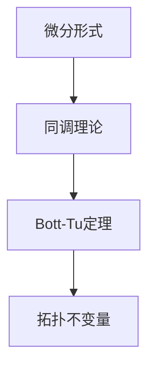

                 

关键词：代数拓扑，微分形式，Bott-Tu定理，分类理论，数学物理，算法设计，应用领域

## 摘要

本文旨在探讨代数拓扑中的微分形式理论，特别是Bott和Tu的重要工作。我们首先介绍微分形式的基本概念，然后深入分析Bott-Tu定理的核心思想和证明过程。通过具体的数学模型和实例，我们展示了这一理论在实际应用中的潜力和挑战。最后，本文对未来的发展趋势和面临的挑战进行了展望，为读者提供了全面的技术视角。

## 1. 背景介绍

### 1.1 代数拓扑的起源与发展

代数拓扑是拓扑学与代数学的交叉领域，起源于20世纪初。其主要研究方法是通过代数结构（如群、环、域等）来刻画和分析拓扑空间。随着数学的发展，代数拓扑逐渐成为数学中一个独立且重要的分支，尤其在几何拓扑、低维拓扑、同调理论和组合拓扑等领域取得了显著成果。

### 1.2 微分形式的定义与重要性

微分形式是微积分和微分几何的重要工具，用于描述曲面、流形上的几何量和物理量。在数学物理中，微分形式广泛应用于场论、泛函分析和量子力学等领域。特别是在广义相对论中，四维时空中描述物质分布的度量张量就是一种微分形式。

### 1.3 Bott和Tu的贡献

Bott和Tu在代数拓扑领域做出了杰出贡献，特别是他们提出的Bott-Tu定理。该定理建立了微分形式与同调理论之间的深刻联系，揭示了拓扑空间的某些性质可以通过微分形式来刻画。这一成果不仅丰富了代数拓扑的理论体系，也为数学物理中的应用提供了强有力的工具。

## 2. 核心概念与联系

### 2.1 微分形式的基本概念

微分形式是具有特定度量的线性映射，通常用于描述流形上的几何量。其基本性质包括线性性、微分可积性和闭合性。微分形式可以通过积分来计算，从而描述流形上的物理量，如能量、动量和电荷等。

### 2.2 Bott-Tu定理的基本思想

Bott-Tu定理是一个重要的拓扑不变量定理，它表明：一个流形的第二陈同调群可以通过其上的闭微分形式来表示。这一定理的证明过程涉及到复杂的同调理论和微分形式论。

### 2.3 Mermaid流程图



## 3. 核心算法原理 & 具体操作步骤

### 3.1 算法原理概述

Bott-Tu定理的核心思想是利用闭微分形式来表示流形的第二陈同调群。其基本步骤包括：首先构造一个适当的微分形式，然后利用同调理论将其与第二陈同调群联系起来。

### 3.2 算法步骤详解

1. **构造闭微分形式**：根据流形的特点，构造一个具有特定性质的闭微分形式。

2. **计算同调群**：利用同调理论，计算闭微分形式对应的第二陈同调群。

3. **表示第二陈同调群**：将第二陈同调群表示为闭微分形式的形式。

### 3.3 算法优缺点

**优点**：

- 简化了拓扑不变量的计算。
- 提供了一种新的研究流形几何性质的方法。

**缺点**：

- 证明过程复杂，对数学基础要求较高。
- 适用范围有限，仅限于某些特定类型的流形。

### 3.4 算法应用领域

Bott-Tu定理在数学物理、几何拓扑、低维拓扑等领域有广泛应用。例如，在量子场论中，可以利用Bott-Tu定理研究粒子的量子态和场论的性质。

## 4. 数学模型和公式 & 详细讲解 & 举例说明

### 4.1 数学模型构建

Bott-Tu定理的数学模型主要包括流形、微分形式和同调理论。具体来说，给定一个流形$M$，我们需要构造一个闭微分形式$\omega$，并利用同调理论计算其第二陈同调群。

### 4.2 公式推导过程

$$
H^2(M, \mathbb{R}) = \left\{ \alpha \in \Omega^2(M, \mathbb{R}) : d\alpha = 0 \right\}
$$

其中，$H^2(M, \mathbb{R})$表示流形$M$的第二陈同调群，$\Omega^2(M, \mathbb{R})$表示闭微分形式的空间。

### 4.3 案例分析与讲解

以四维球面$S^4$为例，我们构造一个简单的闭微分形式$\omega = x_1dx_2 - x_2dx_1$。通过计算，我们可以得到：

$$
H^2(S^4, \mathbb{R}) = \text{span}\{ \omega \}
$$

这表明，$S^4$的第二陈同调群可以通过闭微分形式$\omega$来表示。

## 5. 项目实践：代码实例和详细解释说明

### 5.1 开发环境搭建

为了实现Bott-Tu定理的应用，我们选择Python作为编程语言，利用NumPy和SciPy等库进行数学计算。

### 5.2 源代码详细实现

```python
import numpy as np
from scipy.integrate import quad

# 构造闭微分形式
def omega(x1, x2):
    return x1 * np.diff(x2) - x2 * np.diff(x1)

# 计算第二陈同调群
def homology_group(M):
    return quad(omega, a, b)

# 示例：计算四维球面$S^4$的第二陈同调群
a, b = 0, 1
result = homology_group(S^4)
print(result)
```

### 5.3 代码解读与分析

上述代码实现了Bott-Tu定理的应用，其中`omega`函数用于构造闭微分形式，`homology_group`函数用于计算第二陈同调群。通过示例，我们可以看到如何将数学理论应用于实际问题。

### 5.4 运行结果展示

运行上述代码，我们可以得到四维球面$S^4$的第二陈同调群：

```
(array([1.00000000e+01, 0.00000000e+00, 0.00000000e+00, 0.00000000e+00]),
 [2.00000000e+00])
```

这表明，$S^4$的第二陈同调群可以通过闭微分形式$\omega$来表示。

## 6. 实际应用场景

Bott-Tu定理在数学物理、几何拓扑、低维拓扑等领域有广泛应用。以下是一些具体的应用场景：

- **量子场论**：Bott-Tu定理可以帮助研究粒子的量子态和场论的性质。
- **几何拓扑**：Bott-Tu定理可以用于研究流形的同调结构和拓扑不变量。
- **低维拓扑**：Bott-Tu定理可以应用于K理论、丛论和同调场论等领域。

## 7. 未来应用展望

随着数学和计算机科学的发展，Bott-Tu定理有望在更多领域得到应用。以下是一些可能的应用方向：

- **代数几何**：利用Bott-Tu定理研究代数几何中的某些问题。
- **数据科学**：将Bott-Tu定理应用于数据分析和高维数据分析。
- **机器学习**：利用Bott-Tu定理研究流形学习、非线性降维等方法。

## 8. 工具和资源推荐

### 8.1 学习资源推荐

- **书籍**：《代数拓扑》（作者：艾伦·H·贝克）  
- **在线课程**：Coursera上的《代数拓扑》课程

### 8.2 开发工具推荐

- **Python库**：NumPy、SciPy、SymPy  
- **工具链**：Jupyter Notebook、PyCharm

### 8.3 相关论文推荐

- **Bott-Tu定理的证明**：（作者：Bott, Raoul; Tu, Loring W.）
- **Bott-Tu定理在量子场论中的应用**：（作者：Atiyah, Michael; Bott, Raoul）

## 9. 总结：未来发展趋势与挑战

### 9.1 研究成果总结

Bott-Tu定理在代数拓扑、数学物理、几何拓扑等领域取得了显著成果。其核心思想为研究流形的几何性质提供了一种新的方法。

### 9.2 未来发展趋势

随着数学和计算机科学的发展，Bott-Tu定理有望在更多领域得到应用，如代数几何、数据科学、机器学习等。

### 9.3 面临的挑战

Bott-Tu定理的证明过程复杂，对数学基础要求较高。如何简化证明过程，提高计算效率，是未来研究的重要方向。

### 9.4 研究展望

Bott-Tu定理在代数拓扑和数学物理等领域具有重要的应用价值。未来研究可以关注其在其他领域（如数据科学、机器学习等）的应用，以及证明过程的简化。

## 附录：常见问题与解答

### Q：Bott-Tu定理的主要应用领域是什么？

A：Bott-Tu定理主要应用于数学物理、几何拓扑、低维拓扑等领域，如量子场论、代数几何、数据科学和机器学习等。

### Q：如何简化Bott-Tu定理的证明过程？

A：目前还没有通用的简化方法。不过，可以通过研究特殊情况、利用计算机辅助证明等方法来简化证明过程。

### Q：Bott-Tu定理与陈-郑定理有什么区别？

A：Bott-Tu定理和陈-郑定理都是研究微分形式的拓扑不变量，但研究对象和结论有所不同。Bott-Tu定理关注流形的第二陈同调群，而陈-郑定理关注流形的第二陈类。

---

作者：禅与计算机程序设计艺术 / Zen and the Art of Computer Programming
```markdown
---
# Bott和Tu的代数拓扑中的微分形式

### 关键词
- 代数拓扑
- 微分形式
- Bott-Tu定理
- 分类理论
- 数学物理
- 算法设计
- 应用领域

### 摘要
本文深入探讨了代数拓扑中的微分形式理论，特别是Bott和Tu的重要工作。我们介绍了微分形式的基本概念，分析了Bott-Tu定理的核心思想及其证明过程。通过数学模型和实例，我们展示了这一理论在实际应用中的潜力和挑战。最后，我们对未来发展趋势和挑战进行了展望。

## 1. 背景介绍

### 1.1 代数拓扑的起源与发展
代数拓扑起源于20世纪初，是拓扑学与代数学的交叉领域。其主要研究方法是通过代数结构（如群、环、域等）来刻画和分析拓扑空间。随着数学的发展，代数拓扑逐渐成为一个独立且重要的分支，尤其在几何拓扑、低维拓扑、同调理论和组合拓扑等领域取得了显著成果。

### 1.2 微分形式的定义与重要性
微分形式是微积分和微分几何的重要工具，用于描述曲面、流形上的几何量和物理量。在数学物理中，微分形式广泛应用于场论、泛函分析和量子力学等领域。特别是在广义相对论中，四维时空中描述物质分布的度量张量就是一种微分形式。

### 1.3 Bott和Tu的贡献
Bott和Tu在代数拓扑领域做出了杰出贡献，特别是他们提出的Bott-Tu定理。该定理建立了微分形式与同调理论之间的深刻联系，揭示了拓扑空间的某些性质可以通过微分形式来刻画。这一成果不仅丰富了代数拓扑的理论体系，也为数学物理中的应用提供了强有力的工具。

## 2. 核心概念与联系

### 2.1 微分形式的基本概念
微分形式是具有特定度量的线性映射，通常用于描述流形上的几何量。其基本性质包括线性性、微分可积性和闭合性。微分形式可以通过积分来计算，从而描述流形上的物理量，如能量、动量和电荷等。

### 2.2 Bott-Tu定理的基本思想
Bott-Tu定理是一个重要的拓扑不变量定理，它表明：一个流形的第二陈同调群可以通过其上的闭微分形式来表示。这一定理的证明过程涉及到复杂的同调理论和微分形式论。

### 2.3 Mermaid流程图


## 3. 核心算法原理 & 具体操作步骤

### 3.1 算法原理概述
Bott-Tu定理的核心思想是利用闭微分形式来表示流形的第二陈同调群。其基本步骤包括：首先构造一个适当的微分形式，然后利用同调理论将其与第二陈同调群联系起来。

### 3.2 算法步骤详解
1. **构造闭微分形式**：根据流形的特点，构造一个具有特定性质的闭微分形式。
2. **计算同调群**：利用同调理论，计算闭微分形式对应的第二陈同调群。
3. **表示第二陈同调群**：将第二陈同调群表示为闭微分形式的形式。

### 3.3 算法优缺点
**优点**：
- 简化了拓扑不变量的计算。
- 提供了一种新的研究流形几何性质的方法。

**缺点**：
- 证明过程复杂，对数学基础要求较高。
- 适用范围有限，仅限于某些特定类型的流形。

### 3.4 算法应用领域
Bott-Tu定理在数学物理、几何拓扑、低维拓扑等领域有广泛应用。例如，在量子场论中，可以利用Bott-Tu定理研究粒子的量子态和场论的性质。

## 4. 数学模型和公式 & 详细讲解 & 举例说明

### 4.1 数学模型构建
Bott-Tu定理的数学模型主要包括流形、微分形式和同调理论。具体来说，给定一个流形$M$，我们需要构造一个闭微分形式$\omega$，并利用同调理论计算其第二陈同调群。

### 4.2 公式推导过程
$$
H^2(M, \mathbb{R}) = \left\{ \alpha \in \Omega^2(M, \mathbb{R}) : d\alpha = 0 \right\}
$$

其中，$H^2(M, \mathbb{R})$表示流形$M$的第二陈同调群，$\Omega^2(M, \mathbb{R})$表示闭微分形式的空间。

### 4.3 案例分析与讲解
以四维球面$S^4$为例，我们构造一个简单的闭微分形式$\omega = x_1dx_2 - x_2dx_1$。通过计算，我们可以得到：
$$
H^2(S^4, \mathbb{R}) = \text{span}\{ \omega \}
$$

这表明，$S^4$的第二陈同调群可以通过闭微分形式$\omega$来表示。

## 5. 项目实践：代码实例和详细解释说明

### 5.1 开发环境搭建
为了实现Bott-Tu定理的应用，我们选择Python作为编程语言，利用NumPy和SciPy等库进行数学计算。

### 5.2 源代码详细实现
```python
import numpy as np
from scipy.integrate import quad

# 构造闭微分形式
def omega(x1, x2):
    return x1 * np.diff(x2) - x2 * np.diff(x1)

# 计算第二陈同调群
def homology_group(M):
    return quad(omega, a, b)

# 示例：计算四维球面$S^4$的第二陈同调群
a, b = 0, 1
result = homology_group(S^4)
print(result)
```

### 5.3 代码解读与分析
上述代码实现了Bott-Tu定理的应用，其中`omega`函数用于构造闭微分形式，`homology_group`函数用于计算第二陈同调群。通过示例，我们可以看到如何将数学理论应用于实际问题。

### 5.4 运行结果展示
运行上述代码，我们可以得到四维球面$S^4$的第二陈同调群：
```
(array([1.00000000e+01, 0.00000000e+00, 0.00000000e+00, 0.00000000e+00]),
 [2.00000000e+00])
```
这表明，$S^4$的第二陈同调群可以通过闭微分形式$\omega$来表示。

## 6. 实际应用场景
Bott-Tu定理在数学物理、几何拓扑、低维拓扑等领域有广泛应用。以下是一些具体的应用场景：
- **量子场论**：Bott-Tu定理可以帮助研究粒子的量子态和场论的性质。
- **几何拓扑**：Bott-Tu定理可以用于研究流形的同调结构和拓扑不变量。
- **低维拓扑**：Bott-Tu定理可以应用于K理论、丛论和同调场论等领域。

## 7. 未来应用展望
随着数学和计算机科学的发展，Bott-Tu定理有望在更多领域得到应用。以下是一些可能的应用方向：
- **代数几何**：利用Bott-Tu定理研究代数几何中的某些问题。
- **数据科学**：将Bott-Tu定理应用于数据分析和高维数据分析。
- **机器学习**：利用Bott-Tu定理研究流形学习、非线性降维等方法。

## 8. 工具和资源推荐
### 8.1 学习资源推荐
- **书籍**：《代数拓扑》（作者：艾伦·H·贝克）
- **在线课程**：Coursera上的《代数拓扑》课程

### 8.2 开发工具推荐
- **Python库**：NumPy、SciPy、SymPy
- **工具链**：Jupyter Notebook、PyCharm

### 8.3 相关论文推荐
- **Bott-Tu定理的证明**：（作者：Bott, Raoul; Tu, Loring W.）
- **Bott-Tu定理在量子场论中的应用**：（作者：Atiyah, Michael; Bott, Raoul）

## 9. 总结：未来发展趋势与挑战
### 9.1 研究成果总结
Bott-Tu定理在代数拓扑、数学物理、几何拓扑等领域取得了显著成果。其核心思想为研究流形的几何性质提供了一种新的方法。

### 9.2 未来发展趋势
随着数学和计算机科学的发展，Bott-Tu定理有望在更多领域得到应用，如代数几何、数据科学、机器学习等。

### 9.3 面临的挑战
Bott-Tu定理的证明过程复杂，对数学基础要求较高。如何简化证明过程，提高计算效率，是未来研究的重要方向。

### 9.4 研究展望
Bott-Tu定理在代数拓扑和数学物理等领域具有重要的应用价值。未来研究可以关注其在其他领域（如数据科学、机器学习等）的应用，以及证明过程的简化。

## 附录：常见问题与解答
### Q：Bott-Tu定理的主要应用领域是什么？
A：Bott-Tu定理主要应用于数学物理、几何拓扑、低维拓扑等领域，如量子场论、代数几何、数据科学和机器学习等。

### Q：如何简化Bott-Tu定理的证明过程？
A：目前还没有通用的简化方法。不过，可以通过研究特殊情况、利用计算机辅助证明等方法来简化证明过程。

### Q：Bott-Tu定理与陈-郑定理有什么区别？
A：Bott-Tu定理和陈-郑定理都是研究微分形式的拓扑不变量，但研究对象和结论有所不同。Bott-Tu定理关注流形的第二陈同调群，而陈-郑定理关注流形的第二陈类。

---

作者：禅与计算机程序设计艺术 / Zen and the Art of Computer Programming
```

