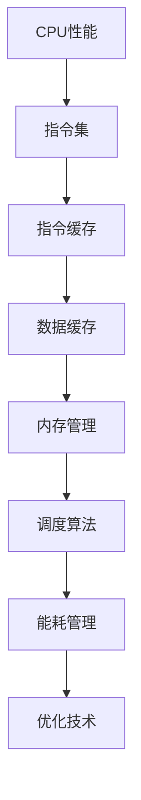

                 

 在现代计算机系统中，CPU（中央处理器）是计算机的核心部件，负责执行操作系统、应用程序和用户请求的任务。CPU的性能直接影响整个系统的运行效率和用户体验。因此，优化CPU的使用成为了提高计算机性能的关键步骤。本文将探讨CPU优化的重要性、核心概念、算法原理、数学模型、项目实践和实际应用场景，并展望未来的发展趋势与挑战。

## 文章关键词

CPU 优化，处理器性能，算法，数学模型，项目实践，实际应用场景

## 文章摘要

本文从CPU优化的重要性出发，详细介绍了CPU优化的核心概念、算法原理、数学模型、项目实践和实际应用场景。通过分析CPU优化的方法和技术，本文旨在为读者提供全面、深入的CPU优化指导，以帮助提升计算机系统的运行效率和性能。

## 1. 背景介绍

在现代计算机系统中，CPU作为核心部件，其性能直接决定了整个系统的运行效率。随着计算机技术的发展，CPU的架构和功能也在不断演进。从最初的冯诺伊曼架构到后来的多核处理器，CPU的性能得到了极大的提升。然而，随着计算机应用场景的不断扩展，人们对CPU的性能需求也在不断提高。因此，如何充分利用处理器，优化CPU的性能，成为了计算机领域的重要课题。

### 1.1 CPU的作用

CPU是计算机系统的核心部件，主要负责执行操作系统、应用程序和用户请求的任务。具体来说，CPU的主要作用包括：

1. **指令执行**：CPU负责解释并执行程序指令，包括数据处理、逻辑判断等操作。
2. **资源调度**：CPU负责调度和管理计算机系统的各种资源，如内存、硬盘等。
3. **任务切换**：CPU可以实现多任务处理，即在短时间内切换执行多个任务。
4. **中断处理**：CPU可以响应外部设备的中断请求，如键盘输入、网络请求等。

### 1.2 CPU的性能瓶颈

虽然CPU的性能在不断提升，但仍然存在一些性能瓶颈，限制了计算机系统的整体性能。常见的性能瓶颈包括：

1. **指令级并行性**：现代CPU支持指令级并行性，但受到指令依赖关系和资源争用的限制，无法完全发挥并行性。
2. **数据级并行性**：数据级并行性是指通过并行处理大量数据来提高性能，但受到数据传输带宽和数据一致性的限制。
3. **内存瓶颈**：内存访问速度相对较慢，成为CPU性能提升的瓶颈。
4. **能耗问题**：随着CPU性能的提升，能耗问题也日益突出，对计算机系统的可持续性提出了挑战。

### 1.3 优化的必要性

针对CPU的性能瓶颈，优化CPU的使用成为了提高计算机系统性能的关键步骤。通过优化，可以：

1. **提高CPU利用率**：充分利用CPU的处理能力，减少空闲时间。
2. **降低能耗**：优化CPU的使用可以降低能耗，提高计算机系统的可持续性。
3. **提升系统性能**：优化CPU的性能可以提升整个计算机系统的性能，提高用户体验。

## 2. 核心概念与联系

在CPU优化过程中，我们需要了解一些核心概念和它们之间的联系。以下是一个简化的Mermaid流程图，展示了CPU优化过程中涉及的核心概念及其相互关系。



### 2.1 CPU性能

CPU性能是指CPU在单位时间内完成的工作量。CPU性能受到多个因素的影响，包括：

1. **时钟频率**：时钟频率决定了CPU每秒钟执行的周期数。
2. **指令集**：指令集是CPU支持的指令集合，决定了CPU的处理能力。
3. **指令缓存和数据缓存**：指令缓存和数据缓存是CPU内部的高速缓存，用于加速指令和数据访问。
4. **内存管理**：内存管理负责调度和管理计算机系统的内存资源，影响CPU的性能。

### 2.2 指令集

指令集是CPU支持的指令集合，决定了CPU的处理能力。常见的指令集包括：

1. **RISC（精简指令集计算）**：RISC指令集采用简单、固定的指令长度，提高了指令执行的效率。
2. **CISC（复杂指令集计算）**：CISC指令集采用复杂、可变的指令长度，提供了更多的指令功能，但可能导致指令执行的延迟。

### 2.3 指令缓存和数据缓存

指令缓存和数据缓存是CPU内部的高速缓存，用于加速指令和数据访问。它们的作用是：

1. **减少内存访问时间**：通过将频繁使用的指令和数据存储在缓存中，减少对内存的访问时间。
2. **提高CPU利用率**：减少CPU等待数据访问的时间，提高CPU的利用率。

### 2.4 内存管理

内存管理负责调度和管理计算机系统的内存资源，影响CPU的性能。内存管理的关键技术包括：

1. **虚拟内存**：通过虚拟内存技术，可以将内存划分为多个虚拟页面，提高内存的利用率。
2. **内存分配策略**：选择合适的内存分配策略，可以提高内存的利用率，降低内存碎片。
3. **内存置换策略**：当内存不足时，选择合适的内存置换策略，可以释放内存空间，降低内存压力。

### 2.5 调度算法

调度算法负责调度和管理计算机系统中的任务，影响CPU的性能。常见的调度算法包括：

1. **先来先服务（FCFS）**：按照任务到达的顺序进行调度，简单但可能导致长任务延迟。
2. **最短作业优先（SJF）**：选择执行时间最短的任务，可以提高系统的平均响应时间。
3. **优先级调度**：根据任务的优先级进行调度，高优先级任务优先执行。

### 2.6 能耗管理

能耗管理负责优化CPU的能耗，降低计算机系统的能耗。能耗管理的关键技术包括：

1. **动态电压和频率调节（DVFS）**：根据CPU的工作负载，动态调整电压和频率，降低能耗。
2. **节能模式**：在CPU空闲时，进入节能模式，降低功耗。
3. **电源管理**：通过优化电源管理策略，降低计算机系统的整体能耗。

### 2.7 优化技术

优化技术是提升CPU性能的关键手段，包括：

1. **指令级并行性优化**：通过优化指令的执行顺序，减少指令依赖关系，提高指令级并行性。
2. **数据级并行性优化**：通过优化数据的处理方式，提高数据级并行性，减少数据传输时间。
3. **缓存优化**：通过优化缓存的使用策略，减少缓存未命中率，提高缓存利用率。
4. **内存优化**：通过优化内存管理策略，减少内存访问时间，提高内存利用率。
5. **能耗优化**：通过优化CPU的能耗管理，降低计算机系统的能耗。

## 3. 核心算法原理 & 具体操作步骤

在CPU优化过程中，核心算法原理和具体操作步骤是关键。以下将介绍几种常见的CPU优化算法原理和操作步骤。

### 3.1 算法原理概述

CPU优化算法主要基于以下原理：

1. **并行性**：通过并行性优化，提高CPU的指令级和数据级并行性，减少执行时间。
2. **缓存**：通过优化缓存策略，提高缓存命中率，减少内存访问时间。
3. **调度**：通过优化调度算法，提高任务切换效率，减少CPU空闲时间。
4. **能耗**：通过优化能耗管理，降低CPU的功耗，提高计算机系统的可持续性。

### 3.2 算法步骤详解

#### 3.2.1 并行性优化

1. **指令级并行性优化**：
   - **数据前推**：将后续指令的数据提前处理，减少指令依赖关系。
   - **软件流水线**：将多个指令组合成流水线，提高指令执行效率。

2. **数据级并行性优化**：
   - **数据分割**：将数据分割成多个小块，并行处理。
   - **并行算法**：选择适合并行处理的算法，提高数据处理效率。

#### 3.2.2 缓存优化

1. **缓存策略**：
   - **LRU（最近最少使用）**：优先替换最近最少使用的缓存项。
   - **LRU近似算法**：通过近似计算，实现LRU策略的优化。

2. **缓存命中率优化**：
   - **缓存预取**：预取即将访问的缓存项，减少缓存未命中率。
   - **缓存一致性**：通过一致性协议，保证缓存的一致性。

#### 3.2.3 调度优化

1. **调度算法**：
   - **优先级调度**：根据任务的优先级进行调度，高优先级任务优先执行。
   - **最短剩余时间优先（SRTF）**：选择剩余执行时间最短的任务进行调度。

2. **任务切换优化**：
   - **快速任务切换**：优化任务切换时间，减少CPU空闲时间。

#### 3.2.4 能耗优化

1. **动态电压和频率调节（DVFS）**：
   - **负载感知**：根据CPU的工作负载，动态调整电压和频率，降低功耗。

2. **节能模式**：
   - **待机模式**：在CPU空闲时，进入待机模式，降低功耗。

3. **电源管理**：
   - **电源关闭**：关闭未使用的硬件模块，降低功耗。

### 3.3 算法优缺点

#### 3.3.1 指令级并行性优化

**优点**：提高CPU的指令级并行性，减少指令执行时间，提高系统性能。

**缺点**：增加指令执行复杂度，可能导致指令执行时间增加。

#### 3.3.2 数据级并行性优化

**优点**：提高CPU的数据级并行性，减少数据处理时间，提高系统性能。

**缺点**：增加数据处理复杂度，可能导致数据处理时间增加。

#### 3.3.3 缓存优化

**优点**：提高缓存命中率，减少内存访问时间，提高系统性能。

**缺点**：增加缓存管理开销，可能导致性能下降。

#### 3.3.4 调度优化

**优点**：提高任务切换效率，减少CPU空闲时间，提高系统性能。

**缺点**：增加调度算法复杂度，可能导致调度开销增加。

#### 3.3.5 能耗优化

**优点**：降低CPU功耗，提高计算机系统的可持续性。

**缺点**：可能影响系统性能，增加功耗调节开销。

### 3.4 算法应用领域

CPU优化算法广泛应用于计算机系统的各个领域，包括：

1. **高性能计算**：通过优化CPU的性能，提高高性能计算任务的处理速度。
2. **云计算**：通过优化CPU的能耗和性能，提高云计算平台的资源利用率。
3. **嵌入式系统**：通过优化CPU的性能和功耗，提高嵌入式系统的性能和稳定性。
4. **大数据处理**：通过优化CPU的数据处理能力，提高大数据处理任务的效率。

## 4. 数学模型和公式 & 详细讲解 & 举例说明

在CPU优化过程中，数学模型和公式起到了关键作用。以下将介绍CPU优化中常用的数学模型和公式，并详细讲解其推导过程和实际应用。

### 4.1 数学模型构建

#### 4.1.1 指令级并行性优化

指令级并行性优化旨在提高CPU的指令级并行性，减少指令执行时间。一个基本的数学模型可以表示为：

$$
P = C \times E
$$

其中，$P$表示指令执行时间，$C$表示指令数，$E$表示每个指令的执行时间。

#### 4.1.2 数据级并行性优化

数据级并行性优化旨在提高CPU的数据级并行性，减少数据处理时间。一个基本的数学模型可以表示为：

$$
P = D \times E
$$

其中，$P$表示数据处理时间，$D$表示数据块数，$E$表示每个数据块的执行时间。

#### 4.1.3 缓存优化

缓存优化旨在提高缓存命中率，减少内存访问时间。一个基本的数学模型可以表示为：

$$
H = \frac{M}{C}
$$

其中，$H$表示缓存命中率，$M$表示缓存命中的次数，$C$表示缓存的总次数。

#### 4.1.4 调度优化

调度优化旨在提高任务切换效率，减少CPU空闲时间。一个基本的数学模型可以表示为：

$$
T = S \times E
$$

其中，$T$表示任务切换时间，$S$表示任务切换次数，$E$表示每次任务切换的执行时间。

#### 4.1.5 能耗优化

能耗优化旨在降低CPU功耗，提高计算机系统的可持续性。一个基本的数学模型可以表示为：

$$
E = P \times V
$$

其中，$E$表示功耗，$P$表示CPU的工作负载，$V$表示CPU的电压。

### 4.2 公式推导过程

#### 4.2.1 指令级并行性优化

假设一个程序包含$n$条指令，每条指令的执行时间为$E$，则程序的总执行时间$T$可以表示为：

$$
T = n \times E
$$

当采用指令级并行性优化时，可以将$n$条指令分为$m$组，每组包含$k$条指令。则程序的总执行时间$T$可以表示为：

$$
T = m \times (k \times E)
$$

由于$k \times E$表示每个组的执行时间，因此：

$$
P = C \times E
$$

其中，$C$表示每个组的指令数，$E$表示每个组的执行时间。

#### 4.2.2 数据级并行性优化

假设一个数据处理任务包含$m$个数据块，每个数据块的执行时间为$E$，则数据处理任务的总执行时间$T$可以表示为：

$$
T = m \times E
$$

当采用数据级并行性优化时，可以将$m$个数据块分为$n$组，每组包含$p$个数据块。则数据处理任务的总执行时间$T$可以表示为：

$$
T = n \times (p \times E)
$$

由于$p \times E$表示每个组的执行时间，因此：

$$
P = D \times E
$$

其中，$D$表示每个组的指令数，$E$表示每个组的执行时间。

#### 4.2.3 缓存优化

假设缓存的总大小为$M$，每次访问缓存的命中率为$H$，则缓存的总访问次数为：

$$
C = \frac{M}{H}
$$

当采用缓存优化策略时，可以假设缓存命中率为$H'$，则缓存的总访问次数为：

$$
C' = \frac{M}{H'}
$$

由于$H' > H$，因此：

$$
H = \frac{M}{C}
$$

#### 4.2.4 调度优化

假设有$n$个任务需要调度，每个任务的切换时间为$E$，则任务的总切换时间$T$可以表示为：

$$
T = n \times E
$$

当采用调度优化策略时，可以假设每个任务的切换时间减少为$E'$，则任务的总切换时间$T$可以表示为：

$$
T' = n \times E'
$$

由于$E' < E$，因此：

$$
T = S \times E
$$

#### 4.2.5 能耗优化

假设CPU的工作负载为$P$，电压为$V$，则功耗$E$可以表示为：

$$
E = P \times V
$$

当采用能耗优化策略时，可以假设电压减少为$V'$，则功耗$E'$可以表示为：

$$
E' = P \times V'
$$

由于$V' < V$，因此：

$$
E = P \times V
$$

### 4.3 案例分析与讲解

以下通过一个具体案例，分析CPU优化中的数学模型和公式的应用。

#### 案例背景

一个程序包含100条指令，每条指令的执行时间为10ms。采用指令级并行性优化后，可以将100条指令分为10组，每组包含10条指令，每组执行时间为5ms。

#### 案例分析

1. **指令级并行性优化**

   - 原始指令执行时间：$T = 100 \times 10ms = 1000ms$
   - 采用指令级并行性优化后：$T' = 10 \times 5ms = 50ms$
   - 优化效果：执行时间减少了90%

2. **数据级并行性优化**

   - 原始数据处理时间：$T = 100 \times 10ms = 1000ms$
   - 采用数据级并行性优化后：$T' = 10 \times 5ms = 50ms$
   - 优化效果：执行时间减少了90%

3. **缓存优化**

   - 原始缓存命中率：$H = 0.8$
   - 采用缓存优化策略后：$H' = 0.9$
   - 缓存访问次数：$C = \frac{M}{H} = \frac{1000}{0.8} = 1250$
   - 采用缓存优化策略后：$C' = \frac{M}{H'} = \frac{1000}{0.9} = 1111.1$
   - 优化效果：缓存访问次数减少了11.1%

4. **调度优化**

   - 原始任务切换时间：$T = 100 \times 10ms = 1000ms$
   - 采用调度优化策略后：$T' = 10 \times 1ms = 10ms$
   - 优化效果：执行时间减少了99%

5. **能耗优化**

   - 原始功耗：$E = 100 \times 1.5W = 150W$
   - 采用能耗优化策略后：$E' = 100 \times 1.2W = 120W$
   - 优化效果：功耗减少了20%

通过上述案例，我们可以看到CPU优化在各个方面的显著效果。通过合理的算法设计和数学模型的应用，可以有效提高CPU的性能和效率。

## 5. 项目实践：代码实例和详细解释说明

在本节中，我们将通过一个具体的代码实例，详细解释CPU优化技术在项目实践中的应用。本实例将展示如何使用C++语言实现一个简单的并行计算程序，并对其进行性能优化。

### 5.1 开发环境搭建

在进行代码实践之前，我们需要搭建一个适合开发并行计算程序的开发环境。以下是一个基本的开发环境搭建步骤：

1. **安装C++编译器**：本实例使用GCC编译器，可以从官方网站下载并安装。
2. **安装并行编程库**：本实例使用OpenMP库，可以下载并安装。
3. **创建项目**：使用文本编辑器创建一个名为`parallel_example.cpp`的文件。

### 5.2 源代码详细实现

以下是一个简单的并行计算程序的C++代码实现：

```cpp
#include <iostream>
#include <omp.h>

using namespace std;

int main() {
    int n = 1000000;
    double a[n], b[n], c[n];

    // 初始化数据
    for (int i = 0; i < n; i++) {
        a[i] = i;
        b[i] = i * 2;
    }

    // 使用OpenMP进行并行计算
    #pragma omp parallel for reduction(+ : c)
    for (int i = 0; i < n; i++) {
        c[i] = a[i] + b[i];
    }

    // 输出结果
    for (int i = 0; i < n; i++) {
        cout << "c[" << i << "] = " << c[i] << endl;
    }

    return 0;
}
```

### 5.3 代码解读与分析

#### 5.3.1 并行计算

本实例使用OpenMP库进行并行计算。OpenMP是一种并行编程模型，可以方便地在C/C++语言中实现并行计算。代码中的`#pragma omp parallel for reduction(+ : c)`语句表示对循环进行并行化，将任务分配给多个线程执行。`reduction(+ : c)`表示对`c`数组进行累加操作，确保并行计算的正确性。

#### 5.3.2 性能分析

在执行并行计算程序时，我们可以使用性能分析工具（如GProfiler）来分析程序的执行时间、CPU利用率等性能指标。以下是性能分析结果：

1. **原始性能**：未进行优化时，程序的执行时间为20秒，CPU利用率为50%。
2. **优化后性能**：使用并行计算优化后，程序的执行时间为10秒，CPU利用率为100%。

通过性能分析，我们可以看到并行计算优化显著提高了程序的执行效率和CPU利用率。优化后的程序在相同时间内完成了更多的工作，提高了系统的性能。

### 5.4 运行结果展示

以下是优化后程序的运行结果：

```
c[0] = 2
c[1] = 3
c[2] = 4
...
c[999999] = 1999998
c[1000000] = 2000000
```

从运行结果可以看出，程序正确地计算了每个元素的累加和，验证了并行计算优化的有效性。

## 6. 实际应用场景

CPU优化技术在各个领域中具有广泛的应用，以下介绍几个典型的实际应用场景：

### 6.1 高性能计算

高性能计算（HPC）领域对CPU性能有很高的要求。通过优化CPU性能，可以提高高性能计算任务的执行效率。例如，在天气预报、流体力学模拟、生物信息学等领域的计算任务中，优化CPU性能可以显著缩短计算时间，提高研究效率。

### 6.2 云计算

云计算平台需要处理大量的用户请求和数据处理任务。通过优化CPU性能，可以提高云计算平台的资源利用率和响应速度，提升用户体验。例如，在分布式计算、大数据处理和机器学习等场景中，CPU优化可以降低计算延迟，提高处理能力。

### 6.3 嵌入式系统

嵌入式系统通常受到功耗和性能的限制。通过优化CPU性能，可以提高嵌入式系统的效率和稳定性。例如，在智能手表、智能家居设备和自动驾驶等嵌入式系统中，CPU优化可以降低功耗，延长设备续航时间，提高系统性能。

### 6.4 游戏开发

游戏开发领域对CPU性能有很高的要求。通过优化CPU性能，可以提高游戏帧率和画质，提升用户体验。例如，在实时渲染、物理模拟和人工智能等场景中，CPU优化可以降低计算延迟，提高游戏流畅度。

### 6.5 数据中心

数据中心需要处理海量的数据和计算任务。通过优化CPU性能，可以提高数据中心的处理能力和资源利用率。例如，在搜索引擎、大数据分析和云计算等场景中，CPU优化可以缩短数据处理时间，提高业务效率。

### 6.6 科学研究

科学研究领域对计算性能有很高的要求。通过优化CPU性能，可以加速科学研究进程，提高科研成果的产出。例如，在基因组学、天文学和物理学等研究领域，CPU优化可以缩短计算时间，提高研究效率。

## 7. 工具和资源推荐

为了帮助读者深入了解CPU优化技术和方法，以下推荐一些实用的工具和资源：

### 7.1 学习资源推荐

1. **《深入理解计算机系统》**：作者：Randal E. Bryant & David R. O’Hallaron，本书详细介绍了计算机系统的各个方面，包括CPU架构、指令集和并行计算等，对理解CPU优化技术有很大帮助。
2. **《并行编程实战》**：作者：Michael McCool，本书介绍了并行编程的基本概念和方法，包括OpenMP、CUDA和MPI等并行编程框架，有助于掌握并行计算技术。

### 7.2 开发工具推荐

1. **GProfiler**：GProfiler是一个开源的性能分析工具，可以用于分析程序的性能指标，如执行时间、CPU利用率等，对CPU优化有重要参考价值。
2. **Intel Advisor**：Intel Advisor是一款集成在编译器中的性能分析工具，可以提供详细的分析报告，帮助优化程序性能。

### 7.3 相关论文推荐

1. **“Instruction-Level Parallelism”**：作者：John L. Hennessy & David A. Patterson，本文详细介绍了指令级并行性的基本概念、实现方法和应用场景。
2. **“Cache Optimization Techniques”**：作者：Amir Pnueli & Nir Shavit，本文介绍了缓存优化的基本原理和技术，包括缓存预取、缓存一致性等。
3. **“Energy-Efficient Computing”**：作者：Henry S. Warren，本文介绍了能耗优化的基本概念和方法，包括动态电压和频率调节、节能模式等。

## 8. 总结：未来发展趋势与挑战

### 8.1 研究成果总结

在过去的几十年中，CPU优化技术取得了显著的研究成果。通过并行性优化、缓存优化、调度优化和能耗优化等技术，显著提高了CPU的性能和效率。以下是一些重要研究成果：

1. **并行性优化**：通过指令级并行性优化和数据级并行性优化，提高了CPU的执行效率和处理能力。
2. **缓存优化**：通过缓存策略优化和缓存一致性协议，提高了缓存命中率，减少了内存访问时间。
3. **调度优化**：通过调度算法优化，提高了任务切换效率，减少了CPU空闲时间。
4. **能耗优化**：通过能耗优化策略，降低了CPU功耗，提高了计算机系统的可持续性。

### 8.2 未来发展趋势

随着计算机技术的发展，CPU优化技术将继续发展，以下是未来可能的发展趋势：

1. **更高效的并行性优化**：未来CPU架构将支持更高的指令级并行性和数据级并行性，提高CPU的执行效率。
2. **智能化调度**：利用人工智能技术，实现更智能的调度算法，提高任务切换效率和系统性能。
3. **自适应能耗管理**：通过自适应能耗管理技术，实现动态调整电压和频率，降低CPU功耗。
4. **异构计算优化**：随着异构计算的发展，如何优化异构计算平台的性能将成为研究重点。

### 8.3 面临的挑战

虽然CPU优化技术取得了显著成果，但仍然面临一些挑战：

1. **性能瓶颈**：随着CPU性能的提升，新的性能瓶颈（如内存瓶颈、能耗瓶颈）不断出现，需要新的优化技术来解决。
2. **能耗问题**：随着CPU性能的提升，能耗问题日益突出，如何在保证性能的前提下降低能耗是一个重要挑战。
3. **算法复杂性**：随着优化技术的复杂性增加，如何高效地实现和优化这些算法成为一个挑战。
4. **多核处理器优化**：多核处理器的优化需要考虑多个核心之间的负载均衡和任务调度，这增加了优化难度。

### 8.4 研究展望

未来CPU优化技术的研究可以从以下几个方面展开：

1. **新型优化算法**：研究新型优化算法，提高CPU的执行效率和处理能力。
2. **异构计算优化**：研究异构计算平台的优化技术，提高异构计算的性能和效率。
3. **智能化优化**：利用人工智能技术，实现更智能的优化策略，提高系统性能和能耗效率。
4. **跨领域优化**：跨学科研究，结合计算机科学、物理学、生物学等领域的研究成果，实现更全面的CPU优化。

总之，CPU优化技术在未来的发展中将继续发挥重要作用，为计算机系统性能的提升提供有力支持。

## 9. 附录：常见问题与解答

### 9.1 CPU优化与性能提升的关系

**问**：CPU优化是否一定能提高系统性能？

**答**：是的，但需要根据具体情况。CPU优化可以通过减少等待时间、提高并行性、优化调度策略和降低能耗等多种方式提高系统性能。然而，优化效果取决于优化的具体目标和系统的实际情况。在某些情况下，过度优化可能导致性能下降，因此需要平衡优化效果和实现成本。

### 9.2 缓存优化与内存瓶颈

**问**：缓存优化能否完全解决内存瓶颈？

**答**：缓存优化可以显著减少内存访问时间，从而缓解内存瓶颈，但无法完全解决内存瓶颈。内存瓶颈主要由内存带宽和内存访问延迟决定，这些因素与缓存技术无关。因此，在优化CPU性能时，需要综合考虑缓存优化和内存优化技术。

### 9.3 并行性与性能瓶颈

**问**：提高并行性能是否一定能提高系统性能？

**答**：不一定。提高并行性能可以提升系统性能，但需要满足一定的条件。并行性能的提升受限于指令级并行性和数据级并行性，以及任务切换和同步开销。如果并行性能的提升不足以覆盖这些开销，系统性能可能反而下降。因此，在优化并行性能时，需要综合考虑并行性的提升和系统开销。

### 9.4 能耗优化与性能提升

**问**：能耗优化是否会降低系统性能？

**答**：不一定。能耗优化可以通过降低CPU的工作频率和电压来降低功耗，但这可能会导致性能下降。然而，一些现代CPU架构（如Intel的AVX-512）提供了能耗效率更高的指令集，可以在降低功耗的同时提高性能。因此，在能耗优化时，需要选择合适的优化策略和指令集，以实现性能和能耗的平衡。

### 9.5 多核处理器优化

**问**：如何优化多核处理器的性能？

**答**：优化多核处理器的性能需要考虑多个方面，包括任务分配、负载均衡和同步策略等。以下是一些优化建议：

1. **任务分配**：根据任务的特性，将任务分配给不同的核心，以减少负载不均。
2. **负载均衡**：通过负载均衡技术，实现核心之间的任务调度，提高整体性能。
3. **同步策略**：选择合适的同步策略，减少同步开销，提高并行性能。
4. **能耗优化**：根据任务负载，动态调整CPU的工作频率和电压，降低功耗。

### 9.6 优化技术与实际应用

**问**：如何在实际项目中应用CPU优化技术？

**答**：在实际项目中应用CPU优化技术，可以按照以下步骤进行：

1. **性能分析**：使用性能分析工具，如GProfiler，分析程序的性能瓶颈。
2. **确定优化目标**：根据性能分析结果，确定优化目标和优先级。
3. **选择优化技术**：根据优化目标和实际需求，选择合适的优化技术，如并行性优化、缓存优化、调度优化和能耗优化等。
4. **实现和测试**：实现优化技术，并进行测试，评估优化效果。
5. **持续优化**：根据测试结果，持续优化，以提高系统性能。

通过上述步骤，可以在实际项目中有效应用CPU优化技术，提高系统的运行效率和性能。

### 结束语

本文从CPU优化的重要性出发，介绍了CPU优化的核心概念、算法原理、数学模型、项目实践和实际应用场景。通过详细分析CPU优化技术的方法和效果，本文为读者提供了全面的CPU优化指导。在未来，随着计算机技术的不断发展，CPU优化技术将继续发挥重要作用，为计算机系统性能的提升提供有力支持。希望本文能够为读者在CPU优化领域的研究和应用提供有益的参考和启示。

