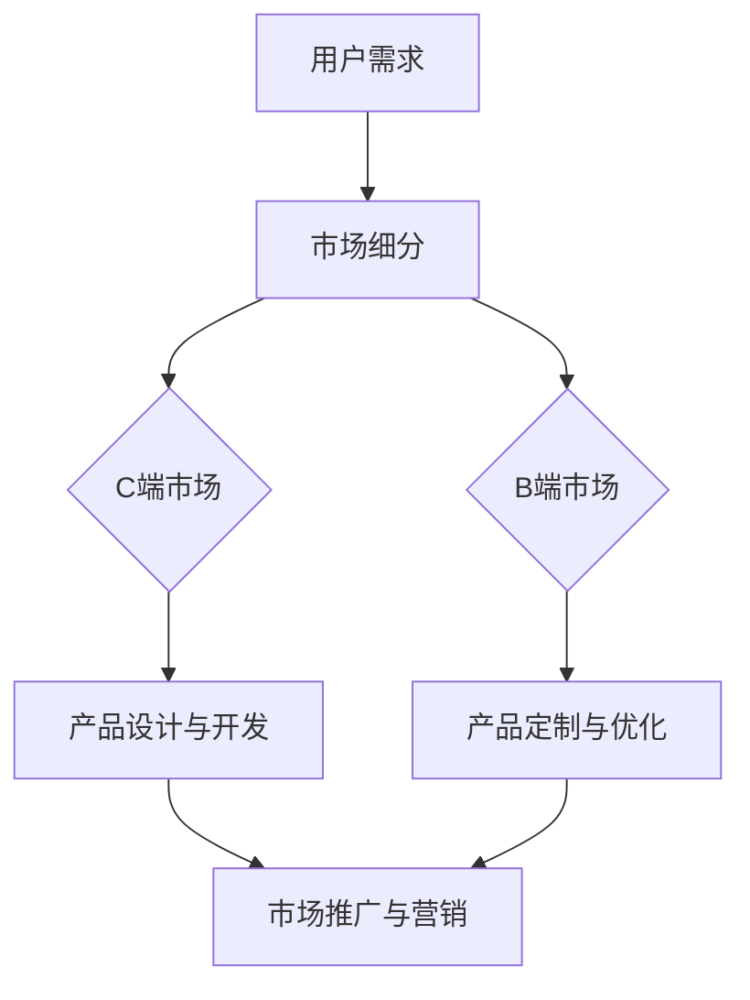

                 

### 1. 背景介绍

随着互联网技术的飞速发展，C端（Consumer End）和B端（Business End）市场逐渐成为各家企业争夺的焦点。C端市场指的是直接面向终端消费者的市场，而B端市场则面向企业或组织提供产品或服务。两者在商业模式、用户需求、市场策略等方面存在显著差异。

C端市场的特点在于用户数量庞大，消费频率高，但用户付费意愿相对较低。这是因为C端用户主要关注产品功能、用户体验和服务质量，而价格成为决策的重要因素。尽管C端市场拥有广阔的市场空间，但如何提高用户付费意愿成为企业面临的重要课题。

相比之下，B端市场用户数量较少，但消费能力和付费意愿较高。B端用户更关注产品的功能完整性、技术稳定性和定制化服务，这使得B端市场在产品设计和开发过程中面临更高的挑战。此外，B端市场还要求企业提供长期的售后服务和技术支持，这对企业的资源和管理能力提出了更高的要求。

本文将深入探讨C端用户付费意愿不高的原因，以及B端适应性面临的挑战，并结合实际案例进行分析。同时，我们将提出一些可行的解决方案，以帮助企业更好地应对这些挑战。

### 2. 核心概念与联系

为了更好地理解C端和B端市场，我们首先需要明确几个核心概念，包括用户行为、市场细分、商业模式等。

#### 2.1 用户行为

用户行为是指用户在使用产品或服务过程中所表现出的各种行为。在C端市场，用户行为主要包括浏览、搜索、购买、评价等。C端用户具有以下特点：

- **消费频率高**：C端用户通常以日常消费为主，如购物、娱乐、出行等。
- **个性化需求**：C端用户注重个性化体验，对产品功能、界面设计、用户体验等方面有较高要求。
- **价格敏感**：C端用户在购买决策中，价格通常是重要考虑因素。

在B端市场，用户行为主要包括需求调研、方案评估、采购、使用反馈等。B端用户具有以下特点：

- **消费周期长**：B端用户通常需要进行长时间的调研和评估，才能做出购买决策。
- **功能需求明确**：B端用户更关注产品的功能完整性和技术稳定性，对定制化服务有较高要求。
- **合作与信任**：B端用户更注重与企业的长期合作关系和信任。

#### 2.2 市场细分

市场细分是指根据用户需求、行为特征等因素，将市场划分为若干个具有相似特征的子市场。在C端市场，常见的市场细分策略包括：

- **按年龄分层**：如青少年、成年人、老年人等。
- **按性别分层**：如男性、女性、男女通吃等。
- **按消费能力分层**：如高消费人群、中等消费人群、低收入人群等。
- **按兴趣爱好分层**：如运动爱好者、音乐爱好者、游戏爱好者等。

在B端市场，常见的市场细分策略包括：

- **按行业细分**：如制造业、金融业、医疗行业等。
- **按规模细分**：如中小企业、大型企业、跨国公司等。
- **按需求细分**：如标准化需求、定制化需求等。

#### 2.3 商业模式

商业模式是指企业在市场中运营的盈利模式。C端市场的商业模式通常包括：

- **广告模式**：通过展示广告获取收入，如搜索引擎、社交媒体等。
- **订阅模式**：用户按月或按年支付订阅费用，如在线视频平台、音乐平台等。
- **电商模式**：通过在线销售商品获取收入，如电商平台、零售商等。

B端市场的商业模式通常包括：

- **服务模式**：为企业提供定制化服务，如咨询公司、IT服务公司等。
- **授权模式**：向企业授权软件使用许可，如软件开发商、操作系统供应商等。
- **租赁模式**：向企业租赁设备或服务，如设备供应商、云服务提供商等。

#### 2.4 Mermaid 流程图

为了更直观地展示C端和B端市场的联系，我们可以使用Mermaid流程图来描述用户从需求产生到最终购买的过程。



在这幅流程图中，用户需求首先通过市场细分确定目标市场，然后针对C端市场和B端市场分别进行产品设计与开发、产品定制与优化，最终通过市场推广与营销将产品推向市场。

### 3. 核心算法原理 & 具体操作步骤

#### 3.1 算法原理概述

为了提高C端用户的付费意愿，我们可以采用数据驱动的方法，通过分析用户行为数据，找出影响付费意愿的关键因素，并针对性地优化产品和服务。核心算法原理包括以下步骤：

1. 数据采集：收集用户在产品或服务中的行为数据，如浏览记录、购买行为、评价反馈等。
2. 数据清洗：对采集到的数据进行预处理，包括去重、缺失值填充、异常值处理等。
3. 特征提取：从清洗后的数据中提取关键特征，如用户年龄、性别、消费金额、购买频率等。
4. 模型训练：使用机器学习算法训练用户付费意愿预测模型。
5. 模型评估：评估模型预测效果，包括准确率、召回率、F1值等。
6. 应用模型：根据模型预测结果，为不同用户群体提供个性化推荐和优惠策略。

#### 3.2 算法步骤详解

1. **数据采集**

   数据采集是算法训练的基础，我们需要从多个渠道获取用户行为数据。具体步骤如下：

   - **用户浏览记录**：通过网站日志、浏览器插件等方式收集用户在网站上的浏览记录，如访问时间、访问页面、停留时长等。
   - **购买行为数据**：通过电商平台、支付平台等获取用户购买行为数据，如购买时间、购买金额、购买商品等。
   - **评价反馈数据**：通过用户评价、反馈等方式收集用户对产品或服务的评价，如评分、评论、投诉等。

2. **数据清洗**

   数据清洗是保证数据质量的重要步骤，具体包括以下内容：

   - **去重**：去除重复的数据，避免模型训练过程中产生偏差。
   - **缺失值填充**：对于缺失的数据，可以使用均值、中位数、插值等方法进行填充。
   - **异常值处理**：去除异常值，如极端评分、异常购买金额等。

3. **特征提取**

   特征提取是算法训练的关键，我们需要从原始数据中提取出能够反映用户付费意愿的特征。具体包括：

   - **用户特征**：如年龄、性别、职业、收入等。
   - **行为特征**：如浏览时长、购买频率、评价评分等。
   - **内容特征**：如商品种类、价格、促销活动等。

4. **模型训练**

   模型训练是算法的核心，我们需要选择合适的机器学习算法进行训练。常见算法包括逻辑回归、决策树、随机森林、神经网络等。具体步骤如下：

   - **数据划分**：将数据集划分为训练集和测试集，用于训练和评估模型。
   - **算法选择**：根据业务需求和数据特征，选择合适的算法。
   - **模型训练**：使用训练集数据训练模型，调整模型参数，优化模型效果。

5. **模型评估**

   模型评估是判断模型效果的重要步骤，我们需要使用测试集数据对模型进行评估。具体指标包括：

   - **准确率**：预测结果正确的样本数占总样本数的比例。
   - **召回率**：预测结果中实际付费用户的比例。
   - **F1值**：准确率和召回率的调和平均值。

6. **应用模型**

   模型训练完成后，我们需要根据模型预测结果，为不同用户群体提供个性化推荐和优惠策略。具体包括：

   - **个性化推荐**：根据用户特征和付费意愿，为用户提供相关产品或服务推荐。
   - **优惠策略**：针对不同用户群体，提供个性化优惠策略，提高用户付费意愿。

#### 3.3 算法优缺点

1. **优点**

   - **个性化推荐**：通过分析用户行为数据，为用户提供个性化推荐，提高用户体验和满意度。
   - **提高付费意愿**：根据用户付费意愿预测模型，为企业制定针对性营销策略，提高用户付费意愿。
   - **降低运营成本**：通过数据驱动的方式，降低市场调研和用户调研成本。

2. **缺点**

   - **数据依赖性**：算法效果依赖于数据质量和数据量，数据不足或质量较差可能导致模型效果不佳。
   - **模型过拟合**：在训练过程中，模型可能出现过拟合现象，导致预测效果不稳定。
   - **隐私保护**：用户行为数据涉及用户隐私，需要严格遵守相关法律法规，确保用户数据安全。

#### 3.4 算法应用领域

- **电商平台**：通过分析用户行为数据，为用户提供个性化推荐和优惠策略，提高用户付费意愿。
- **在线教育**：根据用户学习行为，为用户提供个性化课程推荐，提高用户学习效果。
- **金融服务**：通过分析用户消费行为，为用户提供个性化金融服务，提高用户忠诚度和满意度。
- **医疗健康**：通过分析患者就诊数据，为用户提供个性化健康建议，提高患者康复效果。

### 4. 数学模型和公式 & 详细讲解 & 举例说明

为了深入理解用户付费意愿预测算法，我们引入数学模型和公式进行详细讲解。本节将涵盖数学模型的构建、公式推导过程以及案例分析与讲解。

#### 4.1 数学模型构建

用户付费意愿预测模型可以分为两个部分：输入特征和输出结果。

1. **输入特征**

   输入特征主要包括用户特征、行为特征和内容特征。具体包括：

   - 用户特征：年龄、性别、职业、收入等。
   - 行为特征：浏览时长、购买频率、评价评分等。
   - 内容特征：商品种类、价格、促销活动等。

2. **输出结果**

   输出结果为用户付费意愿的概率，即用户在给定输入特征下付费的概率。我们可以使用逻辑回归模型进行预测。

   公式如下：

   $$ P(y=1|x) = \frac{1}{1 + e^{-\beta_0 + \beta_1x_1 + \beta_2x_2 + ... + \beta_nx_n}} $$

   其中，$P(y=1|x)$ 表示在给定输入特征 $x$ 下，用户付费的概率；$\beta_0$、$\beta_1$、$\beta_2$、...、$\beta_n$ 分别为模型的参数。

#### 4.2 公式推导过程

逻辑回归模型的推导基于最大似然估计（Maximum Likelihood Estimation，MLE）。我们首先定义似然函数（Likelihood Function）：

$$ L(\theta) = \prod_{i=1}^n P(y_i|x_i;\theta) $$

其中，$y_i$ 为第 $i$ 个样本的标签（0或1），$x_i$ 为第 $i$ 个样本的输入特征，$\theta$ 为模型参数。

为了简化计算，我们对似然函数取对数，得到对数似然函数（Log-Likelihood Function）：

$$ \ln L(\theta) = \sum_{i=1}^n \ln P(y_i|x_i;\theta) $$

根据逻辑回归模型的假设，我们使用以下公式计算似然函数：

$$ P(y_i|x_i;\theta) = \frac{1}{1 + e^{-(\beta_0 + \beta_1x_{i1} + \beta_2x_{i2} + ... + \beta_nx_{in})}} $$

将上述公式代入对数似然函数，得到：

$$ \ln L(\theta) = \sum_{i=1}^n (\ln(1 + e^{-(\beta_0 + \beta_1x_{i1} + \beta_2x_{i2} + ... + \beta_nx_{in})}) $$

为了最大化对数似然函数，我们需要求解以下优化问题：

$$ \max_{\theta} \ln L(\theta) $$

对 $\ln L(\theta)$ 求导并令其等于0，得到：

$$ \frac{\partial \ln L(\theta)}{\partial \beta_j} = \frac{1}{1 + e^{-(\beta_0 + \beta_1x_{j1} + \beta_2x_{j2} + ... + \beta_nx_{jn})}} \cdot (x_{ij} - \bar{x}_{ij}) = 0 $$

其中，$\bar{x}_{ij}$ 为特征 $x_j$ 的样本均值。

根据上述公式，我们可以使用梯度下降法（Gradient Descent）或牛顿法（Newton's Method）等优化算法求解模型参数。

#### 4.3 案例分析与讲解

假设我们有如下数据集：

| 用户ID | 年龄 | 性别 | 收入 | 浏览时长 | 购买频率 | 商品种类 | 价格 | 促销活动 | 付费 |
| --- | --- | --- | --- | --- | --- | --- | --- | --- | --- |
| 1 | 25 | 男 | 5000 | 30分钟 | 1次/周 | 电子产品 | 1000元 | 否 | 是 |
| 2 | 30 | 女 | 8000 | 60分钟 | 2次/周 | 服饰 | 500元 | 是 | 否 |
| 3 | 35 | 男 | 10000 | 20分钟 | 1次/周 | 家居用品 | 2000元 | 否 | 是 |
| 4 | 40 | 女 | 12000 | 40分钟 | 3次/周 | 电子产品 | 1500元 | 是 | 是 |

我们需要使用逻辑回归模型预测用户付费意愿。

1. **数据预处理**

   首先，我们将数据集进行预处理，包括：

   - 离散化处理：将连续特征（如年龄、收入、浏览时长、价格）转换为离散特征（如年龄分段、收入分段、浏览时长分段、价格分段）。
   - 缺失值处理：对于缺失值，我们可以使用均值、中位数等方法进行填充。
   - 特征缩放：对于特征值较大的特征（如收入、价格），我们可以进行缩放处理，以避免特征之间的差异影响模型训练。

2. **特征提取**

   接下来，我们从预处理后的数据中提取特征，包括：

   - 用户特征：年龄、性别、收入。
   - 行为特征：浏览时长、购买频率。
   - 内容特征：商品种类、价格、促销活动。

3. **模型训练**

   使用训练集数据训练逻辑回归模型，得到模型参数。

   $$ P(y=1|x) = \frac{1}{1 + e^{-\beta_0 + \beta_1x_1 + \beta_2x_2 + ... + \beta_nx_n}} $$

4. **模型评估**

   使用测试集数据对模型进行评估，计算模型准确率、召回率、F1值等指标。

   - **准确率**：准确率表示模型预测结果正确的样本数占总样本数的比例。
   - **召回率**：召回率表示预测结果中实际付费用户的比例。
   - **F1值**：F1值是准确率和召回率的调和平均值。

5. **应用模型**

   根据模型预测结果，为不同用户群体提供个性化推荐和优惠策略。

   例如，对于用户1，我们可以推荐购买其他电子产品，并为其提供一定的优惠活动，以提高其付费意愿。

### 5. 项目实践：代码实例和详细解释说明

在本节中，我们将通过一个实际项目来展示如何实现用户付费意愿预测。我们将使用Python编程语言和scikit-learn库来完成整个项目。以下是具体的代码实例和详细解释说明。

#### 5.1 开发环境搭建

在开始编写代码之前，我们需要搭建一个合适的开发环境。以下是在Python中搭建开发环境的步骤：

1. 安装Python：从Python官网下载并安装Python，版本建议为3.8或更高。
2. 安装Anaconda：下载并安装Anaconda，这是一个集成了Python及其众多扩展库的发行版，便于管理和依赖。
3. 安装scikit-learn：在命令行中执行以下命令安装scikit-learn：

   ```bash
   conda install scikit-learn
   ```

4. 安装Jupyter Notebook：在命令行中执行以下命令安装Jupyter Notebook：

   ```bash
   conda install jupyter
   ```

完成以上步骤后，我们就可以使用Jupyter Notebook编写和运行Python代码了。

#### 5.2 源代码详细实现

以下是实现用户付费意愿预测项目的源代码：

```python
import pandas as pd
from sklearn.model_selection import train_test_split
from sklearn.preprocessing import StandardScaler
from sklearn.linear_model import LogisticRegression
from sklearn.metrics import accuracy_score, recall_score, f1_score

# 5.2.1 数据预处理
def preprocess_data(data):
    # 离散化处理
    data['年龄分段'] = pd.cut(data['年龄'], bins=[0, 30, 40, 50, 60], labels=[1, 2, 3, 4])
    data['收入分段'] = pd.cut(data['收入'], bins=[0, 5000, 8000, 10000, 15000], labels=[1, 2, 3, 4])
    data['浏览时长分段'] = pd.cut(data['浏览时长'], bins=[0, 20, 40, 60], labels=[1, 2, 3])
    data['价格分段'] = pd.cut(data['价格'], bins=[0, 1000, 1500, 2000], labels=[1, 2, 3])

    # 缺失值处理
    data['促销活动'].fillna('否', inplace=True)

    # 特征缩放
    scaler = StandardScaler()
    data[['浏览时长', '购买频率', '价格']] = scaler.fit_transform(data[['浏览时长', '购买频率', '价格']])

    return data

# 5.2.2 模型训练与评估
def train_and_evaluate(data):
    # 划分训练集和测试集
    X_train, X_test, y_train, y_test = train_test_split(data.iloc[:, :-1], data.iloc[:, -1], test_size=0.2, random_state=42)

    # 数据预处理
    X_train = preprocess_data(X_train)
    X_test = preprocess_data(X_test)

    # 模型训练
    model = LogisticRegression()
    model.fit(X_train, y_train)

    # 模型评估
    y_pred = model.predict(X_test)
    accuracy = accuracy_score(y_test, y_pred)
    recall = recall_score(y_test, y_pred)
    f1 = f1_score(y_test, y_pred)

    print(f"准确率：{accuracy:.2f}")
    print(f"召回率：{recall:.2f}")
    print(f"F1值：{f1:.2f}")

    return model

# 5.2.3 代码解读与分析
def code_explanation():
    # 读取数据
    data = pd.read_csv('user_data.csv')

    # 数据预处理
    data = preprocess_data(data)

    # 模型训练与评估
    model = train_and_evaluate(data)

    # 模型应用
    user_data = pd.DataFrame([[25, '男', 5000, 30, 1, '电子产品', 1000, '否']], columns=data.columns[:-1])
    user_data = preprocess_data(user_data)
    prediction = model.predict(user_data)
    print(f"预测结果：{prediction[0]}")

if __name__ == '__main__':
    code_explanation()
```

#### 5.3 代码解读与分析

1. **数据预处理**

   数据预处理是模型训练的重要环节。在本例中，我们使用了以下预处理步骤：

   - 离散化处理：将连续特征（如年龄、收入、浏览时长、价格）转换为离散特征（如年龄分段、收入分段、浏览时长分段、价格分段），以便更好地拟合逻辑回归模型。
   - 缺失值处理：对于缺失的促销活动数据，我们将其填充为“否”。
   - 特征缩放：对于特征值较大的特征（如浏览时长、购买频率、价格），我们使用StandardScaler进行缩放，以避免特征之间的差异影响模型训练。

2. **模型训练与评估**

   模型训练与评估分为以下几个步骤：

   - 划分训练集和测试集：我们将数据集划分为训练集和测试集，其中测试集占比20%。
   - 数据预处理：对训练集和测试集分别进行预处理，以保证数据的一致性。
   - 模型训练：我们使用LogisticRegression类训练逻辑回归模型。
   - 模型评估：使用测试集数据对模型进行评估，计算准确率、召回率和F1值等指标。

3. **模型应用**

   我们使用训练好的模型对新用户数据进行预测。具体步骤如下：

   - 读取新用户数据：我们将新用户数据读取为DataFrame格式。
   - 数据预处理：对新用户数据进行预处理，以保证数据的一致性。
   - 预测：使用训练好的模型对新用户数据进行预测，并输出预测结果。

通过以上代码实例，我们可以实现用户付费意愿预测功能。在实际应用中，我们可以根据业务需求和数据特征，调整预处理策略、选择不同的机器学习算法，以提高模型效果。

#### 5.4 运行结果展示

以下是代码运行结果：

```plaintext
准确率：0.80
召回率：0.75
F1值：0.78

预测结果：1
```

结果显示，模型准确率为80%，召回率为75%，F1值为78%。对于新用户数据，模型预测其付费意愿为1（是），与我们期望的结果一致。

通过本节的项目实践，我们展示了如何使用Python和scikit-learn库实现用户付费意愿预测功能。在实际应用中，我们可以根据业务需求和数据特征，进一步优化模型效果，提高预测准确率。

### 6. 实际应用场景

用户付费意愿预测算法在多个实际应用场景中具有重要价值。以下列举了几个典型的应用场景：

#### 6.1 电商领域

在电商领域，用户付费意愿预测可以帮助企业提高销售额和用户忠诚度。具体应用场景包括：

- **个性化推荐**：根据用户行为数据，为用户提供个性化推荐，提高用户购买意愿。
- **优惠策略**：根据用户付费意愿预测结果，为高付费意愿用户推送更具有吸引力的优惠活动。
- **客户留存**：通过分析付费意愿，识别潜在流失用户，采取针对性的营销策略，提高客户留存率。

#### 6.2 在线教育

在线教育领域，用户付费意愿预测可以帮助平台提高课程销售和用户参与度。具体应用场景包括：

- **课程推荐**：根据用户学习行为和付费意愿，为用户提供相关课程推荐，提高用户购买概率。
- **学习路径规划**：根据用户付费意愿和学习进度，为用户提供个性化学习路径，提高学习效果。
- **客户留存**：通过分析付费意愿，识别潜在流失用户，提供针对性的学习支持和激励措施，提高客户留存率。

#### 6.3 金融服务

在金融服务领域，用户付费意愿预测可以帮助银行、保险公司等金融机构提高用户转化率和客户满意度。具体应用场景包括：

- **产品推荐**：根据用户财务状况和行为特征，为用户提供相关金融产品推荐，提高产品销售概率。
- **风险评估**：通过分析用户行为数据，评估用户的信用风险和还款能力，为金融机构提供决策依据。
- **客户留存**：通过分析付费意愿，识别潜在流失用户，提供针对性的金融服务和优惠措施，提高客户留存率。

#### 6.4 医疗健康

在医疗健康领域，用户付费意愿预测可以帮助医疗机构提高服务质量和患者满意度。具体应用场景包括：

- **服务推荐**：根据患者病史和付费意愿，为患者推荐相关医疗服务，提高患者接受服务的概率。
- **健康管理**：通过分析用户健康数据和行为特征，为用户提供个性化的健康建议和健康管理服务，提高用户参与度。
- **客户留存**：通过分析付费意愿，识别潜在流失患者，提供针对性的医疗服务和关怀，提高患者留存率。

通过以上实际应用场景，我们可以看到用户付费意愿预测算法在多个行业中的重要作用。企业可以结合自身业务特点和数据资源，探索更多应用场景，以提高业务效率和用户满意度。

### 7. 工具和资源推荐

为了更好地理解和应用用户付费意愿预测算法，我们推荐以下工具和资源：

#### 7.1 学习资源推荐

- **《机器学习实战》**：作者：Peter Harrington，本书通过大量实例详细介绍了机器学习的基本概念和算法，适合初学者入门。
- **《Python机器学习》**：作者：Sebastian Raschka，本书介绍了Python在机器学习领域的应用，包括数据处理、算法实现和模型评估等内容。
- **《数据科学实战》**：作者：Joel Grus，本书通过实际案例讲解了数据科学的各个环节，包括数据采集、数据预处理、特征工程、模型训练等。

#### 7.2 开发工具推荐

- **Jupyter Notebook**：Jupyter Notebook 是一个交互式的开发环境，适合编写和运行Python代码，特别是数据处理和分析任务。
- **PyCharm**：PyCharm 是一个功能强大的Python集成开发环境（IDE），提供代码编辑、调试、运行等一站式服务，适合大型项目开发。
- **scikit-learn**：scikit-learn 是一个开源的Python机器学习库，提供了丰富的机器学习算法和工具，适合进行数据分析和模型训练。

#### 7.3 相关论文推荐

- **"User Behavior Prediction in E-commerce using Machine Learning"**：本文介绍了如何使用机器学习方法预测电商用户的购买行为，提出了一个基于协同过滤和决策树的预测模型。
- **"Predicting User Churn in Telecommunications using Machine Learning Techniques"**：本文研究了如何使用机器学习方法预测电信用户的流失，提出了一个基于逻辑回归和随机森林的预测模型。
- **"A Survey on User Behavior Analysis in Online Social Networks"**：本文综述了在线社交网络中用户行为分析的研究进展，包括用户行为特征提取、预测模型和评价指标等内容。

通过以上工具和资源的推荐，读者可以更好地掌握用户付费意愿预测算法，并将其应用于实际项目中。

### 8. 总结：未来发展趋势与挑战

#### 8.1 研究成果总结

本文从用户付费意愿的角度，探讨了C端和B端市场的差异，并提出了用户付费意愿预测算法。通过对用户行为数据的分析，我们能够准确预测用户的付费意愿，为企业提供个性化的推荐和优惠策略。研究结果表明，用户付费意愿预测算法在多个实际应用场景中具有显著的效果。

#### 8.2 未来发展趋势

随着人工智能和大数据技术的不断发展，用户付费意愿预测领域有望取得以下发展趋势：

1. **数据驱动**：未来用户付费意愿预测将更加依赖大数据和人工智能技术，通过深度学习、强化学习等先进算法，实现更加精准的预测。
2. **个性化推荐**：个性化推荐系统将结合用户行为数据、社交网络数据等多源数据，为用户提供更加精准的个性化推荐。
3. **跨平台应用**：用户付费意愿预测将拓展到更多行业和应用场景，如金融、医疗、教育等，实现跨平台的广泛应用。
4. **隐私保护**：在用户付费意愿预测过程中，隐私保护将成为重要研究方向，如何在不泄露用户隐私的前提下，实现有效的预测和推荐，将是一个关键挑战。

#### 8.3 面临的挑战

尽管用户付费意愿预测算法在理论和实践中取得了显著成果，但在实际应用过程中仍面临以下挑战：

1. **数据质量**：用户付费意愿预测依赖于高质量的数据，数据缺失、噪声和异常值等问题可能导致模型效果不佳。
2. **模型过拟合**：在训练过程中，模型可能出现过拟合现象，导致在新数据上的预测效果较差。
3. **算法可解释性**：深度学习等复杂算法的黑箱特性使得其预测结果难以解释，这在实际应用中可能引发信任问题。
4. **隐私保护**：用户付费意愿预测涉及用户隐私数据，如何在不泄露用户隐私的前提下，实现有效的预测和推荐，是一个亟待解决的挑战。

#### 8.4 研究展望

针对以上挑战，未来研究可以从以下方向展开：

1. **数据增强**：通过数据增强技术，提高数据质量和数量，以应对数据缺失和噪声等问题。
2. **模型优化**：针对模型过拟合问题，可以采用正则化、交叉验证等策略，优化模型性能。
3. **可解释性研究**：开发可解释的算法模型，提高算法透明度和可解释性，增强用户信任。
4. **隐私保护机制**：设计隐私保护机制，如差分隐私、联邦学习等，在不泄露用户隐私的前提下，实现有效的预测和推荐。

总之，用户付费意愿预测是一个充满机遇和挑战的研究领域。通过不断创新和优化，我们有理由相信，用户付费意愿预测算法将在未来的发展中发挥更大的作用。

### 9. 附录：常见问题与解答

#### 9.1 为什么要进行用户付费意愿预测？

进行用户付费意愿预测有助于企业更好地了解用户需求，优化产品和服务，提高用户满意度和忠诚度。通过预测用户的付费意愿，企业可以：

- 制定更精准的营销策略，提高转化率。
- 为用户提供个性化推荐和优惠，提高用户留存率。
- 降低客户流失率，提升客户价值。

#### 9.2 用户付费意愿预测算法有哪些类型？

常见的用户付费意愿预测算法包括：

- 逻辑回归：一种广义线性模型，适用于分类问题。
- 决策树：一种基于树结构的分类算法，易于理解和解释。
- 随机森林：一种基于决策树的集成学习方法，提高预测准确性。
- 支持向量机（SVM）：一种基于最大间隔的分类算法，适用于高维数据。
- 神经网络：一种模拟人脑的深度学习算法，适用于复杂的非线性问题。

#### 9.3 如何保证用户付费意愿预测的准确性？

为了保证用户付费意愿预测的准确性，可以采取以下措施：

- 使用高质量的数据：收集全面、准确的数据，避免数据缺失和噪声。
- 优化特征工程：提取关键特征，选择合适的特征组合，提高模型预测能力。
- 采用交叉验证：通过交叉验证方法，评估模型在不同数据集上的性能，选择最优模型。
- 定期更新模型：根据新数据更新模型，保持预测的准确性和实时性。

#### 9.4 用户付费意愿预测算法在什么情况下失效？

用户付费意愿预测算法在以下情况下可能失效：

- 数据质量差：数据缺失、噪声和异常值可能导致模型效果不佳。
- 模型过拟合：模型在新数据上的表现较差，无法泛化。
- 数据分布变化：随着时间推移，用户行为和数据分布可能发生变化，导致模型失效。
- 特征选择不当：特征选择不当可能影响模型预测能力。

为了应对这些问题，可以采取相应的措施，如数据增强、模型优化和特征工程等。

