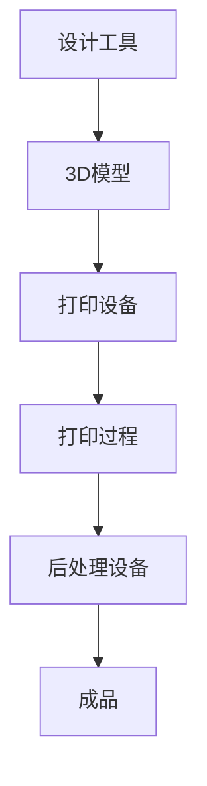

                 

随着科技的不断进步，3D打印技术已经成为制造业中的重要一环。在这个领域，3D打印服务平台作为一种新兴的商业模式，为创业者提供了丰富的创业机会。本文将深入探讨3D打印服务平台的概念、技术原理、应用场景以及未来发展趋势，以期为读者提供一份全面而深入的指南。

## 关键词：3D打印、服务平台、个性化制造、创业机会、技术原理

## 摘要：本文将首先介绍3D打印技术的基本概念，然后探讨3D打印服务平台的工作原理和优势。接着，我们将分析3D打印技术在各个行业中的应用案例，并展望其未来的发展趋势。最后，我们将探讨在3D打印领域创业的机会和挑战。

## 1. 背景介绍

### 1.1 3D打印技术的发展历程

3D打印技术起源于20世纪80年代的立体光固化技术（SLA），随后经历了快速的发展和演变。从最初的粉末床打印、层压打印，到现在的光固化、选择性激光烧结、电子束熔炼等多种技术，3D打印已经逐渐成为制造业中不可或缺的一部分。

### 1.2 个性化制造的概念

个性化制造是一种根据客户需求定制生产的产品制造方式。与传统的批量生产方式相比，个性化制造可以更灵活地满足客户的需求，提高产品的附加值。

### 1.3 3D打印服务平台的市场需求

随着消费者对个性化、定制化产品的需求不断增长，3D打印服务平台的市场需求也日益增加。特别是在医疗、航空航天、汽车制造等领域，3D打印技术已经显示出巨大的应用潜力。

## 2. 核心概念与联系

### 2.1 3D打印技术的基本原理

3D打印技术通过逐层添加材料来构建三维物体。其基本原理可以概括为三个步骤：设计、打印、后处理。

### 2.2 3D打印服务平台的工作原理

3D打印服务平台通常包括以下三个部分：设计工具、打印设备和后处理设备。设计工具用于创建3D模型，打印设备根据模型进行打印，后处理设备用于对打印完成的物体进行修整和强化。

### 2.3 3D打印服务平台的优势

- **个性化定制**：3D打印服务平台可以根据客户的需求进行个性化定制，提高产品的附加值。
- **灵活生产**：3D打印技术不受制件复杂程度和形状的限制，可以实现复杂结构的打印。
- **快速交付**：3D打印技术可以大幅缩短产品的生产周期，实现快速交付。

### 2.4 Mermaid 流程图



## 3. 核心算法原理 & 具体操作步骤

### 3.1 算法原理概述

3D打印服务平台的核心算法主要包括3D模型设计、切片处理和打印控制。

- **3D模型设计**：通过计算机辅助设计（CAD）软件创建3D模型。
- **切片处理**：将3D模型分解为二维切片，以便打印设备逐层构建。
- **打印控制**：控制打印设备根据切片信息进行打印。

### 3.2 算法步骤详解

1. **设计3D模型**：使用CAD软件创建3D模型。
2. **切片处理**：使用切片软件将3D模型分解为二维切片。
3. **打印控制**：将切片信息传输到打印设备，控制打印过程。

### 3.3 算法优缺点

- **优点**：
  - **个性化定制**：可以满足客户的个性化需求。
  - **高效生产**：切片处理和打印控制可以大幅提高生产效率。

- **缺点**：
  - **设备成本高**：3D打印设备成本较高，可能不适合小型创业公司。
  - **打印材料限制**：目前3D打印材料种类有限，可能无法满足所有需求。

### 3.4 算法应用领域

- **医疗**：个性化医疗器械和牙科模型。
- **航空航天**：复杂结构件和零部件的制造。
- **汽车**：个性化汽车零部件和车身。
- **消费品**：个性化家居用品和饰品。

## 4. 数学模型和公式 & 详细讲解 & 举例说明

### 4.1 数学模型构建

3D打印过程中的数学模型主要包括几何模型和材料模型。

- **几何模型**：用于描述物体的几何形状和尺寸。
- **材料模型**：用于描述打印材料的行为和性能。

### 4.2 公式推导过程

- **几何模型**：使用向量法和多边形法构建。
- **材料模型**：使用材料力学公式进行推导。

### 4.3 案例分析与讲解

以一个简单的立方体为例，计算其几何模型和材料模型。

- **几何模型**：立方体的体积公式为 \( V = a^3 \)，其中 \( a \) 为边长。
- **材料模型**：假设使用 PLA 材料打印，其密度为 \( \rho = 1.25 \text{g/cm}^3 \)，则立方体的质量为 \( m = \rho V = 1.25a^3 \text{g} \)。

## 5. 项目实践：代码实例和详细解释说明

### 5.1 开发环境搭建

- **操作系统**：Linux（推荐 Ubuntu）
- **编程语言**：Python
- **3D模型设计软件**：Blender
- **切片处理软件**：Cura

### 5.2 源代码详细实现

以下是一个简单的 Python 代码示例，用于生成一个立方体的 3D 模型。

```python
import bpy

# 创建立方体
mesh = bpy.ops.mesh.primitive_cube_add(size=10)

# 获取立方体对象
cube = bpy.context.object

# 设置立方体参数
cube.scale.x = 2
cube.scale.y = 2
cube.scale.z = 2

# 导出立方体模型
bpy.ops.export_scene.obj(file_path="cube.obj")
```

### 5.3 代码解读与分析

- **第一行**：导入 Blender 的 mesh 模块。
- **第二行**：创建一个立方体。
- **第三行**：获取创建的立方体对象。
- **第四行**：修改立方体的尺寸。
- **第五行**：导出立方体模型为 OBJ 文件。

### 5.4 运行结果展示

运行上述代码后，将生成一个边长为 2 的立方体模型，并保存为 "cube.obj" 文件。

## 6. 实际应用场景

### 6.1 医疗领域

3D打印技术可以用于制造个性化医疗器械、牙科模型和骨骼修复件等。

### 6.2 航空航天领域

3D打印技术可以用于制造复杂的航空航天零部件和原型件。

### 6.3 汽车领域

3D打印技术可以用于制造个性化的汽车零部件和车身。

### 6.4 消费品领域

3D打印技术可以用于制造个性化的家居用品和饰品。

## 7. 工具和资源推荐

### 7.1 学习资源推荐

- **书籍**：《3D打印技术：从原理到应用》
- **在线课程**：Coursera 上的《3D打印技术》课程
- **博客**：3D打印领域的专业博客和论坛

### 7.2 开发工具推荐

- **3D模型设计软件**：Blender、Autodesk Maya
- **切片处理软件**：Cura、Simplify3D
- **编程语言**：Python、JavaScript

### 7.3 相关论文推荐

- **论文**：《3D打印技术及其在制造业中的应用研究》
- **期刊**：《制造工程与自动化》

## 8. 总结：未来发展趋势与挑战

### 8.1 研究成果总结

3D打印技术已经取得了显著的成果，其在个性化制造、快速原型制造等领域具有广泛的应用前景。

### 8.2 未来发展趋势

- **技术成熟度**：随着技术的不断进步，3D打印设备的精度和速度将进一步提高。
- **材料创新**：新型材料的研发将拓宽3D打印技术的应用范围。
- **行业融合**：3D打印技术将在更多行业得到应用，推动传统制造业的转型升级。

### 8.3 面临的挑战

- **成本控制**：3D打印设备的成本和打印材料的成本较高，需要进一步降低。
- **技术标准化**：3D打印技术的标准化和规范化问题需要得到解决。
- **人才短缺**：3D打印技术人才的培养和储备是当前的一大挑战。

### 8.4 研究展望

未来，3D打印技术将在个性化制造、智能制造等领域发挥更大的作用，为创业者提供更多的商机。

## 9. 附录：常见问题与解答

### 9.1 3D打印与增材制造的区别是什么？

3D打印是一种增材制造技术，它通过逐层添加材料来构建物体。而增材制造还包括其他技术，如粉末床打印、激光熔覆等。

### 9.2 3D打印服务平台有哪些类型？

3D打印服务平台可以分为以下几种类型：
- **在线平台**：提供在线3D模型设计和打印服务。
- **离线平台**：提供离线3D模型设计和打印服务。
- **混合平台**：同时提供在线和离线服务。

### 9.3 3D打印服务平台的优势是什么？

3D打印服务平台的优势包括个性化定制、灵活生产、快速交付等。此外，3D打印技术还可以提高产品的附加值，降低生产成本。

### 9.4 3D打印服务平台的发展前景如何？

随着科技的不断进步和市场的需求增长，3D打印服务平台的发展前景非常广阔。预计未来将在更多行业得到应用，推动传统制造业的转型升级。

---

**作者：禅与计算机程序设计艺术 / Zen and the Art of Computer Programming**

本文由禅与计算机程序设计艺术撰写，旨在为读者提供关于3D打印服务平台在个性化制造领域的深入理解和实践指南。随着科技的不断发展，3D打印技术将在个性化制造、智能制造等领域发挥更大的作用，为创业者提供更多的商机。本文内容仅供参考，实际应用时请结合实际情况进行判断。如需进一步了解3D打印技术，请参考相关书籍、在线课程和论文。

