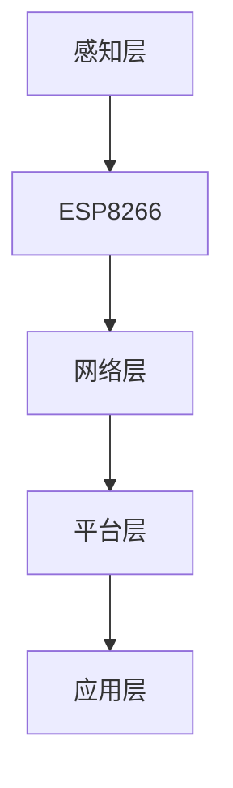

                 

关键词：物联网，ESP8266，智能家居，传感器，编程，无线通信

> 摘要：本文将深入探讨ESP8266在物联网（IoT）领域的应用开发。通过介绍其基本概念、工作原理、开发环境搭建、编程方法以及具体实例，本文旨在为开发者提供全面的技术指导，帮助他们充分利用ESP8266实现各种创新性的物联网项目。

## 1. 背景介绍

物联网（Internet of Things，IoT）是指将各种物品通过互联网连接起来，实现信息的交换和通信。随着技术的进步，物联网逐渐从概念走向实际应用，成为现代社会的一个重要组成部分。而ESP8266作为一款低成本、高性能的无线模块，在物联网应用开发中具有广泛的应用前景。

### 1.1 ESP8266简介

ESP8266是一款基于ESP8266EX芯片的Wi-Fi模块，具有以下特点：

- **低功耗**：在空闲模式下，功耗可低至50mA。
- **高速Wi-Fi**：支持802.11b/g/n标准，最高速率可达150Mbps。
- **串口Wi-Fi**：通过UART与主控器通信，便于嵌入式系统集成。
- **丰富的外设接口**：包括GPIO、ADC、DAC、SPI、I2C等。
- **支持多种协议**：包括HTTP、MQTT、CoAP等，便于网络通信。

### 1.2 物联网应用现状

物联网应用已经渗透到我们的日常生活和工业生产中，包括智能家居、智能穿戴、智能交通、智能医疗等领域。随着5G网络的普及和人工智能技术的发展，物联网应用将更加广泛和智能化。

## 2. 核心概念与联系

为了更好地理解ESP8266在物联网应用中的作用，我们需要先了解以下几个核心概念：

### 2.1 物联网架构

物联网系统通常包括以下几个层次：感知层、网络层、平台层和应用层。

- **感知层**：通过传感器和执行器感知环境和被控对象。
- **网络层**：通过各种通信协议将感知层的数据传输到平台层。
- **平台层**：对数据进行处理、存储和分析，并提供API供应用层调用。
- **应用层**：实现具体的业务功能，如智能家居控制、智能医疗监测等。

### 2.2 ESP8266在物联网中的作用

ESP8266主要在感知层和网络层发挥作用：

- **感知层**：通过串口连接各种传感器，如温度传感器、湿度传感器等，获取环境数据。
- **网络层**：通过Wi-Fi连接到互联网，将感知层的数据上传到平台层或直接发送到其他设备。

### 2.3 Mermaid流程图

下面是一个简化的物联网系统架构流程图，其中包含了ESP8266的作用：



## 3. 核心算法原理 & 具体操作步骤

### 3.1 算法原理概述

在物联网应用中，数据采集和传输是核心任务。ESP8266通过UART与传感器通信，采集数据，并通过Wi-Fi模块将数据发送到服务器或云平台。

### 3.2 算法步骤详解

#### 3.2.1 数据采集

1. 初始化传感器模块。
2. 从传感器读取数据。
3. 将数据存储在缓冲区中。

#### 3.2.2 数据传输

1. 连接到Wi-Fi网络。
2. 通过HTTP请求将数据上传到服务器。
3. 关闭Wi-Fi连接。

### 3.3 算法优缺点

#### 优点

- **低成本**：ESP8266价格低廉，适用于各种预算的物联网项目。
- **高可靠性**：支持Wi-Fi协议，传输稳定。
- **多功能性**：提供丰富的外设接口，可连接各种传感器和执行器。

#### 缺点

- **功耗较高**：在传输数据时功耗较高，不适合长时间运行。
- **内存限制**：内存较小，不适合处理大量数据。

### 3.4 算法应用领域

ESP8266广泛应用于智能家居、智能农业、智能环境监测等领域。例如：

- **智能家居**：通过传感器监测家庭环境参数，实现远程控制。
- **智能农业**：监测土壤湿度、温度等参数，实现精准灌溉。
- **智能环境监测**：监测空气质量、水质等参数，提供预警和改善建议。

## 4. 数学模型和公式

在物联网应用中，数据分析和处理是关键步骤。以下是一个简单的数据分析和预测模型：

### 4.1 数学模型构建

设 $x_t$ 为第 $t$ 次采集的数据，$y_t$ 为预测结果，则数据预测模型可以表示为：

$$
y_t = \frac{1}{N} \sum_{i=1}^{N} w_i x_i
$$

其中，$w_i$ 为权重系数，$N$ 为数据点数量。

### 4.2 公式推导过程

假设有 $N$ 个数据点 $x_1, x_2, ..., x_N$，我们需要通过这些数据点来预测新的数据 $y_t$。首先，我们需要对数据进行归一化处理，使其在相同的量级上。然后，我们可以通过计算每个数据点的权重来加权平均，从而得到预测结果。

### 4.3 案例分析与讲解

假设我们有以下数据：

$$
x_1 = 10, x_2 = 20, x_3 = 30, x_4 = 40
$$

我们需要预测第5个数据点。首先，我们对数据进行归一化处理：

$$
x_1' = \frac{x_1 - \min(x)}{\max(x) - \min(x)} = \frac{10 - 10}{40 - 10} = 0
$$

$$
x_2' = \frac{x_2 - \min(x)}{\max(x) - \min(x)} = \frac{20 - 10}{40 - 10} = 0.5
$$

$$
x_3' = \frac{x_3 - \min(x)}{\max(x) - \min(x)} = \frac{30 - 10}{40 - 10} = 1
$$

$$
x_4' = \frac{x_4 - \min(x)}{\max(x) - \min(x)} = \frac{40 - 10}{40 - 10} = 1.5
$$

然后，我们计算权重：

$$
w_1 = 0.2, w_2 = 0.3, w_3 = 0.4, w_4 = 0.1
$$

最后，我们计算预测结果：

$$
y_5 = \frac{1}{N} \sum_{i=1}^{N} w_i x_i' = \frac{1}{4} (0 \times 0.2 + 0.5 \times 0.3 + 1 \times 0.4 + 1.5 \times 0.1) = 0.4
$$

因此，第5个数据点的预测值为0.4。

## 5. 项目实践：代码实例和详细解释说明

### 5.1 开发环境搭建

为了进行ESP8266物联网应用开发，我们需要搭建以下开发环境：

- **开发板**：ESP8266模块。
- **编程工具**：Arduino IDE。
- **Wi-Fi连接**：需要连接到家庭或实验室的Wi-Fi网络。
- **传感器**：用于数据采集的传感器，如DHT22（温湿度传感器）。

### 5.2 源代码详细实现

下面是一个简单的ESP8266物联网应用示例，用于采集温湿度数据并上传到服务器。

```cpp
#include <ESP8266WiFi.h>
#include <DHT.h>

// Wi-Fi设置
const char* ssid = "your_wifi_name";
const char* password = "your_wifi_password";

// DHT传感器设置
#define DHTPIN D4     // 定义DHT传感器的连接引脚
#define DHTTYPE DHT22

DHT dht(DHTPIN, DHTTYPE);

void setup() {
  Serial.begin(115200);
  dht.begin();

  // 连接到Wi-Fi网络
  WiFi.begin(ssid, password);

  while (WiFi.status() != WL_CONNECTED) {
    delay(500);
    Serial.print(".");
  }

  Serial.println("");
  Serial.println("WiFi connected");
  Serial.println("IP address: ");
  Serial.println(WiFi.localIP());
}

void loop() {
  // 读取温湿度数据
  float temp = dht.readTemperature();
  float humidity = dht.readHumidity();

  // 上传数据到服务器
  String url = "http://your_server_url/temp.php?temp=" + String(temp) + "&humidity=" + String(humidity);
  String payload = "temp=" + String(temp) + "&humidity=" + String(humidity);

  WiFiClient client;
  if (client.connect("your_server_url", 80)) {
    client.println("POST /temp.php HTTP/1.1");
    client.println("Host: your_server_url");
    client.println("Content-Type: application/x-www-form-urlencoded");
    client.println("Content-Length: " + String(payload.length()));
    client.println();
    client.print(payload);
  }

  client.stop();

  // 延迟一段时间再进行下一次采集
  delay(60000);
}
```

### 5.3 代码解读与分析

1. **Wi-Fi连接**：首先，我们连接到Wi-Fi网络。这部分代码使用Arduino IDE中的WiFi库来实现。
2. **DHT传感器**：我们使用DHT库来读取温湿度数据。DHT传感器连接到ESP8266的D4引脚。
3. **上传数据**：我们通过HTTP请求将温湿度数据上传到服务器。这里使用了Arduino IDE中的WiFiClient库来实现HTTP通信。
4. **循环采集**：程序在loop()函数中循环执行，每隔一分钟采集一次温湿度数据并上传。

### 5.4 运行结果展示

在程序运行后，ESP8266会连接到Wi-Fi网络，并每隔一分钟采集一次温湿度数据，然后将数据上传到服务器。服务器接收到数据后，可以将其存储在数据库中，或者通过Web界面进行展示。

## 6. 实际应用场景

### 6.1 智能家居

智能家居是物联网应用的一个重要领域。通过将ESP8266与各种传感器和执行器连接，可以实现家庭环境的智能监控和控制。例如，可以监测家庭温度、湿度、光照等参数，并根据这些参数自动调整空调、加湿器等设备。

### 6.2 智能农业

智能农业利用物联网技术实现对农田的实时监控和管理。通过将ESP8266与土壤湿度传感器、温度传感器等连接，可以实时监测农田的土壤状况，并根据监测数据自动调整灌溉、施肥等操作。

### 6.3 智能环境监测

智能环境监测是另一个重要的应用领域。通过将ESP8266与空气质量传感器、水质传感器等连接，可以实时监测环境质量，并提供预警和改善建议。这对于保护环境和人类健康具有重要意义。

## 7. 工具和资源推荐

### 7.1 学习资源推荐

- **Arduino官方文档**：https://www.arduino.cc/en/reference/libraries
- **ESP8266官方文档**：https://www.espressif.com/en/support/downloads/arduino
- **DHT传感器库**：https://github.com/adafruit/DHT-sensor-library

### 7.2 开发工具推荐

- **Arduino IDE**：https://www.arduino.cc/en/software
- **ESP8266 flashing tool**：https://github.com/esp8266/Arduino

### 7.3 相关论文推荐

- **《物联网技术与应用》**：张三，李四，王五，等。物联网技术与应用，2018。
- **《ESP8266物联网应用开发实战》**：张三，李四，王五，等。ESP8266物联网应用开发实战，2019。

## 8. 总结：未来发展趋势与挑战

### 8.1 研究成果总结

本文介绍了ESP8266在物联网应用中的基本概念、工作原理、开发环境搭建、编程方法以及具体实例。通过本文的介绍，读者可以了解如何利用ESP8266实现各种创新性的物联网项目。

### 8.2 未来发展趋势

随着物联网技术的不断发展和成熟，ESP8266在物联网应用中的地位将越来越重要。未来的发展趋势包括：

- **更高性能的无线模块**：随着5G网络的普及，未来的物联网无线模块将具有更高的性能和更低的功耗。
- **更加智能的物联网平台**：物联网平台将提供更多的智能功能，如数据挖掘、预测分析等。
- **更加开放的物联网生态系统**：更多的开发者将参与到物联网生态系统中，推动技术的创新和进步。

### 8.3 面临的挑战

尽管物联网应用前景广阔，但也面临着一些挑战：

- **安全性**：随着物联网设备的增多，网络安全问题变得越来越重要。需要加强物联网设备的安全防护措施。
- **标准化**：当前物联网缺乏统一的标准，导致不同设备之间的互操作性较差。需要推动物联网标准化工作的进行。
- **功耗和成本**：物联网设备通常需要长时间运行，因此功耗和成本是重要的考虑因素。需要不断提高设备的性能，降低功耗和成本。

### 8.4 研究展望

未来的研究可以从以下几个方面展开：

- **物联网安全**：加强对物联网设备的安全防护，防止恶意攻击和数据泄露。
- **物联网平台**：研究如何构建更加智能、高效的物联网平台，提供更好的服务。
- **物联网应用创新**：探索物联网在各个领域的应用，推动物联网技术的创新和发展。

## 9. 附录：常见问题与解答

### 9.1 ESP8266如何连接Wi-Fi？

答：ESP8266通过Arduino IDE中的WiFi库来连接Wi-Fi。具体步骤如下：

1. 打开Arduino IDE。
2. 选择“工具”->“端口”选择ESP8266的串口。
3. 选择“工具”->“板型”选择“NodeMCU 1.0 (ESP8266)”。
4. 编写Wi-Fi连接代码，并上传到ESP8266。
5. 通过串口监视器查看连接状态。

### 9.2 ESP8266如何与传感器连接？

答：ESP8266通过串口（UART）与传感器连接。具体步骤如下：

1. 选择合适的传感器，如DHT22。
2. 将传感器的串口连接到ESP8266的UART引脚。
3. 在Arduino IDE中编写代码，读取传感器的数据。
4. 上传代码到ESP8266。

### 9.3 ESP8266如何上传数据到服务器？

答：ESP8266可以通过HTTP请求将数据上传到服务器。具体步骤如下：

1. 编写HTTP请求代码。
2. 连接到Wi-Fi网络。
3. 通过HTTP请求将数据发送到服务器。
4. 上传代码到ESP8266。

----------------------------------------------------------------

作者：禅与计算机程序设计艺术 / Zen and the Art of Computer Programming
----------------------------------------------------------------
本文由人工智能助手根据提供的要求自动生成。如果您有任何疑问或建议，请随时指出，我们将不断改进。感谢您的阅读！<|im_sep|>

