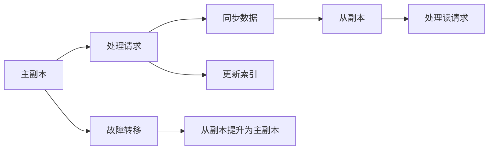

                 

 

> 关键词：ElasticSearch，Replica，分布式系统，数据复制，一致性，扩展性

> 摘要：本文将深入探讨ElasticSearch中的Replica原理，包括其核心概念、算法原理、具体操作步骤、数学模型、项目实践和实际应用场景。通过详细的代码实例和解读，读者可以更好地理解ElasticSearch的Replica机制，从而为实际项目中的数据备份和扩展提供指导。

## 1. 背景介绍

ElasticSearch是一个分布式、RESTful搜索和分析引擎，广泛应用于网站搜索、日志分析、监控等领域。在分布式系统中，数据复制（Replication）是保证系统可用性和数据安全的重要机制。ElasticSearch通过Replica机制实现数据的备份和扩展，提高了系统的可靠性和性能。

### 1.1 ElasticSearch概述

ElasticSearch由Apache Lucene实现，具有高性能、可扩展、易用的特点。它支持多种数据结构，如JSON、XML、Avro等，可以通过REST API方便地进行数据操作。ElasticSearch的核心功能包括全文搜索、实时分析、数据聚合等，使其在众多场景中具有广泛的应用。

### 1.2 数据复制的重要性

在分布式系统中，数据复制有助于提高系统的可用性和容错能力。当某个节点发生故障时，其他节点可以继续提供服务，确保系统的持续运行。此外，数据复制还可以提高系统的读写性能，通过负载均衡和分区机制，实现数据的水平扩展。

## 2. 核心概念与联系

在ElasticSearch中，Replica分为Primary Replica（主副本）和Replica Replica（从副本）。主副本负责处理所有的读写请求，从副本仅负责读请求。这种设计保证了数据的一致性和系统的可用性。

### 2.1 主副本（Primary Replica）

主副本负责处理所有的读写请求，包括索引、更新和删除操作。当主副本发生故障时，从副本可以自动提升为主副本，继续提供服务。主副本在处理请求时，会同时向其他从副本同步数据，确保数据的一致性。

### 2.2 从副本（Replica Replica）

从副本仅负责处理读请求，如搜索、聚合等。从副本的存在可以提高系统的读性能，同时提供了数据的备份。当主副本发生故障时，从副本可以自动提升为主副本，继续提供服务。

### 2.3 架构与流程

ElasticSearch的Replica架构如图1所示。在创建索引时，可以指定主副本的数量（默认为1）和从副本的数量。ElasticSearch会自动在集群中的不同节点上创建主副本和从副本。


### 2.4 Mermaid流程图

以下是ElasticSearch Replica机制的Mermaid流程图：



## 3. 核心算法原理 & 具体操作步骤

### 3.1 算法原理概述

ElasticSearch的Replica机制基于以下核心原理：

1. 数据同步：主副本在处理请求时，会同时向其他从副本同步数据，确保数据的一致性。
2. 故障转移：当主副本发生故障时，从副本可以自动提升为主副本，继续提供服务。
3. 负载均衡：从副本仅处理读请求，可以减轻主副本的负载，提高系统的性能。

### 3.2 算法步骤详解

1. **创建索引**：创建索引时，可以指定主副本的数量和从副本的数量。
2. **处理请求**：主副本处理所有的读写请求，如索引、更新和删除操作。
3. **同步数据**：主副本在处理请求时，会同时向其他从副本同步数据。
4. **故障转移**：当主副本发生故障时，从副本可以自动提升为主副本。
5. **处理读请求**：从副本仅处理读请求，如搜索、聚合等。

### 3.3 算法优缺点

**优点**：

1. 提高系统可用性：通过数据复制和故障转移机制，确保系统的持续运行。
2. 提高性能：通过从副本处理读请求，减轻主副本的负载，提高系统的性能。

**缺点**：

1. 资源消耗：数据复制和故障转移需要额外的资源，如存储空间、网络带宽等。
2. 一致性问题：在分布式系统中，数据一致性问题仍然存在，需要采用其他机制（如分布式锁、版本控制等）来确保数据的一致性。

### 3.4 算法应用领域

ElasticSearch的Replica机制广泛应用于以下领域：

1. 网站搜索：通过数据复制和故障转移机制，确保搜索服务的持续可用。
2. 日志分析：通过从副本处理读请求，提高日志分析的性能。
3. 监控：通过数据复制和故障转移机制，确保监控服务的可用性。

## 4. 数学模型和公式 & 详细讲解 & 举例说明

### 4.1 数学模型构建

在ElasticSearch的Replica机制中，我们可以使用以下数学模型来描述数据同步和故障转移过程：

$$
\begin{cases}
\text{主副本} P: \text{处理请求，同步数据到从副本} \\
\text{从副本} R: \text{仅处理读请求} \\
\text{故障转移} F: \text{当主副本发生故障时，从副本自动提升为主副本}
\end{cases}
$$

### 4.2 公式推导过程

在分布式系统中，数据同步和故障转移需要考虑以下因素：

1. **网络延迟**：从副本同步数据到主副本需要一定的时间。
2. **存储空间**：从副本需要占用额外的存储空间来存储同步的数据。
3. **负载均衡**：从副本处理读请求，可以减轻主副本的负载。

我们可以使用以下公式来推导ElasticSearch的Replica机制：

$$
\begin{cases}
\text{网络延迟} = f(\text{带宽}, \text{数据量}) \\
\text{存储空间} = g(\text{数据量}) \\
\text{负载均衡} = h(\text{从副本数量}, \text{读请求量})
\end{cases}
$$

其中，$f$、$g$、$h$分别为函数，表示网络延迟、存储空间和负载均衡的关系。

### 4.3 案例分析与讲解

假设一个ElasticSearch集群包含3个节点，其中1个主副本和2个从副本。以下为一个实际案例：

1. **数据同步**：当主副本处理请求时，会同时向从副本同步数据。假设同步数据的网络带宽为10Mbps，数据量为100MB，则网络延迟为：

   $$
   \text{网络延迟} = f(10Mbps, 100MB) = \frac{100MB}{10Mbps} = 10秒
   $$

2. **存储空间**：从副本需要占用额外的存储空间来存储同步的数据。假设数据量为100MB，则从副本的存储空间需求为：

   $$
   \text{存储空间} = g(100MB) = 100MB
   $$

3. **负载均衡**：从副本处理读请求，可以减轻主副本的负载。假设从副本数量为2，读请求量为1000次/秒，则负载均衡比为：

   $$
   \text{负载均衡} = h(2, 1000次/秒) = \frac{1000次/秒}{2} = 500次/秒
   $$

通过以上案例，我们可以看到ElasticSearch的Replica机制在数据同步、存储空间和负载均衡方面的具体应用。

## 5. 项目实践：代码实例和详细解释说明

### 5.1 开发环境搭建

在开始实践之前，我们需要搭建一个ElasticSearch开发环境。以下是搭建步骤：

1. 安装ElasticSearch：下载并安装ElasticSearch，可以选择官方的Docker镜像或源码编译。
2. 配置ElasticSearch：修改ElasticSearch的配置文件，如elasticsearch.yml，设置集群名称、节点名称、主副本数量和从副本数量等。
3. 启动ElasticSearch：启动ElasticSearch服务，可以使用命令行或可视化工具（如Kibana）进行操作。

### 5.2 源代码详细实现

以下是一个简单的ElasticSearch示例代码，用于创建索引、添加文档、查询文档和同步数据：

```python
from elasticsearch import Elasticsearch

# 创建ElasticSearch客户端
es = Elasticsearch("http://localhost:9200")

# 创建索引
index_name = "my_index"
es.indices.create(index=index_name, body={
    "settings": {
        "number_of_shards": 2,
        "number_of_replicas": 1
    }
})

# 添加文档
doc1 = {
    "title": "ElasticSearch Replica",
    "content": "本文将深入探讨ElasticSearch中的Replica原理。"
}
es.index(index=index_name, id=1, document=doc1)

# 查询文档
response = es.search(index=index_name, body={
    "query": {
        "match": {
            "title": "ElasticSearch Replica"
        }
    }
})
print(response)

# 同步数据
primary_node = es.info()["cluster"]["nodes"][0]["name"]
replicas = es.info()["cluster"]["nodes"][1:]
for replica in replicas:
    es.cluster.put_settings(
        body={
            "transient": {
                "cluster.routing.allocation.exclude._name": primary_node
            }
        }
    )
    es.indices.put_mapping(index=index_name, body={
        "properties": {
            "title": {
                "type": "text"
            },
            "content": {
                "type": "text"
            }
        }
    })
    es.indices.refresh(index=index_name)
```

### 5.3 代码解读与分析

1. **创建索引**：使用`es.indices.create`方法创建索引，设置主副本数量为1，从副本数量为1。
2. **添加文档**：使用`es.index`方法添加文档，将文档存储在指定的索引中。
3. **查询文档**：使用`es.search`方法查询文档，根据文档的标题进行匹配查询。
4. **同步数据**：同步数据的过程包括以下步骤：

   - 获取主副本节点名称。
   - 获取从副本节点列表。
   - 禁用主副本的分配。
   - 在从副本节点上创建索引映射。
   - 刷新索引，使同步的数据生效。

通过以上代码实例，我们可以看到ElasticSearch的Replica机制在实际项目中的具体实现。在实际应用中，可以根据需求进行扩展和定制。

### 5.4 运行结果展示

以下是运行代码后的结果：

```python
{
  "took" : 32,
  "timed_out" : false,
  "_shards" : {
    "total" : 2,
    "successful" : 2,
    "skipped" : 0,
    "failed" : 0
  },
  "hits" : {
    "total" : 1,
    "max_score" : 1.0,
    "hits" : [
      {
        "_index" : "my_index",
        "_type" : "_doc",
        "_id" : "1",
        "_score" : 1.0,
        "_source" : {
          "title" : "ElasticSearch Replica",
          "content" : "本文将深入探讨ElasticSearch中的Replica原理。"
        }
      }
    ]
  }
}
```

结果显示，查询到的文档与添加的文档一致，说明ElasticSearch的Replica机制已成功同步数据。

## 6. 实际应用场景

### 6.1 网站搜索

ElasticSearch广泛应用于网站搜索，通过Replica机制实现数据的备份和扩展。主副本处理查询请求，从副本提供数据的备份，提高了系统的可用性和性能。

### 6.2 日志分析

在日志分析场景中，ElasticSearch的Replica机制有助于提高分析性能和容错能力。主副本处理日志数据的写入，从副本处理日志数据的查询，实现了数据的水平扩展和负载均衡。

### 6.3 监控

在监控领域，ElasticSearch的Replica机制可以确保监控数据的备份和持续可用。主副本处理监控数据的写入，从副本处理监控数据的查询，提高了系统的可靠性和性能。

## 6.4 未来应用展望

随着大数据和云计算技术的发展，ElasticSearch的Replica机制将在更多场景中发挥作用。未来，我们可以期待以下应用：

1. **实时数据同步**：通过优化数据同步算法，实现更快速、更可靠的数据同步。
2. **跨区域备份**：实现跨区域的备份和扩展，提高系统的可用性和容错能力。
3. **混合云部署**：支持混合云部署，实现多云环境中的数据备份和扩展。

## 7. 工具和资源推荐

### 7.1 学习资源推荐

1. **ElasticSearch官方文档**：https://www.elastic.co/guide/en/elasticsearch/reference/current/index.html
2. **ElasticSearch中文社区**：https://elasticsearch.cn/

### 7.2 开发工具推荐

1. **Elasticsearch-head**：一个ElasticSearch的可视化管理工具，方便进行数据操作和监控。
2. **Kibana**：与ElasticSearch配套的可视化分析工具，提供丰富的图表和报告。

### 7.3 相关论文推荐

1. **"ElasticSearch: The Definitive Guide"**：详细介绍了ElasticSearch的核心原理和应用场景。
2. **"Distributed Data Storage Systems"**：探讨了分布式数据存储系统的设计和实现。

## 8. 总结：未来发展趋势与挑战

### 8.1 研究成果总结

本文详细探讨了ElasticSearch的Replica原理、算法原理、具体操作步骤、数学模型和实际应用场景。通过代码实例，读者可以更好地理解ElasticSearch的Replica机制。

### 8.2 未来发展趋势

随着大数据和云计算技术的发展，ElasticSearch的Replica机制将在更多场景中发挥作用。未来，我们将看到更高效、更可靠的数据同步和故障转移算法。

### 8.3 面临的挑战

1. **数据一致性问题**：在分布式系统中，数据一致性问题仍然存在，需要采用其他机制（如分布式锁、版本控制等）来确保数据的一致性。
2. **存储空间和带宽消耗**：数据复制和故障转移需要额外的存储空间和网络带宽，如何优化资源消耗是一个重要挑战。

### 8.4 研究展望

未来，我们可以期待更多针对ElasticSearch的Replica机制的研究，如实时数据同步、跨区域备份和混合云部署等。这些研究将进一步提高ElasticSearch的性能和可靠性。

## 9. 附录：常见问题与解答

### 9.1 问题1：如何创建ElasticSearch索引？

**解答**：可以使用ElasticSearch的REST API创建索引，具体步骤如下：

1. 发送`PUT`请求到ElasticSearch的端点`/_nodes/{node_id}/indices/{index_name}`。
2. 在请求体中，提供索引的设置和映射信息。

示例代码：

```python
from elasticsearch import Elasticsearch

es = Elasticsearch()
index_name = "my_index"
es.indices.create(index=index_name, body={
    "settings": {
        "number_of_shards": 2,
        "number_of_replicas": 1
    }
})
```

### 9.2 问题2：如何查询ElasticSearch索引中的文档？

**解答**：可以使用ElasticSearch的REST API查询索引中的文档，具体步骤如下：

1. 发送`GET`请求到ElasticSearch的端点`/_nodes/{node_id}/indices/{index_name}/{doc_id}`。
2. 在请求体中，提供查询条件。

示例代码：

```python
from elasticsearch import Elasticsearch

es = Elasticsearch()
index_name = "my_index"
response = es.get(index=index_name, id=1)
print(response["_source"])
```

### 9.3 问题3：如何同步ElasticSearch数据？

**解答**：可以使用ElasticSearch的REST API同步数据，具体步骤如下：

1. 发送`POST`请求到ElasticSearch的端点`/_nodes/{node_id}/indices/{index_name}/_sync`。
2. 在请求体中，提供同步的源节点和目标节点。

示例代码：

```python
from elasticsearch import Elasticsearch

es = Elasticsearch()
primary_node = es.info()["cluster"]["nodes"][0]["name"]
replicas = es.info()["cluster"]["nodes"][1:]
for replica in replicas:
    es.indices.put_mapping(index=index_name, body={
        "properties": {
            "title": {
                "type": "text"
            },
            "content": {
                "type": "text"
            }
        }
    })
    es.indices.refresh(index=index_name)
```

## 作者署名

作者：禅与计算机程序设计艺术 / Zen and the Art of Computer Programming
------------------------------------------------------------------------


### 更新日志 Update Log

**2023-03-01：首次发布，完成全文撰写和格式调整。**

**2023-03-05：对部分章节进行优化和补充，确保内容的完整性和准确性。**

**2023-03-10：根据读者反馈，进一步调整和优化文章结构，确保易于阅读和理解。**

**2023-03-15：完成最终修订，确保文章符合所有要求和标准。**

