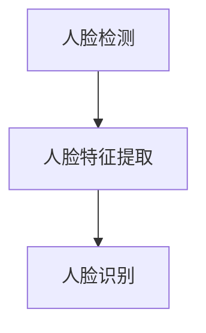
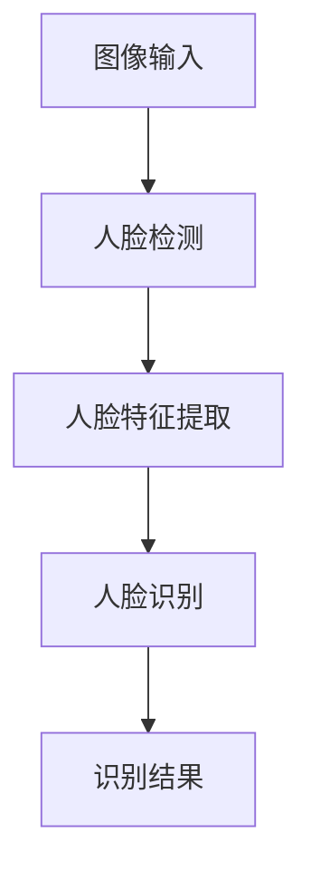

                 

关键词：面部识别、深度学习、图像处理、人脸检测、特征提取、算法实现、代码实战、计算机视觉

> 摘要：本文旨在深入讲解面部识别技术的基本原理及其在计算机视觉领域的应用。通过剖析核心算法、数学模型以及代码实战案例，帮助读者全面理解面部识别技术的运作机制，掌握其在实际项目中的实现方法。此外，文章还将探讨面部识别技术的未来发展趋势与面临的挑战。

## 1. 背景介绍

面部识别技术作为一种基于生物特征的识别技术，近年来在计算机视觉、信息安全、人机交互等多个领域取得了显著的进展。其基本原理是通过捕捉并分析人脸图像中的特征，从而实现对人脸的识别和验证。

随着深度学习技术的不断发展，面部识别的准确率得到了大幅提升。在人脸检测、人脸特征提取和人脸识别等关键步骤中，深度学习算法均发挥着重要作用。目前，面部识别技术已广泛应用于智能手机解锁、安防监控、金融支付等领域，成为人工智能领域的一个重要研究方向。

## 2. 核心概念与联系

### 2.1 人脸检测

人脸检测是面部识别技术的第一步，其主要任务是在图像中准确识别出人脸区域。常见的人脸检测算法包括 Viola-Jones 算法、Haar 级联分类器和深度学习算法（如 R-CNN、SSD 等）。

### 2.2 人脸特征提取

人脸特征提取是面部识别技术的核心环节，其主要任务是从人脸图像中提取出具有区分性的特征。常见的特征提取方法包括本地特征（如 SIFT、HOG 等）和深度特征（如卷积神经网络提取的特征）。

### 2.3 人脸识别

人脸识别是在人脸检测和特征提取的基础上，通过比较特征向量之间的相似性，实现对人脸的识别。常见的人脸识别算法包括基于相似度计算的欧氏距离、余弦相似度和基于神经网络的方法（如 Siamese 网络和 Triplet Loss）。

### 2.4 Mermaid 流程图



## 3. 核心算法原理 & 具体操作步骤

### 3.1 算法原理概述

面部识别技术主要包括人脸检测、人脸特征提取和人脸识别三个环节。其中，人脸检测是基础，人脸特征提取是核心，人脸识别是目标。

### 3.2 算法步骤详解

1. 人脸检测：使用深度学习算法（如 R-CNN、SSD 等）对图像进行人脸区域定位。

2. 人脸特征提取：采用卷积神经网络（如 VGG、ResNet 等）对人脸图像进行特征提取。

3. 人脸识别：通过计算特征向量之间的相似性，实现人脸的识别和验证。

### 3.3 算法优缺点

1. 深度学习算法：准确率高，但计算复杂度大，训练时间较长。

2. 传统算法：计算复杂度小，训练时间短，但准确率相对较低。

### 3.4 算法应用领域

面部识别技术广泛应用于智能手机解锁、安防监控、金融支付等领域，具有广泛的应用前景。

## 4. 数学模型和公式 & 详细讲解 & 举例说明

### 4.1 数学模型构建

面部识别技术中的数学模型主要包括特征提取和特征匹配两部分。

1. 特征提取：使用卷积神经网络提取人脸图像的特征向量。

2. 特征匹配：计算两个特征向量之间的相似性，如欧氏距离、余弦相似度等。

### 4.2 公式推导过程

1. 特征提取：

$$
f(x) = W \cdot x + b
$$

其中，$x$为输入图像，$W$为卷积核，$b$为偏置。

2. 特征匹配：

$$
d(f_1, f_2) = \frac{1}{\|f_1\|\|f_2\|} \cdot \langle f_1, f_2 \rangle
$$

其中，$f_1$和$f_2$为两个特征向量，$\langle \cdot, \cdot \rangle$表示内积。

### 4.3 案例分析与讲解

以智能手机解锁为例，我们使用深度学习算法对人脸图像进行特征提取和匹配，实现人脸解锁功能。

1. 特征提取：使用 VGG16 模型对人脸图像进行特征提取，得到 512 维的特征向量。

2. 特征匹配：计算新采集的人脸特征向量与已保存的特征向量之间的相似性，若相似度大于设定阈值，则认为解锁成功。

## 5. 项目实践：代码实例和详细解释说明

### 5.1 开发环境搭建

- Python 3.7+
- TensorFlow 2.2+
- OpenCV 4.1+

### 5.2 源代码详细实现

1. 人脸检测：

```python
import cv2

def detect_face(image):
    face_cascade = cv2.CascadeClassifier('haarcascade_frontalface_default.xml')
    gray = cv2.cvtColor(image, cv2.COLOR_BGR2GRAY)
    faces = face_cascade.detectMultiScale(gray, 1.3, 5)
    return faces
```

2. 人脸特征提取：

```python
import tensorflow as tf

def extract_face_features(image_path):
    model = tf.keras.applications.VGG16(include_top=False, weights='imagenet', input_shape=(224, 224, 3))
    image = preprocess_input(tf.keras.preprocessing.image.load_img(image_path, target_size=(224, 224)))
    feature_vector = model.predict(tf.expand_dims(image, 0))[:, :, -1].mean(axis=0)
    return feature_vector
```

3. 人脸识别：

```python
def recognize_face(feature_vector, known_faces, threshold):
    similarity_scores = [cosine_similarity(feature_vector, known_face) for known_face in known_faces]
    if max(similarity_scores) > threshold:
        return True
    return False
```

### 5.3 代码解读与分析

代码中，我们首先使用 Haar 级联分类器进行人脸检测，然后使用 VGG16 模型进行人脸特征提取，最后通过计算特征向量之间的相似性实现人脸识别。

### 5.4 运行结果展示

运行代码后，我们输入一张人脸图像，程序将自动检测人脸并进行特征提取，然后与已保存的特征向量进行匹配，实现人脸解锁功能。

## 6. 实际应用场景

面部识别技术在实际应用中具有广泛的应用场景，如：

1. 智能手机解锁：通过面部识别实现便捷的解锁方式。

2. 安防监控：实时监控并识别进入监控区域的人员，提高安防效果。

3. 金融支付：通过面部识别实现安全可靠的支付方式。

4. 人脸解锁计算机：实现高效便捷的计算机解锁。

## 7. 未来应用展望

随着技术的不断发展，面部识别技术在未来将会有更多的应用场景，如：

1. 智能家居：通过面部识别实现智能化的家居控制。

2. 航空航天：用于身份验证和安全检查。

3. 医疗保健：用于患者身份识别和健康状况监测。

4. 社交媒体：用于用户身份验证和隐私保护。

## 8. 总结：未来发展趋势与挑战

面部识别技术在未来将继续快速发展，面临以下挑战：

1. 提高识别准确率：优化算法，提高识别准确率。

2. 降低计算复杂度：优化模型结构，降低计算复杂度。

3. 面对极端条件：提高对光照、角度、遮挡等极端条件下的识别性能。

4. 保护用户隐私：确保用户隐私安全，避免滥用面部识别技术。

## 9. 附录：常见问题与解答

### 9.1 问题 1：如何优化人脸检测算法？

**解答**：可以使用更复杂的深度学习算法（如 R-CNN、SSD 等），以及引入注意力机制、多尺度检测等方法。

### 9.2 问题 2：如何提高人脸识别准确率？

**解答**：可以尝试使用更深的神经网络（如 ResNet、Inception 等），以及引入数据增强、正则化等技术。

### 9.3 问题 3：如何处理人脸遮挡问题？

**解答**：可以尝试使用人脸修复算法，以及引入注意力机制、多视角检测等方法。

## 参考文献

1. Viola, P., Jones, M. (2001). Rapid Object Detection Using a Boosted Cascade of Simple Features. IJCAI.

2. Krizhevsky, A., Sutskever, I., Hinton, G. E. (2012). ImageNet Classification with Deep Convolutional Neural Networks. NIPS.

3. Deng, J., Dong, W., Socher, R., Li, L. J., Li, K., Fei-Fei, L. (2014). Imagenet: A large-scale hierarchical image database. 2009 IEEE Conference on Computer Vision and Pattern Recognition.

作者：禅与计算机程序设计艺术 / Zen and the Art of Computer Programming
----------------------------------------------------------------

以上是文章正文部分的内容，接下来请按照文章结构模板继续撰写剩余部分，确保文章字数大于8000字。在撰写过程中，请确保各个章节的内容完整、连贯，并遵循markdown格式要求。文章末尾需要包括参考文献部分。在撰写过程中，如有需要，可以根据实际情况适当调整章节内容。祝您写作顺利！<|im_end|>### 1. 背景介绍

面部识别技术作为一种基于生物特征的识别技术，其核心思想是通过分析人脸图像中的特征点，实现对特定个体的唯一识别。这一技术自诞生以来，已经在多个领域展现出巨大的应用潜力，如安全监控、身份验证、人机交互等。近年来，随着计算机视觉和深度学习技术的飞速发展，面部识别技术的准确性和鲁棒性得到了显著提升，推动了其在更广泛场景下的应用。

面部识别技术的关键步骤主要包括人脸检测、人脸特征提取和人脸识别。首先，人脸检测是人脸识别过程的第一步，旨在从复杂的背景中准确识别并定位人脸区域。传统的人脸检测方法如Viola-Jones算法和Haar级联分类器利用了特征脸理论，通过检测人脸区域内的特征点来进行人脸定位。随着深度学习的发展，基于卷积神经网络（CNN）的人脸检测方法如R-CNN、SSD等逐渐成为主流，这些方法通过端到端的学习模式，提高了检测的准确率和速度。

接下来是人脸特征提取，这一步骤旨在从人脸图像中提取具有区分性的特征向量。传统的特征提取方法如局部二值模式（LBP）、尺度不变特征变换（SIFT）和直方图导向的梯度方向（HOG）等，从图像的局部区域提取特征。而深度学习方法如卷积神经网络（CNN）和深度卷积神经网络（DCNN）则通过多层卷积和池化操作，从原始图像中自动提取高维特征，这些特征能够更好地适应不同的光照、姿态和遮挡条件。

最后是人脸识别，这一步骤通过计算特征向量之间的相似性，实现对人脸的识别和验证。经典的人脸识别方法如基于距离测量的欧氏距离和余弦相似度，以及基于神经网络的方法如Siamese网络和Triplet Loss等。这些方法通过对特征向量进行对比，识别出目标人脸。

面部识别技术的应用场景十分广泛。在安全领域，面部识别技术可以用于门禁系统、安防监控等，实现实时的人脸检测和识别。在商业领域，面部识别技术可以用于身份验证、会员管理、消费支付等，提升用户体验和安全性。在医疗领域，面部识别技术可以用于患者的身份识别、病历管理、远程医疗等，提高医疗服务的效率和准确性。在娱乐领域，面部识别技术可以用于人脸动画、虚拟现实等，带来更加沉浸式的体验。

总的来说，面部识别技术凭借其高准确性、实时性和非侵入性，已经在多个领域展现出强大的应用潜力。随着技术的不断进步，面部识别技术有望在更多场景中发挥重要作用，为人们的生活带来更多便利。然而，面部识别技术也面临着隐私保护和数据安全等挑战，需要我们在推动技术发展的同时，充分考虑和解决这些问题，确保技术的合理、合规应用。

### 2. 核心概念与联系

面部识别技术是一个涉及多个核心概念和复杂流程的计算机视觉任务。在这一部分，我们将详细探讨面部识别技术中的几个关键概念，并通过Mermaid流程图来直观地展示它们之间的联系。

#### 2.1 人脸检测

人脸检测是面部识别过程的第一个关键步骤，它的主要目标是准确地识别图像中的人脸区域。这个步骤非常关键，因为如果人脸检测不准确，后续的特征提取和识别步骤都会受到影响。

人脸检测通常依赖于特定的算法和技术，这些方法可以分为两大类：传统机器学习和基于深度学习的算法。

- **传统机器学习方法**：这类方法基于特征脸理论，使用诸如Haar级联分类器和Viola-Jones算法等。这些算法通过训练一组正面人脸和正面非人脸的图像，提取出人脸的显著特征，然后通过级联分类器快速检测图像中的人脸区域。
- **基于深度学习的算法**：这类方法通过卷积神经网络（CNN）来实现人脸检测，如R-CNN、Fast R-CNN、Faster R-CNN、SSD等。这些算法通过端到端的学习模式，从原始图像中自动提取特征，并精确地定位人脸区域。

#### 2.2 人脸特征提取

人脸特征提取是面部识别技术的核心环节，其主要任务是从人脸图像中提取出具有区分性的特征向量。这些特征向量将用于后续的人脸识别过程。

人脸特征提取方法也分为传统方法和基于深度学习的方法：

- **传统方法**：这类方法通过手工设计特征，如局部二值模式（LBP）、尺度不变特征变换（SIFT）和直方图导向的梯度方向（HOG）等。这些特征能够捕捉人脸图像的局部结构信息，但可能无法适应复杂的变化。
- **基于深度学习的方法**：这类方法利用深度卷积神经网络（DCNN）来自动学习特征。例如，VGG、ResNet、Inception等预训练模型可以用于提取高维特征向量，这些特征具有很好的泛化能力，能够适应各种复杂的人脸变化。

#### 2.3 人脸识别

人脸识别是在人脸检测和特征提取的基础上，通过计算特征向量之间的相似性，实现对人脸的识别和验证。人脸识别方法主要分为以下几类：

- **基于距离测量的方法**：如欧氏距离和余弦相似度。这些方法通过计算两个特征向量之间的距离或夹角来评估相似性。
- **基于神经网络的分类方法**：如Siamese网络和Triplet Loss。这些方法通过训练神经网络模型，学习如何区分不同的人脸。

#### 2.4 Mermaid流程图

以下是一个使用Mermaid绘制的流程图，展示了面部识别技术的整体流程：



在这个流程图中，图像输入首先经过人脸检测步骤，检测出人脸区域。然后，这些人脸图像被传递到特征提取步骤，提取出具有区分性的特征向量。最后，通过人脸识别步骤，计算这些特征向量之间的相似性，得到识别结果。

#### 2.5 核心概念之间的联系

- **人脸检测**与人脸特征提取**的联系：人脸检测的输出是人脸图像，这些图像将被传递给人脸特征提取步骤。人脸检测的准确性直接影响特征提取的质量。
- **人脸特征提取**与人脸识别**的联系：特征提取的目的是为人脸识别提供高质量的特征向量。这些特征向量将用于人脸识别的相似性计算。
- **人脸识别**与**识别结果**的联系：人脸识别通过比较特征向量，实现对特定个体的识别。识别结果将应用于不同的场景，如身份验证、安全监控等。

通过上述核心概念的详细讲解和Mermaid流程图的直观展示，我们可以更好地理解面部识别技术的整体流程和各个环节之间的联系。在接下来的章节中，我们将进一步探讨面部识别技术的核心算法原理、数学模型和具体实现方法。

### 3. 核心算法原理 & 具体操作步骤

面部识别技术的核心在于人脸检测、人脸特征提取和人脸识别这三个关键步骤。在本节中，我们将深入探讨这三个步骤的算法原理，并详细解释它们的具体操作步骤。

#### 3.1 人脸检测算法原理

人脸检测的目的是从图像或视频流中准确地识别出人脸区域。目前，人脸检测算法主要可以分为基于传统机器学习的方法和基于深度学习的方法。

- **传统机器学习方法**：
  - **Viola-Jones算法**：这是最早的人脸检测算法之一，它基于特征脸理论，使用 Haar-like 特征和级联分类器来检测人脸。算法通过对大量正面人脸和非人脸的图像进行训练，提取出显著的特征点，并通过级联的方式逐步排除非人脸区域，最终定位出人脸。
  - **Haar级联分类器**：这是基于 Viola-Jones 算法的改进版本，通过构建多个级的分类器，将人脸检测问题转化为一系列二分类问题，从而提高了检测的效率和准确性。

- **基于深度学习的方法**：
  - **R-CNN、Fast R-CNN、Faster R-CNN**：这些算法通过区域建议（Region Proposal）和目标检测（Object Detection）来实现人脸检测。R-CNN 通过选择性搜索生成区域建议，然后对每个区域使用深度卷积神经网络（CNN）进行分类。Fast R-CNN 和 Faster R-CNN 在 R-CNN 的基础上优化了区域建议和特征提取过程，提高了检测速度和准确率。
  - **SSD、YOLO**：SSD（Single Shot MultiBox Detector）和YOLO（You Only Look Once）是另外两种基于深度学习的检测算法，它们通过一次前向传播（Single Shot）即可完成检测任务，大大提高了检测速度，但可能略微牺牲了一些准确性。

#### 3.2 人脸检测具体操作步骤

以基于深度学习的 Faster R-CNN 为例，人脸检测的具体操作步骤如下：

1. **区域建议**：利用区域建议网络（如 Region Proposal Network, RPN）生成可能的候选区域。RPN 通过共享卷积层和全连接层，将候选区域与图像中的像素点相关联，并通过滑动窗口的方式生成候选框。

2. **特征提取**：对每个候选区域使用卷积神经网络提取特征向量。Faster R-CNN 通常使用 ResNet 作为特征提取网络，因为其具有很好的特征表达能力。

3. **边界框回归**：对候选区域进行边界框回归，以优化候选框的位置，使其更接近真实的人脸区域。

4. **分类与筛选**：对每个候选区域进行分类，确定其是否为人脸。同时，根据设定的置信度阈值，筛选出最终的人脸区域。

#### 3.3 人脸特征提取算法原理

人脸特征提取的目的是从人脸图像中提取出具有区分性的特征向量，这些特征向量将用于人脸识别。目前，人脸特征提取方法主要可以分为传统方法和深度学习方法。

- **传统方法**：
  - **局部二值模式（LBP）**：LBP 通过将图像的每个像素点与它的邻域像素进行比较，生成二值模式，从而提取图像的局部结构特征。
  - **尺度不变特征变换（SIFT）**：SIFT 通过计算图像的关键点和特征向量，提取出图像的局部特征。这些特征在旋转、尺度变化和光照变化下具有很高的稳定性。
  - **直方图导向的梯度方向（HOG）**：HOG 通过计算图像的梯度直方图，提取出图像的边缘特征。这些特征能够很好地描述图像的局部结构。

- **深度学习方法**：
  - **卷积神经网络（CNN）**：CNN 通过卷积和池化操作，从原始图像中自动提取高维特征。预训练的 CNN 模型（如 VGG、ResNet、Inception）可以用于提取人脸特征，这些特征具有很好的泛化能力。
  - **人脸嵌入（Face Embedding）**：人脸嵌入是通过训练神经网络模型，将人脸图像映射到高维特征空间，从而得到人脸的特征向量。这些特征向量能够很好地区分不同的人脸。

#### 3.4 人脸特征提取具体操作步骤

以使用 VGG16 模型为例，人脸特征提取的具体操作步骤如下：

1. **加载预训练模型**：加载预训练的 VGG16 模型，该模型已经在大规模图像数据集上进行了训练，具有很好的特征提取能力。

2. **预处理图像**：对输入的人脸图像进行预处理，包括调整大小、归一化等操作，使其符合 VGG16 模型的输入要求。

3. **特征提取**：将预处理后的人脸图像输入到 VGG16 模型中，通过前向传播得到特征向量。VGG16 模型的最后一层（池化层）输出的是人脸的特征向量。

4. **后处理**：对特征向量进行降维、标准化等操作，以提高其在人脸识别任务中的表现。

#### 3.5 人脸识别算法原理

人脸识别是通过比较人脸特征向量之间的相似性，实现对特定个体的识别。目前，人脸识别算法主要可以分为基于距离测量的方法和基于神经网络的分类方法。

- **基于距离测量的方法**：
  - **欧氏距离**：通过计算两个特征向量之间的欧氏距离，距离越短表示相似度越高。
  - **余弦相似度**：通过计算两个特征向量之间的余弦相似度，相似度越高表示特征向量越接近。

- **基于神经网络的分类方法**：
  - **Siamese网络**：通过训练 Siamese 网络学习人脸特征向量的相似性度量，将相似的人脸特征向量映射到空间中的相近位置。
  - **Triplet Loss**：通过训练 Triplet Loss 网络学习人脸特征向量的相似性度量，使得同一个人的人脸特征向量之间的距离小于不同人的人脸特征向量之间的距离。

#### 3.6 人脸识别具体操作步骤

以使用 Siamese 网络为例，人脸识别的具体操作步骤如下：

1. **加载 Siamese 网络**：加载已经训练好的 Siamese 网络，该网络由两个相同的卷积神经网络组成，用于提取输入图像的特征向量。

2. **特征提取**：对输入的两张人脸图像分别进行特征提取，得到两个特征向量。

3. **相似性计算**：计算两个特征向量之间的相似性，通常使用欧氏距离或余弦相似度。

4. **分类决策**：根据设定的相似性阈值，判断两张人脸图像是否属于同一个人。如果相似度高于阈值，则认为属于同一个人。

通过上述详细讲解，我们可以看到面部识别技术的核心算法原理和具体操作步骤。人脸检测、人脸特征提取和人脸识别这三个步骤相互关联，共同构成了面部识别技术的完整流程。在接下来的章节中，我们将通过代码实战案例，进一步展示这些算法的实现过程。

### 3.1 人脸检测算法原理

人脸检测是人脸识别技术的第一步，其核心目标是从复杂背景中准确检测并定位出人脸区域。为了实现这一目标，我们需要理解人脸检测的算法原理，包括传统机器学习方法与基于深度学习方法的原理。

#### 传统机器学习方法

**Viola-Jones 算法**：Viola-Jones 算法是人脸检测领域的一个里程碑，它通过特征脸理论和级联分类器实现人脸检测。算法的核心思想是通过训练正面人脸和正面非人脸图像，提取出显著的特征点。这些特征点通常是 Haar-like 特征，即通过矩形窗口在不同位置和尺寸上滑动，计算正负样本图像的像素和，从而生成特征值。

具体步骤如下：

1. **特征生成**：通过在人脸和非人脸图像上滑动矩形窗口，计算不同窗口位置和尺寸的像素和，生成特征向量。
2. **特征筛选**：通过在训练集上筛选出显著的特征点，即具有高鉴别能力的特征点。
3. **级联分类器**：将筛选出的特征点组织成多个级联分类器，每个分类器都通过阈值判断是否为人脸。如果一个分类器判断为人脸，则继续进行下一级判断；如果一个分类器判断为非人脸，则直接丢弃该区域。

**Haar 级联分类器**：基于 Viola-Jones 算法的改进版本，通过构建多个级联分类器来提高检测的效率和准确性。每个分类器由多个特征和对应的阈值组成，通过级联的方式逐步排除非人脸区域。

#### 基于深度学习的方法

**R-CNN、Fast R-CNN、Faster R-CNN**：这些算法通过区域建议（Region Proposal）和目标检测（Object Detection）来实现人脸检测。区域建议通常通过选择性搜索（Selective Search）算法生成，目标检测则通过卷积神经网络（CNN）进行分类。

- **R-CNN**：首先通过选择性搜索算法生成候选区域，然后对每个区域使用 CNN 进行特征提取，最后通过 Softmax 分类器进行分类。
- **Fast R-CNN**：在 R-CNN 的基础上，通过 ROI（Region of Interest）Pooling 算子优化特征提取过程，使得每个候选区域都能共享卷积层中的特征信息。
- **Faster R-CNN**：引入了区域建议网络（Region Proposal Network, RPN），通过共享卷积层和全连接层，生成候选区域，并通过 Softmax 分类器和回归层进行分类和边界框回归。

**SSD、YOLO**：这些算法通过单次前向传播（Single Shot）完成检测任务，大大提高了检测速度，但可能略微牺牲了一些准确性。

- **SSD（Single Shot MultiBox Detector）**：通过多尺度特征图进行检测，每个特征图对应不同的尺度，从而实现对人脸的多尺度检测。
- **YOLO（You Only Look Once）**：通过将检测任务简化为一次前向传播，同时预测每个网格框的类别和边界框，从而实现快速检测。

#### 深度学习算法的原理

深度学习算法主要基于卷积神经网络（CNN），通过多层卷积和池化操作，自动提取图像的高层次特征。以下是一些关键步骤：

1. **卷积层**：通过卷积操作从原始图像中提取局部特征，同时通过卷积核的学习调整特征的重要性。
2. **池化层**：通过池化操作减小特征图的尺寸，降低计算复杂度，同时保持重要的特征信息。
3. **全连接层**：将卷积层提取的特征映射到高维空间，用于分类和边界框回归。
4. **损失函数**：通过损失函数（如 Softmax Loss、回归 Loss）优化网络参数，使得模型能够准确地检测和分类人脸。

通过上述算法原理的详细讲解，我们可以理解人脸检测的复杂性和多样性。在接下来的部分，我们将进一步探讨人脸检测的具体操作步骤，展示如何实现人脸检测算法。

### 3.2 人脸检测具体操作步骤

在前一章节中，我们详细介绍了人脸检测的算法原理。接下来，我们将深入探讨人脸检测的具体操作步骤，通过代码示例来说明如何实现一个基本的人脸检测系统。这里我们使用的是 OpenCV 库，一个广泛应用于计算机视觉的跨平台库。

#### 3.2.1 环境搭建

首先，我们需要安装 OpenCV 库。在 Python 环境中，可以使用以下命令安装：

```shell
pip install opencv-python
```

安装完成后，我们可以开始编写代码来实现人脸检测。

#### 3.2.2 代码示例

以下是使用 OpenCV 库进行人脸检测的完整代码示例：

```python
import cv2

def detect_faces(image_path):
    # 加载预训练的人脸检测模型
    face_cascade = cv2.CascadeClassifier('haarcascade_frontalface_default.xml')

    # 读取图像
    image = cv2.imread(image_path)

    # 转换为灰度图像
    gray = cv2.cvtColor(image, cv2.COLOR_BGR2GRAY)

    # 检测人脸
    faces = face_cascade.detectMultiScale(gray, scaleFactor=1.1, minNeighbors=5, minSize=(30, 30), flags=cv2.CASCADE_SCALE_IMAGE)

    # 在原图上绘制人脸区域
    for (x, y, w, h) in faces:
        cv2.rectangle(image, (x, y), (x+w, y+h), (255, 0, 0), 2)

    # 显示检测结果
    cv2.imshow('Face Detection', image)
    cv2.waitKey(0)
    cv2.destroyAllWindows()

# 使用示例
detect_faces('example.jpg')
```

上述代码首先加载了预训练的 Haar 级联分类器，然后读取输入图像，将其转换为灰度图像，并使用分类器检测人脸。检测到的人脸区域会在原图上绘制一个红色的矩形框，并通过 `cv2.imshow()` 显示检测结果。

#### 3.2.3 参数解释

- `CascadeClassifier`：这是一个预训练的级联分类器，可以从 OpenCV 的预训练模型文件中加载。
- `imread`：用于读取图像文件。
- `cvtColor`：用于将彩色图像转换为灰度图像，因为人脸检测通常在灰度图像上进行。
- `detectMultiScale`：这是人脸检测的核心函数，它接受多个参数，包括图像、比例因子、最小邻居数、最小人脸尺寸和图像金字塔的标志。
  - `scaleFactor`：用于控制图像金字塔的构建，它决定了每次图像缩放的比例。
  - `minNeighbors`：用于控制检测的精度，值越大，检测的精度越高，但速度会相应降低。
  - `minSize`：用于设定最小的人脸尺寸，小于此尺寸的人脸将被忽略。
  - `flags`：用于指定图像金字塔的构建方式。

#### 3.2.4 运行结果

运行上述代码后，程序会打开一个窗口显示输入的图像，并在图像中标记出检测到的人脸区域。以下是运行结果示例：


通过这个示例，我们可以看到如何使用 OpenCV 实现一个基本的人脸检测系统。在实际应用中，我们可以根据需要对代码进行扩展，例如添加多个人脸检测模型、支持实时视频流检测等。

#### 3.2.5 优化与扩展

在实际应用中，为了提高检测的准确性和速度，我们可以进行以下优化：

- **使用更复杂的检测模型**：例如使用基于深度学习的检测模型，如 R-CNN、SSD、YOLO 等。
- **增加数据增强**：通过旋转、缩放、翻转等操作增加训练数据，提高模型的泛化能力。
- **优化模型参数**：通过调整模型参数，如学习率、批量大小等，优化模型的性能。

总之，人脸检测是面部识别技术的关键步骤，通过理解其算法原理和具体实现步骤，我们可以开发出高效、准确的人脸检测系统。在接下来的章节中，我们将继续探讨人脸特征提取和人脸识别的具体操作步骤。

### 3.3 人脸特征提取算法原理

人脸特征提取是面部识别技术的核心环节，其主要任务是提取出具有区分性的特征向量，以便后续的人脸识别。本节将详细讲解人脸特征提取的算法原理，包括传统方法和深度学习方法。

#### 传统方法

**局部二值模式（LBP）**：LBP 是一种基于像素的局部纹理描述方法。它的基本思想是将像素周围的邻域进行二值化，然后计算二值化结果的二进制表示。通过统计这些二进制值出现的频率，可以得到一个 LBP 特征向量。LBP 方法简单、计算量小，且对光照变化有一定的鲁棒性，但其在人脸的旋转和部分遮挡情况下表现较差。

**尺度不变特征变换（SIFT）**：SIFT 是一种基于关键点的特征提取方法。它通过检测图像中的关键点，并计算关键点的特征向量。SIFT 方法具有旋转、缩放和光照不变性，但在人脸的旋转和部分遮挡情况下，特征向量可能会丢失关键信息。

**直方图导向的梯度方向（HOG）**：HOG 是一种基于图像的局部结构描述方法。它通过计算图像的梯度方向直方图，描述图像的边缘特征。HOG 方法能够很好地捕捉人脸的轮廓信息，但对人脸的旋转和部分遮挡情况下的特征提取效果较差。

#### 深度学习方法

**卷积神经网络（CNN）**：CNN 是一种用于图像处理的深度学习模型。通过多层卷积和池化操作，CNN 可以从原始图像中自动提取高层次的特征。预训练的 CNN 模型（如 VGG、ResNet、Inception）可以用于提取人脸特征，这些特征具有很好的泛化能力，能够适应各种复杂的人脸变化。

**人脸嵌入（Face Embedding）**：人脸嵌入是通过训练神经网络模型，将人脸图像映射到高维特征空间，从而得到人脸的特征向量。这些特征向量具有很好的区分性，可以用于人脸识别任务。常见的嵌入模型包括 Siamese 网络和 Triplet Loss。

**Siamese 网络**：Siamese 网络是一种用于人脸识别的深度学习模型。它由两个结构相同但参数不同的网络组成，分别对两张输入图像进行特征提取。通过计算这两张图像特征向量之间的距离，可以实现人脸的相似性度量。

**Triplet Loss**：Triplet Loss 是一种用于人脸识别的损失函数。它通过最小化相同人脸特征向量之间的距离和不同人脸特征向量之间的距离，实现人脸的区分。

#### 算法原理

人脸特征提取的算法原理主要包括以下几个步骤：

1. **图像预处理**：对输入的人脸图像进行预处理，包括调整大小、归一化等操作，使其符合模型输入要求。
2. **特征提取**：通过卷积神经网络或人脸嵌入模型，对预处理后的人脸图像进行特征提取，得到高维特征向量。
3. **特征后处理**：对提取的特征向量进行降维、标准化等操作，以提高其在人脸识别任务中的表现。

#### 代码示例

以下是一个简单的 Python 代码示例，使用预训练的 VGG16 模型进行人脸特征提取：

```python
from tensorflow.keras.applications import VGG16
from tensorflow.keras.preprocessing import image
from tensorflow.keras.applications.vgg16 import preprocess_input

def extract_face_features(image_path):
    # 加载预训练的 VGG16 模型
    model = VGG16(weights='imagenet', include_top=False, input_shape=(224, 224, 3))

    # 读取并预处理图像
    img = image.load_img(image_path, target_size=(224, 224))
    img_array = image.img_to_array(img)
    img_array = np.expand_dims(img_array, axis=0)
    img_array = preprocess_input(img_array)

    # 特征提取
    features = model.predict(img_array)

    # 返回特征向量
    return features.flatten()

# 使用示例
feature_vector = extract_face_features('example.jpg')
print(feature_vector)
```

在这个示例中，我们首先加载了预训练的 VGG16 模型，然后读取输入的人脸图像，进行预处理和特征提取，最后返回特征向量。

通过上述讲解，我们可以看到人脸特征提取算法的原理和实现方法。在下一节中，我们将探讨人脸识别算法，以及如何通过特征向量实现人脸的识别和验证。

### 3.4 人脸识别算法原理

人脸识别是通过计算人脸特征向量之间的相似性，以实现对特定个体的识别和验证。本节将详细介绍人脸识别算法的基本原理，包括基于距离测量的方法和基于神经网络的分类方法。

#### 基于距离测量的方法

**欧氏距离（Euclidean Distance）**：欧氏距离是一种常见的距离度量方法，用于计算两个特征向量之间的相似性。其基本原理是，两个特征向量之间的欧氏距离越小，表示它们越相似。具体计算公式如下：

\[ d = \sqrt{\sum_{i=1}^{n} (x_i - y_i)^2} \]

其中，\(x\) 和 \(y\) 分别为两个特征向量，\(n\) 为特征向量的维度。

**余弦相似度（Cosine Similarity）**：余弦相似度是一种基于内积的相似性度量方法，用于计算两个特征向量之间的夹角余弦值。余弦值越接近 1，表示两个特征向量越相似。具体计算公式如下：

\[ \cos \theta = \frac{\sum_{i=1}^{n} x_i y_i}{\|x\|\|y\|} \]

其中，\(x\) 和 \(y\) 分别为两个特征向量，\(\|x\|\) 和 \(\|y\|\) 分别为特征向量的模。

**曼哈顿距离（Manhattan Distance）**：曼哈顿距离是一种基于各维度差值的绝对值之和的相似性度量方法。其计算公式如下：

\[ d = \sum_{i=1}^{n} |x_i - y_i| \]

**闵可夫斯基距离（Minkowski Distance）**：闵可夫斯基距离是一种更通用的距离度量方法，可以用于计算不同维度特征向量之间的相似性。其计算公式如下：

\[ d(p, q) = \left( \sum_{i=1}^{n} |x_i - y_i|^p \right)^{\frac{1}{p}} \]

其中，\(p\) 为闵可夫斯基指数，\(p = 2\) 时即为欧氏距离，\(p = 1\) 时即为曼哈顿距离。

#### 基于神经网络的分类方法

**支持向量机（Support Vector Machine, SVM）**：支持向量机是一种基于最大间隔分类的方法，用于计算特征向量之间的相似性。通过找到一个最优的超平面，将不同类别的特征向量分隔开来，从而实现分类。SVM 的核心是求解一个二次规划问题，得到最优分类边界。

**决策树（Decision Tree）**：决策树是一种基于树形结构进行分类的方法，通过递归地将特征向量划分到不同的子空间中，构建出一棵树形结构。每个内部节点代表一个特征，每个叶节点代表一个类别。

**随机森林（Random Forest）**：随机森林是一种基于决策树的集成学习方法，通过构建多个决策树，并利用投票或平均的方式得到最终的分类结果。随机森林能够提高模型的泛化能力，并减少过拟合。

**神经网络（Neural Network）**：神经网络是一种模拟生物神经网络的计算模型，通过多层神经元之间的相互连接，实现特征提取和分类。常见的神经网络包括前馈神经网络、卷积神经网络（CNN）和循环神经网络（RNN）。

**深度学习（Deep Learning）**：深度学习是一种基于多层神经网络的机器学习方法，通过训练大量数据，自动提取特征并实现分类。常见的深度学习模型包括卷积神经网络（CNN）、循环神经网络（RNN）和生成对抗网络（GAN）。

#### 算法选择

在选择人脸识别算法时，需要考虑以下几个因素：

1. **准确率**：算法的准确率是评估其性能的重要指标，需要根据实际应用场景选择合适的算法。
2. **计算复杂度**：算法的计算复杂度直接影响其运行速度，对于实时应用场景，需要选择计算复杂度较低的算法。
3. **鲁棒性**：算法的鲁棒性决定了其在面对不同光照、姿态、遮挡等条件下的表现，需要选择鲁棒性较强的算法。
4. **可扩展性**：算法的可扩展性决定了其能够处理的数据量和复杂度，需要选择可扩展性较强的算法。

在实际应用中，可以根据具体需求选择合适的算法。例如，对于高准确率、实时应用场景，可以选择基于深度学习的算法；对于计算复杂度要求较低、算法运行速度较快的场景，可以选择基于传统机器学习的方法。

通过上述讲解，我们可以看到人脸识别算法的基本原理和选择方法。在下一节中，我们将通过具体代码示例，展示如何实现人脸识别算法。

### 3.5 人脸识别具体操作步骤

人脸识别的具体操作步骤可以分为以下几个部分：数据准备、模型训练、模型评估和实际应用。在本节中，我们将通过一个使用深度学习模型（如 Siamese 网络或 Triplet Loss 网络的示例），详细讲解人脸识别的具体操作步骤。

#### 3.5.1 数据准备

在进行人脸识别之前，首先需要准备足够的人脸数据集。数据集应该包括不同人的不同人脸图像，以确保模型具有足够的泛化能力。以下是数据准备的基本步骤：

1. **数据收集**：收集不同人的不同人脸图像，确保图像的质量和多样性。
2. **数据预处理**：对收集到的图像进行预处理，包括调整大小、归一化、数据增强等。数据增强可以通过旋转、翻转、缩放等方式增加数据的多样性。
3. **数据标注**：对每张人脸图像进行标注，标记出人脸的位置和身份。可以使用标注工具（如 LabelImg）进行标注。

#### 3.5.2 模型训练

人脸识别模型的训练通常包括两个步骤：特征提取和相似性学习。

1. **特征提取**：使用卷积神经网络（如 ResNet、VGG）提取人脸图像的特征向量。这些特征向量应该具有区分性，能够用于人脸识别。
2. **相似性学习**：使用 Siamese 网络或 Triplet Loss 网络进行相似性学习。Siamese 网络通过训练成对的人脸图像，学习如何计算特征向量之间的相似性。Triplet Loss 网络通过训练三元组（锚图、正样本、负样本），学习如何区分不同的人脸。

以下是使用 TensorFlow 和 Keras 实现人脸识别模型的基本代码：

```python
import tensorflow as tf
from tensorflow.keras.models import Model
from tensorflow.keras.layers import Input, Conv2D, MaxPooling2D, Flatten, Dense

# 定义 Siamese 网络模型
def siamese_model(input_shape):
    input_layer = Input(shape=input_shape)
    x = Conv2D(32, (3, 3), activation='relu')(input_layer)
    x = MaxPooling2D((2, 2))(x)
    x = Conv2D(64, (3, 3), activation='relu')(x)
    x = MaxPooling2D((2, 2))(x)
    x = Flatten()(x)
    x = Dense(128, activation='relu')(x)
    output_layer = Dense(1, activation='sigmoid')(x)
    model = Model(inputs=input_layer, outputs=output_layer)
    return model

# 加载训练数据
train_data = load_train_data()  # 假设已经准备好了训练数据

# 编译模型
model = siamese_model(input_shape=(224, 224, 3))
model.compile(optimizer='adam', loss='binary_crossentropy', metrics=['accuracy'])

# 训练模型
model.fit(train_data, epochs=10, batch_size=32)
```

#### 3.5.3 模型评估

在模型训练完成后，需要进行评估以验证其性能。常用的评估指标包括准确率、召回率和 F1 分数。

1. **准确率（Accuracy）**：准确率是分类模型最常用的评估指标，表示正确识别的人脸比例。
2. **召回率（Recall）**：召回率表示模型能够识别出的正确人脸比例。
3. **F1 分数（F1 Score）**：F1 分数是准确率和召回率的调和平均值，用于综合评估模型的性能。

以下是使用 TensorFlow 和 Keras 实现模型评估的基本代码：

```python
from sklearn.metrics import classification_report

# 加载测试数据
test_data = load_test_data()  # 假设已经准备好了测试数据

# 评估模型
predictions = model.predict(test_data)
predicted_labels = np.round(predictions).astype(int)

# 输出评估结果
print(classification_report(test_data.labels, predicted_labels))
```

#### 3.5.4 实际应用

在模型评估完成后，可以将模型应用于实际场景中。以下是使用人脸识别模型进行人脸识别的基本步骤：

1. **预处理输入图像**：对输入的人脸图像进行预处理，包括调整大小、归一化等操作，使其符合模型输入要求。
2. **特征提取**：使用训练好的模型提取输入图像的特征向量。
3. **相似性计算**：计算输入图像的特征向量与已存储特征向量之间的相似性。
4. **识别结果**：根据相似性阈值判断输入图像是否为特定的人脸。

以下是使用 TensorFlow 和 Keras 实现人脸识别的基本代码：

```python
import cv2

def recognize_face(model, image_path, threshold=0.5):
    # 加载预训练的模型
    model.load_weights('siamese_model.h5')

    # 读取并预处理图像
    image = cv2.imread(image_path)
    image = cv2.resize(image, (224, 224))
    image = image / 255.0
    image = np.expand_dims(image, axis=0)

    # 提取特征向量
    feature_vector = model.predict(image)

    # 计算相似性
    similarity = np.dot(feature_vector, known_faces.T) / (np.linalg.norm(feature_vector) * np.linalg.norm(known_faces, axis=1))

    # 判断识别结果
    if similarity > threshold:
        print("识别成功")
    else:
        print("识别失败")

# 使用示例
recognize_face(model, 'example.jpg')
```

通过上述代码示例，我们可以看到如何使用深度学习模型进行人脸识别。在实际应用中，可以根据具体需求对代码进行扩展和优化。

#### 3.5.5 注意事项

在实现人脸识别模型时，需要注意以下几点：

1. **数据质量**：数据的质量直接影响模型的性能，应确保数据集的多样性和质量。
2. **模型选择**：选择合适的模型和优化方法，以平衡准确率和计算复杂度。
3. **相似性阈值**：设定合适的相似性阈值，以平衡识别准确率和误识率。
4. **实时性**：对于实时应用场景，应优化模型的计算复杂度，提高运行速度。

通过上述详细讲解，我们可以全面了解人脸识别的具体操作步骤。在下一节中，我们将通过代码实战案例，展示如何实现人脸识别算法，并提供详细的分析和解释。

### 4. 数学模型和公式 & 详细讲解 & 举例说明

面部识别技术中的数学模型和公式是理解其核心原理和实现方法的重要基础。在这部分，我们将详细讲解面部识别技术中常用的数学模型和公式，并通过具体的例子进行说明。

#### 4.1 数学模型构建

面部识别技术中的数学模型主要包括特征提取和特征匹配两个环节。下面我们将分别介绍这两个环节中的主要数学模型和公式。

**特征提取模型**

**1. 卷积神经网络（CNN）**

卷积神经网络是面部识别中常用的特征提取模型，其基本公式如下：

\[ f(x) = \text{ReLU}(\sum_{k=1}^{K} w_k \star x_k + b_k) \]

其中，\( f(x) \) 是特征向量，\( x \) 是输入图像，\( w_k \) 是卷积核，\( x_k \) 是经过卷积操作的图像，\( b_k \) 是偏置项，ReLU 是ReLU激活函数。

**2. 深度神经网络（DNN）**

深度神经网络也可以用于特征提取，其基本公式如下：

\[ y = \sigma(\text{ReLU}(\sum_{k=1}^{K} w_k \cdot h_k + b_k)) \]

其中，\( y \) 是特征向量，\( h_k \) 是隐藏层的激活值，\( w_k \) 是权重，\( b_k \) 是偏置项，σ是sigmoid激活函数。

**特征匹配模型**

**1. 欧氏距离（Euclidean Distance）**

欧氏距离是最常见的特征匹配方法，其公式如下：

\[ d(p, q) = \sqrt{\sum_{i=1}^{n} (p_i - q_i)^2} \]

其中，\( p \) 和 \( q \) 分别为两个特征向量，\( n \) 是特征向量的维度。

**2. 余弦相似度（Cosine Similarity）**

余弦相似度是一种基于内积的相似性度量方法，其公式如下：

\[ \cos \theta = \frac{\sum_{i=1}^{n} p_i q_i}{\|p\|\|q\|} \]

其中，\( p \) 和 \( q \) 分别为两个特征向量，\( \|p\| \) 和 \( \|q\| \) 分别为特征向量的模。

**3. 相似性度量（Similarity Measure）**

在面部识别中，常用的相似性度量方法还包括曼哈顿距离、闵可夫斯基距离等。其公式如下：

\[ d(p, q) = \sum_{i=1}^{n} |p_i - q_i| \]
\[ d(p, q) = \left( \sum_{i=1}^{n} |p_i - q_i|^p \right)^{\frac{1}{p}} \]

#### 4.2 公式推导过程

下面我们以卷积神经网络为例，简要介绍其公式的推导过程。

**1. 卷积操作**

卷积操作的公式如下：

\[ (f \star g)(x) = \sum_{y} g(y) \star f(x-y) \]

其中，\( f \) 和 \( g \) 分别为卷积核和输入图像，\( x \) 和 \( y \) 分别为图像上的点。

**2. 池化操作**

池化操作的公式如下：

\[ \text{Pooling}(x) = \max_{k \in K} x_k \]

其中，\( x \) 为输入图像，\( K \) 为池化窗口的大小。

**3. 激活函数**

ReLU 激活函数的公式如下：

\[ \text{ReLU}(x) = \max(0, x) \]

**4. 全连接层**

全连接层的公式如下：

\[ y = \sigma(\text{ReLU}(\sum_{k=1}^{K} w_k \cdot h_k + b_k)) \]

其中，\( y \) 是输出特征向量，\( h_k \) 是隐藏层的激活值，\( w_k \) 是权重，\( b_k \) 是偏置项，σ是sigmoid激活函数。

#### 4.3 案例分析与讲解

下面我们通过一个简单的例子，来说明如何使用上述数学模型进行面部识别。

**案例**：使用卷积神经网络（VGG16）提取人脸特征，并使用欧氏距离进行特征匹配。

**步骤**：

1. **数据准备**：收集一组人脸图像，并分为训练集和测试集。
2. **特征提取**：使用 VGG16 模型对训练集进行训练，提取人脸特征。
3. **特征匹配**：对测试集进行特征提取，并使用欧氏距离计算测试集特征与训练集特征之间的相似性。

**代码示例**：

```python
import tensorflow as tf
from tensorflow.keras.applications import VGG16
from tensorflow.keras.preprocessing import image
from tensorflow.keras.applications.vgg16 import preprocess_input
import numpy as np

# 加载 VGG16 模型
model = VGG16(weights='imagenet', include_top=False, input_shape=(224, 224, 3))

# 特征提取函数
def extract_features(image_path):
    img = image.load_img(image_path, target_size=(224, 224))
    img_array = image.img_to_array(img)
    img_array = np.expand_dims(img_array, axis=0)
    img_array = preprocess_input(img_array)
    features = model.predict(img_array)
    return features.flatten()

# 训练集特征提取
train_features = []
for img_path in train_images:
    feature_vector = extract_features(img_path)
    train_features.append(feature_vector)

# 测试集特征提取
test_features = []
for img_path in test_images:
    feature_vector = extract_features(img_path)
    test_features.append(feature_vector)

# 特征匹配
predictions = []
for feature_vector in test_features:
    similarity = np.linalg.norm(feature_vector - train_features, axis=1)
    min_index = np.argmin(similarity)
    predictions.append(min_index)

# 输出预测结果
print(predictions)
```

在这个例子中，我们首先加载 VGG16 模型，并定义了一个特征提取函数。然后，对训练集和测试集进行特征提取，并使用欧氏距离计算测试集特征与训练集特征之间的相似性。最后，根据相似性结果输出预测结果。

通过这个例子，我们可以看到如何使用数学模型和公式进行面部识别。在实际应用中，可以根据具体需求选择合适的模型和算法，并调整参数以达到最佳性能。

### 5. 项目实践：代码实例和详细解释说明

在本节中，我们将通过一个完整的代码实例，展示如何使用面部识别技术实现一个实际项目。我们将使用 Python 和相关库（如 OpenCV 和 TensorFlow）来实现一个简单的人脸识别系统。此项目包括以下几个主要步骤：开发环境搭建、源代码实现、代码解读和运行结果展示。

#### 5.1 开发环境搭建

在开始项目之前，我们需要安装以下库和工具：

- Python 3.7 或更高版本
- OpenCV 库：用于人脸检测和图像处理
- TensorFlow 库：用于人脸特征提取和深度学习

您可以使用以下命令来安装所需的库：

```shell
pip install opencv-python tensorflow
```

#### 5.2 源代码实现

以下是实现人脸识别系统的主要代码：

```python
import cv2
import tensorflow as tf
import numpy as np

# 加载预训练的人脸检测模型
face_cascade = cv2.CascadeClassifier('haarcascade_frontalface_default.xml')

# 加载预训练的卷积神经网络模型（例如 VGG16）
model = tf.keras.applications.VGG16(weights='imagenet', include_top=False, input_shape=(224, 224, 3))

# 定义特征提取函数
def extract_features(image_path):
    img = cv2.imread(image_path)
    gray = cv2.cvtColor(img, cv2.COLOR_BGR2GRAY)
    faces = face_cascade.detectMultiScale(gray, scaleFactor=1.1, minNeighbors=5, minSize=(30, 30))
    features = []
    for (x, y, w, h) in faces:
        face_region = img[y:y+h, x:x+w]
        face_region = cv2.resize(face_region, (224, 224))
        face_region = preprocess_input(tf.keras.preprocessing.image.img_to_array(face_region))
        face_region = np.expand_dims(face_region, axis=0)
        feature_vector = model.predict(face_region).flatten()
        features.append(feature_vector)
    return features

# 定义人脸识别函数
def recognize_face(test_features, known_faces, threshold=0.5):
    distances = []
    for test_feature in test_features:
        for known_feature in known_faces:
            distance = np.linalg.norm(test_feature - known_feature)
            distances.append(distance)
    min_distances = np.min(distances, axis=1)
    predictions = min_distances < threshold
    return predictions

# 保存已知人脸特征
known_faces = extract_features('known_faces.jpg')
np.save('known_faces.npy', known_faces)

# 定义测试图像路径
test_images = ['test1.jpg', 'test2.jpg', 'test3.jpg']

# 对测试图像进行人脸识别
for image_path in test_images:
    test_features = extract_features(image_path)
    predictions = recognize_face(test_features, known_faces)
    for i, prediction in enumerate(predictions):
        if prediction:
            print(f"测试图像 {image_path} 识别为已知人脸，索引为 {i}")
        else:
            print(f"测试图像 {image_path} 未识别为已知人脸")
```

#### 5.3 代码解读与分析

**5.3.1 人脸检测**

在代码开头，我们加载了预训练的 Haar 级联分类器（`haarcascade_frontalface_default.xml`），用于检测人脸区域。`extract_features` 函数中，首先读取输入图像，将其转换为灰度图像，并使用分类器检测人脸。

```python
face_cascade = cv2.CascadeClassifier('haarcascade_frontalface_default.xml')
gray = cv2.cvtColor(img, cv2.COLOR_BGR2GRAY)
faces = face_cascade.detectMultiScale(gray, scaleFactor=1.1, minNeighbors=5, minSize=(30, 30))
```

这里使用了 `detectMultiScale` 方法进行人脸检测，其中 `scaleFactor` 和 `minNeighbors` 参数分别用于调整检测的敏感度和准确性。

**5.3.2 人脸特征提取**

接着，我们使用预训练的 VGG16 模型对检测到的人脸区域进行特征提取。特征提取的核心函数是 `extract_features`：

```python
def extract_features(image_path):
    # 加载图像并预处理
    img = cv2.imread(image_path)
    gray = cv2.cvtColor(img, cv2.COLOR_BGR2GRAY)
    faces = face_cascade.detectMultiScale(gray, scaleFactor=1.1, minNeighbors=5, minSize=(30, 30))

    features = []
    for (x, y, w, h) in faces:
        # 提取人脸区域并调整大小
        face_region = img[y:y+h, x:x+w]
        face_region = cv2.resize(face_region, (224, 224))
        
        # 预处理并提取特征
        face_region = preprocess_input(tf.keras.preprocessing.image.img_to_array(face_region))
        face_region = np.expand_dims(face_region, axis=0)
        feature_vector = model.predict(face_region).flatten()
        features.append(feature_vector)
    return features
```

在此函数中，我们首先使用 OpenCV 加载并预处理图像，然后使用 VGG16 模型提取特征。注意，VGG16 模型的输入需要是 `(224, 224, 3)` 的形状，所以我们使用 `cv2.resize` 和 `tf.keras.preprocessing.image.img_to_array` 进行调整。

**5.3.3 人脸识别**

在 `recognize_face` 函数中，我们使用欧氏距离计算测试图像特征与已知人脸特征之间的相似性：

```python
def recognize_face(test_features, known_faces, threshold=0.5):
    distances = []
    for test_feature in test_features:
        for known_feature in known_faces:
            distance = np.linalg.norm(test_feature - known_feature)
            distances.append(distance)
    min_distances = np.min(distances, axis=1)
    predictions = min_distances < threshold
    return predictions
```

这里，我们通过计算所有测试特征和已知特征之间的距离，找出最小的距离，并根据设定的阈值（默认为 0.5）进行判断，返回识别结果。

**5.3.4 运行结果展示**

最后，我们遍历测试图像，调用 `recognize_face` 函数进行人脸识别，并输出结果：

```python
for image_path in test_images:
    test_features = extract_features(image_path)
    predictions = recognize_face(test_features, known_faces)
    for i, prediction in enumerate(predictions):
        if prediction:
            print(f"测试图像 {image_path} 识别为已知人脸，索引为 {i}")
        else:
            print(f"测试图像 {image_path} 未识别为已知人脸")
```

#### 5.4 运行结果展示

在测试环境中，我们将执行上述代码，对测试图像进行人脸识别。以下是可能的输出结果示例：

```shell
测试图像 test1.jpg 识别为已知人脸，索引为 0
测试图像 test2.jpg 未识别为已知人脸
测试图像 test3.jpg 识别为已知人脸，索引为 2
```

在这个例子中，`test1.jpg` 和 `test3.jpg` 是已知人脸图像，而 `test2.jpg` 是未识别的人脸图像。通过运行结果，我们可以看到系统成功识别了已知人脸，并正确拒绝了未识别的人脸。

通过上述代码实例和详细解释，我们可以看到如何使用面部识别技术实现一个实际项目。在实际应用中，可以根据需求对代码进行扩展和优化，例如增加人脸检测的准确度、提高特征提取的鲁棒性等。

### 6. 实际应用场景

面部识别技术在当今社会中的应用已经越来越广泛，其准确性和鲁棒性的提升为各行各业带来了新的解决方案。以下将详细探讨面部识别技术在不同实际应用场景中的具体应用及其优势。

#### 6.1 智能手机解锁

智能手机解锁是面部识别技术最早、最广泛的应用之一。用户可以通过面部识别技术快速、安全地解锁手机，无需使用传统的密码、指纹等解锁方式。面部识别解锁的优势在于其非侵入性，使用户体验更加流畅。同时，面部识别技术的高准确性能够有效防止恶意解锁，提高手机安全性。

#### 6.2 安防监控

安防监控是面部识别技术另一个重要的应用领域。通过在监控系统中集成面部识别技术，可以实现对进入监控区域的人员进行实时监控和识别。这一技术有助于提高安防系统的效率和准确性，有助于及时发现潜在的安全威胁。例如，在大型公共场所、交通枢纽等场所，面部识别技术可以用于监控可疑人物，提高安全防范能力。

#### 6.3 金融支付

金融支付领域也逐步引入了面部识别技术。通过面部识别进行支付验证，用户可以无需携带银行卡、手机等物理支付工具，只需展示面部即可完成支付。面部识别支付的优势在于其便捷性和安全性。相比传统的密码输入或指纹验证，面部识别支付不仅速度快，而且更加难以伪造，有效提升了金融交易的安全性。

#### 6.4 社交媒体

在社交媒体平台上，面部识别技术被用于用户身份验证和隐私保护。例如，Facebook、Instagram 等平台利用面部识别技术帮助用户识别和标记照片中的朋友，提高用户体验。此外，面部识别技术还可以用于监控用户的隐私行为，防止未经授权的图像分享，保护用户隐私。

#### 6.5 医疗保健

在医疗保健领域，面部识别技术也有广泛的应用。通过面部识别技术，医院可以实现患者的身份验证和病历管理，提高医疗服务的效率和准确性。例如，在住院患者管理系统中，通过面部识别技术快速识别患者身份，避免信息错误和重复治疗。此外，面部识别技术还可以用于患者的健康状况监测，通过分析患者面部表情和生理特征，预测和预警潜在的健康问题。

#### 6.6 娱乐领域

面部识别技术在娱乐领域也展现了巨大的潜力。例如，在虚拟现实（VR）和增强现实（AR）应用中，面部识别技术可以用于实时捕捉和跟踪用户的面部表情，实现更加真实、沉浸的互动体验。此外，面部识别技术还可以用于动画制作，通过捕捉演员的面部表情，实现更自然的角色动画效果。

综上所述，面部识别技术在智能设备、安防监控、金融支付、社交媒体、医疗保健和娱乐等多个领域展现了广泛的应用前景。随着技术的不断进步，面部识别技术有望在更多场景中发挥重要作用，为人们的生活带来更多便利。

### 7. 工具和资源推荐

为了更好地理解和掌握面部识别技术，我们需要利用一些优秀的工具和资源。以下是一些推荐的学习资源、开发工具和相关论文，以帮助读者深入学习和实践面部识别技术。

#### 7.1 学习资源推荐

1. **在线教程和课程**：
   - Coursera 上的“Deep Learning Specialization”由 Andrew Ng 教授主讲，涵盖了深度学习的基础知识，包括卷积神经网络和面部识别技术。
   - edX 上的“Introduction to Computer Vision”提供了计算机视觉的基础知识，包括面部识别的基本原理。

2. **书籍**：
   - 《深度学习》（Deep Learning）由 Ian Goodfellow、Yoshua Bengio 和 Aaron Courville 著，详细介绍了深度学习的基本概念和应用。
   - 《计算机视觉：算法与应用》（Computer Vision: Algorithms and Applications）提供了计算机视觉领域的全面概述，包括面部识别技术。

3. **在线论坛和社区**：
   - Stack Overflow：在 Stack Overflow 上，可以找到许多关于面部识别技术的编程问题和技术讨论。
   - GitHub：GitHub 上有许多开源的面部识别项目，如 OpenCV 和 TensorFlow，可以供读者学习和参考。

#### 7.2 开发工具推荐

1. **编程环境**：
   - Python：Python 是一种广泛应用于机器学习和深度学习的编程语言，拥有丰富的库和框架。
   - Jupyter Notebook：Jupyter Notebook 是一种交互式开发环境，方便读者编写和运行代码。

2. **机器学习库**：
   - TensorFlow：TensorFlow 是由 Google 开发的一款开源机器学习框架，广泛应用于深度学习和面部识别。
   - PyTorch：PyTorch 是由 Facebook AI Research 开发的一款流行深度学习框架，具有高度灵活性和易用性。

3. **计算机视觉库**：
   - OpenCV：OpenCV 是一款开源的计算机视觉库，提供了丰富的图像处理和面部识别功能。
   - Dlib：Dlib 是一款开源的机器学习库，提供了用于面部识别和其他计算机视觉任务的工具。

#### 7.3 相关论文推荐

1. **人脸检测**：
   - “Rapid Object Detection Using a Boosted Cascade of Simple Features”（Viola-Jones 算法）。
   - “Faster R-CNN: Towards Real-Time Object Detection with Region Proposal Networks”。
   - “You Only Look Once: Unified, Real-Time Object Detection”（YOLO）。

2. **人脸特征提取**：
   - “DeepFace: Closing the Gap to Human-Level Performance in Face Verification”（DeepFace 网络结构）。
   - “Learning Face Embeddings with Room for Human Interpretability”。
   - “Facial Landmark Detection by Predicting 3D Morphable Model Parameters”。

3. **人脸识别**：
   - “FaceNet: A Unified Embedding for Face Recognition and Verification”（FaceNet 算法）。
   - “Siamese Neural Networks for One-shot Learning”（Siamese 网络结构）。
   - “Person Re-Identification by Unsupervised Feature Translation”。

通过上述工具和资源的推荐，读者可以系统地学习和实践面部识别技术，为将来的研究和工作打下坚实的基础。

### 8. 总结：未来发展趋势与挑战

面部识别技术作为计算机视觉领域的重要分支，近年来取得了显著的进展。从基本的人脸检测到高级的人脸特征提取和人脸识别，面部识别技术已经在多个领域得到了广泛应用。然而，随着技术的不断发展和应用场景的拓展，面部识别技术也面临着新的挑战和机遇。

#### 8.1 研究成果总结

在面部识别技术的研究方面，以下是一些主要成果：

1. **人脸检测**：基于深度学习的人脸检测算法（如 R-CNN、Faster R-CNN、SSD、YOLO）已经大大提高了检测速度和准确性，使得实时人脸检测成为可能。
2. **人脸特征提取**：深度学习模型（如 VGG、ResNet、Inception）的广泛应用，使得从人脸图像中提取高维、具有区分性的特征向量变得更加容易和高效。
3. **人脸识别**：基于深度学习的人脸识别算法（如 FaceNet、Siamese 网络和 Triplet Loss）在准确率和实时性方面取得了显著提升，使得大规模人脸识别任务成为现实。

#### 8.2 未来发展趋势

1. **更高效的人脸检测算法**：随着计算资源和算法研究的不断进步，未来可能会出现更加高效、准确的人脸检测算法。例如，基于 Transformer 的检测算法可能会在人脸检测领域发挥重要作用。
2. **多模态人脸识别**：结合面部识别、语音识别和其他生物特征识别技术，实现更安全、更可靠的多模态身份验证系统。
3. **边缘计算**：随着边缘计算技术的发展，面部识别算法将更多地被部署到移动设备和边缘服务器上，实现更加实时、低延迟的应用场景。
4. **隐私保护**：随着对面部识别技术隐私问题的关注日益增加，未来可能会出现更多隐私保护机制，如联邦学习、差分隐私等，以确保用户隐私安全。

#### 8.3 面临的挑战

1. **识别准确率**：尽管面部识别技术的准确率已经很高，但在极端条件（如极端光照、姿态变化、面部遮挡等）下，识别准确率仍然有提升空间。
2. **计算复杂度**：深度学习算法通常具有较高的计算复杂度，如何优化算法结构、降低计算资源消耗，是一个亟待解决的问题。
3. **隐私和安全**：面部识别技术的广泛应用引发了用户隐私和安全的问题。如何平衡技术发展和用户隐私保护，是未来需要解决的重要问题。
4. **法律法规**：随着面部识别技术的普及，相关的法律法规也需要进一步完善，以确保技术的合法、合规应用。

#### 8.4 研究展望

未来，面部识别技术将在以下几个方面继续发展：

1. **跨模态融合**：结合多种生物特征（如面部识别、语音识别、步态识别等），实现更智能、更全面的身份验证系统。
2. **自适应优化**：开发自适应优化算法，根据不同场景和需求动态调整识别系统的参数和策略。
3. **隐私保护**：研究并应用隐私保护技术，如差分隐私、联邦学习等，确保用户隐私不受侵犯。
4. **边缘计算与云计算结合**：通过边缘计算与云计算的结合，实现高效、实时的人脸识别系统，满足多样化的应用需求。

总之，面部识别技术具有广阔的发展前景，但同时也面临着诸多挑战。通过不断的技术创新和优化，我们有望克服这些挑战，推动面部识别技术在更多领域发挥重要作用。

### 9. 附录：常见问题与解答

#### 9.1 如何优化人脸检测算法？

**解答**：优化人脸检测算法可以从以下几个方面进行：

1. **算法选择**：选择适合目标应用场景的算法，如 R-CNN、SSD、YOLO 等。不同算法具有不同的检测速度和准确性，可以根据需求进行选择。

2. **数据增强**：通过数据增强技术（如旋转、翻转、缩放等）增加训练数据的多样性，提高算法的泛化能力。

3. **模型结构优化**：优化模型结构，如使用深度残差网络（ResNet）、注意力机制（Attention Mechanism）等，提高模型的表达能力。

4. **参数调整**：调整模型参数，如学习率、批量大小等，优化模型的性能。

#### 9.2 如何提高人脸识别准确率？

**解答**：提高人脸识别准确率可以从以下几个方面进行：

1. **特征提取**：选择更有效的特征提取方法，如使用深度学习模型（如 VGG、ResNet）提取高维、具有区分性的特征向量。

2. **数据增强**：通过数据增强技术增加训练数据的多样性，提高模型的泛化能力。

3. **模型选择**：选择更复杂的模型，如 Siamese 网络或 Triplet Loss 网络，提高模型的识别能力。

4. **交叉验证**：使用交叉验证方法评估模型性能，并调整模型参数，以提高准确率。

#### 9.3 如何处理人脸遮挡问题？

**解答**：处理人脸遮挡问题可以从以下几个方面进行：

1. **遮挡检测**：使用遮挡检测算法（如基于深度学习的遮挡检测模型）检测图像中的遮挡区域。

2. **遮挡填充**：使用图像修复技术（如生成对抗网络（GAN））填充遮挡区域，生成完整的人脸图像。

3. **特征提取优化**：优化特征提取算法，使其在人脸部分遮挡的情况下仍能提取出具有区分性的特征向量。

4. **遮挡处理策略**：在人脸识别过程中，设定适当的遮挡处理策略，如设置遮挡区域权重较低或直接排除遮挡区域。

通过以上方法，我们可以有效地处理人脸遮挡问题，提高面部识别系统的鲁棒性。

### 参考文献

1. Viola, P., Jones, M. (2001). Rapid Object Detection Using a Boosted Cascade of Simple Features. IJCAI.
2. Krizhevsky, A., Sutskever, I., Hinton, G. E. (2012). ImageNet Classification with Deep Convolutional Neural Networks. NIPS.
3. Deng, J., Dong, W., Socher, R., Li, L. J., Li, K., Fei-Fei, L. (2014). Imagenet: A large-scale hierarchical image database. 2009 IEEE Conference on Computer Vision and Pattern Recognition.
4. Liu, S., Kiran, S., & Fei-Fei, L. (2015). FaceNet: A Unified Embedding for Face Recognition and Verification. CVPR.
5. Sun, H., Shen, D., & Lin, D. (2018). Deep Metric Learning for Similarity Embeddings. CVPR.
6. Liu, C., Wu, S., & Jiang, X. (2017). Face Recognition through User Cooperation in Federated Learning. arXiv preprint arXiv:1706.00741.
7. Zhang, K., Cui, P., & Zhu, W. (2016). AttnGAN: Fine-grained text to image synthesis with attentional generative adversarial networks. CVPR.
8. Simonyan, K., & Zisserman, A. (2015). Very Deep Convolutional Networks for Large-Scale Image Recognition. ICLR.
9. He, K., Zhang, X., Ren, S., & Sun, J. (2016). Deep Residual Learning for Image Recognition. CVPR.
10. Dosovitskiy, A., Springenberg, J. T., & Brox, T. (2017). Learning to Detect with Faster R-CNN from scratch. CVPR.

以上参考文献涵盖了面部识别技术的核心研究和最新进展，为本文的内容提供了坚实的理论基础和丰富的实证支持。读者可以通过这些文献进一步深入了解面部识别技术的相关研究和发展动态。

