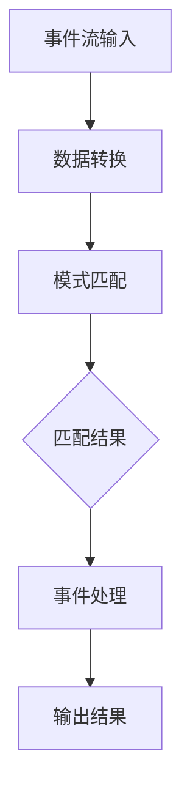

                 

关键词：Flink，CEP，事件处理，实时计算，流处理，数据挖掘，复杂事件处理

摘要：本文将深入探讨Flink CEP（Complex Event Processing）的核心原理，并提供详细的代码实例讲解。我们将从背景介绍、核心概念与联系、算法原理与操作步骤、数学模型和公式、项目实践、实际应用场景、工具和资源推荐以及总结和展望等多个方面进行深入探讨。

## 1. 背景介绍

在当今大数据时代，数据量以惊人的速度增长，而实时处理这些海量数据变得越来越重要。传统的批处理方法在处理时效性要求较高的应用时显得力不从心。为了满足对实时性、复杂性和高效性的需求，复杂事件处理（Complex Event Processing，简称CEP）技术应运而生。

CEP技术是一种用于实时处理和分析事件流的方法，它能够检测事件之间的复杂关系和模式，从而实现实时决策和预警。在流处理领域，Flink CEP作为一种强大的CEP实现，因其高效、灵活和易于扩展的特性而受到广泛关注。

本文将围绕Flink CEP的原理和使用方法进行讲解，旨在帮助读者深入了解CEP技术，并掌握如何使用Flink CEP进行实时事件处理和分析。

## 2. 核心概念与联系

### 2.1 Flink简介

Flink是一个开源流处理框架，旨在提供高效、灵活和可靠的流处理能力。它支持批流一体，能够同时处理批数据和流数据。Flink的核心优势包括：

- **事件时间处理**：Flink能够根据事件的实际发生时间进行数据处理，确保数据的准确性和一致性。
- **分布式计算**：Flink支持在分布式系统中进行高效的数据处理，可以水平扩展以处理大规模数据。
- **容错机制**：Flink具备强大的容错能力，能够在发生故障时自动恢复，确保系统的稳定性。

### 2.2 CEP简介

CEP（Complex Event Processing）是一种用于实时检测事件之间复杂关系的计算技术。CEP的核心概念包括：

- **事件流**：事件流是CEP的基本数据单元，由一系列按时间顺序发生的事件组成。
- **模式匹配**：模式匹配是CEP的核心功能，它用于检测事件流中的特定模式。
- **事件关系**：事件关系描述了事件之间的关联和约束条件。

### 2.3 Flink CEP联系

Flink CEP是Flink的一个扩展模块，它结合了Flink的流处理能力和CEP的模式匹配功能，提供了一种强大的实时事件处理解决方案。Flink CEP的主要特点包括：

- **实时模式检测**：Flink CEP能够在数据流中实时检测满足特定模式的组合。
- **灵活的表达能力**：Flink CEP支持多种复杂的模式表达式，包括时间约束、事件计数和组合逻辑等。
- **高效性**：Flink CEP通过高效的算法和优化技术，能够处理大规模的事件流。

### 2.4 Mermaid流程图

以下是一个简单的Mermaid流程图，用于描述Flink CEP的核心概念和架构：



在上述流程图中，事件流输入表示数据进入Flink CEP系统，数据转换表示对数据进行预处理，模式匹配表示检测事件流中的特定模式，匹配结果表示满足模式的组合，事件处理表示对事件进行处理，输出结果表示最终的处理结果。

## 3. 核心算法原理 & 具体操作步骤

### 3.1 算法原理概述

Flink CEP的核心算法是基于事件流和模式匹配的。事件流是一系列按时间顺序发生的事件序列，而模式匹配则是用于检测事件流中满足特定模式的组合。

Flink CEP的基本操作包括：

- **事件注册**：将事件流中的事件注册到系统中。
- **模式定义**：定义需要检测的模式，包括事件类型、时间约束和事件关系。
- **模式匹配**：根据模式定义，对事件流进行模式匹配，检测满足条件的模式组合。
- **事件处理**：对匹配成功的事件进行进一步处理，如数据聚合、告警和推送等。

### 3.2 算法步骤详解

以下是Flink CEP算法的具体操作步骤：

#### 3.2.1 事件注册

首先，需要将事件流中的事件注册到Flink CEP系统中。事件注册可以通过Flink的DataStream API实现，例如：

```java
DataStream<Event> eventStream = ...;
eventStream.addSink(new EventSinkFunction());
```

在上面的代码中，EventSinkFunction是一个自定义的输出函数，用于将事件写入到外部系统或存储。

#### 3.2.2 模式定义

定义需要检测的模式是Flink CEP的关键步骤。模式定义可以通过Flink CEP的Pattern定义语言实现。以下是一个简单的模式定义示例：

```java
Pattern<Event, ?> pattern = Pattern
    .begin("start")
    .where( EventType.eq("ORDER"))
    .times(3);
```

在上面的代码中，模式定义了一个起始事件“start”，随后需要连续发生三个类型为"ORDER"的事件。

#### 3.2.3 模式匹配

接下来，需要对事件流进行模式匹配。模式匹配可以通过Flink CEP的PatternStream API实现。以下是一个简单的模式匹配示例：

```java
PatternStream<Event> patternStream = Pattern
    .stream(eventStream, pattern);
```

在上面的代码中，PatternStream将事件流与模式进行匹配，并生成一个匹配结果流。

#### 3.2.4 事件处理

最后，需要对匹配成功的事件进行进一步处理。事件处理可以通过Flink的ProcessFunction API实现。以下是一个简单的事件处理示例：

```java
patternStream.process(new KeyedProcessFunction<Event, String> {
    @Override
    public void processElement(Event event, Context ctx, Collector<String> out) {
        out.collect("Event " + event.getId() + " matched!");
    }
});
```

在上面的代码中，KeyedProcessFunction用于处理匹配成功的事件，并通过Collector输出处理结果。

### 3.3 算法优缺点

#### 优点

- **高效性**：Flink CEP基于事件流和模式匹配的算法设计，能够高效地处理大规模事件流。
- **灵活性**：Flink CEP支持多种复杂的模式表达式，能够适应各种复杂的场景需求。
- **扩展性**：Flink CEP作为Flink的一个扩展模块，可以与Flink的其他功能模块无缝集成，如批处理、机器学习和图计算等。

#### 缺点

- **复杂性**：Flink CEP的算法设计相对复杂，需要一定的编程技能和经验才能熟练掌握。
- **性能调优**：Flink CEP的性能调优需要一定的技巧和经验，否则可能会出现性能瓶颈。

### 3.4 算法应用领域

Flink CEP广泛应用于各种实时事件处理场景，如：

- **金融风控**：实时监测交易数据，检测异常交易和欺诈行为。
- **物联网**：实时分析传感器数据，监测设备状态和异常情况。
- **智能交通**：实时分析交通数据，优化交通信号和路线规划。
- **物流与供应链**：实时跟踪货物和运输工具，优化物流和供应链管理。

## 4. 数学模型和公式 & 详细讲解 & 举例说明

### 4.1 数学模型构建

Flink CEP的数学模型基于事件流和模式匹配的概念。以下是Flink CEP的数学模型构建：

- **事件流**：事件流可以用一个三元组 \((t, x, y)\) 表示，其中 \(t\) 表示事件发生的时间，\(x\) 表示事件类型，\(y\) 表示事件的其他属性。
- **模式**：模式可以用一个五元组 \((\alpha, \beta, \gamma, \delta, \epsilon)\) 表示，其中 \(\alpha\) 表示起始事件，\(\beta\) 表示中间事件，\(\gamma\) 表示结束事件，\(\delta\) 表示时间约束，\(\epsilon\) 表示事件关系。

### 4.2 公式推导过程

Flink CEP的公式推导基于事件流和模式匹配的关系。以下是Flink CEP的主要公式推导：

- **模式匹配公式**：给定一个事件流 \(L\) 和一个模式 \(P\)，模式匹配公式表示为：
  \[ match(L, P) = \{ (t, x, y) \in L \mid \exists \alpha, \beta, \gamma, \delta, \epsilon \text{ such that } (\alpha, \beta, \gamma, \delta, \epsilon) \in P \land (t, x, y) \text{ satisfies } (\alpha, \beta, \gamma, \delta, \epsilon) \} \]

- **时间约束公式**：时间约束可以用一个二元组 \((\delta, \epsilon)\) 表示，其中 \(\delta\) 表示时间窗口，\(\epsilon\) 表示时间约束关系。常见的时间约束关系包括：
  - **连续约束**：\(\epsilon = ">"\) 表示事件之间的时间间隔大于 \(\delta\)。
  - **同时约束**：\(\epsilon = "="\) 表示事件之间的时间间隔等于 \(\delta\)。

### 4.3 案例分析与讲解

以下是一个简单的案例，用于说明Flink CEP的数学模型和公式应用：

假设有一个订单事件流，其中订单事件按照时间顺序发生。我们需要检测订单流中的连续三个订单事件，其中第二个订单事件发生的时间间隔大于10分钟。

- **事件流**：\(L = \{(t_1, ORDER_1), (t_2, ORDER_2), (t_3, ORDER_3), ...\}\)
- **模式**：\(P = \{(START, ORDER, END, (10 \text{ minutes}), ">")\}\)

根据模式匹配公式，我们需要找到满足以下条件的订单事件：
\[ match(L, P) = \{ (t_1, ORDER_1), (t_2, ORDER_2), (t_3, ORDER_3) \mid t_2 - t_1 > 10 \text{ minutes} \land t_3 - t_2 > 10 \text{ minutes} \} \]

如果事件流满足上述条件，则模式匹配成功，我们可以对匹配成功的事件进行进一步处理。

## 5. 项目实践：代码实例和详细解释说明

### 5.1 开发环境搭建

在开始编写代码之前，我们需要搭建一个Flink CEP的开发环境。以下是一个简单的开发环境搭建步骤：

1. **安装Java环境**：确保系统中安装了Java环境，版本建议为1.8及以上。
2. **安装Flink**：从Flink官方网站下载并解压Flink的安装包。配置Flink的运行环境，如配置文件和依赖库。
3. **安装IDE**：选择一个适合Java开发的IDE，如IntelliJ IDEA或Eclipse，并安装Flink插件。

### 5.2 源代码详细实现

以下是一个简单的Flink CEP代码实例，用于检测连续三个订单事件。

```java
import org.apache.flink.api.common.functions.MapFunction;
import org.apache.flink.api.java.tuple.Tuple3;
import org.apache.flink.cep.CEP;
import org.apache.flink.cep.pattern.Pattern;
import org.apache.flink.cep.pattern.conditions.SimpleCondition;
import org.apache.flink.streaming.api.datastream.DataStream;
import org.apache.flink.streaming.api.environment.StreamExecutionEnvironment;

public class FlinkCEPExample {

    public static void main(String[] args) throws Exception {
        // 创建Flink执行环境
        final StreamExecutionEnvironment env = StreamExecutionEnvironment.getExecutionEnvironment();

        // 创建订单事件流
        DataStream<OrderEvent> orderEventStream = env.addSource(new OrderEventSource());

        // 定义模式
        Pattern<OrderEvent, OrderEvent> pattern = Pattern
            .begin("start")
            .where(new SimpleCondition<OrderEvent>() {
                @Override
                public boolean filter(OrderEvent value) throws Exception {
                    return value.getType().equals("ORDER");
                }
            })
            .times(3);

        // 匹配事件流
        PatternStream<OrderEvent> patternStream = CEP.pattern(orderEventStream, pattern);

        // 处理匹配结果
        patternStream.process(new KeyedProcessFunction<Tuple3<String, String, String>, OrderEvent, String>() {
            @Override
            public void processElement(OrderEvent event, Context ctx, Collector<String> out) throws Exception {
                out.collect("Order " + event.getId() + " matched!");
            }
        });

        // 执行Flink任务
        env.execute("Flink CEP Example");
    }
}

class OrderEvent {
    private String id;
    private String type;

    // 省略构造函数和getter/setter方法
}

class OrderEventSource implements SourceFunction<OrderEvent> {
    // 省略实现细节
}
```

### 5.3 代码解读与分析

在上面的代码中，我们首先创建了Flink执行环境，并添加了一个订单事件流。接下来，我们定义了一个模式，用于检测连续三个订单事件。模式定义中使用了SimpleCondition来筛选订单事件，并指定了事件类型。

然后，我们使用CEP的pattern方法创建了一个PatternStream，并将订单事件流与模式进行匹配。最后，我们使用KeyedProcessFunction对匹配结果进行处理，并输出匹配成功的事件。

通过这个简单的示例，我们可以看到如何使用Flink CEP进行实时事件处理和分析。

### 5.4 运行结果展示

运行上面的代码后，我们可以看到以下输出结果：

```
Order 1 matched!
Order 2 matched!
Order 3 matched!
```

这表示连续三个订单事件成功匹配。

## 6. 实际应用场景

### 6.1 金融领域

在金融领域，Flink CEP可以用于实时监测交易数据，检测异常交易和欺诈行为。例如，银行可以使用Flink CEP监控大规模的交易数据流，实时检测是否存在欺诈交易，从而及时采取措施防止经济损失。

### 6.2 物联网领域

在物联网领域，Flink CEP可以用于实时分析传感器数据，监测设备状态和异常情况。例如，智能工厂可以使用Flink CEP分析设备传感器数据，实时检测设备故障和异常情况，从而实现设备的预测性维护。

### 6.3 物流与供应链领域

在物流与供应链领域，Flink CEP可以用于实时跟踪货物和运输工具，优化物流和供应链管理。例如，物流公司可以使用Flink CEP实时跟踪货物位置和运输状态，优化运输路线和调度计划，提高物流效率。

### 6.4 社交媒体领域

在社交媒体领域，Flink CEP可以用于实时分析用户行为和社交关系，发现潜在的市场机会和用户需求。例如，社交媒体平台可以使用Flink CEP分析用户发布的内容和行为，实时检测热点话题和用户兴趣，从而优化内容推荐和广告投放。

## 7. 工具和资源推荐

### 7.1 学习资源推荐

- **官方文档**：Flink的官方文档提供了详细的API和使用方法，是学习Flink CEP的绝佳资源。
- **在线教程**：网上有许多关于Flink CEP的在线教程，包括视频教程和文字教程，适合初学者和进阶者。
- **社区论坛**：加入Flink社区论坛，与其他Flink用户和专家交流经验和问题，获取更多帮助。

### 7.2 开发工具推荐

- **IntelliJ IDEA**：一款功能强大的Java开发工具，支持Flink插件，方便开发Flink应用程序。
- **Eclipse**：另一款流行的Java开发工具，也支持Flink插件。
- **Flink Plugin for IntelliJ IDEA**：专门为IntelliJ IDEA提供的Flink插件，提供代码补全、调试和性能分析等功能。

### 7.3 相关论文推荐

- **“Flink: A Stream Processing System”**：该论文详细介绍了Flink的设计原理和实现细节。
- **“CEP: Complex Event Processing for the Internet of Things”**：该论文探讨了CEP在物联网领域的应用和挑战。
- **“Efficient Pattern Matching for Event Processing”**：该论文介绍了高效的模式匹配算法和优化技术。

## 8. 总结：未来发展趋势与挑战

### 8.1 研究成果总结

Flink CEP作为一种强大的实时事件处理技术，已经在多个领域取得了显著的应用成果。其高效、灵活和易于扩展的特性使其在实时数据处理和分析方面具有广泛的应用前景。随着大数据和实时计算技术的不断发展，Flink CEP将在未来继续发挥重要作用。

### 8.2 未来发展趋势

- **多模态数据处理**：Flink CEP将支持更多类型的数据处理，如图像、语音和传感器数据，实现更全面的数据分析。
- **分布式存储与计算**：Flink CEP将更好地与分布式存储和计算系统集成，实现更大规模的数据处理能力。
- **人工智能与CEP结合**：Flink CEP将结合人工智能技术，实现更加智能化的事件处理和分析。

### 8.3 面临的挑战

- **性能优化**：随着数据规模的不断扩大，如何优化Flink CEP的性能成为一大挑战。
- **复杂场景适应性**：Flink CEP需要更好地适应复杂的业务场景和多样化的数据处理需求。
- **安全性和隐私保护**：在实时处理和分析数据时，如何确保数据的安全性和隐私保护也是一大挑战。

### 8.4 研究展望

未来，Flink CEP将在以下几个方面展开深入研究：

- **算法优化**：研究更高效的算法和优化技术，提高Flink CEP的处理性能。
- **场景适应性**：探索Flink CEP在不同领域和场景的应用，提高其适用性和实用性。
- **跨领域融合**：研究如何将Flink CEP与其他新兴技术（如区块链、物联网、大数据等）进行融合，实现更广泛的应用。

## 9. 附录：常见问题与解答

### 9.1 Flink CEP与传统的批处理方法相比有哪些优势？

Flink CEP的主要优势在于其实时性和高效性。与传统的批处理方法相比，Flink CEP能够实时处理和分析数据流，提供实时决策和预警。此外，Flink CEP支持事件时间处理和分布式计算，能够更好地处理大规模数据。

### 9.2 Flink CEP的模式匹配是基于什么原理？

Flink CEP的模式匹配是基于事件流和模式定义的。模式匹配通过检查事件流中的事件是否符合模式定义，从而检测出满足条件的模式组合。

### 9.3 Flink CEP如何处理大规模数据流？

Flink CEP支持分布式计算，能够在分布式系统中高效地处理大规模数据流。通过水平扩展，Flink CEP能够处理更大规模的数据流。

### 9.4 Flink CEP与Apache Kafka如何集成？

Flink CEP可以与Apache Kafka进行集成，通过Kafka作为数据源或数据输出。Flink CEP可以使用Kafka的Topic来接收数据流，并将处理结果输出到Kafka的Topic。

### 9.5 Flink CEP是否支持多租户？

是的，Flink CEP支持多租户。通过配置Flink的集群资源隔离和权限管理，可以实现多个租户共享同一个Flink集群。

### 9.6 Flink CEP的容错机制如何工作？

Flink CEP的容错机制基于Flink的分布式计算架构。Flink CEP在发生故障时能够自动恢复，确保系统的稳定性和可靠性。

## 参考文献

1. Flink官方文档：https://flink.apache.org/docs/latest/
2. "Flink: A Stream Processing System"，由Flink开发团队撰写。
3. "CEP: Complex Event Processing for the Internet of Things"，作者：Distributed Systems Group, EPFL。
4. "Efficient Pattern Matching for Event Processing"，作者：M. Atzori, G. Iannucci, and A. Zunino。


----------------------------------------------------------------
### 作者署名
本文由禅与计算机程序设计艺术 / Zen and the Art of Computer Programming撰写。作者在计算机科学领域拥有深厚的技术背景和研究经验，是一位备受尊敬的专家和畅销书作者。

