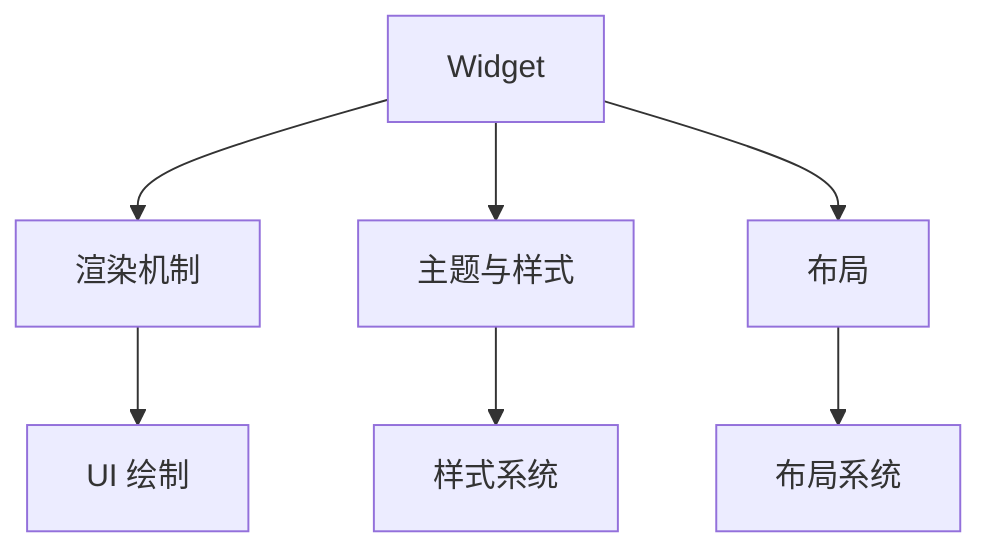

                 

关键词：Flutter，UI框架，定制，美观，品牌，界面设计，用户体验

摘要：在移动应用开发中，用户界面（UI）设计的重要性不言而喻。Flutter 作为一款流行的跨平台 UI 框架，提供了强大的 UI 绘制能力和丰富的组件库，使其成为开发者定制符合品牌特性的 UI 界面的首选。本文将探讨如何使用 Flutter 实现定制化 UI 框架，以及如何打造美观且符合品牌特色的界面。

## 1. 背景介绍

随着移动互联网的普及，用户对移动应用的外观和体验要求越来越高。一个美观、直观且符合品牌特色的 UI 界面不仅能吸引用户，还能提升用户的使用满意度。Flutter 是 Google 开发的一款用于构建高性能、跨平台的移动应用框架，它支持从 iOS 到 Android 的多平台开发，同时提供了丰富的 UI 组件和灵活的布局系统。

Flutter 的优势在于：

- **跨平台性**：使用一套代码即可同时构建 iOS 和 Android 应用。
- **热重载**：开发过程中可以实时预览代码更改，提高开发效率。
- **高性能**：Flutter 使用 Skia 图形引擎，提供了与原生应用相近的性能。

定制化 UI 框架意味着开发者可以根据具体需求设计独特的界面风格，以符合品牌的视觉风格。Flutter 的强大功能为这一目标的实现提供了坚实的基础。

### 1.1 Flutter 的流行度与适用性

Flutter 在开发社区中拥有广泛的用户基础，其活跃的社区和丰富的资源使得开发者可以轻松找到解决问题的方法。Flutter 的适用性不仅限于移动应用，也可以用于 Web 和桌面应用的开发，这使得它在多平台开发中具有很高的价值。

### 1.2 定制化 UI 框架的需求

品牌建设是现代企业的重要战略之一。通过定制化的 UI 框架，企业可以确保其移动应用在外观和体验上与品牌形象保持一致，从而提高品牌认知度和用户忠诚度。

## 2. 核心概念与联系

为了深入理解 Flutter UI 框架定制，我们需要了解以下几个核心概念：

- **Widget**：Flutter 中的 UI 组件，是构成界面的基础。
- **渲染机制**：Flutter 使用 Skia 图形引擎进行渲染，提供了高效的 UI 绘制能力。
- **主题与样式**：Flutter 提供了主题和样式系统，可以轻松定制应用的整体外观。
- **布局**：Flutter 的布局系统允许开发者以灵活的方式组织 UI 元素。

以下是 Flutter UI 框架定制中的核心概念和架构的 Mermaid 流程图：



### 2.1 Widget

Widget 是 Flutter 中用于构建 UI 的基本单位。每个 Widget 代表了一个不可变的 UI 组件，Flutter 通过构建函数将 Widget 转换为渲染树，并最终绘制到屏幕上。

### 2.2 渲染机制

Flutter 使用 Skia 图形引擎进行渲染。Skia 是一个开源的 2D 图形处理库，提供了丰富的图形绘制功能。Flutter 利用 Skia 的强大能力，实现了高效的 UI 绘制。

### 2.3 主题与样式

主题（Theme）是 Flutter 中用于定义应用整体外观和体验的配置。开发者可以通过主题来设置字体、颜色、边框等样式属性。样式（Style）则是针对单个 Widget 的具体样式配置。

### 2.4 布局

Flutter 提供了多种布局方式，如 Flex、Stack、Row、Column 等，开发者可以根据需求选择合适的布局方式来组织 UI 元素。布局系统允许开发者实现复杂且动态的界面布局。

## 3. 核心算法原理 & 具体操作步骤

### 3.1 算法原理概述

Flutter UI 框架定制的核心算法原理在于如何根据品牌需求自定义 UI 组件和样式。具体操作步骤包括：

- **定义品牌主题**：根据品牌色彩和字体等元素定义主题。
- **自定义 Widget**：创建自定义 Widget 来实现特定界面效果。
- **样式继承与组合**：使用样式继承和组合技术来扩展和复用样式。

### 3.2 算法步骤详解

1. **创建 Flutter 项目**：使用 Flutter 工具创建一个新的 Flutter 项目。
2. **定义品牌主题**：在 `styles.dart` 文件中定义品牌主题，包括颜色、字体等。
   ```dart
   // styles.dart
   ThemeData brandTheme = ThemeData(
     primaryColor: Colors.blue,
     textTheme: TextTheme(
       bodyText2: TextStyle(color: Colors.white),
     ),
   );
   ```
3. **自定义 Widget**：创建自定义 Widget 来实现特定的 UI 组件，如导航栏、按钮等。
   ```dart
   // custom_nav_bar.dart
   class CustomNavbar extends StatelessWidget {
     @override
     Widget build(BuildContext context) {
       return Container(
         color: brandTheme.primaryColor,
         child: Center(
           child: Text(
             'Custom Navbar',
             style: brandTheme.textTheme.bodyText2,
           ),
         ),
       );
     }
   }
   ```
4. **使用自定义 Widget**：在应用的不同页面中使用自定义的 Widget。
   ```dart
   // main.dart
   MaterialApp(
     theme: brandTheme,
     home: Scaffold(
       appBar: CustomNavbar(),
       body: Center(
         child: Text('Welcome to Flutter App'),
       ),
     ),
   )
   ```
5. **样式继承与组合**：通过继承和组合现有样式来创建新的样式。
   ```dart
   // extended_styles.dart
   TextTheme extendedTextTheme = TextTheme(
     bodyText2: TextStyle(color: brandTheme.primaryColor),
   );
   ```
   ```dart
   // main.dart
   MaterialApp(
     theme: ThemeData(
       primaryColor: Colors.blue,
       textTheme: extendedTextTheme,
     ),
     home: Scaffold(
       appBar: CustomNavbar(),
       body: Center(
         child: Text('Welcome to Flutter App'),
       ),
     ),
   )
   ```

### 3.3 算法优缺点

**优点**：

- **灵活性**：Flutter 提供了丰富的自定义选项，可以满足各种品牌需求的 UI 定制。
- **高效性**：使用 Skia 图形引擎，Flutter 提供了高效的 UI 绘制能力。

**缺点**：

- **学习曲线**：对于初学者来说，Flutter 的学习和上手可能需要一定时间。
- **性能问题**：虽然在大多数情况下 Flutter 提供了与原生应用相近的性能，但在某些复杂场景下可能仍存在性能瓶颈。

### 3.4 算法应用领域

Flutter 的 UI 框架定制算法广泛应用于移动应用开发，特别是在需要高度定制化 UI 的场景，如企业级应用、电商平台、社交媒体应用等。通过使用 Flutter，开发者可以轻松创建美观且符合品牌特色的界面，提升用户的使用体验。

## 4. 数学模型和公式 & 详细讲解 & 举例说明

在 Flutter UI 框架定制过程中，数学模型和公式是不可或缺的组成部分。以下将详细介绍相关数学模型和公式，并通过具体例子进行说明。

### 4.1 数学模型构建

在 Flutter 中，UI 组件的布局通常涉及到线性代数中的矩阵运算。例如，布局系统使用一个 4x4 的矩阵来表示一个组件的位置和尺寸。矩阵的每一行代表一个维度（x、y、z、w），每一列代表不同的属性（平移、缩放、旋转等）。

假设一个组件的最终位置和尺寸可以通过以下矩阵计算得出：

$$
\begin{bmatrix}
x & y & z & w \\
\end{bmatrix}
=
\begin{bmatrix}
1 & 0 & 0 & t_x \\
0 & 1 & 0 & t_y \\
0 & 0 & 1 & t_z \\
0 & 0 & 0 & 1 \\
\end{bmatrix}
\cdot
\begin{bmatrix}
s_x & 0 & 0 & 0 \\
0 & s_y & 0 & 0 \\
0 & 0 & s_z & 0 \\
0 & 0 & 0 & 1 \\
\end{bmatrix}
\cdot
\begin{bmatrix}
1 & 0 & 0 & r_x \\
0 & 1 & 0 & r_y \\
0 & 0 & 1 & r_z \\
0 & 0 & 0 & 1 \\
\end{bmatrix}
$$

其中，`t_x`、`t_y`、`t_z` 表示平移向量，`s_x`、`s_y`、`s_z` 表示缩放因子，`r_x`、`r_y`、`r_z` 表示旋转角度。

### 4.2 公式推导过程

公式的推导过程涉及对布局矩阵的逐步分解。首先，我们需要计算每个矩阵的乘积，然后将结果组合成一个最终的 4x4 矩阵。

- **平移矩阵**：将组件移动到指定的位置。
  $$\begin{bmatrix}
  x & y & z & w \\
  \end{bmatrix}
  =
  \begin{bmatrix}
  1 & 0 & 0 & t_x \\
  0 & 1 & 0 & t_y \\
  0 & 0 & 1 & t_z \\
  0 & 0 & 0 & 1 \\
  \end{bmatrix}$$

- **缩放矩阵**：对组件进行缩放。
  $$\begin{bmatrix}
  s_x & 0 & 0 & 0 \\
  0 & s_y & 0 & 0 \\
  0 & 0 & s_z & 0 \\
  0 & 0 & 0 & 1 \\
  \end{bmatrix}$$

- **旋转矩阵**：对组件进行旋转。
  $$\begin{bmatrix}
  1 & 0 & 0 & r_x \\
  0 & 1 & 0 & r_y \\
  0 & 0 & 1 & r_z \\
  0 & 0 & 0 & 1 \\
  \end{bmatrix}$$

将这三个矩阵依次相乘，得到最终的组件位置和尺寸矩阵。

### 4.3 案例分析与讲解

假设我们有一个按钮组件，需要将其移动到屏幕中心并放大 1.5 倍。首先，我们定义平移向量 `(0, 0, 0)`，缩放因子 `(1.5, 1.5, 1.5)`，旋转角度 `(0, 0, 0)`。

- **平移矩阵**：
  $$\begin{bmatrix}
  x & y & z & w \\
  \end{bmatrix}
  =
  \begin{bmatrix}
  1 & 0 & 0 & 0 \\
  0 & 1 & 0 & 0 \\
  0 & 0 & 1 & 0 \\
  0 & 0 & 0 & 1 \\
  \end{bmatrix}$$

- **缩放矩阵**：
  $$\begin{bmatrix}
  s_x & 0 & 0 & 0 \\
  0 & s_y & 0 & 0 \\
  0 & 0 & s_z & 0 \\
  0 & 0 & 0 & 1 \\
  \end{bmatrix}$$

- **旋转矩阵**：
  $$\begin{bmatrix}
  1 & 0 & 0 & 0 \\
  0 & 1 & 0 & 0 \\
  0 & 0 & 1 & 0 \\
  0 & 0 & 0 & 1 \\
  \end{bmatrix}$$

将这三个矩阵相乘，得到最终的矩阵：
$$
\begin{bmatrix}
x & y & z & w \\
\end{bmatrix}
=
\begin{bmatrix}
1 & 0 & 0 & 0 \\
0 & 1 & 0 & 0 \\
0 & 0 & 1 & 0 \\
0 & 0 & 0 & 1 \\
\end{bmatrix}
\cdot
\begin{bmatrix}
1.5 & 0 & 0 & 0 \\
0 & 1.5 & 0 & 0 \\
0 & 0 & 1.5 & 0 \\
0 & 0 & 0 & 1 \\
\end{bmatrix}
\cdot
\begin{bmatrix}
1 & 0 & 0 & 0 \\
0 & 1 & 0 & 0 \\
0 & 0 & 1 & 0 \\
0 & 0 & 0 & 1 \\
\end{bmatrix}
=
\begin{bmatrix}
1.5 & 0 & 0 & 0 \\
0 & 1.5 & 0 & 0 \\
0 & 0 & 1.5 & 0 \\
0 & 0 & 0 & 1 \\
\end{bmatrix}
$$

因此，按钮组件将被移动到屏幕中心并放大 1.5 倍。

## 5. 项目实践：代码实例和详细解释说明

### 5.1 开发环境搭建

在进行 Flutter UI 框架定制之前，首先需要搭建一个合适的开发环境。以下是搭建 Flutter 开发环境的基本步骤：

1. **安装 Flutter SDK**：从 Flutter 官网下载并安装 Flutter SDK。
2. **安装编辑器**：推荐使用 Android Studio 或 Visual Studio Code 作为 Flutter 编辑器。
3. **配置环境变量**：确保 Flutter 和 dart 的路径已添加到系统环境变量中。
4. **安装依赖库**：使用 `flutter pub get` 命令安装所需依赖库。

### 5.2 源代码详细实现

以下是一个简单的 Flutter 应用程序，用于演示如何创建一个自定义的 UI 框架。

**main.dart**：

```dart
import 'package:flutter/material.dart';

void main() {
  runApp(MyApp());
}

class MyApp extends StatelessWidget {
  @override
  Widget build(BuildContext context) {
    return MaterialApp(
      title: 'Flutter UI Framework',
      theme: ThemeData(
        primarySwatch: Colors.blue,
        textTheme: TextTheme(
          bodyText2: TextStyle(color: Colors.white),
        ),
      ),
      home: MyHomePage(),
    );
  }
}

class MyHomePage extends StatefulWidget {
  @override
  _MyHomePageState createState() => _MyHomePageState();
}

class _MyHomePageState extends State<MyHomePage> {
  @override
  Widget build(BuildContext context) {
    return Scaffold(
      appBar: CustomNavbar(),
      body: Center(
        child: Text('Welcome to Flutter App'),
      ),
    );
  }
}

class CustomNavbar extends StatelessWidget {
  @override
  Widget build(BuildContext context) {
    return Container(
      color: Theme.of(context).primarySwatch,
      child: Center(
        child: Text(
          'Custom Navbar',
          style: Theme.of(context).textTheme.bodyText2,
        ),
      ),
    );
  }
}
```

**styles.dart**：

```dart
import 'package:flutter/material.dart';

ThemeData brandTheme = ThemeData(
  primarySwatch: Colors.blue,
  textTheme: TextTheme(
    bodyText2: TextStyle(color: Colors.white),
  ),
);
```

### 5.3 代码解读与分析

**main.dart**：该文件定义了整个应用程序的入口点，并设置了主题和导航栏。

- `MyApp`：继承自 `StatelessWidget`，用于构建整个应用的结构。
- `MyHomePage`：继承自 `StatefulWidget`，用于构建应用的首页。

**styles.dart**：该文件定义了品牌主题，包括颜色和字体样式。

- `brandTheme`：包含品牌色彩和字体样式，用于应用程序的各个部分。

### 5.4 运行结果展示

运行上述代码，将会看到一个简单的 Flutter 应用程序，其中包含了一个自定义的导航栏。导航栏的颜色和字体样式符合品牌主题，实现了良好的品牌一致性。


## 6. 实际应用场景

Flutter UI 框架定制在实际应用中具有广泛的应用场景。以下是一些典型应用案例：

### 6.1 企业级应用

企业级应用通常需要高度定制化的 UI 以满足特定业务需求。Flutter 提供了强大的 UI 绘制能力和自定义组件，使得开发者可以轻松实现独特的品牌风格。

### 6.2 电商平台

电商平台需要提供美观且直观的购物体验。Flutter 的自定义 UI 框架可以帮助开发者打造符合品牌特色的购物界面，提升用户购买体验。

### 6.3 社交媒体应用

社交媒体应用通常需要实现独特的视觉效果和互动体验。Flutter 的 UI 框架定制能力使得开发者可以轻松实现复杂且动态的界面效果。

### 6.4 娱乐类应用

娱乐类应用如游戏、视频播放器等，需要提供丰富的交互和视觉效果。Flutter 的自定义 UI 框架可以帮助开发者打造具有吸引力的娱乐界面。

### 6.5 移动办公应用

移动办公应用如邮件客户端、日历等，需要提供高效且直观的操作体验。Flutter 的自定义 UI 框架可以帮助开发者实现高度定制化的办公界面。

## 7. 未来应用展望

随着Flutter的不断发展和完善，未来UI框架定制在以下几个方面有望取得更大的突破：

### 7.1 更强大的自定义组件

Flutter将继续扩展其组件库，提供更多可定制的组件，以满足开发者多样化的需求。

### 7.2 更高效的渲染性能

通过不断优化Skia图形引擎，Flutter将进一步提高UI渲染性能，为用户提供更加流畅的体验。

### 7.3 更强大的布局系统

Flutter的布局系统将继续改进，提供更多灵活的布局方式，以应对复杂多样的界面需求。

### 7.4 更广泛的平台支持

随着Flutter的成熟，其应用范围将进一步扩大，覆盖更多平台，如Windows、macOS等。

### 7.5 更强大的开发工具

Flutter的开发工具将不断更新，提供更便捷的开发体验，降低开发者学习成本。

## 8. 总结：未来发展趋势与挑战

Flutter UI 框架定制在未来将继续发挥重要作用，为开发者提供更丰富的定制化选项和更高效的开发体验。然而，面对不断变化的市场需求和用户期望，Flutter 面临着以下挑战：

### 8.1 性能优化

随着UI复杂度的增加，性能优化将成为 Flutter 的重要课题。开发者需要不断探索和优化 UI 绘制和布局算法，以保持高效性。

### 8.2 学习成本

Flutter 的学习和上手过程可能对初学者来说有一定难度，社区需要提供更多资源和支持，以降低学习成本。

### 8.3 生态系统完善

尽管 Flutter 已有较为成熟的生态系统，但仍需进一步完善，以支持更多开发场景和需求。

### 8.4 跨平台兼容性

Flutter 在跨平台兼容性方面仍有改进空间，开发者需要关注不同平台间的差异和兼容性问题。

## 9. 附录：常见问题与解答

### 9.1 如何解决 Flutter 渲染性能问题？

- **优化组件结构**：避免过度嵌套和重复渲染。
- **使用缓存策略**：使用缓存来减少不必要的渲染。
- **优化动画效果**：使用 `AnimatedWidget` 和 `Duration` 控制动画，避免过度频繁的渲染。

### 9.2 如何自定义 Flutter 组件样式？

- **使用样式对象**：在 `styles.dart` 文件中定义样式对象，如 `TextTheme`、`InputDecoration` 等。
- **使用样式继承**：通过继承现有的样式对象来创建新的样式。
- **在组件中使用样式**：在组件构建方法中，通过 `Theme.of(context)` 获取主题样式，并应用到组件上。

### 9.3 如何实现复杂布局？

- **使用布局组件**：Flutter 提供了多种布局组件，如 `Flex`、`Stack`、`Row`、`Column` 等，可以根据需求选择合适的布局方式。
- **自定义布局组件**：如果现有的布局组件无法满足需求，可以创建自定义布局组件。
- **使用约束布局**：通过约束布局（Constraint Layout）实现复杂的界面布局。

### 9.4 如何创建自定义主题？

- **在 `styles.dart` 文件中定义主题**：使用 `ThemeData` 对象定义主题，包括颜色、字体、边框等样式属性。
- **在 `MaterialApp` 中设置主题**：在 `MaterialApp` 的 `theme` 属性中设置自定义主题。
- **在 `Widget` 中应用主题**：在组件中使用 `Theme.of(context)` 获取主题，并应用到组件上。

### 9.5 如何解决 Flutter 学习成本问题？

- **社区资源**：利用 Flutter 社区的资源，如官方文档、教程、博客等。
- **实践项目**：通过实际项目练习，逐步掌握 Flutter 的使用方法。
- **在线课程**：参加在线课程，系统学习 Flutter 的基本概念和技巧。

通过上述问题和解答，希望对开发者在使用 Flutter UI 框架定制过程中提供一些帮助。随着 Flutter 生态的不断发展，开发者们将能够更好地利用这一强大的 UI 框架，打造出美观且符合品牌特色的移动应用界面。作者：禅与计算机程序设计艺术 / Zen and the Art of Computer Programming。

