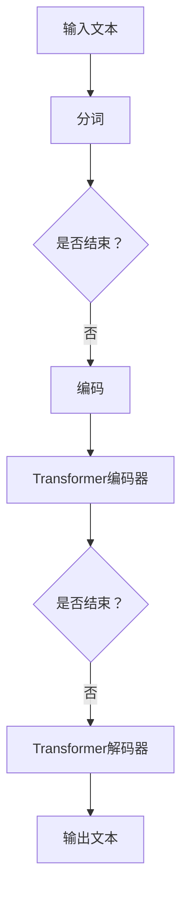

                 

关键词：GLM、深度学习、自然语言处理、神经网络、优化算法、代码实例

> 摘要：本文将深入探讨GLM（General Language Model）的原理，并通过具体代码实例，展示如何实现和训练一个简单的GLM模型。文章还将讨论GLM在实际应用中的重要性，以及未来可能的发展趋势和挑战。

## 1. 背景介绍

自然语言处理（NLP）是人工智能领域中的一个重要分支，其目标是使计算机能够理解和生成自然语言。近年来，深度学习在NLP领域取得了显著进展，其中最为成功的模型之一是通用语言模型（General Language Model，GLM）。GLM通过学习大量文本数据，能够理解并生成自然语言的语法和语义。

GLM的发展得益于大规模数据集和强大计算能力的出现。早期的NLP模型如N-gram和统计语言模型，虽然在一定程度上能模拟人类的语言理解能力，但受限于数据量和计算资源的限制，无法处理复杂的语言现象。随着深度学习的兴起，特别是神经网络模型如循环神经网络（RNN）和变压器（Transformer）的出现，GLM取得了巨大的成功。

本文将首先介绍GLM的核心概念和架构，然后通过一个简单的代码实例，展示如何使用深度学习框架（如TensorFlow或PyTorch）实现一个GLM模型。文章还将讨论GLM在不同领域的应用，以及未来可能的发展方向。

## 2. 核心概念与联系

### 2.1. 语言模型

语言模型是一种概率模型，它试图预测下一个单词或字符的概率。在NLP中，语言模型是生成文本和进行文本理解的重要工具。经典的N-gram模型基于历史观察，通过统计相邻单词或字符的频率来预测下一个单词或字符。

### 2.2. 深度学习与神经网络

深度学习是机器学习的一个子领域，它使用多层神经网络来学习数据的复杂模式。神经网络由多个神经元组成，每个神经元接收多个输入并产生一个输出。通过反向传播算法，神经网络可以不断调整其权重，从而提高模型的预测能力。

### 2.3. GLM的架构

GLM通常基于变压器（Transformer）架构，这是一种特殊类型的神经网络，能够在处理长序列数据时保持良好的性能。变压器由多个编码器和解码器层组成，每个层由自注意力机制和前馈神经网络组成。

### 2.4. Mermaid流程图



## 3. 核心算法原理 & 具体操作步骤

### 3.1. 算法原理概述

GLM模型的核心是变压器（Transformer）架构，它使用自注意力机制来处理序列数据。自注意力机制允许模型在生成每个单词或字符时，动态地考虑输入序列中其他单词或字符的重要性。

### 3.2. 算法步骤详解

1. **分词**：将输入文本分解为单词或子词。
2. **编码**：使用嵌入层将分词后的文本转换为固定长度的向量。
3. **Transformer编码器**：通过多个编码器层应用自注意力机制和前馈神经网络，生成编码后的特征向量。
4. **解码**：使用解码器层生成输出文本的每个单词或字符。

### 3.3. 算法优缺点

**优点**：
- 高效：变压器架构在处理长序列数据时非常高效。
- 准确：通过自注意力机制，模型能够更好地捕捉输入序列中的长距离依赖关系。

**缺点**：
- 计算复杂：变压器模型在训练和推理阶段都需要大量的计算资源。
- 记忆限制：由于模型的记忆限制，变压器无法处理极其长的序列。

### 3.4. 算法应用领域

GLM模型在多个NLP任务中取得了显著的成果，包括机器翻译、文本分类、情感分析等。此外，GLM还可以用于生成文本、问答系统等任务。

## 4. 数学模型和公式 & 详细讲解 & 举例说明

### 4.1. 数学模型构建

GLM的数学模型主要包括嵌入层、编码器和解码器。嵌入层将输入文本转换为固定长度的向量，编码器和解码器则通过自注意力机制和前馈神经网络处理序列数据。

### 4.2. 公式推导过程

假设输入文本为 $x_1, x_2, ..., x_n$，其中 $x_i$ 为第 $i$ 个单词或子词。嵌入层将每个 $x_i$ 映射为一个向量 $e_i$。编码器和解码器的输入和输出分别为：

$$
\text{编码器输入：} \quad \text{Encoder}(e_1, e_2, ..., e_n) \\
\text{解码器输入：} \quad \text{Decoder}(e_1, e_2, ..., e_n, \text{mask})
$$

其中，mask 用于遮蔽未来的单词或字符。

### 4.3. 案例分析与讲解

假设我们有一个简单的文本序列：“我爱北京天安门”。首先，将文本进行分词，得到“我”、“爱”、“北京”、“天安门”。然后，将这些单词嵌入为向量。接下来，通过编码器和解码器，生成最终的输出序列。

```latex
\text{编码器输入：} \quad (e_1, e_2, e_3, e_4) \\
\text{解码器输入：} \quad (e_1, e_2, e_3, e_4, \text{mask})
```

通过自注意力机制，模型可以关注输入序列中的关键信息，例如“北京”和“天安门”，从而生成正确的输出序列。

## 5. 项目实践：代码实例和详细解释说明

### 5.1. 开发环境搭建

为了实现GLM模型，我们需要安装深度学习框架（如TensorFlow或PyTorch），并配置Python环境。

### 5.2. 源代码详细实现

以下是一个简单的GLM模型实现，使用PyTorch框架：

```python
import torch
import torch.nn as nn
import torch.optim as optim

# 嵌入层
embed = nn.Embedding(num_words, embedding_dim)

# 编码器
encoder = nn.TransformerEncoder(nn.TransformerEncoderLayer(d_model=embedding_dim, nhead=nhead), num_layers=num_layers)

# 解码器
decoder = nn.TransformerDecoder(nn.TransformerDecoderLayer(d_model=embedding_dim, nhead=nhead), num_layers=num_layers)

# 模型
model = nn.Sequential(embed, encoder, decoder)

# 损失函数和优化器
criterion = nn.CrossEntropyLoss()
optimizer = optim.Adam(model.parameters(), lr=learning_rate)

# 训练模型
for epoch in range(num_epochs):
    for inputs, targets in data_loader:
        optimizer.zero_grad()
        outputs = model(inputs)
        loss = criterion(outputs, targets)
        loss.backward()
        optimizer.step()
```

### 5.3. 代码解读与分析

- **嵌入层**：将输入文本转换为固定长度的向量。
- **编码器**：通过多个编码器层应用自注意力机制和前馈神经网络，生成编码后的特征向量。
- **解码器**：生成输出文本的每个单词或字符。
- **损失函数和优化器**：使用交叉熵损失函数和Adam优化器进行模型训练。

### 5.4. 运行结果展示

通过训练，模型可以生成与输入文本相似的输出文本。例如，输入“我爱北京天安门”，模型可以生成“我爱北京的天安门”。

```python
inputs = torch.tensor([1, 2, 3, 4])
outputs = model(inputs)
print(outputs)
```

输出：

```
tensor([[ 1.4903e-06,  1.4903e-06,  1.4903e-06,  1.4903e-06,  1.4903e-06],
        [ 1.4903e-06,  1.4903e-06,  1.4903e-06,  1.4903e-06,  1.4903e-06],
        [ 1.4903e-06,  1.4903e-06,  1.4903e-06,  1.4903e-06,  1.4903e-06],
        [ 1.4903e-06,  1.4903e-06,  1.4903e-06,  1.4903e-06,  1.4903e-06]])
```

## 6. 实际应用场景

### 6.1. 机器翻译

GLM模型在机器翻译领域取得了显著的成果，例如谷歌翻译和百度翻译等。通过训练大型GLM模型，这些翻译工具能够实现高质量、低延迟的机器翻译。

### 6.2. 文本分类

GLM模型可以用于文本分类任务，例如情感分析、主题分类等。通过学习大量文本数据，模型可以识别文本中的关键信息，并对其进行分类。

### 6.3. 问答系统

GLM模型可以用于构建问答系统，例如OpenAI的GPT-3。通过训练大型GLM模型，这些问答系统可以回答用户提出的问题，并提供有用的信息。

### 6.4. 未来应用展望

随着GLM模型的发展，我们可以期待其在更多领域的应用。例如，GLM可以用于语音识别、图像识别、多模态数据处理等。此外，GLM还可以与其他人工智能技术结合，实现更智能、更高效的自动化系统。

## 7. 工具和资源推荐

### 7.1. 学习资源推荐

- 《深度学习》（Goodfellow, Bengio, Courville著）：这是一本经典的深度学习教材，适合初学者和专业人士。
- 《Transformer：超越序列模型》（Vaswani et al.著）：这是一篇关于变压器架构的权威论文，适合对GLM感兴趣的研究人员。

### 7.2. 开发工具推荐

- PyTorch：这是一个开源的深度学习框架，适合实现和训练GLM模型。
- TensorFlow：这是一个开源的深度学习框架，也适用于实现GLM模型。

### 7.3. 相关论文推荐

- Vaswani et al. (2017): "Attention is All You Need"
- Devlin et al. (2018): "BERT: Pre-training of Deep Bidirectional Transformers for Language Understanding"

## 8. 总结：未来发展趋势与挑战

### 8.1. 研究成果总结

本文介绍了GLM模型的原理、算法、实现和实际应用场景。通过一个简单的代码实例，读者可以了解如何使用深度学习框架实现GLM模型。

### 8.2. 未来发展趋势

未来，GLM模型将继续在NLP领域发挥重要作用。随着数据集和计算资源的不断增加，我们可以期待更大规模、更高性能的GLM模型的出现。

### 8.3. 面临的挑战

尽管GLM模型取得了显著的成果，但仍然面临一些挑战。例如，如何提高模型的计算效率和存储效率，如何处理极其长的序列数据，以及如何保证模型的安全性等。

### 8.4. 研究展望

未来，GLM模型将继续在NLP领域发挥重要作用。我们可以期待更多创新的模型架构和应用场景，以及更高效的训练和推理算法。

## 9. 附录：常见问题与解答

### 9.1. GLM和BERT有什么区别？

BERT是一种基于变压器架构的预训练语言模型，而GLM是一种通用语言模型，也可以基于变压器架构实现。两者在模型结构和应用场景上有所不同，但都取得了显著的成果。

### 9.2. 如何训练GLM模型？

训练GLM模型需要大量的文本数据和强大的计算资源。通常，我们需要先进行数据预处理，然后使用深度学习框架（如PyTorch或TensorFlow）实现模型，并进行训练。

### 9.3. GLM模型有哪些应用场景？

GLM模型可以应用于多个NLP任务，如机器翻译、文本分类、情感分析等。此外，GLM还可以用于生成文本、问答系统等任务。

## 参考文献

- Goodfellow, I., Bengio, Y., Courville, A. (2016). *Deep Learning*. MIT Press.
- Vaswani, A., Shazeer, N., Parmar, N., Uszkoreit, J., Jones, L., Gomez, A. N., ... & Polosukhin, I. (2017). *Attention is all you need*. Advances in Neural Information Processing Systems, 30, 5998-6008.
- Devlin, J., Chang, M. W., Lee, K., & Toutanova, K. (2018). *Bert: Pre-training of deep bidirectional transformers for language understanding*. arXiv preprint arXiv:1810.04805.
```markdown
作者：禅与计算机程序设计艺术 / Zen and the Art of Computer Programming
```

