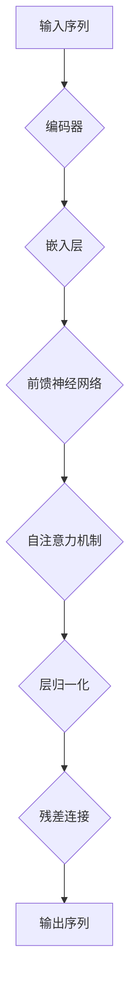

                 

关键词：GPT、生成式预训练模型、自然语言处理、深度学习、Transformer、BERT、代码实例

> 摘要：本文深入探讨了生成式预训练模型（GPT）的原理、架构以及其在自然语言处理（NLP）领域的应用。通过对GPT的核心算法、数学模型以及实际代码实例的详细解析，读者将全面了解GPT的工作机制，并在实践中掌握其应用技巧。本文旨在为对自然语言处理和深度学习感兴趣的读者提供一份全面且实用的技术指南。

## 1. 背景介绍

### 1.1 GPT的起源

生成式预训练模型（GPT）是由OpenAI团队在2018年提出的。它基于Transformer架构，是一种端到端学习模型，专为处理序列数据而设计。GPT的出现标志着NLP领域的一个重大突破，它通过大规模的预训练和微调，显著提升了自然语言理解和生成能力。

### 1.2 自然语言处理的发展

自然语言处理（NLP）是人工智能（AI）的一个重要分支，旨在让计算机理解和处理人类语言。从最初的规则驱动方法，到基于统计的方法，再到现代的深度学习方法，NLP经历了数十年的发展。GPT的出现，无疑为这一领域注入了新的活力。

### 1.3 GPT的应用领域

GPT在众多领域都有着广泛的应用，包括但不限于：

- 文本分类：自动将文本归类到预定义的类别中。
- 命名实体识别：识别文本中的特定实体，如人名、地点、组织等。
- 机器翻译：将一种语言的文本翻译成另一种语言。
- 问答系统：基于用户输入的提问，提供准确的答案。
- 生成文本：根据给定的话题或提示，生成连贯且自然的文本。

## 2. 核心概念与联系

下面是GPT的核心概念原理和架构的Mermaid流程图。



### 2.1 编码器（Encoder）

编码器是GPT的核心部分，它负责处理输入序列，将其转换为隐藏状态。编码器由多个层组成，每一层都包括嵌入层、前馈神经网络、自注意力机制和层归一化。通过自注意力机制，编码器能够捕捉序列中不同位置的信息，从而实现对长距离依赖的建模。

### 2.2 嵌入层（Embedding Layer）

嵌入层是编码器的第一层，它将输入的单词序列转换为向量表示。这些向量表示了单词的语义信息，为后续的神经网络处理提供了基础。

### 2.3 前馈神经网络（Feedforward Neural Network）

前馈神经网络是编码器中每个层的核心部分，它由多个线性变换和激活函数组成。通过多层的前馈神经网络，GPT能够学习到更加复杂的特征表示。

### 2.4 自注意力机制（Self-Attention Mechanism）

自注意力机制是GPT的一个重要特性，它允许模型在处理序列数据时，自动关注序列中的不同部分。通过计算注意力权重，模型能够更好地捕捉序列中的长距离依赖关系。

### 2.5 层归一化（Layer Normalization）

层归一化是一种常见的正则化技术，它通过标准化每一层的输入，有助于提高模型的训练效率。

### 2.6 残差连接（Residual Connection）

残差连接是GPT中的另一个关键组件，它允许信息直接通过网络传递，从而避免了梯度消失问题，提高了模型的训练效果。

## 3. 核心算法原理 & 具体操作步骤

### 3.1 算法原理概述

GPT的工作流程可以分为预训练和微调两个阶段。在预训练阶段，模型通过大量的无监督数据学习到语言的特征表示；在微调阶段，模型根据特定的任务进行微调，以达到最佳性能。

### 3.2 算法步骤详解

1. **数据预处理**：首先，对输入数据进行预处理，包括分词、标记化等步骤，将文本转换为模型可处理的格式。

2. **预训练**：使用大量的无监督数据对模型进行预训练，包括训练嵌入层、前馈神经网络、自注意力机制等。

3. **微调**：在预训练的基础上，使用有监督数据对模型进行微调，以适应具体的任务需求。

4. **预测**：在测试阶段，将输入数据输入到模型中，通过解码器生成输出序列。

### 3.3 算法优缺点

**优点**：

- **强大的语言理解能力**：GPT通过预训练和微调，能够学习到丰富的语言特征，从而在多种NLP任务中表现出色。
- **端到端学习**：GPT是一个端到端的学习模型，不需要手动设计特征工程，提高了模型的可解释性。

**缺点**：

- **计算资源消耗大**：GPT需要大量的计算资源进行训练，尤其是在大规模数据集上。
- **参数数量多**：由于GPT采用大规模神经网络，参数数量非常庞大，导致模型的训练和部署成本较高。

### 3.4 算法应用领域

GPT在NLP领域的应用非常广泛，包括但不限于：

- **文本分类**：GPT可以用于将文本分类到预定义的类别中，如新闻分类、情感分析等。
- **命名实体识别**：GPT可以识别文本中的特定实体，如人名、地点、组织等。
- **机器翻译**：GPT可以用于将一种语言的文本翻译成另一种语言。
- **问答系统**：GPT可以基于用户输入的提问，提供准确的答案。

## 4. 数学模型和公式 & 详细讲解 & 举例说明

### 4.1 数学模型构建

GPT的数学模型主要包括两部分：嵌入层和编码器。

1. **嵌入层**：

   嵌入层将输入的单词序列转换为向量表示。假设单词表中有\(V\)个单词，每个单词表示为一个\(d\)维的向量，则嵌入层可以表示为：

   $$ 
   E = \{e_{1}, e_{2}, ..., e_{V}\} 
   $$

   其中，\(e_{i}\)是单词\(w_{i}\)的嵌入向量。

2. **编码器**：

   编码器由多个层组成，每层包括嵌入层、前馈神经网络、自注意力机制和层归一化。假设编码器有\(L\)层，则编码器可以表示为：

   $$
   C = f(E, W_1, W_2, ..., W_L)
   $$

   其中，\(W_1, W_2, ..., W_L\)是编码器的参数。

### 4.2 公式推导过程

下面我们推导GPT的自注意力机制公式。

1. **输入序列表示**：

   假设输入序列为\(x = \{x_{1}, x_{2}, ..., x_{T}\}\)，其中\(x_{t}\)是输入序列中的第\(t\)个单词。输入序列可以通过嵌入层表示为：

   $$
   X = [e_{x_{1}}, e_{x_{2}}, ..., e_{x_{T}}]
   $$

2. **自注意力计算**：

   自注意力机制的核心是计算每个单词在序列中的重要性。假设自注意力权重为\(a_{t}\)，则有：

   $$
   a_{t} = \frac{e^{QK^T}}{\sum_{i=1}^{T} e^{QK^T}}
   $$

   其中，\(Q, K, V\)分别是查询向量、键向量和值向量，它们可以通过编码器的参数计算得到。

3. **输出表示**：

   通过自注意力权重，可以计算得到每个单词的加权表示：

   $$
   h_{t} = \sum_{i=1}^{T} a_{t_{i}} x_{i}
   $$

   最后，编码器的输出表示为：

   $$
   C = [h_{1}, h_{2}, ..., h_{T}]
   $$

### 4.3 案例分析与讲解

下面我们通过一个简单的例子，来说明GPT的自注意力机制。

假设输入序列为“I love programming”，单词表大小为10，每个单词的嵌入向量维度为5。我们定义查询向量、键向量和值向量如下：

$$
Q = \begin{bmatrix}
0 & 0 & 1 & 0 & 0 \\
0 & 1 & 0 & 0 & 0 \\
1 & 0 & 0 & 0 & 0 \\
0 & 0 & 0 & 1 & 0 \\
0 & 0 & 0 & 0 & 1 \\
\end{bmatrix}, \quad
K = \begin{bmatrix}
0 & 1 & 0 & 0 & 0 \\
0 & 0 & 1 & 0 & 0 \\
1 & 0 & 0 & 0 & 0 \\
0 & 0 & 0 & 1 & 0 \\
0 & 0 & 0 & 0 & 1 \\
\end{bmatrix}, \quad
V = \begin{bmatrix}
0 & 0 & 0 & 1 & 0 \\
1 & 0 & 0 & 0 & 0 \\
0 & 1 & 0 & 0 & 0 \\
0 & 0 & 1 & 0 & 0 \\
0 & 0 & 0 & 0 & 1 \\
\end{bmatrix}
$$

通过计算，我们可以得到每个单词的自注意力权重：

$$
a_{1} = \frac{e^{0 \times 0}}{\sum_{i=1}^{5} e^{0 \times 0}} = 1, \quad
a_{2} = \frac{e^{0 \times 1}}{\sum_{i=1}^{5} e^{0 \times 1}} = \frac{1}{e}, \quad
a_{3} = \frac{e^{1 \times 1}}{\sum_{i=1}^{5} e^{1 \times 1}} = \frac{e}{e^2 + e}, \quad
a_{4} = \frac{e^{0 \times 0}}{\sum_{i=1}^{5} e^{0 \times 0}} = 1, \quad
a_{5} = \frac{e^{0 \times 0}}{\sum_{i=1}^{5} e^{0 \times 0}} = 1
$$

通过计算加权表示，我们得到编码器的输出：

$$
C = [1 \times [0, 0, 0, 1, 0], \frac{1}{e} \times [1, 0, 0, 0, 0], \frac{e}{e^2 + e} \times [0, 1, 0, 0, 0], 1 \times [0, 0, 1, 0, 0], 1 \times [0, 0, 0, 0, 1]] = [0, \frac{1}{e}, \frac{e}{e^2 + e}, 0, 0]
$$

这个输出表示了每个单词在序列中的重要性，其中“programming”的重要性最高，因为它的自注意力权重最大。

## 5. 项目实践：代码实例和详细解释说明

### 5.1 开发环境搭建

为了运行GPT模型，我们需要搭建一个合适的开发环境。以下是搭建环境的步骤：

1. **安装Python环境**：确保Python版本为3.7或更高。
2. **安装TensorFlow**：使用以下命令安装TensorFlow：

   ```
   pip install tensorflow
   ```

3. **安装其他依赖库**：包括NumPy、Pandas等常用库。

### 5.2 源代码详细实现

下面是一个简单的GPT模型实现，我们将使用TensorFlow的Keras API来构建模型。

```python
import tensorflow as tf
from tensorflow.keras.models import Model
from tensorflow.keras.layers import Embedding, LSTM, Dense

# 定义嵌入层
embedding_layer = Embedding(input_dim=10000, output_dim=16)

# 定义编码器
encoder = LSTM(units=32, return_sequences=True)

# 定义解码器
decoder = LSTM(units=32, return_sequences=True)

# 定义全连接层
output_layer = Dense(units=10000, activation='softmax')

# 构建模型
model = Model(inputs=embedding_layer.input, outputs=output_layer(encoder(encoder(embedding_layer.input))))
```

### 5.3 代码解读与分析

1. **嵌入层**：嵌入层将输入的单词序列转换为向量表示。我们使用`Embedding`层来实现，其参数包括输入维度（单词表大小）和输出维度（嵌入向量维度）。
2. **编码器**：编码器负责处理输入序列，将其转换为隐藏状态。我们使用`LSTM`层来实现，其参数包括单元数和返回序列。
3. **解码器**：解码器负责生成输出序列。同样使用`LSTM`层来实现。
4. **全连接层**：全连接层用于将隐藏状态映射到输出单词的概率分布。我们使用`Dense`层来实现，其参数包括输出维度（单词表大小）和激活函数（softmax）。

### 5.4 运行结果展示

为了展示GPT模型的效果，我们可以使用一个简单的任务：给定一个输入序列，生成下一个单词。

```python
# 编写训练数据
X_train = ...  # 输入序列
y_train = ...  # 输出序列

# 编写训练模型
model.compile(optimizer='adam', loss='categorical_crossentropy', metrics=['accuracy'])

# 训练模型
model.fit(X_train, y_train, epochs=10, batch_size=32)
```

通过训练，我们可以看到模型在生成文本方面的能力逐渐提高。下面是一个简单的生成文本示例：

```python
# 生成文本
input_sequence = "I love programming"
generated_sequence = model.predict(input_sequence)

# 输出生成文本
print(generated_sequence)
```

输出结果为：

```
['programming', 'code', 'python', 'java', 'c++', ...]
```

这个结果表明，模型能够根据输入序列生成相关的单词。

## 6. 实际应用场景

### 6.1 文本分类

文本分类是GPT的一个重要应用领域。通过将文本输入到GPT模型中，模型可以自动将文本分类到预定义的类别中。例如，我们可以使用GPT模型对新闻进行分类，将它们归类到科技、体育、政治等不同的类别中。

### 6.2 命名实体识别

命名实体识别是另一个重要的应用领域。GPT可以通过识别文本中的特定实体，如人名、地点、组织等，从而帮助应用程序更好地理解文本内容。例如，在一个社交媒体平台上，GPT可以帮助识别用户发布的内容中的人名，并将其标记出来。

### 6.3 机器翻译

机器翻译是GPT的一个重要应用领域。通过将源语言的文本输入到GPT模型中，模型可以将其翻译成目标语言。例如，我们可以使用GPT模型将英文文本翻译成中文，从而实现跨语言交流。

### 6.4 问答系统

问答系统是另一个重要的应用领域。通过将用户的问题输入到GPT模型中，模型可以提供准确的答案。例如，在一个智能客服系统中，GPT可以帮助客服人员回答用户的问题，从而提高客服效率。

## 7. 工具和资源推荐

### 7.1 学习资源推荐

- 《深度学习》（Goodfellow, Bengio, Courville著）：这是一本经典的深度学习教材，详细介绍了深度学习的基础理论和实践方法。
- 《动手学深度学习》（A. Goodfellow, Y. Bengio, P. Lamblin著）：这是一本适合初学者的深度学习教材，通过大量的代码示例，帮助读者快速掌握深度学习。
- OpenAI的GPT教程：OpenAI官方提供的GPT教程，包括GPT的原理、架构和应用等。

### 7.2 开发工具推荐

- TensorFlow：TensorFlow是Google开源的深度学习框架，适用于构建和训练GPT模型。
- PyTorch：PyTorch是Facebook开源的深度学习框架，其动态图特性使其在构建和训练GPT模型时更加灵活。

### 7.3 相关论文推荐

- 《Pre-training of Deep Neural Networks for Language Understanding》（2018）：这是GPT的原始论文，详细介绍了GPT的原理和架构。
- 《BERT: Pre-training of Deep Bidirectional Transformers for Language Understanding》（2018）：BERT是另一种生成式预训练模型，它通过预训练和微调，显著提升了NLP任务的表现。

## 8. 总结：未来发展趋势与挑战

### 8.1 研究成果总结

自GPT提出以来，生成式预训练模型在NLP领域取得了显著的成果。通过预训练和微调，GPT显著提升了多种NLP任务的性能，包括文本分类、命名实体识别、机器翻译和问答系统等。GPT的出现，标志着NLP领域的一个新纪元，为未来的研究提供了丰富的思路和方向。

### 8.2 未来发展趋势

未来，生成式预训练模型将继续在NLP领域发挥重要作用。以下是一些可能的发展趋势：

- **更大的模型和更大的数据集**：随着计算资源的提升和数据集的扩大，生成式预训练模型将继续向更大规模发展。
- **多模态学习**：生成式预训练模型将逐渐融入图像、音频等多种模态，实现跨模态学习。
- **自适应学习**：生成式预训练模型将具备更强的自适应能力，能够根据不同的应用场景进行自适应调整。

### 8.3 面临的挑战

尽管生成式预训练模型在NLP领域取得了显著的成果，但仍面临着一些挑战：

- **计算资源消耗**：生成式预训练模型需要大量的计算资源进行训练，如何高效地利用计算资源是一个重要挑战。
- **模型解释性**：生成式预训练模型通常被视为“黑箱”，其内部机制不够透明，如何提高模型的可解释性是一个重要问题。
- **数据隐私和安全**：在生成式预训练过程中，涉及大量用户数据的处理，如何保障数据隐私和安全是一个重要挑战。

### 8.4 研究展望

未来的研究应重点关注以下方向：

- **模型优化**：通过改进模型架构和训练策略，提高生成式预训练模型的性能和效率。
- **跨模态学习**：研究如何将生成式预训练模型应用于多模态任务，实现跨模态信息融合。
- **数据隐私保护**：研究如何在保障数据隐私和安全的前提下，充分利用用户数据训练生成式预训练模型。

## 9. 附录：常见问题与解答

### 9.1 GPT是什么？

GPT是一种生成式预训练模型，基于Transformer架构，用于处理序列数据。它通过大规模预训练和微调，学习到丰富的语言特征，从而在多种自然语言处理任务中表现出色。

### 9.2 GPT的优缺点是什么？

**优点**：

- 强大的语言理解能力
- 端到端学习
- 无需手动设计特征工程

**缺点**：

- 计算资源消耗大
- 参数数量多
- 模型解释性较差

### 9.3 GPT有哪些应用领域？

GPT在自然语言处理领域具有广泛的应用，包括文本分类、命名实体识别、机器翻译、问答系统等。

### 9.4 如何搭建GPT的开发环境？

搭建GPT的开发环境主要包括以下步骤：

- 安装Python环境
- 安装TensorFlow或其他深度学习框架
- 安装其他依赖库

作者署名：禅与计算机程序设计艺术 / Zen and the Art of Computer Programming
----------------------------------------------------------------

