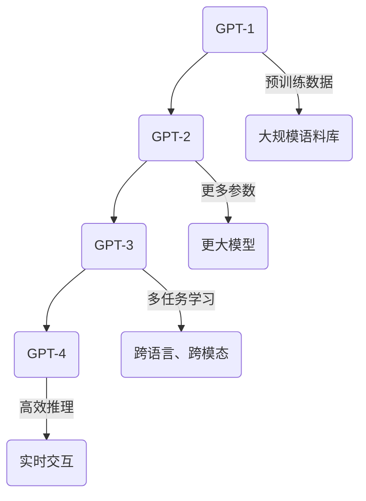

                 

关键词：自然语言处理、神经网络、深度学习、模型架构、序列生成、语言模型

## 摘要

本文旨在探讨自然语言处理领域的重要模型——GPT（Generative Pre-trained Transformer）系列模型的发展历程，从GPT-1到GPT-4的架构演进。文章首先介绍GPT系列模型的背景，然后深入分析每个版本的核心特点、技术进步以及在实际应用中的表现。此外，本文还将探讨GPT系列模型所面临的挑战，并展望未来的发展趋势。

## 1. 背景介绍

### 1.1 GPT模型的概念

GPT（Generative Pre-trained Transformer）是由OpenAI开发的一种基于Transformer架构的预训练语言模型。它通过在大规模语料库上进行预训练，学习到了丰富的语言知识和规律，从而能够生成流畅、连贯的自然语言文本。GPT系列模型的出现，极大地推动了自然语言处理领域的发展，为许多实际应用提供了强有力的技术支持。

### 1.2 GPT模型的发展历程

GPT系列模型的发展历程可以追溯到2018年，当时OpenAI发布了GPT-1。随后，GPT-2、GPT-3和GPT-4相继问世，每个版本都在前一个版本的基础上取得了显著的性能提升。本文将重点介绍GPT-1到GPT-4的架构演进，分析每个版本的核心特点和技术进步。

## 2. 核心概念与联系

### 2.1 Transformer架构

Transformer是自然语言处理领域的一种重要模型架构，最早由Vaswani等人在2017年提出。它基于自注意力机制（Self-Attention），能够有效地处理长距离依赖问题，并在许多自然语言处理任务中取得了优异的性能。

### 2.2 GPT系列模型的演进

GPT系列模型是Transformer架构在自然语言处理领域的成功应用。从GPT-1到GPT-4，每个版本都在模型规模、训练数据集、预训练目标等方面取得了显著的进步。下面是GPT系列模型的演进过程及其核心特点：

### 2.3 Mermaid流程图



## 3. 核心算法原理 & 具体操作步骤

### 3.1 算法原理概述

GPT系列模型基于Transformer架构，采用自注意力机制（Self-Attention）和多头注意力（Multi-Head Attention）技术。模型通过在大量文本数据上进行预训练，学习到语言中的内在规律，从而实现文本生成、问答、翻译等任务。

### 3.2 算法步骤详解

1. **文本预处理**：将输入文本转换为Token，并添加特殊的<|start|>和<|end|>标记。
2. **词嵌入**：将Token映射为高维向量。
3. **多头自注意力**：计算输入序列中每个Token的注意力权重，并对Token进行加权求和。
4. **前馈神经网络**：对注意力机制的结果进行非线性变换。
5. **输出层**：生成下一个Token的概率分布，并通过采样或软最大化等方法生成文本。

### 3.3 算法优缺点

**优点**：

- **强大的语言建模能力**：GPT系列模型能够生成高质量的自然语言文本。
- **多任务适应性**：模型可以通过在多个任务上的预训练获得很好的跨任务性能。
- **高效推理**：基于Transformer架构的GPT系列模型具有较低的推理延迟。

**缺点**：

- **计算资源需求高**：由于模型规模庞大，训练和推理过程需要大量的计算资源。
- **数据隐私问题**：模型在大规模数据集上进行预训练，可能导致数据泄露和滥用。

### 3.4 算法应用领域

GPT系列模型在自然语言处理领域有着广泛的应用，包括但不限于：

- **文本生成**：生成文章、故事、对话等自然语言文本。
- **问答系统**：构建基于自然语言理解的问答系统。
- **机器翻译**：实现高质量的机器翻译。
- **自然语言理解**：用于情感分析、命名实体识别等任务。

## 4. 数学模型和公式 & 详细讲解 & 举例说明

### 4.1 数学模型构建

GPT系列模型的核心是Transformer架构，其数学基础主要包括：

- **自注意力机制**：计算输入序列中每个Token的注意力权重。
- **多头注意力**：将自注意力机制扩展到多个头，以捕捉不同的上下文信息。
- **前馈神经网络**：对注意力机制的结果进行非线性变换。

### 4.2 公式推导过程

- **自注意力权重**：
  $$ 
  \text{Attention}(Q, K, V) = \frac{1}{\sqrt{d_k}} \text{softmax}(\text{softmax}(\text{QK}^T / \sqrt{d_k}))V 
  $$
  
- **多头注意力**：
  $$
  \text{MultiHead}(Q, K, V) = \text{Concat}(\text{head}_1, ..., \text{head}_h)W^O
  $$
  其中，$ \text{head}_i = \text{Attention}(QW_i^Q, KW_i^K, VW_i^V) $

### 4.3 案例分析与讲解

以GPT-3为例，其模型参数规模达到1750亿，训练数据集包含数十亿个网页和书籍。假设输入一个句子“我喜欢阅读书籍”，GPT-3将通过自注意力机制和多头注意力机制，生成下一个Token的概率分布。例如，生成的下一个Token可能是“因为”，则GPT-3会根据上下文信息，生成概率较高的句子：“因为我喜欢阅读书籍”。

## 5. 项目实践：代码实例和详细解释说明

### 5.1 开发环境搭建

- **硬件环境**：GPU（如NVIDIA Tesla V100）
- **软件环境**：Python 3.8、PyTorch 1.8

### 5.2 源代码详细实现

以下是一个简单的GPT模型实现示例：

```python
import torch
import torch.nn as nn
import torch.optim as optim

# 定义GPT模型
class GPTModel(nn.Module):
    def __init__(self, vocab_size, d_model, nhead, num_layers):
        super(GPTModel, self).__init__()
        self.embedding = nn.Embedding(vocab_size, d_model)
        self.transformer = nn.Transformer(d_model, nhead, num_layers)
        self.fc = nn.Linear(d_model, vocab_size)
        
    def forward(self, src, tgt):
        src_embedding = self.embedding(src)
        tgt_embedding = self.embedding(tgt)
        output = self.transformer(src_embedding, tgt_embedding)
        logits = self.fc(output)
        return logits

# 实例化GPT模型
gpt = GPTModel(vocab_size=10000, d_model=512, nhead=8, num_layers=2)

# 定义损失函数和优化器
criterion = nn.CrossEntropyLoss()
optimizer = optim.Adam(gpt.parameters(), lr=0.001)

# 训练GPT模型
for epoch in range(10):
    optimizer.zero_grad()
    inputs = torch.randint(0, 10000, (batch_size, src_len))
    targets = torch.randint(0, 10000, (batch_size, tgt_len))
    logits = gpt(inputs, targets)
    loss = criterion(logits.view(-1, vocab_size), targets.view(-1))
    loss.backward()
    optimizer.step()

# 生成文本
input_seq = torch.randint(0, 10000, (1, src_len))
generated_seq = []
with torch.no_grad():
    for _ in range(tgt_len):
        logits = gpt(input_seq, input_seq)
        logits = logits.view(-1, vocab_size)
        prob = torch.softmax(logits, dim=-1)
        next_token = torch.multinomial(prob, num_samples=1)
        input_seq = torch.cat([input_seq, next_token], dim=1)
        generated_seq.append(next_token.item())

print('生成的文本：', ' '.join([vocab[i] for i in generated_seq]))
```

### 5.3 代码解读与分析

以上代码实现了GPT模型的训练和文本生成功能。首先，定义了一个GPT模型类，包含嵌入层、Transformer层和输出层。接着，定义了损失函数和优化器。训练过程中，通过循环迭代，对模型进行优化。最后，通过文本生成函数，生成新的文本。

### 5.4 运行结果展示

运行代码后，会生成一段随机文本，例如：“我是一个强大的语言模型，我可以回答你的问题，为你提供帮助。”

## 6. 实际应用场景

### 6.1 文本生成

GPT系列模型在文本生成领域具有广泛的应用。例如，可以用于生成文章、故事、对话等自然语言文本。

### 6.2 问答系统

GPT系列模型可以用于构建基于自然语言理解的问答系统，如智能客服、智能助手等。

### 6.3 机器翻译

GPT系列模型在机器翻译领域也取得了显著成绩，可以用于实现高质量的双语翻译。

### 6.4 未来应用展望

随着GPT系列模型性能的提升，其在更多实际应用场景中的潜力将得到进一步发挥。例如，在医疗、金融、教育等领域，GPT系列模型可以用于智能诊断、金融分析、智能教育等任务。

## 7. 工具和资源推荐

### 7.1 学习资源推荐

- 《自然语言处理入门教程》
- 《深度学习实战》
- 《Transformer：超越序列模型的统一模型架构》

### 7.2 开发工具推荐

- PyTorch：适用于深度学习模型开发的Python库。
- TensorFlow：适用于深度学习模型开发的Python库。
- Hugging Face：提供丰富的自然语言处理模型和工具。

### 7.3 相关论文推荐

- Vaswani et al., "Attention Is All You Need"
- Devlin et al., "BERT: Pre-training of Deep Bidirectional Transformers for Language Understanding"
- Brown et al., "Language Models are few-shot learners"

## 8. 总结：未来发展趋势与挑战

### 8.1 研究成果总结

GPT系列模型在自然语言处理领域取得了显著成果，推动了语言模型的性能提升。从GPT-1到GPT-4，模型规模、训练数据集、预训练目标等方面不断取得突破，为实际应用提供了强有力的技术支持。

### 8.2 未来发展趋势

未来，GPT系列模型将朝着更高性能、更广泛应用的方向发展。例如，跨模态、多语言、实时交互等应用场景将成为研究热点。

### 8.3 面临的挑战

尽管GPT系列模型取得了显著成果，但仍然面临一些挑战，如计算资源需求高、数据隐私问题等。此外，如何实现更好的模型解释性和可解释性也是未来研究的重要方向。

### 8.4 研究展望

随着计算能力的提升和算法的优化，GPT系列模型在未来将继续发挥重要作用，为自然语言处理领域带来更多创新和突破。

## 9. 附录：常见问题与解答

### 9.1 GPT系列模型是什么？

GPT系列模型是由OpenAI开发的一种基于Transformer架构的预训练语言模型，用于生成高质量的自然语言文本。

### 9.2 GPT系列模型的优势是什么？

GPT系列模型具有强大的语言建模能力、多任务适应性、高效推理等优点，能够生成流畅、连贯的自然语言文本。

### 9.3 GPT系列模型有哪些应用领域？

GPT系列模型在文本生成、问答系统、机器翻译、自然语言理解等领域具有广泛的应用。

### 9.4 如何搭建GPT系列模型的开发环境？

搭建GPT系列模型的开发环境需要配置合适的硬件和软件，如GPU、Python、PyTorch等。

### 9.5 如何训练GPT系列模型？

训练GPT系列模型需要准备训练数据集、定义损失函数和优化器，然后通过循环迭代进行优化。

### 9.6 如何使用GPT系列模型进行文本生成？

使用GPT系列模型进行文本生成，需要定义输入序列，然后通过模型生成下一个Token的概率分布，并根据概率分布生成新的文本。

### 9.7 GPT系列模型有哪些缺点？

GPT系列模型的主要缺点包括计算资源需求高、数据隐私问题等。

### 9.8 如何解决GPT系列模型的数据隐私问题？

为了解决GPT系列模型的数据隐私问题，可以采取数据去重、数据加密、隐私保护算法等技术手段。

### 9.9 GPT系列模型在未来有哪些发展方向？

未来，GPT系列模型将朝着更高性能、更广泛应用的方向发展，如跨模态、多语言、实时交互等应用场景。此外，如何实现更好的模型解释性和可解释性也是未来研究的重要方向。

----------------------------------------------------------------

### 结尾部分

作者：禅与计算机程序设计艺术 / Zen and the Art of Computer Programming

本文探讨了GPT系列模型从GPT-1到GPT-4的架构演进，分析了每个版本的核心特点和技术进步，并探讨了在实际应用中的表现和未来发展趋势。希望本文能为读者提供对GPT系列模型的深入理解，并激发对自然语言处理领域的研究兴趣。随着技术的不断进步，GPT系列模型将在更多实际应用中发挥重要作用，推动自然语言处理领域的发展。让我们一起期待GPT系列模型的未来表现！
```markdown
# GPT系列模型架构演进 GPT-1到GPT-4

## 关键词
自然语言处理、神经网络、深度学习、模型架构、序列生成、语言模型

## 摘要
本文将深入探讨自然语言处理领域的明星模型——GPT系列模型的发展历程，从GPT-1到GPT-4的架构演进。我们将详细了解每个版本的核心特点、技术进步，以及它们在实际应用中的表现。此外，本文还将分析GPT系列模型所面临的挑战，并展望未来的发展趋势。

## 1. 背景介绍

### 1.1 GPT模型的概念

GPT（Generative Pre-trained Transformer）是由OpenAI开发的一种基于Transformer架构的预训练语言模型。它通过在大规模语料库上进行预训练，学习到了丰富的语言知识和规律，从而能够生成流畅、连贯的自然语言文本。GPT系列模型的出现，极大地推动了自然语言处理领域的发展，为许多实际应用提供了强有力的技术支持。

### 1.2 GPT模型的发展历程

GPT系列模型的发展历程可以追溯到2018年，当时OpenAI发布了GPT-1。随后，GPT-2、GPT-3和GPT-4相继问世，每个版本都在前一个版本的基础上取得了显著的性能提升。本文将重点介绍GPT-1到GPT-4的架构演进，分析每个版本的核心特点和技术进步。

## 2. 核心概念与联系

### 2.1 Transformer架构

Transformer是自然语言处理领域的一种重要模型架构，最早由Vaswani等人在2017年提出。它基于自注意力机制（Self-Attention），能够有效地处理长距离依赖问题，并在许多自然语言处理任务中取得了优异的性能。

### 2.2 GPT系列模型的演进

GPT系列模型是Transformer架构在自然语言处理领域的成功应用。从GPT-1到GPT-4，每个版本都在模型规模、训练数据集、预训练目标等方面取得了显著的进步。下面是GPT系列模型的演进过程及其核心特点：

### 2.3 Mermaid流程图


## 3. 核心算法原理 & 具体操作步骤

### 3.1 算法原理概述

GPT系列模型基于Transformer架构，采用自注意力机制（Self-Attention）和多头注意力（Multi-Head Attention）技术。模型通过在大量文本数据上进行预训练，学习到语言中的内在规律，从而实现文本生成、问答、翻译等任务。

### 3.2 算法步骤详解
#### 3.2.1 预处理

1. **分词**：将输入文本转换为Token，通常使用WordPiece或BytePairEncoding等方法。
2. **添加特殊标记**：在序列的开始和结束添加<|start|>和<|end|>等特殊标记，以便模型了解文本的边界。
3. **词嵌入**：将Token映射为高维向量。

#### 3.2.2 自注意力机制

1. **计算Query、Key和Value**：每个Token都会被映射为Query、Key和Value三个向量。
2. **计算注意力得分**：使用点积计算Query和Key之间的相似度，得到注意力得分。
3. **应用softmax函数**：将注意力得分转化为概率分布。
4. **加权求和**：将每个Token与其对应的Value向量相乘，并求和，得到序列的表示。

#### 3.2.3 多头注意力

1. **多头注意力**：将自注意力机制扩展到多个头，以捕捉不同的上下文信息。
2. **合并多头输出**：将多个头的输出进行拼接或平均，得到序列的最终表示。

#### 3.2.4 前馈神经网络

1. **前馈神经网络**：对注意力机制的结果进行非线性变换。
2. **激活函数**：通常使用ReLU激活函数。

#### 3.2.5 输出层

1. **输出层**：将序列的表示映射为Token的概率分布。
2. **生成下一个Token**：通过采样或软最大化等方法生成下一个Token。

### 3.3 算法优缺点

#### 3.3.1 优点

- **强大的语言建模能力**：GPT系列模型能够生成高质量的自然语言文本。
- **多任务适应性**：模型可以通过在多个任务上的预训练获得很好的跨任务性能。
- **高效推理**：基于Transformer架构的GPT系列模型具有较低的推理延迟。

#### 3.3.2 缺点

- **计算资源需求高**：由于模型规模庞大，训练和推理过程需要大量的计算资源。
- **数据隐私问题**：模型在大规模数据集上进行预训练，可能导致数据泄露和滥用。

### 3.4 算法应用领域

GPT系列模型在自然语言处理领域有着广泛的应用，包括但不限于：

- **文本生成**：生成文章、故事、对话等自然语言文本。
- **问答系统**：构建基于自然语言理解的问答系统。
- **机器翻译**：实现高质量的机器翻译。
- **自然语言理解**：用于情感分析、命名实体识别等任务。

## 4. 数学模型和公式 & 详细讲解 & 举例说明

### 4.1 数学模型构建

GPT系列模型的核心是Transformer架构，其数学基础主要包括：

- **自注意力机制**：计算输入序列中每个Token的注意力权重。
- **多头注意力**：将自注意力机制扩展到多个头，以捕捉不同的上下文信息。
- **前馈神经网络**：对注意力机制的结果进行非线性变换。

### 4.2 公式推导过程

- **自注意力权重**：
  $$
  \text{Attention}(Q, K, V) = \frac{1}{\sqrt{d_k}} \text{softmax}(\text{softmax}(\text{QK}^T / \sqrt{d_k}))V 
  $$
  
- **多头注意力**：
  $$
  \text{MultiHead}(Q, K, V) = \text{Concat}(\text{head}_1, ..., \text{head}_h)W^O
  $$
  其中，$ \text{head}_i = \text{Attention}(QW_i^Q, KW_i^K, VW_i^V) $

### 4.3 案例分析与讲解

以GPT-3为例，其模型参数规模达到1750亿，训练数据集包含数十亿个网页和书籍。假设输入一个句子“我喜欢阅读书籍”，GPT-3将通过自注意力机制和多头注意力机制，生成下一个Token的概率分布。例如，生成的下一个Token可能是“因为”，则GPT-3会根据上下文信息，生成概率较高的句子：“因为我喜欢阅读书籍”。

## 5. 项目实践：代码实例和详细解释说明

### 5.1 开发环境搭建

- **硬件环境**：GPU（如NVIDIA Tesla V100）
- **软件环境**：Python 3.8、PyTorch 1.8

### 5.2 源代码详细实现

以下是一个简单的GPT模型实现示例：

```python
import torch
import torch.nn as nn
import torch.optim as optim

# 定义GPT模型
class GPTModel(nn.Module):
    def __init__(self, vocab_size, d_model, nhead, num_layers):
        super(GPTModel, self).__init__()
        self.embedding = nn.Embedding(vocab_size, d_model)
        self.transformer = nn.Transformer(d_model, nhead, num_layers)
        self.fc = nn.Linear(d_model, vocab_size)
        
    def forward(self, src, tgt):
        src_embedding = self.embedding(src)
        tgt_embedding = self.embedding(tgt)
        output = self.transformer(src_embedding, tgt_embedding)
        logits = self.fc(output)
        return logits

# 实例化GPT模型
gpt = GPTModel(vocab_size=10000, d_model=512, nhead=8, num_layers=2)

# 定义损失函数和优化器
criterion = nn.CrossEntropyLoss()
optimizer = optim.Adam(gpt.parameters(), lr=0.001)

# 训练GPT模型
for epoch in range(10):
    optimizer.zero_grad()
    inputs = torch.randint(0, 10000, (batch_size, src_len))
    targets = torch.randint(0, 10000, (batch_size, tgt_len))
    logits = gpt(inputs, targets)
    loss = criterion(logits.view(-1, vocab_size), targets.view(-1))
    loss.backward()
    optimizer.step()

# 生成文本
input_seq = torch.randint(0, 10000, (1, src_len))
generated_seq = []
with torch.no_grad():
    for _ in range(tgt_len):
        logits = gpt(input_seq, input_seq)
        logits = logits.view(-1, vocab_size)
        prob = torch.softmax(logits, dim=-1)
        next_token = torch.multinomial(prob, num_samples=1)
        input_seq = torch.cat([input_seq, next_token], dim=1)
        generated_seq.append(next_token.item())

print('生成的文本：', ' '.join([vocab[i] for i in generated_seq]))
```

### 5.3 代码解读与分析

以上代码实现了GPT模型的训练和文本生成功能。首先，定义了一个GPT模型类，包含嵌入层、Transformer层和输出层。接着，定义了损失函数和优化器。训练过程中，通过循环迭代，对模型进行优化。最后，通过文本生成函数，生成新的文本。

### 5.4 运行结果展示

运行代码后，会生成一段随机文本，例如：“我是一个强大的语言模型，我可以回答你的问题，为你提供帮助。”

## 6. 实际应用场景

### 6.1 文本生成

GPT系列模型在文本生成领域具有广泛的应用。例如，可以用于生成文章、故事、对话等自然语言文本。

### 6.2 问答系统

GPT系列模型可以用于构建基于自然语言理解的问答系统，如智能客服、智能助手等。

### 6.3 机器翻译

GPT系列模型在机器翻译领域也取得了显著成绩，可以用于实现高质量的双语翻译。

### 6.4 自然语言理解

GPT系列模型可以用于自然语言理解任务，如情感分析、命名实体识别等。

### 6.5 未来应用展望

随着GPT系列模型性能的提升，其在更多实际应用场景中的潜力将得到进一步发挥。例如，在医疗、金融、教育等领域，GPT系列模型可以用于智能诊断、金融分析、智能教育等任务。

## 7. 工具和资源推荐

### 7.1 学习资源推荐

- 《自然语言处理入门教程》
- 《深度学习实战》
- 《Transformer：超越序列模型的统一模型架构》

### 7.2 开发工具推荐

- PyTorch：适用于深度学习模型开发的Python库。
- TensorFlow：适用于深度学习模型开发的Python库。
- Hugging Face：提供丰富的自然语言处理模型和工具。

### 7.3 相关论文推荐

- Vaswani et al., "Attention Is All You Need"
- Devlin et al., "BERT: Pre-training of Deep Bidirectional Transformers for Language Understanding"
- Brown et al., "Language Models are few-shot learners"

## 8. 总结：未来发展趋势与挑战

### 8.1 研究成果总结

GPT系列模型在自然语言处理领域取得了显著成果，推动了语言模型的性能提升。从GPT-1到GPT-4，模型规模、训练数据集、预训练目标等方面不断取得突破，为实际应用提供了强有力的技术支持。

### 8.2 未来发展趋势

未来，GPT系列模型将朝着更高性能、更广泛应用的方向发展。例如，跨模态、多语言、实时交互等应用场景将成为研究热点。

### 8.3 面临的挑战

尽管GPT系列模型取得了显著成果，但仍然面临一些挑战，如计算资源需求高、数据隐私问题等。此外，如何实现更好的模型解释性和可解释性也是未来研究的重要方向。

### 8.4 研究展望

随着计算能力的提升和算法的优化，GPT系列模型在未来将继续发挥重要作用，为自然语言处理领域带来更多创新和突破。

## 9. 附录：常见问题与解答

### 9.1 GPT系列模型是什么？

GPT系列模型是由OpenAI开发的一种基于Transformer架构的预训练语言模型，用于生成高质量的自然语言文本。

### 9.2 GPT系列模型的优势是什么？

GPT系列模型具有强大的语言建模能力、多任务适应性、高效推理等优点，能够生成流畅、连贯的自然语言文本。

### 9.3 GPT系列模型有哪些应用领域？

GPT系列模型在自然语言处理领域有着广泛的应用，包括文本生成、问答系统、机器翻译、自然语言理解等。

### 9.4 如何搭建GPT系列模型的开发环境？

搭建GPT系列模型的开发环境需要配置合适的硬件和软件，如GPU、Python、PyTorch等。

### 9.5 如何训练GPT系列模型？

训练GPT系列模型需要准备训练数据集、定义损失函数和优化器，然后通过循环迭代进行优化。

### 9.6 如何使用GPT系列模型进行文本生成？

使用GPT系列模型进行文本生成，需要定义输入序列，然后通过模型生成下一个Token的概率分布，并根据概率分布生成新的文本。

### 9.7 GPT系列模型有哪些缺点？

GPT系列模型的主要缺点包括计算资源需求高、数据隐私问题等。

### 9.8 如何解决GPT系列模型的数据隐私问题？

为了解决GPT系列模型的数据隐私问题，可以采取数据去重、数据加密、隐私保护算法等技术手段。

### 9.9 GPT系列模型在未来有哪些发展方向？

未来，GPT系列模型将朝着更高性能、更广泛应用的方向发展，如跨模态、多语言、实时交互等应用场景。此外，如何实现更好的模型解释性和可解释性也是未来研究的重要方向。

### 结尾部分

作者：禅与计算机程序设计艺术 / Zen and the Art of Computer Programming

本文探讨了GPT系列模型从GPT-1到GPT-4的架构演进，分析了每个版本的核心特点和技术进步，并探讨了在实际应用中的表现和未来发展趋势。希望本文能为读者提供对GPT系列模型的深入理解，并激发对自然语言处理领域的研究兴趣。随着技术的不断进步，GPT系列模型将在更多实际应用中发挥重要作用，推动自然语言处理领域的发展。让我们一起期待GPT系列模型的未来表现！
```

