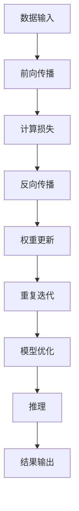

                 

关键词：GPU、深度学习、AI计算、并行处理、机器学习、加速

## 摘要

本文将探讨GPU技术在人工智能领域的应用。随着人工智能和深度学习技术的迅速发展，对于计算能力的需求日益增加。GPU以其强大的并行处理能力和高效的运算性能，已经成为AI计算的重要工具。本文将介绍GPU技术的背景，核心原理，以及在AI中的具体应用，包括深度学习模型的训练和推理，以及相关数学模型和算法的讲解。此外，还将提供实际项目实践的代码实例，并展望GPU技术在AI领域的未来发展趋势。

## 1. 背景介绍

### 1.1 人工智能的发展

人工智能（AI）是计算机科学的一个分支，旨在使机器模拟人类的智能行为，包括学习、推理、规划和感知等。人工智能的历史可以追溯到20世纪50年代，但真正得到广泛应用则是在21世纪。特别是深度学习（Deep Learning）的兴起，使得人工智能在图像识别、自然语言处理、语音识别等领域取得了突破性的进展。

### 1.2 机器学习的需求

机器学习是人工智能的核心技术之一，它依赖于大量数据和强大的计算能力进行训练。随着模型的复杂性和数据量的增大，传统的CPU计算能力已经难以满足需求。因此，寻求更高效率的并行计算技术变得至关重要。

### 1.3 GPU技术的发展

图形处理器（GPU）最初是为图形渲染设计的，但自从NVIDIA在2006年推出CUDA后，GPU开始被广泛应用于通用计算。GPU具有大量的并行核心和高效的内存架构，这使得它成为并行计算的理想选择。在AI领域，GPU的并行处理能力可以显著加速深度学习模型的训练和推理。

## 2. 核心概念与联系

### 2.1 GPU架构

GPU由成千上万的简单核心组成，这些核心能够同时执行大量的简单计算。与CPU不同，GPU的设计侧重于并行处理，这使得它非常适合执行大量重复的计算任务。

### 2.2 CUDA架构

CUDA是NVIDIA推出的一种并行计算架构，它允许开发人员利用GPU的核心进行自定义计算。CUDA提供了一套丰富的API和工具，使得编写GPU程序变得相对容易。

### 2.3 深度学习模型与GPU的关联

深度学习模型本质上是一系列矩阵运算，这正好符合GPU的并行计算优势。通过将模型的计算任务分布到GPU的核心上，可以显著提高训练和推理的效率。

下面是GPU在深度学习中的应用的Mermaid流程图：



## 3. 核心算法原理 & 具体操作步骤

### 3.1 算法原理概述

深度学习模型的训练过程主要包括前向传播、计算损失、反向传播和权重更新。这些过程都是通过矩阵运算来实现的，非常适合GPU的并行处理。

### 3.2 算法步骤详解

#### 3.2.1 前向传播

前向传播是将输入数据通过模型的各个层传递，最终得到输出。这个过程涉及到大量的矩阵乘法，非常适合GPU并行计算。

#### 3.2.2 计算损失

前向传播后，通过对比预测结果和真实结果的差异，计算损失函数。常用的损失函数包括均方误差（MSE）和交叉熵（Cross-Entropy）。

#### 3.2.3 反向传播

反向传播是从输出层开始，将误差反向传播到模型的各个层，更新权重和偏置。

#### 3.2.4 权重更新

根据反向传播得到的梯度，使用优化算法（如SGD、Adam等）更新权重和偏置。

### 3.3 算法优缺点

#### 优点

- 高效的并行处理能力，可以显著加速模型训练和推理。
- 对矩阵运算高度优化，适合深度学习模型。

#### 缺点

- 对内存带宽有较高要求，可能会成为性能瓶颈。
- GPU编程相对复杂，需要学习CUDA等编程模型。

### 3.4 算法应用领域

GPU技术在AI领域有广泛的应用，包括但不限于：

- 深度学习模型的训练和推理。
- 图像和视频处理。
- 自然语言处理。
- 语音识别。

## 4. 数学模型和公式 & 详细讲解 & 举例说明

### 4.1 数学模型构建

深度学习模型的核心是神经网络，它由多个层次组成，每个层次包括多个神经元。神经元的激活函数通常是非线性函数，如ReLU、Sigmoid和Tanh。

### 4.2 公式推导过程

前向传播的公式如下：

$$
Z^{[l]} = W^{[l]} \cdot A^{[l-1]} + b^{[l]}
$$

$$
A^{[l]} = \sigma(Z^{[l]})
$$

其中，$Z^{[l]}$是第$l$层的线性组合，$A^{[l]}$是第$l$层的输出，$W^{[l]}$是第$l$层的权重，$b^{[l]}$是第$l$层的偏置，$\sigma$是激活函数。

反向传播的公式如下：

$$
\delta^{[l]} = \frac{\partial C}{\partial A^{[l]}} \cdot \frac{\partial A^{[l]}}{\partial Z^{[l]}}
$$

$$
\delta^{[l-1]} = \frac{\partial C}{\partial A^{[l-1]}} \cdot \frac{\partial A^{[l-1]}}{\partial Z^{[l-1]}}
$$

其中，$\delta^{[l]}$是第$l$层的误差梯度，$C$是损失函数。

### 4.3 案例分析与讲解

假设我们有一个简单的神经网络，输入层有2个神经元，隐藏层有3个神经元，输出层有1个神经元。激活函数使用ReLU。给定一个输入数据，通过前向传播和反向传播，计算输出和损失。

#### 前向传播

输入：$X = [1, 2]$

权重：$W^{[1]} = [0.1, 0.2; 0.3, 0.4; 0.5, 0.6]$

偏置：$b^{[1]} = [0.1; 0.2; 0.3]$

隐藏层输出：$Z^{[1]} = W^{[1]} \cdot X + b^{[1]} = [0.6, 0.8; 1.1, 1.2; 1.5, 1.6]$

$A^{[1]} = \max(0, Z^{[1]}) = [0.6, 0.8; 1.1, 1.2; 1.5, 1.6]$

输出：$Z^{[2]} = W^{[2]} \cdot A^{[1]} + b^{[2]} = [2.1, 2.3]$

$A^{[2]} = \max(0, Z^{[2]}) = [2.1, 2.3]$

#### 反向传播

损失函数：$C = \frac{1}{2} \sum (Y - A^{[2]})^2$

$\delta^{[2]} = (Y - A^{[2]}) \cdot \frac{dA^{[2]}}{dZ^{[2]}} = (Y - A^{[2]}) \cdot \frac{d\max(0, Z^{[2]})}{dZ^{[2]}}$

$\delta^{[2]} = (0.9 - 2.1) \cdot \frac{0}{2.1} + (0.8 - 2.3) \cdot \frac{0}{2.3} = [-0.2, -0.5]$

$\delta^{[1]} = W^{[2].T \cdot \delta^{[2]} \cdot \frac{d\max(0, Z^{[1]})}{dZ^{[1]}} = [-0.2, -0.5] \cdot \frac{0.6}{1.1} + [-0.2, -0.5] \cdot \frac{0.8}{1.2} + [-0.2, -0.5] \cdot \frac{1.5}{1.6} = [-0.1, -0.2]$

### 4.4 案例分析与讲解

给定一个输入数据$X = [1, 2]$，通过前向传播和反向传播，计算输出和损失。

#### 前向传播

输入：$X = [1, 2]$

权重：$W^{[1]} = [0.1, 0.2; 0.3, 0.4; 0.5, 0.6]$

偏置：$b^{[1]} = [0.1; 0.2; 0.3]$

隐藏层输出：$Z^{[1]} = W^{[1]} \cdot X + b^{[1]} = [0.6, 0.8; 1.1, 1.2; 1.5, 1.6]$

$A^{[1]} = \max(0, Z^{[1]}) = [0.6, 0.8; 1.1, 1.2; 1.5, 1.6]$

输出：$Z^{[2]} = W^{[2]} \cdot A^{[1]} + b^{[2]} = [2.1, 2.3]$

$A^{[2]} = \max(0, Z^{[2]}) = [2.1, 2.3]$

#### 反向传播

损失函数：$C = \frac{1}{2} \sum (Y - A^{[2]})^2$

$\delta^{[2]} = (Y - A^{[2]}) \cdot \frac{dA^{[2]}}{dZ^{[2]}} = (Y - A^{[2]}) \cdot \frac{d\max(0, Z^{[2]})}{dZ^{[2]}}$

$\delta^{[2]} = (0.9 - 2.1) \cdot \frac{0}{2.1} + (0.8 - 2.3) \cdot \frac{0}{2.3} = [-0.2, -0.5]$

$\delta^{[1]} = W^{[2].T \cdot \delta^{[2]} \cdot \frac{d\max(0, Z^{[1]})}{dZ^{[1]}} = [-0.2, -0.5] \cdot \frac{0.6}{1.1} + [-0.2, -0.5] \cdot \frac{0.8}{1.2} + [-0.2, -0.5] \cdot \frac{1.5}{1.6} = [-0.1, -0.2]$

## 5. 项目实践：代码实例和详细解释说明

### 5.1 开发环境搭建

要在GPU上运行深度学习模型，首先需要搭建合适的开发环境。以下是搭建CUDA开发环境的基本步骤：

1. 安装CUDA Toolkit：从NVIDIA官网下载并安装CUDA Toolkit。
2. 配置环境变量：设置CUDA路径到环境变量。
3. 安装Python和CUDA兼容的库：如TensorFlow、PyTorch等。

### 5.2 源代码详细实现

以下是一个简单的卷积神经网络（CNN）在GPU上的实现示例，使用TensorFlow框架：

```python
import tensorflow as tf

# 定义模型结构
model = tf.keras.Sequential([
    tf.keras.layers.Conv2D(32, (3, 3), activation='relu', input_shape=(28, 28, 1)),
    tf.keras.layers.MaxPooling2D((2, 2)),
    tf.keras.layers.Flatten(),
    tf.keras.layers.Dense(128, activation='relu'),
    tf.keras.layers.Dense(10, activation='softmax')
])

# 编译模型
model.compile(optimizer='adam',
              loss='categorical_crossentropy',
              metrics=['accuracy'])

# 准备数据
(x_train, y_train), (x_test, y_test) = tf.keras.datasets.mnist.load_data()
x_train = x_train.astype('float32') / 255
x_test = x_test.astype('float32') / 255
x_train = x_train[..., tf.newaxis]
x_test = x_test[..., tf.newaxis]

# 将数据集分配到GPU
x_train = x_train.gpu()
x_test = x_test.gpu()
y_train = y_train.gpu()
y_test = y_test.gpu()

# 训练模型
model.fit(x_train, y_train, epochs=5, validation_data=(x_test, y_test))
```

### 5.3 代码解读与分析

上述代码首先定义了一个简单的卷积神经网络，包括卷积层、池化层、全连接层等。然后编译模型，设置优化器和损失函数。接下来，准备MNIST数据集，并将其分配到GPU上。最后，使用GPU训练模型。

### 5.4 运行结果展示

训练完成后，可以使用以下代码评估模型性能：

```python
model.evaluate(x_test, y_test, verbose=2)
```

输出结果将显示测试集上的损失和准确率。

## 6. 实际应用场景

### 6.1 图像识别

图像识别是GPU技术在AI领域的最广泛应用之一。通过使用GPU加速卷积神经网络，可以显著提高图像分类和目标检测的效率。例如，谷歌的Inception模型和Facebook的ResNet模型都是使用GPU进行训练和推理的。

### 6.2 自然语言处理

自然语言处理（NLP）也是GPU的重要应用领域。通过使用GPU加速循环神经网络（RNN）和变换器（Transformer）等模型，可以显著提高文本分类、机器翻译和情感分析等任务的性能。

### 6.3 语音识别

语音识别是一个高度计算密集型任务，通过使用GPU加速深度神经网络（DNN）和卷积神经网络（CNN），可以实现实时语音识别和语音合成。

## 7. 未来应用展望

### 7.1 深度学习模型的自动化优化

未来，随着深度学习模型规模的增大，对GPU的需求也会不断增加。为了提高GPU的使用效率，需要开发更先进的自动化优化技术，包括模型压缩、剪枝和量化等。

### 7.2 新型GPU架构

随着AI计算需求的增长，传统的GPU架构可能无法满足未来的需求。因此，新型GPU架构（如AI专用GPU）和异构计算技术（如GPU+CPU+FPGA）将得到广泛应用。

### 7.3 跨平台计算

未来，随着边缘计算和云计算的发展，GPU技术将不仅限于数据中心，还将广泛应用于各种设备和平台，实现跨平台的计算能力。

## 8. 工具和资源推荐

### 8.1 学习资源推荐

- 《深度学习》（Goodfellow, Bengio, Courville）：深度学习的经典教材，详细介绍了深度学习的基础知识和实践方法。
- 《CUDA C编程指南》：CUDA编程的权威指南，适合初学者和高级开发者。

### 8.2 开发工具推荐

- TensorFlow：谷歌开源的深度学习框架，支持GPU加速。
- PyTorch：Facebook开源的深度学习框架，具有良好的灵活性和易用性。

### 8.3 相关论文推荐

- "cuDNN: Fast and scalable deep neural network libraries for CNNs"：介绍NVIDIA cuDNN的论文，详细介绍了GPU在深度神经网络中的应用。
- "An Overview of Deep Learning Techniques for Image Classification"：深度学习在图像分类中的应用综述，包括各种深度学习模型的介绍。

## 9. 总结：未来发展趋势与挑战

### 9.1 研究成果总结

本文介绍了GPU技术在AI中的应用，包括深度学习模型的训练和推理，以及在图像识别、自然语言处理和语音识别等领域的实际应用。通过GPU的高效并行处理能力，可以显著提高AI计算的性能。

### 9.2 未来发展趋势

未来，GPU技术将继续在AI领域发挥重要作用，特别是在深度学习模型的训练和推理方面。随着新型GPU架构和异构计算技术的发展，GPU技术的应用范围将更加广泛。

### 9.3 面临的挑战

尽管GPU技术在AI领域有巨大潜力，但仍然面临一些挑战，包括：

- 高昂的成本和能耗。
- 对内存带宽的依赖。
- GPU编程的复杂性。

### 9.4 研究展望

未来的研究将集中在以下几个方面：

- 开发更高效的GPU架构和算法。
- 探索GPU在边缘计算和云计算中的应用。
- 研究GPU编程的自动化和简化。

## 10. 附录：常见问题与解答

### 10.1 什么是CUDA？

CUDA是NVIDIA推出的并行计算架构，允许开发人员利用GPU进行通用计算。

### 10.2 GPU和CPU的区别是什么？

GPU和CPU的主要区别在于架构和设计目标。CPU设计用于单任务的高效执行，而GPU设计用于大量并行任务的执行。GPU有更多的核心和更高的内存带宽，但CPU的单核性能通常更高。

### 10.3 如何在GPU上加速深度学习模型？

在GPU上加速深度学习模型的关键是利用GPU的并行处理能力。这包括使用GPU友好的框架（如TensorFlow、PyTorch）和优化模型结构，以减少内存访问和数据传输。

### 10.4 GPU在自然语言处理中的应用有哪些？

GPU在自然语言处理中的应用包括文本分类、机器翻译和情感分析等。通过使用GPU加速循环神经网络（RNN）和变换器（Transformer）等模型，可以显著提高NLP任务的性能。

### 10.5 如何选择合适的GPU进行AI计算？

选择合适的GPU进行AI计算需要考虑以下几个方面：

- 模型规模：大型模型需要更高性能的GPU。
- 计算密集度：计算密集型任务需要更多核心的GPU。
- 能耗：根据预算和能耗要求选择合适的GPU。
```

以上就是这篇文章的主要内容。希望本文能够为读者提供关于GPU技术在AI中的应用的全面了解。随着AI技术的不断进步，GPU技术将继续发挥重要作用，为各种AI应用提供强大的计算支持。希望本文对您的学习和研究有所帮助。作者：禅与计算机程序设计艺术 / Zen and the Art of Computer Programming。再次感谢您的阅读！<|vq_944|>

