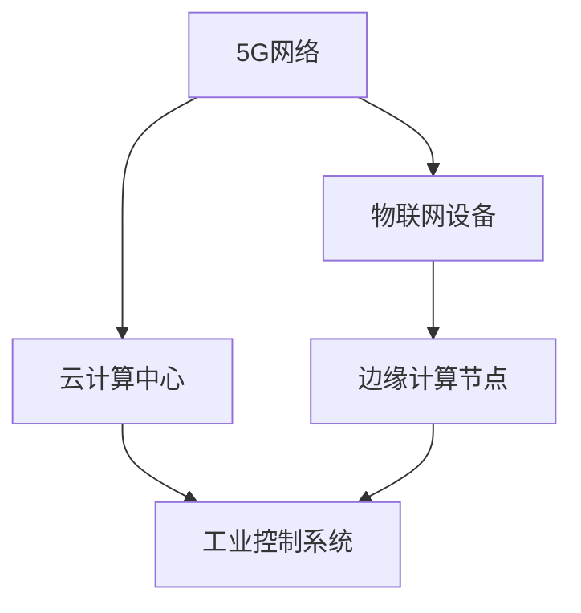

                 

关键词：5G，工业4.0，物联网，边缘计算，自动化，数字化转型

> 摘要：随着5G技术的成熟和广泛应用，工业4.0时代下的智能制造正迎来新的发展契机。本文旨在探讨5G技术在工业4.0中的应用，分析其在提升生产效率、增强数据传输能力和实现智能制造方面的潜力与挑战。

## 1. 背景介绍

### 工业革命的演变

工业革命自18世纪末开始，经历了机械化、电气化和自动化三个阶段，最终迈向信息化和智能化。工业4.0，又称第四次工业革命，是信息化和智能化在工业领域的深度融合，旨在通过物联网、大数据、人工智能等技术实现工厂的全面数字化和智能化。

### 5G技术的崛起

5G，即第五代移动通信技术，拥有更高的数据传输速率、更低的延迟和更大的连接容量。这些特点使得5G在支持物联网设备、实现智能应用和提供高效的边缘计算服务方面具有显著优势。

### 工业4.0与5G的关系

5G技术为工业4.0提供了关键的技术支撑，使工厂能够实现更高效、更智能的生产模式。通过5G网络，工厂可以实现设备的互联互通、数据的实时传输和处理，从而推动工业自动化和智能制造的发展。

## 2. 核心概念与联系

### 5G技术在工业4.0中的应用架构



### 核心概念原理

- **5G网络**：提供高速、低延迟的通信服务，支持大量设备同时连接。
- **物联网设备**：包括传感器、执行器、工业机器人等，是实现智能工厂的硬件基础。
- **云计算中心**：提供强大的计算和存储能力，支持大数据分析和机器学习应用。
- **边缘计算节点**：在靠近数据源的地方进行数据处理，减少网络延迟，提高响应速度。
- **工业控制系统**：负责实时监控和控制工厂的生产流程。

## 3. 核心算法原理 & 具体操作步骤

### 3.1 算法原理概述

5G技术通过提供高速、低延迟的网络服务，支持以下核心算法和操作：

- **边缘计算**：在靠近数据源的地方进行实时数据处理，以减少数据传输延迟。
- **机器学习**：通过分析工厂设备的数据，实现预测性维护和自动化控制。
- **物联网通信协议**：确保设备之间高效、可靠的数据交换。

### 3.2 算法步骤详解

1. **数据采集**：物联网设备收集工厂设备的数据，包括温度、压力、速度等。
2. **边缘计算**：边缘计算节点对采集到的数据进行初步处理，提取有用的信息。
3. **云计算**：将处理后的数据上传到云计算中心，进行更复杂的数据分析和机器学习。
4. **决策控制**：根据分析结果，工业控制系统调整工厂设备的运行参数，实现自动化控制。

### 3.3 算法优缺点

- **优点**：提高生产效率，降低维护成本，实现实时监控和自动化控制。
- **缺点**：系统复杂性增加，对网络稳定性和安全性要求更高。

### 3.4 算法应用领域

- **预测性维护**：通过分析设备运行数据，预测故障发生时间，实现提前维护。
- **生产调度**：根据实时数据，优化生产流程，提高生产效率。
- **质量管理**：实时监控产品质量，实现质量控制。

## 4. 数学模型和公式 & 详细讲解 & 举例说明

### 4.1 数学模型构建

5G技术在工业4.0中的应用涉及多个数学模型，包括：

- **传输速率模型**：根据5G网络带宽和延迟，计算数据传输速率。
- **可靠性模型**：评估5G网络的稳定性和可靠性。
- **能耗模型**：计算物联网设备和边缘计算节点的能耗。

### 4.2 公式推导过程

#### 传输速率模型

$$
\text{速率} = \frac{\text{带宽}}{\text{延迟}}
$$

#### 可靠性模型

$$
\text{可靠性} = \frac{\text{成功传输次数}}{\text{总传输次数}}
$$

#### 能耗模型

$$
\text{能耗} = f(\text{设备功率}, \text{工作时间})
$$

### 4.3 案例分析与讲解

以一个智能工厂为例，分析5G技术在生产效率和质量控制方面的应用：

- **生产效率**：通过边缘计算，实时分析生产数据，优化生产流程，提高生产效率。
- **质量控制**：利用5G网络传输实时数据，监控产品质量，减少次品率。

## 5. 项目实践：代码实例和详细解释说明

### 5.1 开发环境搭建

搭建一个基于5G和物联网的智能工厂项目，需要以下环境：

- **操作系统**：Linux或Windows
- **编程语言**：Python
- **开发工具**：Jupyter Notebook或PyCharm
- **5G网络**：具备5G网络的手机或路由器
- **物联网设备**：传感器和执行器

### 5.2 源代码详细实现

以下是一个简单的物联网设备数据采集与边缘计算示例代码：

```python
import requests
import time

# 设备数据采集
def collect_data(device_id):
    url = f"http://localhost:5000/sensor_data/{device_id}"
    response = requests.get(url)
    return response.json()

# 边缘计算
def edge_computation(data):
    # 实现具体的计算逻辑
    result = data['temperature'] * 1.2
    return result

# 主程序
if __name__ == "__main__":
    device_id = "12345"
    while True:
        data = collect_data(device_id)
        result = edge_computation(data)
        print(f"边缘计算结果：{result}")
        time.sleep(1)
```

### 5.3 代码解读与分析

- **数据采集**：通过HTTP请求获取物联网设备的数据。
- **边缘计算**：对采集到的数据进行简单的计算处理。
- **主程序**：循环执行数据采集和边缘计算过程。

### 5.4 运行结果展示

在运行程序时，会持续采集设备数据并实时计算边缘计算结果，输出如下：

```
边缘计算结果：36.0
边缘计算结果：37.2
边缘计算结果：37.6
...
```

## 6. 实际应用场景

### 6.1 智能制造

通过5G网络和物联网设备，工厂可以实现设备的互联互通，实时监控生产状态，优化生产流程，提高生产效率。

### 6.2 预测性维护

利用5G网络传输设备运行数据，通过边缘计算和云计算分析，实现预测性维护，减少设备故障和停机时间。

### 6.3 质量控制

通过实时监控产品质量数据，及时发现质量问题，采取措施进行纠正，提高产品质量。

## 7. 未来应用展望

### 7.1 自动化

5G技术将进一步推动工业自动化的发展，实现无人车间和智能生产。

### 7.2 数字化转型

5G技术将帮助更多传统企业实现数字化转型，提高竞争力。

### 7.3 新兴产业

5G技术在新兴产业，如无人机、智能物流等，具有广泛的应用前景。

## 8. 总结：未来发展趋势与挑战

### 8.1 研究成果总结

5G技术在工业4.0中的应用已取得显著成果，但面临诸多挑战。

### 8.2 未来发展趋势

未来，5G技术将在更多工业领域得到应用，推动工业4.0向更深层次发展。

### 8.3 面临的挑战

- **网络安全**：5G网络的开放性和连接性增加了网络安全风险。
- **标准统一**：不同设备和系统之间的兼容性和互操作性仍需解决。
- **成本控制**：5G网络建设和维护成本较高，需进一步降低。

### 8.4 研究展望

未来研究应重点关注5G技术在工业领域的安全、可靠、高效应用，为工业4.0的发展提供有力支持。

## 9. 附录：常见问题与解答

### 9.1 5G网络延迟如何影响工业4.0？

低延迟是5G技术的重要特点，对于工业4.0中的实时控制、预测性维护等应用至关重要。高延迟可能导致生产延误、设备故障等问题，影响生产效率。

### 9.2 物联网设备数量增加，5G网络能否支持？

5G网络具有高连接容量，能够支持大量物联网设备的接入。此外，通过边缘计算和云计算的协同，可以进一步优化网络资源，提高设备接入的可靠性。

### 9.3 5G技术在工业4.0中的应用前景如何？

5G技术为工业4.0提供了强大的技术支撑，有望推动智能制造、预测性维护、质量控制等领域的发展。未来，随着技术的不断成熟和成本的降低，5G技术在工业领域的应用前景将更加广阔。

作者：禅与计算机程序设计艺术 / Zen and the Art of Computer Programming
----------------------------------------------------------------

以上是按照规定格式撰写的完整文章。希望对您有所帮助。如果您有任何其他要求或需要进一步的内容，请随时告知。

