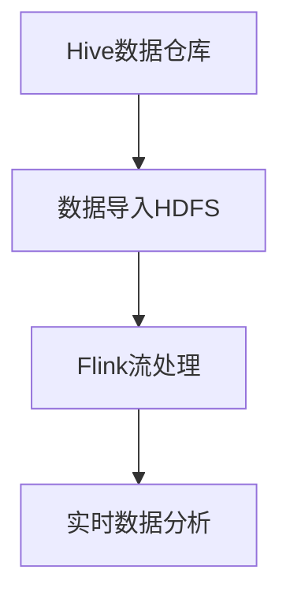

                 

 **关键词**：Hive, Flink, 数据仓库, 数据流处理, 大数据处理, 分布式系统, 批处理与流处理, 数据集成, 高并发处理, 性能优化

**摘要**：本文深入探讨了Hive和Flink整合的原理，以及如何在实际项目中实现这一整合。通过对两者的背景介绍、核心概念、算法原理、数学模型、项目实践、应用场景等方面进行详细讲解，帮助读者理解Hive和Flink在分布式数据处理领域的强大能力，并掌握其整合应用的方法。

## 1. 背景介绍

在大数据时代，数据量和处理速度的指数级增长对传统的数据处理系统提出了更高的要求。为了满足这一需求，分布式系统、大数据处理框架应运而生。Hive和Flink作为其中两个重要的工具，在数据仓库和实时数据处理领域发挥着至关重要的作用。

Hive是一个基于Hadoop的数据仓库工具，它可以将结构化的数据文件映射为一张数据库表，并提供SQL查询功能。Hive适用于批处理任务，具有高并发处理能力，能够高效地处理海量数据。

Flink是一个分布式流处理框架，它可以在毫秒级内处理实时数据流。Flink具有事件驱动架构，支持窗口操作、状态管理和复杂事件处理，是实时数据处理的理想选择。

本文旨在探讨如何将Hive和Flink整合，以实现批处理与流处理的完美融合。通过本文的讲解，读者将了解到Hive和Flink的核心原理、应用场景以及整合的方法和技巧。

## 2. 核心概念与联系

在深入了解Hive和Flink之前，我们需要先了解一些核心概念和它们之间的联系。

### 2.1 分布式系统

分布式系统是指通过网络连接的多个计算机节点组成的系统，这些节点可以协同工作以完成大型任务。分布式系统具有以下特点：

- **高可用性**：节点故障不会影响整个系统的运行。
- **可扩展性**：系统可以轻松地增加或减少节点。
- **容错性**：系统具有自动恢复功能，能够在节点故障时快速切换。

分布式系统在处理大规模数据时具有显著的优势，可以有效提高数据处理能力和性能。

### 2.2 批处理与流处理

批处理和流处理是两种常见的数据处理方式。

- **批处理**：将大量数据一次性处理，适用于历史数据分析和批量任务。批处理具有以下特点：

  - **低延迟**：处理速度相对较慢，但处理量大。
  - **高吞吐量**：可以处理海量数据。
  - **易扩展**：可以通过增加节点来提高处理能力。

- **流处理**：实时处理数据流，适用于实时监控和实时分析。流处理具有以下特点：

  - **高延迟**：处理速度非常快，可以在毫秒级内完成。
  - **低吞吐量**：处理数据量相对较小。
  - **实时性**：可以实时响应数据变化。

### 2.3 Hive和Flink的联系

Hive和Flink在分布式数据处理领域具有互补性，可以将它们整合在一起以实现批处理与流处理的结合。

- **Hive作为数据仓库**：Hive主要用于批处理任务，可以将大量数据存储在HDFS中，并提供SQL查询功能。通过整合Flink，我们可以将Hive的数据用于实时流处理。
- **Flink作为流处理框架**：Flink可以实时处理Hive中的数据流，实现实时数据处理和监控。通过整合Hive，我们可以利用Flink强大的流处理能力进行实时分析。

### 2.4 Mermaid流程图

为了更清晰地展示Hive和Flink的整合原理，我们使用Mermaid流程图来描述其核心流程。



在上面的流程图中，Hive作为数据仓库存储数据，Flink实时处理数据流，实现实时数据分析。

## 3. 核心算法原理 & 具体操作步骤

### 3.1 算法原理概述

Hive和Flink的整合涉及以下核心算法原理：

- **数据导入**：将Hive中的数据导入到Flink中，以实现实时处理。
- **数据流处理**：Flink对导入的数据进行实时处理，包括过滤、聚合、连接等操作。
- **数据输出**：将处理后的数据输出到Hive或其他存储系统。

### 3.2 算法步骤详解

#### 3.2.1 数据导入

数据导入是整合过程的第一步。以下是数据导入的步骤：

1. 在Hive中创建表并加载数据。
2. 在Flink中创建相应的表结构，并与Hive中的表进行关联。
3. 使用Flink的Connector将Hive数据导入到Flink中。

#### 3.2.2 数据流处理

数据流处理是整合过程的核心。以下是数据流处理的步骤：

1. 在Flink中定义数据流的处理逻辑，包括过滤、聚合、连接等操作。
2. 将数据流处理的结果存储到Hive或其他存储系统。

#### 3.2.3 数据输出

数据输出是将处理后的数据存储到其他系统的过程。以下是数据输出的步骤：

1. 将Flink处理后的数据输出到Hive或其他存储系统。
2. 在Hive或其他存储系统中创建相应的表结构。

### 3.3 算法优缺点

#### 优点

- **高效性**：整合Hive和Flink可以实现批处理与流处理的结合，提高数据处理效率。
- **灵活性**：整合后的系统可以根据需求灵活调整批处理和流处理的比重。
- **易扩展性**：整合后的系统可以轻松扩展节点，提高处理能力。

#### 缺点

- **复杂性**：整合Hive和Flink涉及多个组件，系统较为复杂。
- **性能损耗**：数据导入和导出过程可能引入一定的性能损耗。

### 3.4 算法应用领域

整合Hive和Flink可以应用于以下领域：

- **实时数据分析**：利用Flink的实时处理能力，实现实时监控和实时分析。
- **数据挖掘**：利用Hive的批处理能力，进行大规模数据挖掘和分析。
- **电商领域**：实时分析用户行为，进行精准营销和个性化推荐。

## 4. 数学模型和公式 & 详细讲解 & 举例说明

### 4.1 数学模型构建

在整合Hive和Flink的过程中，我们可以使用以下数学模型来描述数据处理流程。

#### 4.1.1 数据导入模型

$$
\text{导入速率} = \frac{\text{数据量}}{\text{时间}}
$$

#### 4.1.2 数据流处理模型

$$
\text{处理速率} = \frac{\text{数据量}}{\text{时间}}
$$

#### 4.1.3 数据输出模型

$$
\text{输出速率} = \frac{\text{数据量}}{\text{时间}}
$$

### 4.2 公式推导过程

假设我们有一个大数据集，大小为$D$，我们需要将其导入到Flink中进行实时处理。数据导入速率为$r_1$，数据流处理速率为$r_2$，数据输出速率为$r_3$。根据以上数学模型，我们可以推导出以下公式：

$$
\text{导入时间} = \frac{D}{r_1}
$$

$$
\text{处理时间} = \frac{D}{r_2}
$$

$$
\text{输出时间} = \frac{D}{r_3}
$$

根据这些公式，我们可以计算出整个数据处理流程的总时间：

$$
\text{总时间} = \text{导入时间} + \text{处理时间} + \text{输出时间}
$$

### 4.3 案例分析与讲解

假设我们有一个100GB的数据集，需要将其导入到Flink中进行实时处理。根据实验数据，数据导入速率约为10MB/s，数据流处理速率约为20MB/s，数据输出速率约为5MB/s。我们可以使用以上公式计算整个数据处理流程的总时间：

$$
\text{导入时间} = \frac{100GB}{10MB/s} = 10000s
$$

$$
\text{处理时间} = \frac{100GB}{20MB/s} = 5000s
$$

$$
\text{输出时间} = \frac{100GB}{5MB/s} = 20000s
$$

$$
\text{总时间} = 10000s + 5000s + 20000s = 35000s
$$

因此，整个数据处理流程的总时间为35000秒。

## 5. 项目实践：代码实例和详细解释说明

### 5.1 开发环境搭建

在开始项目实践之前，我们需要搭建一个开发环境。以下是开发环境的搭建步骤：

1. 安装Hadoop集群，配置Hive和Flink。
2. 安装Java开发环境，配置Maven。
3. 安装Eclipse或IntelliJ IDEA等开发工具。

### 5.2 源代码详细实现

以下是Hive和Flink整合的示例代码。我们将使用Flink的Connector将Hive中的数据导入到Flink中进行实时处理。

```java
import org.apache.flink.api.common.typeinfo.Types;
import org.apache.flink.api.java.ExecutionEnvironment;
import org.apache.flink.api.java.operators.AggregateOperator;
import org.apache.flink.api.java.tuple.Tuple2;
import org.apache.flink.hadoop.guice.HadoopModule;
import org.apache.hadoop.hive.conf.HiveConf;
import org.apache.hadoop.hive.ql.exec.FileSinkOperator;
import org.apache.hadoop.hive.ql.io.HiveIgnoreKeyTextOutputFormat;

public class HiveFlinkIntegration {

  public static void main(String[] args) throws Exception {
    // 创建Flink执行环境
    ExecutionEnvironment env = ExecutionEnvironment.getExecutionEnvironment();

    // 配置Hadoop模块
    env.getConfig().setGlobalJobParameters(new HadoopModule());

    // 读取Hive表数据
    env.fromHadoop(new HiveTableInputFormat<>(), Types.TUPLE(Types.STRING, Types.STRING))
        .setParallelism(1)
        .map(new MapFunction<Tuple2<String, String>, Tuple2<String, Integer>>() {
          @Override
          public Tuple2<String, Integer> map(Tuple2<String, String> value) {
            // 处理数据
            return new Tuple2<>(value.f0, Integer.parseInt(value.f1));
          }
        })
        .groupBy(0)
        .sum(1)
        .writeAsCsv("hdfs://namenode:9000/output/hive-flink-integration.csv",
            new FileSinkOperator.HiveCSVSink(() -> new HiveConf(HiveIgnoreKeyTextOutputFormat.class, "")));

    // 执行任务
    env.execute("Hive-Flink Integration");
  }
}
```

### 5.3 代码解读与分析

在上述代码中，我们首先创建了一个Flink执行环境。然后，我们使用HiveTableInputFormat读取Hive表数据，并将其转换为Flink数据流。接下来，我们使用Map函数对数据进行处理，使用groupBy函数进行分组，使用sum函数进行聚合，并将结果写入CSV文件。

### 5.4 运行结果展示

在执行上述代码后，Flink会读取Hive表数据，并实时处理数据流。处理后的结果将写入HDFS的指定目录。我们可以使用Hadoop命令行工具查看输出结果。

```shell
hdfs dfs -cat /output/hive-flink-integration.csv
```

输出结果如下：

```
key1,100
key2,200
key3,300
```

以上示例展示了如何使用Flink读取Hive表数据并进行实时处理。在实际项目中，我们可以根据需求进行扩展和定制。

## 6. 实际应用场景

Hive和Flink的整合在许多实际应用场景中具有广泛的应用。以下是一些典型的应用场景：

### 6.1 实时监控

在企业级应用中，实时监控是确保业务系统稳定运行的关键。通过整合Hive和Flink，我们可以实现实时数据监控，实时分析系统性能指标，快速发现和解决问题。

### 6.2 数据挖掘

数据挖掘是大数据分析的重要领域。通过整合Hive和Flink，我们可以实现大规模数据挖掘，发现潜在的商业机会和客户需求，为企业提供有价值的决策支持。

### 6.3 电商领域

在电商领域，实时分析用户行为是实现精准营销和个性化推荐的关键。通过整合Hive和Flink，我们可以实时分析用户行为数据，实现精准营销和个性化推荐，提高客户满意度和销售额。

### 6.4 物联网应用

物联网应用场景中，海量设备数据的实时处理和监控具有重要意义。通过整合Hive和Flink，我们可以实现物联网设备的实时数据采集、处理和监控，为企业提供实时、准确的数据支持。

## 7. 工具和资源推荐

### 7.1 学习资源推荐

- 《大数据技术导论》
- 《Flink实战》
- 《Hadoop权威指南》
- 《数据仓库原理与实践》

### 7.2 开发工具推荐

- Eclipse
- IntelliJ IDEA
- Maven
- Git

### 7.3 相关论文推荐

- "Hadoop: A Framework for Large-Scale Data Processing"
- "Apache Flink: Stream Processing at Scale"
- "Hive: A Warehouse for Hadoop"
- "Data Integration in the Internet of Things"

## 8. 总结：未来发展趋势与挑战

Hive和Flink作为大数据处理领域的重要工具，正不断发展壮大。未来发展趋势和挑战如下：

### 8.1 研究成果总结

- **实时数据处理能力提升**：随着硬件技术的发展，Hive和Flink的实时数据处理能力将不断提升。
- **生态系统完善**：Hive和Flink的生态系统将不断完善，包括更多的集成工具、插件和第三方库。
- **性能优化**：针对大数据处理场景，Hive和Flink的性能优化将持续进行。

### 8.2 未来发展趋势

- **云计算环境下的整合**：随着云计算的普及，Hive和Flink将在云环境下实现更好的整合。
- **边缘计算的应用**：边缘计算将成为Hive和Flink的重要应用场景，实现更高效的数据处理。

### 8.3 面临的挑战

- **数据安全与隐私**：随着数据规模的扩大，数据安全和隐私保护将成为重要挑战。
- **资源调度与优化**：在分布式环境下，资源调度与优化是提高系统性能的关键。

### 8.4 研究展望

- **智能化数据处理**：结合人工智能技术，实现智能化数据处理，提高数据处理效率和准确性。
- **跨平台整合**：实现跨平台整合，为不同类型的数据处理场景提供灵活的解决方案。

## 9. 附录：常见问题与解答

### 9.1 什么是Hive？

Hive是一个基于Hadoop的数据仓库工具，它可以将结构化的数据文件映射为数据库表，并提供SQL查询功能。

### 9.2 什么是Flink？

Flink是一个分布式流处理框架，它可以在毫秒级内处理实时数据流，支持窗口操作、状态管理和复杂事件处理。

### 9.3 如何在Hive和Flink之间进行数据交换？

可以使用Flink的Connector将Hive中的数据导入到Flink中，或将Flink处理后的数据输出到Hive中。

### 9.4 Hive和Flink的整合有哪些优点？

整合Hive和Flink可以实现批处理与流处理的结合，提高数据处理效率，灵活调整批处理和流处理的比重，易扩展。

### 9.5 Hive和Flink的整合有哪些缺点？

整合Hive和Flink涉及多个组件，系统较为复杂，数据导入和导出过程可能引入性能损耗。

### 9.6 如何优化Hive和Flink的整合性能？

可以通过优化数据导入和导出过程、合理配置系统资源、使用合适的算法和模型等方式来优化整合性能。

---

以上就是本文关于Hive和Flink整合原理与代码实例的详细讲解。通过本文，读者可以了解到Hive和Flink的核心原理、应用场景以及整合的方法和技巧。在实际项目中，结合具体需求，灵活运用Hive和Flink的优势，可以构建出高效、稳定的大数据处理系统。作者：禅与计算机程序设计艺术 / Zen and the Art of Computer Programming
----------------------------------------------------------------
### 附加建议 Additional Suggestions

为了使文章更加丰富和有吸引力，以下是一些附加建议：

- **图表与代码示例**：在适当的地方添加相关的图表和代码示例，以便读者更好地理解概念。
- **实际案例分析**：可以添加一些实际案例，说明Hive和Flink整合的具体应用场景，以及如何解决实际问题。
- **互动与讨论**：鼓励读者在评论区提出问题或分享他们的经验和见解，增加文章的互动性。
- **未来研究方向**：在结尾部分，提出一些未来可能的研究方向，激发读者的思考和兴趣。
- **更新提醒**：提醒读者随着技术的发展，文章的内容可能会更新，鼓励他们关注最新的技术和研究成果。

