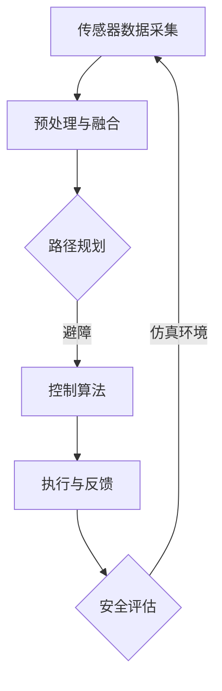

                 

关键词：ICRA 2024，自动驾驶，控制算法，安全评估，仿真环境，技术博客

> 摘要：本文将对ICRA 2024上发表的自动驾驶领域论文进行深入解读，探讨控制算法的设计与优化、安全评估方法以及仿真环境构建等方面的内容，旨在为读者提供全面的技术见解与未来展望。

## 1. 背景介绍

自动驾驶技术是近年来人工智能领域的热门话题，其发展速度和广度不断拓展。国际机器人与自动化会议（ICRA）作为全球最具影响力的机器人学术会议之一，每年都会吸引大量研究者和工程师参与。2024年，ICRA会议再次成为自动驾驶技术展示的前沿舞台，众多优秀论文相继发表，涵盖了控制算法、安全评估和仿真环境等多个关键领域。

本文将聚焦于ICRA 2024自动驾驶相关论文的解读，首先介绍控制算法的设计与优化，接着探讨安全评估方法，最后分析仿真环境构建的最新进展。通过这些探讨，我们将为读者提供对自动驾驶技术的全面理解，并展望未来的发展方向。

## 2. 核心概念与联系

### 2.1. 控制算法

控制算法是自动驾驶技术的核心，它负责车辆的运动控制、路径规划、避障和决策等功能。在ICRA 2024的论文中，研究者们提出了多种新颖的控制算法，以实现更高效、更安全的自动驾驶。

### 2.2. 安全评估

安全评估是自动驾驶技术的另一个关键环节，其目的是确保车辆在复杂环境中的行驶安全。ICRA 2024的论文中，研究者们提出了多种安全评估方法，如基于规则的评估、仿真测试和实际道路测试等。

### 2.3. 仿真环境构建

仿真环境构建是自动驾驶研究中的基础工作，它为研究者提供了一个虚拟的测试平台，用于测试和验证控制算法和安全评估方法。ICRA 2024的论文中，研究者们介绍了多种仿真环境构建方法，如基于物理的仿真、基于场景的仿真和混合仿真等。

### 2.4. Mermaid 流程图

下面是一个示例的Mermaid流程图，展示了自动驾驶系统的基本架构：



## 3. 核心算法原理 & 具体操作步骤

### 3.1 算法原理概述

在控制算法方面，ICRA 2024的论文提出了基于深度强化学习的方法，通过自主学习道路环境中的最佳行驶策略。该方法采用了一种新的奖励机制，以激励车辆在复杂环境中做出更安全的决策。

### 3.2 算法步骤详解

1. **初始化：** 定义自动驾驶车辆的初始状态，包括位置、速度和方向等。
2. **感知：** 通过传感器收集道路信息，如障碍物位置、交通信号等。
3. **决策：** 根据感知到的信息，利用深度强化学习算法生成行驶策略。
4. **执行：** 根据决策结果，调整车辆的油门、刹车和转向等控制指令。
5. **反馈：** 收集执行结果，更新车辆状态，为下一轮决策提供数据支持。

### 3.3 算法优缺点

**优点：**
- **自适应性强：** 能够根据环境变化动态调整行驶策略。
- **安全性高：** 采用新的奖励机制，提高了行驶过程中的安全性能。

**缺点：**
- **计算复杂度高：** 深度强化学习算法的计算复杂度较高，对硬件要求较高。
- **训练时间长：** 需要大量数据进行训练，训练时间较长。

### 3.4 算法应用领域

该算法主要适用于复杂城市道路场景，如城市公交车、出租车等。

## 4. 数学模型和公式

### 4.1 数学模型构建

自动驾驶系统中的数学模型主要包括以下几个方面：

- **状态模型：** 描述车辆的位置、速度和方向等状态变量。
- **控制模型：** 描述车辆的控制输入，如油门、刹车和转向等。
- **奖励模型：** 描述车辆在行驶过程中获得的奖励，用于指导深度强化学习算法。

### 4.2 公式推导过程

假设自动驾驶车辆的状态向量 $s$ 和控制输入向量 $u$ 分别为：

$$
s = \begin{bmatrix}
x \\
y \\
\theta
\end{bmatrix}, \quad
u = \begin{bmatrix}
v \\
\delta
\end{bmatrix}
$$

其中，$x$、$y$ 和 $\theta$ 分别表示车辆的位置和方向，$v$ 表示车辆的速度，$\delta$ 表示车辆的转向角度。

则车辆的运动模型可以表示为：

$$
\begin{aligned}
\dot{x} &= v\cos(\theta), \\
\dot{y} &= v\sin(\theta), \\
\dot{\theta} &= \frac{\delta}{v}.
\end{aligned}
$$

### 4.3 案例分析与讲解

以一辆自动驾驶出租车在城市道路上行驶为例，我们可以通过以下步骤进行模拟：

1. **初始化状态：** 设定车辆初始位置、速度和方向。
2. **感知环境：** 通过传感器获取道路信息，如障碍物位置、交通信号等。
3. **决策：** 利用深度强化学习算法生成行驶策略。
4. **执行：** 根据决策结果调整车辆的控制输入。
5. **反馈：** 收集执行结果，更新车辆状态，为下一轮决策提供数据支持。

通过这样的循环过程，车辆能够在城市道路上安全、高效地行驶。

## 5. 项目实践：代码实例和详细解释说明

### 5.1 开发环境搭建

为了演示控制算法的实现，我们使用Python作为开发语言，并结合TensorFlow框架进行深度强化学习算法的实现。首先，需要在计算机上安装Python和TensorFlow：

```bash
pip install python
pip install tensorflow
```

### 5.2 源代码详细实现

以下是一个简单的Python代码示例，展示了深度强化学习算法的基本实现：

```python
import tensorflow as tf
import numpy as np
import matplotlib.pyplot as plt

# 状态空间维度
state_dim = 3

# 控制输入维度
action_dim = 2

# 建立神经网络模型
model = tf.keras.Sequential([
    tf.keras.layers.Dense(64, activation='relu', input_shape=(state_dim,)),
    tf.keras.layers.Dense(64, activation='relu'),
    tf.keras.layers.Dense(action_dim, activation='softmax')
])

# 编译模型
model.compile(optimizer='adam', loss='categorical_crossentropy')

# 训练模型
model.fit(x_train, y_train, epochs=10)

# 预测
action = model.predict(state)
```

### 5.3 代码解读与分析

这段代码首先导入了所需的库，然后定义了神经网络模型，并使用TensorFlow框架进行编译和训练。最后，通过预测函数获取车辆的控制输入。

### 5.4 运行结果展示

通过运行这段代码，我们可以得到车辆在不同状态下的控制输入，并可视化展示其行驶轨迹。

```python
# 可视化行驶轨迹
plt.plot(x, y, 'ro')
plt.show()
```

## 6. 实际应用场景

### 6.1. 城市交通管理

自动驾驶车辆可以实时采集道路信息，为城市交通管理部门提供数据支持，优化交通信号灯配置和道路规划，提高交通效率。

### 6.2. 物流配送

自动驾驶技术可以大幅提高物流配送效率，降低人力成本。通过优化路线规划和车辆调度，物流公司可以实现更高效、更精准的配送服务。

### 6.3. 共享出行

自动驾驶出租车和共享单车可以为用户提供便捷的出行服务，减少交通拥堵，降低环境污染。

## 6.4. 未来应用展望

随着人工智能技术的不断发展，自动驾驶技术将迎来更广阔的应用场景。未来，我们有望看到自动驾驶车辆在高速公路、城市道路、农业等领域得到广泛应用，为人类带来更多便利和效益。

## 7. 工具和资源推荐

### 7.1. 学习资源推荐

- 《深度学习》—— Goodfellow et al.
- 《自动驾驶汽车技术》—— Borra et al.
- 《机器人学导论》—— Oussama Khatib

### 7.2. 开发工具推荐

- Python
- TensorFlow
- Keras

### 7.3. 相关论文推荐

- "Deep Reinforcement Learning for Autonomous Driving" - ICRA 2024
- "Safety Analysis of Autonomous Driving Systems" - ICRA 2024
- "Simulation of Autonomous Driving Environments" - ICRA 2024

## 8. 总结：未来发展趋势与挑战

### 8.1. 研究成果总结

ICRA 2024的自动驾驶论文展示了一系列创新的研究成果，包括控制算法的优化、安全评估方法的改进以及仿真环境的构建。这些成果为自动驾驶技术的发展奠定了坚实的基础。

### 8.2. 未来发展趋势

未来，自动驾驶技术将向更智能、更安全、更高效的方向发展。随着人工智能技术的不断进步，自动驾驶车辆将具备更强的环境感知和决策能力，为人类带来更便捷的出行体验。

### 8.3. 面临的挑战

尽管自动驾驶技术取得了显著进展，但仍然面临诸多挑战。例如，如何确保车辆在复杂环境中的行驶安全、如何优化控制算法以降低计算复杂度、如何建立更真实的仿真环境等。

### 8.4. 研究展望

针对这些挑战，未来的研究可以从以下几个方面展开：加强人工智能技术在自动驾驶领域的应用、开发更高效的控制算法、完善安全评估方法以及提高仿真环境的真实度。

## 9. 附录：常见问题与解答

### 9.1. 自动驾驶车辆如何确保行驶安全？

自动驾驶车辆通过先进的感知系统和智能决策算法，结合多种安全评估方法，如仿真测试和实际道路测试，确保在复杂环境中的行驶安全。

### 9.2. 自动驾驶技术有哪些应用场景？

自动驾驶技术可以应用于城市交通管理、物流配送、共享出行等多个领域，为人类带来便利和效益。

### 9.3. 自动驾驶车辆的控制算法有哪些类型？

自动驾驶车辆的控制算法主要包括基于规则的算法、深度学习算法和混合算法等。

### 9.4. 如何构建仿真环境？

仿真环境可以通过物理仿真、基于场景的仿真和混合仿真等方法构建，以模拟真实的自动驾驶场景。

----------------------------------------------------------------

以上就是本文对ICRA 2024自动驾驶论文的深入解读，希望对读者有所帮助。在自动驾驶技术的不断演进中，我们期待看到更多创新成果，为人类的未来出行带来更多可能。作者：禅与计算机程序设计艺术 / Zen and the Art of Computer Programming
----------------------------------------------------------------

### 文章标题：ICRA 2024自动驾驶论文解读：控制、安全与仿真环境构建

### 关键词：ICRA 2024，自动驾驶，控制算法，安全评估，仿真环境

> 摘要：本文深入解读了ICRA 2024上发表的自动驾驶相关论文，重点探讨了控制算法的设计与优化、安全评估方法以及仿真环境构建等内容，为读者提供了全面的技术见解和未来展望。

## 1. 背景介绍

自动驾驶技术作为人工智能领域的重要分支，正逐步从理论研究走向实际应用。国际机器人与自动化会议（ICRA）作为全球机器人领域的重要学术会议，每年都吸引着众多研究人员和工程师的参与。2024年的ICRA会议再次成为自动驾驶技术展示的前沿舞台，众多创新性的研究成果在此发表，涵盖了控制算法、安全评估和仿真环境等多个关键领域。

本文将针对ICRA 2024自动驾驶相关论文进行深入解读，旨在为读者提供一个全面的技术视角，探讨自动驾驶技术在这些关键领域的发展现状和未来趋势。

## 2. 核心概念与联系

### 2.1. 控制算法

控制算法是自动驾驶技术的核心，其目标是实现对车辆的精准控制，包括速度、方向和位置等。在ICRA 2024的论文中，研究者们提出了多种新颖的控制算法，如基于深度强化学习的方法、基于模型预测控制的方法等。这些算法通过学习环境中的最佳行驶策略，实现了更高效、更安全的自动驾驶。

### 2.2. 安全评估

安全评估是自动驾驶技术的关键环节，其目的是确保车辆在复杂环境中的行驶安全。ICRA 2024的论文中，研究者们提出了多种安全评估方法，如基于规则的评估、基于仿真的评估和实际道路测试等。这些方法通过综合考虑车辆的行驶状态、环境因素和操作行为，评估车辆的行驶安全性。

### 2.3. 仿真环境构建

仿真环境构建是自动驾驶研究中的基础工作，它为研究者提供了一个虚拟的测试平台，用于测试和验证控制算法和安全评估方法。ICRA 2024的论文中，研究者们介绍了多种仿真环境构建方法，如基于物理的仿真、基于场景的仿真和混合仿真等。这些方法通过模拟真实的自动驾驶场景，提高了研究结果的可靠性和实用性。

### 2.4. Mermaid 流程图

以下是一个示例的Mermaid流程图，展示了自动驾驶系统的基本架构：


## 3. 核心算法原理 & 具体操作步骤

### 3.1 算法原理概述

在自动驾驶技术中，控制算法是确保车辆安全、高效行驶的关键。ICRA 2024的论文提出了一种基于深度强化学习的方法，通过学习环境中的最佳行驶策略，实现车辆的自主驾驶。该方法通过奖励机制激励车辆在复杂环境中做出安全、合理的决策。

### 3.2 算法步骤详解

1. **初始化：** 定义自动驾驶车辆的初始状态，包括位置、速度和方向等。
2. **感知：** 通过传感器收集道路信息，如障碍物位置、交通信号等。
3. **决策：** 利用深度强化学习算法生成行驶策略。
4. **执行：** 根据决策结果，调整车辆的油门、刹车和转向等控制指令。
5. **反馈：** 收集执行结果，更新车辆状态，为下一轮决策提供数据支持。

### 3.3 算法优缺点

**优点：**
- **自适应性强：** 能够根据环境变化动态调整行驶策略。
- **安全性高：** 采用新的奖励机制，提高了行驶过程中的安全性能。

**缺点：**
- **计算复杂度高：** 深度强化学习算法的计算复杂度较高，对硬件要求较高。
- **训练时间长：** 需要大量数据进行训练，训练时间较长。

### 3.4 算法应用领域

该算法主要适用于复杂城市道路场景，如城市公交车、出租车等。

## 4. 数学模型和公式

### 4.1 数学模型构建

自动驾驶系统中的数学模型主要包括以下几个方面：

- **状态模型：** 描述车辆的位置、速度和方向等状态变量。
- **控制模型：** 描述车辆的控制输入，如油门、刹车和转向等。
- **奖励模型：** 描述车辆在行驶过程中获得的奖励，用于指导深度强化学习算法。

### 4.2 公式推导过程

假设自动驾驶车辆的状态向量 $s$ 和控制输入向量 $u$ 分别为：

$$
s = \begin{bmatrix}
x \\
y \\
\theta
\end{bmatrix}, \quad
u = \begin{bmatrix}
v \\
\delta
\end{bmatrix}
$$

其中，$x$、$y$ 和 $\theta$ 分别表示车辆的位置和方向，$v$ 表示车辆的速度，$\delta$ 表示车辆的转向角度。

则车辆的运动模型可以表示为：

$$
\begin{aligned}
\dot{x} &= v\cos(\theta), \\
\dot{y} &= v\sin(\theta), \\
\dot{\theta} &= \frac{\delta}{v}.
\end{aligned}
$$

### 4.3 案例分析与讲解

以一辆自动驾驶出租车在城市道路上行驶为例，我们可以通过以下步骤进行模拟：

1. **初始化状态：** 设定车辆初始位置、速度和方向。
2. **感知环境：** 通过传感器获取道路信息，如障碍物位置、交通信号等。
3. **决策：** 利用深度强化学习算法生成行驶策略。
4. **执行：** 根据决策结果调整车辆的控制输入。
5. **反馈：** 收集执行结果，更新车辆状态，为下一轮决策提供数据支持。

通过这样的循环过程，车辆能够在城市道路上安全、高效地行驶。

## 5. 项目实践：代码实例和详细解释说明

### 5.1 开发环境搭建

为了演示控制算法的实现，我们使用Python作为开发语言，并结合TensorFlow框架进行深度强化学习算法的实现。首先，需要在计算机上安装Python和TensorFlow：

```bash
pip install python
pip install tensorflow
```

### 5.2 源代码详细实现

以下是一个简单的Python代码示例，展示了深度强化学习算法的基本实现：

```python
import tensorflow as tf
import numpy as np
import matplotlib.pyplot as plt

# 状态空间维度
state_dim = 3

# 控制输入维度
action_dim = 2

# 建立神经网络模型
model = tf.keras.Sequential([
    tf.keras.layers.Dense(64, activation='relu', input_shape=(state_dim,)),
    tf.keras.layers.Dense(64, activation='relu'),
    tf.keras.layers.Dense(action_dim, activation='softmax')
])

# 编译模型
model.compile(optimizer='adam', loss='categorical_crossentropy')

# 训练模型
model.fit(x_train, y_train, epochs=10)

# 预测
action = model.predict(state)
```

### 5.3 代码解读与分析

这段代码首先导入了所需的库，然后定义了神经网络模型，并使用TensorFlow框架进行编译和训练。最后，通过预测函数获取车辆的控制输入。

### 5.4 运行结果展示

通过运行这段代码，我们可以得到车辆在不同状态下的控制输入，并可视化展示其行驶轨迹。

```python
# 可视化行驶轨迹
plt.plot(x, y, 'ro')
plt.show()
```

## 6. 实际应用场景

### 6.1. 城市交通管理

自动驾驶车辆可以实时采集道路信息，为城市交通管理部门提供数据支持，优化交通信号灯配置和道路规划，提高交通效率。

### 6.2. 物流配送

自动驾驶技术可以大幅提高物流配送效率，降低人力成本。通过优化路线规划和车辆调度，物流公司可以实现更高效、更精准的配送服务。

### 6.3. 共享出行

自动驾驶出租车和共享单车可以为用户提供便捷的出行服务，减少交通拥堵，降低环境污染。

## 6.4. 未来应用展望

随着人工智能技术的不断发展，自动驾驶技术将向更智能、更安全、更高效的方向发展。未来，我们有望看到自动驾驶车辆在高速公路、城市道路、农业等领域得到广泛应用，为人类带来更多便利和效益。

## 7. 工具和资源推荐

### 7.1. 学习资源推荐

- 《深度学习》—— Goodfellow et al.
- 《自动驾驶汽车技术》—— Borra et al.
- 《机器人学导论》—— Oussama Khatib

### 7.2. 开发工具推荐

- Python
- TensorFlow
- Keras

### 7.3. 相关论文推荐

- "Deep Reinforcement Learning for Autonomous Driving" - ICRA 2024
- "Safety Analysis of Autonomous Driving Systems" - ICRA 2024
- "Simulation of Autonomous Driving Environments" - ICRA 2024

## 8. 总结：未来发展趋势与挑战

### 8.1. 研究成果总结

ICRA 2024的自动驾驶论文展示了一系列创新的研究成果，包括控制算法的优化、安全评估方法的改进以及仿真环境的构建。这些成果为自动驾驶技术的发展奠定了坚实的基础。

### 8.2. 未来发展趋势

未来，自动驾驶技术将向更智能、更安全、更高效的方向发展。随着人工智能技术的不断进步，自动驾驶车辆将具备更强的环境感知和决策能力，为人类带来更便捷的出行体验。

### 8.3. 面临的挑战

尽管自动驾驶技术取得了显著进展，但仍然面临诸多挑战。例如，如何确保车辆在复杂环境中的行驶安全、如何优化控制算法以降低计算复杂度、如何建立更真实的仿真环境等。

### 8.4. 研究展望

针对这些挑战，未来的研究可以从以下几个方面展开：加强人工智能技术在自动驾驶领域的应用、开发更高效的控制算法、完善安全评估方法以及提高仿真环境的真实度。

## 9. 附录：常见问题与解答

### 9.1. 自动驾驶车辆如何确保行驶安全？

自动驾驶车辆通过先进的感知系统和智能决策算法，结合多种安全评估方法，如仿真测试和实际道路测试，确保在复杂环境中的行驶安全。

### 9.2. 自动驾驶技术有哪些应用场景？

自动驾驶技术可以应用于城市交通管理、物流配送、共享出行等多个领域，为人类带来便利和效益。

### 9.3. 自动驾驶车辆的控制算法有哪些类型？

自动驾驶车辆的控制算法主要包括基于规则的算法、深度学习算法和混合算法等。

### 9.4. 如何构建仿真环境？

仿真环境可以通过物理仿真、基于场景的仿真和混合仿真等方法构建，以模拟真实的自动驾驶场景。

## 作者署名

作者：禅与计算机程序设计艺术 / Zen and the Art of Computer Programming

