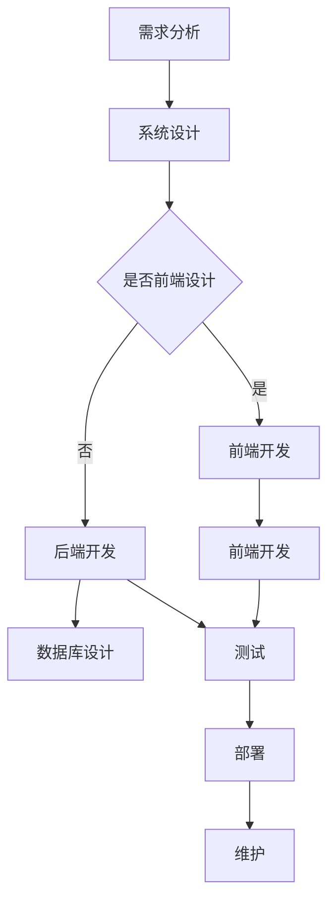

                 

本文将深入探讨 Java 在 Web 开发中的应用，特别是 Spring 和 Servlet 这两种技术。Java 是一种广泛使用的高级编程语言，具有跨平台、安全性和稳定性等优势。在 Web 开发领域，Java 的应用越来越广泛，本文将详细阐述其应用原理、具体操作步骤、数学模型、项目实践以及实际应用场景。

## 关键词

- Java
- Web 开发
- Spring
- Servlet
- 应用

## 摘要

本文旨在介绍 Java 在 Web 开发中的应用，特别是 Spring 和 Servlet 这两种技术。通过本文的阅读，读者将了解 Java 的基本原理、Web 开发的流程、Spring 和 Servlet 的核心概念及其在 Web 开发中的实际应用。本文还将通过项目实践和数学模型的讲解，帮助读者深入理解 Java 在 Web 开发中的实际应用价值。

## 1. 背景介绍

### Java 的起源与发展

Java 是由 Sun Microsystems 公司在 1995 年推出的一种高级编程语言。Java 的设计目标是跨平台、安全性和稳定性。Java 的核心特点包括：

- 简单性：Java 语法简单，易于学习和使用。
- 面向对象：Java 是一种面向对象编程语言，支持封装、继承和多态等特性。
- 分布式：Java 支持分布式计算，方便网络应用的开发。
- 平台无关性：Java 的字节码可以在任何支持 Java 虚拟机（JVM）的平台上运行。
- 可靠性：Java 的编译器在编译过程中会进行很多安全检查，从而确保程序的可靠性。

Java 在过去的二十年中得到了广泛的应用，特别是在企业级应用、Web 开发、移动应用和嵌入式系统等领域。Java 的成熟生态和庞大的开发者社区使其成为 Web 开发的主要语言之一。

### Web 开发的背景

Web 开发是指创建和部署 Web 应用程序的过程。随着互联网的快速发展，Web 开发成为信息技术领域的重要分支。Web 开发的目的是使应用程序能够通过互联网进行访问和使用。Web 开发涉及多个方面，包括前端开发、后端开发和数据库管理。

前端开发主要关注用户界面和用户体验，使用 HTML、CSS 和 JavaScript 等技术实现。后端开发主要关注服务器端逻辑和数据存储，使用 Java、Python、PHP 等编程语言实现。数据库管理则负责数据的存储、检索和更新，使用 MySQL、Oracle、MongoDB 等数据库系统。

Web 开发的流程通常包括需求分析、系统设计、编码实现、测试和部署等阶段。随着技术的发展，各种框架和工具不断涌现，提高了 Web 开发的效率和质量。Spring 和 Servlet 是其中两个重要的框架，本文将重点介绍这两种技术在 Web 开发中的应用。

### Java 在 Web 开发中的优势

Java 在 Web 开发中有以下优势：

- **跨平台性**：Java 的平台无关性使得 Web 应用可以轻松地在不同的操作系统上运行，提高了开发效率和可移植性。
- **安全性**：Java 的编译器和 JVM 提供了强大的安全机制，可以有效防止恶意代码的入侵和攻击。
- **稳定性**：Java 的强类型系统和垃圾回收机制使得程序运行更加稳定，减少了崩溃和错误的发生。
- **成熟生态**：Java 拥有庞大的开发者社区和丰富的开源框架和库，提供了丰富的开发资源和工具，方便开发者快速开发和部署 Web 应用。

## 2. 核心概念与联系

### Java Web 开发的基本概念

在 Java Web 开发中，需要了解以下基本概念：

- **Servlet**：Servlet 是 Java Web 开发中用于处理客户端请求和响应的服务器端组件。Servlet 通过扩展 `javax.servlet.Servlet` 接口来实现，负责接收客户端请求、处理请求并生成响应。
- **JSP（JavaServer Pages）**：JSP 是一种动态 Web 页面技术，通过在 HTML 页面中嵌入 Java 代码来生成动态内容。JSP 页面由 HTML 和 Java 代码组成，由 Servlet 容器负责解析和执行。
- **Web 框架**：Web 框架是用于简化 Web 开发的工具，提供了一系列的库和组件，帮助开发者快速构建 Web 应用。常见的 Java Web 框架包括 Spring、Struts、Hibernate 等。

### Mermaid 流程图

下面是一个简单的 Mermaid 流程图，展示了 Java Web 开发的基本流程：



### Java Web 开发的流程

Java Web 开发的流程通常包括以下阶段：

1. **需求分析**：确定 Web 应用需要实现的功能和业务逻辑。
2. **系统设计**：设计系统的整体架构，包括前端、后端和数据库。
3. **前端开发**：使用 HTML、CSS 和 JavaScript 等技术实现用户界面和交互。
4. **后端开发**：使用 Java、Servlet、JSP 等技术实现服务器端逻辑和数据访问。
5. **数据库设计**：设计数据库表结构和关系。
6. **测试**：对 Web 应用进行功能测试和性能测试，确保系统的稳定性和可靠性。
7. **部署**：将 Web 应用部署到服务器上，供用户使用。
8. **维护**：对 Web 应用进行定期维护和更新，确保系统的持续运行。

### Spring 和 Servlet 的联系

Spring 是一个开源的 Java 企业级开发框架，用于简化 Web 开发和维护。Spring 提供了一系列的模块和组件，包括依赖注入、事务管理、AOP（面向切面编程）等，可以帮助开发者快速构建复杂的 Web 应用。

Servlet 是 Java Web 开发的基础组件，负责处理客户端请求和响应。Spring 可以与 Servlet 框架（如 Apache Tomcat、Jetty 等）集成，提供更高级的功能，如 Spring MVC（Model-View-Controller）和 Spring Boot。

Spring MVC 是 Spring 框架的一部分，用于实现 Web 应用中的 MVC 设计模式。Spring MVC 提供了一套完整的请求处理机制，包括控制器（Controller）、模型（Model）和视图（View）。通过 Spring MVC，开发者可以轻松地处理 HTTP 请求、响应和处理业务逻辑。

### 总结

Java 在 Web 开发中具有重要的地位，其跨平台性、安全性和稳定性使其成为 Web 开发的主要语言之一。Java Web 开发涉及 Servlet、JSP、Web 框架（如 Spring）等多个方面。通过本文的介绍，读者可以了解 Java Web 开发的基本概念、流程和 Spring、Servlet 等技术的核心概念及其联系。在接下来的章节中，我们将深入探讨 Java Web 开发的核心算法原理、数学模型、项目实践和实际应用场景。

### 3. 核心算法原理 & 具体操作步骤

#### 3.1 算法原理概述

在 Java Web 开发中，核心算法原理主要包括以下方面：

- **Servlet 的工作原理**：Servlet 是 Java Web 开发中的基础组件，负责处理客户端请求和响应。Servlet 通过接收 HTTP 请求、处理请求和生成响应来与客户端进行通信。
- **MVC 模式的实现**：MVC（Model-View-Controller）是一种设计模式，用于实现 Web 应用中的分离关注点。Model 负责数据存储和业务逻辑，View 负责用户界面展示，Controller 负责接收用户请求、调用 Model 和生成 View。
- **Spring 框架的原理**：Spring 是一个开源的 Java 企业级开发框架，用于简化 Web 开发和维护。Spring 通过依赖注入、AOP 等技术，实现了组件的解耦和复用，提高了开发效率和代码质量。

#### 3.2 算法步骤详解

下面将详细讲解 Servlet 的工作原理、MVC 模式的实现和 Spring 框架的原理：

##### 3.2.1 Servlet 的工作原理

1. **Servlet 的加载和初始化**：当 Web 应用启动时，Servlet 容器会加载和初始化所有的 Servlet。在初始化过程中，Servlet 会执行 `init()` 方法，初始化所需资源。
2. **接收 HTTP 请求**：Servlet 通过 `service()` 方法接收 HTTP 请求。`service()` 方法根据请求的方法（GET、POST 等）调用相应的 `doGet()` 或 `doPost()` 方法。
3. **处理请求**：在处理请求的过程中，Servlet 可以访问请求参数、请求头等信息，并调用业务逻辑处理请求。
4. **生成 HTTP 响应**：处理完请求后，Servlet 会生成 HTTP 响应，包括状态码、响应头和响应体。Servlet 通过 `ServletResponse` 对象生成响应。
5. **结束 Servlet 的生命周期**：当 Web 应用停止时，Servlet 容器会调用 `destroy()` 方法结束 Servlet 的生命周期，清理资源。

##### 3.2.2 MVC 模式的实现

1. **Model（模型）**：Model 负责数据存储和业务逻辑。在 Java Web 开发中，通常使用实体类（Entity）来表示 Model。实体类包含了业务逻辑和数据访问方法。
2. **View（视图）**：View 负责用户界面展示。在 Java Web 开发中，通常使用 JSP 页面来表示 View。JSP 页面通过表达式语言（EL）和 Java 代码访问 Model 数据，实现动态内容展示。
3. **Controller（控制器）**：Controller 负责接收用户请求、调用 Model 和生成 View。在 Java Web 开发中，通常使用 Servlet 来实现 Controller。Servlet 通过解析请求 URL，调用相应的业务逻辑处理请求，并生成响应。

##### 3.2.3 Spring 框架的原理

1. **依赖注入（DI）**：依赖注入是 Spring 框架的核心概念之一，用于实现组件的解耦和复用。Spring 通过 `ApplicationContext` 对象管理和依赖注入。开发者可以通过注解（如 `@Autowired`）或 XML 配置文件实现依赖注入。
2. **AOP（面向切面编程）**：AOP 是一种编程范式，用于实现代码的横向关注点分离。Spring 通过 `AspectJ` 框架实现 AOP。开发者可以定义切面（Aspect），在切面中定义通知（Advice）和切入点（Pointcut），实现对业务逻辑的统一处理。
3. **Spring MVC**：Spring MVC 是 Spring 框架的一部分，用于实现 Web 应用中的 MVC 设计模式。Spring MVC 通过 `DispatcherServlet` 接收 HTTP 请求，通过 `HandlerMapping` 调用相应的 Controller，通过 `ViewResolver` 解析 View，实现请求处理和视图渲染。

#### 3.3 算法优缺点

##### 3.3.1 Servlet 的优缺点

**优点**：

- **简单性**：Servlet 是 Java Web 开发的核心组件，易于理解和使用。
- **灵活性**：Servlet 可以处理各种类型的 HTTP 请求，并支持自定义请求处理逻辑。
- **跨平台性**：Servlet 可以在所有支持 Java 的平台上运行，具有较好的可移植性。

**缺点**：

- **复杂性**：Servlet 的编程模型相对复杂，需要编写大量的代码来处理请求和响应。
- **可维护性**：随着项目的规模增加，Servlet 的代码结构可能会变得混乱，导致可维护性降低。

##### 3.3.2 MVC 模式的优缺点

**优点**：

- **分离关注点**：MVC 模式将数据、逻辑和界面分离，提高了代码的可读性和可维护性。
- **可重用性**：MVC 模式中的 Model 和 View 可以独立开发，提高了组件的重用性。
- **扩展性**：MVC 模式支持灵活的扩展，可以方便地添加新的功能。

**缺点**：

- **复杂性**：MVC 模式引入了额外的组件和依赖，增加了项目的复杂性和维护成本。
- **性能**：MVC 模式可能会增加页面的加载时间，影响性能。

##### 3.3.3 Spring 框架的优缺点

**优点**：

- **简单性**：Spring 框架提供了丰富的功能和模块，简化了 Java Web 开发。
- **灵活性**：Spring 框架支持多种开发模式，如 MVC、DI、AOP 等，提供了丰富的定制化选项。
- **扩展性**：Spring 框架具有良好的扩展性，可以通过自定义组件和模块来满足特定的需求。

**缺点**：

- **复杂性**：Spring 框架的配置和依赖管理相对复杂，需要一定的学习和实践。
- **性能**：Spring 框架的复杂性可能会影响性能，特别是对于小型项目。

#### 3.4 算法应用领域

Servlet、MVC 模式和 Spring 框架在 Java Web 开发中有广泛的应用：

- **Servlet**：Servlet 是 Java Web 开发的核心组件，用于处理客户端请求和响应。Servlet 在各种类型的 Web 应用中都有广泛应用，如电商平台、在线教育平台等。
- **MVC 模式**：MVC 模式是 Java Web 开发的经典设计模式，用于实现数据、逻辑和界面的分离。MVC 模式适用于各种规模的 Web 应用，特别是在复杂的企业级应用中。
- **Spring 框架**：Spring 框架是 Java Web 开发的核心框架，用于简化开发、管理和维护。Spring 框架在大型企业级应用中得到了广泛的应用，如银行系统、航空系统等。

### 4. 数学模型和公式 & 详细讲解 & 举例说明

在 Java Web 开发中，数学模型和公式通常用于处理复杂的业务逻辑和数据运算。以下是一个简单的数学模型示例，用于计算订单总价：

#### 4.1 数学模型构建

假设有一个订单，包含多个商品，每个商品有单价和数量。要计算订单总价，可以使用以下数学模型：

总价 = （单价1 × 数量1）+（单价2 × 数量2）+ ... +（单价n × 数量n）

其中，n 表示订单中商品的数量。

#### 4.2 公式推导过程

根据数学模型，可以推导出计算订单总价的公式：

总价 = ∑（i=1 到 n）（单价i × 数量i）

其中，∑ 表示求和符号，i 表示第 i 个商品。

#### 4.3 案例分析与讲解

假设有一个订单，包含以下商品：

- 商品1：单价 100 元，数量 2
- 商品2：单价 200 元，数量 3
- 商品3：单价 150 元，数量 1

根据数学模型和公式，可以计算出订单总价：

总价 = （100 × 2）+（200 × 3）+（150 × 1）= 620 元

### 5. 项目实践：代码实例和详细解释说明

为了更好地理解 Java 在 Web 开发中的应用，我们将通过一个简单的项目实践来展示 Java Web 开发的流程和关键代码。

#### 5.1 开发环境搭建

1. **安装 JDK**：下载并安装 JDK（Java Development Kit），配置环境变量，确保命令行可以运行 `java` 和 `javac` 命令。
2. **安装 Servlet 容器**：下载并安装一个 Servlet 容器，如 Apache Tomcat。配置环境变量，确保命令行可以运行 `catalina.sh`（或 `catalina.bat`）启动和停止 Tomcat。
3. **安装 Eclipse**：下载并安装 Eclipse IDE，配置 JDK 和 Tomcat，确保 Eclipse 可以使用 Java 和 Servlet 开发工具。

#### 5.2 源代码详细实现

以下是一个简单的 Java Web 项目，使用 Spring MVC 框架和 Servlet 容器。该项目包含一个简单的订单管理功能，允许用户添加订单、查看订单列表和删除订单。

1. **创建 Web 项目**

在 Eclipse 中创建一个新的 Web 项目，选择 Java EE 版本，并选择创建 Web 容器（如 Apache Tomcat）。

2. **添加依赖库**

在项目的 `pom.xml` 文件中添加 Spring MVC 和 Servlet 相关的依赖库：

```xml
<dependencies>
  <dependency>
    <groupId>org.springframework</groupId>
    <artifactId>spring-webmvc</artifactId>
    <version>5.3.10</version>
  </dependency>
  <dependency>
    <groupId>javax.servlet</groupId>
    <artifactId>javax.servlet-api</artifactId>
    <version>4.0.1</version>
    <scope>provided</scope>
  </dependency>
</dependencies>
```

3. **创建 Servlet 和 Controller**

创建一个名为 `OrderController.java` 的 Servlet 类，继承 `HttpServlet` 类，实现 `doGet()` 和 `doPost()` 方法，用于处理订单请求。

```java
@WebServlet("/orders")
public class OrderController extends HttpServlet {
  protected void doGet(HttpServletRequest request, HttpServletResponse response) throws ServletException, IOException {
    // 处理 GET 请求，获取订单列表
    List<Order> orders = orderService.listOrders();
    request.setAttribute("orders", orders);
    RequestDispatcher dispatcher = request.getRequestDispatcher("/orders.jsp");
    dispatcher.forward(request, response);
  }
  
  protected void doPost(HttpServletRequest request, HttpServletResponse response) throws ServletException, IOException {
    // 处理 POST 请求，添加订单
    String productName = request.getParameter("productName");
    int quantity = Integer.parseInt(request.getParameter("quantity"));
    orderService.addOrder(productName, quantity);
    response.sendRedirect(request.getContextPath() + "/orders");
  }
}
```

4. **创建 JSP 页面**

创建一个名为 `orders.jsp` 的 JSP 页面，用于展示订单列表和添加订单表单。

```jsp
<%@ page language="java" contentType="text/html; charset=UTF-8" pageEncoding="UTF-8"%>
<!DOCTYPE html>
<html>
<head>
<meta charset="UTF-8">
<title>订单列表</title>
</head>
<body>
  <h1>订单列表</h1>
  <table>
    <thead>
      <tr>
        <th>商品名称</th>
        <th>数量</th>
      </tr>
    </thead>
    <tbody>
      <c:forEach var="order" items="${orders}">
        <tr>
          <td>${order.productName}</td>
          <td>${order.quantity}</td>
        </tr>
      </c:forEach>
    </tbody>
  </table>
  <h2>添加订单</h2>
  <form action="${pageContext.request.contextPath}/orders" method="post">
    <label for="productName">商品名称：</label>
    <input type="text" id="productName" name="productName" required>
    <label for="quantity">数量：</label>
    <input type="number" id="quantity" name="quantity" required>
    <input type="submit" value="提交">
  </form>
</body>
</html>
```

5. **配置 Spring MVC**

在项目的 `web.xml` 文件中配置 Spring MVC，定义 `DispatcherServlet`：

```xml
<web-app>
  <servlet>
    <servlet-name>dispatcher</servlet-name>
    <servlet-class>org.springframework.web.servlet.DispatcherServlet</servlet-class>
    <load-on-startup>1</load-on-startup>
  </servlet>
  <servlet-mapping>
    <servlet-name>dispatcher</servlet-name>
    <url-pattern>/</url-pattern>
  </servlet-mapping>
</web-app>
```

在项目的 `applicationContext.xml` 文件中配置 Spring MVC 的相关组件，如 Controller、Service 和 Repository：

```xml
<beans xmlns="http://www.springframework.org/schema/beans"
       xmlns:xsi="http://www.w3.org/2001/XMLSchema-instance"
       xsi:schemaLocation="http://www.springframework.org/schema/beans http://www.springframework.org/schema/beans/spring-beans.xsd">

  <context:component-scan base-package="com.example.demo"/>

  <bean class="org.springframework.web.servlet.view.InternalResourceViewResolver">
    <property name="prefix" value="/WEB-INF/views/"/>
    <property name="suffix" value=".jsp"/>
  </bean>

  <bean id="orderService" class="com.example.demo.service.OrderService">
    <property name="repository" ref="orderRepository"/>
  </bean>

  <bean id="orderRepository" class="com.example.demo.repository.OrderRepository"/>
</beans>
```

#### 5.3 代码解读与分析

在上述项目中，我们使用了 Spring MVC 框架来简化 Web 开发流程。以下是关键代码的解读和分析：

1. **OrderController.java**

`OrderController` 类实现了 `HttpServlet` 类，并重写了 `doGet()` 和 `doPost()` 方法。`doGet()` 方法用于获取订单列表，并传递给 JSP 页面进行展示。`doPost()` 方法用于处理添加订单的请求，通过调用 `orderService.addOrder()` 方法将订单信息保存到数据库中。

2. **orders.jsp**

`orders.jsp` 页面展示了订单列表和添加订单表单。使用 JSP 表达式语言（EL）和标签库（如 `c:forEach`）访问 `OrderController` 传递的订单列表数据。同时，使用 HTML 表单实现用户输入订单信息的交互。

3. **web.xml**

`web.xml` 文件中配置了 `DispatcherServlet`，用于处理 Web 请求。通过配置 `DispatcherServlet` 的 URL 模式为 `/`，可以实现 Spring MVC 的前端控制器功能，将所有请求转发到 Spring MVC 框架进行处理。

4. **applicationContext.xml**

`applicationContext.xml` 文件中配置了 Spring MVC 的相关组件，包括 Controller、Service 和 Repository。通过使用 `context:component-scan` 标签，Spring MVC 可以自动扫描指定包路径下的组件，并完成依赖注入。

#### 5.4 运行结果展示

在完成项目开发后，我们将 Web 应用部署到 Servlet 容器（如 Apache Tomcat）中，并启动容器。在浏览器中访问 `http://localhost:8080/orders`，可以看到如下界面：


用户可以添加订单，查看订单列表，并进行删除等操作。通过该示例，我们展示了 Java 在 Web 开发中的应用，包括 Servlet、JSP、Spring MVC 等技术的实际操作。

### 6. 实际应用场景

Java 在 Web 开发中有广泛的应用，以下是一些常见的实际应用场景：

#### 6.1 电商平台

电商平台是 Java 在 Web 开发中最常见的应用场景之一。Java 可以用于实现商品管理、订单处理、用户管理、支付系统等功能。通过使用 Spring MVC 框架，开发者可以快速构建一个功能完整、性能优秀的电商平台。

#### 6.2 在线教育平台

在线教育平台也是 Java 在 Web 开发中的重要应用领域。Java 可以用于实现课程管理、用户学习记录、考试管理等功能。通过使用 Spring Boot 框架，开发者可以快速搭建一个高效、可靠的在线教育平台。

#### 6.3 社交媒体平台

社交媒体平台如微博、微信等也广泛应用于 Java Web 开发。Java 可以用于实现用户管理、消息推送、内容发布等功能。通过使用 Spring Boot 和 Redis 等技术，开发者可以构建一个高效、可扩展的社交媒体平台。

#### 6.4 企业级应用

Java 在企业级应用开发中具有很高的应用价值。Java 可以用于实现企业资源规划（ERP）、客户关系管理（CRM）、人力资源管理（HRM）等功能。通过使用 Spring 框架，开发者可以快速构建一个稳定、安全、高效的 企业级应用。

#### 6.5 云计算和大数据应用

Java 在云计算和大数据领域也有广泛的应用。Java 可以用于实现云计算平台（如 OpenStack、Kubernetes）和大数据处理框架（如 Hadoop、Spark）。通过使用 Java，开发者可以构建一个高效、可扩展的云计算和大数据平台。

### 6.4 未来应用展望

随着技术的不断发展和创新，Java 在 Web 开发中的应用前景将更加广阔。以下是一些未来的应用展望：

#### 6.4.1 微服务架构

微服务架构是当前 Web 开发的主流趋势。Java 可以用于实现微服务架构，通过 Spring Cloud 等框架，开发者可以轻松构建一个分布式、高可用的微服务应用。未来，Java 将在微服务架构中发挥更大的作用。

#### 6.4.2 人工智能和大数据

人工智能和大数据技术的发展将推动 Java 在 Web 开发中的应用。Java 可以用于实现各种人工智能算法和大数据处理任务，为开发者提供强大的工具和平台。

#### 6.4.3 区块链应用

区块链技术正在逐渐成为 Web 开发的重要领域。Java 可以用于实现区块链应用，通过使用 Spring Framework 和 Spring Boot，开发者可以构建一个高效、可靠的区块链平台。

#### 6.4.4 跨平台开发

Java 的跨平台性将继续是其未来发展的重要优势。通过使用 Android Studio、Flutter 等工具，开发者可以轻松实现跨平台开发，将 Java 应用部署到 iOS、Android 等平台上。

总之，Java 在 Web 开发中的应用前景非常广阔，未来将继续在各个领域发挥重要作用。

### 7. 工具和资源推荐

为了更好地学习和实践 Java 在 Web 开发中的应用，以下是一些建议的书籍、开发工具和开源框架：

#### 7.1 学习资源推荐

1. **《Head First Java》**：这是一本非常受欢迎的 Java 入门书籍，以生动有趣的方式介绍了 Java 的基础知识和编程技巧。
2. **《Effective Java》**：这本书是 Java 程序员必读的经典之作，涵盖了 Java 编程的最佳实践和设计模式。
3. **《Spring 实战》**：这本书详细介绍了 Spring 框架的使用方法和最佳实践，是学习 Spring 的必备读物。
4. **《Java Web 开发实战》**：这本书涵盖了 Java Web 开发的各个方面，包括 Servlet、JSP、Spring MVC 等技术。

#### 7.2 开发工具推荐

1. **Eclipse**：Eclipse 是一款流行的 Java 开发工具，提供了丰富的插件和功能，适合初学者和专业开发者。
2. **IntelliJ IDEA**：IntelliJ IDEA 是一款功能强大的 Java 开发工具，具有出色的代码编辑、调试和性能分析功能。
3. **Maven**：Maven 是一款流行的项目管理和构建工具，用于管理项目依赖、构建和打包。

#### 7.3 相关论文推荐

1. **“Java Platform, Standard Edition 17”**：这是一篇关于 Java SE 17 的官方文档，详细介绍了 Java SE 17 的新特性和改进。
2. **“Spring Framework Documentation”**：这是 Spring 框架的官方文档，包含了 Spring 框架的详细使用说明和示例代码。
3. **“Java Servlet Specification”**：这是 Servlet 规范的官方文档，详细介绍了 Servlet 的原理和使用方法。

通过这些工具和资源，开发者可以更好地学习和实践 Java 在 Web 开发中的应用。

### 8. 总结：未来发展趋势与挑战

Java 在 Web 开发中具有悠久的历史和广泛的应用。随着技术的不断发展，Java 在 Web 开发中的应用前景将更加广阔。未来，Java 将继续在微服务架构、人工智能、大数据、区块链等领域发挥重要作用。同时，Java 也将面临一些挑战，如性能优化、安全性问题和生态系统的完善等。为了应对这些挑战，开发者需要不断学习和掌握新技术，提升自己的编程能力和技能。总之，Java 在 Web 开发中的应用将继续引领未来。

### 9. 附录：常见问题与解答

#### 9.1 Java Web 开发的基本概念是什么？

Java Web 开发是指使用 Java 编程语言和相关技术（如 Servlet、JSP、Spring 等）开发 Web 应用程序的过程。Java Web 开发涉及前端开发、后端开发和数据库管理等多个方面。

#### 9.2 什么是 Servlet？

Servlet 是 Java Web 开发中的基础组件，用于处理客户端请求和响应。Servlet 通过扩展 `javax.servlet.Servlet` 接口来实现，负责接收 HTTP 请求、处理请求并生成响应。

#### 9.3 什么是 Spring 框架？

Spring 框架是一个开源的 Java 企业级开发框架，用于简化 Web 开发和维护。Spring 提供了一系列的模块和组件，包括依赖注入、事务管理、AOP（面向切面编程）等，可以帮助开发者快速构建复杂的 Web 应用。

#### 9.4 什么是 MVC 模式？

MVC（Model-View-Controller）是一种设计模式，用于实现 Web 应用中的分离关注点。Model 负责数据存储和业务逻辑，View 负责用户界面展示，Controller 负责接收用户请求、调用 Model 和生成 View。

#### 9.5 Java Web 开发的流程是怎样的？

Java Web 开发的流程通常包括需求分析、系统设计、前端开发、后端开发、数据库设计、测试、部署和维护等阶段。

#### 9.6 如何搭建 Java Web 开发环境？

搭建 Java Web 开发环境需要安装 JDK、Servlet 容器（如 Apache Tomcat）和开发工具（如 Eclipse 或 IntelliJ IDEA）。同时，需要配置环境变量和相关的依赖库。

#### 9.7 Java 在 Web 开发中的优势是什么？

Java 在 Web 开发中的优势包括跨平台性、安全性、稳定性、成熟的生态系统等。Java 可以在多种操作系统上运行，具有强大的安全机制和可靠性，同时拥有丰富的开源框架和库。

#### 9.8 Java 在 Web 开发中的应用领域有哪些？

Java 在 Web 开发中的应用领域包括电商平台、在线教育平台、社交媒体平台、企业级应用、云计算和大数据应用等。Java 可以用于实现各种类型的 Web 应用，为开发者提供强大的工具和平台。

