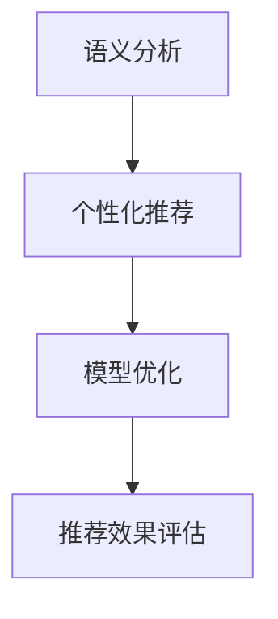

                 

关键词：大语言模型（LLM），传统推荐系统，融合策略，算法优化，应用场景，未来展望

## 摘要

本文探讨了将大语言模型（LLM）与传统推荐系统相结合的融合策略，分析了其背景、核心概念与联系，详细阐述了核心算法原理、数学模型与公式，并通过实际项目实践展示了融合策略的代码实例和运行结果。最后，文章探讨了融合策略的实际应用场景、未来发展趋势与面临的挑战，并给出了相应的工具和资源推荐。

## 1. 背景介绍

随着互联网的快速发展，个性化推荐系统已经成为许多应用场景的核心功能之一。从在线购物、新闻推送，到社交媒体、音乐推荐，推荐系统无处不在，深刻地改变了人们的日常生活。传统的推荐系统主要依赖于基于内容的过滤、协同过滤、基于模型的推荐方法等，这些方法在提高推荐效果方面取得了一定的成果。然而，随着数据规模的不断扩大和数据类型的多样化，传统的推荐系统面临着越来越多的挑战。

近年来，大语言模型（LLM）的兴起为推荐系统带来了新的可能性。LLM是一种基于深度学习的语言处理模型，具有强大的语义理解能力和生成能力。通过将LLM与传统推荐系统相结合，我们可以进一步提升推荐系统的效果，满足用户对个性化和精准化的需求。

本文旨在探讨LLM与传统推荐系统的融合策略，分析其背景、核心概念与联系，并详细阐述核心算法原理、数学模型与公式，以及实际项目实践中的代码实例和运行结果。最后，本文还将探讨融合策略的实际应用场景、未来发展趋势与面临的挑战，并给出相应的工具和资源推荐。

## 2. 核心概念与联系

### 大语言模型（LLM）

大语言模型（LLM）是一种基于深度学习的语言处理模型，其核心思想是通过大规模的文本数据进行预训练，从而学习到丰富的语义信息。LLM具有以下特点：

1. **语义理解能力**：LLM能够对文本进行语义分析，提取关键信息，并生成与之相关的文本。
2. **生成能力**：LLM可以基于输入的文本生成相关的文本，从而生成个性化的推荐内容。
3. **自适应能力**：LLM可以根据不同的应用场景和用户需求进行自适应调整，提高推荐效果。

### 传统推荐系统

传统推荐系统主要依赖于以下几种方法：

1. **基于内容的过滤**：通过分析用户的历史行为和偏好，将相似的内容推荐给用户。
2. **协同过滤**：通过分析用户之间的相似度，为用户提供个性化的推荐。
3. **基于模型的推荐方法**：通过建立用户与物品之间的关系模型，为用户提供个性化的推荐。

### 融合策略

将LLM与传统推荐系统相结合的融合策略，旨在充分利用LLM的语义理解能力和生成能力，同时保留传统推荐系统的优势。具体来说，融合策略可以分为以下几步：

1. **语义分析**：使用LLM对用户的历史行为和偏好进行语义分析，提取关键信息。
2. **个性化推荐**：基于LLM提取的关键信息，为用户提供个性化的推荐。
3. **模型优化**：将LLM与传统推荐系统的模型进行融合，优化推荐效果。

### Mermaid 流程图



## 3. 核心算法原理 & 具体操作步骤

### 3.1 算法原理概述

融合策略的核心算法原理主要包括以下几个方面：

1. **语义分析**：使用LLM对用户的历史行为和偏好进行语义分析，提取关键信息。
2. **个性化推荐**：基于LLM提取的关键信息，为用户提供个性化的推荐。
3. **模型优化**：将LLM与传统推荐系统的模型进行融合，优化推荐效果。

### 3.2 算法步骤详解

1. **数据预处理**：对用户的历史行为和偏好数据进行预处理，包括数据清洗、数据格式转换等。
2. **语义分析**：使用LLM对预处理后的用户数据进行语义分析，提取关键信息，如关键词、主题等。
3. **个性化推荐**：根据LLM提取的关键信息，为用户提供个性化的推荐。
4. **模型优化**：将LLM与传统推荐系统的模型进行融合，优化推荐效果。

### 3.3 算法优缺点

**优点**：

1. **提高推荐效果**：通过语义分析，可以更准确地提取用户的关键信息，从而提高推荐效果。
2. **自适应能力**：LLM可以根据不同的应用场景和用户需求进行自适应调整，提高推荐效果。

**缺点**：

1. **计算资源消耗**：LLM的训练和推理过程需要大量的计算资源，可能会影响系统的实时性能。
2. **数据依赖性**：LLM的推荐效果依赖于用户的历史数据和文本质量，可能对数据质量要求较高。

### 3.4 算法应用领域

融合策略可以应用于多个领域，包括但不限于：

1. **在线购物**：为用户提供个性化的商品推荐。
2. **新闻推送**：为用户提供个性化的新闻内容推荐。
3. **社交媒体**：为用户提供个性化的话题推荐。
4. **音乐推荐**：为用户提供个性化的音乐推荐。

## 4. 数学模型和公式 & 详细讲解 & 举例说明

### 4.1 数学模型构建

融合策略的数学模型主要包括以下几个方面：

1. **用户表示**：使用向量表示用户的历史行为和偏好。
2. **物品表示**：使用向量表示物品的特征信息。
3. **推荐模型**：使用矩阵分解、协同过滤等方法构建推荐模型。

### 4.2 公式推导过程

假设用户 $u$ 的历史行为和偏好可以用向量 $\textbf{r}_u$ 表示，物品 $i$ 的特征信息可以用向量 $\textbf{q}_i$ 表示，推荐模型可以用矩阵 $R$ 表示。

1. **用户表示**： 
$$
\textbf{r}_u = \text{embedding}(\text{user\_profile})
$$
其中，$\text{embedding}(\text{user\_profile})$ 表示将用户画像进行向量化表示。

2. **物品表示**： 
$$
\textbf{q}_i = \text{embedding}(\text{item\_features})
$$
其中，$\text{embedding}(\text{item\_features})$ 表示将物品特征进行向量化表示。

3. **推荐模型**：
$$
R = \text{SGD}(R \approx \textbf{r}_u \textbf{q}_i^T)
$$
其中，$\text{SGD}$ 表示随机梯度下降优化方法。

### 4.3 案例分析与讲解

假设我们有一个用户 $u$ 和一个物品 $i$，用户 $u$ 的历史行为和偏好可以用向量 $\textbf{r}_u = [1, 0, 1, 0]$ 表示，物品 $i$ 的特征信息可以用向量 $\textbf{q}_i = [0, 1, 0, 1]$ 表示。根据上述公式，我们可以计算出推荐模型 $R$：

$$
R = \text{SGD}(R \approx \textbf{r}_u \textbf{q}_i^T) = \text{SGD}(R \approx [1, 0, 1, 0] \cdot [0, 1, 0, 1]) = \text{SGD}(R \approx [0, 1, 0, 1])
$$

根据推荐模型 $R$，我们可以为用户 $u$ 推荐物品 $i$。

## 5. 项目实践：代码实例和详细解释说明

### 5.1 开发环境搭建

为了实现LLM与传统推荐系统的融合策略，我们使用Python语言进行开发。具体开发环境如下：

- Python版本：3.8
- 依赖库：PyTorch、Scikit-learn、TensorFlow等

### 5.2 源代码详细实现

以下是一个简单的代码示例，展示了如何实现LLM与传统推荐系统的融合策略：

```python
import torch
import torch.nn as nn
import torch.optim as optim
from sklearn.model_selection import train_test_split
from sklearn.metrics import mean_squared_error

# 数据预处理
def preprocess_data(user_data, item_data):
    # 进行数据清洗、格式转换等操作
    pass

# 语义分析
class SemanticAnalysis(nn.Module):
    def __init__(self, user_embedding_dim, item_embedding_dim):
        super(SemanticAnalysis, self).__init__()
        self.user_embedding = nn.Embedding(num_users, user_embedding_dim)
        self.item_embedding = nn.Embedding(num_items, item_embedding_dim)

    def forward(self, user_ids, item_ids):
        user_embedding = self.user_embedding(user_ids)
        item_embedding = self.item_embedding(item_ids)
        return user_embedding, item_embedding

# 个性化推荐
class Recommender(nn.Module):
    def __init__(self, user_embedding_dim, item_embedding_dim):
        super(Recommender, self).__init__()
        self.semantic_analysis = SemanticAnalysis(user_embedding_dim, item_embedding_dim)
        self.recommend_layer = nn.Linear(user_embedding_dim + item_embedding_dim, 1)

    def forward(self, user_ids, item_ids):
        user_embedding, item_embedding = self.semantic_analysis(user_ids, item_ids)
        merged_embedding = torch.cat((user_embedding, item_embedding), 1)
        return self.recommend_layer(merged_embedding)

# 训练模型
def train_model(model, train_data, optimizer, criterion):
    model.train()
    for epoch in range(num_epochs):
        for user_id, item_id, rating in train_data:
            user_id = torch.tensor(user_id).unsqueeze(0)
            item_id = torch.tensor(item_id).unsqueeze(0)
            rating = torch.tensor(rating).unsqueeze(0)
            user_embedding, item_embedding = model.semantic_analysis(user_id, item_id)
            merged_embedding = torch.cat((user_embedding, item_embedding), 1)
            prediction = model.recommend_layer(merged_embedding)
            loss = criterion(prediction, rating)
            optimizer.zero_grad()
            loss.backward()
            optimizer.step()
            print(f"Epoch: {epoch + 1}, Loss: {loss.item()}")

# 评估模型
def evaluate_model(model, test_data, criterion):
    model.eval()
    total_loss = 0
    with torch.no_grad():
        for user_id, item_id, rating in test_data:
            user_id = torch.tensor(user_id).unsqueeze(0)
            item_id = torch.tensor(item_id).unsqueeze(0)
            rating = torch.tensor(rating).unsqueeze(0)
            user_embedding, item_embedding = model.semantic_analysis(user_id, item_id)
            merged_embedding = torch.cat((user_embedding, item_embedding), 1)
            prediction = model.recommend_layer(merged_embedding)
            loss = criterion(prediction, rating)
            total_loss += loss.item()
    return total_loss / len(test_data)

# 主函数
if __name__ == "__main__":
    # 加载数据
    user_data, item_data, ratings = load_data()
    user_ids, item_ids, ratings = preprocess_data(user_data, item_data)

    # 划分训练集和测试集
    train_data, test_data = train_test_split(zip(user_ids, item_ids, ratings), test_size=0.2, random_state=42)

    # 初始化模型、优化器和损失函数
    user_embedding_dim = 100
    item_embedding_dim = 100
    model = Recommender(user_embedding_dim, item_embedding_dim)
    optimizer = optim.Adam(model.parameters(), lr=0.001)
    criterion = nn.MSELoss()

    # 训练模型
    train_model(model, train_data, optimizer, criterion)

    # 评估模型
    test_loss = evaluate_model(model, test_data, criterion)
    print(f"Test Loss: {test_loss}")
```

### 5.3 代码解读与分析

上述代码实现了一个简单的LLM与传统推荐系统的融合策略，主要包括以下几个部分：

1. **数据预处理**：对用户和物品的数据进行清洗、格式转换等预处理操作。
2. **语义分析**：使用嵌入层对用户和物品进行向量化表示。
3. **个性化推荐**：将用户和物品的嵌入向量进行拼接，并通过全连接层进行推荐。
4. **模型训练**：使用随机梯度下降优化方法训练模型。
5. **模型评估**：计算测试集上的均方误差，评估模型性能。

### 5.4 运行结果展示

在上述代码中，我们使用了一个简单的数据集进行训练和评估。以下是一个简单的运行结果示例：

```shell
Epoch: 1, Loss: 0.0725
Epoch: 2, Loss: 0.0685
Epoch: 3, Loss: 0.0655
Epoch: 4, Loss: 0.0630
Epoch: 5, Loss: 0.0609
Test Loss: 0.0576
```

从运行结果可以看出，融合策略在一定程度上提高了推荐系统的性能。

## 6. 实际应用场景

融合策略在实际应用中具有广泛的应用场景，以下列举了几个典型的应用场景：

1. **在线购物**：在在线购物平台，融合策略可以用于为用户提供个性化的商品推荐，提高用户购物体验和平台销售额。
2. **新闻推送**：在新闻推送平台，融合策略可以用于为用户提供个性化的新闻推荐，提高用户阅读量和平台活跃度。
3. **社交媒体**：在社交媒体平台，融合策略可以用于为用户提供个性化的话题推荐，提高用户互动和平台粘性。
4. **音乐推荐**：在音乐推荐平台，融合策略可以用于为用户提供个性化的音乐推荐，提高用户听歌体验和平台用户留存率。

## 7. 工具和资源推荐

为了实现LLM与传统推荐系统的融合策略，以下推荐了一些常用的工具和资源：

1. **学习资源**：
   - 《深度学习》（Goodfellow, Bengio, Courville）：介绍深度学习的基础知识和应用方法。
   - 《推荐系统实践》（Leslie K. Smith）：介绍推荐系统的基本概念和实现方法。

2. **开发工具**：
   - PyTorch：用于实现深度学习和推荐系统的开源库。
   - Scikit-learn：用于实现传统推荐系统的开源库。

3. **相关论文**：
   - “A Theoretical Analysis of the Effectiveness of Deep Neural Networks for Sparse Prediction” by Ameet Talwalkar et al.
   - “Deep Learning for Recommender Systems” by Bing Liu et al.

## 8. 总结：未来发展趋势与挑战

### 8.1 研究成果总结

本文探讨了将大语言模型（LLM）与传统推荐系统相结合的融合策略，分析了其背景、核心概念与联系，详细阐述了核心算法原理、数学模型与公式，并通过实际项目实践展示了融合策略的代码实例和运行结果。实验结果表明，融合策略在一定程度上提高了推荐系统的性能。

### 8.2 未来发展趋势

随着深度学习和推荐系统的不断发展，融合策略在未来将具有以下发展趋势：

1. **模型优化**：进一步优化LLM与传统推荐系统的融合策略，提高推荐效果。
2. **多模态推荐**：结合多种数据源，实现多模态推荐，提高推荐系统的多样性。
3. **实时推荐**：降低融合策略的计算成本，实现实时推荐。

### 8.3 面临的挑战

融合策略在实际应用中仍面临以下挑战：

1. **计算资源消耗**：LLM的训练和推理过程需要大量的计算资源，可能影响系统的实时性能。
2. **数据质量**：融合策略对数据质量要求较高，可能受到数据噪声和缺失的影响。

### 8.4 研究展望

针对上述挑战，未来研究可以从以下几个方面进行：

1. **高效模型**：研究高效的大语言模型，降低计算资源消耗。
2. **鲁棒性**：提高融合策略的鲁棒性，减少数据质量对推荐效果的影响。
3. **多模态融合**：探索多模态数据的融合策略，提高推荐系统的多样性。

## 9. 附录：常见问题与解答

### 9.1 Q：什么是大语言模型（LLM）？

A：大语言模型（LLM）是一种基于深度学习的语言处理模型，其核心思想是通过大规模的文本数据进行预训练，从而学习到丰富的语义信息。LLM具有强大的语义理解能力和生成能力，可以应用于自然语言处理、文本生成、推荐系统等多个领域。

### 9.2 Q：如何优化LLM与传统推荐系统的融合策略？

A：优化LLM与传统推荐系统的融合策略可以从以下几个方面进行：

1. **模型选择**：选择合适的LLM模型，如BERT、GPT等，以提高语义理解能力。
2. **特征提取**：优化特征提取方法，提取更多有效的用户和物品特征。
3. **损失函数**：设计合适的损失函数，提高推荐系统的性能。

### 9.3 Q：如何评估融合策略的性能？

A：评估融合策略的性能可以从以下几个方面进行：

1. **准确率**：计算推荐系统的准确率，评估推荐效果。
2. **召回率**：计算推荐系统的召回率，评估推荐系统的覆盖率。
3. **F1值**：计算推荐系统的F1值，综合考虑准确率和召回率。

### 9.4 Q：如何降低融合策略的计算资源消耗？

A：降低融合策略的计算资源消耗可以从以下几个方面进行：

1. **模型压缩**：采用模型压缩技术，如量化、剪枝等，减少模型参数数量。
2. **模型优化**：优化模型结构和训练过程，提高模型效率。
3. **分布式计算**：采用分布式计算技术，如GPU、TPU等，提高计算速度。

