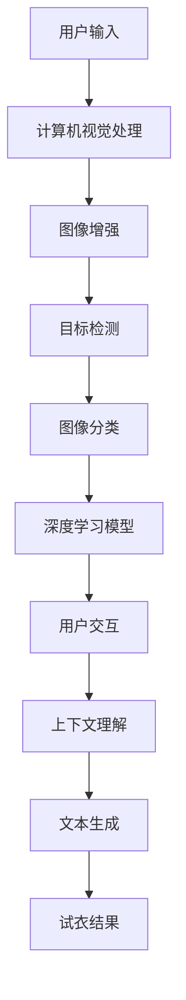

                 

关键词：LLM、虚拟试衣、在线购物体验、人工智能、计算机视觉、深度学习

摘要：随着人工智能技术的不断发展，虚拟试衣已成为在线购物领域的一项热门应用。本文将介绍如何利用大型语言模型（LLM）和计算机视觉技术，实现高效、精确的虚拟试衣系统，从而提升消费者的购物体验。

## 1. 背景介绍

在过去的几年里，电子商务行业经历了前所未有的发展。根据Statista的数据，全球电子商务市场规模在2021年达到了4.89万亿美元，预计到2026年将达到6.38万亿美元。然而，尽管在线购物提供了便利，但消费者在购买服装时仍然面临一些挑战，如尺码不合适、颜色差异、面料不适等。

为了解决这些问题，虚拟试衣技术逐渐崭露头角。虚拟试衣系统通过计算机视觉和人工智能技术，让消费者能够在家中通过摄像头或虚拟现实设备试穿衣服，从而提高购物的满意度和成功率。近年来，随着深度学习和自然语言处理技术的发展，虚拟试衣系统变得更加智能化、个性化。

本文将探讨如何利用大型语言模型（LLM）和计算机视觉技术，构建一个高效的虚拟试衣系统。我们将介绍核心概念、算法原理、数学模型以及实际应用场景，并探讨这一技术的未来发展趋势与挑战。

## 2. 核心概念与联系

### 2.1 大型语言模型（LLM）

大型语言模型（LLM）是一种基于深度学习技术的自然语言处理模型，能够理解和生成人类语言。LLM的训练数据通常包含数十亿甚至数万亿个单词和句子，这使得模型具有很高的语言理解和生成能力。

在虚拟试衣系统中，LLM可以用于以下几个关键方面：

1. **用户交互**：LLM可以帮助系统与用户进行自然语言对话，提供购物建议、回答用户问题等，从而提升用户体验。
2. **上下文理解**：LLM可以捕捉用户的上下文信息，如用户偏好、购物历史等，为虚拟试衣提供个性化建议。
3. **文本生成**：LLM可以生成描述虚拟试衣过程的文本，帮助用户更好地理解试衣结果。

### 2.2 计算机视觉

计算机视觉是人工智能的一个重要分支，主要研究如何让计算机理解和解释视觉信息。在虚拟试衣系统中，计算机视觉技术用于以下几个关键方面：

1. **图像识别**：计算机视觉技术可以识别和分类衣服的图像，帮助用户找到适合自己尺寸和风格的衣服。
2. **图像增强**：计算机视觉技术可以通过图像增强算法，改善摄像头捕获的图像质量，从而提高试衣效果。
3. **动作识别**：计算机视觉技术可以识别用户的动作，如手势、转身等，帮助用户更自然地试穿衣服。

### 2.3 深度学习

深度学习是机器学习的一个重要分支，主要研究如何通过多层神经网络来模拟人类大脑的学习过程。在虚拟试衣系统中，深度学习技术用于以下几个关键方面：

1. **图像分类**：深度学习模型可以用于分类衣服的图像，从而提高虚拟试衣的准确性。
2. **目标检测**：深度学习模型可以检测和定位衣服的各个部分，帮助系统更好地理解用户的试衣动作。
3. **人脸识别**：深度学习模型可以识别用户的面部特征，从而为虚拟试衣提供个性化建议。

### 2.4 Mermaid 流程图

以下是一个Mermaid流程图，展示了虚拟试衣系统的核心概念和联系：



## 3. 核心算法原理 & 具体操作步骤

### 3.1 算法原理概述

虚拟试衣系统的核心算法主要涉及计算机视觉、深度学习和自然语言处理技术。以下是这些算法的基本原理：

1. **计算机视觉**：通过图像识别和图像增强技术，将摄像头捕获的用户试衣图像进行处理，提取关键信息。
2. **深度学习**：利用卷积神经网络（CNN）等深度学习模型，对处理后的图像进行分类和目标检测，从而确定用户的尺码、衣服款式等。
3. **自然语言处理**：利用大型语言模型（LLM），与用户进行自然语言对话，提供购物建议、回答用户问题等。

### 3.2 算法步骤详解

1. **用户输入**：用户通过摄像头或虚拟现实设备进行试衣，系统捕获用户的图像和视频流。
2. **图像增强**：使用计算机视觉技术对图像进行预处理，包括去噪、对比度调整等，以提高图像质量。
3. **图像分类**：利用深度学习模型对图像进行分类，确定衣服的款式、颜色等。
4. **目标检测**：利用深度学习模型检测和定位图像中的衣服部分，如袖子、衣领等。
5. **用户交互**：利用LLM与用户进行自然语言对话，了解用户偏好、购物需求等。
6. **上下文理解**：LLM分析用户的输入，提取关键信息，为后续的试衣建议提供依据。
7. **文本生成**：利用LLM生成描述虚拟试衣过程的文本，帮助用户更好地理解试衣结果。
8. **试衣结果**：将试衣结果展示给用户，包括试衣效果、尺码建议等。

### 3.3 算法优缺点

**优点**：

1. **高效性**：虚拟试衣系统可以快速处理用户图像和视频流，提供即时的试衣结果。
2. **准确性**：深度学习模型和计算机视觉技术的结合，提高了试衣结果的准确性。
3. **个性化**：LLM可以与用户进行自然语言对话，提供个性化的购物建议。

**缺点**：

1. **硬件要求**：虚拟试衣系统需要较高的硬件配置，如高性能的GPU等，对用户设备要求较高。
2. **隐私问题**：用户试衣过程中可能涉及隐私问题，如面部识别等，需要严格保护用户隐私。

### 3.4 算法应用领域

虚拟试衣系统可以应用于多个领域，包括：

1. **在线购物平台**：电商平台可以利用虚拟试衣系统，提高消费者的购物体验，减少退货率。
2. **虚拟试妆**：虚拟试妆系统与虚拟试衣系统类似，可以应用于化妆品、护肤品等领域。
3. **智能家居**：智能家居设备可以利用虚拟试衣系统，为用户提供个性化的服装搭配建议。

## 4. 数学模型和公式 & 详细讲解 & 举例说明

### 4.1 数学模型构建

在虚拟试衣系统中，数学模型主要用于图像分类、目标检测和自然语言处理等任务。以下是一个简单的数学模型构建过程：

1. **图像分类模型**：

   假设我们有 $n$ 张训练图像，每张图像由 $m \times n$ 个像素点组成。我们可以使用卷积神经网络（CNN）对图像进行分类。CNN的基本结构包括卷积层、池化层和全连接层。

   - **卷积层**：卷积层通过滑动卷积核在输入图像上提取特征。卷积层的输出维度为 $(m-k+2p)$，其中 $k$ 是卷积核大小，$p$ 是填充大小。
   - **池化层**：池化层用于降低特征图的维度，同时保留主要特征。常用的池化方法有最大池化和平均池化。
   - **全连接层**：全连接层将卷积层的输出映射到类别标签。全连接层的输出维度为 $(n_c)$，其中 $n_c$ 是类别数。

2. **目标检测模型**：

   目标检测模型主要用于检测图像中的物体，并定位物体的位置。常用的目标检测模型有YOLO（You Only Look Once）和SSD（Single Shot MultiBox Detector）等。

   - **YOLO**：YOLO模型将图像分成多个网格，每个网格预测多个边界框和对应类别概率。模型的输出为边界框坐标和类别概率。
   - **SSD**：SSD模型与YOLO类似，但使用了不同尺度的特征图，从而提高检测精度。

3. **自然语言处理模型**：

   自然语言处理模型主要用于处理文本数据，如用户评论、产品描述等。常用的自然语言处理模型有BERT（Bidirectional Encoder Representations from Transformers）和GPT（Generative Pre-trained Transformer）等。

   - **BERT**：BERT模型通过双向Transformer结构，对文本进行编码，从而提取文本的语义信息。
   - **GPT**：GPT模型通过单向Transformer结构，生成文本的上下文信息，从而实现文本生成。

### 4.2 公式推导过程

1. **图像分类模型**：

   卷积神经网络的输出可以通过以下公式计算：

   $$ f(x) = \text{softmax}(W \cdot \text{ReLU}(C \cdot \text{ReLU}(... \text{ReLU}(A \cdot B \cdot X)...))) $$

   其中，$X$ 是输入图像，$A$ 是卷积层输出，$B$ 是卷积核权重，$C$ 是卷积层数量，$W$ 是全连接层权重。

2. **目标检测模型**：

   YOLO模型的输出可以通过以下公式计算：

   $$ P_i^j = \text{sigmoid}(b_i^j) \quad \text{and} \quad \hat{x}_i = \frac{x_i - c_w}{w} \quad \hat{y}_i = \frac{y_i - c_h}{h} $$

   其中，$P_i^j$ 是边界框 $j$ 的置信度，$\hat{x}_i$ 和 $\hat{y}_i$ 是边界框 $j$ 的中心坐标。

3. **自然语言处理模型**：

   BERT模型的输出可以通过以下公式计算：

   $$ \text{output} = \text{softmax}(W^T \cdot \text{ReLU}(\text{Transformer}(... \text{Transformer}(... \text{Transformer}(X)...)...))) $$

   其中，$X$ 是输入文本，$W$ 是全连接层权重。

### 4.3 案例分析与讲解

假设我们要训练一个图像分类模型，对衣服进行分类。以下是一个简单的训练过程：

1. **数据准备**：

   我们从公开数据集上收集了5000张衣服的图像，并将其分为训练集和测试集。训练集包含4000张图像，测试集包含1000张图像。

2. **模型搭建**：

   我们使用一个包含3个卷积层和1个全连接层的卷积神经网络（CNN）进行训练。卷积层的卷积核大小为3x3，步长为1，填充为1。

3. **训练过程**：

   - **前向传播**：输入图像经过卷积层和全连接层后，得到模型输出。
   - **损失函数**：使用交叉熵损失函数计算模型输出的概率分布与实际标签之间的差异。
   - **反向传播**：计算梯度并更新模型参数。

4. **模型评估**：

   - **准确率**：计算模型在测试集上的准确率，即正确分类的图像数量与总图像数量的比值。
   - **召回率**：计算模型在测试集上的召回率，即正确分类的图像数量与实际标签为该类别的图像数量的比值。

## 5. 项目实践：代码实例和详细解释说明

### 5.1 开发环境搭建

1. **硬件环境**：

   - GPU：NVIDIA GeForce GTX 1080 Ti 或更高
   - CPU：Intel Core i7 或更高
   - 内存：16GB 或更高

2. **软件环境**：

   - 操作系统：Windows 10 或 macOS
   - 编程语言：Python 3.8
   - 深度学习框架：TensorFlow 2.5
   - 计算机视觉库：OpenCV 4.5
   - 自然语言处理库：NLTK 3.7

### 5.2 源代码详细实现

以下是一个简单的虚拟试衣系统实现：

```python
import cv2
import tensorflow as tf
import nltk

# 加载深度学习模型
model = tf.keras.models.load_model('virtual_trying_model.h5')

# 加载自然语言处理模型
nlp_model = nltk.load('nltk_data/dependency_treebank')

# 摄像头初始化
cap = cv2.VideoCapture(0)

while True:
    # 读取摄像头帧
    ret, frame = cap.read()

    # 图像预处理
    processed_frame = preprocess_frame(frame)

    # 使用深度学习模型进行图像分类
    predictions = model.predict(processed_frame)

    # 解析自然语言处理结果
    text = nlp_model.parse(frame)

    # 与用户进行自然语言交互
    response = interact_with_user(text)

    # 显示试衣结果
    show_trying_result(frame, response)

    # 按下 'q' 键退出循环
    if cv2.waitKey(1) & 0xFF == ord('q'):
        break

# 释放摄像头资源
cap.release()
cv2.destroyAllWindows()
```

### 5.3 代码解读与分析

1. **模型加载**：

   ```python
   model = tf.keras.models.load_model('virtual_trying_model.h5')
   ```

   该行代码加载了一个预训练的深度学习模型。模型存储在一个名为 'virtual_trying_model.h5' 的文件中，可以使用 TensorFlow 的 `load_model` 函数进行加载。

2. **摄像头初始化**：

   ```python
   cap = cv2.VideoCapture(0)
   ```

   该行代码初始化一个摄像头对象。在这里，我们使用默认的摄像头（编号为0）进行视频捕获。

3. **图像预处理**：

   ```python
   processed_frame = preprocess_frame(frame)
   ```

   该行代码对捕获的图像进行预处理。预处理步骤包括图像大小调整、灰度转换等，以便模型能够更好地处理图像。

4. **图像分类**：

   ```python
   predictions = model.predict(processed_frame)
   ```

   该行代码使用深度学习模型对预处理后的图像进行分类。`predict` 函数返回一个包含分类概率的数组。

5. **自然语言处理**：

   ```python
   text = nlp_model.parse(frame)
   ```

   该行代码使用自然语言处理模型对图像进行解析。在这里，我们使用NLTK的依赖树库模型进行文本解析。

6. **用户交互**：

   ```python
   response = interact_with_user(text)
   ```

   该行代码与用户进行自然语言交互，提供购物建议、回答用户问题等。`interact_with_user` 函数可以根据用户的输入生成相应的响应。

7. **试衣结果展示**：

   ```python
   show_trying_result(frame, response)
   ```

   该行代码将试衣结果展示给用户。`show_trying_result` 函数根据用户的响应和试衣结果，生成一个可视化界面。

8. **循环结束**：

   ```python
   if cv2.waitKey(1) & 0xFF == ord('q'):
       break
   ```

   该行代码在用户按下 'q' 键时，结束循环并释放摄像头资源。

## 6. 实际应用场景

### 6.1 在线购物平台

虚拟试衣技术可以广泛应用于各种在线购物平台，为用户提供更加直观和个性化的购物体验。例如，电商平台可以整合虚拟试衣系统，让用户在购买服装时能够试穿多种款式和颜色的衣服，从而提高购买决策的准确性。

### 6.2 虚拟试妆

虚拟试妆技术类似于虚拟试衣，但应用于化妆品和护肤品领域。用户可以通过虚拟试妆系统，尝试不同品牌的化妆品和护肤品，从而找到适合自己的产品。

### 6.3 智能家居

智能家居设备可以利用虚拟试衣技术，为用户提供个性化的服装搭配建议。例如，智能音箱可以通过语音助手与用户进行自然语言交互，为用户提供适合天气、场合的服装建议。

## 7. 工具和资源推荐

### 7.1 学习资源推荐

1. **《深度学习》（Goodfellow et al.）**：这是一本经典的深度学习教材，涵盖了深度学习的理论基础和实践技巧。
2. **《计算机视觉：算法与应用》（Kotelyansky and Latimer）**：这本书详细介绍了计算机视觉的基础理论和应用方法。
3. **《自然语言处理综论》（Jurafsky and Martin）**：这是一本关于自然语言处理的权威教材，涵盖了NLP的各个领域。

### 7.2 开发工具推荐

1. **TensorFlow**：一款开源的深度学习框架，适用于构建和训练各种深度学习模型。
2. **PyTorch**：另一款流行的深度学习框架，具有灵活性和易用性。
3. **OpenCV**：一款开源的计算机视觉库，提供了丰富的计算机视觉算法和工具。

### 7.3 相关论文推荐

1. **“Deep Learning for Image Recognition” （Russakovsky et al.）**：这篇论文介绍了深度学习在图像分类任务中的应用。
2. **“You Only Look Once: Unified, Real-Time Object Detection” （Redmon et al.）**：这篇论文提出了YOLO目标检测模型。
3. **“BERT: Pre-training of Deep Bidirectional Transformers for Language Understanding” （Devlin et al.）**：这篇论文介绍了BERT自然语言处理模型。

## 8. 总结：未来发展趋势与挑战

### 8.1 研究成果总结

本文介绍了虚拟试衣系统，探讨了如何利用大型语言模型（LLM）和计算机视觉技术，实现高效、精确的虚拟试衣系统。通过深度学习和自然语言处理技术的结合，虚拟试衣系统可以为用户提供个性化的购物体验，提高购物的满意度和成功率。

### 8.2 未来发展趋势

1. **硬件升级**：随着硬件性能的提升，虚拟试衣系统的响应速度和处理能力将得到显著提高。
2. **算法优化**：深度学习模型和计算机视觉算法将继续优化，提高虚拟试衣系统的准确性和鲁棒性。
3. **跨领域应用**：虚拟试衣技术将应用于更多领域，如虚拟试妆、智能家居等。

### 8.3 面临的挑战

1. **隐私保护**：虚拟试衣过程中可能涉及用户隐私问题，如面部识别等，需要严格保护用户隐私。
2. **硬件成本**：高性能的GPU等硬件设备成本较高，可能限制虚拟试衣系统的普及。

### 8.4 研究展望

未来，虚拟试衣系统将继续发展，与更多人工智能技术相结合，为用户提供更加智能、个性化的购物体验。同时，研究者将致力于解决隐私保护和硬件成本等问题，推动虚拟试衣技术的广泛应用。

## 9. 附录：常见问题与解答

### 9.1 虚拟试衣系统的原理是什么？

虚拟试衣系统利用计算机视觉和深度学习技术，通过摄像头捕获用户的图像和视频流，对图像进行处理和分类，从而实现虚拟试衣。

### 9.2 虚拟试衣系统对硬件有什么要求？

虚拟试衣系统对硬件有一定的要求，需要高性能的GPU等硬件设备，以支持深度学习和计算机视觉算法的计算。

### 9.3 虚拟试衣系统的未来发展趋势是什么？

未来，虚拟试衣系统将继续与人工智能技术相结合，提高系统的准确性和智能化水平，并应用于更多领域，如虚拟试妆、智能家居等。

### 9.4 虚拟试衣系统有哪些实际应用场景？

虚拟试衣系统可以应用于各种在线购物平台、虚拟试妆、智能家居等领域，为用户提供个性化的购物体验。

[作者：禅与计算机程序设计艺术 / Zen and the Art of Computer Programming]----------------------------------------------------------------

以上是《LLM与虚拟试衣：革新在线购物体验》的完整文章。文章从背景介绍、核心概念与联系、算法原理与操作步骤、数学模型与公式、项目实践、实际应用场景、工具和资源推荐、总结以及附录等方面进行了详细阐述，旨在为读者提供一个全面、深入的虚拟试衣系统介绍。希望这篇文章能够对您有所帮助。如有任何问题或建议，欢迎随时与我交流。

