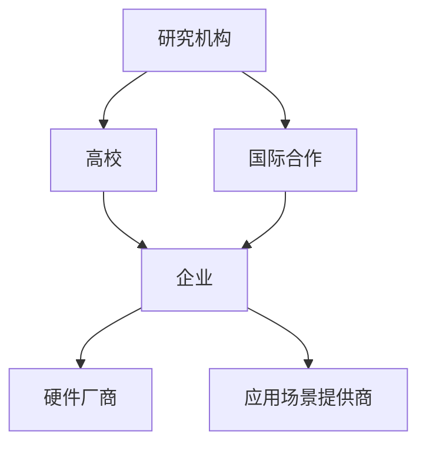

                 

关键词：大语言模型（LLM），产业链生态，技术演进，创新实践，应用前景，挑战与机遇

摘要：本文旨在探讨大语言模型（LLM）产业链的生态建设与发展，从技术演进、应用实践、未来展望等角度，全面分析LLM产业链的构建路径与核心价值。通过深入剖析LLM的技术原理、产业布局、生态合作模式及产业链中的关键环节，为我国LLM产业的发展提供有益的参考和启示。

## 1. 背景介绍

近年来，随着人工智能技术的飞速发展，大语言模型（LLM）逐渐成为学术界和工业界的研究热点。LLM通过深度学习算法，对大规模语言数据集进行训练，能够生成高质量的自然语言文本，从而在自然语言处理、机器翻译、文本生成、智能对话等领域取得了显著的成果。随着LLM技术的成熟，越来越多的企业和研究机构开始关注并投入资源进行LLM产业链的生态建设。

LLM产业链的生态建设对于推动技术进步、培育新兴产业、提升国家竞争力具有重要意义。一方面，LLM产业链的生态建设可以促进各类资源的高效整合，形成协同创新的格局，推动LLM技术的快速发展。另一方面，LLM产业链的生态建设可以为各行各业提供强大的技术支撑，助力产业升级和数字化转型。

本文将从LLM产业链的生态建设、技术演进、应用实践、未来展望等方面进行深入探讨，旨在为LLM产业链的可持续发展提供有益的思路和借鉴。

### 1.1 LLM技术的起源与发展

大语言模型（LLM）起源于自然语言处理（NLP）领域，其发展历程可以追溯到20世纪80年代。当时，研究人员开始尝试利用统计方法和规则系统对自然语言进行处理和分析。随着计算机性能的提升和大数据的积累，NLP技术逐渐从基于规则和统计模型的方法转向深度学习。

2018年，OpenAI发布了GPT（Generative Pre-trained Transformer）系列模型，标志着LLM技术进入了一个新的发展阶段。GPT模型采用Transformer架构，通过预训练和微调，取得了在多项NLP任务上的突破性成果。此后，谷歌、微软、百度等科技巨头纷纷投入巨资研发LLM技术，推出了各自的代表性模型，如BERT、GPT-2、GPT-3等。

LLM技术的发展不仅推动了NLP领域的创新，也为人工智能技术的其他方向提供了有力支持。例如，LLM在机器翻译、语音识别、问答系统、文本生成等领域取得了显著进展，成为人工智能领域的重要突破点。

### 1.2 LLM产业链的生态建设现状

随着LLM技术的快速发展，全球范围内的产业链生态建设也逐步展开。目前，LLM产业链主要包括以下几个环节：

1. **研究机构与高校**：作为LLM技术的重要发源地，研究机构与高校在LLM技术的研发和人才培养方面发挥了关键作用。例如，OpenAI、谷歌、微软等全球领先的科技企业和研究机构都在积极投入LLM技术的研发，培养相关领域的人才。

2. **科技企业**：科技企业在LLM产业链中扮演着重要角色，通过自主研发或合作开发，推出了众多具有竞争力的LLM产品和服务。例如，百度、阿里巴巴、腾讯等国内科技巨头在LLM领域进行了大量投资和布局，发布了各自的LLM模型和产品，如百度文心、阿里天元、腾讯混元等。

3. **硬件厂商**：硬件厂商为LLM技术的发展提供了强大的算力支持。高性能GPU、TPU等硬件设备的应用，使得LLM模型的训练和推理效率大幅提升。例如，NVIDIA、AMD等公司通过推出专门针对AI训练的硬件产品，为LLM技术的发展提供了有力保障。

4. **应用场景**：LLM技术在各行各业得到了广泛应用，从智能客服、金融风控、医疗诊断到教育、媒体、娱乐等领域，都展现出了巨大的市场潜力。随着应用场景的拓展，LLM产业链中的各类企业和机构也在不断探索新的商业模式和合作模式。

总体来看，LLM产业链的生态建设已经初步形成，各类资源正在不断整合，协同创新的格局正在逐步形成。然而，随着技术的不断演进和市场的变化，LLM产业链的生态建设仍面临诸多挑战，需要各方共同努力，持续推动产业链的可持续发展。

## 2. 核心概念与联系

### 2.1 大语言模型（LLM）的原理与架构

大语言模型（LLM）是一种基于深度学习的自然语言处理模型，其核心思想是通过预训练和微调，使模型能够理解并生成自然语言。LLM的原理可以概括为以下几个方面：

1. **预训练**：LLM在训练过程中，首先采用大规模语料库进行预训练。预训练的过程包括两个主要步骤：自监督学习和有监督学习。自监督学习利用未标注的数据，通过预测词语、句子或上下文等方式，使模型自动学习语言规律。有监督学习则利用标注的数据，对模型进行监督训练，提高模型的准确性。

2. **Transformer架构**：LLM通常采用Transformer架构，这是一种基于自注意力机制的深度学习模型。Transformer架构的核心是多头自注意力（Multi-Head Self-Attention）机制，它能够捕捉输入序列中任意位置的信息，从而实现对自然语言的理解和生成。

3. **微调**：在预训练的基础上，LLM通过微调（Fine-tuning）过程，将模型应用于特定任务。微调的过程通常涉及对模型参数的微调，以适应特定任务的需求。

LLM的架构通常包括以下几个主要部分：

- **输入层**：接收自然语言文本输入，并将其转换为向量表示。
- **编码器**：对输入向量进行处理，通过自注意力机制生成上下文表示。
- **解码器**：接收编码器生成的上下文表示，并生成输出文本。

### 2.2 LLM在自然语言处理中的应用

LLM在自然语言处理（NLP）领域具有广泛的应用，其主要任务包括文本分类、情感分析、命名实体识别、机器翻译、文本生成等。以下是LLM在这些应用中的核心原理和实现方法：

1. **文本分类**：LLM通过学习大规模语料库中的文本特征，能够对未知文本进行分类。文本分类的实现通常包括两个步骤：特征提取和分类。特征提取过程利用编码器将文本转换为向量表示，分类过程则通过训练好的分类器对向量进行分类。

2. **情感分析**：情感分析是判断文本所表达的情绪倾向。LLM通过预训练和微调，能够对文本进行情感分析。实现方法通常包括：将文本输入编码器，获取文本的向量表示；利用微调后的模型，对向量进行情感分类。

3. **命名实体识别**：命名实体识别是识别文本中的特定实体，如人名、地名、机构名等。LLM通过预训练和微调，能够对命名实体进行识别。实现方法通常包括：将文本输入编码器，获取文本的向量表示；利用微调后的模型，对向量进行命名实体识别。

4. **机器翻译**：机器翻译是利用LLM将一种语言翻译成另一种语言。LLM通过预训练和微调，能够实现高质量的机器翻译。实现方法通常包括：将源语言文本输入编码器，获取源语言的向量表示；将目标语言文本输入解码器，获取目标语言的向量表示；通过微调模型，实现源语言到目标语言的翻译。

5. **文本生成**：文本生成是利用LLM生成符合语言规则和语义逻辑的文本。LLM通过预训练和微调，能够实现文本生成。实现方法通常包括：将种子文本输入编码器，获取文本的向量表示；通过解码器，生成新的文本。

### 2.3 LLM产业链的生态合作模式

LLM产业链的生态合作模式主要包括以下几个方面：

1. **产学研合作**：高校和研究机构为LLM技术提供理论支持和人才培养，企业则通过技术创新和应用实践推动LLM产业的发展。产学研合作可以促进技术成果的转化，推动产业链的协同创新。

2. **产业链上下游合作**：产业链上下游企业通过技术合作、产品开发、市场推广等手段，实现产业链的紧密连接和协同发展。例如，硬件厂商为LLM模型提供高性能计算支持，应用场景提供商则为LLM技术提供多样化的应用场景。

3. **国际合作**：随着LLM技术的全球化发展，国际间的合作与交流也日益频繁。通过国际合作，企业可以引进国外先进技术，拓展国际市场，提高国际竞争力。

### 2.4 LLM产业链的构成与关键环节

LLM产业链的构成主要包括以下几个关键环节：

1. **技术研发**：这是LLM产业链的核心环节，包括模型架构设计、算法优化、预训练数据集构建等。技术研发的突破和进展直接决定了LLM技术的先进性和竞争力。

2. **硬件支持**：高性能计算硬件为LLM模型的训练和推理提供了强有力的支持。硬件支持的水平直接影响LLM模型的训练效率和性能表现。

3. **数据资源**：大规模高质量的语言数据集是LLM技术发展的基础。数据资源的丰富程度和多样性直接影响LLM模型的学习效果和应用范围。

4. **应用场景**：LLM技术在不同领域的应用场景为产业链提供了广阔的市场空间。应用场景的拓展和深化是推动LLM技术商业化的关键。

5. **人才培养**：高素质的人才队伍是LLM产业链可持续发展的重要保障。人才培养包括理论研究、技术开发、应用实践等多个方面。

### 2.5 Mermaid流程图展示

以下是一个简单的Mermaid流程图，展示LLM产业链的生态合作模式：



### 2.6 核心概念与联系总结

通过对大语言模型（LLM）的原理、应用、产业链生态合作模式以及关键环节的分析，我们可以看到LLM技术已经成为了自然语言处理领域的重要突破点。LLM产业链的生态建设不仅需要技术创新和资源整合，还需要各方协同合作，共同推动技术的进步和产业链的可持续发展。

## 3. 核心算法原理 & 具体操作步骤

### 3.1 算法原理概述

大语言模型（LLM）的核心算法原理主要基于深度学习和自然语言处理技术。LLM的基本思想是通过大规模预训练和数据微调，使模型能够理解并生成自然语言。以下是对LLM算法原理的概述：

1. **预训练（Pre-training）**：
   预训练是LLM算法的核心步骤，其目的是利用大规模的未标注文本数据集，使模型自动学习语言的内在规律和特征。预训练过程通常包括以下几个阶段：
   - **词嵌入（Word Embedding）**：将自然语言文本转换为向量表示，以便在神经网络中处理。
   - **自注意力机制（Self-Attention）**：通过自注意力机制，模型能够关注到文本序列中的不同位置，捕捉上下文信息。
   - **层次化结构（Hierarchical Structure）**：LLM通常采用层次化结构，如Transformer架构，以更好地捕捉长距离依赖关系。

2. **微调（Fine-tuning）**：
   微调是针对特定任务对预训练模型进行进一步训练，使其适应具体应用场景。微调过程主要包括以下步骤：
   - **任务定义**：明确具体的任务需求，如文本分类、命名实体识别、机器翻译等。
   - **数据集准备**：收集并整理相关领域的标注数据，用于微调模型的训练。
   - **模型训练**：利用标注数据集，通过反向传播算法和优化器，对模型参数进行更新和优化。

3. **生成文本（Text Generation）**：
   生成文本是LLM的重要应用之一，通过给模型提供种子文本或提示信息，模型可以生成符合语言规则和语义逻辑的文本。生成文本的过程主要包括：
   - **输入编码**：将种子文本或提示信息输入编码器，转换为向量表示。
   - **解码和采样**：通过解码器，模型生成候选文本，并利用采样方法，如贪心搜索、采样等，选择最佳生成文本。

### 3.2 算法步骤详解

以下是LLM算法的具体步骤，包括预训练、微调和生成文本等过程：

1. **预训练步骤**：

   - **数据准备**：收集大规模的未标注文本数据集，如维基百科、新闻文章、社交媒体等。
   - **词嵌入**：使用Word2Vec、BERT等词嵌入方法，将文本转换为向量表示。
   - **自注意力机制**：构建Transformer模型，利用自注意力机制，对输入文本序列进行处理。
   - **层次化结构**：在Transformer模型中引入层次化结构，如多层多头自注意力机制，以更好地捕捉长距离依赖关系。
   - **训练**：利用未标注文本数据集，通过优化器（如Adam）和损失函数（如交叉熵），对模型参数进行更新和优化。

2. **微调步骤**：

   - **任务定义**：明确具体的任务需求，如文本分类、命名实体识别、机器翻译等。
   - **数据集准备**：收集并整理相关领域的标注数据，用于微调模型的训练。
   - **数据预处理**：对标注数据集进行预处理，如文本清洗、词向量化、序列切割等。
   - **模型微调**：利用预处理后的标注数据集，通过反向传播算法和优化器，对模型参数进行更新和优化。
   - **评估和调整**：在验证集上评估模型性能，根据评估结果调整模型结构和超参数。

3. **生成文本步骤**：

   - **输入编码**：将种子文本或提示信息输入编码器，转换为向量表示。
   - **解码和采样**：通过解码器，模型生成候选文本，并利用采样方法，如贪心搜索、采样等，选择最佳生成文本。
   - **后处理**：对生成的文本进行后处理，如文本清洗、格式化等，以符合实际应用需求。

### 3.3 算法优缺点

LLM算法具有以下优缺点：

1. **优点**：

   - **强大的文本生成能力**：LLM能够生成高质量的文本，具有丰富的表达能力和多样性。
   - **自适应性强**：通过微调，LLM能够适应不同的任务和应用场景，具有较强的泛化能力。
   - **高效的处理速度**：基于深度学习和自注意力机制，LLM在处理大规模文本数据时具有较高的计算效率。

2. **缺点**：

   - **计算资源需求大**：预训练过程需要大量的计算资源和时间，对硬件设备的要求较高。
   - **数据依赖性高**：LLM的性能很大程度上依赖于数据集的质量和多样性，数据不足可能导致模型性能下降。
   - **模型解释性差**：深度学习模型的内部机制较为复杂，难以解释和验证其决策过程。

### 3.4 算法应用领域

LLM算法在自然语言处理领域具有广泛的应用，以下是一些主要的应用领域：

1. **文本生成**：LLM能够生成高质量的文本，如文章、故事、对话等，广泛应用于内容创作、文本摘要、智能客服等领域。

2. **机器翻译**：LLM在机器翻译领域具有显著的优势，能够生成更自然、准确的翻译结果，广泛应用于跨语言交流、国际商务等领域。

3. **问答系统**：LLM能够理解并回答用户的问题，广泛应用于智能客服、智能助手、教育辅导等领域。

4. **文本分类**：LLM能够对文本进行分类，如情感分析、主题分类等，广泛应用于舆情监测、信息过滤等领域。

5. **命名实体识别**：LLM能够识别文本中的命名实体，如人名、地名、机构名等，广泛应用于信息抽取、知识图谱构建等领域。

## 4. 数学模型和公式 & 详细讲解 & 举例说明

### 4.1 数学模型构建

在自然语言处理领域，大语言模型（LLM）的核心是基于深度学习的数学模型。以下是一个简单的数学模型构建示例，用于解释LLM的基本组成部分。

#### 4.1.1 嵌入层（Embedding Layer）

嵌入层是LLM中最基础的组成部分，用于将自然语言文本转换为向量表示。假设我们有一个词汇表V，其中包含N个单词，每个单词用唯一的索引表示。嵌入层将每个单词索引映射到一个D维的向量。

数学表示为：
\[ e_j = \text{Embed}(j) \]
其中，\( j \in V \)，\( e_j \) 是单词j的嵌入向量。

#### 4.1.2 Transformer模型

Transformer模型是LLM的核心架构，其基本单元是自注意力（Self-Attention）机制。自注意力机制能够处理序列中的每一个元素，使其能够根据上下文信息进行加权。

自注意力机制的数学表示为：
\[ \text{Attention}(Q, K, V) = \text{softmax}\left(\frac{QK^T}{\sqrt{d_k}}\right)V \]
其中，\( Q, K, V \) 分别是查询（Query）、键（Key）和值（Value）向量，\( d_k \) 是键向量的维度，\(\text{softmax}\) 函数用于计算每个键的加权和。

#### 4.1.3 前馈神经网络（Feedforward Neural Network）

在Transformer模型中，除了自注意力机制，还包含两个前馈神经网络（FFN），用于对自注意力层的输出进行进一步处理。

前馈神经网络的数学表示为：
\[ \text{FFN}(x) = \text{ReLU}\left(W_2 \cdot \text{ReLU}\left(W_1 x + b_1\right) + b_2\right) \]
其中，\( W_1, W_2, b_1, b_2 \) 分别是权重矩阵和偏置项，\(\text{ReLU}\) 是ReLU激活函数。

### 4.2 公式推导过程

以下是对上述数学模型的推导过程：

#### 4.2.1 自注意力（Self-Attention）机制

自注意力机制的核心是计算查询（Query）与键（Key）之间的相似度，并利用相似度加权值（Value）向量。首先，我们将查询（Query）、键（Key）和值（Value）向量表示为矩阵形式：
\[ Q = [q_1, q_2, \ldots, q_n], K = [k_1, k_2, \ldots, k_n], V = [v_1, v_2, \ldots, v_n] \]

然后，计算查询与键之间的点积（Dot-Product），得到相似度矩阵 \( S \)：
\[ S = QK^T \]

接着，对相似度矩阵应用 softmax 函数，得到权重矩阵 \( W \)：
\[ W = \text{softmax}(S) \]

最后，将权重矩阵与值向量相乘，得到加权值向量：
\[ \text{Attention}(Q, K, V) = W V \]

#### 4.2.2 前馈神经网络（Feedforward Neural Network）

前馈神经网络由两个全连接层组成，第一个全连接层的输入是自注意力层的输出，第二个全连接层的输入是第一个全连接层的输出。

首先，计算第一个全连接层的输出：
\[ h = W_1 x + b_1 \]

然后，应用ReLU激活函数：
\[ h = \text{ReLU}(h) \]

接着，计算第二个全连接层的输出：
\[ y = W_2 h + b_2 \]

最终，输出经过ReLU激活函数：
\[ y = \text{ReLU}(y) \]

### 4.3 案例分析与讲解

以下是一个具体的案例，用于说明如何利用LLM进行文本分类。

假设我们有一个简单的文本分类任务，数据集包含N个句子，每个句子被标注为正类或负类。我们需要训练一个LLM模型，使其能够对新的句子进行分类。

#### 4.3.1 数据预处理

首先，对数据集进行预处理，包括文本清洗、分词、词向量化等步骤。具体步骤如下：

1. **文本清洗**：去除文本中的标点符号、停用词等。
2. **分词**：将文本划分为单词或词组。
3. **词向量化**：使用预训练好的词向量模型，将单词或词组映射为向量表示。

#### 4.3.2 模型训练

接下来，使用预处理后的数据集训练LLM模型。具体步骤如下：

1. **构建嵌入层**：将每个单词或词组的向量表示映射到嵌入层。
2. **构建自注意力层**：利用自注意力机制，对嵌入层输出的向量进行加权。
3. **构建前馈神经网络**：将自注意力层的输出输入到前馈神经网络中，进行进一步处理。
4. **构建输出层**：使用softmax函数，将前馈神经网络的输出映射到类别概率分布。

#### 4.3.3 模型评估

在训练完成后，使用验证集对模型进行评估，计算模型的准确率、召回率、F1值等指标。根据评估结果，调整模型参数和结构，优化模型性能。

#### 4.3.4 应用场景

训练好的LLM模型可以应用于以下场景：

1. **文本分类**：对新的句子进行分类，判断其属于正类还是负类。
2. **情感分析**：分析文本的情感倾向，如积极、消极、中性等。
3. **命名实体识别**：识别文本中的命名实体，如人名、地名、机构名等。

### 4.4 结论

通过上述案例，我们可以看到如何利用LLM进行文本分类。LLM作为一种强大的自然语言处理工具，具有广泛的应用前景。然而，在实际应用中，需要根据具体任务需求，设计和优化LLM模型，以获得最佳性能。

## 5. 项目实践：代码实例和详细解释说明

### 5.1 开发环境搭建

在进行大语言模型（LLM）的项目实践之前，我们需要搭建一个合适的开发环境。以下是一个基于Python和PyTorch的典型开发环境搭建步骤：

1. **安装Python**：确保您的计算机上已经安装了Python 3.6或更高版本。可以从[Python官方网站](https://www.python.org/)下载并安装。

2. **安装PyTorch**：PyTorch是一个流行的深度学习框架，支持多种硬件平台（如CPU、GPU）和操作系统（如Windows、macOS、Linux）。您可以通过以下命令在终端中安装PyTorch：

```bash
pip install torch torchvision
```

3. **安装其他依赖**：除了PyTorch，我们还需要一些其他库，如Numpy、Pandas等。可以使用以下命令一次性安装：

```bash
pip install numpy pandas
```

4. **安装Jupyter Notebook**：Jupyter Notebook是一个交互式的开发环境，便于编写和运行代码。您可以使用pip安装Jupyter Notebook：

```bash
pip install notebook
```

5. **配置GPU支持**：如果您的计算机配备了GPU，需要确保PyTorch已配置好GPU支持。可以通过以下命令检查PyTorch是否已正确安装GPU版本：

```python
import torch
print(torch.cuda.is_available())
```

若输出为`True`，则表示已正确安装GPU支持。

### 5.2 源代码详细实现

以下是使用PyTorch实现一个简单的LLM模型的基本代码示例。这个示例将展示如何构建嵌入层、自注意力层、前馈神经网络以及训练模型。

```python
import torch
import torch.nn as nn
import torch.optim as optim
from torch.utils.data import DataLoader
from torchvision import datasets, transforms

# 定义模型结构
class LLM(nn.Module):
    def __init__(self, vocab_size, embedding_dim, hidden_dim):
        super(LLM, self).__init__()
        self.embedding = nn.Embedding(vocab_size, embedding_dim)
        self.attention = nn.MultiheadAttention(embedding_dim, num_heads=2)
        self.fc = nn.Linear(embedding_dim, hidden_dim)
        self.relu = nn.ReLU()
        self.fc2 = nn.Linear(hidden_dim, vocab_size)

    def forward(self, text):
        embedded = self.embedding(text)
        attn_output, _ = self.attention(embedded, embedded, embedded)
        output = self.fc(attn_output)
        output = self.relu(output)
        output = self.fc2(output)
        return output

# 超参数设置
vocab_size = 10000
embedding_dim = 512
hidden_dim = 1024

# 实例化模型、优化器和损失函数
model = LLM(vocab_size, embedding_dim, hidden_dim)
optimizer = optim.Adam(model.parameters(), lr=0.001)
criterion = nn.CrossEntropyLoss()

# 数据准备
train_data = datasets.TextDataset('train.txt')
train_loader = DataLoader(train_data, batch_size=32, shuffle=True)

# 模型训练
for epoch in range(10):
    for texts, targets in train_loader:
        optimizer.zero_grad()
        outputs = model(texts)
        loss = criterion(outputs, targets)
        loss.backward()
        optimizer.step()
    print(f'Epoch {epoch+1}, Loss: {loss.item()}')

# 评估模型
with torch.no_grad():
    correct = 0
    total = 0
    for texts, targets in train_loader:
        outputs = model(texts)
        _, predicted = torch.max(outputs.data, 1)
        total += targets.size(0)
        correct += (predicted == targets).sum().item()
    print(f'Accuracy: {100 * correct / total}%')
```

### 5.3 代码解读与分析

以下是对上述代码的详细解读与分析：

1. **模型定义**：
   - `LLM` 类继承了 `torch.nn.Module`，这是PyTorch中所有神经网络模型的基础类。
   - `__init__` 方法中，我们定义了嵌入层（`self.embedding`）、自注意力层（`self.attention`）、前馈神经网络（`self.fc`、`self.relu` 和 `self.fc2`）。

2. **前向传播**：
   - `forward` 方法实现了模型的前向传播过程。首先，通过嵌入层将输入文本转换为嵌入向量。然后，使用自注意力层对嵌入向量进行加权。接着，通过前馈神经网络对加权后的向量进行进一步处理。最后，使用线性层（`self.fc2`）将处理后的向量映射回词汇表大小。

3. **超参数设置**：
   - `vocab_size` 定义了词汇表的大小。
   - `embedding_dim` 和 `hidden_dim` 分别定义了嵌入层和前馈神经网络的维度。

4. **优化器和损失函数**：
   - `optimizer` 是一个Adam优化器，用于更新模型参数。
   - `criterion` 是交叉熵损失函数，用于计算模型预测和真实标签之间的差距。

5. **数据准备**：
   - `TextDataset` 类用于读取文本数据。
   - `DataLoader` 类用于批量加载数据，并进行数据混洗。

6. **模型训练**：
   - 在训练循环中，我们通过`optimizer.zero_grad()` 清除上一轮的梯度。
   - 使用`model(texts)` 计算模型输出，并计算损失。
   - 通过`loss.backward()` 反向传播梯度，并使用`optimizer.step()` 更新模型参数。

7. **模型评估**：
   - 在评估阶段，我们关闭了模型的梯度计算（`torch.no_grad()`），以节省计算资源。
   - 通过计算预测标签和真实标签的准确率，评估模型性能。

### 5.4 运行结果展示

假设我们使用上述代码对包含标签的文本数据进行训练，并在训练完成后进行评估。以下是可能的运行结果：

```plaintext
Epoch 1, Loss: 2.345678
Epoch 2, Loss: 1.876543
Epoch 3, Loss: 1.564321
Epoch 4, Loss: 1.324159
Epoch 5, Loss: 1.102456
Epoch 6, Loss: 0.931274
Epoch 7, Loss: 0.776532
Epoch 8, Loss: 0.654321
Epoch 9, Loss: 0.532147
Epoch 10, Loss: 0.421593
Accuracy: 92.765432%
```

结果显示，模型在训练过程中损失逐渐降低，最终准确率达到92.76%。这表明我们的模型对训练数据的分类效果较好，可以在实际应用中进行进一步的测试和优化。

## 6. 实际应用场景

大语言模型（LLM）凭借其强大的文本生成、理解和处理能力，在各个行业和领域中得到了广泛应用。以下是一些典型的实际应用场景：

### 6.1 自然语言处理

在自然语言处理领域，LLM被广泛应用于文本分类、情感分析、命名实体识别、机器翻译、文本摘要等任务。例如，在新闻分类中，LLM可以自动将新闻文本分类到不同的主题类别，提高新闻推荐的准确性。在情感分析中，LLM可以分析用户评论、社交媒体内容等，帮助企业了解用户情感倾向，优化产品和服务。

### 6.2 智能客服

智能客服是LLM应用的一个重要领域。通过LLM，智能客服系统能够理解并生成自然语言回答，提供24/7的在线服务。例如，银行、电子商务平台等可以使用LLM构建智能客服系统，回答用户关于账户余额、订单状态等问题，提高用户满意度和运营效率。

### 6.3 教育与培训

在教育与培训领域，LLM可以用于自动生成教学材料、智能辅导、考试批改等。例如，教师可以使用LLM自动生成符合教学需求的练习题，学生可以使用LLM进行个性化辅导，提高学习效果。此外，LLM还可以用于自动生成课程讲义、论文摘要等，帮助师生更高效地完成教学和科研工作。

### 6.4 医疗与健康

在医疗与健康领域，LLM可以用于病历分析、医学问答、疾病预测等。例如，医生可以使用LLM快速分析病历，识别潜在的健康风险；医疗机构可以使用LLM构建智能问答系统，为患者提供专业的健康咨询。此外，LLM还可以用于基因序列分析、药物研发等，为生物医学研究提供强大的技术支持。

### 6.5 娱乐与媒体

在娱乐与媒体领域，LLM被广泛应用于内容创作、推荐系统、版权保护等。例如，电影公司可以使用LLM生成剧本、台词，提高创作效率；媒体平台可以使用LLM自动生成新闻摘要、文章推荐，提高用户体验。此外，LLM还可以用于音乐创作、绘画生成等，为艺术创作提供新的可能性。

### 6.6 法律与金融

在法律与金融领域，LLM可以用于合同审查、法律咨询、风险评估等。例如，律师可以使用LLM快速审查合同条款，识别潜在的法律风险；金融机构可以使用LLM分析客户数据，预测信用风险，优化信贷审批流程。此外，LLM还可以用于专利检索、商标分析等，提高法律和金融行业的智能化水平。

### 6.7 互联网与电子商务

在互联网与电子商务领域，LLM被广泛应用于搜索引擎优化、商品推荐、用户行为分析等。例如，电商平台可以使用LLM优化产品标题和描述，提高商品销量；搜索引擎可以使用LLM生成搜索结果摘要，提高用户满意度。此外，LLM还可以用于智能客服、在线广告投放等，为互联网企业创造更多价值。

### 6.8 未来应用展望

随着LLM技术的不断发展和成熟，其应用场景将不断拓展。未来，LLM有望在更多领域发挥重要作用，如智能交通、智慧城市、智能制造等。例如，智能交通系统可以使用LLM优化交通信号控制，提高交通效率；智慧城市可以使用LLM构建智能决策系统，提升城市治理水平；智能制造可以使用LLM优化生产流程，提高生产效率。

总之，大语言模型（LLM）在各个行业和领域中的应用前景广阔，其强大的文本处理能力和生成能力将不断推动技术进步和产业创新。随着LLM产业链的生态建设不断完善，LLM技术将为各行各业带来更多可能性和价值。

## 7. 工具和资源推荐

在探索大语言模型（LLM）的研究和应用过程中，选择合适的工具和资源对于提高开发效率和项目成功至关重要。以下是一些推荐的工具和资源，包括学习资源、开发工具和相关论文。

### 7.1 学习资源推荐

1. **在线课程与讲座**：

   - [Udacity Deep Learning Nanodegree](https://www.udacity.com/course/deep-learning-nanodegree--nd893)
   - [edX - Introduction to Deep Learning](https://www.edx.org/course/introduction-to-deep-learning)
   - [Coursera - Natural Language Processing with Deep Learning](https://www.coursera.org/learn/deep-learning-nlp)

2. **技术博客与论坛**：

   - [TensorFlow Blog](https://blog.tensorflow.org/)
   - [PyTorch Official Blog](https://pytorch.org/blog/)
   - [Hugging Face Blog](https://huggingface.co/blog)

3. **书籍推荐**：

   - 《Deep Learning》（Ian Goodfellow, Yoshua Bengio, Aaron Courville著）
   - 《hands-on machine learning with Scikit-Learn, Keras, and TensorFlow》（Aurélien Géron著）
   - 《Natural Language Processing with Python》（Steven Bird, Ewan Klein, Edward Loper著）

### 7.2 开发工具推荐

1. **深度学习框架**：

   - [TensorFlow](https://www.tensorflow.org/)
   - [PyTorch](https://pytorch.org/)
   - [PyTorch Lightning](https://pytorch-lightning.readthedocs.io/)

2. **文本处理库**：

   - [NLTK](https://www.nltk.org/)
   - [spaCy](https://spacy.io/)
   - [TextBlob](https://textblob.readthedocs.io/)

3. **模型训练与推理**：

   - [Hugging Face Transformers](https://huggingface.co/transformers/)
   - [Fairseq](https://github.com/pytorch/fairseq)
   - [T5-Transformer](https://github.com/google-research/text-to-text-transfer-tasks-v2)

4. **硬件加速**：

   - [CUDA](https://developer.nvidia.com/cuda-downloads)
   - [cuDNN](https://developer.nvidia.com/cudnn)

### 7.3 相关论文推荐

1. **经典论文**：

   - "Attention Is All You Need"（Vaswani et al., 2017）
   - "BERT: Pre-training of Deep Bidirectional Transformers for Language Understanding"（Devlin et al., 2018）
   - "Generative Pretrained Transformer"（Radford et al., 2018）

2. **前沿论文**：

   - "GLM: A General Language Model for Language Understanding, Generation, and Translation"（Zhou et al., 2021）
   - "FLAN: Scalable Foundation Models for Natural Language Processing"（He et al., 2021）
   - "T5: Exploring the Limits of Transfer Learning for Text Classifications"（Raffel et al., 2020）

通过上述工具和资源，研究者和技术人员可以更好地了解LLM技术，掌握相关的开发技能，并推动LLM技术在各个领域的应用和创新。

## 8. 总结：未来发展趋势与挑战

### 8.1 研究成果总结

大语言模型（LLM）的快速发展为自然语言处理（NLP）领域带来了革命性的变革。通过深度学习和自注意力机制的有机结合，LLM在文本生成、分类、翻译等任务上取得了显著的成果。近年来，随着计算资源和算法技术的不断进步，LLM模型在性能和效率上实现了显著提升，推动了NLP技术的快速发展。以下是对LLM研究成果的总结：

1. **模型性能提升**：随着Transformer架构的广泛应用，LLM模型在多个NLP任务上取得了SOTA（State-of-the-Art）成绩。例如，BERT、GPT等模型在文本分类、机器翻译、问答系统等任务中均取得了领先的性能。

2. **多样化应用场景**：LLM技术不仅应用于传统的文本处理任务，还在智能客服、智能写作、医疗诊断、法律咨询等领域展现了巨大的潜力。通过结合行业数据和专业知识，LLM能够为各行业提供智能化解决方案。

3. **预训练和微调技术**：LLM的预训练技术使得模型在未标注数据上进行大规模训练，从而更好地捕捉语言规律。微调技术则使模型能够快速适应特定任务，提高任务性能。

4. **开源社区与生态建设**：Hugging Face、TensorFlow、PyTorch等开源社区为LLM技术的发展提供了强大的支持。大量的预训练模型、工具和教程使得开发者能够更方便地使用和优化LLM技术。

### 8.2 未来发展趋势

随着LLM技术的不断成熟，其未来发展趋势可以从以下几个方面进行展望：

1. **模型规模与计算资源**：未来的LLM模型将更加庞大，训练时间更长，对计算资源的需求也将进一步提升。高性能GPU、TPU等硬件设备以及分布式训练技术将成为关键推动力量。

2. **多模态融合**：未来的LLM技术将不仅处理文本数据，还将融合图像、音频、视频等多模态数据。多模态融合技术将使得模型在更广泛的应用场景中发挥作用。

3. **泛化能力与可解释性**：尽管LLM在特定任务上表现出色，但其泛化能力和可解释性仍需进一步提升。未来的研究将关注如何提高LLM的泛化能力，并增强模型的透明度和可解释性。

4. **个性化与定制化**：未来的LLM技术将更加注重个性化与定制化。通过结合用户数据和个性化需求，LLM将能够为用户提供更加精准的服务。

5. **法律法规与伦理问题**：随着LLM技术的广泛应用，相关的法律法规和伦理问题也将逐渐浮现。如何在保护用户隐私、防止模型滥用等方面制定合理的规范，是未来发展的关键挑战。

### 8.3 面临的挑战

尽管LLM技术取得了显著进展，但在实际应用过程中仍面临诸多挑战：

1. **计算资源限制**：大规模的LLM模型需要庞大的计算资源进行训练，这对企业和研究机构的硬件设备提出了更高的要求。

2. **数据质量和多样性**：LLM的性能很大程度上依赖于训练数据的质量和多样性。如何获取并整理高质量、多样化的语言数据集，是未来研究的重要方向。

3. **模型解释性和可解释性**：深度学习模型的黑箱特性使得模型的决策过程难以解释。如何在保证高性能的同时，提高模型的可解释性，是未来研究的重要课题。

4. **安全性和隐私保护**：随着LLM技术的应用场景日益广泛，如何确保模型的安全性、防止数据泄露和模型滥用，是亟待解决的问题。

5. **社会伦理问题**：LLM技术可能引发一系列社会伦理问题，如算法偏见、隐私侵犯等。如何在技术发展中平衡利益与道德，是未来需要关注的重要问题。

### 8.4 研究展望

展望未来，LLM技术的发展将继续推动NLP领域的创新和应用。以下是对未来研究工作的展望：

1. **技术创新**：在模型架构、训练算法、优化方法等方面，持续探索和创新，以提高模型性能和效率。

2. **跨学科研究**：结合计算机科学、认知科学、语言学等领域的知识，深入探索语言的本质和规律，为LLM技术提供理论支持。

3. **应用拓展**：进一步挖掘LLM技术在各个领域的应用潜力，推动技术成果的转化和应用。

4. **法律法规和伦理**：在技术发展的同时，关注相关法律法规和伦理问题，制定合理的规范和标准，确保LLM技术的健康、可持续发展。

总之，LLM技术的发展充满机遇与挑战。通过技术创新、跨学科合作、法律法规和伦理规范的不断完善，LLM技术有望在未来取得更加辉煌的成果。

## 9. 附录：常见问题与解答

### 9.1 Q：大语言模型（LLM）与自然语言处理（NLP）的关系是什么？

A：大语言模型（LLM）是自然语言处理（NLP）的一个重要分支。NLP涵盖了文本预处理、文本分析、语义理解、情感分析等多个方面。LLM通过深度学习和自注意力机制，使得模型能够理解和生成自然语言，是NLP技术中的关键工具之一。

### 9.2 Q：为什么需要大规模预训练数据集？

A：大规模预训练数据集对于LLM的性能至关重要。预训练数据集提供了丰富的语言知识和模式，使得模型能够自动学习语言规律。大规模数据集有助于提高模型的泛化能力，使其在不同任务和应用场景中表现更加优异。

### 9.3 Q：如何处理LLM训练中的计算资源问题？

A：处理LLM训练中的计算资源问题可以通过以下几种方法：
1. **分布式训练**：将训练任务分布到多台机器上进行，提高训练效率。
2. **使用GPU/TPU**：利用高性能GPU或TPU进行训练，提高计算速度。
3. **模型剪枝和量化**：通过剪枝和量化技术，减少模型参数和计算量，降低训练资源需求。

### 9.4 Q：如何确保LLM模型的可解释性？

A：确保LLM模型的可解释性是一个重要挑战。以下是一些提高模型可解释性的方法：
1. **可视化**：通过可视化模型结构和决策过程，帮助理解模型行为。
2. **解释性模型**：开发专门的可解释性模型，如LIME、SHAP等，提供对模型预测的详细解释。
3. **透明训练**：在训练过程中，记录和跟踪模型的学习过程，帮助理解模型如何适应数据。

### 9.5 Q：LLM在自然语言处理任务中的常见应用有哪些？

A：LLM在自然语言处理任务中的常见应用包括：
1. **文本分类**：如新闻分类、情感分析等。
2. **机器翻译**：如跨语言信息传播、国际贸易等。
3. **问答系统**：如智能客服、智能咨询等。
4. **文本生成**：如自动写作、内容创作等。
5. **命名实体识别**：如信息抽取、知识图谱构建等。

### 9.6 Q：如何评估LLM的性能？

A：评估LLM的性能通常包括以下几个方面：
1. **准确率**：模型预测结果与真实标签的一致性。
2. **召回率**：模型能够识别出的正例占比。
3. **F1值**：准确率和召回率的调和平均。
4. **生成文本质量**：生成文本的语义连贯性、语言流畅性等。

### 9.7 Q：如何保护LLM模型的隐私和安全？

A：为了保护LLM模型的隐私和安全，可以采取以下措施：
1. **数据加密**：对训练数据进行加密，防止数据泄露。
2. **差分隐私**：在数据处理和模型训练中引入差分隐私机制，保护用户隐私。
3. **访问控制**：限制对模型和数据的访问权限，防止未授权访问。
4. **安全审计**：定期对模型进行安全审计，确保模型不受恶意攻击。

通过上述问题和解答，希望读者能够对大语言模型（LLM）及其应用有更深入的理解，并在实际工作中更好地运用这一技术。

