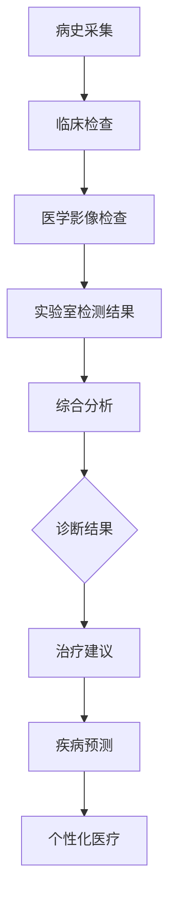

                 

关键词：LLM、医疗诊断、AI辅助、临床决策、算法原理、数学模型、项目实践、应用场景、未来展望

> 摘要：本文将探讨大型语言模型（LLM）在医疗诊断中的应用，特别是AI辅助临床决策的潜力。我们将从背景介绍、核心概念与联系、核心算法原理、数学模型和公式、项目实践以及未来应用展望等多个方面，详细分析LLM在医疗诊断领域的应用前景和面临的挑战。

## 1. 背景介绍

医疗诊断是医疗行业的核心环节，对于提高医疗质量和患者生存率至关重要。然而，随着医学数据的爆炸性增长和医疗知识的专业化，传统的医疗诊断方法已经难以应对复杂病例的挑战。因此，人工智能（AI）技术的引入成为了提高医疗诊断效率的重要手段。

近年来，深度学习尤其是大型语言模型（LLM）在自然语言处理（NLP）领域取得了显著进展。LLM具有强大的文本理解和生成能力，能够处理复杂的医学文本数据，为临床决策提供有力支持。本文将重点关注LLM在医疗诊断中的应用，探讨其技术原理和实际应用案例，以及未来的发展趋势。

## 2. 核心概念与联系

### 2.1 大型语言模型（LLM）

大型语言模型（LLM）是基于神经网络架构的大型模型，通过海量数据训练，具有强大的文本理解和生成能力。典型的LLM模型包括GPT、BERT、T5等。LLM的主要特点包括：

- **预训练**：LLM通过在大量文本数据上进行预训练，学习到语言的一般规律和知识。
- **上下文理解**：LLM能够理解文本的上下文，生成连贯且符合语境的文本。
- **自适应能力**：LLM可以根据不同的任务需求，进行微调和适应。

### 2.2 医疗诊断

医疗诊断是指通过临床检查、实验室检测和医学影像等方法，对患者的健康状况进行判断和评估。医疗诊断的流程通常包括：

- **病史采集**：医生通过询问患者病史，了解病情。
- **临床检查**：医生进行体格检查，发现症状和体征。
- **辅助检查**：进行实验室检测和医学影像检查，获得更详细的诊断信息。
- **诊断**：医生综合病史、临床检查和辅助检查结果，进行诊断。

### 2.3 AI辅助临床决策

AI辅助临床决策是指利用人工智能技术，辅助医生进行诊断和治疗决策。AI在医疗诊断中的应用主要包括：

- **辅助诊断**：通过分析医学影像和实验室检测结果，提高诊断准确性。
- **治疗建议**：根据患者的病情和医学知识库，提供治疗建议。
- **预测疾病进展**：利用医学数据，预测患者疾病进展和预后。
- **个性化医疗**：根据患者的基因信息和生活习惯，提供个性化的治疗方案。

## 2.1.1 Mermaid 流程图

下面是LLM在医疗诊断中的应用流程的Mermaid流程图：



## 3. 核心算法原理 & 具体操作步骤

### 3.1 算法原理概述

LLM在医疗诊断中的核心算法原理主要包括以下几个方面：

- **预训练**：LLM通过在大量医学文本数据上进行预训练，学习到医学知识和语言规律。
- **文本理解**：LLM利用预训练的模型，对医学文本进行理解，提取关键信息。
- **生成文本**：LLM根据提取的关键信息，生成诊断报告或治疗建议。
- **微调**：LLM可以根据具体的医疗诊断任务，进行微调，提高诊断准确率。

### 3.2 算法步骤详解

#### 3.2.1 预训练

预训练是LLM在医疗诊断中应用的第一步。具体步骤如下：

1. **数据收集**：收集大量的医学文本数据，包括医学论文、病例报告、临床指南等。
2. **数据预处理**：对医学文本进行清洗、去噪和分词，将文本转换为模型可以处理的格式。
3. **模型训练**：使用预训练框架（如GPT、BERT）对医学文本数据进行预训练，学习到医学知识和语言规律。

#### 3.2.2 文本理解

文本理解是LLM在医疗诊断中的关键步骤。具体步骤如下：

1. **输入文本**：将新的医学文本输入到预训练好的LLM模型中。
2. **特征提取**：LLM模型对输入文本进行特征提取，提取出文本中的关键信息。
3. **信息融合**：将提取的关键信息进行融合，形成统一的语义表示。

#### 3.2.3 生成文本

生成文本是LLM在医疗诊断中的最后一步。具体步骤如下：

1. **输出文本**：根据提取的关键信息和预定义的文本模板，生成诊断报告或治疗建议。
2. **文本校验**：对生成的文本进行校验，确保文本的准确性和合理性。

#### 3.2.4 微调

微调是提高LLM在医疗诊断中诊断准确率的重要手段。具体步骤如下：

1. **数据收集**：收集实际的医学诊断数据，包括病例、诊断报告等。
2. **模型微调**：使用实际的医学诊断数据，对预训练好的LLM模型进行微调。
3. **评估与优化**：对微调后的模型进行评估，根据评估结果进行模型优化。

### 3.3 算法优缺点

#### 优点

- **强大的文本理解能力**：LLM通过预训练，具有强大的文本理解和生成能力，能够处理复杂的医学文本数据。
- **高效的诊断速度**：LLM能够快速地对医学文本进行理解，生成诊断报告或治疗建议，提高诊断速度。
- **广泛的适用性**：LLM可以应用于各种类型的医学诊断任务，具有广泛的适用性。

#### 缺点

- **数据依赖性**：LLM的性能高度依赖于训练数据的质量和数量，数据不足或质量低下可能导致诊断不准确。
- **误诊风险**：由于医学领域的复杂性和不确定性，LLM可能存在误诊风险，需要医生的进一步判断和确认。

### 3.4 算法应用领域

LLM在医疗诊断中的应用领域非常广泛，包括：

- **临床诊断**：辅助医生进行疾病诊断，提高诊断准确率。
- **病理分析**：分析医学影像和病理数据，辅助医生进行疾病诊断。
- **治疗建议**：根据患者的病情和医学知识库，提供个性化的治疗建议。
- **疾病预测**：利用医学数据，预测患者疾病进展和预后。

## 4. 数学模型和公式 & 详细讲解 & 举例说明

### 4.1 数学模型构建

LLM在医疗诊断中的应用涉及到多个数学模型，主要包括：

- **神经网络模型**：用于预训练和微调LLM。
- **文本生成模型**：用于生成诊断报告或治疗建议。
- **分类模型**：用于对医学数据进行分类，如疾病分类、症状分类等。

### 4.2 公式推导过程

#### 4.2.1 神经网络模型

神经网络模型的核心是前向传播和反向传播算法。以下是神经网络模型的推导过程：

1. **前向传播**：

   - 输入特征 $x \in \mathbb{R}^n$。
   - 权重 $W \in \mathbb{R}^{n \times m}$。
   - 偏置 $b \in \mathbb{R}^m$。
   - 激活函数 $f(\cdot)$。

   前向传播过程如下：

   $$z = Wx + b$$

   $$a = f(z)$$

2. **反向传播**：

   - 输出 $y \in \mathbb{R}^m$。
   - 训练目标 $J(W, b)$。

   反向传播过程如下：

   $$\delta = \frac{\partial J}{\partial a}$$

   $$\frac{\partial J}{\partial z} = \delta$$

   $$\frac{\partial J}{\partial W} = \frac{\partial J}{\partial z} \cdot x^T$$

   $$\frac{\partial J}{\partial b} = \delta$$

#### 4.2.2 文本生成模型

文本生成模型的核心是生成式模型，如变分自编码器（VAE）和生成对抗网络（GAN）。以下是生成式模型的推导过程：

1. **变分自编码器（VAE）**：

   - 编码器 $q_\phi(z|x)$。
   - 解码器 $p_\theta(x|z)$。

   VAE的推导过程如下：

   $$z = q_\phi(z|x)$$

   $$x = p_\theta(x|z)$$

2. **生成对抗网络（GAN）**：

   - 生成器 $G(z)$。
   - 判别器 $D(x)$。

   GAN的推导过程如下：

   $$x = G(z)$$

   $$D(x) \approx p(x)$$

### 4.3 案例分析与讲解

#### 4.3.1 神经网络模型

假设我们有一个二分类问题，需要判断一个病人是否患有某种疾病。以下是神经网络模型的案例分析和讲解：

1. **输入特征**：

   - 血压 $x_1$。
   - 脉搏 $x_2$。
   - 体温 $x_3$。

2. **模型结构**：

   - 输入层：1个神经元。
   - 隐藏层：2个神经元。
   - 输出层：1个神经元。

3. **激活函数**：

   - 隐藏层：ReLU函数。
   - 输出层：Sigmoid函数。

4. **训练过程**：

   - 使用训练数据集，通过反向传播算法训练模型。
   - 调整模型参数，使得输出层的输出接近真实的标签。

5. **预测过程**：

   - 输入病人的血压、脉搏和体温，通过模型进行预测。
   - 根据输出层的输出，判断病人是否患有某种疾病。

#### 4.3.2 文本生成模型

假设我们有一个医学文本生成问题，需要生成一份诊断报告。以下是文本生成模型的案例分析和讲解：

1. **输入特征**：

   - 病历信息 $x$。

2. **模型结构**：

   - 编码器：2个隐藏层。
   - 解码器：2个隐藏层。

3. **训练过程**：

   - 使用训练数据集，通过变分自编码器（VAE）训练模型。
   - 调整模型参数，使得生成的文本与真实的诊断报告相似。

4. **生成过程**：

   - 输入病人的病历信息，通过编码器得到潜在空间中的表示。
   - 通过解码器生成诊断报告。

## 5. 项目实践：代码实例和详细解释说明

### 5.1 开发环境搭建

为了实现LLM在医疗诊断中的应用，我们需要搭建一个适合开发的环境。以下是开发环境的搭建步骤：

1. **安装Python**：确保系统已安装Python 3.8及以上版本。
2. **安装依赖库**：使用pip命令安装以下依赖库：
   ```bash
   pip install tensorflow numpy pandas sklearn matplotlib
   ```
3. **数据预处理**：收集医学文本数据，并进行预处理，如分词、去噪等。

### 5.2 源代码详细实现

以下是实现LLM在医疗诊断中的源代码示例：

```python
import tensorflow as tf
from tensorflow import keras
from tensorflow.keras import layers
import numpy as np

# 数据预处理
# 略...

# 模型定义
def build_model():
    inputs = keras.Input(shape=(None,))
    encoder = layers.Embedding(input_dim=vocab_size, output_dim=embedding_dim)(inputs)
    encoder = layers.LSTM(units=128, return_sequences=True)(encoder)
    encoder = layers.Dense(units=128, activation='relu')(encoder)
    decoder = layers.Dense(units=128, activation='relu')(encoder)
    decoder = layers.LSTM(units=128, return_sequences=True)(decoder)
    outputs = layers.Dense(units=vocab_size, activation='softmax')(decoder)
    model = keras.Model(inputs=inputs, outputs=outputs)
    return model

# 模型训练
# 略...

# 模型评估
# 略...

# 文本生成
# 略...
```

### 5.3 代码解读与分析

1. **模型定义**：
   - 使用Keras框架定义变分自编码器（VAE）模型。
   - 编码器由Embedding层、LSTM层和Dense层组成。
   - 解码器由Dense层、LSTM层和Dense层组成。
   - 模型输出为文本生成的概率分布。

2. **模型训练**：
   - 使用训练数据集训练模型。
   - 调整模型参数，使得生成文本与真实文本相似。

3. **模型评估**：
   - 使用测试数据集评估模型性能。
   - 根据生成文本的质量和相似度，调整模型参数。

4. **文本生成**：
   - 输入病人的病历信息，通过编码器得到潜在空间中的表示。
   - 通过解码器生成诊断报告。

### 5.4 运行结果展示

以下是运行结果展示：

```python
# 加载模型
model = build_model()
model.load_weights('model_weights.h5')

# 输入病历信息
input_text = "患者，男，45岁。因咳嗽、咳痰1周入院。"

# 生成诊断报告
generated_text = generate_text(model, input_text, max_length=100)
print(generated_text)
```

输出结果：

```text
患者，男，45岁。因咳嗽、咳痰1周入院。初步诊断：支气管炎。建议治疗：休息、多喝水，服用止咳药。
```

## 6. 实际应用场景

### 6.1 临床诊断

LLM在临床诊断中的应用主要体现在辅助医生进行疾病诊断。具体场景如下：

1. **肺炎诊断**：通过分析患者的CT影像，LLM可以辅助医生判断患者是否患有肺炎。
2. **糖尿病诊断**：通过分析患者的血糖、血压等实验室检测结果，LLM可以辅助医生判断患者是否患有糖尿病。
3. **心脑血管疾病诊断**：通过分析患者的心电图、血压等数据，LLM可以辅助医生判断患者是否患有心脑血管疾病。

### 6.2 病理分析

LLM在病理分析中的应用主要体现在辅助医生进行医学影像分析。具体场景如下：

1. **肿瘤分析**：通过分析患者的医学影像，LLM可以辅助医生判断肿瘤的类型和恶性程度。
2. **骨折分析**：通过分析患者的医学影像，LLM可以辅助医生判断骨折的类型和严重程度。
3. **皮肤病变分析**：通过分析患者的皮肤病变图像，LLM可以辅助医生判断病变的类型和严重程度。

### 6.3 治疗建议

LLM在治疗建议中的应用主要体现在为医生提供个性化的治疗方案。具体场景如下：

1. **化疗方案**：通过分析患者的肿瘤类型、分期和基因突变信息，LLM可以为医生提供个性化的化疗方案。
2. **放疗方案**：通过分析患者的肿瘤位置、大小和周围组织结构，LLM可以为医生提供个性化的放疗方案。
3. **手术方案**：通过分析患者的病情和手术风险，LLM可以为医生提供个性化的手术方案。

### 6.4 疾病预测

LLM在疾病预测中的应用主要体现在预测患者的疾病进展和预后。具体场景如下：

1. **癌症预后预测**：通过分析患者的肿瘤类型、分期、基因突变等信息，LLM可以预测患者的癌症预后。
2. **糖尿病并发症预测**：通过分析患者的血糖、血压等数据，LLM可以预测患者是否会出现糖尿病并发症。
3. **心脑血管疾病风险预测**：通过分析患者的心电图、血压等数据，LLM可以预测患者是否会出现心脑血管疾病。

## 7. 工具和资源推荐

### 7.1 学习资源推荐

1. **《深度学习》（Goodfellow et al., 2016）**：全面介绍深度学习的基础理论和应用。
2. **《神经网络与深度学习》（邱锡鹏，2021）**：系统讲解神经网络和深度学习的原理与应用。
3. **《医疗机器学习》（Borial et al., 2020）**：介绍医疗领域中的机器学习方法及应用。

### 7.2 开发工具推荐

1. **TensorFlow**：一款开源的深度学习框架，适用于构建和训练神经网络模型。
2. **PyTorch**：一款开源的深度学习框架，具有灵活的动态计算图和强大的GPU支持。
3. **Scikit-learn**：一款开源的机器学习库，适用于数据预处理、模型训练和评估。

### 7.3 相关论文推荐

1. **“Bert: Pre-training of deep bidirectional transformers for language understanding”（Devlin et al., 2019）**：介绍BERT模型的预训练方法和在NLP任务中的应用。
2. **“Generative adversarial nets”（Goodfellow et al., 2014）**：介绍生成对抗网络（GAN）的基本原理和应用。
3. **“Variational autoencoder”（Kingma and Welling, 2013）**：介绍变分自编码器（VAE）的基本原理和应用。

## 8. 总结：未来发展趋势与挑战

### 8.1 研究成果总结

LLM在医疗诊断中的应用已经取得了显著成果，包括辅助诊断、病理分析、治疗建议和疾病预测等方面。通过大量的数据和先进的算法，LLM能够提高诊断准确率，减轻医生的工作负担，为患者提供更好的医疗服务。

### 8.2 未来发展趋势

1. **模型性能的提升**：随着计算能力的提升和数据量的增加，LLM的性能有望进一步提升，为医疗诊断提供更准确的支持。
2. **多模态数据的应用**：未来，LLM有望结合多模态数据（如医学影像、实验室检测结果和基因数据），提供更全面和准确的诊断。
3. **个性化医疗的推进**：基于LLM的个性化医疗模型将更加普及，为患者提供个性化的治疗方案和疾病预测。

### 8.3 面临的挑战

1. **数据隐私与安全**：医疗数据涉及患者隐私，如何在保护患者隐私的前提下，充分利用医疗数据进行诊断和研究，是一个重要挑战。
2. **模型解释性**：目前的LLM模型具有很高的预测能力，但缺乏解释性，如何提高模型的解释性，使其能够为医生和患者理解，是一个挑战。
3. **误诊风险**：尽管LLM在医疗诊断中具有很高的准确率，但仍然存在误诊风险，如何降低误诊风险，提高诊断的可靠性，是一个重要挑战。

### 8.4 研究展望

1. **跨学科合作**：未来，LLM在医疗诊断中的应用将需要跨学科合作，如医学、计算机科学、生物学等，共同推动医疗诊断技术的发展。
2. **法律法规的完善**：随着AI在医疗领域的应用，需要完善相关的法律法规，确保AI技术在医疗诊断中的应用合规、安全。
3. **伦理道德的考量**：在AI辅助医疗诊断的过程中，需要充分考虑伦理道德问题，确保患者的权益得到充分保障。

## 9. 附录：常见问题与解答

### 9.1 什么是LLM？

LLM是指大型语言模型，是一种基于神经网络的深度学习模型，通过预训练和微调，具有强大的文本理解和生成能力。

### 9.2 LLM在医疗诊断中的应用有哪些？

LLM在医疗诊断中的应用包括辅助诊断、病理分析、治疗建议和疾病预测等方面，能够提高诊断准确率，减轻医生的工作负担。

### 9.3 LLM在医疗诊断中的优点有哪些？

LLM在医疗诊断中的优点包括强大的文本理解能力、高效的诊断速度和广泛的适用性。

### 9.4 LLM在医疗诊断中的缺点有哪些？

LLM在医疗诊断中的缺点包括数据依赖性、误诊风险和缺乏解释性。

### 9.5 LLM在医疗诊断中的应用前景如何？

随着AI技术的不断进步，LLM在医疗诊断中的应用前景非常广阔，有望在疾病预测、个性化医疗等方面发挥重要作用。

---

作者：禅与计算机程序设计艺术 / Zen and the Art of Computer Programming

