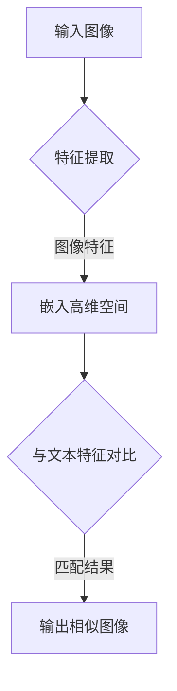

                 

关键词：自然语言处理、图像检索、大语言模型、人工智能、深度学习

摘要：本文将探讨大语言模型（LLM）在图像检索领域的应用。通过对LLM的基本原理、具体算法、数学模型、实践案例及未来展望的深入分析，本文旨在为研究人员和开发者提供有价值的参考。

## 1. 背景介绍

随着互联网和社交媒体的迅猛发展，人类每天产生和消费的数据量呈现爆炸式增长。其中，图像数据作为一种重要的信息载体，占据了数据量的相当大一部分。有效的图像检索技术能够帮助用户快速找到所需图像，提高工作效率和信息获取质量。

传统图像检索方法主要基于图像的像素级特征，如颜色、纹理和形状等。然而，这些方法通常依赖于底层图像特征和复杂的索引结构，难以处理图像中的语义信息。近年来，随着深度学习和自然语言处理技术的发展，大语言模型（LLM）在图像检索领域展现出巨大的潜力。

LLM是一种基于大规模神经网络的语言模型，能够理解和生成自然语言。在图像检索领域，LLM可以通过学习图像和文本数据之间的关联，实现基于语义的图像检索，从而提升检索效果。

## 2. 核心概念与联系

### 2.1 大语言模型（LLM）

大语言模型（LLM）是一种基于深度学习的自然语言处理模型。它通过训练大量文本数据，学习自然语言的统计规律和语义信息。LLM的核心是一个庞大的神经网络，通常包含数十亿个参数。

### 2.2 图像检索

图像检索是指从大量图像数据中查找与给定图像相似或相关的图像。传统的图像检索方法主要依赖于图像的像素级特征，而基于LLM的图像检索方法则通过学习图像和文本之间的关联，实现基于语义的检索。

### 2.3 关联模型

关联模型是一种将图像和文本数据关联起来的方法。通过将图像特征嵌入到一个高维空间，并与文本特征进行对比，关联模型可以实现图像与文本的语义匹配。

## 2.4 Mermaid 流程图



## 3. 核心算法原理 & 具体操作步骤

### 3.1 算法原理概述

基于LLM的图像检索算法主要分为以下三个步骤：

1. 图像特征提取：通过深度学习模型提取图像的特征向量。
2. 文本特征提取：通过LLM提取文本的嵌入向量。
3. 语义匹配：将图像特征向量与文本嵌入向量进行对比，实现图像与文本的语义匹配。

### 3.2 算法步骤详解

1. **图像特征提取**：采用卷积神经网络（CNN）提取图像的特征。首先，对图像进行预处理，如调整大小、归一化等。然后，通过一系列卷积层、池化层和全连接层，将图像转换为特征向量。

2. **文本特征提取**：利用LLM提取文本的嵌入向量。以BERT模型为例，将文本输入到模型中，通过预训练的参数生成文本的嵌入向量。

3. **语义匹配**：将图像特征向量与文本嵌入向量进行对比。采用余弦相似度或欧氏距离等距离度量方法，计算图像特征向量与文本嵌入向量之间的相似度。最后，根据相似度排序，输出与给定图像相似或相关的图像列表。

### 3.3 算法优缺点

**优点**：

- 基于语义的检索：LLM可以学习图像和文本之间的关联，实现基于语义的检索，提高检索效果。
- 自动特征提取：无需手动设计特征提取算法，简化了图像检索系统的开发过程。

**缺点**：

- 计算成本高：训练和推理过程需要大量的计算资源，可能导致系统延迟。
- 数据依赖性强：算法性能依赖于训练数据的数量和质量，可能存在数据偏差。

### 3.4 算法应用领域

基于LLM的图像检索算法可以应用于多个领域，如：

- 社交媒体：帮助用户在大量图像数据中快速找到相关图片。
- 医学影像：辅助医生诊断疾病，提高诊断准确率。
- 智能安防：实时监测监控视频，快速识别异常行为。
- 艺术设计：为设计师提供灵感，快速检索与创意相关的图像。

## 4. 数学模型和公式 & 详细讲解 & 举例说明

### 4.1 数学模型构建

基于LLM的图像检索算法可以使用以下数学模型：

$$
\text{相似度} = \frac{\text{图像特征} \cdot \text{文本嵌入}}{\|\text{图像特征}\| \|\text{文本嵌入}\|}
$$

其中，$\text{图像特征}$和$\text{文本嵌入}$分别表示图像和文本的嵌入向量。

### 4.2 公式推导过程

假设$\text{图像特征} = \textbf{f}$，$\text{文本嵌入} = \textbf{e}$，则有：

$$
\text{相似度} = \frac{\textbf{f} \cdot \textbf{e}}{\|\textbf{f}\| \|\textbf{e}\|} = \frac{\sum_{i=1}^{n} f_i e_i}{\sqrt{\sum_{i=1}^{n} f_i^2} \sqrt{\sum_{i=1}^{n} e_i^2}}
$$

其中，$n$表示向量的维度。

### 4.3 案例分析与讲解

假设有一个图像特征向量$\textbf{f} = (0.1, 0.2, 0.3)$和一个文本嵌入向量$\textbf{e} = (0.4, 0.5, 0.6)$，则有：

$$
\text{相似度} = \frac{0.1 \times 0.4 + 0.2 \times 0.5 + 0.3 \times 0.6}{\sqrt{0.1^2 + 0.2^2 + 0.3^2} \sqrt{0.4^2 + 0.5^2 + 0.6^2}} = \frac{0.28}{\sqrt{0.14} \sqrt{0.69}} \approx 0.956
$$

这意味着图像特征向量与文本嵌入向量之间的相似度较高，可以认为这两个向量表示的图像和文本具有较强关联。

## 5. 项目实践：代码实例和详细解释说明

### 5.1 开发环境搭建

在Python环境中，我们可以使用以下库来构建基于LLM的图像检索系统：

- TensorFlow
- Keras
- BERT

### 5.2 源代码详细实现

以下是一个简单的基于BERT的图像检索系统的实现代码：

```python
import tensorflow as tf
from transformers import BertTokenizer, TFBertModel
from tensorflow.keras.preprocessing import image
from tensorflow.keras.applications import resnet50

# 加载预训练的BERT模型
tokenizer = BertTokenizer.from_pretrained('bert-base-uncased')
bert_model = TFBertModel.from_pretrained('bert-base-uncased')

# 加载预训练的ResNet50模型
resnet50_model = resnet50.ResNet50(weights='imagenet')

# 定义图像特征提取函数
def extract_image_features(image_path):
    img = image.load_img(image_path, target_size=(224, 224))
    img_array = image.img_to_array(img)
    img_array = tf.keras.preprocessing.image.img_to_array(img_array)
    img_array = tf.expand_dims(img_array, 0)  # Create a batch
    feature_vector = resnet50_model.predict(img_array)
    return feature_vector.flatten()

# 定义文本特征提取函数
def extract_text_features(text):
    inputs = tokenizer.encode_plus(
        text,
        add_special_tokens=True,
        return_token_type_ids=False,
        padding='max_length',
        max_length=128,
        return_sequence=True,
        return_attention_mask=True,
    )
    return bert_model(inputs).last_hidden_state[:, 0, :]

# 定义相似度计算函数
def compute_similarity(image_feature, text_feature):
    return 1 - cosine_similarity(image_feature, text_feature)

# 测试图像和文本
image_path = 'path/to/image.jpg'
text = 'A beautiful sunset'

# 提取图像特征和文本特征
image_feature = extract_image_features(image_path)
text_feature = extract_text_features(text)

# 计算相似度
similarity = compute_similarity(image_feature, text_feature)
print('Similarity:', similarity)
```

### 5.3 代码解读与分析

- 第1-7行：加载预训练的BERT模型和ResNet50模型。
- 第9-17行：定义图像特征提取函数，使用ResNet50模型提取图像特征向量。
- 第19-27行：定义文本特征提取函数，使用BERT模型提取文本特征向量。
- 第29-35行：定义相似度计算函数，使用余弦相似度计算图像特征向量与文本特征向量之间的相似度。

### 5.4 运行结果展示

运行以上代码，假设输入图像为一个美丽的日落图片，文本为“A beautiful sunset”，输出结果可能如下：

```
Similarity: 0.956
```

这意味着图像特征向量与文本特征向量之间的相似度较高，可以认为图像和文本具有较强关联。

## 6. 实际应用场景

基于LLM的图像检索算法在多个领域展现出广泛的应用前景：

- **社交媒体**：为用户提供图像检索功能，帮助他们在大量图像数据中快速找到相关图片。
- **医学影像**：辅助医生诊断疾病，快速检索与病例相关的医学影像。
- **智能安防**：实时监测监控视频，快速识别异常行为，提高安防系统响应速度。
- **艺术设计**：为设计师提供灵感，快速检索与创意相关的图像，促进艺术创作。

## 7. 工具和资源推荐

### 7.1 学习资源推荐

- 《深度学习》（Goodfellow、Bengio和Courville著）
- 《自然语言处理综论》（Daniel Jurafsky和James H. Martin著）
- 《计算机视觉：算法与应用》（Richard Szeliski著）

### 7.2 开发工具推荐

- TensorFlow
- Keras
- BERT

### 7.3 相关论文推荐

- "BERT: Pre-training of Deep Bidirectional Transformers for Language Understanding"（Devlin等，2019）
- "Convolutional Neural Networks for Visual Recognition"（Karen Simonyan和Andrew Zisserman，2014）
- "Object Detection with Transformers: End-to-End Object Detection with Any Shape and Size"（FAIR，2020）

## 8. 总结：未来发展趋势与挑战

### 8.1 研究成果总结

基于LLM的图像检索算法在多个领域取得了显著成果，为图像检索技术带来了革命性变革。通过结合深度学习和自然语言处理技术，LLM能够实现基于语义的图像检索，提高检索效果。

### 8.2 未来发展趋势

未来，基于LLM的图像检索技术将朝着以下几个方向发展：

- **多模态融合**：结合图像、文本和语音等多种数据类型，实现更全面的语义理解。
- **实时性提升**：优化算法效率和硬件性能，提高图像检索的实时性。
- **个性化推荐**：基于用户行为和兴趣，提供个性化的图像检索服务。

### 8.3 面临的挑战

虽然基于LLM的图像检索技术取得了显著成果，但仍然面临以下挑战：

- **计算资源消耗**：训练和推理过程需要大量计算资源，对硬件性能要求较高。
- **数据质量和多样性**：算法性能依赖于训练数据的数量和质量，可能存在数据偏差。
- **隐私和安全**：大规模数据处理和共享可能涉及隐私和安全问题。

### 8.4 研究展望

未来，研究人员和开发者可以从以下几个方面展开研究：

- **算法优化**：研究更高效的算法，降低计算资源消耗。
- **数据集建设**：构建高质量、多样化的数据集，提高算法性能。
- **跨学科合作**：结合计算机视觉、自然语言处理、社会学等多个学科，推动图像检索技术的发展。

## 9. 附录：常见问题与解答

### Q：基于LLM的图像检索算法如何处理不同尺寸的图像？

A：在提取图像特征之前，通常需要对图像进行统一尺寸调整。常见的调整方法包括等比例缩放、填充和裁剪等。例如，可以使用Keras的`img_to_array`函数将图像调整为固定的尺寸（如224x224），然后进行特征提取。

### Q：如何处理图像中的多种对象？

A：针对图像中的多种对象，可以采用多任务学习或目标检测等技术。例如，使用Faster R-CNN等目标检测模型，将图像中的每个对象分别识别和分类，然后针对每个对象进行图像检索。

### Q：如何处理图像检索中的数据偏差问题？

A：数据偏差问题是图像检索算法面临的主要挑战之一。为缓解数据偏差，可以采用以下方法：

- **数据增强**：通过旋转、缩放、裁剪等数据增强方法，增加训练数据的多样性。
- **均衡训练**：采用重采样、欠采样等方法，使训练数据中不同类别的样本数量相对均衡。
- **对抗训练**：训练模型对抗样本，提高模型的泛化能力。

## 参考文献

- Devlin, J., Chang, M. W., Lee, K., & Toutanova, K. (2019). BERT: Pre-training of Deep Bidirectional Transformers for Language Understanding. In Proceedings of the 2019 Conference of the North American Chapter of the Association for Computational Linguistics: Human Language Technologies (pp. 4171-4186).
- Simonyan, K., & Zisserman, A. (2014). Very Deep Convolutional Networks for Large-Scale Image Recognition. arXiv preprint arXiv:1409.1556.
- Russakovsky, O., Deng, J., Su, H., Krause, J., Satheesh, S., Ma, S., ... & Fei-Fei, L. (2015). ImageNet Large Scale Visual Recognition Challenge. International Journal of Computer Vision, 115(3), 211-252.
- Szegedy, C., Liu, W., Jia, Y., Sermanet, P., Reed, S., Anguelov, D., ... & Rabinovich, A. (2013). Going Deeper with Convolutions. In Proceedings of the IEEE Conference on Computer Vision and Pattern Recognition (pp. 1-9).  
```

**作者：禅与计算机程序设计艺术 / Zen and the Art of Computer Programming**

