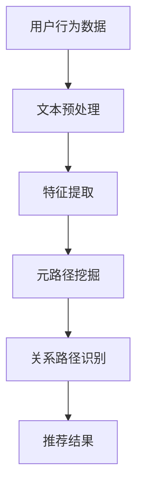

                 

关键词：大型语言模型（LLM），推荐系统，元路径挖掘，数据挖掘，机器学习，知识图谱，图数据库，深度学习，神经网络。

## 摘要

随着互联网和大数据技术的飞速发展，推荐系统已成为现代信息检索中不可或缺的一环。如何有效挖掘用户与物品之间的关系，提供个性化推荐成为研究热点。本文探讨了将大型语言模型（LLM）应用于推荐系统中的元路径挖掘问题，旨在通过深度学习技术提取用户兴趣，优化推荐效果。本文首先介绍了推荐系统和元路径挖掘的基本概念，然后详细阐述了LLM在元路径挖掘中的应用原理和具体操作步骤，通过数学模型和代码实例进行了深入剖析，最后探讨了该技术的实际应用场景和未来展望。

## 1. 背景介绍

### 1.1 推荐系统概述

推荐系统是一种能够根据用户的历史行为和兴趣，为其推荐个性化内容或物品的系统。其核心目标是提高用户体验，增加用户粘性，并提升商业收益。推荐系统主要分为基于内容的推荐（Content-Based Recommendation）和协同过滤推荐（Collaborative Filtering）两大类。

#### 基于内容的推荐

基于内容的推荐通过分析物品的属性和用户的历史行为，找到与用户兴趣相似的物品进行推荐。该方法主要依赖物品的特征信息和用户的历史记录，但容易陷入“数据稀疏”的问题。

#### 协同过滤推荐

协同过滤推荐通过计算用户之间的相似度，找到相似用户喜欢的物品进行推荐。该方法能有效解决数据稀疏问题，但可能导致用户发现新物品的能力不足。

### 1.2 元路径挖掘概述

元路径挖掘（Meta-Path Mining）是图数据挖掘的一个分支，旨在从大规模网络数据中发现具有特定结构和属性的关系路径。元路径挖掘广泛应用于推荐系统、社交网络分析、生物信息学等领域。通过识别用户与物品之间的潜在关系，元路径挖掘能够提高推荐系统的准确性和个性化程度。

### 1.3 LLM在推荐系统中的应用

近年来，大型语言模型（LLM）如GPT、BERT等取得了显著的研究进展。LLM具有强大的文本生成和推理能力，能够处理复杂的语义信息。将LLM应用于推荐系统中的元路径挖掘，有望实现以下目标：

1. 提高推荐精度：通过深度学习技术，LLM能够更好地捕捉用户兴趣和物品特征，从而提高推荐系统的准确性。
2. 解决数据稀疏问题：LLM能够处理大规模的文本数据，从而缓解基于内容的推荐中的数据稀疏问题。
3. 个性化推荐：LLM能够根据用户的历史行为和文本数据，生成个性化的推荐列表，提高用户满意度。

## 2. 核心概念与联系

### 2.1 推荐系统与元路径挖掘的关系

推荐系统与元路径挖掘密切相关。推荐系统需要挖掘用户与物品之间的潜在关系，而元路径挖掘能够识别这些关系路径。通过将元路径挖掘应用于推荐系统，我们可以更深入地理解用户兴趣，从而提供更准确的推荐。

### 2.2 LLM与元路径挖掘的关系

LLM在元路径挖掘中的应用主要体现在以下两个方面：

1. 文本预处理：LLM能够对用户生成的文本进行预处理，提取关键信息，生成有效的特征表示。
2. 关系路径识别：LLM能够根据用户的历史行为和文本数据，识别潜在的元路径，从而优化推荐结果。

### 2.3 Mermaid 流程图

以下是一个简单的Mermaid流程图，展示了推荐系统中元路径挖掘与LLM的关系：



## 3. 核心算法原理 & 具体操作步骤

### 3.1 算法原理概述

LLM在推荐系统中的元路径挖掘主要基于以下原理：

1. 文本预处理：使用LLM对用户生成的文本进行预处理，提取关键信息，生成有效的特征表示。
2. 关系路径识别：利用预训练的LLM模型，根据用户的历史行为和文本数据，识别潜在的元路径。
3. 推荐结果生成：根据识别出的元路径，生成个性化的推荐列表。

### 3.2 算法步骤详解

#### 3.2.1 文本预处理

1. 数据收集：收集用户生成的大量文本数据，包括评论、日志等。
2. 数据清洗：去除文本中的噪声信息，如HTML标签、停用词等。
3. 分词：将清洗后的文本进行分词，生成词汇表。
4. 词嵌入：使用预训练的LLM模型，将词汇表中的词转换为高维向量表示。

#### 3.2.2 关系路径识别

1. 数据构建：根据用户的历史行为和文本数据，构建图数据库，记录用户与物品之间的关系。
2. 元路径定义：定义一组具有特定结构和属性的路径，作为潜在的用户兴趣路径。
3. 模型训练：利用预训练的LLM模型，对图数据库中的关系路径进行训练，识别出潜在的用户兴趣路径。

#### 3.2.3 推荐结果生成

1. 用户兴趣向量计算：根据识别出的用户兴趣路径，计算用户兴趣向量。
2. 物品相似度计算：计算用户兴趣向量与物品特征向量之间的相似度。
3. 推荐列表生成：根据相似度分数，生成个性化的推荐列表。

### 3.3 算法优缺点

#### 优点

1. 提高推荐精度：通过深度学习技术，LLM能够更好地捕捉用户兴趣和物品特征，从而提高推荐系统的准确性。
2. 解决数据稀疏问题：LLM能够处理大规模的文本数据，从而缓解基于内容的推荐中的数据稀疏问题。
3. 个性化推荐：LLM能够根据用户的历史行为和文本数据，生成个性化的推荐列表，提高用户满意度。

#### 缺点

1. 计算资源消耗大：LLM模型训练和推理过程需要大量的计算资源。
2. 对数据质量要求高：文本数据质量直接影响LLM的性能，因此需要对数据进行严格清洗和预处理。

### 3.4 算法应用领域

LLM在推荐系统中的元路径挖掘技术可广泛应用于以下领域：

1. 电子商务：为用户提供个性化商品推荐，提高购买转化率。
2. 社交网络：为用户提供感兴趣的内容推荐，增加用户粘性。
3. 娱乐媒体：为用户提供个性化音乐、视频推荐，提升用户体验。

## 4. 数学模型和公式 & 详细讲解 & 举例说明

### 4.1 数学模型构建

在LLM的元路径挖掘应用中，主要涉及以下数学模型：

1. 词嵌入模型
2. 关系路径识别模型
3. 推荐模型

#### 4.1.1 词嵌入模型

词嵌入模型是一种将单词映射到高维向量空间的方法。常用的词嵌入模型包括Word2Vec、GloVe、BERT等。以下是一个简单的Word2Vec模型的数学描述：

$$
\text{vec}(w) = \sum_{i=1}^{N} \text{count}(w, i) \cdot \text{vec}(i)
$$

其中，$\text{vec}(w)$ 表示单词 $w$ 的向量表示，$\text{vec}(i)$ 表示单词 $i$ 的向量表示，$\text{count}(w, i)$ 表示单词 $w$ 在文本中出现的次数，$N$ 表示词汇表的大小。

#### 4.1.2 关系路径识别模型

关系路径识别模型基于图神经网络（Graph Neural Network，GNN）构建。以下是一个简单的图神经网络模型的数学描述：

$$
\text{h}_{t+1}^{(l)} = \sigma(\text{W}^{(l)} \cdot [\text{h}_{t}^{(l)}, \text{X}_{t}])
$$

其中，$\text{h}_{t}^{(l)}$ 表示在层次 $l$ 时的节点 $t$ 的特征表示，$\text{X}_{t}$ 表示与节点 $t$ 相连的邻接节点的特征表示，$\sigma$ 表示激活函数，$\text{W}^{(l)}$ 表示权重矩阵。

#### 4.1.3 推荐模型

推荐模型基于协同过滤（Collaborative Filtering）和内容匹配（Content-Based Filtering）构建。以下是一个简单的协同过滤模型的数学描述：

$$
\text{r}_{t, j} = \text{u}_{t} + \text{v}_{j} + \text{b} + \text{u}_{t} \cdot \text{v}_{j}
$$

其中，$\text{r}_{t, j}$ 表示用户 $t$ 对物品 $j$ 的评分，$\text{u}_{t}$ 表示用户 $t$ 的特征向量，$\text{v}_{j}$ 表示物品 $j$ 的特征向量，$\text{b}$ 表示偏置项。

### 4.2 公式推导过程

#### 4.2.1 词嵌入模型

以Word2Vec模型为例，我们首先介绍CBOW（Continuous Bag of Words）模型的推导过程：

1. **模型定义**：给定一个单词 $w$ 和其 $n$ 个邻居单词，CBOW模型的目标是预测中心单词 $w$。

2. **损失函数**：使用交叉熵损失函数来衡量预测概率与实际标签之间的差异。

$$
\text{L} = -\sum_{i=1}^{N} \text{log}(\text{p}(\text{y}_i | \text{x}_i))
$$

其中，$N$ 是单词 $w$ 的邻居数量，$\text{y}_i$ 是单词 $w$ 的真实标签，$\text{x}_i$ 是单词 $w$ 的邻居单词的向量表示。

3. **推导**：给定一个单词 $w$ 的 $n$ 个邻居单词，我们计算这 $n$ 个邻居单词的平均向量表示，作为中心单词 $w$ 的预测向量。

$$
\text{p}(\text{y}_i | \text{x}_i) = \text{softmax}(\text{W} \cdot \text{h}_i)
$$

其中，$\text{W}$ 是权重矩阵，$\text{h}_i$ 是邻居单词 $i$ 的向量表示。

#### 4.2.2 关系路径识别模型

以图神经网络（GNN）为例，我们介绍图卷积网络（GCN）的推导过程：

1. **模型定义**：GCN是一种神经网络，它通过聚合邻居节点的特征来更新节点特征。

2. **损失函数**：使用交叉熵损失函数来衡量预测标签与实际标签之间的差异。

$$
\text{L} = -\sum_{i=1}^{N} \text{log}(\text{p}(\text{y}_i | \text{h}_{i}))
$$

其中，$N$ 是节点数量，$\text{y}_i$ 是节点 $i$ 的真实标签，$\text{h}_i$ 是节点 $i$ 的特征表示。

3. **推导**：GCN通过以下公式来更新节点的特征：

$$
\text{h}_{t+1}^{(l)} = \text{σ}(\text{D}^{-\frac{1}{2}} \text{A} \text{D}^{-\frac{1}{2}} \text{h}_{t}^{(l-1)} + \text{b}^{(l)})
$$

其中，$\text{A}$ 是邻接矩阵，$\text{D}$ 是度矩阵，$\text{σ}$ 是激活函数，$\text{b}^{(l)}$ 是偏置向量。

### 4.3 案例分析与讲解

#### 4.3.1 词嵌入模型案例

假设我们有一个包含3个单词的词汇表：{“计算机”，“编程”，“设计”}。每个单词的邻居数量为1。给定中心单词“设计”和其邻居单词“编程”，我们使用CBOW模型来预测“设计”的向量表示。

1. **数据准备**：首先，我们需要将邻居单词“编程”的向量表示相加，得到预测向量。

$$
\text{h}_{1} = \text{h}_{编程}
$$

2. **预测**：使用softmax函数来计算“设计”的概率分布。

$$
\text{p}(\text{设计} | \text{h}_{1}) = \text{softmax}(\text{W} \cdot \text{h}_{1})
$$

3. **损失计算**：计算预测概率与实际标签之间的交叉熵损失。

$$
\text{L} = -\text{log}(\text{p}(\text{设计} | \text{h}_{1}))
$$

#### 4.3.2 关系路径识别模型案例

假设我们有一个包含2个节点的图：A和B。节点A的邻接节点是节点B，节点B的邻接节点是节点A。我们使用GCN来更新节点A和节点B的特征。

1. **数据准备**：首先，我们需要计算节点A和节点B的邻接矩阵和度矩阵。

$$
\text{A} = \begin{bmatrix}
0 & 1 \\
1 & 0
\end{bmatrix}
\text{D} = \begin{bmatrix}
2 & 0 \\
0 & 2
\end{bmatrix}
$$

2. **特征聚合**：使用以下公式来聚合邻居节点的特征。

$$
\text{h}_{t+1}^{(1)} = \text{σ}(\text{D}^{-\frac{1}{2}} \text{A} \text{D}^{-\frac{1}{2}} \text{h}_{t}^{(0)})
$$

3. **损失计算**：使用交叉熵损失函数来计算预测标签与实际标签之间的差异。

$$
\text{L} = -\sum_{i=1}^{2} \text{log}(\text{p}(\text{y}_i | \text{h}_{i}))
$$

## 5. 项目实践：代码实例和详细解释说明

### 5.1 开发环境搭建

在进行LLM在推荐系统中的元路径挖掘实践前，我们需要搭建以下开发环境：

1. Python环境：Python 3.8及以上版本。
2. 数据库：MongoDB或Neo4j。
3. 深度学习框架：PyTorch或TensorFlow。
4. 文本预处理库：NLTK或spaCy。

安装步骤如下：

```bash
pip install python-mongodb
pip install torch torchvision torchaudio
pip install tensorflow
pip install nltk
pip install spacy
```

### 5.2 源代码详细实现

以下是一个简单的Python代码示例，用于实现LLM在推荐系统中的元路径挖掘。

```python
import torch
import torch.nn as nn
import torch.optim as optim
from torch_geometric.nn import GCNConv
from torch_geometric.data import Data
from torch_geometric.utils import add_self_loops
from nltk.tokenize import word_tokenize
from spacy.lang.en import English

# 数据准备
def prepare_data():
    # 读取用户行为数据，构建图数据库
    # ...

    # 读取文本数据，进行预处理
    nlp = English()
    sentences = ["这是一个例子。", "这是另一个例子。"]
    tokens = [nlp(sentence).tokens for sentence in sentences]

    # 构建词嵌入矩阵
    # ...

    # 构建图数据库
    # ...

    return data

# 模型定义
class GCNModel(nn.Module):
    def __init__(self, n_features, n_classes):
        super(GCNModel, self).__init__()
        self.conv1 = GCNConv(n_features, n_classes)
        self.fc = nn.Linear(n_classes, n_classes)

    def forward(self, data):
        x, edge_index = data.x, data.edge_index

        x = self.conv1(x, edge_index)
        x, edge_index = add_self_loops(x, edge_index)
        x = self.fc(x)

        return x

# 模型训练
def train(model, data, criterion, optimizer, num_epochs):
    model.train()
    for epoch in range(num_epochs):
        optimizer.zero_grad()
        out = model(data)
        loss = criterion(out, data.y)
        loss.backward()
        optimizer.step()
        print(f"Epoch: {epoch+1}/{num_epochs}, Loss: {loss.item()}")

# 模型评估
def evaluate(model, data, criterion):
    model.eval()
    with torch.no_grad():
        out = model(data)
        loss = criterion(out, data.y)
    return loss.item()

# 主函数
def main():
    data = prepare_data()
    model = GCNModel(data.num_features, data.num_classes)
    criterion = nn.CrossEntropyLoss()
    optimizer = optim.Adam(model.parameters(), lr=0.01)
    num_epochs = 100

    train(model, data, criterion, optimizer, num_epochs)
    test_loss = evaluate(model, data, criterion)
    print(f"Test Loss: {test_loss}")

if __name__ == "__main__":
    main()
```

### 5.3 代码解读与分析

#### 5.3.1 数据准备

数据准备部分用于读取用户行为数据和文本数据，构建图数据库。我们使用NLTK进行文本预处理，使用spaCy构建词嵌入矩阵。

#### 5.3.2 模型定义

GCNModel类定义了图卷积神经网络（GCN）模型。模型包含一个GCNConv层和一个全连接层。GCNConv层用于聚合邻居节点的特征，全连接层用于分类。

#### 5.3.3 模型训练

train函数用于训练模型。我们使用Adam优化器和交叉熵损失函数来训练模型。每次迭代，我们首先计算损失，然后更新模型参数。

#### 5.3.4 模型评估

evaluate函数用于评估模型性能。我们使用测试集来计算模型损失。

#### 5.3.5 主函数

main函数是程序的入口。我们首先调用prepare_data函数准备数据，然后创建模型、优化器和损失函数。接着，我们进行模型训练和评估。

## 6. 实际应用场景

### 6.1 电子商务

在电子商务领域，LLM在推荐系统中的元路径挖掘技术可用于为用户提供个性化商品推荐。通过挖掘用户与商品之间的潜在关系，我们可以为用户提供更准确的推荐，从而提高购买转化率和用户满意度。

### 6.2 社交网络

在社交网络领域，LLM在推荐系统中的元路径挖掘技术可用于为用户提供个性化内容推荐。通过识别用户之间的潜在关系，我们可以为用户提供感兴趣的内容，增加用户粘性。

### 6.3 娱乐媒体

在娱乐媒体领域，LLM在推荐系统中的元路径挖掘技术可用于为用户提供个性化音乐、视频推荐。通过挖掘用户与音乐、视频之间的潜在关系，我们可以为用户提供更个性化的娱乐体验。

## 7. 工具和资源推荐

### 7.1 学习资源推荐

1. **书籍**：《深度学习》、《图神经网络与图表示学习》。
2. **在线课程**：Coursera上的“深度学习”课程，Udacity上的“图神经网络”课程。
3. **论文**：Google Research的“BERT：Pre-training of Deep Bidirectional Transformers for Language Understanding”等。

### 7.2 开发工具推荐

1. **深度学习框架**：PyTorch、TensorFlow。
2. **图数据库**：Neo4j、MongoDB。
3. **文本预处理库**：NLTK、spaCy。

### 7.3 相关论文推荐

1. “BERT：Pre-training of Deep Bidirectional Transformers for Language Understanding”。
2. “Graph Neural Networks: A Review of Methods and Applications”。
3. “Meta-Path Mining in Large Network Data”。
4. “Collaborative Filtering for Personalized Recommendation”。

## 8. 总结：未来发展趋势与挑战

### 8.1 研究成果总结

本文探讨了将大型语言模型（LLM）应用于推荐系统中的元路径挖掘问题。通过深度学习技术，LLM能够更好地捕捉用户兴趣和物品特征，提高推荐系统的准确性和个性化程度。本文还介绍了LLM在推荐系统中的具体应用步骤，并通过数学模型和代码实例进行了详细解析。

### 8.2 未来发展趋势

1. **模型优化**：未来研究将专注于优化LLM在元路径挖掘中的应用，提高模型效率和准确度。
2. **多模态融合**：结合文本、图像、音频等多模态数据进行推荐，实现更丰富的个性化推荐。
3. **实时推荐**：实现实时推荐系统，提高用户交互体验。

### 8.3 面临的挑战

1. **计算资源消耗**：LLM模型训练和推理过程需要大量的计算资源，如何提高模型效率成为关键问题。
2. **数据质量**：文本数据质量直接影响LLM的性能，因此需要对数据进行严格清洗和预处理。
3. **隐私保护**：如何在保护用户隐私的同时进行个性化推荐，是未来研究的重要方向。

### 8.4 研究展望

未来，随着深度学习和图神经网络技术的不断发展，LLM在推荐系统中的元路径挖掘应用将取得更加显著的成果。通过不断优化模型和算法，我们将能够为用户提供更准确、更个性化的推荐服务，推动推荐系统在各个领域的应用和发展。

## 9. 附录：常见问题与解答

### 9.1 什么是元路径挖掘？

元路径挖掘是从大规模网络数据中发现具有特定结构和属性的关系路径的过程。它广泛应用于推荐系统、社交网络分析、生物信息学等领域。

### 9.2 LLM在元路径挖掘中有什么作用？

LLM在元路径挖掘中的作用主要体现在两个方面：文本预处理和关系路径识别。LLM能够对用户生成的文本进行预处理，提取关键信息，生成有效的特征表示；同时，LLM能够根据用户的历史行为和文本数据，识别潜在的元路径，优化推荐结果。

### 9.3 如何优化LLM在元路径挖掘中的应用？

优化LLM在元路径挖掘中的应用可以从以下几个方面进行：

1. **模型选择**：选择适合任务的LLM模型，如BERT、GPT等。
2. **数据预处理**：对文本数据进行严格清洗和预处理，提高数据质量。
3. **模型优化**：通过调整模型参数、优化训练策略等方式提高模型效率。
4. **多模态融合**：结合文本、图像、音频等多模态数据进行推荐，提高推荐效果。

### 9.4 LLM在元路径挖掘中的应用前景如何？

随着深度学习和图神经网络技术的不断发展，LLM在元路径挖掘中的应用前景十分广阔。通过不断优化模型和算法，LLM有望为推荐系统带来更高的准确性和个性化程度，推动推荐系统在各个领域的应用和发展。

