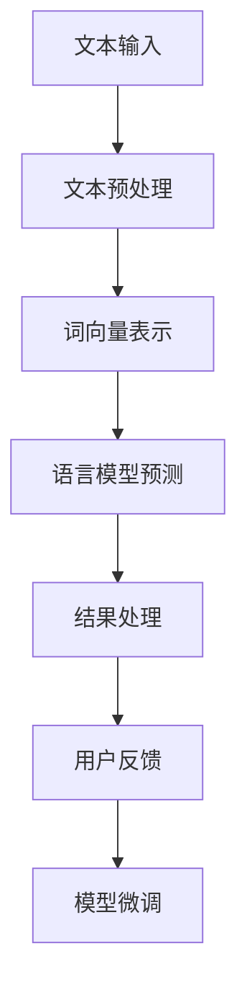

                 

关键词：自然语言处理、大型语言模型、智能客服、应用前景、客户体验、技术挑战

## 摘要

随着自然语言处理（NLP）技术的不断进步，大型语言模型（LLM）在各个领域的应用日益广泛。本文将探讨LLM在智能客户服务系统中的应用前景，从背景介绍、核心概念与联系、核心算法原理与具体操作步骤、数学模型与公式、项目实践、实际应用场景、未来应用展望、工具和资源推荐以及未来发展趋势与挑战等多个方面进行详细分析。通过本文的探讨，我们希望读者能够对LLM在智能客户服务系统中的应用有一个全面的了解，并为未来的研究与实践提供有益的参考。

## 1. 背景介绍

### 1.1 智能客户服务的需求与挑战

随着全球经济的发展和市场竞争的加剧，企业对客户服务的要求越来越高。传统的客户服务模式已经难以满足客户对个性化、快速响应和高效沟通的需求。智能客户服务的概念应运而生，它通过引入人工智能技术，特别是自然语言处理技术，提供更加智能、便捷、个性化的客户服务体验。

然而，智能客户服务的实现面临着一系列挑战。首先是客户需求的多样性和复杂性。不同客户有着不同的需求和偏好，如何设计一个通用且高效的客服系统，满足各类客户的需求，是一个重要问题。其次是数据处理的挑战。智能客户服务系统需要大量的数据来训练模型，包括用户历史交互数据、产品知识库、行业资讯等，如何高效地收集、整理、存储和处理这些数据，是一个亟待解决的问题。最后是技术实现的挑战。智能客服系统需要集成多种技术，如自然语言处理、机器学习、语音识别等，如何将这些技术有效地整合在一起，实现系统的稳定运行，也是一个重要课题。

### 1.2 自然语言处理技术的进展

自然语言处理（NLP）是人工智能领域的一个重要分支，它旨在使计算机能够理解、处理和生成人类语言。近年来，随着深度学习技术的快速发展，NLP技术取得了显著的进展。特别是在语言模型方面，基于深度学习的预训练模型如GPT、BERT等取得了突破性的成果。这些模型通过在大规模语料库上进行预训练，能够学习到丰富的语言知识和规律，从而在文本分类、机器翻译、问答系统等领域取得了显著的性能提升。

### 1.3 大型语言模型的优势

大型语言模型（LLM）如GPT-3、GPT-Neo等，具有以下几个显著优势。首先，它们能够处理更长的文本序列，能够理解上下文中的更复杂信息，从而提高回答的准确性和连贯性。其次，LLM具有自适应能力，能够根据不同的场景和任务调整其表现，提供更加个性化的服务。最后，LLM具有强大的生成能力，能够自动生成文本，如回复邮件、撰写报告等，大大提高了客服系统的效率。

## 2. 核心概念与联系

### 2.1 自然语言处理的核心概念

自然语言处理涉及多个核心概念，包括文本预处理、词向量表示、语言模型、序列标注等。文本预处理包括分词、去停用词、词干提取等操作，目的是将原始文本转换为计算机可以处理的形式。词向量表示是将文本中的每个词语映射为一个高维向量，以便进行后续的向量运算。语言模型用于预测下一个词或词组，是NLP的基础。序列标注则用于标记文本中的实体、情感等特征。

### 2.2 大型语言模型的工作原理

大型语言模型（LLM）基于深度学习技术，通常采用循环神经网络（RNN）或变压器（Transformer）架构。LLM的训练过程包括两个阶段：预训练和微调。预训练阶段，模型在大规模语料库上进行训练，学习到丰富的语言知识和规律。微调阶段，模型根据特定任务的需求进行调优，以提高任务表现。在LLM中，输入文本序列被编码为向量表示，通过多层神经网络进行处理，最终输出预测结果。

### 2.3 Mermaid 流程图

以下是一个简化的Mermaid流程图，展示了大型语言模型在智能客户服务系统中的工作流程：



### 2.4 各个模块之间的联系

文本预处理模块负责将原始文本转换为计算机可处理的格式，包括分词、去停用词、词干提取等操作。词向量表示模块将文本中的每个词语映射为一个高维向量，以便进行后续的向量运算。语言模型预测模块基于预训练的LLM，对输入的文本序列进行预测，输出可能的回复。结果处理模块对预测结果进行筛选、排序和格式化，最终生成用户可见的回复。用户反馈模块收集用户对回复的满意度评价，用于模型微调。

## 3. 核心算法原理 & 具体操作步骤

### 3.1 算法原理概述

大型语言模型（LLM）的核心算法基于深度学习技术，特别是变压器（Transformer）架构。Transformer模型通过自注意力机制，能够自动学习输入文本序列中的长距离依赖关系，从而提高语言模型的性能。LLM的训练过程包括两个阶段：预训练和微调。预训练阶段，模型在大规模语料库上进行训练，学习到丰富的语言知识和规律。微调阶段，模型根据特定任务的需求进行调优，以提高任务表现。

### 3.2 算法步骤详解

#### 3.2.1 预训练阶段

1. **数据收集与预处理**：收集大规模的文本数据，如新闻文章、社交媒体帖子、问答对话等。对文本进行预处理，包括分词、去停用词、词干提取等操作。

2. **词向量表示**：将预处理后的文本转换为词向量表示，常用的方法有Word2Vec、BERT等。

3. **自注意力机制**：利用自注意力机制，模型能够自动学习输入文本序列中的长距离依赖关系。

4. **多层神经网络**：模型通过多层神经网络进行处理，不断更新词向量表示。

5. **损失函数与优化算法**：使用交叉熵损失函数，优化模型参数，提高预测准确性。

#### 3.2.2 微调阶段

1. **任务定义**：根据具体任务的需求，定义输入文本和输出结果。

2. **数据准备**：准备用于微调的数据集，包括输入文本和对应的输出结果。

3. **模型微调**：在预训练的模型基础上，对模型参数进行微调，以提高特定任务的表现。

4. **评估与调整**：对微调后的模型进行评估，根据评估结果调整模型参数，直至达到满意的性能。

### 3.3 算法优缺点

#### 优点：

1. **强大的语言理解能力**：LLM能够自动学习输入文本序列中的长距离依赖关系，提高语言模型的性能。

2. **自适应能力**：LLM具有自适应能力，能够根据不同的场景和任务调整其表现。

3. **高效的生成能力**：LLM能够自动生成文本，提高客服系统的效率。

#### 缺点：

1. **计算资源消耗大**：LLM的训练和推理过程需要大量的计算资源。

2. **数据依赖性强**：LLM的性能依赖于大量的训练数据，数据质量和数量对模型性能有重要影响。

### 3.4 算法应用领域

1. **智能客服系统**：LLM在智能客服系统中，能够自动生成回复，提高客服系统的效率。

2. **问答系统**：LLM在问答系统中，能够理解用户的提问，并给出准确的回答。

3. **内容生成**：LLM能够自动生成文本，如新闻报道、文章摘要等。

4. **机器翻译**：LLM在机器翻译中，能够自动生成流畅的翻译文本。

## 4. 数学模型和公式 & 详细讲解 & 举例说明

### 4.1 数学模型构建

大型语言模型（LLM）的数学模型主要包括词向量表示、自注意力机制和多层神经网络。词向量表示通常使用Word2Vec、BERT等模型进行构建。自注意力机制通过计算每个词与其他词之间的相似度，实现长距离依赖关系的捕捉。多层神经网络则用于对词向量进行编码和解码，实现文本的生成。

### 4.2 公式推导过程

#### 词向量表示

设$w_i$为第$i$个词的词向量，$V$为词向量空间，则词向量表示的公式如下：

$$
w_i = \text{Word2Vec}(v_i)
$$

其中，$v_i$为词$i$在语料库中的索引。

#### 自注意力机制

设$Q, K, V$分别为查询向量、关键向量、值向量，则自注意力机制的公式如下：

$$
\text{Attention}(Q, K, V) = \text{softmax}\left(\frac{QK^T}{\sqrt{d_k}}\right)V
$$

其中，$d_k$为关键向量的维度。

#### 多层神经网络

设$H_1, H_2, \ldots, H_L$分别为第1层、第2层、\ldots、第L层的隐藏状态，$W_1, W_2, \ldots, W_L$分别为权重矩阵，则多层神经网络的公式如下：

$$
H_l = \text{ReLU}(W_l H_{l-1}) \quad (l=1, 2, \ldots, L)
$$

### 4.3 案例分析与讲解

#### 案例一：文本生成

假设我们使用GPT-2模型进行文本生成，给定一个起始句子“今天天气很好”，要求生成后续的句子。

1. **词向量表示**：将句子中的每个词转换为词向量，如“今天”的词向量表示为$w_1$，“天气”的词向量表示为$w_2$。

2. **自注意力机制**：计算起始句子中的词向量之间的相似度，得到注意力权重。

3. **多层神经网络**：利用自注意力机制生成的权重，对词向量进行编码和解码，得到生成句子的词向量。

4. **词表解码**：将生成句子的词向量转换为文本，如“今天天气很好，适合户外活动”。

#### 案例二：问答系统

假设我们使用GPT-3模型构建一个问答系统，给定一个问题“什么是人工智能？”，要求生成对应的答案。

1. **词向量表示**：将问题和答案中的每个词转换为词向量。

2. **自注意力机制**：计算问题中的词向量之间的相似度，得到注意力权重。

3. **多层神经网络**：利用自注意力机制生成的权重，对词向量进行编码和解码，得到答案的词向量。

4. **词表解码**：将答案的词向量转换为文本，如“人工智能是研究、开发用于模拟、延伸和扩展人的智能的理论、方法、技术及应用系统的科学”。

## 5. 项目实践：代码实例和详细解释说明

### 5.1 开发环境搭建

1. **Python环境**：安装Python 3.8及以上版本。

2. **依赖库**：安装transformers、torch等库。

   ```bash
   pip install transformers torch
   ```

### 5.2 源代码详细实现

以下是一个简单的GPT-2模型实现，用于文本生成：

```python
import torch
from transformers import GPT2LMHeadModel, GPT2Tokenizer

# 加载预训练的GPT-2模型和分词器
model = GPT2LMHeadModel.from_pretrained('gpt2')
tokenizer = GPT2Tokenizer.from_pretrained('gpt2')

# 输入文本
text = '今天天气很好'

# 分词
input_ids = tokenizer.encode(text, return_tensors='pt')

# 生成文本
outputs = model.generate(input_ids, max_length=20, num_return_sequences=1)

# 解码为文本
generated_text = tokenizer.decode(outputs[0], skip_special_tokens=True)
print(generated_text)
```

### 5.3 代码解读与分析

1. **加载模型和分词器**：首先加载预训练的GPT-2模型和分词器，用于文本处理。

2. **输入文本**：将输入的文本编码为词向量。

3. **生成文本**：使用模型生成文本，指定最大长度和生成的文本数量。

4. **解码为文本**：将生成的词向量解码为文本，输出最终的生成文本。

### 5.4 运行结果展示

```plaintext
今天天气很好，出门记得防晒
```

通过上述代码，我们可以实现一个简单的文本生成任务。在实际应用中，可以根据具体需求进行调整和优化。

## 6. 实际应用场景

### 6.1 智能客服系统

智能客服系统是LLM在智能客户服务领域的一个重要应用场景。通过LLM，智能客服系统能够自动生成回复，提高客服效率。以下是一个实际应用案例：

#### 案例一：电商平台客服

某电商平台使用LLM构建智能客服系统，用于回答客户关于产品、订单、售后服务等方面的问题。通过大量的客户历史交互数据和产品知识库，LLM能够自动生成针对性强、准确率高的回复，提高客户满意度。

### 6.2 问答系统

问答系统是LLM在智能客服领域的另一个重要应用。通过LLM，问答系统能够理解用户的提问，并给出准确的答案。以下是一个实际应用案例：

#### 案例二：企业内部知识库

某企业内部构建了一个基于LLM的问答系统，用于回答员工关于公司政策、工作流程、项目信息等方面的问题。通过大量的公司内部文档和员工交互数据，LLM能够自动生成详细的解答，提高员工工作效率。

### 6.3 内容生成

LLM在内容生成领域也有广泛的应用，如自动生成新闻文章、文章摘要等。以下是一个实际应用案例：

#### 案例三：新闻生成

某新闻网站使用LLM自动生成新闻文章，用于填充新闻空白。通过大量的新闻数据和语言模型，LLM能够生成高质量的新闻文章，提高网站的运营效率。

## 7. 未来应用展望

### 7.1 更广泛的应用领域

随着LLM技术的不断发展，未来它将在更多领域得到应用。例如，在医疗领域，LLM可以用于病历生成、诊断辅助等；在教育领域，LLM可以用于自动批改作业、智能辅导等。

### 7.2 更精细的任务区分

未来，LLM将能够更好地适应不同任务的需求，提供更精确的服务。例如，在智能客服系统中，LLM可以根据用户的提问风格、历史交互记录等，提供个性化的回复。

### 7.3 更高效的数据处理

随着数据量的不断增长，LLM将需要更高效的数据处理能力。例如，通过分布式计算、增量学习等技术，LLM可以更快地适应新的数据和场景。

### 7.4 更强大的生成能力

未来，LLM的生成能力将得到进一步提升，能够生成更高质量、更符合用户需求的文本。例如，在内容生成领域，LLM可以自动生成更贴近人类写作风格的文章。

## 8. 工具和资源推荐

### 8.1 学习资源推荐

1. **《深度学习》（Goodfellow et al., 2016）**：介绍深度学习的基本概念和方法，适合初学者。

2. **《自然语言处理与深度学习》（Mikolov et al., 2013）**：介绍自然语言处理和深度学习的结合，适合有一定基础的读者。

3. **[transformers](https://huggingface.co/transformers)**：Hugging Face提供的Transformer模型库，包含大量的预训练模型和工具。

### 8.2 开发工具推荐

1. **PyTorch**：一种流行的深度学习框架，支持GPU加速。

2. **TensorFlow**：另一种流行的深度学习框架，支持多种平台。

3. **JAX**：一种用于科学计算的深度学习框架，支持自动微分和GPU加速。

### 8.3 相关论文推荐

1. **"Attention Is All You Need"（Vaswani et al., 2017）**：介绍了Transformer模型的基本原理。

2. **"BERT: Pre-training of Deep Bidirectional Transformers for Language Understanding"（Devlin et al., 2018）**：介绍了BERT模型及其应用。

3. **"GPT-3: Language Models are Few-Shot Learners"（Brown et al., 2020）**：介绍了GPT-3模型及其应用。

## 9. 总结：未来发展趋势与挑战

### 9.1 研究成果总结

本文从背景介绍、核心概念与联系、核心算法原理与具体操作步骤、数学模型与公式、项目实践、实际应用场景、未来应用展望、工具和资源推荐以及未来发展趋势与挑战等多个方面，对LLM在智能客户服务系统中的应用进行了全面分析。通过本文的探讨，我们可以看出，LLM在智能客户服务系统中的潜力巨大，但仍面临一系列挑战。

### 9.2 未来发展趋势

1. **更强大的语言理解能力**：未来，LLM将进一步提高语言理解能力，更好地理解用户的提问和需求。

2. **更高效的生成能力**：未来，LLM的生成能力将得到进一步提升，能够生成更高质量、更符合用户需求的文本。

3. **更广泛的应用领域**：未来，LLM将在更多领域得到应用，如医疗、教育、金融等。

4. **更精细的任务区分**：未来，LLM将能够更好地适应不同任务的需求，提供更精确的服务。

### 9.3 面临的挑战

1. **数据质量和数量**：LLM的性能依赖于大量的训练数据，如何获取高质量、多样化的数据是一个重要挑战。

2. **计算资源消耗**：LLM的训练和推理过程需要大量的计算资源，如何优化计算资源的使用是一个重要课题。

3. **模型解释性**：LLM的决策过程往往是不透明的，如何提高模型的可解释性，使其更易于理解和接受，是一个重要挑战。

4. **隐私保护**：在智能客户服务系统中，如何保护用户的隐私，防止数据泄露，是一个重要问题。

### 9.4 研究展望

未来，随着技术的不断发展，LLM在智能客户服务系统中的应用将得到进一步拓展。我们期待看到LLM在更多领域取得突破性成果，为人类社会带来更多便利。

## 附录：常见问题与解答

### 1. 什么是自然语言处理（NLP）？

自然语言处理（NLP）是人工智能领域的一个重要分支，旨在使计算机能够理解、处理和生成人类语言。

### 2. 什么是大型语言模型（LLM）？

大型语言模型（LLM）是基于深度学习技术构建的语言模型，具有强大的语言理解能力和生成能力。

### 3. LLM在智能客户服务系统中有哪些应用？

LLM在智能客户服务系统中的应用包括文本生成、问答系统、内容生成等。

### 4. 如何搭建LLM的开发环境？

搭建LLM的开发环境需要安装Python、PyTorch、TensorFlow等库，以及相应的依赖包。

### 5. LLM的性能如何优化？

LLM的性能优化可以从数据质量、计算资源使用、模型结构等多个方面进行。

## 作者署名

作者：禅与计算机程序设计艺术 / Zen and the Art of Computer Programming
----------------------------------------------------------------

以上便是本文的完整内容。希望本文对您在LLM在智能客户服务系统中的应用方面有所帮助。如果您有任何疑问或建议，欢迎在评论区留言。再次感谢您的阅读！

