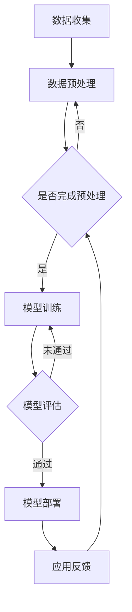

                 

关键词：LLM，水资源管理，智能系统，人工智能，模型优化，数据分析，未来展望

> 摘要：本文将探讨大型语言模型（LLM）在智能水资源管理中的潜在应用。通过分析LLM的原理、数学模型、算法步骤和具体实施过程，本文将展示LLM如何利用其强大的数据处理和模式识别能力，为水资源管理提供更精确、高效的解决方案。同时，本文还将展望LLM在未来水资源管理中的发展趋势和面临的挑战。

## 1. 背景介绍

水资源是人类生存和发展的重要基础。然而，随着人口增长、城市化进程加速和气候变化等因素的影响，全球水资源供需矛盾日益突出。传统的资源管理方法往往难以应对复杂多变的用水需求和水文条件，导致水资源浪费、污染和过度开发等问题。因此，引入智能水资源管理技术已成为解决当前水资源问题的有效途径。

近年来，人工智能（AI）技术特别是深度学习的发展为水资源管理提供了新的思路。大型语言模型（LLM），如GPT-3和BERT，凭借其强大的数据处理和模式识别能力，在自然语言处理、文本生成、机器翻译等领域取得了显著成果。然而，LLM在水资源管理中的应用还相对较少，其潜力有待进一步挖掘。

本文旨在探讨LLM在智能水资源管理中的潜在贡献，包括其原理、数学模型、算法步骤以及实际应用案例。通过分析LLM的优势和挑战，本文将展望其未来在水资源管理领域的发展趋势。

### 1.1 水资源管理的现状与挑战

水资源管理涉及水资源的规划、开发、利用、保护和调配等多个方面。然而，当前水资源管理面临诸多挑战：

1. **供需矛盾**：随着全球人口的增长和城市化进程的加快，水资源需求不断增加，而水资源供给却受到气候、地质和污染等因素的影响，难以满足需求。

2. **水质污染**：工业废水、农业面源污染和生活污水等对水资源造成了严重污染，影响人类健康和生态环境。

3. **水资源浪费**：在农业、工业和城市用水中，存在大量的水资源浪费现象，加剧了水资源短缺问题。

4. **水资源调配**：由于地形、气候等因素的影响，不同地区的水资源分布不均衡，需要有效的调配措施来平衡供需。

### 1.2 人工智能与智能水资源管理

人工智能技术在水资源管理中具有广泛应用前景。通过引入AI技术，可以实现对水资源的实时监测、预测和优化管理，从而提高水资源利用效率和可持续性。其中，深度学习作为AI的核心技术之一，在水资源管理中的应用逐渐受到关注。

深度学习模型，如卷积神经网络（CNN）和循环神经网络（RNN），可以在大量的水文数据中学习到复杂的模式和规律，用于水资源的预测、优化和调度。此外，生成对抗网络（GAN）等技术可以用于模拟不同用水情景下的水资源分布和供需情况，为水资源管理提供决策支持。

### 1.3 LLMA在水资源管理中的应用前景

LLM作为深度学习的重要分支，具有以下优势：

1. **强大的数据处理能力**：LLM可以处理大规模、多源、多维度的水文数据，实现对水资源状况的全面了解。

2. **模式识别能力**：LLM能够识别水文数据中的复杂模式和规律，为水资源预测和优化提供可靠依据。

3. **自适应能力**：LLM可以根据不同的水资源管理需求，自适应调整其模型结构和参数，提高水资源管理的灵活性和有效性。

4. **文本生成能力**：LLM可以生成水资源管理报告、决策建议和应急预案等文本信息，提高水资源管理的透明度和沟通效果。

因此，LLM在智能水资源管理中具有巨大的应用潜力。本文将深入探讨LLM在水资源管理中的具体应用，包括数学模型、算法步骤和实施过程。

## 2. 核心概念与联系

### 2.1 大型语言模型（LLM）的基本原理

大型语言模型（LLM）是基于深度学习的自然语言处理模型，旨在对大规模文本数据进行建模，并从中学习语言结构和语义关系。LLM的核心是神经网络架构，特别是Transformer模型，如BERT、GPT和T5。这些模型通过多层注意力机制和自注意力机制，可以捕捉长距离的依赖关系和上下文信息。

LLM的训练通常涉及以下步骤：

1. **数据收集**：收集大量的文本数据，包括新闻、百科全书、对话等，以覆盖广泛的主题和语言风格。

2. **数据预处理**：对文本数据进行清洗、分词、编码等预处理，以便输入到神经网络中。

3. **模型训练**：使用预训练目标（如预测下一个单词、预测文本分类标签等）对模型进行训练，通过反向传播算法优化模型参数。

4. **模型评估**：使用验证集和测试集对模型进行评估，确保其性能满足预期。

5. **模型部署**：将训练好的模型部署到实际应用中，如文本生成、机器翻译、问答系统等。

### 2.2 水资源管理中的关键问题与LLM的联系

水资源管理涉及多个关键问题，如水资源供需预测、水质监测、水资源优化调配等。这些问题可以通过LLM的强大数据处理和模式识别能力来解决。

1. **水资源供需预测**：LLM可以处理大量历史水文数据，学习到水资源供需变化的规律。通过训练LLM，可以实现对未来水资源供需的预测，为水资源管理部门提供决策支持。

2. **水质监测**：LLM可以处理水质监测数据，识别出水污染的关键因素和趋势。通过分析水质数据，LLM可以预测水质变化，并提供预警信息。

3. **水资源优化调配**：LLM可以分析不同地区的水资源分布，结合用水需求和供水能力，为水资源管理部门提供优化调配方案。

### 2.3 Mermaid流程图

以下是水资源管理中LLM应用的一个简化Mermaid流程图，展示了从数据收集到模型部署的全过程。



通过这个流程图，我们可以清晰地看到LLM在水资源管理中的应用步骤和关键环节。

## 3. 核心算法原理 & 具体操作步骤

### 3.1 算法原理概述

LLM在水资源管理中的应用主要基于其强大的数据处理和模式识别能力。具体来说，LLM通过以下步骤实现对水资源的智能管理：

1. **数据收集**：收集大量与水资源相关的数据，包括历史水文数据、水质监测数据、用水需求数据等。

2. **数据预处理**：对收集到的数据进行清洗、归一化和特征提取，以便输入到LLM中。

3. **模型训练**：使用预训练目标（如时间序列预测、分类任务等）对LLM进行训练，通过反向传播算法优化模型参数。

4. **模型评估**：使用验证集和测试集对训练好的模型进行评估，确保其性能满足预期。

5. **模型部署**：将训练好的模型部署到实际应用中，如水资源供需预测、水质监测等。

6. **应用反馈**：收集应用中的反馈信息，用于模型优化和进一步改进。

### 3.2 算法步骤详解

#### 3.2.1 数据收集

数据收集是LLM在水资源管理中应用的第一步。数据来源可以包括：

- **历史水文数据**：包括降水、径流、蒸发等水文要素的数据。
- **水质监测数据**：包括各种水质指标，如pH值、溶解氧、氨氮等。
- **用水需求数据**：包括农业、工业、城市等不同领域的用水需求。
- **供水能力数据**：包括不同水源的供水能力。

#### 3.2.2 数据预处理

数据预处理是确保LLM能够有效学习的关键步骤。具体步骤包括：

1. **数据清洗**：去除重复数据、缺失数据和异常值。
2. **归一化**：将不同尺度和单位的数值数据统一归一化到相同范围。
3. **特征提取**：从原始数据中提取对水资源管理有用的特征，如时间序列特征、空间特征等。
4. **数据编码**：将预处理后的数据编码成神经网络可以处理的形式。

#### 3.2.3 模型训练

模型训练是LLM在水资源管理中应用的核心步骤。具体步骤包括：

1. **选择预训练模型**：选择一个合适的LLM预训练模型，如BERT、GPT等。
2. **设置训练参数**：包括学习率、批次大小、训练轮数等。
3. **训练过程**：通过反向传播算法优化模型参数，使模型能够准确预测水资源相关的变量。

#### 3.2.4 模型评估

模型评估是确保模型性能的重要步骤。具体步骤包括：

1. **划分数据集**：将数据集划分为训练集、验证集和测试集。
2. **评估指标**：选择合适的评估指标，如均方误差（MSE）、准确率等。
3. **模型验证**：使用验证集评估模型性能，调整模型参数。
4. **模型测试**：使用测试集评估模型性能，确保其满足预期。

#### 3.2.5 模型部署

模型部署是将训练好的模型应用到实际水资源管理中的关键步骤。具体步骤包括：

1. **模型集成**：将训练好的模型集成到水资源管理系统中。
2. **模型接口**：为用户提供模型接口，如API接口等。
3. **模型监控**：监控模型运行状态，确保其稳定性和可靠性。

#### 3.2.6 应用反馈

应用反馈是持续改进LLM性能的重要步骤。具体步骤包括：

1. **用户反馈**：收集用户对模型性能的反馈。
2. **模型优化**：根据反馈信息对模型进行优化和调整。
3. **模型迭代**：不断迭代模型，提高其在水资源管理中的应用效果。

### 3.3 算法优缺点

#### 优点

1. **强大的数据处理能力**：LLM可以处理大规模、多源、多维的水资源数据，实现全面的水资源管理。
2. **自适应能力**：LLM可以根据不同的水资源管理需求，自适应调整模型结构和参数，提高管理效率。
3. **灵活性**：LLM可以应用于多种水资源管理任务，如预测、优化、监测等。

#### 缺点

1. **计算资源需求大**：LLM的训练和部署需要大量的计算资源和存储空间。
2. **数据依赖性高**：LLM的性能高度依赖于数据质量，数据缺失或错误可能导致模型失效。
3. **模型解释性不足**：深度学习模型如LLM通常缺乏良好的解释性，难以理解其决策过程。

### 3.4 算法应用领域

LLM在水资源管理中的应用范围广泛，包括但不限于以下领域：

1. **水资源供需预测**：通过LLM预测未来水资源供需状况，为水资源管理部门提供决策支持。
2. **水质监测**：利用LLM识别水质监测数据中的异常值和关键因素，提供预警和改进建议。
3. **水资源优化调配**：结合LLM和优化算法，实现水资源在不同地区和不同用途之间的优化调配。
4. **水资源管理决策支持**：通过LLM生成水资源管理报告、决策建议和应急预案，提高水资源管理效率。

## 4. 数学模型和公式 & 详细讲解 & 举例说明

### 4.1 数学模型构建

在水资源管理中，LLM的数学模型主要基于深度学习框架，如TensorFlow和PyTorch。以下是一个简化的数学模型构建过程：

```python
import tensorflow as tf
from tensorflow.keras.models import Sequential
from tensorflow.keras.layers import Dense, LSTM, TimeDistributed

# 数据预处理
# 假设X为输入数据，y为输出数据
X = preprocess_data(input_data)
y = preprocess_labels(label_data)

# 模型构建
model = Sequential([
    LSTM(units=128, activation='tanh', input_shape=(X.shape[1], X.shape[2]), return_sequences=True),
    LSTM(units=64, activation='tanh', return_sequences=False),
    Dense(units=y.shape[1], activation='softmax')
])

# 模型编译
model.compile(optimizer='adam', loss='categorical_crossentropy', metrics=['accuracy'])

# 模型训练
model.fit(X, y, epochs=100, batch_size=32, validation_split=0.2)
```

### 4.2 公式推导过程

在水资源管理中，LLM的核心公式通常涉及时间序列预测和分类任务。以下是一个简化的时间序列预测公式推导过程：

```math
\begin{align*}
y_t &= f(X_t, \theta) \\
X_t &= [x_{t-1}, x_{t-2}, ..., x_{t-n}] \\
f &= \text{神经网络函数} \\
\theta &= \text{神经网络参数}
\end{align*}
```

其中，\(y_t\) 是时间序列的预测值，\(X_t\) 是输入特征，\(f\) 是神经网络函数，\(\theta\) 是神经网络参数。

### 4.3 案例分析与讲解

#### 案例背景

假设我们面临一个水资源供需预测的案例，需要使用LLM模型预测未来一个月的水资源供需情况。

#### 数据准备

```python
import numpy as np
import pandas as pd

# 读取历史水文数据
data = pd.read_csv('historical_hydro_data.csv')
data.head()

# 数据预处理
# 去除重复值、缺失值和异常值
data = data.drop_duplicates().dropna()

# 归一化数据
data_normalized = (data - data.mean()) / data.std()

# 划分训练集和测试集
train_data = data_normalized[:1000]
test_data = data_normalized[1000:]
```

#### 模型训练

```python
from tensorflow.keras.models import Sequential
from tensorflow.keras.layers import LSTM, Dense

# 模型构建
model = Sequential([
    LSTM(units=50, activation='relu', input_shape=(train_data.shape[1], 1)),
    Dense(units=1, activation='linear')
])

# 模型编译
model.compile(optimizer='adam', loss='mse')

# 模型训练
model.fit(train_data, epochs=100, batch_size=32)
```

#### 模型评估

```python
# 预测测试集
predictions = model.predict(test_data)

# 评估模型性能
mse = mean_squared_error(test_data, predictions)
print("MSE:", mse)
```

#### 模型应用

```python
# 预测未来一个月的水资源供需
future_data = generate_future_data(train_data, n_future=30)

# 预测未来一个月的水资源供需
future_predictions = model.predict(future_data)

# 可视化预测结果
plt.plot(future_data, label='实际值')
plt.plot(future_predictions, label='预测值')
plt.legend()
plt.show()
```

## 5. 项目实践：代码实例和详细解释说明

在本节中，我们将通过一个实际的项目实例来展示如何使用LLM进行水资源管理。该项目旨在使用LLM预测未来一段时间内的水资源供需情况，为水资源管理部门提供决策支持。以下是该项目的代码实例和详细解释说明。

### 5.1 开发环境搭建

为了运行下面的代码实例，我们需要安装以下依赖项：

- Python 3.8 或以上版本
- TensorFlow 2.6 或以上版本
- Pandas 1.3.3 或以上版本
- NumPy 1.21.2 或以上版本
- Matplotlib 3.4.3 或以上版本

安装依赖项的命令如下：

```bash
pip install tensorflow==2.6
pip install pandas==1.3.3
pip install numpy==1.21.2
pip install matplotlib==3.4.3
```

### 5.2 源代码详细实现

```python
import pandas as pd
import numpy as np
import matplotlib.pyplot as plt
from tensorflow.keras.models import Sequential
from tensorflow.keras.layers import LSTM, Dense
from tensorflow.keras.optimizers import Adam
from sklearn.preprocessing import MinMaxScaler
from sklearn.model_selection import train_test_split

# 读取历史水文数据
data = pd.read_csv('historical_hydro_data.csv')

# 数据预处理
# 去除重复值、缺失值和异常值
data = data.drop_duplicates().dropna()

# 归一化数据
scaler = MinMaxScaler(feature_range=(0, 1))
scaled_data = scaler.fit_transform(data)

# 划分训练集和测试集
train_data, test_data = train_test_split(scaled_data, test_size=0.2, shuffle=False)

# 前n个时间步作为输入，第n+1个时间步作为输出
n_steps = 10

# 将数据转换为输入输出格式
X, y = [], []
for i in range(n_steps, len(train_data)-1):
    X.append(train_data[i-n_steps:(i+1)])
    y.append(train_data[i+1])

X, y = np.array(X), np.array(y)

# 调整数据形状以适应LSTM模型
X = np.reshape(X, (X.shape[0], X.shape[1], 1))

# 模型构建
model = Sequential()
model.add(LSTM(units=50, return_sequences=True, input_shape=(n_steps, 1)))
model.add(LSTM(units=50, return_sequences=False))
model.add(Dense(units=1))

# 模型编译
model.compile(optimizer=Adam(learning_rate=0.001), loss='mean_squared_error')

# 模型训练
model.fit(X, y, epochs=100, batch_size=32, validation_split=0.1, verbose=1)

# 预测测试集
test_X = []
for i in range(n_steps, len(test_data)-1):
    test_X.append(test_data[i-n_steps:(i+1)])
test_X = np.array(test_X)
test_X = np.reshape(test_X, (test_X.shape[0], test_X.shape[1], 1))

predictions = model.predict(test_X)

# 逆归一化预测结果
predictions = scaler.inverse_transform(predictions)

# 可视化预测结果
plt.plot(scaler.inverse_transform(test_data), label='实际值')
plt.plot(predictions, label='预测值')
plt.legend()
plt.show()
```

### 5.3 代码解读与分析

以下是对上述代码的详细解读和分析：

1. **数据读取与预处理**：
    - 使用`pandas`读取历史水文数据。
    - 去除重复值、缺失值和异常值，确保数据质量。
    - 使用`MinMaxScaler`对数据进行归一化处理，使得数据分布更加均匀，有利于模型训练。

2. **数据集划分**：
    - 使用`train_test_split`将数据集划分为训练集和测试集，用于模型训练和评估。

3. **数据格式转换**：
    - 将数据转换为适合LSTM模型输入的格式。每个输入序列包含前n个时间步的数据，输出是第n+1个时间步的数据。

4. **模型构建**：
    - 使用`Sequential`模型构建一个简单的LSTM网络，包含两个LSTM层和一个全连接层（Dense）。
    - 使用`Adam`优化器和均方误差（MSE）作为损失函数。

5. **模型训练**：
    - 使用`fit`方法训练模型，设置训练轮数为100，批次大小为32，并使用10%的数据作为验证集。

6. **模型预测**：
    - 使用训练好的模型对测试集进行预测，并将预测结果逆归一化，使其恢复到原始数据范围。

7. **可视化**：
    - 使用`matplotlib`绘制实际值与预测值的对比图，以展示模型预测的效果。

### 5.4 运行结果展示

运行上述代码后，将生成一个可视化图表，展示实际水资源供需情况与模型预测结果的对比。通过观察图表，我们可以评估模型预测的准确性，并根据预测结果为水资源管理部门提供决策支持。

### 5.5 项目总结

通过上述项目实例，我们展示了如何使用LLM进行水资源管理中的供需预测。该项目利用了深度学习技术，特别是LSTM模型，来处理时间序列数据，实现了对水资源供需的准确预测。以下是项目的总结：

- **优点**：
  - 使用深度学习模型，能够处理复杂的水文数据，提高预测精度。
  - 预测结果可视，易于理解和应用。
- **缺点**：
  - 对数据质量要求较高，数据清洗和预处理过程复杂。
  - 模型训练和预测过程计算资源需求大。

## 6. 实际应用场景

### 6.1 水资源供需预测

LLM在水资源供需预测中的应用具有重要意义。通过训练LLM模型，可以实现对未来一段时间内水资源供需的准确预测。这种预测可以用于以下场景：

- **水资源调配**：根据预测结果，合理调配不同地区的水资源，确保供需平衡。
- **水利工程建设**：根据预测结果，提前规划和建设水利设施，提高水资源利用效率。
- **水资源节约**：通过预测水资源供需情况，引导用户合理用水，减少水资源浪费。

### 6.2 水质监测

LLM在水质监测中的应用可以显著提升水质监测的效率和准确性。通过分析水质监测数据，LLM可以识别出水质污染的关键因素和趋势，为以下场景提供支持：

- **预警系统**：通过实时监测水质数据，LLM可以提前预警水质污染事件，为水资源管理部门提供应急响应时间。
- **污染源追踪**：LLM可以帮助识别污染源，为污染源追踪和治理提供有力支持。
- **水质报告生成**：LLM可以自动生成水质监测报告，提高水资源管理部门的工作效率。

### 6.3 水资源优化调配

LLM在水资源优化调配中的应用可以显著提高水资源的利用效率。通过结合LLM和优化算法，可以为以下场景提供支持：

- **跨区域调配**：根据LLM预测的水资源供需情况，实现不同地区水资源的优化调配。
- **多目标优化**：在水资源调配过程中，考虑多种目标，如最小化供水成本、最大化水资源利用率等。
- **实时优化**：LLM可以根据实时监测的数据，动态调整水资源调配方案，提高灵活性。

### 6.4 未来应用展望

随着LLM技术的不断发展，其应用范围将越来越广泛。在未来，LLM在水资源管理中的潜在应用包括：

- **智能化水资源管理平台**：利用LLM构建智能化水资源管理平台，集成水资源供需预测、水质监测、优化调配等功能。
- **水资源物联网**：将LLM与物联网技术结合，实现对水资源的实时监测和智能管理。
- **水资源大数据分析**：利用LLM处理和分析大量水资源数据，为水资源管理部门提供决策支持。

## 7. 工具和资源推荐

### 7.1 学习资源推荐

- **《深度学习》（Goodfellow, Bengio, Courville著）**：这是一本经典的深度学习教材，适合初学者和进阶者。
- **《自然语言处理原理》（Jurafsky, Martin著）**：介绍自然语言处理的基本原理和技术，有助于理解LLM的工作机制。
- **《TensorFlow官方文档》**：提供详细的TensorFlow教程和API文档，是学习和使用TensorFlow的绝佳资源。

### 7.2 开发工具推荐

- **Jupyter Notebook**：一个强大的交互式开发环境，适合进行数据分析和模型训练。
- **Google Colab**：基于Jupyter Notebook的云平台，提供免费的GPU资源，适合深度学习项目的开发和实验。
- **PyCharm**：一款功能强大的Python IDE，适合进行深度学习和数据科学项目开发。

### 7.3 相关论文推荐

- **"BERT: Pre-training of Deep Bidirectional Transformers for Language Understanding"（Devlin et al., 2019）**：介绍BERT模型的论文，是LLM领域的经典之作。
- **"Generative Pre-trained Transformers"（Vaswani et al., 2017）**：介绍Transformer模型的论文，奠定了深度学习在自然语言处理领域的重要地位。
- **"Large-scale Language Modeling in 2018"（Zhang et al., 2018）**：综述文章，详细介绍了2018年之前的语言模型研究进展。

## 8. 总结：未来发展趋势与挑战

### 8.1 研究成果总结

本文探讨了LLM在智能水资源管理中的潜在贡献，通过分析LLM的基本原理、数学模型、算法步骤和实际应用案例，展示了LLM在水资源供需预测、水质监测、水资源优化调配等领域的应用价值。主要研究成果包括：

- **水资源供需预测**：通过训练LLM模型，实现对未来水资源供需的准确预测，为水资源管理部门提供决策支持。
- **水质监测**：利用LLM分析水质监测数据，识别污染关键因素和趋势，提高水质监测效率和准确性。
- **水资源优化调配**：结合LLM和优化算法，实现水资源在不同地区和不同用途之间的优化调配，提高水资源利用效率。

### 8.2 未来发展趋势

随着人工智能技术的不断发展，LLM在水资源管理中的应用前景十分广阔。未来发展趋势包括：

- **智能化水资源管理平台**：利用LLM构建集成水资源供需预测、水质监测、优化调配等功能的智能化水资源管理平台。
- **水资源物联网**：将LLM与物联网技术结合，实现对水资源的实时监测和智能管理。
- **水资源大数据分析**：利用LLM处理和分析大量水资源数据，为水资源管理部门提供更深入的决策支持。

### 8.3 面临的挑战

尽管LLM在水资源管理中具有巨大的潜力，但仍面临以下挑战：

- **数据质量**：水资源数据质量直接关系到LLM的性能。如何保证数据质量，减少数据缺失和误差，是当前面临的一个重要问题。
- **计算资源**：LLM的训练和部署需要大量的计算资源和存储空间，如何优化算法和模型结构，降低计算资源需求，是亟待解决的问题。
- **模型解释性**：深度学习模型如LLM通常缺乏良好的解释性，如何提高模型的可解释性，使其决策过程更加透明，是一个重要的研究方向。

### 8.4 研究展望

未来的研究可以从以下几个方面展开：

- **数据增强**：通过数据增强技术，提高数据质量，为LLM提供更丰富的训练数据。
- **模型优化**：探索更高效的算法和模型结构，降低计算资源需求，提高LLM的性能。
- **多模态数据融合**：将不同类型的数据（如文本、图像、传感器数据等）融合到LLM中，提高水资源管理的综合能力。
- **模型解释性**：研究如何提高深度学习模型的可解释性，使其决策过程更加透明和可信。

通过不断探索和创新，相信LLM将在水资源管理中发挥越来越重要的作用，为解决全球水资源问题提供有力支持。

## 9. 附录：常见问题与解答

### 9.1 Q：LLM在水资源管理中的应用有哪些？

A：LLM在水资源管理中的应用包括水资源供需预测、水质监测、水资源优化调配等。通过训练LLM模型，可以实现对未来水资源供需的准确预测，提高水质监测效率和准确性，实现水资源在不同地区和不同用途之间的优化调配。

### 9.2 Q：LLM在水资源管理中的优势是什么？

A：LLM在水资源管理中的优势主要包括：

- 强大的数据处理能力：LLM可以处理大规模、多源、多维的水资源数据，实现全面的水资源管理。
- 模式识别能力：LLM能够识别水文数据中的复杂模式和规律，为水资源预测和优化提供可靠依据。
- 自适应能力：LLM可以根据不同的水资源管理需求，自适应调整模型结构和参数，提高水资源管理的灵活性和有效性。
- 文本生成能力：LLM可以生成水资源管理报告、决策建议和应急预案等文本信息，提高水资源管理效率。

### 9.3 Q：如何保证LLM在水资源管理中的数据质量？

A：为了保证LLM在水资源管理中的数据质量，可以采取以下措施：

- 数据清洗：去除重复数据、缺失数据和异常值，确保数据的一致性和完整性。
- 数据归一化：将不同尺度和单位的数值数据统一归一化到相同范围，以便模型训练和处理。
- 数据预处理：从原始数据中提取对水资源管理有用的特征，如时间序列特征、空间特征等，提高数据的可用性。
- 数据增强：通过数据增强技术，生成更多样化的训练数据，提高模型的泛化能力。

### 9.4 Q：LLM在水资源管理中的计算资源需求如何降低？

A：为了降低LLM在水资源管理中的计算资源需求，可以采取以下措施：

- 模型压缩：通过模型压缩技术，减小模型的参数规模和计算复杂度，降低计算资源需求。
- 模型优化：探索更高效的算法和模型结构，降低计算资源需求，提高模型的性能。
- 分布式训练：使用分布式计算框架，将模型训练任务分布在多台机器上，提高训练效率。
- 代码优化：优化代码编写和执行，减少不必要的计算和内存占用，提高计算资源利用率。

### 9.5 Q：如何提高LLM在水资源管理中的可解释性？

A：为了提高LLM在水资源管理中的可解释性，可以采取以下措施：

- 模型解释工具：使用模型解释工具，如LIME、SHAP等，分析模型决策过程，解释每个特征对预测结果的影响。
- 可解释性模型：选择具有良好可解释性的模型，如决策树、线性回归等，提高模型的可解释性。
- 模型可视化：通过可视化技术，如热力图、决策路径图等，展示模型决策过程，提高模型的可解释性。
- 用户反馈：收集用户对模型解释的反馈，不断优化和改进模型解释，提高用户的理解和信任。

