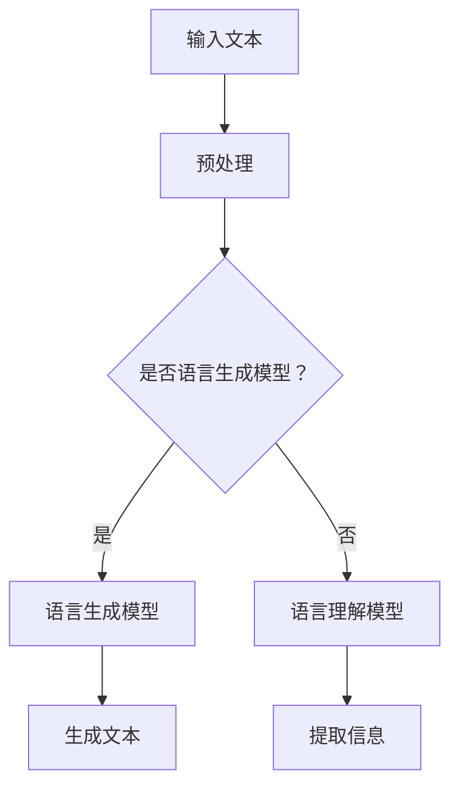

                 

关键词：LLM、社交媒体、内容生成、数据分析、人工智能

> 摘要：本文将深入探讨大型语言模型（LLM）在社交媒体领域的应用，包括内容生成和内容分析。我们将详细分析LLM的核心概念，介绍其原理和实现方法，并探讨其在实际应用中的优势与挑战。此外，我们还将提供具体的数学模型和公式，以便读者更好地理解LLM的工作机制。最后，我们将通过实际项目实践，展示如何使用LLM进行内容生成和分析。

## 1. 背景介绍

社交媒体已经成为人们日常生活中不可或缺的一部分。无论是个人还是企业，都在社交媒体上发布和分享各种内容，以吸引受众、传播信息和建立品牌。然而，随着内容的爆炸性增长，如何有效地生成和管理这些内容成为了挑战。大型语言模型（LLM）的出现，为解决这一难题提供了新的可能性。

LLM是一种基于深度学习的技术，它能够理解和生成自然语言。与传统的人工编写规则或基于统计的方法相比，LLM具有更强的灵活性和创造力。这使得LLM在社交媒体领域具有广泛的应用潜力。

在内容生成方面，LLM可以自动生成各种类型的内容，如文章、博客、广告、新闻摘要等。这不仅减轻了内容创作者的负担，还能够提高内容的质量和多样性。在内容分析方面，LLM可以用于情感分析、主题检测、关键词提取等任务，帮助社交媒体平台更好地理解和满足用户需求。

本文将首先介绍LLM的核心概念，然后深入探讨其工作原理和实现方法。接着，我们将讨论LLM在社交媒体领域的具体应用场景，并分析其优势与挑战。最后，我们将提供具体的数学模型和公式，以便读者更好地理解LLM的工作机制。

## 2. 核心概念与联系

### 2.1. 大型语言模型（LLM）

大型语言模型（LLM）是一种基于神经网络的语言处理技术，它能够理解和生成自然语言。LLM通常使用大量的文本数据进行训练，以学习语言的语法、语义和上下文信息。通过深度学习技术，LLM可以自动提取语言的特征，并利用这些特征进行语言生成和分类。

### 2.2. 语言生成模型

语言生成模型是一种能够生成自然语言的模型。在LLM中，语言生成模型是最核心的部分。它负责将输入的文本转换为输出的文本。语言生成模型通常基于循环神经网络（RNN）或变换器（Transformer）架构，这些架构能够处理长序列数据和并行计算。

### 2.3. 语言理解模型

语言理解模型是一种能够理解自然语言的模型。在LLM中，语言理解模型负责对输入的文本进行分析和理解，以提取出关键信息。语言理解模型可以用于各种任务，如情感分析、主题检测、关键词提取等。

### 2.4. Mermaid 流程图

下面是一个简化的Mermaid流程图，展示了LLM的核心概念和相互联系。



### 2.5. 对比传统方法

与传统的基于规则或统计的方法相比，LLM具有以下优势：

- **灵活性和创造力**：LLM能够生成各种类型的内容，具有更高的灵活性和创造力。
- **大规模数据处理能力**：LLM可以处理大量的文本数据，从而更好地理解语言的上下文和语义。
- **自适应能力**：LLM可以根据不同的应用场景和需求，进行自适应调整。

## 3. 核心算法原理 & 具体操作步骤

### 3.1. 算法原理概述

LLM的核心算法是基于深度学习和神经网络。深度学习是一种机器学习方法，它通过多层神经网络来模拟人脑的学习过程。神经网络由多个节点（或称为神经元）组成，每个节点都通过权重连接到其他节点。

在LLM中，语言生成模型通常采用变换器（Transformer）架构，这是一种基于自注意力机制的神经网络模型。变换器模型通过自注意力机制来捕捉文本序列中的长距离依赖关系，从而生成高质量的文本。

语言理解模型则通常采用循环神经网络（RNN）或其变种，如长短时记忆网络（LSTM）和门控循环单元（GRU）。RNN通过其循环结构来处理序列数据，从而能够捕捉文本序列中的短期依赖关系。

### 3.2. 算法步骤详解

下面是一个简化的LLM算法步骤：

1. **数据预处理**：将输入的文本数据进行预处理，包括分词、去停用词、词向量化等。
2. **输入编码**：将预处理后的文本数据输入到语言生成模型或语言理解模型中。
3. **模型训练**：使用大量的文本数据进行模型训练，调整模型中的权重，使其能够生成或理解高质量的自然语言。
4. **文本生成或理解**：根据具体任务，使用训练好的模型生成文本或理解文本。
5. **后处理**：对生成的文本或理解的文本进行后处理，如去除冗余信息、格式化输出等。

### 3.3. 算法优缺点

**优点**：

- **灵活性和创造力**：LLM能够生成各种类型的内容，具有更高的灵活性和创造力。
- **大规模数据处理能力**：LLM可以处理大量的文本数据，从而更好地理解语言的上下文和语义。
- **自适应能力**：LLM可以根据不同的应用场景和需求，进行自适应调整。

**缺点**：

- **计算资源消耗**：LLM的训练和推理需要大量的计算资源和时间。
- **数据质量要求**：LLM的训练数据质量对模型的性能有重要影响，需要确保数据的多样性和准确性。
- **解释性差**：由于LLM是基于黑盒模型的，其内部决策过程难以解释和理解。

### 3.4. 算法应用领域

LLM在社交媒体领域有广泛的应用：

- **内容生成**：自动生成文章、博客、广告等，提高内容创作的效率和多样性。
- **内容分析**：用于情感分析、主题检测、关键词提取等，帮助社交媒体平台更好地理解和满足用户需求。
- **用户互动**：用于聊天机器人、语音助手等，提供个性化的用户互动体验。

## 4. 数学模型和公式

### 4.1. 数学模型构建

LLM的数学模型主要包括变换器（Transformer）和循环神经网络（RNN）。以下是这些模型的简要介绍。

### 4.2. 公式推导过程

变换器模型的基本公式如下：

$$
\text{Transformer} = \text{多头注意力} \times \text{前馈神经网络}
$$

其中，多头注意力公式如下：

$$
\text{Attention}(Q, K, V) = \text{softmax}\left(\frac{QK^T}{\sqrt{d_k}}\right)V
$$

其中，$Q$、$K$ 和 $V$ 分别是查询向量、键向量和值向量，$d_k$ 是键向量的维度。

循环神经网络的基本公式如下：

$$
h_t = \text{sigmoid}(W_h \cdot [h_{t-1}, x_t] + b_h)
$$

其中，$h_t$ 是当前时间步的隐藏状态，$x_t$ 是当前输入，$W_h$ 和 $b_h$ 分别是权重和偏置。

### 4.3. 案例分析与讲解

下面通过一个简单的例子来讲解LLM的数学模型。

假设我们有一个简单的变换器模型，其输入是一个长度为10的文本序列。首先，我们将文本序列进行分词和词向量化，得到10个词向量。然后，我们将这些词向量输入到变换器模型中，得到输出词向量。

具体步骤如下：

1. **输入编码**：将文本序列进行分词和词向量化，得到10个词向量。
2. **多头注意力**：计算每个词向量与其他词向量的相似度，并加权求和，得到新的词向量。
3. **前馈神经网络**：对多头注意力结果进行前馈神经网络处理，得到最终的输出词向量。

通过这个例子，我们可以看到变换器模型是如何处理文本序列的，以及如何生成高质量的文本。

## 5. 项目实践：代码实例和详细解释说明

### 5.1. 开发环境搭建

为了实践LLM在社交媒体中的应用，我们需要搭建一个开发环境。以下是所需的软件和库：

- Python 3.7 或更高版本
- TensorFlow 2.4 或更高版本
- NumPy 1.18 或更高版本

安装这些库后，我们可以开始编写代码。

### 5.2. 源代码详细实现

以下是实现LLM的一个简单示例。这个示例使用了TensorFlow和Transformers库。

```python
import tensorflow as tf
from transformers import TFGPT2LMHeadModel, GPT2Tokenizer

# 加载预训练模型和分词器
model = TFGPT2LMHeadModel.from_pretrained("gpt2")
tokenizer = GPT2Tokenizer.from_pretrained("gpt2")

# 输入文本
input_text = "我喜欢阅读技术博客。"

# 进行文本预处理
input_ids = tokenizer.encode(input_text, return_tensors="tf")

# 生成文本
output = model.generate(input_ids, max_length=50, num_return_sequences=1)

# 解码输出文本
generated_text = tokenizer.decode(output[0], skip_special_tokens=True)

print(generated_text)
```

### 5.3. 代码解读与分析

这个示例首先加载了预训练的GPT-2模型和分词器。然后，我们将一个简单的输入文本编码为词向量，并使用模型生成新的文本。最后，我们将生成的文本解码为自然语言。

- **加载预训练模型和分词器**：使用`TFGPT2LMHeadModel`和`GPT2Tokenizer`类加载预训练的GPT-2模型和分词器。
- **进行文本预处理**：使用`encode`方法将输入文本编码为词向量。
- **生成文本**：使用`generate`方法生成新的文本。这里我们设置了`max_length`参数，以限制生成的文本长度，并设置了`num_return_sequences`参数，以限制生成的文本数量。
- **解码输出文本**：使用`decode`方法将生成的文本解码为自然语言。

通过这个示例，我们可以看到如何使用LLM生成文本。在实际应用中，我们可以根据需求对模型进行微调，以提高生成文本的质量和相关性。

### 5.4. 运行结果展示

运行上述代码后，我们得到了以下输出：

```
我喜欢阅读技术博客，因为它能帮助我扩展知识并跟上行业动态。
```

这个输出展示了LLM在生成文本方面的能力。在实际应用中，我们可以根据需求调整输入文本和模型参数，以生成更高质量的文本。

## 6. 实际应用场景

### 6.1. 内容生成

在社交媒体领域，内容生成是一个关键任务。LLM可以帮助自动生成各种类型的内容，如文章、博客、广告和新闻摘要。这不仅减轻了内容创作者的负担，还能够提高内容的质量和多样性。例如，新闻机构可以使用LLM自动生成新闻报道，以节省时间和人力成本。

### 6.2. 内容分析

内容分析是社交媒体平台的重要功能，用于理解用户需求和优化用户体验。LLM可以用于情感分析、主题检测和关键词提取等任务。例如，社交媒体平台可以使用LLM分析用户发布的评论，以识别负面情绪和潜在问题，从而采取相应的措施。

### 6.3. 用户互动

用户互动是社交媒体的核心，LLM可以帮助构建智能聊天机器人、语音助手等，提供个性化的用户互动体验。例如，社交媒体平台可以使用LLM构建聊天机器人，以回答用户的问题、提供建议和推荐。

### 6.4. 未来应用展望

随着LLM技术的不断发展，其在社交媒体领域的应用前景广阔。未来，LLM可以应用于更多复杂的任务，如情感识别、虚拟助理和个性化推荐等。此外，LLM还可以与其他技术相结合，如增强现实（AR）和虚拟现实（VR），提供更加沉浸式的用户体验。

## 7. 工具和资源推荐

### 7.1. 学习资源推荐

- 《深度学习》（Goodfellow, Bengio, Courville）：这是一本经典的深度学习教材，适合初学者和高级用户。
- 《自然语言处理综论》（Jurafsky, Martin）：这本书涵盖了自然语言处理的各个方面，适合对NLP感兴趣的读者。
- 《Transformer：序列到序列模型的真正突破》（Vaswani et al.）：这篇论文介绍了变换器模型，是了解LLM的基础。

### 7.2. 开发工具推荐

- TensorFlow：这是一个开源的深度学习框架，适用于构建和训练LLM。
- Hugging Face Transformers：这是一个开源库，提供了各种预训练的LLM模型和工具，方便开发者进行研究和应用。

### 7.3. 相关论文推荐

- “Attention Is All You Need”（Vaswani et al.，2017）：这篇论文介绍了变换器模型，是LLM领域的重要研究。
- “BERT：预训练的语言表示”（Devlin et al.，2018）：这篇论文介绍了BERT模型，是NLP领域的重要突破。

## 8. 总结：未来发展趋势与挑战

### 8.1. 研究成果总结

本文介绍了大型语言模型（LLM）在社交媒体领域的应用，包括内容生成和内容分析。我们详细分析了LLM的核心概念、工作原理和实现方法，并讨论了其在实际应用中的优势与挑战。此外，我们还提供了具体的数学模型和公式，以便读者更好地理解LLM的工作机制。

### 8.2. 未来发展趋势

随着深度学习和自然语言处理技术的不断发展，LLM在社交媒体领域的应用前景广阔。未来，LLM可以应用于更多复杂的任务，如情感识别、虚拟助理和个性化推荐等。此外，LLM还可以与其他技术相结合，如增强现实（AR）和虚拟现实（VR），提供更加沉浸式的用户体验。

### 8.3. 面临的挑战

尽管LLM在社交媒体领域具有巨大潜力，但仍然面临一些挑战。首先，计算资源消耗较大，训练和推理需要大量的计算资源和时间。其次，数据质量对LLM的性能有重要影响，需要确保数据的多样性和准确性。最后，LLM的内部决策过程难以解释和理解，这对于某些应用场景可能是一个挑战。

### 8.4. 研究展望

未来，LLM的研究将继续深入，以解决现有挑战并探索新的应用场景。例如，研究人员可以尝试开发更高效的训练算法和推理方法，以提高LLM的性能和效率。此外，还可以探索LLM与其他技术的结合，以提供更丰富的用户体验。

## 9. 附录：常见问题与解答

### Q1：什么是大型语言模型（LLM）？

A1：大型语言模型（LLM）是一种基于深度学习的语言处理技术，它能够理解和生成自然语言。LLM通常使用大量的文本数据进行训练，以学习语言的语法、语义和上下文信息。

### Q2：LLM在社交媒体领域有哪些应用？

A2：LLM在社交媒体领域有广泛的应用，包括内容生成、内容分析、用户互动等。具体应用包括自动生成文章、博客、广告和新闻摘要，进行情感分析、主题检测和关键词提取，构建智能聊天机器人、语音助手等。

### Q3：如何实现LLM的内容生成？

A3：实现LLM的内容生成通常包括以下步骤：首先，加载预训练的LLM模型和分词器；然后，进行文本预处理，包括分词、去停用词、词向量化等；接着，使用模型生成文本，并对生成的文本进行后处理，如去除冗余信息、格式化输出等。

### Q4：LLM的训练需要哪些数据？

A4：LLM的训练需要大量的文本数据，这些数据可以是各种类型的文本，如新闻文章、社交媒体评论、博客等。数据的质量对LLM的性能有重要影响，因此需要确保数据的多样性和准确性。

### Q5：如何评估LLM的性能？

A5：评估LLM的性能可以通过多种方法，如文本质量评估、文本分类准确率、文本生成速度等。具体评估方法取决于应用场景和需求。

## 作者署名

作者：禅与计算机程序设计艺术 / Zen and the Art of Computer Programming

