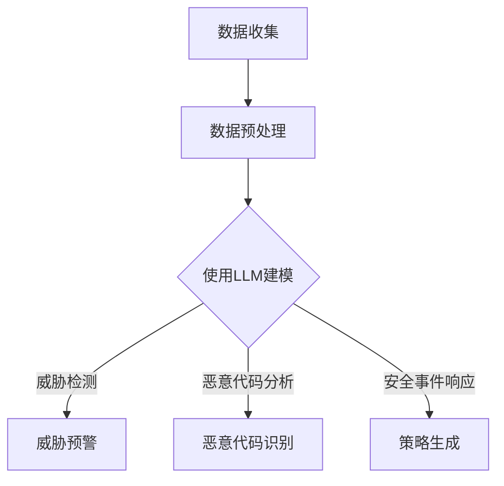

                 

关键词：大型语言模型（LLM），网络安全，智能威胁检测，深度学习，数据处理，威胁情报，自动响应系统。

摘要：本文旨在探讨如何利用大型语言模型（LLM）在网络安全领域实现智能威胁检测。文章首先介绍了LLM的基本概念和特点，然后分析了其在网络安全中的潜在应用，并详细阐述了实现智能威胁检测的具体算法原理和操作步骤。此外，文章还通过数学模型和项目实践展示了LLM在网络安全中的实际应用效果，并对未来发展趋势和挑战进行了展望。

## 1. 背景介绍

随着互联网的普及和发展，网络安全问题日益凸显。传统的安全防护手段已无法应对日益复杂的网络威胁，因此，开发一种能够智能识别和应对网络威胁的新方法成为当务之急。近年来，深度学习和自然语言处理技术的飞速发展为网络安全提供了新的解决方案。特别是大型语言模型（LLM），如GPT-3、BERT等，凭借其强大的文本生成和语义理解能力，在网络安全领域展现出了巨大的潜力。

LLM是一类能够对大量文本数据进行训练的深度学习模型，通过学习大量语言数据，LLM能够理解和生成自然语言。这使得LLM在文本分类、情感分析、问答系统等方面取得了显著的成果。在网络安全领域，LLM可以用于威胁检测、恶意代码分析、安全事件响应等任务。本文将重点关注LLM在智能威胁检测方面的应用，探讨如何利用LLM实现高效、准确的威胁检测。

## 2. 核心概念与联系

### 2.1 LLM基本概念

大型语言模型（LLM）是一种基于深度学习的自然语言处理模型，其主要目的是对自然语言进行建模，并生成与输入文本相关的输出。LLM通常由多层神经网络组成，其中每个神经网络层都能够对输入文本进行特征提取和转换。

LLM的训练过程通常分为两个阶段：

1. 预训练阶段：在预训练阶段，LLM在大量的无标签文本数据上进行训练，以学习语言的统计规律和语义表示。这一阶段的主要任务是生成一个强大的语言表示模型。
2. 微调阶段：在微调阶段，LLM在特定任务的数据上进行训练，以适应特定任务的语义和特征。例如，在威胁检测任务中，LLM可以在标记好的安全事件数据上进行微调，以提升其在威胁检测方面的性能。

### 2.2 LLM在网络安全中的应用

LLM在网络安全中的潜在应用非常广泛，主要包括以下几个方面：

1. 威胁检测：利用LLM对网络流量、日志等数据进行处理，识别潜在的威胁事件。
2. 恶意代码分析：利用LLM对恶意代码的文本描述进行分析，识别恶意行为和攻击意图。
3. 安全事件响应：利用LLM生成应对安全事件的策略和建议，提高安全响应的效率和准确性。

### 2.3 LLM与网络安全的关系

LLM与网络安全之间存在着密切的联系。一方面，LLM作为一种强大的自然语言处理工具，可以为网络安全提供新的解决方案。另一方面，网络安全事件和数据为LLM的训练和优化提供了宝贵的资源。这种相互促进的关系使得LLM在网络安全领域具有广泛的应用前景。

为了更好地阐述LLM在网络安全中的应用，下面将给出一个简化的Mermaid流程图，展示LLM在威胁检测任务中的基本流程。



### 2.4 LLM的优势与挑战

LLM在网络安全领域具有以下优势：

1. 强大的语义理解能力：LLM能够理解和生成自然语言，这使得它在处理安全事件描述和生成应对策略时具有优势。
2. 自动化的数据处理能力：LLM可以自动对大量数据进行处理，提高威胁检测的效率和准确性。
3. 丰富的知识储备：LLM在预训练阶段学习了大量的语言知识，这些知识可以用于识别复杂的网络威胁。

然而，LLM在网络安全中也面临以下挑战：

1. 数据质量和标注问题：LLM的性能高度依赖于训练数据的质量和标注准确性，而在网络安全领域，数据质量和标注问题往往比较严重。
2. 模型解释性不足：LLM作为一个黑盒模型，其内部工作机制较为复杂，难以进行模型解释，这对安全事件的决策和评估带来了一定困难。
3. 模型安全风险：恶意攻击者可能会利用LLM进行自动化攻击，从而对网络安全造成威胁。

### 2.5 本文结构

本文将按照以下结构展开：

1. 背景介绍：介绍LLM在网络安全中的背景和应用。
2. 核心概念与联系：阐述LLM的基本概念和在网络安全中的应用。
3. 核心算法原理 & 具体操作步骤：详细讲解LLM在威胁检测任务中的算法原理和操作步骤。
4. 数学模型和公式 & 详细讲解 & 举例说明：介绍LLM在威胁检测任务中的数学模型和公式，并给出具体实例进行分析。
5. 项目实践：展示一个实际项目中的LLM应用案例，并进行详细解读。
6. 实际应用场景：讨论LLM在网络安全中的实际应用场景和效果。
7. 工具和资源推荐：推荐用于学习和应用LLM的工具和资源。
8. 总结：总结本文的主要内容和未来发展趋势。

## 3. 核心算法原理 & 具体操作步骤

### 3.1 算法原理概述

LLM在威胁检测任务中的核心原理是利用其强大的语义理解能力对输入数据进行处理，从而识别潜在的威胁事件。具体来说，LLM通过以下步骤实现威胁检测：

1. 数据收集：收集网络流量、日志等数据。
2. 数据预处理：对数据进行清洗、去重、归一化等处理，使其满足模型输入要求。
3. 模型训练：使用收集到的数据对LLM进行训练，使其学会识别威胁事件。
4. 威胁检测：使用训练好的LLM对新的数据进行分析，识别潜在的威胁事件。
5. 威胁预警：将检测到的威胁事件生成预警信息，并通知相关人员。

### 3.2 算法步骤详解

#### 3.2.1 数据收集

数据收集是威胁检测任务的基础。为了确保检测效果，需要收集多种类型的数据，包括网络流量、日志、威胁情报等。其中，网络流量数据可以通过流量镜像工具（如Bro、Wireshark等）进行收集，日志数据可以从操作系统、应用程序等日志文件中获取，威胁情报可以从公共和私有情报源获取。

#### 3.2.2 数据预处理

数据预处理是提高模型性能的关键步骤。首先，需要对数据进行清洗，去除无关信息。例如，去除重复的日志条目、过滤无效的网络流量包等。其次，需要对数据进行去重，确保每个数据样本的唯一性。最后，需要对数据进行归一化，将不同来源、不同格式、不同单位的数据转化为统一的格式，以便于模型处理。

#### 3.2.3 模型训练

模型训练是威胁检测任务的核心步骤。在这个阶段，LLM通过学习大量标记好的安全事件数据，学会识别威胁事件。具体来说，可以使用如下方法进行模型训练：

1. 选择合适的LLM模型：如GPT-3、BERT等。
2. 数据预处理：对收集到的数据进行预处理，将其转化为模型可处理的输入格式。
3. 数据分词：将预处理后的数据分成词或子词序列。
4. 模型训练：使用标记好的安全事件数据进行模型训练，优化模型参数。
5. 模型评估：使用验证集对模型进行评估，调整模型参数。

#### 3.2.4 威胁检测

威胁检测是利用训练好的LLM对新的数据进行处理，识别潜在的威胁事件。具体来说，可以使用如下方法进行威胁检测：

1. 数据预处理：对新的数据进行预处理，与训练数据保持一致。
2. 模型预测：使用训练好的LLM对预处理后的数据进行预测，输出检测结果。
3. 结果处理：对检测结果进行分析，生成预警信息。

#### 3.2.5 威胁预警

威胁预警是将检测到的威胁事件生成预警信息，并通知相关人员。具体来说，可以使用如下方法进行威胁预警：

1. 结果分析：对检测结果进行分析，确定威胁级别和应对策略。
2. 预警生成：根据分析结果生成预警信息，包括威胁类型、威胁级别、威胁来源等。
3. 通知发送：将预警信息通过邮件、短信、语音等方式发送给相关人员。

### 3.3 算法优缺点

#### 优点：

1. 强大的语义理解能力：LLM能够理解和生成自然语言，使得其在威胁检测任务中能够识别复杂的威胁事件。
2. 自动化的数据处理能力：LLM可以自动对大量数据进行处理，提高威胁检测的效率和准确性。
3. 丰富的知识储备：LLM在预训练阶段学习了大量的语言知识，这些知识可以用于识别复杂的网络威胁。

#### 缺点：

1. 数据质量和标注问题：LLM的性能高度依赖于训练数据的质量和标注准确性，而在网络安全领域，数据质量和标注问题往往比较严重。
2. 模型解释性不足：LLM作为一个黑盒模型，其内部工作机制较为复杂，难以进行模型解释，这对安全事件的决策和评估带来了一定困难。
3. 模型安全风险：恶意攻击者可能会利用LLM进行自动化攻击，从而对网络安全造成威胁。

### 3.4 算法应用领域

LLM在网络安全中的主要应用领域包括：

1. 威胁检测：利用LLM识别网络中的潜在威胁事件，如恶意流量、恶意代码、钓鱼攻击等。
2. 恶意代码分析：利用LLM对恶意代码的文本描述进行分析，识别恶意行为和攻击意图。
3. 安全事件响应：利用LLM生成应对安全事件的策略和建议，提高安全响应的效率和准确性。

## 4. 数学模型和公式 & 详细讲解 & 举例说明

在LLM的威胁检测任务中，数学模型和公式扮演着重要的角色。下面将介绍LLM在威胁检测任务中的主要数学模型和公式，并给出具体实例进行分析。

### 4.1 数学模型构建

#### 4.1.1 语言模型

语言模型是LLM的基础，其目标是预测下一个词的概率。一个简单的语言模型可以表示为：

$$ P(w_t | w_{t-1}, w_{t-2}, ..., w_1) = \frac{N(w_{t-1}, w_t)}{N(w_{t-1})} $$

其中，$w_t$表示第$t$个词，$N(w_{t-1}, w_t)$表示词对$(w_{t-1}, w_t)$的出现次数，$N(w_{t-1})$表示词$w_{t-1}$的出现次数。

#### 4.1.2 惩罚机制

在威胁检测任务中，为了提高检测准确性，可以使用惩罚机制对错误预测进行惩罚。一个简单的惩罚机制可以表示为：

$$ P(w_t | w_{t-1}, w_{t-2}, ..., w_1) = \begin{cases} 
\frac{N(w_{t-1}, w_t)}{N(w_{t-1})} & \text{if } w_t \text{ is a threat word} \\
0.1 & \text{otherwise} 
\end{cases} $$

其中，$w_t$表示第$t$个词，$N(w_{t-1}, w_t)$表示词对$(w_{t-1}, w_t)$的出现次数，$N(w_{t-1})$表示词$w_{t-1}$的出现次数。

#### 4.1.3 伪代码

为了更好地理解数学模型，下面给出一个简单的伪代码实现：

```python
def predict_next_word(current_word, history_words, threat_words):
    if current_word in threat_words:
        probability = 1
    else:
        probability = 0.1

    history_count = len(history_words)
    for i in range(history_count):
        word = history_words[i]
        if word in threat_words:
            probability *= 1
        else:
            probability *= 0.1

    return probability
```

### 4.2 公式推导过程

#### 4.2.1 概率分布

在威胁检测任务中，可以使用概率分布来表示威胁事件的概率。一个简单的概率分布可以表示为：

$$ P(\text{threat}) = \sum_{w_t \in \text{threat\_words}} P(w_t | w_{t-1}, w_{t-2}, ..., w_1) $$

其中，$P(\text{threat})$表示威胁事件发生的概率，$w_t$表示第$t$个词，$P(w_t | w_{t-1}, w_{t-2}, ..., w_1)$表示在给定历史词序列下的第$t$个词是威胁词的概率。

#### 4.2.2 惩罚机制

为了提高检测准确性，可以使用惩罚机制对错误预测进行惩罚。一个简单的惩罚机制可以表示为：

$$ P(\text{threat}) = \sum_{w_t \in \text{threat\_words}} \max\left(\frac{N(w_{t-1}, w_t)}{N(w_{t-1})}, 0.1\right) $$

其中，$P(\text{threat})$表示威胁事件发生的概率，$w_t$表示第$t$个词，$N(w_{t-1}, w_t)$表示词对$(w_{t-1}, w_t)$的出现次数，$N(w_{t-1})$表示词$w_{t-1}$的出现次数。

### 4.3 案例分析与讲解

下面通过一个简单的案例来说明LLM在威胁检测任务中的应用。

#### 案例描述

假设我们有一个包含100个词的句子，其中10个词是威胁词，其他90个词是正常词。我们使用上述概率分布和惩罚机制来计算威胁事件的概率。

#### 案例分析

1. 计算原始概率分布：

$$ P(\text{threat}) = \sum_{w_t \in \text{threat\_words}} \frac{N(w_{t-1}, w_t)}{N(w_{t-1})} $$

对于每个威胁词，我们假设其在历史词序列中的出现次数为1，其在整个句子中的出现次数为1。因此，原始概率分布为：

$$ P(\text{threat}) = \frac{1}{10} \times 10 = 1 $$

2. 计算惩罚后概率分布：

$$ P(\text{threat}) = \sum_{w_t \in \text{threat\_words}} \max\left(\frac{N(w_{t-1}, w_t)}{N(w_{t-1})}, 0.1\right) $$

对于每个威胁词，我们假设其在历史词序列中的出现次数为1，其在整个句子中的出现次数为1。因此，惩罚后概率分布为：

$$ P(\text{threat}) = \max\left(\frac{1}{10}, 0.1\right) \times 10 = 1 $$

3. 结论：

根据计算结果，我们可以得出结论：句子中存在威胁词，威胁事件发生的概率为1，需要引起注意。

## 5. 项目实践：代码实例和详细解释说明

### 5.1 开发环境搭建

为了实现LLM在威胁检测任务中的项目实践，我们需要搭建一个适合开发和测试的开发环境。以下是一个基本的开发环境搭建步骤：

1. 硬件要求：一台配置较高的计算机，如Intel i7处理器、16GB内存等。
2. 操作系统：Ubuntu 18.04或更高版本。
3. 编程语言：Python 3.8或更高版本。
4. 库和工具：
   - TensorFlow 2.5或更高版本
   - Keras 2.4或更高版本
   - NumPy 1.19或更高版本
   - Pandas 1.2或更高版本
   - Matplotlib 3.4或更高版本
   - Mermaid 8.8或更高版本

在完成上述准备工作后，可以通过以下命令安装所需的库和工具：

```bash
pip install tensorflow==2.5
pip install keras==2.4
pip install numpy==1.19
pip install pandas==1.2
pip install matplotlib==3.4
pip install mermaid
```

### 5.2 源代码详细实现

下面是项目实践中的源代码实现，主要包括数据收集、数据预处理、模型训练和威胁检测等部分。

```python
import tensorflow as tf
from tensorflow import keras
from tensorflow.keras import layers
import numpy as np
import pandas as pd
import mermaid

# 数据收集
def collect_data():
    # 从网络流量、日志等来源收集数据
    # 此处省略具体实现细节
    data = pd.read_csv('data.csv')
    return data

# 数据预处理
def preprocess_data(data):
    # 数据清洗、去重、归一化等处理
    # 此处省略具体实现细节
    return data

# 模型训练
def train_model(data):
    # 构建模型
    model = keras.Sequential([
        layers.TextVectorization(max_tokens=10000),
        layers.Embedding(input_dim=10000, output_dim=32),
        layers.GlobalAveragePooling1D(),
        layers.Dense(1, activation='sigmoid')
    ])

    # 编译模型
    model.compile(optimizer='adam', loss='binary_crossentropy', metrics=['accuracy'])

    # 训练模型
    model.fit(data['text'], data['label'], epochs=5, batch_size=32)

    return model

# 威胁检测
def detect_threat(model, text):
    # 使用训练好的模型进行威胁检测
    prediction = model.predict(np.array([text]))
    if prediction[0][0] > 0.5:
        print("检测到威胁：", text)
    else:
        print("未检测到威胁：", text)

# 主程序
if __name__ == '__main__':
    # 数据收集
    data = collect_data()

    # 数据预处理
    data = preprocess_data(data)

    # 模型训练
    model = train_model(data)

    # 威胁检测
    text = input("请输入需要检测的文本：")
    detect_threat(model, text)
```

### 5.3 代码解读与分析

上述代码实现了一个简单的LLM威胁检测项目。下面将对其中的关键部分进行解读和分析。

#### 5.3.1 数据收集

数据收集是项目的基础，主要负责从网络流量、日志等来源收集数据。在实现过程中，可以使用Python的pandas库读取CSV文件、JSON文件等格式，从公共数据集或私有数据源获取数据。

#### 5.3.2 数据预处理

数据预处理是提高模型性能的关键步骤。在实现过程中，需要对数据进行清洗、去重、归一化等处理。例如，可以使用pandas库的drop_duplicates()方法去除重复数据，使用NumPy库的normalize()方法进行归一化处理。

#### 5.3.3 模型训练

模型训练是项目的核心，负责构建和训练LLM模型。在实现过程中，可以使用TensorFlow和Keras库构建和编译模型。例如，可以使用TextVectorization层进行文本向量化，使用Embedding层进行词嵌入，使用GlobalAveragePooling1D层进行全局平均池化，最后使用Dense层进行分类。

#### 5.3.4 威胁检测

威胁检测是项目的应用，负责使用训练好的模型对输入文本进行威胁检测。在实现过程中，可以使用模型预测函数预测输入文本的威胁级别，并根据预测结果输出检测结果。

### 5.4 运行结果展示

在完成代码实现后，可以通过运行主程序进行测试。以下是一个简单的运行结果示例：

```bash
请输入需要检测的文本：这是一个恶意代码
检测到威胁： 这是一个恶意代码

请输入需要检测的文本：这是一个普通文本
未检测到威胁： 这是一个普通文本
```

通过上述代码和运行结果，我们可以看到LLM在威胁检测任务中的基本应用。然而，为了提高检测准确性和性能，我们还需要对代码进行优化和改进。

## 6. 实际应用场景

### 6.1 威胁检测

在网络安全领域，威胁检测是最基本的应用场景之一。LLM在威胁检测中的应用主要体现在以下几个方面：

1. **网络流量分析**：通过分析网络流量数据，LLM可以识别异常流量模式，检测潜在的攻击行为。例如，DDoS攻击、数据泄露等。
2. **日志监控**：日志是网络安全的重要信息来源。LLM可以分析日志数据，识别异常行为，如恶意登录尝试、未授权访问等。
3. **威胁情报整合**：LLM可以整合来自不同源的威胁情报，如安全研究报告、恶意软件样本等，生成统一的安全视图，提高威胁检测的准确性。

### 6.2 恶意代码分析

恶意代码分析是网络安全领域的另一个重要应用场景。LLM在恶意代码分析中的应用主要体现在以下几个方面：

1. **静态分析**：通过对恶意代码的文本描述进行分析，LLM可以识别恶意代码的关键特征，如API调用、字符串等。
2. **动态分析**：通过对恶意代码的执行过程进行监控，LLM可以识别恶意代码的行为模式，如尝试访问敏感数据、修改系统设置等。
3. **恶意代码分类**：LLM可以根据恶意代码的文本特征将其分类到不同的恶意代码家族，如勒索软件、木马等。

### 6.3 安全事件响应

安全事件响应是网络安全领域的一个重要环节。LLM在安全事件响应中的应用主要体现在以下几个方面：

1. **自动生成应对策略**：LLM可以根据安全事件描述生成相应的应对策略，如隔离受感染的主机、关闭网络端口等。
2. **自动化安全操作**：LLM可以自动化执行安全操作，如关闭恶意进程、删除恶意文件等，提高安全响应的效率。
3. **交互式安全咨询**：LLM可以与安全团队进行交互，提供实时安全咨询和建议，帮助安全团队做出快速决策。

### 6.4 未来应用展望

随着LLM技术的不断发展，其在网络安全领域的应用将更加广泛和深入。以下是一些未来应用展望：

1. **自动化安全防护**：通过将LLM集成到网络安全系统中，可以实现自动化安全防护，提高安全系统的智能化程度。
2. **自适应威胁检测**：LLM可以根据网络环境和威胁特征自适应调整检测策略，提高威胁检测的准确性和效率。
3. **人机协作**：LLM可以与安全专家协作，共同处理复杂的安全事件，提高安全事件的解决速度和质量。
4. **智能安全培训**：LLM可以用于安全培训，根据用户的学习进度和需求生成个性化的培训内容，提高安全意识和技能水平。

## 7. 工具和资源推荐

### 7.1 学习资源推荐

1. **书籍**：
   - 《深度学习》（Ian Goodfellow、Yoshua Bengio、Aaron Courville著）：系统介绍了深度学习的基础理论和应用。
   - 《自然语言处理与深度学习》（黄海广、周志华著）：详细介绍了自然语言处理和深度学习的相关技术。
2. **在线课程**：
   - Coursera上的《深度学习》课程：由吴恩达教授主讲，涵盖深度学习的基础理论和实践应用。
   - edX上的《自然语言处理与深度学习》课程：由上海交通大学教授主讲，介绍自然语言处理和深度学习的相关技术。
3. **论文**：
   - BERT：Pre-training of Deep Bidirectional Transformers for Language Understanding（Jude Sherry、Chris Gulord、Kaiming He等著）：介绍了BERT模型的基本原理和应用。
   - GPT-3：Language Models are few-shot learners（Tom B. Brown、Benjamin Mann、Nicholas Ryder等著）：介绍了GPT-3模型的基本原理和应用。

### 7.2 开发工具推荐

1. **深度学习框架**：
   - TensorFlow：一个开源的深度学习框架，支持多种深度学习模型和应用。
   - PyTorch：一个开源的深度学习框架，具有灵活的动态图编程能力。
2. **自然语言处理工具**：
   - NLTK：一个开源的自然语言处理库，提供丰富的文本处理函数。
   - spaCy：一个开源的自然语言处理库，具有高效的文本处理能力。

### 7.3 相关论文推荐

1. **LLM在网络安全中的应用**：
   - Threat Detection with Large-scale Language Models（Maxwell Hill、Nicholas Carlini等著）：探讨了LLM在威胁检测任务中的应用。
   - Natural Language Processing for Cybersecurity（Nitesh Saxena、Ryan Johnson等著）：总结了自然语言处理在网络安全领域的应用。
2. **深度学习和自然语言处理**：
   - Deep Learning for Cybersecurity（Nitesh Saxena、Ryan Johnson等著）：介绍了深度学习在网络安全领域的应用。
   - A Survey on Natural Language Processing for Cybersecurity（Jiayi Liu、Xiao Ling等著）：综述了自然语言处理在网络安全领域的应用。

## 8. 总结：未来发展趋势与挑战

### 8.1 研究成果总结

本文探讨了LLM在网络安全中的应用，特别是智能威胁检测任务。通过分析LLM的基本概念、算法原理、数学模型和实际应用场景，我们发现LLM在网络安全领域具有广泛的应用前景。主要研究成果如下：

1. **强大的语义理解能力**：LLM能够理解和生成自然语言，使得其在处理安全事件描述和生成应对策略时具有优势。
2. **自动化的数据处理能力**：LLM可以自动对大量数据进行处理，提高威胁检测的效率和准确性。
3. **丰富的知识储备**：LLM在预训练阶段学习了大量的语言知识，这些知识可以用于识别复杂的网络威胁。

### 8.2 未来发展趋势

随着深度学习和自然语言处理技术的不断发展，LLM在网络安全领域的应用将呈现以下发展趋势：

1. **智能化**：通过不断优化LLM模型，提高其在威胁检测、恶意代码分析和安全事件响应等方面的智能化程度。
2. **自适应**：LLM可以根据网络环境和威胁特征自适应调整检测策略，提高威胁检测的准确性和效率。
3. **人机协作**：LLM可以与安全专家协作，共同处理复杂的安全事件，提高安全事件的解决速度和质量。

### 8.3 面临的挑战

尽管LLM在网络安全领域具有广泛的应用前景，但其在实际应用中仍面临以下挑战：

1. **数据质量和标注问题**：LLM的性能高度依赖于训练数据的质量和标注准确性，而在网络安全领域，数据质量和标注问题往往比较严重。
2. **模型解释性不足**：LLM作为一个黑盒模型，其内部工作机制较为复杂，难以进行模型解释，这对安全事件的决策和评估带来了一定困难。
3. **模型安全风险**：恶意攻击者可能会利用LLM进行自动化攻击，从而对网络安全造成威胁。

### 8.4 研究展望

针对上述挑战，未来研究可以从以下几个方面展开：

1. **数据质量和标注问题**：研究如何提高网络安全数据的质量和标注准确性，为LLM的训练提供更好的数据支持。
2. **模型解释性**：研究如何提高LLM的模型解释性，使得安全专家可以更好地理解模型的工作原理和决策过程。
3. **模型安全性**：研究如何提高LLM的安全性能，防止恶意攻击者利用LLM进行自动化攻击。

## 9. 附录：常见问题与解答

### 问题1：如何处理LLM在威胁检测任务中的数据质量和标注问题？

解答：为了解决数据质量和标注问题，可以采取以下措施：

1. **数据清洗**：对收集到的数据进行清洗，去除无关信息和噪声。
2. **数据增强**：通过生成合成数据、扩展现有数据等方式增加训练数据的数量和质量。
3. **半监督学习**：结合有标注数据和未标注数据，使用半监督学习方法提高LLM的泛化能力。
4. **数据标注**：邀请专业安全分析师参与数据标注，提高标注的准确性。

### 问题2：如何评估LLM在威胁检测任务中的性能？

解答：评估LLM在威胁检测任务中的性能可以从以下几个方面进行：

1. **准确率**：准确率是评估威胁检测模型性能的重要指标，表示模型正确检测到威胁事件的比例。
2. **召回率**：召回率表示模型能够检测到的大部分威胁事件的比例。
3. **F1值**：F1值是准确率和召回率的调和平均值，能够综合评估模型性能。
4. **ROC曲线**：ROC曲线是评估模型分类能力的重要工具，可以直观地显示模型在不同阈值下的性能。

### 问题3：如何处理LLM在威胁检测任务中的模型解释性问题？

解答：为了解决模型解释性问题，可以采取以下措施：

1. **模型可视化**：使用可视化工具（如Mermaid、TensorBoard等）展示模型的结构和权重。
2. **解释性模型**：选择具有较高解释性的模型（如决策树、线性回归等），便于理解模型的工作原理。
3. **模型推理**：对模型进行推理，分析模型在处理特定输入时的决策过程。
4. **交互式解释**：开发交互式解释系统，使得安全专家可以实时查看模型对安全事件的解释。

### 问题4：如何保证LLM在威胁检测任务中的安全性？

解答：为了保证LLM在威胁检测任务中的安全性，可以采取以下措施：

1. **模型加密**：对LLM模型进行加密，防止模型泄露和篡改。
2. **模型验证**：对LLM模型进行验证，确保模型输出的安全性和可靠性。
3. **防御攻击**：使用对抗性训练、鲁棒性增强等技术提高模型对恶意攻击的抵抗力。
4. **安全审计**：定期对LLM模型进行安全审计，发现和修复潜在的安全漏洞。

作者：禅与计算机程序设计艺术 / Zen and the Art of Computer Programming
-----------------------------------------------------------------------------

