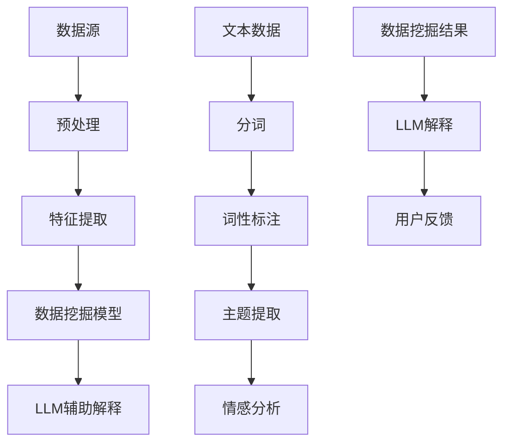
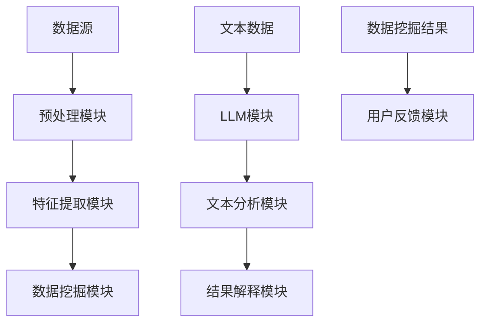

                 

关键词：大型语言模型（LLM），数据挖掘，机器学习，深度学习，自然语言处理，算法革新，数学模型，实践应用，未来展望

> 摘要：本文旨在探讨大型语言模型（LLM）对传统数据挖掘领域的革新作用。通过介绍LLM的基本原理、与传统数据挖掘的区别，以及其在数据挖掘中的具体应用，本文揭示了LLM在提升数据挖掘效率和准确性方面的重要价值。同时，本文还讨论了LLM在数学模型构建、公式推导以及实际项目中的实践应用，为读者提供了全面的技术洞察。文章最后对LLM的未来发展趋势与挑战进行了展望，为相关领域的学者和实践者提供了有益的参考。

## 1. 背景介绍

随着互联网的快速发展，数据量呈现出爆炸性增长。如何从海量数据中提取有价值的信息，成为各行业关注的热点问题。传统数据挖掘技术，如统计模型、机器学习算法等，虽然在特定场景下取得了显著成果，但面对复杂多变的现实世界，其表现却略显局限。近年来，随着深度学习、自然语言处理等领域的发展，大型语言模型（LLM）逐渐成为研究热点。LLM通过学习海量文本数据，具备了强大的语言理解和生成能力，为数据挖掘带来了新的机遇和挑战。

### 1.1 数据挖掘的发展历程

数据挖掘（Data Mining）是一门跨学科的研究领域，旨在从大量数据中通过算法和统计方法提取出有价值的信息和知识。其发展历程大致可分为以下几个阶段：

1. **早期探索阶段（20世纪80-90年代）**：这一阶段主要基于统计方法和规则系统进行数据挖掘，如回归分析、决策树、聚类等。
2. **机器学习阶段（20世纪90年代-21世纪初）**：随着机器学习算法的发展，如支持向量机（SVM）、神经网络（NN）等，数据挖掘开始向更加自动化的方向发展。
3. **大数据时代（21世纪至今）**：随着互联网和物联网的普及，数据量呈指数级增长，传统数据挖掘方法面临挑战。分布式计算、云计算等新技术的应用，使得大规模数据挖掘成为可能。

### 1.2 大型语言模型的基本原理

大型语言模型（Large Language Model，LLM）是一种基于深度学习的自然语言处理模型。其核心思想是通过学习大量文本数据，捕捉语言的本质特征，从而实现自动生成文本、理解语言含义等功能。LLM主要由以下几个关键组成部分构成：

1. **词嵌入（Word Embedding）**：将词语映射为高维向量，便于模型理解和处理。
2. **编码器（Encoder）**：将输入文本编码为固定长度的向量，表示整个文本。
3. **解码器（Decoder）**：将编码后的文本向量解码为输出文本。

常见的LLM模型有GPT（Generative Pre-trained Transformer）、BERT（Bidirectional Encoder Representations from Transformers）等。这些模型通过大规模预训练，具备了强大的语言理解和生成能力。

## 2. 核心概念与联系

### 2.1 数据挖掘与LLM的关系

数据挖掘和LLM虽然分别起源于不同的领域，但在实际应用中却有着紧密的联系。数据挖掘关注的是如何从数据中提取有价值的信息，而LLM则提供了强大的语言理解和生成工具，可以帮助数据挖掘更好地理解和处理非结构化数据。

1. **文本数据的预处理**：LLM可以帮助对文本数据进行清洗、分词、词性标注等预处理操作，为数据挖掘提供高质量的输入。
2. **特征提取**：LLM可以自动学习文本数据中的潜在特征，如主题、情感等，提高数据挖掘的准确性和效率。
3. **结果解释**：LLM可以帮助解释数据挖掘结果，提高用户对模型预测结果的信任度。

### 2.2 Mermaid流程图

以下是数据挖掘与LLM结合的Mermaid流程图：

### 2.3 数据挖掘与LLM的架构

以下是数据挖掘与LLM结合的架构图：

## 3. 核心算法原理 & 具体操作步骤

### 3.1 算法原理概述

LLM在数据挖掘中的应用主要基于其强大的语言理解和生成能力。具体而言，LLM通过以下步骤实现数据挖掘：

1. **文本预处理**：对原始文本数据进行清洗、分词、词性标注等预处理操作，为后续分析提供高质量的数据。
2. **特征提取**：利用LLM自动学习文本数据中的潜在特征，如主题、情感等，提高数据挖掘的准确性和效率。
3. **模型训练**：使用预处理后的文本数据和标签数据，训练数据挖掘模型，如分类、聚类等。
4. **结果解释**：利用LLM对模型预测结果进行解释，提高用户对模型预测结果的信任度。

### 3.2 算法步骤详解

#### 3.2.1 文本预处理

文本预处理是数据挖掘的第一步，其质量直接影响到后续分析的效果。LLM可以辅助完成以下任务：

1. **分词**：将文本分割为一个个独立的单词或短语。
2. **词性标注**：对每个词进行词性分类，如名词、动词、形容词等。
3. **去停用词**：去除对数据挖掘无意义的常见词汇，如“的”、“地”、“得”等。
4. **词嵌入**：将词转换为高维向量表示。

#### 3.2.2 特征提取

特征提取是数据挖掘的核心步骤，LLM可以自动学习文本数据中的潜在特征。具体方法包括：

1. **主题提取**：利用LLM对文本数据进行分析，提取出主要的主题或话题。
2. **情感分析**：根据文本内容判断用户的情感倾向，如正面、负面、中性等。
3. **实体识别**：识别文本中的关键实体，如人名、地名、组织名等。

#### 3.2.3 模型训练

在完成特征提取后，可以使用传统的数据挖掘算法进行模型训练。常见的算法包括：

1. **分类算法**：如支持向量机（SVM）、决策树、随机森林等。
2. **聚类算法**：如K-means、层次聚类等。
3. **回归算法**：如线性回归、决策树回归等。

#### 3.2.4 结果解释

LLM可以帮助解释数据挖掘结果，提高用户对模型预测结果的信任度。具体方法包括：

1. **结果可视化**：将模型预测结果以图表、表格等形式展示，帮助用户直观理解。
2. **解释性分析**：利用LLM对预测结果进行详细分析，找出关键影响因素。
3. **交互式解释**：通过交互式界面，让用户对模型预测结果进行自定义解释。

### 3.3 算法优缺点

#### 优点

1. **高效性**：LLM可以自动学习文本数据中的潜在特征，提高数据挖掘的效率。
2. **灵活性**：LLM支持多种文本分析任务，如主题提取、情感分析、实体识别等，具有很高的灵活性。
3. **解释性**：LLM可以帮助解释数据挖掘结果，提高用户对模型预测结果的信任度。

#### 缺点

1. **计算成本**：LLM需要大量的计算资源，特别是在大规模数据集上训练时。
2. **数据依赖**：LLM的性能受到训练数据质量的影响，数据质量差可能导致模型效果不佳。
3. **可解释性限制**：虽然LLM可以帮助解释数据挖掘结果，但其在某些情况下仍然具有一定的“黑箱”性质。

### 3.4 算法应用领域

LLM在数据挖掘领域具有广泛的应用，包括但不限于以下场景：

1. **金融风控**：利用LLM进行文本分析，识别金融欺诈、市场趋势预测等。
2. **医疗健康**：通过LLM分析患者病历，辅助疾病诊断和治疗方案推荐。
3. **智能客服**：利用LLM实现智能客服，提供24/7的服务。
4. **舆情分析**：利用LLM分析社交媒体数据，了解公众对某一事件的看法。
5. **推荐系统**：利用LLM提取用户兴趣特征，提高推荐系统的准确性。

## 4. 数学模型和公式 & 详细讲解 & 举例说明

### 4.1 数学模型构建

LLM在数据挖掘中的应用主要基于深度学习模型，其中最常用的模型是Transformer。以下是Transformer的基本数学模型：

#### 4.1.1 词嵌入（Word Embedding）

词嵌入将词汇映射为高维向量表示，常用的方法有Word2Vec、GloVe等。以下是Word2Vec的数学模型：

$$
\text{word\_embedding}(w) = \text{sigmoid}(W \cdot \text{one-hot}(w))
$$

其中，$W$是词嵌入矩阵，$\text{one-hot}(w)$是词汇w的one-hot编码，$\text{sigmoid}$是sigmoid函数。

#### 4.1.2 编码器（Encoder）

编码器负责将输入文本编码为固定长度的向量表示。以下是Transformer编码器的数学模型：

$$
\text{encoder}(x) = \text{softmax}(\text{atten

