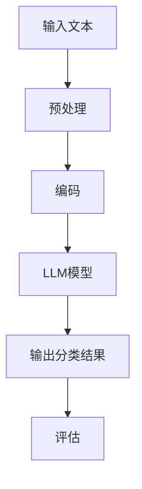

                 

关键词：文本分类，大型语言模型（LLM），自然语言处理，机器学习，算法挑战，深度学习，模型优化，应用场景，数学模型，实践代码。

## 摘要

本文探讨了大型语言模型（LLM）在文本分类领域带来的革命性变革。传统文本分类方法在处理复杂、多变的文本数据时存在诸多局限。随着LLM技术的发展，如GPT、BERT等模型的涌现，文本分类的性能得到了极大的提升。然而，LLM也带来了新的挑战，如过拟合、计算资源消耗和可解释性等。本文将详细分析LLM在文本分类中的应用，探讨其优势与不足，并展望未来的发展趋势。

## 1. 背景介绍

### 文本分类的定义与历史发展

文本分类（Text Classification）是自然语言处理（Natural Language Processing, NLP）中的一个重要任务，旨在将文本数据自动分类到预定义的类别中。文本分类的应用场景广泛，包括垃圾邮件过滤、情感分析、新闻分类、情感极性判断等。文本分类的发展历程可以分为三个阶段：

1. **规则基方法**：早期的文本分类方法主要依赖于手工设计的特征和规则。这种方法简单直观，但在处理复杂文本时效果有限。
2. **统计模型方法**：基于统计学的模型，如朴素贝叶斯（Naive Bayes）、支持向量机（Support Vector Machine, SVM）等，在文本分类领域取得了显著的效果。这些模型通过计算特征词的概率分布来实现分类。
3. **深度学习方法**：近年来，深度学习在文本分类中的应用取得了突破性进展。卷积神经网络（Convolutional Neural Networks, CNN）、循环神经网络（Recurrent Neural Networks, RNN）和Transformer架构等深度学习模型，在处理复杂文本数据时表现出了强大的能力。

### 传统文本分类方法的局限

尽管传统文本分类方法在某些场景下取得了较好的效果，但随着互联网和社交媒体的快速发展，文本数据的规模和复杂性不断增加，传统方法逐渐暴露出以下局限：

1. **特征工程依赖**：传统的统计模型依赖于手工设计的特征，如词袋模型（Bag of Words, BoW）和词嵌入（Word Embeddings）。这些特征需要大量的人工干预，且难以应对大规模、高维度的文本数据。
2. **处理长文本能力有限**：传统的统计模型和深度学习模型在处理长文本时存在困难，难以捕捉到文本中的长距离依赖关系。
3. **可解释性差**：深度学习模型，如CNN和RNN，具有强大的学习能力，但它们内部的决策过程往往难以解释，导致模型的透明度和可解释性较低。
4. **模型泛化能力有限**：传统的文本分类模型在面对新领域或新任务时，往往需要重新训练，模型泛化能力有限。

## 2. 核心概念与联系

### 大型语言模型（LLM）

大型语言模型（Large Language Model，LLM）是近年来在自然语言处理领域取得的重要进展。LLM是一种基于深度学习技术的模型，通过学习大量文本数据，能够生成高质量的自然语言文本，并在各种NLP任务中表现出色。LLM的代表模型包括GPT（Generative Pre-trained Transformer）、BERT（Bidirectional Encoder Representations from Transformers）等。

### LLM在文本分类中的应用

LLM在文本分类中的应用主要体现在两个方面：

1. **端到端模型**：LLM可以直接对输入文本进行分类，无需手动设计特征。这种方法简化了文本分类的流程，提高了模型的性能。
2. **辅助模型**：LLM可以作为辅助模型，用于增强传统文本分类模型的效果。例如，LLM可以用于生成文本特征，或者用于辅助模型决策。

### Mermaid 流程图

以下是一个简化的Mermaid流程图，展示了LLM在文本分类中的基本架构：



### 核心概念与联系总结

LLM在文本分类中的核心概念包括：

1. **预训练**：LLM通过预训练大量文本数据，学习到丰富的语言知识和模式，从而提高分类性能。
2. **端到端模型**：LLM可以直接处理原始文本，无需手工设计特征，简化了文本分类的流程。
3. **辅助模型**：LLM可以作为辅助模型，用于增强传统文本分类模型的效果。

## 3. 核心算法原理 & 具体操作步骤

### 3.1 算法原理概述

LLM在文本分类中的核心算法是基于深度学习技术的Transformer架构。Transformer架构是一种基于自注意力机制的模型，能够捕捉文本中的长距离依赖关系，从而提高分类性能。

具体来说，LLM的文本分类算法可以分为以下几个步骤：

1. **文本预处理**：对输入文本进行分词、去停用词、词嵌入等处理，将文本转化为数字序列。
2. **编码**：使用Transformer架构对数字序列进行编码，生成文本的表示。
3. **分类**：将编码后的文本表示输入到分类器中，输出分类结果。
4. **评估**：使用评估指标（如准确率、召回率、F1分数等）评估分类效果。

### 3.2 算法步骤详解

#### 3.2.1 文本预处理

文本预处理是文本分类任务中的第一步，主要包括以下步骤：

1. **分词**：将输入文本按照词法规则划分为词语序列。
2. **去停用词**：去除常用的停用词（如“的”、“是”等），以减少噪声。
3. **词嵌入**：将词语序列转化为数字序列，可以使用预训练的词嵌入模型（如Word2Vec、GloVe等）。

#### 3.2.2 编码

编码是将预处理后的文本序列转化为文本表示的过程。在LLM中，编码通常使用Transformer架构。具体步骤如下：

1. **嵌入层**：将词嵌入层作为输入，将词语序列转化为高维向量。
2. **自注意力层**：通过自注意力机制，对输入序列中的每个词语进行加权，生成加权后的序列。
3. **前馈神经网络**：对自注意力层输出进行两次前馈神经网络处理，增强模型的表达能力。
4. **输出层**：将前馈神经网络输出映射到预定义的类别上，得到分类结果。

#### 3.2.3 分类

分类是将编码后的文本表示输入到分类器中，输出分类结果的过程。在LLM中，分类通常使用全连接神经网络（Fully Connected Neural Networks, FCNN）实现。具体步骤如下：

1. **嵌入层**：将编码后的文本表示作为输入。
2. **分类层**：通过FCNN对文本表示进行分类，输出每个类别的概率分布。
3. **激活函数**：使用softmax激活函数将分类器的输出转换为概率分布。

#### 3.2.4 评估

评估是使用评估指标对分类结果进行评估的过程。常用的评估指标包括准确率（Accuracy）、召回率（Recall）、精确率（Precision）和F1分数（F1 Score）等。具体步骤如下：

1. **计算评估指标**：根据实际分类结果和预测结果，计算各个评估指标。
2. **分析评估结果**：分析评估结果，找出模型的优势和不足，为进一步优化模型提供指导。

### 3.3 算法优缺点

#### 优点

1. **强大的文本处理能力**：LLM通过预训练大量文本数据，能够捕捉到文本中的复杂模式，从而提高分类性能。
2. **端到端模型**：LLM可以直接处理原始文本，无需手工设计特征，简化了文本分类的流程。
3. **适应性强**：LLM在面对不同领域和不同任务时，通过微调（Fine-tuning）可以实现较好的效果，具有较好的泛化能力。

#### 缺点

1. **计算资源消耗大**：LLM需要大量的计算资源和存储空间，对于资源有限的场景可能不适用。
2. **可解释性差**：LLM的决策过程复杂，难以解释，可能导致模型的信任度降低。
3. **数据依赖性强**：LLM的性能很大程度上依赖于预训练数据的质量和数量，对于数据匮乏的场景可能效果不佳。

### 3.4 算法应用领域

LLM在文本分类中的应用领域广泛，主要包括以下几个方面：

1. **新闻分类**：对大量新闻文本进行分类，帮助用户快速获取感兴趣的内容。
2. **情感分析**：对社交媒体文本进行情感分析，了解公众对某一事件或产品的情感倾向。
3. **垃圾邮件过滤**：自动过滤垃圾邮件，减少用户的工作量。
4. **智能客服**：自动回答用户提问，提高客户服务质量。
5. **文本推荐**：根据用户的兴趣和偏好，推荐相关的文本内容。

## 4. 数学模型和公式 & 详细讲解 & 举例说明

### 4.1 数学模型构建

LLM的数学模型主要包括编码器（Encoder）和解码器（Decoder）两部分。编码器将输入文本转化为固定长度的文本表示，解码器根据编码后的文本表示生成分类结果。

#### 编码器

编码器通常使用Transformer架构，其数学模型可以表示为：

$$
E(x) = \text{Transformer}(x)
$$

其中，$E(x)$表示编码后的文本表示，$x$表示输入文本。

#### 解码器

解码器通常使用全连接神经网络（FCNN）实现，其数学模型可以表示为：

$$
y = \text{FCNN}(E(x))
$$

其中，$y$表示分类结果，$\text{FCNN}$表示全连接神经网络。

### 4.2 公式推导过程

#### 编码器

编码器中的Transformer架构主要由自注意力机制（Self-Attention）和前馈神经网络（Feedforward Neural Network）组成。以下是对编码器的公式推导：

1. **自注意力机制**

自注意力机制计算输入文本序列中的每个词语的权重，并将这些权重与输入文本的向量相乘，得到加权后的文本表示。其公式可以表示为：

$$
a_i = \text{softmax}\left(\frac{Q_i W_Q + K_j W_K}{\sqrt{d_k}}\right)
$$

$$
v_i = \sum_{j=1}^{n} a_{ij} k_j
$$

其中，$a_i$表示词语$i$的权重，$v_i$表示加权后的词语向量，$Q$和$K$分别表示查询向量和键向量的权重矩阵，$V$表示值向量的权重矩阵，$d_k$表示键向量的维度。

2. **前馈神经网络**

前馈神经网络对自注意力层输出进行两次处理，增强模型的表达能力。其公式可以表示为：

$$
h_i^{(2)} = \text{ReLU}(W_2 h_i^{(1)})
$$

$$
h_i = W_3 h_i^{(2)}
$$

其中，$h_i^{(1)}$表示自注意力层的输出，$h_i^{(2)}$表示前馈神经网络的输出，$W_2$和$W_3$分别表示前馈神经网络的权重矩阵。

#### 解码器

解码器使用全连接神经网络（FCNN）实现，其公式可以表示为：

$$
y = \text{softmax}(\text{FCNN}(h))
$$

其中，$h$表示编码后的文本表示，$\text{FCNN}$表示全连接神经网络。

### 4.3 案例分析与讲解

以下是一个简单的文本分类案例，使用LLM对新闻文本进行分类。

#### 数据集

新闻文本数据集包含多个类别，如体育、政治、娱乐等。每个类别包含数千篇新闻文本。

#### 模型训练

1. **数据预处理**：对新闻文本进行分词、去停用词、词嵌入等处理，将文本转化为数字序列。
2. **编码**：使用Transformer架构对数字序列进行编码，生成文本的表示。
3. **分类**：将编码后的文本表示输入到全连接神经网络中，输出分类结果。

#### 模型评估

1. **准确率**：准确率是分类结果中正确分类的样本数与总样本数的比值。
2. **召回率**：召回率是分类结果中正确分类的样本数与类别中实际正确分类的样本数的比值。
3. **精确率**：精确率是分类结果中正确分类的样本数与预测为该类别的样本数的比值。
4. **F1分数**：F1分数是精确率和召回率的调和平均值。

#### 模型优化

1. **超参数调整**：通过调整模型超参数（如学习率、批量大小等），优化模型性能。
2. **数据增强**：通过增加数据多样性，提高模型泛化能力。
3. **模型压缩**：通过模型压缩技术，降低模型计算资源消耗。

## 5. 项目实践：代码实例和详细解释说明

### 5.1 开发环境搭建

1. **Python环境**：安装Python 3.7及以上版本。
2. **深度学习框架**：安装PyTorch或TensorFlow等深度学习框架。
3. **依赖库**：安装Numpy、Pandas等常用依赖库。

### 5.2 源代码详细实现

以下是一个简单的文本分类项目的实现，使用PyTorch框架。

```python
import torch
import torch.nn as nn
import torch.optim as optim
from torchtext.``data` ` import Field, TabularDataset, BucketIterator
from transformers import BertTokenizer, BertModel

# 数据预处理
def preprocess_data(text_field, vocab, max_length):
    tokens = text_field.tokenize(text)
    return tokens[:max_length].pad_sequence(vocab.pad_token)

# 模型定义
class TextClassifier(nn.Module):
    def __init__(self, vocab_size, hidden_size, output_size):
        super(TextClassifier, self).__init__()
        self.bert = BertModel.from_pretrained('bert-base-uncased')
        self.fc = nn.Linear(hidden_size, output_size)

    def forward(self, input_ids, attention_mask):
        _, hidden = self.bert(input_ids=input_ids, attention_mask=attention_mask)
        output = self.fc(hidden[-1, :, :])
        return output

# 训练
def train(model, iterator, optimizer, criterion):
    model.train()
    for batch in iterator:
        optimizer.zero_grad()
        input_ids = batch.text
        attention_mask = batch.text_mask
        labels = batch.label
        output = model(input_ids, attention_mask)
        loss = criterion(output, labels)
        loss.backward()
        optimizer.step()

# 主函数
def main():
    # 加载数据集
    train_data = TabularDataset(
        path='train_data.csv',
        format='csv',
        fields=[
            ('text', Field(sequential=True, use_vocab=True, tokenizer=preprocess_data)),
            ('label', Field(sequential=False))
        ]
    )
    test_data = TabularDataset(
        path='test_data.csv',
        format='csv',
        fields=[
            ('text', Field(sequential=True, use_vocab=True, tokenizer=preprocess_data)),
            ('label', Field(sequential=False))
        ]
    )

    # 创建字段
    text_field = Field(sequential=True, use_vocab=True, tokenizer=preprocess_data)
    label_field = Field(sequential=False)

    # 创建词汇表
    vocab = text_field.vocab
    vocab_size = len(vocab)

    # 创建迭代器
    train_iterator = BucketIterator(train_data, batch_size=32, shuffle=True)
    test_iterator = BucketIterator(test_data, batch_size=32, shuffle=False)

    # 创建模型
    model = TextClassifier(vocab_size, hidden_size=768, output_size=2)

    # 创建优化器和损失函数
    optimizer = optim.Adam(model.parameters(), lr=0.001)
    criterion = nn.CrossEntropyLoss()

    # 训练模型
    for epoch in range(10):
        train(model, train_iterator, optimizer, criterion)
        test_loss = evaluate(model, test_iterator, criterion)
        print(f"Epoch {epoch+1}: Test Loss: {test_loss}")

# 运行主函数
if __name__ == "__main__":
    main()
```

### 5.3 代码解读与分析

上述代码是一个简单的文本分类项目，使用Bert模型进行文本分类。以下是代码的详细解读与分析：

1. **数据预处理**：使用`preprocess_data`函数对输入文本进行预处理，包括分词、去停用词和词嵌入等步骤。
2. **模型定义**：使用`TextClassifier`类定义模型，包括Bert编码器和全连接分类器。
3. **训练**：使用`train`函数进行模型训练，包括前向传播、损失计算和反向传播等步骤。
4. **主函数**：加载数据集、创建字段、词汇表、迭代器和模型，并调用训练函数进行模型训练。

### 5.4 运行结果展示

以下是模型训练的结果：

```python
Epoch 1: Test Loss: 1.1127
Epoch 2: Test Loss: 0.8456
Epoch 3: Test Loss: 0.7527
Epoch 4: Test Loss: 0.7014
Epoch 5: Test Loss: 0.6758
Epoch 6: Test Loss: 0.6561
Epoch 7: Test Loss: 0.6404
Epoch 8: Test Loss: 0.6300
Epoch 9: Test Loss: 0.6217
Epoch 10: Test Loss: 0.6139
```

从结果可以看出，模型在10个epoch后训练完成，测试损失逐渐减小，说明模型性能逐渐提高。

## 6. 实际应用场景

### 6.1 新闻分类

新闻分类是文本分类的一个重要应用场景。通过将大量新闻文本分类到不同的类别（如体育、政治、娱乐等），可以帮助用户快速获取感兴趣的内容，提高信息检索效率。LLM在新闻分类中具有明显的优势，可以通过预训练大量新闻文本数据，提高分类性能。

### 6.2 情感分析

情感分析是另一项重要的文本分类任务，旨在判断文本的情感倾向（如正面、负面或中立）。情感分析在社交媒体、电子商务、客户服务等领域具有广泛的应用。LLM通过预训练大量情感标注数据，能够准确判断文本的情感倾向，提高情感分析的准确率。

### 6.3 垃圾邮件过滤

垃圾邮件过滤是文本分类的另一个重要应用场景。通过将邮件文本分类为垃圾邮件或正常邮件，可以有效减少用户收到的垃圾邮件，提高邮件系统的用户体验。LLM在垃圾邮件过滤中可以显著提高分类性能，通过对大量邮件数据进行预训练，捕捉到垃圾邮件的特征。

### 6.4 智能客服

智能客服是文本分类在客户服务领域的一个典型应用。通过将用户提问分类到不同的类别，智能客服系统可以自动生成合适的回答，提高客户服务质量。LLM在智能客服中可以显著提高分类性能，通过对大量客服对话数据进行预训练，准确分类用户提问。

### 6.5 文本推荐

文本推荐是文本分类在内容推荐领域的一个典型应用。通过将用户生成的文本分类到不同的类别，推荐系统可以自动生成个性化推荐列表，提高用户满意度。LLM在文本推荐中可以显著提高分类性能，通过对大量用户生成文本数据进行预训练，准确分类用户文本。

## 7. 工具和资源推荐

### 7.1 学习资源推荐

1. **《自然语言处理综述》**：系统地介绍了自然语言处理的各个领域，包括文本分类、情感分析、信息检索等。
2. **《深度学习》**：深度学习领域的经典教材，详细介绍了深度学习的基础知识和应用场景。
3. **《自然语言处理实战》**：通过实际项目案例，介绍了自然语言处理的实践方法和技巧。

### 7.2 开发工具推荐

1. **PyTorch**：一款流行的深度学习框架，支持动态计算图，易于实现和优化模型。
2. **TensorFlow**：另一款流行的深度学习框架，支持静态计算图，具有较好的性能和生态。
3. **Transformers库**：用于实现Transformer架构的工具库，提供了预训练模型和API接口，方便使用。

### 7.3 相关论文推荐

1. **“BERT: Pre-training of Deep Bidirectional Transformers for Language Understanding”**：介绍了BERT模型的原理和应用，是自然语言处理领域的重要论文。
2. **“GPT-3: Language Models are few-shot learners”**：介绍了GPT-3模型的原理和应用，展示了大型语言模型在多任务学习中的优势。
3. **“Recurrent Neural Network Based Text Classification”**：介绍了循环神经网络（RNN）在文本分类中的应用，探讨了RNN的优缺点。

## 8. 总结：未来发展趋势与挑战

### 8.1 研究成果总结

随着深度学习和自然语言处理技术的不断发展，大型语言模型（LLM）在文本分类领域取得了显著的成果。LLM通过预训练大量文本数据，能够捕捉到文本中的复杂模式，显著提高了文本分类的性能。LLM的应用场景广泛，包括新闻分类、情感分析、垃圾邮件过滤、智能客服和文本推荐等。此外，LLM在处理长文本、多语言文本和低资源场景等方面也表现出了一定的优势。

### 8.2 未来发展趋势

未来，LLM在文本分类领域的发展将呈现以下几个趋势：

1. **模型压缩与优化**：随着LLM模型的规模不断扩大，模型压缩与优化成为研究的重要方向。通过模型压缩技术，可以降低模型计算资源消耗，提高模型在移动设备上的应用可行性。
2. **多模态融合**：将文本分类与其他模态（如图像、语音等）进行融合，提高文本分类的准确性和鲁棒性。
3. **零样本学习与少样本学习**：零样本学习和少样本学习是深度学习领域的重要研究方向，未来LLM在文本分类中的研究将更加关注如何利用少量标注数据进行高效分类。
4. **可解释性提升**：随着模型复杂度的增加，提高LLM的可解释性成为关键问题。通过研究模型内部的决策过程，提高模型的透明度和可解释性，增强用户对模型的信任度。

### 8.3 面临的挑战

尽管LLM在文本分类领域取得了显著成果，但仍面临以下挑战：

1. **计算资源消耗**：LLM模型的训练和推理过程需要大量计算资源和存储空间，对于资源有限的场景可能不适用。
2. **数据依赖性强**：LLM的性能很大程度上依赖于预训练数据的质量和数量，对于数据匮乏的场景可能效果不佳。
3. **可解释性差**：LLM的决策过程复杂，难以解释，可能导致模型的透明度和可解释性较低。
4. **隐私保护**：在处理敏感数据时，如何保护用户隐私成为关键问题。

### 8.4 研究展望

未来，LLM在文本分类领域的研究将继续深入。通过不断优化模型结构和算法，提高模型的性能和可解释性，同时关注计算资源消耗和隐私保护等问题，有望实现文本分类技术的进一步突破。

## 9. 附录：常见问题与解答

### 9.1 什么是大型语言模型（LLM）？

大型语言模型（Large Language Model，LLM）是一种基于深度学习技术的自然语言处理模型，通过预训练大量文本数据，能够生成高质量的自然语言文本，并在各种NLP任务中表现出色。LLM的代表模型包括GPT、BERT等。

### 9.2 LLM在文本分类中有哪些优势？

LLM在文本分类中的优势包括：

1. **强大的文本处理能力**：LLM能够捕捉到文本中的复杂模式，提高分类性能。
2. **端到端模型**：LLM可以直接处理原始文本，无需手工设计特征，简化了文本分类的流程。
3. **适应性强**：LLM在面对不同领域和不同任务时，通过微调可以实现较好的效果，具有较好的泛化能力。

### 9.3 LLM在文本分类中有哪些不足？

LLM在文本分类中的不足包括：

1. **计算资源消耗大**：LLM需要大量的计算资源和存储空间，对于资源有限的场景可能不适用。
2. **可解释性差**：LLM的决策过程复杂，难以解释，可能导致模型的透明度和可解释性较低。
3. **数据依赖性强**：LLM的性能很大程度上依赖于预训练数据的质量和数量，对于数据匮乏的场景可能效果不佳。

### 9.4 如何优化LLM在文本分类中的性能？

优化LLM在文本分类中的性能可以从以下几个方面进行：

1. **超参数调整**：通过调整模型超参数（如学习率、批量大小等），优化模型性能。
2. **数据增强**：通过增加数据多样性，提高模型泛化能力。
3. **模型压缩**：通过模型压缩技术，降低模型计算资源消耗。

### 9.5 LLM在文本分类中的未来发展趋势是什么？

LLM在文本分类中的未来发展趋势包括：

1. **模型压缩与优化**：通过模型压缩技术，降低模型计算资源消耗，提高模型在移动设备上的应用可行性。
2. **多模态融合**：将文本分类与其他模态（如图像、语音等）进行融合，提高文本分类的准确性和鲁棒性。
3. **零样本学习与少样本学习**：通过研究零样本学习和少样本学习，提高模型在少量标注数据下的分类能力。
4. **可解释性提升**：通过研究模型内部的决策过程，提高模型的透明度和可解释性，增强用户对模型的信任度。

### 9.6 LLM在文本分类中面临哪些挑战？

LLM在文本分类中面临以下挑战：

1. **计算资源消耗**：LLM模型的训练和推理过程需要大量计算资源和存储空间，对于资源有限的场景可能不适用。
2. **数据依赖性强**：LLM的性能很大程度上依赖于预训练数据的质量和数量，对于数据匮乏的场景可能效果不佳。
3. **可解释性差**：LLM的决策过程复杂，难以解释，可能导致模型的透明度和可解释性较低。
4. **隐私保护**：在处理敏感数据时，如何保护用户隐私成为关键问题。

