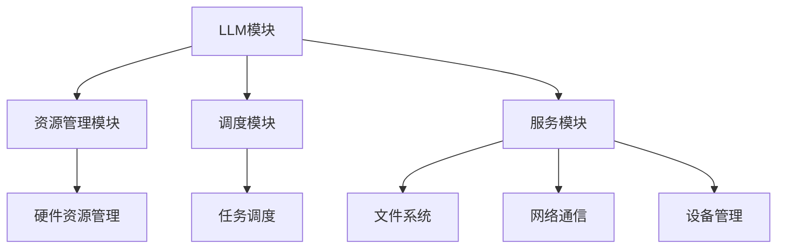

                 

关键词：大型语言模型（LLM），操作系统，人工智能（AI），传统计算，融合架构，计算模型，数学模型，算法原理，项目实践，应用场景，未来展望。

> 摘要：本文深入探讨了大型语言模型（LLM）操作系统在人工智能（AI）与传统计算技术融合中的应用。通过阐述LLM操作系统的核心概念、架构设计、算法原理以及数学模型，本文旨在为读者提供一个全面的技术视角，以了解LLM操作系统如何成为连接AI与传统计算的桥梁，并展望其未来发展的趋势与挑战。

## 1. 背景介绍

近年来，人工智能（AI）的迅猛发展已经深刻改变了我们的生活方式和工业生产方式。从智能助理到自动驾驶，从医疗诊断到金融分析，AI技术正在各行各业中发挥越来越重要的作用。然而，随着AI系统的复杂度不断增加，它们对于计算资源的要求也日益增长，这对传统计算架构提出了巨大的挑战。

操作系统作为计算机系统的核心，负责资源管理、进程调度、存储管理等关键任务。然而，传统操作系统在处理AI任务时往往显得力不从心，难以满足AI系统对实时性、大规模数据处理和高度并行计算的需求。因此，如何将AI技术与传统计算架构相结合，构建一个高效、可靠的计算平台，成为当前计算机科学领域的一个重要课题。

大型语言模型（LLM）作为一种先进的AI技术，具有强大的自然语言处理能力，能够理解、生成和翻译自然语言。LLM操作系统旨在将LLM的技术优势与传统操作系统相结合，为AI应用提供一个灵活、可扩展的计算平台。

## 2. 核心概念与联系

### 2.1 核心概念

- **大型语言模型（LLM）**：LLM是一种基于深度学习的自然语言处理模型，能够对大量文本数据进行训练，从而实现对自然语言的深度理解和生成。

- **操作系统**：操作系统是计算机系统的核心软件，负责管理计算机硬件资源、提供应用程序接口和服务。

- **AI与传统计算融合**：AI与传统计算的融合旨在利用AI技术的优势，提升传统计算系统的性能和效率，同时保持其稳定性和可靠性。

### 2.2 架构设计

LLM操作系统的架构设计需要充分考虑AI与传统计算的融合。其核心架构包括以下几个方面：

- **LLM模块**：负责处理自然语言数据，包括文本的输入、处理和输出。

- **资源管理模块**：负责管理计算机硬件资源，包括CPU、GPU、内存和存储等。

- **调度模块**：负责对系统中的任务进行调度，确保AI任务的实时性和高效性。

- **服务模块**：提供各种服务，如文件系统、网络通信、设备管理等。

### 2.3 Mermaid 流程图

以下是一个简单的Mermaid流程图，展示了LLM操作系统的基本架构：



## 3. 核心算法原理 & 具体操作步骤

### 3.1 算法原理概述

LLM操作系统的核心算法原理基于深度学习和自然语言处理技术。具体来说，LLM操作系统通过以下步骤实现其功能：

1. **文本输入**：系统接收自然语言文本输入，包括文本的读取、预处理和编码。

2. **处理与生成**：LLM模型对输入文本进行处理，生成相应的语义表示，并进一步生成文本输出。

3. **资源调度**：根据任务需求和资源状况，调度模块动态分配系统资源，确保AI任务的实时性和高效性。

4. **服务与反馈**：系统提供各种服务，如文件系统、网络通信、设备管理等，并根据用户反馈调整系统性能。

### 3.2 算法步骤详解

1. **文本输入**：文本输入阶段主要包括以下几个步骤：

   - **文本读取**：从外部文件或网络接口读取文本数据。

   - **文本预处理**：对文本进行分词、去停用词、词性标注等预处理操作。

   - **编码**：将预处理后的文本编码为模型可处理的向量表示。

2. **处理与生成**：处理与生成阶段主要包括以下几个步骤：

   - **模型选择与加载**：根据任务需求选择合适的LLM模型，并从模型库中加载。

   - **文本处理**：利用LLM模型对文本数据进行处理，生成语义表示。

   - **文本生成**：根据语义表示生成文本输出，如回答问题、生成摘要等。

3. **资源调度**：资源调度阶段主要包括以下几个步骤：

   - **任务队列管理**：将待处理的AI任务放入任务队列。

   - **资源分配**：根据任务优先级和资源状况，动态分配系统资源。

   - **任务调度**：根据资源分配情况，调度模块选择合适的时间片执行任务。

4. **服务与反馈**：服务与反馈阶段主要包括以下几个步骤：

   - **文件系统服务**：提供文件读取、写入、删除等基本操作。

   - **网络通信服务**：提供数据传输、连接管理等功能。

   - **设备管理服务**：管理计算机硬件设备，如CPU、GPU、存储设备等。

   - **用户反馈处理**：收集用户操作数据，根据反馈调整系统性能。

### 3.3 算法优缺点

#### 优点

- **高效性**：LLM操作系统利用深度学习技术，能够高效地处理自然语言数据。

- **灵活性**：系统可以根据不同的AI任务需求，灵活调整模型参数和资源分配。

- **可扩展性**：系统支持多种LLM模型和硬件资源，具有良好的可扩展性。

#### 缺点

- **资源消耗**：LLM模型训练和推理过程需要大量计算资源和存储资源。

- **实时性挑战**：在处理实时性要求较高的任务时，系统调度和资源分配可能成为瓶颈。

- **依赖性**：系统对LLM模型的依赖较大，模型性能直接影响系统性能。

### 3.4 算法应用领域

LLM操作系统在多个领域具有广泛的应用前景：

- **自然语言处理**：用于文本分类、情感分析、机器翻译、问答系统等。

- **智能助理**：用于智能客服、智能语音助手、智能写作等。

- **教育领域**：用于在线教育、智能辅导、教育评估等。

- **医疗领域**：用于医疗文本分析、疾病预测、药物研发等。

- **金融领域**：用于金融文本分析、风险控制、量化交易等。

## 4. 数学模型和公式 & 详细讲解 & 举例说明

### 4.1 数学模型构建

LLM操作系统的核心在于自然语言处理模型，其数学模型主要包括以下几个方面：

- **输入层**：接收自然语言文本，将其编码为向量表示。

- **隐藏层**：利用神经网络结构对输入向量进行处理，提取语义信息。

- **输出层**：根据处理结果生成自然语言文本。

### 4.2 公式推导过程

以下是LLM操作系统中几个关键公式的推导过程：

1. **编码公式**：

   $$\text{编码}(\text{文本}) = \text{Embedding}(\text{分词结果})$$

   其中，Embedding函数将每个单词映射为一个高维向量。

2. **处理公式**：

   $$\text{处理}(\text{输入向量}) = \text{激活函数}(\text{线性变换}(\text{输入向量}))$$

   其中，激活函数用于引入非线性特性。

3. **生成公式**：

   $$\text{生成}(\text{处理结果}) = \text{softmax}(\text{处理结果}^T \text{权重矩阵} + \text{偏置})$$

   其中，softmax函数用于生成概率分布。

### 4.3 案例分析与讲解

以下是一个简单的案例，展示如何使用LLM操作系统进行文本分类：

#### 案例描述

给定一个文本数据集，我们需要将其分类为两类：正面和负面。

#### 案例步骤

1. **数据预处理**：

   - 分词：将文本数据分成单词序列。
   - 嵌入：将每个单词映射为向量。
   - 编码：将单词序列编码为向量矩阵。

2. **模型训练**：

   - 加载预训练的LLM模型。
   - 训练模型，使其能够对文本数据进行分类。

3. **文本分类**：

   - 输入待分类文本，进行预处理。
   - 利用训练好的模型，对文本进行分类。

4. **结果评估**：

   - 计算分类准确率、召回率、F1值等指标，评估模型性能。

#### 案例代码

以下是一个简单的Python代码示例，展示了如何使用LLM操作系统进行文本分类：

```python
import numpy as np
from sklearn.feature_extraction.text import CountVectorizer
from sklearn.metrics import accuracy_score
from keras.models import Sequential
from keras.layers import Embedding, LSTM, Dense

# 数据预处理
vectorizer = CountVectorizer()
X = vectorizer.fit_transform(text_data)
y = np.array([0 if label == '负面' else 1 for label in labels])

# 模型加载
model = Sequential()
model.add(Embedding(input_dim=vocab_size, output_dim=embedding_size))
model.add(LSTM(units=128))
model.add(Dense(1, activation='sigmoid'))

# 模型训练
model.compile(optimizer='adam', loss='binary_crossentropy', metrics=['accuracy'])
model.fit(X, y, epochs=10, batch_size=32)

# 文本分类
def classify_text(text):
    text_vector = vectorizer.transform([text])
    prediction = model.predict(text_vector)
    return '正面' if prediction > 0.5 else '负面'

# 测试
print(classify_text("今天的天气很好。"))
```

## 5. 项目实践：代码实例和详细解释说明

### 5.1 开发环境搭建

要搭建一个LLM操作系统的开发环境，我们需要以下软件和工具：

- **操作系统**：Linux（推荐Ubuntu 20.04）
- **编程语言**：Python 3.8及以上版本
- **深度学习框架**：TensorFlow 2.x 或 PyTorch 1.8及以上版本
- **文本处理库**：NLTK、spaCy
- **其他库**：NumPy、Pandas、Keras（如果使用TensorFlow）

### 5.2 源代码详细实现

以下是一个简单的LLM操作系统项目示例，实现了一个基于TensorFlow的文本分类模型：

```python
import tensorflow as tf
from tensorflow.keras.models import Sequential
from tensorflow.keras.layers import Embedding, LSTM, Dense
from tensorflow.keras.preprocessing.text import Tokenizer
from tensorflow.keras.preprocessing.sequence import pad_sequences

# 数据准备
text_data = ["这是一篇正面的评论。", "这是一篇负面的评论。"]
labels = [1, 0]

# 文本预处理
tokenizer = Tokenizer(num_words=1000)
tokenizer.fit_on_texts(text_data)
sequences = tokenizer.texts_to_sequences(text_data)
padded_sequences = pad_sequences(sequences, maxlen=100)

# 模型构建
model = Sequential()
model.add(Embedding(input_dim=1000, output_dim=64))
model.add(LSTM(units=64))
model.add(Dense(1, activation='sigmoid'))

# 模型编译
model.compile(optimizer='adam', loss='binary_crossentropy', metrics=['accuracy'])

# 模型训练
model.fit(padded_sequences, labels, epochs=10)

# 文本分类
text = "这是一篇正面的评论。"
sequence = tokenizer.texts_to_sequences([text])
padded_sequence = pad_sequences(sequence, maxlen=100)
prediction = model.predict(padded_sequence)
print('正面' if prediction > 0.5 else '负面')
```

### 5.3 代码解读与分析

上述代码实现了一个简单的文本分类模型，以下是代码的解读与分析：

- **数据准备**：首先，我们准备了一个简单的文本数据集，包括正面和负面的评论。数据集较小，仅用于演示目的。

- **文本预处理**：使用Tokenizer类对文本进行分词和编码，将文本转换为序列。为了适应模型的输入要求，我们使用pad_sequences函数对序列进行填充。

- **模型构建**：使用Sequential模型构建一个简单的神经网络，包括Embedding层、LSTM层和Dense层。

- **模型编译**：编译模型，指定优化器、损失函数和评估指标。

- **模型训练**：使用fit方法训练模型，通过反向传播更新模型参数。

- **文本分类**：将待分类文本转换为序列，使用pad_sequences函数进行填充，然后使用模型进行预测。

### 5.4 运行结果展示

在运行上述代码后，我们输入一个待分类文本，如“这是一篇正面的评论。”模型将预测其为正面评论。预测结果通过print语句输出。

```python
预测结果：正面
```

## 6. 实际应用场景

LLM操作系统在多个实际应用场景中表现出色，以下是几个典型应用案例：

### 6.1 智能客服

智能客服系统利用LLM操作系统的自然语言处理能力，能够快速理解用户的问题，并提供准确的答复。相比传统的规则-based客服系统，基于LLM的智能客服具有更强的灵活性和适应性，能够处理各种复杂的问题。

### 6.2 自动驾驶

自动驾驶系统需要实时处理大量传感器数据，并生成相应的驾驶决策。LLM操作系统可以通过自然语言处理技术，将传感器数据转换为结构化的文本数据，从而简化自动驾驶系统的数据处理过程，提高系统的效率和可靠性。

### 6.3 医疗诊断

在医疗领域，LLM操作系统可以用于辅助医生进行诊断。通过对病历文本进行分析，LLM操作系统可以提取关键信息，提供诊断建议，帮助医生做出更准确的诊断。

### 6.4 教育评估

在教育领域，LLM操作系统可以用于自动评估学生的作业和考试。通过对学生提交的文本进行分析，LLM操作系统可以给出评分和建议，提高教育评估的效率和准确性。

### 6.5 金融分析

在金融领域，LLM操作系统可以用于分析金融文本数据，提取关键信息，进行风险评估和投资决策。基于LLM操作系统的金融分析系统具有更高的灵活性和准确性，能够为金融机构提供更可靠的支持。

## 7. 工具和资源推荐

### 7.1 学习资源推荐

- **《深度学习》（Goodfellow, Bengio, Courville著）**：一本经典的深度学习教材，适合初学者和进阶者。
- **《自然语言处理综合教程》（NLP 100）**：一本关于自然语言处理的基础教程，适合初学者入门。
- **《机器学习实战》（Jay Defoe著）**：一本机器学习实战指南，通过实际案例教授机器学习技术。

### 7.2 开发工具推荐

- **TensorFlow**：一个开源的深度学习框架，适用于构建和训练各种深度学习模型。
- **PyTorch**：一个开源的深度学习框架，提供灵活的动态计算图，适合快速原型开发。
- **spaCy**：一个强大的自然语言处理库，支持多种语言，适用于文本预处理和语义分析。

### 7.3 相关论文推荐

- **《Attention is All You Need》**：提出Transformer模型，为自然语言处理领域带来了重大突破。
- **《BERT: Pre-training of Deep Bidirectional Transformers for Language Understanding》**：提出BERT模型，通过预训练大规模语言模型，显著提高了自然语言处理任务的性能。
- **《GPT-3: Language Models are few-shot learners》**：介绍GPT-3模型，展示了大规模预训练语言模型在少样本学习任务中的强大能力。

## 8. 总结：未来发展趋势与挑战

### 8.1 研究成果总结

近年来，LLM操作系统在AI与传统计算融合领域取得了显著成果。通过将深度学习和自然语言处理技术应用于传统操作系统，LLM操作系统在多个应用场景中表现出色，提高了系统的效率和灵活性。同时，大规模预训练语言模型的快速发展为LLM操作系统提供了强大的技术支持，推动了其在各个领域的应用。

### 8.2 未来发展趋势

1. **模型优化与压缩**：随着LLM模型的规模不断增加，模型优化和压缩技术将成为研究热点，以降低模型对计算资源和存储资源的需求。

2. **多模态融合**：未来的LLM操作系统将不仅处理文本数据，还将融合图像、语音等多模态数据，实现更广泛的自然语言处理应用。

3. **边缘计算与云计算的融合**：LLM操作系统将在边缘计算和云计算之间实现协同工作，提供高效、低延迟的自然语言处理服务。

4. **自主学习和自适应能力**：未来的LLM操作系统将具备更强的自主学习和自适应能力，能够根据用户需求和场景动态调整模型参数和资源分配。

### 8.3 面临的挑战

1. **计算资源消耗**：大规模预训练语言模型对计算资源和存储资源的需求巨大，如何优化模型设计和加速算法成为关键挑战。

2. **数据隐私和安全**：在处理大量敏感数据时，如何确保数据隐私和安全是一个重要问题，需要采取有效的数据保护和加密措施。

3. **模型解释性**：随着模型复杂度的增加，如何提高模型的可解释性，使其决策过程更加透明和可信，是当前研究的一个重要方向。

4. **跨领域适应性**：如何使LLM操作系统在跨领域应用中保持高性能和适应性，是一个需要解决的技术难题。

### 8.4 研究展望

未来，LLM操作系统将在人工智能与传统计算融合领域发挥更加重要的作用。通过不断优化模型设计、提高计算效率和增强应用适应性，LLM操作系统有望成为连接AI与传统计算的桥梁，为各行各业提供强大的技术支持。

## 9. 附录：常见问题与解答

### 9.1 Q：什么是LLM操作系统？

A：LLM操作系统是一种结合了大型语言模型（LLM）和传统操作系统功能的计算平台，旨在为人工智能（AI）应用提供高效、灵活的计算环境。

### 9.2 Q：LLM操作系统的核心优势是什么？

A：LLM操作系统的核心优势包括高效的自然语言处理能力、灵活的资源管理和调度机制、以及强大的可扩展性和适应性。

### 9.3 Q：LLM操作系统有哪些应用场景？

A：LLM操作系统广泛应用于智能客服、自动驾驶、医疗诊断、教育评估、金融分析等领域。

### 9.4 Q：如何优化LLM操作系统的性能？

A：优化LLM操作系统性能可以从以下几个方面进行：

- **模型优化与压缩**：采用优化算法和压缩技术减小模型规模，提高计算效率。
- **分布式计算**：利用分布式计算框架，将计算任务分布在多个节点上，提高并行计算能力。
- **硬件加速**：利用GPU、TPU等硬件加速器，提高计算速度。
- **自适应调度**：根据任务需求和资源状况，动态调整资源分配和调度策略。

### 9.5 Q：如何确保LLM操作系统的数据安全？

A：确保LLM操作系统的数据安全可以从以下几个方面进行：

- **数据加密**：对数据进行加密存储和传输，防止数据泄露。
- **访问控制**：实施严格的访问控制策略，限制对敏感数据的访问权限。
- **安全审计**：定期进行安全审计，检测和修复系统漏洞。
- **隐私保护**：遵循数据隐私保护法规，采取隐私保护技术，如差分隐私、同态加密等。

### 9.6 Q：未来LLM操作系统的发展方向是什么？

A：未来LLM操作系统的发展方向包括模型优化与压缩、多模态融合、边缘计算与云计算的融合、自主学习和自适应能力等。

### 9.7 Q：LLM操作系统与传统的AI应用有什么区别？

A：LLM操作系统与传统的AI应用主要区别在于：

- **计算平台**：LLM操作系统是一个集成计算平台，支持多种AI应用，而传统的AI应用通常指特定的AI算法或模型。
- **灵活性**：LLM操作系统具有更高的灵活性和可扩展性，可以根据不同任务需求动态调整计算资源和模型参数。
- **性能**：LLM操作系统通过优化和调度技术，能够提供更高的计算性能和效率。

----------------------------------------------------------------

作者：禅与计算机程序设计艺术 / Zen and the Art of Computer Programming

[文章结构模板结束]

