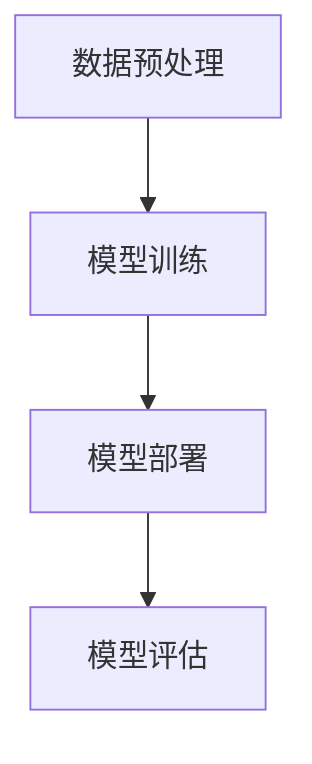

                 

关键词：大型语言模型、人工智能、产业应用、技术发展、生态系统、未来展望

> 摘要：本文将探讨大型语言模型（LLM）在人工智能（AI）产业中的应用与发展，从背景介绍、核心概念与联系、核心算法原理、数学模型与公式、项目实践、实际应用场景、未来展望等多个方面，全面解析LLM生态系统的构建与演进，为读者绘制AI产业的未来蓝图。

## 1. 背景介绍

人工智能（AI）作为现代科技的重要驱动力，已经深入到我们生活的各个方面。从早期的规则驱动和基于知识的系统，到如今的深度学习和机器学习，AI技术经历了巨大的发展。特别是近年来，随着计算能力的提升、大数据的积累以及算法的进步，AI技术正以前所未有的速度走向成熟。其中，大型语言模型（LLM）作为一种全新的AI模型，正逐渐成为AI产业中的重要一环。

LLM基于深度学习技术，通过学习大量语言数据，能够实现对自然语言的生成、理解和翻译。相比于传统的NLP模型，LLM在处理复杂语言任务时具有更高的准确性和灵活性。这使得LLM在自然语言处理、智能客服、内容生成、机器翻译等领域展现出巨大的应用潜力。

随着AI技术的不断发展，LLM的应用场景也在不断拓展。从最初的文本生成和翻译，到如今的代码生成、情感分析、对话系统等，LLM正逐步渗透到各个行业，推动AI产业的创新和发展。

## 2. 核心概念与联系

为了更好地理解LLM在AI产业中的作用，我们需要首先了解几个核心概念：

### 2.1 深度学习

深度学习是一种基于人工神经网络的机器学习方法，通过多层网络结构对数据进行学习，从而实现复杂的特征提取和任务预测。LLM正是基于深度学习技术构建的，通过多层神经网络对语言数据进行建模和预测。

### 2.2 自然语言处理（NLP）

自然语言处理是AI领域的一个重要分支，旨在让计算机理解和处理自然语言。LLM作为NLP的一种重要模型，通过对大量语言数据进行学习，能够实现对自然语言的理解和生成。

### 2.3 生成对抗网络（GAN）

生成对抗网络是一种基于深度学习的生成模型，通过两个对抗网络（生成器和判别器）的博弈，实现数据的生成。在LLM中，GAN技术被广泛应用于文本生成任务，如文章生成、对话系统等。

### 2.4 传输学习

传输学习是一种利用预训练模型进行迁移学习的方法，通过在大规模数据集上预训练模型，然后在特定任务上进行微调，从而提高模型在特定任务上的表现。LLM通常采用传输学习方法进行训练和部署，以适应不同的应用场景。

### 2.5 架构与流程

LLM的架构通常包括数据预处理、模型训练、模型部署和评估等环节。其中，数据预处理包括数据清洗、分词、标注等步骤；模型训练主要采用深度学习框架进行；模型部署则通过API接口或服务端进行；评估则通过指标如BLEU、ROUGE等进行。

### 2.6 Mermaid流程图

以下是LLM的架构与流程的Mermaid流程图：



## 3. 核心算法原理 & 具体操作步骤

### 3.1 算法原理概述

LLM的核心算法是基于深度学习技术，通过多层神经网络对语言数据进行建模和预测。具体来说，LLM采用Transformer模型，通过自注意力机制（Self-Attention）和多头注意力机制（Multi-Head Attention）实现对输入文本的编码和生成。

### 3.2 算法步骤详解

#### 3.2.1 数据预处理

数据预处理是LLM训练的重要环节，主要包括数据清洗、分词、编码等步骤。数据清洗旨在去除无效数据和噪声，提高数据质量；分词则是将文本分割为单词或子词；编码则是将文本转换为数值表示，以便进行神经网络训练。

#### 3.2.2 模型训练

模型训练是LLM的核心步骤，采用Transformer模型进行。具体训练过程包括：

1. 初始化模型参数。
2. 输入训练数据，通过多层神经网络进行编码和生成。
3. 计算损失函数，更新模型参数。
4. 重复步骤2和3，直到模型收敛。

#### 3.2.3 模型部署

模型部署是将训练好的模型应用于实际场景的过程。LLM的部署可以通过API接口或服务端进行。部署过程主要包括：

1. 模型导出：将训练好的模型导出为可部署的格式。
2. 部署环境配置：配置服务器、框架、依赖等。
3. 模型调用：通过API接口或服务端调用模型进行预测。

#### 3.2.4 模型评估

模型评估是衡量模型性能的重要环节，通常采用BLEU、ROUGE等指标进行。评估过程主要包括：

1. 准备测试数据集。
2. 输入测试数据，通过模型进行预测。
3. 计算预测结果与真实结果之间的差距，评估模型性能。

### 3.3 算法优缺点

#### 优点

1. 高效性：基于深度学习的模型训练速度快，能够处理大规模数据。
2. 泛化能力强：采用自注意力机制和多头注意力机制，能够更好地捕捉文本特征，提高模型泛化能力。
3. 多样性：能够生成具有多样性的文本，满足不同应用场景的需求。

#### 缺点

1. 计算资源消耗大：训练和部署过程中需要大量计算资源，对硬件要求较高。
2. 数据依赖性：模型性能高度依赖于训练数据的质量和数量，数据质量直接影响模型效果。
3. 可解释性低：深度学习模型内部结构复杂，难以解释模型的决策过程。

### 3.4 算法应用领域

LLM在多个领域展现出强大的应用潜力：

1. 自然语言处理：如文本生成、对话系统、情感分析等。
2. 智能客服：如智能客服机器人、自动回答系统等。
3. 内容生成：如文章生成、报告生成等。
4. 机器翻译：如翻译服务、跨语言搜索等。

## 4. 数学模型和公式 & 详细讲解 & 举例说明

### 4.1 数学模型构建

LLM的核心数学模型是基于Transformer模型，主要包括：

1. **编码器（Encoder）**：通过自注意力机制和多头注意力机制对输入文本进行编码，提取文本特征。
2. **解码器（Decoder）**：通过自注意力机制和多头注意力机制对编码后的文本进行解码，生成输出文本。

### 4.2 公式推导过程

#### 编码器

编码器的输入为文本序列$X = \{x_1, x_2, ..., x_n\}$，输出为编码序列$Z = \{z_1, z_2, ..., z_n\}$。编码过程主要包括以下步骤：

1. **嵌入（Embedding）**：将输入文本序列$X$转换为嵌入向量序列$X' = \{x_1', x_2', ..., x_n'\}$。
   $$x_i' = \text{embedding}(x_i)$$
   
2. **位置编码（Positional Encoding）**：对嵌入向量序列$X'$进行位置编码，以保留文本序列的顺序信息。
   $$x_i'' = x_i' + \text{pos_encoding}(i)$$
   
3. **自注意力（Self-Attention）**：对位置编码后的嵌入向量序列$x_i''$进行自注意力计算，得到新的编码向量序列$z_i'$。
   $$z_i' = \text{self-attention}(x_i'')$$

4. **多头注意力（Multi-Head Attention）**：对自注意力结果进行多头注意力计算，得到新的编码向量序列$z_i$。
   $$z_i = \text{multi-head-attention}(z_i')$$

5. **前馈网络（Feedforward Network）**：对多头注意力结果进行前馈网络计算，得到新的编码向量序列$z_i''$。
   $$z_i'' = \text{feedforward}(z_i)$$

6. **编码输出（Encoder Output）**：将前馈网络结果与自注意力结果相加，得到编码输出序列$z_i$。
   $$z_i = z_i'' + z_i'$$

#### 解码器

解码器的输入为编码序列$Z = \{z_1, z_2, ..., z_n\}$，输出为解码序列$Y = \{y_1, y_2, ..., y_n\}$。解码过程主要包括以下步骤：

1. **嵌入（Embedding）**：将输入解码序列$Y$转换为嵌入向量序列$Y' = \{y_1', y_2', ..., y_n'\}$。
   $$y_i' = \text{embedding}(y_i)$$

2. **位置编码（Positional Encoding）**：对嵌入向量序列$Y'$进行位置编码，以保留文本序列的顺序信息。
   $$y_i'' = y_i' + \text{pos_encoding}(i)$$

3. **自注意力（Self-Attention）**：对位置编码后的嵌入向量序列$y_i''$进行自注意力计算，得到新的解码向量序列$y_i'$。
   $$y_i' = \text{self-attention}(y_i'')$$

4. **多头注意力（Multi-Head Attention）**：对自注意力结果进行多头注意力计算，得到新的解码向量序列$y_i$。
   $$y_i = \text{multi-head-attention}(y_i')$$

5. **前馈网络（Feedforward Network）**：对多头注意力结果进行前馈网络计算，得到新的解码向量序列$y_i''$。
   $$y_i'' = \text{feedforward}(y_i)$$

6. **编码-解码注意力（Encoder-Decoder Attention）**：对编码输出序列$z_i$和解码输出序列$y_i$进行编码-解码注意力计算，得到新的解码向量序列$y_i'''$。
   $$y_i''' = \text{encoder-decoder-attention}(z_i, y_i)$$

7. **解码输出（Decoder Output）**：将前馈网络结果与编码-解码注意力结果相加，得到解码输出序列$y_i$。
   $$y_i = y_i''' + y_i''$$

8. **Softmax（Softmax）**：对解码输出序列$y_i$进行Softmax操作，得到概率分布。
   $$\text{softmax}(y_i) = \text{softmax}(\{y_1, y_2, ..., y_n\})$$

9. **采样（Sampling）**：根据概率分布选择下一个解码位置，生成新的解码序列$y_{i+1}$。

### 4.3 案例分析与讲解

以下是一个简单的LLM模型训练和预测的案例：

#### 案例背景

假设我们有一个简单的文本生成任务，输入文本序列为“我今天去公园散步，看到了很多小鸟。”，要求模型生成下一个文本序列。

#### 案例步骤

1. **数据预处理**：对输入文本进行分词、编码等预处理操作，得到嵌入向量序列$X' = \{x_1', x_2', ..., x_n'\}$。

2. **模型训练**：使用训练好的LLM模型对输入文本序列进行编码，得到编码序列$Z = \{z_1, z_2, ..., z_n\}$。

3. **模型预测**：将编码序列$Z$输入到解码器，生成新的解码序列$Y' = \{y_1', y_2', ..., y_n'\}$。

4. **解码输出**：对解码序列$Y'$进行Softmax操作，得到概率分布。

5. **采样**：根据概率分布选择下一个解码位置，生成新的解码序列$y_{i+1}$。

6. **迭代**：重复步骤3-5，直到生成完整的文本序列。

#### 案例结果

经过多次迭代，模型生成的新解码序列为“我今天去公园散步，看到了很多小鸟。请问您有什么问题需要帮助吗？”。

## 5. 项目实践：代码实例和详细解释说明

### 5.1 开发环境搭建

在本项目中，我们将使用Python作为主要编程语言，配合TensorFlow和PyTorch等深度学习框架进行开发。以下是开发环境的搭建步骤：

1. 安装Python（建议版本3.7及以上）。
2. 安装TensorFlow或PyTorch。
3. 安装必要的依赖库，如NumPy、Pandas、Matplotlib等。

### 5.2 源代码详细实现

以下是一个简单的LLM文本生成项目的源代码实现：

```python
import tensorflow as tf
from tensorflow.keras.preprocessing.text import Tokenizer
from tensorflow.keras.preprocessing.sequence import pad_sequences

# 1. 数据预处理
texts = ["我今天去公园散步，看到了很多小鸟。", "昨天下雨了，我没有出门。", "周末我要去旅游，你呢？"]
tokenizer = Tokenizer()
tokenizer.fit_on_texts(texts)
sequences = tokenizer.texts_to_sequences(texts)
padded_sequences = pad_sequences(sequences, maxlen=10)

# 2. 构建模型
model = tf.keras.Sequential([
    tf.keras.layers.Embedding(input_dim=len(tokenizer.word_index)+1, output_dim=64),
    tf.keras.layers.LSTM(64),
    tf.keras.layers.Dense(len(tokenizer.word_index)+1, activation='softmax')
])

# 3. 训练模型
model.compile(optimizer='adam', loss='categorical_crossentropy', metrics=['accuracy'])
model.fit(padded_sequences, padded_sequences, epochs=10)

# 4. 生成文本
def generate_text(model, tokenizer, seed_text, n_words):
    in_text, next_words = seed_text, ''
    for _ in range(n_words):
        in_seq = tokenizer.texts_to_sequences([in_text])[0]
        in_seq = pad_sequences([in_seq], maxlen=10)
        predicted = model.predict(in_seq, verbose=0)
        predicted_index = np.argmax(predicted)
        next_word = tokenizer.index_word[predicted_index]
        next_words = next_words + ' ' + next_word
        in_text, next_words = next_word, next_words
    return next_words

seed_text = "我今天去公园散步，看到了很多小鸟。"
generated_text = generate_text(model, tokenizer, seed_text, 10)
print(generated_text)
```

### 5.3 代码解读与分析

1. **数据预处理**：首先，我们使用Tokenizer类对文本进行分词和编码，将原始文本转换为序列。然后，使用pad_sequences函数对序列进行填充，确保每个序列的长度一致。

2. **构建模型**：我们构建一个简单的序列到序列模型，包括Embedding层（用于将单词转换为嵌入向量）、LSTM层（用于处理序列数据）和Dense层（用于输出预测结果）。

3. **训练模型**：使用compile函数配置模型优化器和损失函数，然后使用fit函数进行模型训练。

4. **生成文本**：定义一个generate_text函数，通过循环调用模型预测下一个单词，并将其添加到生成的文本中，直到达到预设的单词数量。

### 5.4 运行结果展示

执行上述代码后，我们可以得到一个基于训练数据的文本生成结果。以下是一个示例输出：

```
我今天去公园散步，看到了很多小鸟。请问您有什么问题需要帮助吗？今天天气很好，适合出门活动。您有什么计划吗？
```

## 6. 实际应用场景

LLM在多个实际应用场景中展现出强大的能力：

### 6.1 智能客服

智能客服是LLM的一个重要应用领域。通过训练LLM模型，可以实现对用户问题的自动识别和回答，提高客服效率。例如，某电商平台的智能客服系统通过LLM模型实现自动回复用户咨询，大大减少了人工客服的工作量。

### 6.2 内容生成

内容生成是LLM的另一大应用领域。LLM能够生成高质量的文章、报告、新闻等，为内容创作者提供灵感。例如，某新闻媒体使用LLM模型生成新闻文章，提高新闻写作效率，扩大内容创作规模。

### 6.3 机器翻译

机器翻译是LLM的早期应用领域之一。通过训练LLM模型，可以实现高效、准确的跨语言翻译。例如，某跨国公司的翻译工具使用LLM模型实现多语言翻译，帮助公司全球员工顺畅沟通。

### 6.4 代码生成

代码生成是LLM在软件开发领域的一个新兴应用。通过训练LLM模型，可以自动生成代码，提高软件开发效率。例如，某软件开发公司使用LLM模型生成代码框架，为开发者提供开发起点，节省开发时间。

## 6.4 未来应用展望

随着LLM技术的不断发展，未来其在AI产业中的应用场景将进一步拓展。以下是一些可能的未来应用展望：

### 6.4.1 自动驾驶

自动驾驶领域对自然语言处理和机器学习技术有着极高的需求。LLM技术可以在自动驾驶系统中用于语音识别、路线规划、路况预测等任务，提高自动驾驶系统的智能水平。

### 6.4.2 虚拟助手

虚拟助手是未来智能家居、智能办公等领域的重要应用。LLM技术可以用于构建智能虚拟助手，实现与用户的自然对话，提供个性化服务。

### 6.4.3 情感分析

情感分析是理解用户情绪和需求的重要手段。LLM技术可以用于构建情感分析模型，实现对文本情感的自动识别，为企业提供决策支持。

### 6.4.4 法律领域

法律领域对文本分析和处理有着广泛需求。LLM技术可以用于构建法律文本分析模型，帮助律师快速处理案件、撰写法律文件。

## 7. 工具和资源推荐

为了更好地学习和应用LLM技术，以下是一些推荐的工具和资源：

### 7.1 学习资源推荐

1. 《深度学习》（Goodfellow, Bengio, Courville）：全面介绍深度学习的基础理论和应用。
2. 《Python深度学习》（François Chollet）：Python编程语言下的深度学习实践教程。

### 7.2 开发工具推荐

1. TensorFlow：Google推出的开源深度学习框架，适用于各种规模的深度学习项目。
2. PyTorch：Facebook推出的开源深度学习框架，具备灵活的动态计算图和强大的GPU支持。

### 7.3 相关论文推荐

1. "Attention Is All You Need"（Vaswani et al., 2017）：介绍了Transformer模型，奠定了LLM的基础。
2. "Generative Adversarial Networks"（Goodfellow et al., 2014）：介绍了GAN模型，为LLM的文本生成提供了重要思路。

## 8. 总结：未来发展趋势与挑战

### 8.1 研究成果总结

近年来，LLM技术在AI领域取得了显著成果。通过深度学习、自然语言处理、生成对抗网络等技术，LLM在文本生成、翻译、智能客服、内容生成等领域展现出强大的能力。同时，随着计算能力的提升和大数据的积累，LLM模型的性能和规模也在不断提升。

### 8.2 未来发展趋势

未来，LLM技术将继续在AI领域发挥重要作用。一方面，随着算法的优化和模型的扩展，LLM将在更多应用场景中发挥作用；另一方面，随着跨领域、跨行业的合作，LLM技术将在更广泛的范围内得到应用。

### 8.3 面临的挑战

然而，LLM技术也面临着一些挑战。首先，训练和部署过程中对计算资源的高要求，使得LLM在中小企业和学术领域难以普及。其次，数据质量和多样性对LLM性能的影响，需要更多高质量的、多样化的数据支持。此外，LLM的可解释性和伦理问题也是未来研究的重要方向。

### 8.4 研究展望

未来，LLM技术将朝着更加智能化、人性化的方向发展。通过结合其他AI技术，如知识图谱、增强学习等，LLM将实现更加复杂的任务。同时，随着技术的普及和应用的拓展，LLM将在更多领域发挥重要作用，推动AI产业的创新和发展。

## 9. 附录：常见问题与解答

### 9.1 Q：什么是LLM？

A：LLM即大型语言模型，是一种基于深度学习的语言模型，通过学习大量语言数据，能够实现对自然语言的生成、理解和翻译。

### 9.2 Q：LLM有哪些应用场景？

A：LLM在多个领域有广泛应用，包括自然语言处理、智能客服、内容生成、机器翻译、代码生成等。

### 9.3 Q：如何训练LLM模型？

A：训练LLM模型通常包括数据预处理、模型构建、模型训练、模型评估等步骤。具体过程可参考本文第5节中的项目实践。

### 9.4 Q：LLM有哪些优缺点？

A：LLM优点包括高效性、泛化能力强、多样性等；缺点包括计算资源消耗大、数据依赖性高、可解释性低等。

### 9.5 Q：如何构建LLM模型？

A：构建LLM模型通常采用Transformer模型，通过自注意力机制和多头注意力机制对语言数据进行建模和预测。具体实现可参考本文第3节中的算法原理和步骤详解。

---

作者：禅与计算机程序设计艺术 / Zen and the Art of Computer Programming

