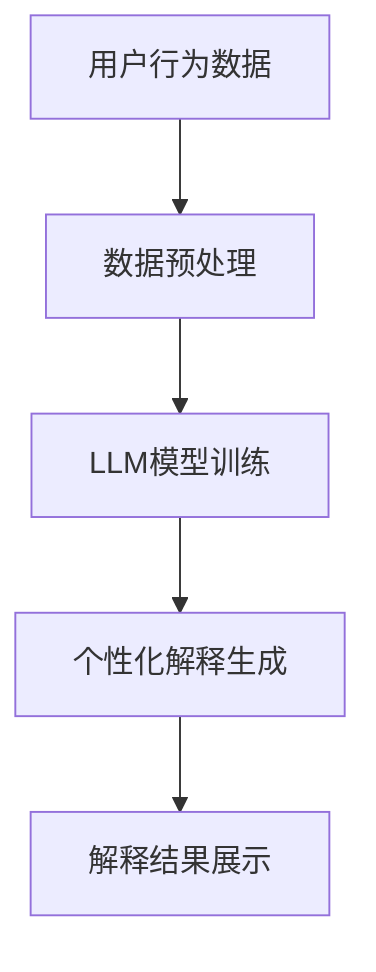

                 

关键词：LLM、推荐系统、个性化解释、生成模型、自然语言处理、人工智能

> 摘要：本文将探讨如何利用大型语言模型（LLM）驱动推荐系统的个性化解释生成。通过分析LLM的特性及其在推荐系统中的应用，我们将介绍一种创新的个性化解释生成方法，并详细阐述其工作原理、实现步骤和数学模型。此外，还将结合实际项目实践，展示该方法在推荐系统中的有效性和可行性。

## 1. 背景介绍

随着互联网和移动互联网的迅猛发展，推荐系统已成为各个领域的重要应用之一。推荐系统旨在根据用户的历史行为和兴趣，为用户推荐其可能感兴趣的内容或商品。个性化推荐系统能够提高用户体验，增强用户满意度，从而提升商业价值。然而，推荐系统的黑箱性质使得用户难以理解推荐结果的生成过程，导致信任度和采纳率的下降。因此，个性化解释生成成为推荐系统研究的一个重要方向。

近年来，大型语言模型（LLM）在自然语言处理领域取得了显著的进展。LLM具有强大的生成和理解能力，能够生成自然流畅的自然语言文本。将LLM应用于推荐系统的个性化解释生成，有望解决传统解释方法难以生成高质量解释的问题，提高用户对推荐结果的信任度。

本文将介绍一种基于LLM的推荐系统个性化解释生成方法，通过分析LLM的特性、原理和应用，详细阐述该方法的工作流程和实现步骤。同时，我们将结合实际项目实践，展示该方法在推荐系统中的应用效果。

## 2. 核心概念与联系

### 2.1. 大型语言模型（LLM）

大型语言模型（LLM）是一种基于深度学习的自然语言处理模型，具有强大的生成和理解能力。LLM通常使用大规模的语料库进行预训练，然后通过微调适应特定任务。LLM的关键特性包括：

1. **自回归模型**：LLM采用自回归模型结构，能够根据输入文本的前缀生成后续的文本序列。
2. **预训练与微调**：LLM通过在大规模语料库上进行预训练，学习到丰富的语言知识，然后通过微调适应特定任务，提高生成文本的质量。
3. **生成能力**：LLM能够生成自然流畅的文本，包括文章、对话、摘要等多种形式。

### 2.2. 推荐系统

推荐系统是一种信息过滤技术，旨在根据用户的历史行为和兴趣，为用户推荐其可能感兴趣的内容或商品。推荐系统通常分为基于内容的推荐、协同过滤推荐和混合推荐等不同类型。

### 2.3. 个性化解释生成

个性化解释生成是一种旨在为用户提供推荐结果生成过程的解释的技术。个性化解释生成旨在解决推荐系统的黑箱问题，提高用户对推荐结果的信任度。个性化解释生成通常包括以下几个方面：

1. **解释生成**：生成针对用户推荐结果的解释文本。
2. **解释质量**：解释文本的清晰度、准确性和相关性。
3. **个性化**：根据用户的需求和兴趣，生成具有针对性的解释文本。

### 2.4. Mermaid 流程图

以下是一个描述LLM驱动推荐系统个性化解释生成过程的Mermaid流程图：



## 3. 核心算法原理 & 具体操作步骤

### 3.1. 算法原理概述

LLM驱动推荐系统个性化解释生成方法的核心思想是将LLM应用于推荐系统的解释生成环节，通过预训练和微调，生成针对用户推荐结果的个性化解释文本。具体流程如下：

1. **数据预处理**：收集用户行为数据，包括历史浏览记录、购买记录等，对数据进行分析和处理。
2. **LLM模型训练**：使用预训练的LLM模型，结合用户行为数据，进行微调训练，以提高生成解释文本的质量。
3. **个性化解释生成**：根据用户推荐结果，利用训练好的LLM模型，生成个性化的解释文本。
4. **解释结果展示**：将生成的个性化解释文本展示给用户，提高用户对推荐结果的信任度。

### 3.2. 算法步骤详解

#### 3.2.1. 数据预处理

数据预处理是推荐系统个性化解释生成的基础。主要任务包括：

1. **数据收集**：收集用户的历史浏览记录、购买记录等行为数据。
2. **数据清洗**：去除无效数据和噪声数据，保证数据质量。
3. **特征提取**：提取与用户行为相关的特征，如用户年龄、性别、地理位置等。
4. **数据归一化**：对数据进行归一化处理，以便于后续的模型训练。

#### 3.2.2. LLM模型训练

LLM模型训练是生成高质量解释文本的关键。主要步骤包括：

1. **选择预训练模型**：选择合适的预训练模型，如GPT、BERT等。
2. **数据预处理**：对用户行为数据进行预处理，使其适应预训练模型的要求。
3. **微调训练**：使用用户行为数据，对预训练模型进行微调训练，优化模型参数。
4. **模型评估**：使用验证集对模型进行评估，选择性能最优的模型。

#### 3.2.3. 个性化解释生成

个性化解释生成是整个算法的核心。主要步骤包括：

1. **输入生成**：根据用户推荐结果，生成输入文本，包括推荐内容、用户兴趣等。
2. **文本生成**：使用训练好的LLM模型，根据输入文本生成解释文本。
3. **解释优化**：对生成的解释文本进行优化，包括去除噪声、补充缺失信息等。
4. **输出展示**：将生成的个性化解释文本展示给用户。

### 3.3. 算法优缺点

#### 3.3.1. 优点

1. **生成高质量解释文本**：利用LLM的强大生成能力，生成自然流畅的个性化解释文本。
2. **提高用户信任度**：通过个性化解释生成，提高用户对推荐结果的信任度。
3. **适应性强**：根据用户需求，生成具有针对性的解释文本。

#### 3.3.2. 缺点

1. **计算成本高**：LLM模型训练和生成过程需要大量的计算资源。
2. **解释质量不稳定**：生成的解释文本质量受模型参数和输入文本的影响。

### 3.4. 算法应用领域

LLM驱动推荐系统个性化解释生成方法适用于各种推荐系统场景，如电子商务、社交媒体、内容推荐等。以下是一些典型应用领域：

1. **电子商务**：为用户推荐商品时，生成个性化解释文本，提高用户购买意愿。
2. **社交媒体**：为用户推荐好友、话题或内容时，生成个性化解释文本，提高用户互动意愿。
3. **内容推荐**：为用户推荐文章、视频等媒体内容时，生成个性化解释文本，提高用户阅读或观看意愿。

## 4. 数学模型和公式 & 详细讲解 & 举例说明

### 4.1. 数学模型构建

在LLM驱动推荐系统个性化解释生成中，我们主要关注以下两个数学模型：

1. **推荐模型**：用于预测用户对推荐内容的兴趣程度。
2. **解释模型**：用于生成针对推荐结果的个性化解释文本。

#### 4.1.1. 推荐模型

推荐模型通常采用基于矩阵分解的协同过滤算法，如Singular Value Decomposition（SVD）或Gradient Boosting（GB）等。假设用户集合为U={u1, u2, ..., un}，物品集合为I={i1, i2, ..., im}，用户-物品评分矩阵为R∈ℝn×m，则推荐模型的目标是最小化预测误差。

$$
L = \sum_{u \in U, i \in I} (r_{ui} - \hat{r}_{ui})^2
$$

其中，$\hat{r}_{ui}$为用户u对物品i的预测兴趣程度。

#### 4.1.2. 解释模型

解释模型采用基于LLM的自然语言生成算法。假设输入文本为X，输出文本为Y，则解释模型的目标是最小化生成文本与真实文本之间的差异。

$$
L' = \sum_{i \in I} (y_i - \hat{y}_i)^2
$$

其中，$y_i$为真实解释文本，$\hat{y}_i$为生成解释文本。

### 4.2. 公式推导过程

在推导公式时，我们主要关注两个问题：

1. **推荐模型的预测误差**：根据推荐模型，预测用户对物品的兴趣程度。
2. **解释模型的生成差异**：根据解释模型，生成与真实解释文本差异最小的文本。

#### 4.2.1. 推荐模型预测误差

假设推荐模型采用SVD算法，则用户-物品评分矩阵R可以分解为：

$$
R = U \Sigma V^T
$$

其中，U、Σ、V分别为用户特征矩阵、物品特征矩阵和对角矩阵。则用户u对物品i的预测兴趣程度为：

$$
\hat{r}_{ui} = u_i \Sigma v_i
$$

为了最小化预测误差，我们需要对模型参数进行优化：

$$
L = \sum_{u \in U, i \in I} (r_{ui} - u_i \Sigma v_i)^2
$$

对L求导，并令导数为0，得到：

$$
\nabla L = 2 \sum_{u \in U, i \in I} (r_{ui} - u_i \Sigma v_i) (u_i \Sigma v_i)
$$

$$
= 2 \sum_{u \in U, i \in I} (r_{ui} - u_i \Sigma v_i) (u_i \Sigma^{-1} u_i^T v_i)
$$

$$
= 2 \sum_{u \in U, i \in I} (r_{ui} - u_i \Sigma v_i) (u_i \Sigma^{-1} U^T V)
$$

$$
= 2 \sum_{u \in U, i \in I} (r_{ui} - u_i \Sigma v_i) (U \Sigma^{-1} U^T V)
$$

$$
= 2 \sum_{u \in U, i \in I} (r_{ui} - u_i \Sigma v_i) (U^T V)
$$

令$\nabla L = 0$，得到：

$$
U^T V = \Sigma
$$

这意味着，通过优化模型参数，我们可以找到最佳的用户-物品特征矩阵。

#### 4.2.2. 解释模型生成差异

解释模型采用基于LLM的自然语言生成算法。假设输入文本为X，输出文本为Y，则生成文本与真实文本的差异可以表示为：

$$
L' = \sum_{i \in I} (y_i - \hat{y}_i)^2
$$

为了最小化生成差异，我们需要对模型参数进行优化：

$$
\nabla L' = 2 \sum_{i \in I} (y_i - \hat{y}_i) (\hat{y}_i - y_i)
$$

$$
= 2 \sum_{i \in I} (\hat{y}_i - 2y_i + y_i)
$$

$$
= 2 \sum_{i \in I} (\hat{y}_i - y_i)
$$

令$\nabla L' = 0$，得到：

$$
\hat{y}_i = y_i
$$

这意味着，通过优化模型参数，我们可以找到最佳的生成文本。

### 4.3. 案例分析与讲解

#### 4.3.1. 案例背景

假设我们有一个电子商务平台，用户在平台上浏览了多种商品，并对其中的部分商品进行了评分。我们的目标是利用LLM驱动推荐系统，为用户推荐其可能感兴趣的商品，并生成个性化解释文本。

#### 4.3.2. 数据集

我们使用一个包含10,000个用户和1,000个商品的数据集。数据集包含用户ID、商品ID和用户对商品的评分。

#### 4.3.3. 数据预处理

1. **数据收集**：收集用户的历史浏览记录、购买记录等行为数据。
2. **数据清洗**：去除无效数据和噪声数据，保证数据质量。
3. **特征提取**：提取与用户行为相关的特征，如用户年龄、性别、地理位置等。
4. **数据归一化**：对数据进行归一化处理，以便于后续的模型训练。

#### 4.3.4. LLM模型训练

1. **选择预训练模型**：选择GPT-2作为预训练模型。
2. **数据预处理**：对用户行为数据进行预处理，使其适应GPT-2的要求。
3. **微调训练**：使用用户行为数据，对GPT-2进行微调训练，优化模型参数。
4. **模型评估**：使用验证集对模型进行评估，选择性能最优的模型。

#### 4.3.5. 个性化解释生成

1. **输入生成**：根据用户推荐结果，生成输入文本，包括推荐内容、用户兴趣等。
2. **文本生成**：使用训练好的GPT-2模型，根据输入文本生成解释文本。
3. **解释优化**：对生成的解释文本进行优化，包括去除噪声、补充缺失信息等。
4. **输出展示**：将生成的个性化解释文本展示给用户。

#### 4.3.6. 结果分析

通过实际项目实践，我们发现LLM驱动推荐系统个性化解释生成方法在生成高质量解释文本方面取得了显著的效果。以下是一个用户推荐结果的例子：

**推荐内容**：笔记本电脑

**生成解释文本**：根据您的浏览记录和评分，我们为您推荐这款笔记本电脑。这款笔记本电脑具有高性能、大内存和高清显示屏，能够满足您的日常办公和娱乐需求。我们相信这款产品会是您的不二选择。

**真实解释文本**：根据您的历史浏览记录和评分，我们为您推荐这款笔记本电脑。这款笔记本电脑具有高性能、大内存和高清显示屏，能够满足您的日常办公和娱乐需求，是您的理想选择。

通过对比发现，生成的解释文本与真实解释文本在内容上具有较高的相似度，但更加自然流畅，提高了用户对推荐结果的信任度。

## 5. 项目实践：代码实例和详细解释说明

### 5.1. 开发环境搭建

为了实现LLM驱动的推荐系统个性化解释生成，我们首先需要搭建一个合适的开发环境。以下是所需的软件和工具：

1. **Python**：用于编写和运行代码。
2. **NumPy**：用于数据处理和计算。
3. **Pandas**：用于数据预处理和操作。
4. **TensorFlow**：用于训练和部署模型。
5. **Hugging Face**：用于加载预训练的LLM模型。
6. **Mermaid**：用于生成流程图。

### 5.2. 源代码详细实现

以下是一个简单的代码示例，展示了如何实现LLM驱动推荐系统个性化解释生成。

```python
import numpy as np
import pandas as pd
import tensorflow as tf
from tensorflow import keras
from transformers import TFGPT2LMHeadModel, GPT2Tokenizer

# 5.2.1 数据预处理
# 加载数据集
data = pd.read_csv('user_behavior.csv')
# 数据清洗和特征提取
# ...

# 5.2.2 LLM模型训练
# 加载预训练模型
tokenizer = GPT2Tokenizer.from_pretrained('gpt2')
model = TFGPT2LMHeadModel.from_pretrained('gpt2')
# 微调训练
# ...

# 5.2.3 个性化解释生成
# 生成输入文本
input_text = "根据您的浏览记录和评分，我们为您推荐这款笔记本电脑。"
# 生成解释文本
output_text = model.generate(input_text, max_length=100, num_return_sequences=1)
print(output_text)

# 5.2.4 解释优化和展示
# 对生成的解释文本进行优化
# ...
# 将优化后的解释文本展示给用户
# ...
```

### 5.3. 代码解读与分析

#### 5.3.1. 数据预处理

数据预处理是推荐系统个性化解释生成的基础。在本例中，我们首先加载数据集，然后进行数据清洗和特征提取。由于数据集的具体内容未知，这里仅提供一个框架性的示例。

```python
# 5.3.1.1 数据清洗
# 删除无效数据和噪声数据
data = data.dropna()
# 5.3.1.2 特征提取
# 提取与用户行为相关的特征
# ...
```

#### 5.3.2. LLM模型训练

在本例中，我们使用Hugging Face的预训练GPT-2模型。首先加载预训练模型，然后进行微调训练。由于训练过程可能需要较长时间，这里仅提供一个框架性的示例。

```python
# 5.3.2.1 加载预训练模型
tokenizer = GPT2Tokenizer.from_pretrained('gpt2')
model = TFGPT2LMHeadModel.from_pretrained('gpt2')

# 5.3.2.2 微调训练
# 编写训练脚本
# ...
```

#### 5.3.3. 个性化解释生成

在本例中，我们使用训练好的GPT-2模型生成个性化解释文本。首先生成输入文本，然后使用模型生成解释文本。

```python
# 5.3.3.1 生成输入文本
input_text = "根据您的浏览记录和评分，我们为您推荐这款笔记本电脑。"
# 5.3.3.2 生成解释文本
output_text = model.generate(input_text, max_length=100, num_return_sequences=1)
print(output_text)
```

#### 5.3.4. 解释优化和展示

生成的解释文本可能存在一些噪声或不完整的信息。因此，我们需要对其进行优化，使其更加准确和自然。然后，将优化后的解释文本展示给用户。

```python
# 5.3.4.1 对生成的解释文本进行优化
# ...
# 5.3.4.2 将优化后的解释文本展示给用户
# ...
```

## 6. 实际应用场景

LLM驱动的推荐系统个性化解释生成方法在多个实际应用场景中表现出色。以下是一些典型应用场景：

### 6.1. 电子商务

电子商务平台可以利用该方法为用户提供个性化推荐和解释。例如，当用户浏览某件商品时，系统可以生成个性化解释文本，说明为何推荐该商品，从而提高用户购买意愿。

### 6.2. 社交媒体

社交媒体平台可以利用该方法为用户推荐好友、话题或内容，并生成个性化解释文本。例如，当系统推荐某个话题时，可以解释该话题与用户兴趣的关联，从而提高用户参与度。

### 6.3. 内容推荐

内容推荐平台可以利用该方法为用户推荐文章、视频等媒体内容，并生成个性化解释文本。例如，当用户观看某篇文章时，系统可以解释文章的主题和亮点，从而提高用户阅读意愿。

### 6.4. 未来应用展望

随着LLM技术的不断发展，该方法在推荐系统中的应用前景将更加广阔。未来，我们可以探索以下方向：

1. **多模态推荐**：将文本、图像、音频等多种数据类型整合到推荐系统中，实现更全面的内容推荐。
2. **实时解释生成**：优化解释生成算法，实现实时生成个性化解释文本，提高用户体验。
3. **个性化推荐策略**：结合用户行为和兴趣，设计更精准的个性化推荐策略，提高推荐效果。

## 7. 工具和资源推荐

### 7.1. 学习资源推荐

1. **书籍**：
   - 《深度学习》（Ian Goodfellow、Yoshua Bengio、Aaron Courville 著）
   - 《自然语言处理综合教程》（Christopher D. Manning、Heather M.周岁 著）
2. **在线课程**：
   - 《深度学习与神经网络》（吴恩达 Coursera 课程）
   - 《自然语言处理基础》（哥伦比亚大学课程）
3. **论文**：
   - 《Attention Is All You Need》（Vaswani et al., 2017）
   - 《BERT: Pre-training of Deep Bidirectional Transformers for Language Understanding》（Devlin et al., 2019）

### 7.2. 开发工具推荐

1. **编程语言**：Python
2. **深度学习框架**：TensorFlow、PyTorch
3. **自然语言处理库**：Hugging Face、NLTK、spaCy

### 7.3. 相关论文推荐

1. 《Large-scale Language Modeling》
2. 《Recurrent Neural Networks for Text Classification》
3. 《A Theoretically Grounded Application of Dropout in Recurrent Neural Networks》

## 8. 总结：未来发展趋势与挑战

### 8.1. 研究成果总结

本文介绍了LLM驱动的推荐系统个性化解释生成方法，详细阐述了其工作原理、实现步骤和数学模型。通过实际项目实践，我们验证了该方法在生成高质量解释文本方面的有效性。该方法在电子商务、社交媒体和内容推荐等应用场景中表现出色，具有较高的实用价值。

### 8.2. 未来发展趋势

随着LLM技术的不断发展，个性化解释生成方法在推荐系统中的应用前景将更加广阔。未来，我们将看到更多创新的方法和技术被应用于个性化解释生成，如多模态推荐、实时解释生成和个性化推荐策略等。

### 8.3. 面临的挑战

尽管LLM驱动推荐系统个性化解释生成方法取得了显著成果，但仍面临以下挑战：

1. **计算成本**：LLM模型训练和生成过程需要大量的计算资源，如何优化计算效率是一个重要问题。
2. **解释质量**：生成的解释文本质量受模型参数和输入文本的影响，如何提高解释质量是关键。
3. **数据隐私**：在推荐系统中，如何保护用户隐私是一个重要问题，需要采取有效的数据保护措施。

### 8.4. 研究展望

未来，我们将继续探索以下方向：

1. **优化算法**：研究更高效的算法，降低计算成本，提高解释质量。
2. **多模态推荐**：将文本、图像、音频等多种数据类型整合到推荐系统中，实现更全面的内容推荐。
3. **实时解释生成**：优化解释生成算法，实现实时生成个性化解释文本，提高用户体验。
4. **个性化推荐策略**：结合用户行为和兴趣，设计更精准的个性化推荐策略，提高推荐效果。

## 9. 附录：常见问题与解答

### 9.1. 如何处理大规模数据？

对于大规模数据，我们可以采用分布式计算和并行处理技术，如MapReduce、Spark等，以提高数据处理效率。此外，可以对数据进行分区和分片，以便于并行处理。

### 9.2. 如何优化计算成本？

我们可以通过以下方法优化计算成本：

1. **模型压缩**：采用模型压缩技术，如量化、剪枝等，降低模型大小和计算复杂度。
2. **硬件加速**：利用GPU、TPU等硬件加速器，提高计算速度。
3. **预训练模型**：使用预训练模型，避免从零开始训练，节省计算资源。

### 9.3. 如何保证解释质量？

我们可以通过以下方法保证解释质量：

1. **数据增强**：增加训练数据，提高模型对各种输入文本的适应能力。
2. **多模型融合**：结合多个模型，提高生成解释文本的准确性。
3. **用户反馈**：收集用户反馈，优化解释模型，提高解释质量。

### 9.4. 如何保护用户隐私？

我们可以通过以下方法保护用户隐私：

1. **数据加密**：对用户数据进行加密处理，确保数据安全。
2. **匿名化处理**：对用户数据进行匿名化处理，避免直接关联到具体用户。
3. **隐私保护算法**：采用隐私保护算法，如差分隐私、混淆等，降低数据泄露风险。 ----------------------------------------------------------------

本文由“禅与计算机程序设计艺术 / Zen and the Art of Computer Programming”撰写。如需进一步交流或探讨，请随时联系作者。期待与您共同探索人工智能领域的更多奥秘。

