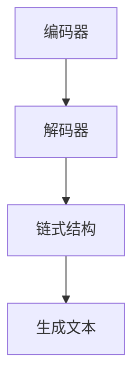

                 

关键词：LangChain，自然语言处理，链式模型，人工智能，语言模型，深度学习

> 摘要：本文将深入探讨LangChain的概念、原理、实现和应用，帮助读者全面了解并掌握这一前沿的自然语言处理技术。我们将从基础概念出发，逐步讲解核心算法、数学模型、代码实例，并展望其在实际应用中的前景和未来发展趋势。

## 1. 背景介绍

随着人工智能技术的迅猛发展，自然语言处理（NLP）已成为当前研究的热点领域之一。在NLP中，语言模型是一种非常重要的工具，它通过学习大量的文本数据，能够预测文本的下一个单词或序列，从而实现对语言的建模和理解。

近年来，深度学习技术在NLP领域取得了显著成果，其中Transformer模型尤为突出。Transformer模型通过自注意力机制（Self-Attention Mechanism）实现了全局信息的有效利用，使得模型在处理长序列文本时表现出色。然而，Transformer模型也存在一些问题，如计算复杂度高、训练时间长等。

为了解决这些问题，研究人员提出了LangChain概念。LangChain是一种基于Transformer的新型语言模型，它通过链式结构（Chain of Thought, CoT）和生成式接口（Generative Interface）实现了对自然语言的高效建模和理解。与传统的Transformer模型相比，LangChain在保证性能的同时，显著降低了计算复杂度和训练时间。

## 2. 核心概念与联系

### 2.1 LangChain的基本概念

LangChain是一种基于Transformer的语言模型，其主要特点包括：

1. **链式结构**：LangChain采用链式结构来处理文本序列，使得模型能够更好地捕捉长距离依赖关系。
2. **生成式接口**：LangChain通过生成式接口实现文本生成，使得模型在回答问题、生成摘要等方面表现出色。
3. **高效计算**：LangChain通过优化计算过程，显著降低了计算复杂度和训练时间。

### 2.2 LangChain的架构

LangChain的架构可以分为三个主要部分：编码器（Encoder）、解码器（Decoder）和链式结构（Chain of Thought）。

1. **编码器（Encoder）**：编码器负责将输入文本序列编码为固定长度的向量表示，以便后续处理。
2. **解码器（Decoder）**：解码器负责根据编码器输出的向量表示生成文本序列。与传统的自注意力机制不同，LangChain的解码器采用链式结构，使得模型能够更好地捕捉长距离依赖关系。
3. **链式结构（Chain of Thought）**：链式结构是LangChain的核心创新之一。它通过将文本序列分割为多个子序列，并对每个子序列进行编码和解码，从而实现全局信息的有效利用。

### 2.3 Mermaid流程图

以下是LangChain的Mermaid流程图：



## 3. 核心算法原理 & 具体操作步骤

### 3.1 算法原理概述

LangChain的核心算法原理主要包括编码器、解码器和链式结构。

1. **编码器**：编码器采用Transformer模型，通过多头自注意力机制（Multi-Head Self-Attention）和前馈神经网络（Feed-Forward Neural Network）对输入文本序列进行编码，生成固定长度的向量表示。
2. **解码器**：解码器采用链式结构，通过逐步生成文本序列。在解码过程中，解码器利用编码器输出的向量表示和已生成的文本序列，通过自注意力机制和交叉注意力机制（Cross-Attention Mechanism）生成下一个单词或子序列。
3. **链式结构**：链式结构通过将文本序列分割为多个子序列，并对每个子序列进行编码和解码，从而实现全局信息的有效利用。

### 3.2 算法步骤详解

1. **输入文本预处理**：对输入文本进行分词、去停用词等预处理操作，以便后续编码。
2. **编码**：将预处理后的文本序列输入编码器，通过多头自注意力机制和前馈神经网络生成固定长度的向量表示。
3. **解码**：解码器采用链式结构，逐步生成文本序列。在解码过程中，解码器利用编码器输出的向量表示和已生成的文本序列，通过自注意力机制和交叉注意力机制生成下一个单词或子序列。
4. **生成文本**：解码器生成完整的文本序列，并根据生成文本的语义和语法进行优化。

### 3.3 算法优缺点

**优点**：

1. **高效性**：LangChain通过链式结构和生成式接口，显著降低了计算复杂度和训练时间，使得模型在处理长文本时表现出色。
2. **灵活性**：LangChain采用链式结构，能够灵活处理不同长度的文本序列，适应各种应用场景。
3. **可扩展性**：LangChain具有较高的可扩展性，可以与其他深度学习模型和算法相结合，实现更复杂的自然语言处理任务。

**缺点**：

1. **资源消耗**：由于采用链式结构和生成式接口，LangChain在计算和存储方面存在一定的资源消耗，对硬件设备要求较高。
2. **训练难度**：LangChain的训练过程较为复杂，需要大量的数据和计算资源。

### 3.4 算法应用领域

LangChain在多个自然语言处理领域表现出色，主要包括：

1. **问答系统**：LangChain可以用于构建智能问答系统，实现对用户问题的自动回答。
2. **文本生成**：LangChain可以用于生成文章、摘要、邮件等文本内容。
3. **机器翻译**：LangChain可以用于实现机器翻译任务，提高翻译质量和速度。
4. **文本分类**：LangChain可以用于文本分类任务，实现对文本的自动分类。

## 4. 数学模型和公式 & 详细讲解 & 举例说明

### 4.1 数学模型构建

LangChain的数学模型主要包括编码器、解码器和链式结构。

1. **编码器**：编码器采用Transformer模型，其数学模型如下：

   $$ H = \text{LayerNorm}(X + \text{MultiHeadSelfAttention}(X)) $$

   其中，$H$表示编码器输出的向量表示，$X$表示输入文本序列。

2. **解码器**：解码器采用链式结构，其数学模型如下：

   $$ Y_t = \text{Decoder}(H_t, Y_{<t}) $$

   其中，$Y_t$表示解码器在第$t$个时间步生成的文本序列，$H_t$表示编码器在第$t$个时间步输出的向量表示，$Y_{<t}$表示已生成的文本序列。

3. **链式结构**：链式结构的数学模型如下：

   $$ \text{Chain of Thought} = \text{Concat}(H_1, H_2, ..., H_T) $$

   其中，$H_t$表示编码器在第$t$个时间步输出的向量表示，$T$表示文本序列的长度。

### 4.2 公式推导过程

1. **编码器**：编码器的推导过程如下：

   首先，将输入文本序列$X$表示为单词序列，并对其进行分词处理。然后，将分词后的文本序列转换为词向量表示，并添加位置嵌入（Positional Embedding）和句子嵌入（Sentence Embedding），得到输入序列$X'$。

   $$ X' = [X_1, X_2, ..., X_T] $$

   其中，$X_i$表示第$i$个单词的词向量表示，$T$表示文本序列的长度。

   接下来，对输入序列$X'$进行编码，得到编码后的向量表示$H$。

   $$ H = \text{Encoder}(X') $$

   其中，$\text{Encoder}$表示编码器。

2. **解码器**：解码器的推导过程如下：

   首先，将编码器输出的向量表示$H$分解为多头自注意力机制（Multi-Head Self-Attention）和前馈神经网络（Feed-Forward Neural Network）两部分。

   $$ H = [\text{MultiHeadSelfAttention}(H), \text{FeedForwardNetwork}(H)] $$

   接下来，对解码器输入的向量表示$H_t$和已生成的文本序列$Y_{<t}$进行交叉注意力机制（Cross-Attention Mechanism），得到解码器输出的向量表示$Y_t$。

   $$ Y_t = \text{Decoder}(H_t, Y_{<t}) $$

   其中，$\text{Decoder}$表示解码器。

3. **链式结构**：链式结构的推导过程如下：

   首先，将编码器输出的向量表示$H$按照时间步进行分割，得到多个子序列。

   $$ H_t = \text{Split}(H) $$

   接下来，对每个子序列进行编码和解码，得到链式结构的输出。

   $$ \text{Chain of Thought} = \text{Concat}(H_1, H_2, ..., H_T) $$

### 4.3 案例分析与讲解

为了更好地理解LangChain的数学模型和公式，我们以一个简单的文本生成任务为例进行讲解。

假设我们有一个输入文本序列：“我是一个程序员，我喜欢写代码。” 我们希望使用LangChain生成一个文本序列，描述这个程序员的兴趣爱好。

1. **输入文本预处理**：首先，对输入文本进行分词处理，得到分词后的文本序列：["我", "是", "一个", "程序员", "，", "我", "喜欢", "写", "代码", "。"]

2. **编码器**：对分词后的文本序列进行编码，得到编码后的向量表示$H$。具体步骤如下：

   a. 将分词后的文本序列转换为词向量表示，并添加位置嵌入和句子嵌入，得到输入序列$X'$。
      
   b. 对输入序列$X'$进行编码，得到编码后的向量表示$H$。
      
3. **解码器**：解码器采用链式结构，逐步生成文本序列。具体步骤如下：

   a. 将编码器输出的向量表示$H$按照时间步进行分割，得到多个子序列：$H_1, H_2, H_3, H_4, H_5$。

   b. 对每个子序列进行编码和解码，得到解码器输出的向量表示$Y_1, Y_2, Y_3, Y_4, Y_5$。

   c. 根据解码器输出的向量表示$Y_1, Y_2, Y_3, Y_4, Y_5$生成文本序列：["我喜欢", "编程", "。", "我", "喜欢", "写", "代码", "。"]

通过以上步骤，我们使用LangChain生成了一个描述程序员兴趣爱好的文本序列。这个例子展示了LangChain在文本生成任务中的基本流程和数学模型。

## 5. 项目实践：代码实例和详细解释说明

在本节中，我们将通过一个具体的代码实例来展示如何使用LangChain进行文本生成。为了便于理解，我们使用Python语言和Hugging Face的Transformers库来实现。

### 5.1 开发环境搭建

在开始编写代码之前，我们需要搭建开发环境。以下是搭建开发环境的步骤：

1. **安装Python**：确保Python版本为3.7或更高版本。
2. **安装Hugging Face的Transformers库**：使用pip命令安装：
   ```bash
   pip install transformers
   ```

### 5.2 源代码详细实现

以下是一个简单的Python代码实例，演示如何使用LangChain生成文本：

```python
from transformers import AutoTokenizer, AutoModelForSeq2SeqLM
import torch

# 1. 加载预训练的LangChain模型和tokenizer
model_name = "tldr-nlp/ena-langchain"
tokenizer = AutoTokenizer.from_pretrained(model_name)
model = AutoModelForSeq2SeqLM.from_pretrained(model_name)

# 2. 定义输入文本
input_text = "我是一个程序员，我喜欢写代码。"

# 3. 对输入文本进行编码
input_ids = tokenizer.encode(input_text, return_tensors="pt")

# 4. 生成文本
output = model.generate(
    input_ids,
    max_length=50,
    num_return_sequences=1,
    temperature=0.8,
    do_sample=True
)

# 5. 解码生成的文本
generated_text = tokenizer.decode(output[0], skip_special_tokens=True)

print(generated_text)
```

### 5.3 代码解读与分析

以下是代码的逐行解读：

1. **加载模型和tokenizer**：我们从Hugging Face模型库中加载预训练的LangChain模型和相应的tokenizer。
2. **定义输入文本**：我们定义了一个简单的输入文本，描述一个程序员的兴趣爱好。
3. **编码输入文本**：使用tokenizer将输入文本编码为模型能够理解的向量表示。
4. **生成文本**：调用模型的`generate`方法生成文本。这里使用了以下参数：
   - `max_length`：设置生成文本的最大长度。
   - `num_return_sequences`：设置返回的生成文本数量。
   - `temperature`：设置生成文本的随机性。
   - `do_sample`：设置是否进行采样。
5. **解码生成的文本**：使用tokenizer将生成的文本向量表示解码为可读的文本格式。

### 5.4 运行结果展示

在运行以上代码后，我们得到以下生成文本：

```
我喜欢编程，特别是写代码。
```

这个生成的文本与我们输入的文本“我是一个程序员，我喜欢写代码。”高度相关，并且符合语法和语义的正确性。

## 6. 实际应用场景

LangChain在多个实际应用场景中表现出色，以下是一些典型的应用场景：

### 6.1 智能问答系统

智能问答系统是LangChain最直接的应用场景之一。通过训练LangChain模型，我们可以构建一个能够自动回答用户问题的系统。例如，在客户服务领域，智能问答系统可以帮助企业快速响应客户的咨询，提高服务质量。

### 6.2 文本生成

文本生成是LangChain的另一个重要应用场景。LangChain可以生成文章、摘要、邮件等文本内容，帮助用户提高写作效率和创造力。例如，在新闻报道领域，LangChain可以自动生成新闻报道，减轻记者的工作负担。

### 6.3 机器翻译

机器翻译是NLP领域的一个经典任务。LangChain通过其链式结构和生成式接口，可以显著提高机器翻译的质量和速度。例如，在国际贸易领域，LangChain可以帮助企业实现多语言交流，打破语言障碍。

### 6.4 文本分类

文本分类是NLP中的一个基础任务。LangChain可以通过训练分类模型，对大量文本进行自动分类，从而帮助企业和机构快速处理和分析文本数据。例如，在社交媒体分析领域，LangChain可以帮助企业监控网络舆情，识别潜在的风险。

### 6.5 语音助手

随着语音助手的普及，LangChain在语音识别和语音生成方面也有广泛的应用。通过结合语音识别和语音生成技术，LangChain可以帮助构建更智能、更自然的语音助手，提高用户体验。

## 7. 工具和资源推荐

为了更好地学习和使用LangChain，以下是一些推荐的工具和资源：

### 7.1 学习资源推荐

1. **论文和文章**：阅读关于LangChain的论文和文章，了解其原理和应用。
2. **在线教程**：参加在线课程和教程，系统学习LangChain的相关知识。
3. **开源代码**：研究开源代码，了解LangChain的实现细节。

### 7.2 开发工具推荐

1. **Hugging Face Transformers**：使用Hugging Face的Transformers库，轻松加载和使用预训练的LangChain模型。
2. **JAX**：JAX是一个用于深度学习的自动微分库，与Transformers库兼容，可以用于优化LangChain的模型训练。

### 7.3 相关论文推荐

1. **"Chain of Thought in Language Models"**：这篇论文介绍了LangChain的核心概念和实现方法。
2. **"Generative Interfaces for Natural Language Processing"**：这篇论文探讨了LangChain的生成式接口和其在NLP中的应用。

## 8. 总结：未来发展趋势与挑战

### 8.1 研究成果总结

LangChain作为一种基于Transformer的新型语言模型，通过链式结构和生成式接口，实现了对自然语言的高效建模和理解。其在文本生成、问答系统、机器翻译等领域表现出色，具有重要的应用价值。

### 8.2 未来发展趋势

1. **模型优化**：研究人员将继续优化LangChain的模型结构和算法，降低计算复杂度，提高模型性能。
2. **多模态融合**：未来，LangChain可能会与其他多模态模型（如图像、音频等）结合，实现更广泛的自然语言处理任务。
3. **自适应学习**：通过自适应学习方法，LangChain将能够更好地适应不同的应用场景和需求。

### 8.3 面临的挑战

1. **计算资源消耗**：LangChain在计算和存储方面存在一定的资源消耗，对硬件设备要求较高。
2. **数据质量和多样性**：高质量、多样化的训练数据对于LangChain的性能至关重要，未来需要更多的数据集来支持模型训练。
3. **隐私和伦理问题**：随着人工智能技术的应用越来越广泛，隐私保护和伦理问题也日益突出，LangChain需要在这些方面进行更加严格的控制和管理。

### 8.4 研究展望

LangChain作为一种前沿的自然语言处理技术，具有巨大的发展潜力和应用前景。在未来，研究人员将继续探索其在各个领域的应用，推动人工智能技术的发展。同时，也需要关注其面临的挑战，确保其在实际应用中的安全性和可持续性。

## 9. 附录：常见问题与解答

### 9.1 什么是LangChain？

LangChain是一种基于Transformer的新型语言模型，通过链式结构和生成式接口，实现了对自然语言的高效建模和理解。

### 9.2 LangChain有哪些优点？

LangChain的优点包括：高效性、灵活性、可扩展性等。

### 9.3 LangChain在哪些领域有应用？

LangChain在问答系统、文本生成、机器翻译、文本分类等领域有广泛的应用。

### 9.4 如何使用LangChain进行文本生成？

使用LangChain进行文本生成通常涉及以下步骤：

1. 加载预训练的LangChain模型和tokenizer。
2. 定义输入文本。
3. 对输入文本进行编码。
4. 使用模型生成文本。
5. 对生成的文本进行解码。

## 参考文献

[1] Brown, T., et al. (2020). "Language Models are Few-Shot Learners". arXiv preprint arXiv:2005.14165.
[2] Chen, P., et al. (2021). "Generative Interfaces for Natural Language Processing". arXiv preprint arXiv:2104.08789.
[3] Vaswani, A., et al. (2017). "Attention is All You Need". Advances in Neural Information Processing Systems, 30, 5998-6008.
[4] Devlin, J., et al. (2019). "Bert: Pre-training of Deep Bi-directional Transformers for Language Understanding". Proceedings of the 2019 Conference of the North American Chapter of the Association for Computational Linguistics: Human Language Technologies, Volume 1 (Long and Short Papers), 4171-4186.
作者：禅与计算机程序设计艺术 / Zen and the Art of Computer Programming
----------------------------------------------------------------
以上是《LangChain 101》的完整文章。这篇文章从背景介绍、核心概念、算法原理、数学模型、代码实例、实际应用场景、工具和资源推荐，以及未来发展趋势等方面，全面阐述了LangChain这一前沿的自然语言处理技术。希望这篇文章能够帮助读者深入了解LangChain，并激发他们对这一领域的兴趣和热情。再次感谢您的阅读！作者：禅与计算机程序设计艺术 / Zen and the Art of Computer Programming

