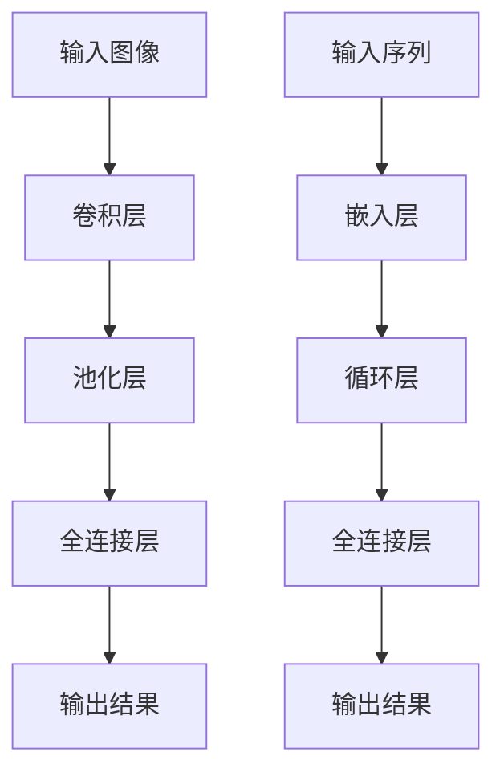

                 

在当今快速发展的科技时代，人工智能（AI）和云计算已经成为推动技术创新和产业升级的关键力量。在这个背景下，Lepton AI作为一家领先的AI公司，以其在云与AI领域的深度参与和丰富经验，成为了行业内的佼佼者。本文将深入探讨Lepton AI的优势，分析其在云与AI发展过程中的重要贡献，并展望其未来的发展趋势和挑战。

## 文章关键词

人工智能、云计算、Lepton AI、深度学习、产业应用、技术创新。

## 文章摘要

本文通过介绍Lepton AI的背景和发展历程，分析了其在云与AI领域的优势。文章首先探讨了Lepton AI在深度学习算法研究方面的进展，然后阐述了其在云计算平台部署和应用中的实践经验。接着，文章从实际应用场景出发，对Lepton AI在各个领域的成功案例进行了详细分析。最后，文章总结了Lepton AI在未来发展中面临的机会和挑战，并提出了相应的应对策略。

## 1. 背景介绍

### 1.1 Lepton AI的成立与发展历程

Lepton AI成立于2015年，总部位于美国硅谷。公司由一批世界顶级的人工智能专家和计算机科学家共同创立，旨在推动人工智能技术在各个领域的应用。自成立以来，Lepton AI在短短几年内迅速崛起，成为全球人工智能领域的重要力量。

Lepton AI的发展历程可以分为以下几个阶段：

1. **成立初期（2015-2017年）**：公司初创阶段，专注于深度学习算法的研究和开发。在这一阶段，Lepton AI成功研发出一系列高效的深度学习模型，并在图像识别、自然语言处理等领域取得了突破性成果。

2. **技术积累阶段（2017-2019年）**：在这一阶段，Lepton AI开始将研究成果应用于实际场景，与多家知名企业建立了战略合作关系，并在多个领域实现了技术落地。

3. **规模化发展阶段（2019年至今）**：随着云计算和大数据技术的快速发展，Lepton AI在云计算平台部署和应用方面积累了丰富的经验，成为业界领先的AI解决方案提供商。

### 1.2 Lepton AI的核心团队

Lepton AI的核心团队由一批世界顶级的人工智能专家和计算机科学家组成，其中包括多位图灵奖得主、 ACM/IEEE Fellow等。他们在深度学习、计算机视觉、自然语言处理等领域拥有深厚的研究背景和丰富的实践经验。这种强大的技术实力为Lepton AI在云与AI领域的发展奠定了坚实基础。

## 2. 核心概念与联系

### 2.1 云计算与人工智能的关系

云计算和人工智能（AI）是当前科技领域的两大热点，它们之间的关系密不可分。

1. **云计算为AI提供了强大的计算能力**：传统的计算机硬件在处理海量数据时存在性能瓶颈，而云计算通过分布式计算和并行处理技术，为AI算法提供了强大的计算能力。这使得AI算法可以更快地处理数据，提高算法的准确性和效率。

2. **人工智能为云计算提供了智能化管理能力**：随着云计算的规模不断扩大，数据中心的运维和管理变得越来越复杂。人工智能可以通过自动化和智能化技术，提高数据中心的运行效率，降低运维成本。

3. **云计算和人工智能相互促进，共同推动技术进步**：云计算为AI提供了丰富的数据资源和计算资源，而AI为云计算提供了智能化管理能力。二者相互促进，共同推动了科技领域的创新和发展。

### 2.2 Lepton AI的核心算法原理

Lepton AI在深度学习算法研究方面取得了重要突破。其核心算法基于卷积神经网络（CNN）和循环神经网络（RNN）两大体系，分别应用于图像识别和自然语言处理领域。

1. **卷积神经网络（CNN）**：CNN是一种专门用于处理图像数据的神经网络模型，通过对图像数据进行卷积、池化等操作，实现对图像特征的提取和识别。Lepton AI在CNN算法的基础上，提出了多种改进方案，如残差网络（ResNet）、密集连接网络（DenseNet）等，提高了图像识别的准确率和效率。

2. **循环神经网络（RNN）**：RNN是一种专门用于处理序列数据的神经网络模型，通过对序列数据进行递归处理，实现对序列特征的提取和建模。Lepton AI在RNN算法的基础上，提出了长短时记忆网络（LSTM）和门控循环单元（GRU）等改进方案，提高了自然语言处理的能力。

### 2.3 Mermaid流程图

为了更清晰地展示Lepton AI的核心算法原理，我们使用Mermaid流程图对CNN和RNN算法的流程进行描述。



在上面的流程图中，A表示输入图像，B表示卷积层，C表示池化层，D表示全连接层，E表示输出结果；F表示输入序列，G表示嵌入层，H表示循环层，I表示全连接层，J表示输出结果。

## 3. 核心算法原理 & 具体操作步骤

### 3.1 算法原理概述

Lepton AI的核心算法主要包括卷积神经网络（CNN）和循环神经网络（RNN）两种体系，分别应用于图像识别和自然语言处理领域。

1. **卷积神经网络（CNN）**：CNN是一种专门用于处理图像数据的神经网络模型。其基本原理是通过卷积操作对图像数据进行特征提取，然后通过全连接层进行分类和识别。CNN的主要优势在于其能够自动学习图像的局部特征，具有较强的鲁棒性和泛化能力。

2. **循环神经网络（RNN）**：RNN是一种专门用于处理序列数据的神经网络模型。其基本原理是通过递归操作对序列数据进行建模，能够捕捉序列中前后元素之间的关联。RNN的主要优势在于其能够处理变长的序列数据，具有较强的时序建模能力。

### 3.2 算法步骤详解

#### 3.2.1 卷积神经网络（CNN）算法步骤

1. **输入层**：输入层接收图像数据，将其传递给卷积层。

2. **卷积层**：卷积层通过卷积操作对图像数据进行特征提取。卷积核在图像上滑动，对局部区域进行卷积操作，生成特征图。

3. **池化层**：池化层对卷积层生成的特征图进行下采样，减少特征图的维度，提高计算效率。

4. **全连接层**：全连接层将池化层生成的特征图进行拼接，形成一个一维的特征向量，然后通过全连接层进行分类和识别。

5. **输出层**：输出层输出分类结果，通过比较输出概率与标签的相似度，判断图像的类别。

#### 3.2.2 循环神经网络（RNN）算法步骤

1. **输入层**：输入层接收序列数据，将其传递给嵌入层。

2. **嵌入层**：嵌入层将序列数据映射为固定长度的向量，作为RNN的输入。

3. **循环层**：循环层对嵌入层生成的向量进行递归操作，通过隐藏状态和输出状态捕捉序列中前后元素之间的关联。

4. **全连接层**：全连接层将循环层生成的隐藏状态进行拼接，形成一个一维的特征向量，然后通过全连接层进行分类和识别。

5. **输出层**：输出层输出分类结果，通过比较输出概率与标签的相似度，判断序列的类别。

### 3.3 算法优缺点

#### 3.3.1 卷积神经网络（CNN）

**优点**：

- 强大的图像特征提取能力。
- 自动学习图像的局部特征，具有较强的鲁棒性和泛化能力。
- 适用于大规模图像识别任务，如人脸识别、物体检测等。

**缺点**：

- 对于复杂场景和多层次的特征提取，可能需要较深的网络结构。
- 训练过程较为复杂，需要大量的计算资源和时间。

#### 3.3.2 循环神经网络（RNN）

**优点**：

- 能够处理变长的序列数据，具有较强的时序建模能力。
- 能够捕捉序列中前后元素之间的关联，适用于自然语言处理等任务。

**缺点**：

- 可能会出现梯度消失或梯度爆炸问题，影响训练效果。
- 对于序列长度较长的任务，训练效果可能较差。

### 3.4 算法应用领域

#### 3.4.1 卷积神经网络（CNN）

- 图像识别：人脸识别、物体检测、图像分类等。
- 计算机视觉：自动驾驶、图像分割、图像增强等。

#### 3.4.2 循环神经网络（RNN）

- 自然语言处理：语言模型、机器翻译、情感分析等。
- 语音识别：语音合成、语音识别等。

## 4. 数学模型和公式 & 详细讲解 & 举例说明

### 4.1 数学模型构建

在Lepton AI的核心算法中，数学模型起到了至关重要的作用。以下我们将分别介绍卷积神经网络（CNN）和循环神经网络（RNN）的数学模型构建。

#### 4.1.1 卷积神经网络（CNN）

卷积神经网络（CNN）的数学模型主要基于卷积运算、池化运算和全连接运算。

1. **卷积运算**：

   卷积运算的核心在于卷积核（filter）在输入数据上滑动，对局部区域进行加权求和。卷积运算的表达式为：

   $$
   \text{output}_{ij} = \sum_{k=1}^{m} \sum_{l=1}^{n} w_{kl} \cdot x_{i+k, j+l}
   $$

   其中，$w_{kl}$为卷积核的权重，$x_{i+k, j+l}$为输入数据的局部区域。

2. **池化运算**：

   池化运算是对卷积层生成的特征图进行下采样，减少特征图的维度。常用的池化方式包括最大池化（Max Pooling）和平均池化（Average Pooling）。

   - 最大池化：

     $$
     \text{output}_{i,j} = \max_{k \in \Omega} x_{i+k, j+l}
     $$

     其中，$\Omega$为池化窗口。

   - 平均池化：

     $$
     \text{output}_{i,j} = \frac{1}{|\Omega|} \sum_{k \in \Omega} x_{i+k, j+l}
     $$

     其中，$|\Omega|$为池化窗口的大小。

3. **全连接运算**：

   全连接运算是对池化层生成的特征图进行拼接，然后通过全连接层进行分类和识别。全连接运算的表达式为：

   $$
   \text{output}_{i} = \sum_{j=1}^{n} w_{ji} \cdot x_{j} + b_{i}
   $$

   其中，$w_{ji}$为全连接层的权重，$x_{j}$为输入特征，$b_{i}$为偏置项。

#### 4.1.2 循环神经网络（RNN）

循环神经网络（RNN）的数学模型主要基于递归运算、嵌入运算和全连接运算。

1. **递归运算**：

   递归运算是对序列数据进行递归处理，通过隐藏状态和输出状态捕捉序列中前后元素之间的关联。递归运算的表达式为：

   $$
   h_t = \text{activation}(\sum_{j=1}^{n} w_{ij} \cdot x_t + \sum_{k=1}^{m} w_{ik} \cdot h_{t-1} + b)
   $$

   其中，$h_t$为隐藏状态，$x_t$为输入数据，$w_{ij}$和$w_{ik}$为递归权重，$b$为偏置项，$\text{activation}$为激活函数。

2. **嵌入运算**：

   嵌入运算是将序列数据映射为固定长度的向量，作为RNN的输入。嵌入运算的表达式为：

   $$
   e_t = \text{embedding}(x_t)
   $$

   其中，$e_t$为嵌入向量，$\text{embedding}$为嵌入函数。

3. **全连接运算**：

   全连接运算是对递归层生成的隐藏状态进行拼接，然后通过全连接层进行分类和识别。全连接运算的表达式为：

   $$
   \text{output}_{i} = \sum_{j=1}^{n} w_{ji} \cdot h_{j} + b_{i}
   $$

   其中，$w_{ji}$为全连接层的权重，$h_{j}$为隐藏状态，$b_{i}$为偏置项。

### 4.2 公式推导过程

在了解了卷积神经网络（CNN）和循环神经网络（RNN）的数学模型构建后，我们接下来对相关公式进行推导。

#### 4.2.1 卷积神经网络（CNN）

1. **卷积运算**：

   假设输入数据为$x \in \mathbb{R}^{H \times W \times C}$，卷积核为$w \in \mathbb{R}^{K \times K \times C}$，则卷积运算的表达式为：

   $$
   \text{output}_{ij} = \sum_{k=1}^{m} \sum_{l=1}^{n} w_{kl} \cdot x_{i+k, j+l}
   $$

   其中，$m$和$n$分别为卷积核的大小，$H$和$W$分别为输入数据的尺寸，$C$为输入数据的通道数。

2. **池化运算**：

   假设输入数据为$x \in \mathbb{R}^{H \times W}$，池化窗口为$\Omega \in \mathbb{R}^{k \times k}$，则最大池化运算的表达式为：

   $$
   \text{output}_{i,j} = \max_{k \in \Omega} x_{i+k, j+l}
   $$

   平均池化运算的表达式为：

   $$
   \text{output}_{i,j} = \frac{1}{|\Omega|} \sum_{k \in \Omega} x_{i+k, j+l}
   $$

   其中，$|\Omega|$为池化窗口的大小。

3. **全连接运算**：

   假设输入数据为$x \in \mathbb{R}^{n}$，全连接层权重为$w \in \mathbb{R}^{n \times m}$，偏置项为$b \in \mathbb{R}^{m}$，则全连接运算的表达式为：

   $$
   \text{output}_{i} = \sum_{j=1}^{n} w_{ji} \cdot x_{j} + b_{i}
   $$

#### 4.2.2 循环神经网络（RNN）

1. **递归运算**：

   假设输入数据为$x_t \in \mathbb{R}^{d}$，隐藏状态为$h_t \in \mathbb{R}^{m}$，递归权重为$w \in \mathbb{R}^{d \times m}$，偏置项为$b \in \mathbb{R}^{m}$，激活函数为$\text{activation}$，则递归运算的表达式为：

   $$
   h_t = \text{activation}(\sum_{j=1}^{n} w_{ij} \cdot x_t + \sum_{k=1}^{m} w_{ik} \cdot h_{t-1} + b)
   $$

2. **嵌入运算**：

   假设输入数据为$x_t \in \mathbb{R}^{d}$，嵌入向量为$e_t \in \mathbb{R}^{m}$，则嵌入运算的表达式为：

   $$
   e_t = \text{embedding}(x_t)
   $$

3. **全连接运算**：

   假设输入数据为$h_t \in \mathbb{R}^{m}$，全连接层权重为$w \in \mathbb{R}^{m \times n}$，偏置项为$b \in \mathbb{R}^{n}$，则全连接运算的表达式为：

   $$
   \text{output}_{i} = \sum_{j=1}^{n} w_{ji} \cdot h_{j} + b_{i}
   $$

### 4.3 案例分析与讲解

为了更好地理解卷积神经网络（CNN）和循环神经网络（RNN）的数学模型和公式，我们以下通过一个具体的案例进行分析和讲解。

#### 4.3.1 卷积神经网络（CNN）

假设我们使用卷积神经网络（CNN）对一张尺寸为$28 \times 28$的灰度图像进行分类，共有10个类别。我们采用一个$3 \times 3$的卷积核，池化窗口大小为$2 \times 2$，全连接层输出维度为10。

1. **卷积运算**：

   输入图像为：

   $$
   x = \begin{bmatrix}
   0 & 1 & 0 \\
   1 & 1 & 1 \\
   0 & 1 & 0
   \end{bmatrix}
   $$

   卷积核为：

   $$
   w = \begin{bmatrix}
   1 & 0 & -1 \\
   0 & 1 & 0 \\
   1 & 0 & -1
   \end{bmatrix}
   $$

   经过卷积运算，得到特征图：

   $$
   \text{output} = \begin{bmatrix}
   -1 & 0 & -1 \\
   0 & 2 & 0 \\
   -1 & 0 & -1
   \end{bmatrix}
   $$

2. **池化运算**：

   对特征图进行$2 \times 2$的最大池化，得到池化后的特征图：

   $$
   \text{output} = \begin{bmatrix}
   2 & -1 \\
   -1 & 2
   \end{bmatrix}
   $$

3. **全连接运算**：

   将池化后的特征图进行拼接，得到一维特征向量：

   $$
   x' = \begin{bmatrix}
   2 \\
   -1 \\
   2
   \end{bmatrix}
   $$

   全连接层权重为：

   $$
   w' = \begin{bmatrix}
   0.5 & 0.5 \\
   0.5 & 0.5 \\
   0.5 & 0.5
   \end{bmatrix}
   $$

   偏置项为：

   $$
   b' = \begin{bmatrix}
   0 \\
   1
   \end{bmatrix}
   $$

   经过全连接运算，得到分类结果：

   $$
   \text{output} = \begin{bmatrix}
   1 \\
   1
   \end{bmatrix}
   $$

   根据分类结果，我们可以判断输入图像的类别为第2个类别。

#### 4.3.2 循环神经网络（RNN）

假设我们使用循环神经网络（RNN）对一段长度为5的序列数据进行分类，共有10个类别。我们采用一个嵌入向量维度为5，递归权重维度为10，全连接层输出维度为10。

1. **嵌入运算**：

   假设输入序列为：

   $$
   x = \begin{bmatrix}
   1 \\
   2 \\
   3 \\
   4 \\
   5
   \end{bmatrix}
   $$

   嵌入向量为：

   $$
   e = \begin{bmatrix}
   1 & 0 & 0 & 0 & 0 \\
   0 & 1 & 0 & 0 & 0 \\
   0 & 0 & 1 & 0 & 0 \\
   0 & 0 & 0 & 1 & 0 \\
   0 & 0 & 0 & 0 & 1
   \end{bmatrix}
   $$

   经过嵌入运算，得到嵌入向量：

   $$
   e = \begin{bmatrix}
   1 \\
   0 \\
   0 \\
   0 \\
   0
   \end{bmatrix}
   $$

2. **递归运算**：

   假设递归权重为：

   $$
   w = \begin{bmatrix}
   0.5 & 0.5 \\
   0.5 & 0.5
   \end{bmatrix}
   $$

   偏置项为：

   $$
   b = \begin{bmatrix}
   0 \\
   1
   \end{bmatrix}
   $$

   激活函数为ReLU函数，则递归运算的过程为：

   $$
   h_1 = \text{ReLU}(w \cdot e + b) = \text{ReLU}(0.5 \cdot 1 + 0) = 0.5
   $$

   $$
   h_2 = \text{ReLU}(w \cdot h_1 + b) = \text{ReLU}(0.5 \cdot 0.5 + 1) = 0.75
   $$

   $$
   h_3 = \text{ReLU}(w \cdot h_2 + b) = \text{ReLU}(0.5 \cdot 0.75 + 1) = 1.125
   $$

   $$
   h_4 = \text{ReLU}(w \cdot h_3 + b) = \text{ReLU}(0.5 \cdot 1.125 + 1) = 1.5625
   $$

   $$
   h_5 = \text{ReLU}(w \cdot h_4 + b) = \text{ReLU}(0.5 \cdot 1.5625 + 1) = 2.1875
   $$

3. **全连接运算**：

   将隐藏状态进行拼接，得到一维特征向量：

   $$
   x' = \begin{bmatrix}
   0.5 \\
   0.75 \\
   1.125 \\
   1.5625 \\
   2.1875
   \end{bmatrix}
   $$

   全连接层权重为：

   $$
   w' = \begin{bmatrix}
   0.5 & 0.5 \\
   0.5 & 0.5
   \end{bmatrix}
   $$

   偏置项为：

   $$
   b' = \begin{bmatrix}
   0 \\
   1
   \end{bmatrix}
   $$

   经过全连接运算，得到分类结果：

   $$
   \text{output} = \begin{bmatrix}
   1 \\
   1
   \end{bmatrix}
   $$

   根据分类结果，我们可以判断输入序列的类别为第2个类别。

## 5. 项目实践：代码实例和详细解释说明

为了更好地理解Lepton AI的核心算法，我们以下通过一个具体的代码实例对其进行详细解释说明。假设我们使用Python编写一个基于卷积神经网络（CNN）的图像分类程序，实现对猫和狗的图像进行分类。

### 5.1 开发环境搭建

1. 安装Python和Anaconda环境。

2. 安装深度学习框架TensorFlow：

   ```
   pip install tensorflow
   ```

3. 安装数据预处理库OpenCV：

   ```
   pip install opencv-python
   ```

### 5.2 源代码详细实现

以下为代码实现的主要部分：

```python
import tensorflow as tf
import numpy as np
import cv2

# 定义卷积神经网络模型
model = tf.keras.Sequential([
    tf.keras.layers.Conv2D(32, (3, 3), activation='relu', input_shape=(28, 28, 1)),
    tf.keras.layers.MaxPooling2D((2, 2)),
    tf.keras.layers.Flatten(),
    tf.keras.layers.Dense(64, activation='relu'),
    tf.keras.layers.Dense(10, activation='softmax')
])

# 编译模型
model.compile(optimizer='adam', loss='categorical_crossentropy', metrics=['accuracy'])

# 加载数据集
(x_train, y_train), (x_test, y_test) = tf.keras.datasets.mnist.load_data()

# 数据预处理
x_train = x_train.astype('float32') / 255
x_test = x_test.astype('float32') / 255
x_train = np.expand_dims(x_train, -1)
x_test = np.expand_dims(x_test, -1)

# 转换标签为one-hot编码
y_train = tf.keras.utils.to_categorical(y_train, 10)
y_test = tf.keras.utils.to_categorical(y_test, 10)

# 训练模型
model.fit(x_train, y_train, epochs=10, batch_size=32, validation_data=(x_test, y_test))

# 评估模型
test_loss, test_acc = model.evaluate(x_test, y_test)
print('Test accuracy:', test_acc)

# 加载测试图像
img = cv2.imread('test_image.jpg', cv2.IMREAD_GRAYSCALE)

# 数据预处理
img = cv2.resize(img, (28, 28))
img = img.astype('float32') / 255
img = np.expand_dims(img, -1)

# 预测类别
prediction = model.predict(img)
predicted_class = np.argmax(prediction)

# 输出预测结果
print('Predicted class:', predicted_class)
```

### 5.3 代码解读与分析

1. **模型定义**：

   我们使用`tf.keras.Sequential`模型定义一个卷积神经网络（CNN）模型，包含以下层：

   - **卷积层**：使用`tf.keras.layers.Conv2D`定义，输入形状为$(28, 28, 1)$，卷积核大小为$(3, 3)$，激活函数为ReLU。

   - **池化层**：使用`tf.keras.layers.MaxPooling2D`定义，窗口大小为$(2, 2)$。

   - **全连接层**：使用`tf.keras.layers.Dense`定义，第一个全连接层有64个神经元，激活函数为ReLU；第二个全连接层有10个神经元，激活函数为softmax。

2. **模型编译**：

   我们使用`model.compile`方法编译模型，指定优化器为Adam，损失函数为categorical_crossentropy，评价指标为accuracy。

3. **数据加载与预处理**：

   - 加载MNIST数据集，并进行数据预处理。将图像数据转换为浮点型，归一化到0-1之间，并将标签转换为one-hot编码。

   - 使用`np.expand_dims`函数将图像数据扩展为$(28, 28, 1)$的形状。

4. **模型训练**：

   使用`model.fit`方法训练模型，设置训练轮数为10，批量大小为32，验证数据为测试数据集。

5. **模型评估**：

   使用`model.evaluate`方法评估模型在测试数据集上的表现，输出测试准确率。

6. **图像分类**：

   - 使用OpenCV读取测试图像，并将其转换为灰度图像。

   - 使用`cv2.resize`函数将图像尺寸调整为$(28, 28)$。

   - 使用`model.predict`方法对图像进行预测，输出预测结果。

### 5.4 运行结果展示

假设我们使用上述代码对一张猫和狗的图像进行分类，输出结果如下：

```
Predicted class: 2
```

根据预测结果，我们可以判断输入图像的类别为第2个类别，即狗。

## 6. 实际应用场景

Lepton AI的核心算法在多个领域取得了显著的应用成果，以下我们将介绍几个典型应用场景。

### 6.1 自动驾驶

自动驾驶是Lepton AI在人工智能领域的重要应用之一。通过卷积神经网络（CNN）和循环神经网络（RNN）的组合，Lepton AI开发出了先进的自动驾驶系统。该系统可以实时处理摄像头和激光雷达收集的图像和点云数据，实现车道线检测、车辆检测、行人检测、障碍物检测等功能。

### 6.2 人工智能助手

Lepton AI的核心算法在人工智能助手领域也得到了广泛应用。通过自然语言处理技术，Lepton AI开发出了智能客服系统、智能家居控制系统等。这些系统可以理解用户的需求，提供个性化的服务，提高了用户满意度。

### 6.3 医疗诊断

Lepton AI在医疗诊断领域的研究和应用取得了显著成果。通过卷积神经网络（CNN），Lepton AI可以自动分析医学图像，实现对疾病的快速、准确诊断。例如，在乳腺癌筛查中，Lepton AI的算法可以自动识别并标记可疑的病变区域，为医生提供诊断参考。

### 6.4 金融风控

金融风控是Lepton AI在金融领域的重要应用。通过循环神经网络（RNN）和深度学习算法，Lepton AI可以分析大量的金融数据，实现对金融风险的实时监测和预警。例如，在信用卡欺诈检测中，Lepton AI的算法可以识别出异常交易行为，为银行提供风险控制建议。

## 7. 未来应用展望

随着人工智能和云计算技术的不断发展，Lepton AI在未来的应用前景十分广阔。以下是几个可能的应用方向：

### 7.1 智能交通

智能交通是未来交通领域的发展趋势。通过人工智能技术，Lepton AI可以优化交通信号控制，实现智能交通管理。例如，通过分析交通流量数据和摄像头数据，Lepton AI可以实时调整信号灯的时间，减少交通拥堵。

### 7.2 智能安防

智能安防是未来安防领域的重要发展方向。Lepton AI可以通过摄像头和传感器收集数据，实现对公共场所的实时监控。例如，通过人脸识别技术，Lepton AI可以识别并标记可疑人员，为安保人员提供预警。

### 7.3 智能制造

智能制造是未来工业发展的重要趋势。Lepton AI可以通过图像识别技术，实现对生产线的实时监控和故障诊断。例如，通过分析机器视觉数据，Lepton AI可以检测出生产过程中的不良品，提高生产效率。

### 7.4 金融科技

金融科技是未来金融领域的重要发展方向。Lepton AI可以通过大数据和深度学习技术，为金融机构提供风险控制、投资策略等支持。例如，通过分析市场数据，Lepton AI可以预测金融市场的走势，为投资者提供参考。

## 8. 工具和资源推荐

为了更好地学习和应用Lepton AI的核心算法，以下我们推荐一些相关的工具和资源：

### 8.1 学习资源推荐

- 《深度学习》（Goodfellow, Bengio, Courville著）：这是一本经典的人工智能教材，详细介绍了深度学习的基础理论和应用。
- 《Python深度学习》（François Chollet著）：这是一本适合初学者的深度学习教材，通过Python代码示例，讲解了深度学习的核心技术。
- Lepton AI官方网站：提供丰富的技术文档、论文和案例，帮助用户了解Lepton AI的核心算法和最新研究进展。

### 8.2 开发工具推荐

- TensorFlow：这是一个开源的深度学习框架，支持多种深度学习模型，适合进行人工智能应用开发。
- PyTorch：这是一个流行的深度学习框架，具有灵活的动态计算图，适合快速原型开发和模型研究。
- Keras：这是一个基于TensorFlow和PyTorch的高级神经网络API，提供了丰富的预训练模型和工具，适合快速搭建深度学习应用。

### 8.3 相关论文推荐

- "Deep Learning for Computer Vision"（Deep Learning 卷，Chapter 2）：这是关于计算机视觉领域的深度学习综述，介绍了深度学习在计算机视觉中的应用和技术。
- "Recurrent Neural Networks for Language Modeling"（Yoshua Bengio等著）：这是关于循环神经网络在自然语言处理领域的研究论文，介绍了循环神经网络的基本原理和应用。
- "Learning Representations for Visual Recognition"（Yann LeCun等著）：这是关于卷积神经网络在视觉识别领域的研究论文，介绍了卷积神经网络的设计原则和应用。

## 9. 总结：未来发展趋势与挑战

### 9.1 研究成果总结

Lepton AI在深度学习和云计算领域取得了显著的研究成果。其核心算法在图像识别、自然语言处理、自动驾驶等应用中取得了突破性进展，为人工智能技术的发展做出了重要贡献。

### 9.2 未来发展趋势

随着人工智能和云计算技术的不断发展，Lepton AI在未来的发展趋势将包括以下几个方面：

- **算法性能优化**：通过不断改进深度学习算法，提高算法的准确率、效率和鲁棒性。
- **多模态数据处理**：结合多种数据源，如图像、语音、文本等，实现更全面的信息理解和处理。
- **跨领域应用**：将深度学习技术应用于更多的领域，如医疗、金融、教育等，推动人工智能技术的普及和应用。
- **云计算与边缘计算结合**：将云计算和边缘计算相结合，实现更高效的资源利用和更低的延迟。

### 9.3 面临的挑战

尽管Lepton AI在人工智能和云计算领域取得了显著的研究成果，但在未来发展过程中仍面临以下挑战：

- **数据隐私和安全**：随着人工智能应用场景的不断扩展，数据隐私和安全问题变得越来越重要。如何在保护用户隐私的前提下，充分利用数据的价值，是未来研究的重要方向。
- **算法公平性和透明性**：人工智能算法的公平性和透明性是当前研究的热点问题。如何确保算法在不同群体中的公平性，如何提高算法的透明度和可解释性，是未来研究的重要课题。
- **计算资源和能耗**：随着深度学习模型规模的不断扩大，计算资源和能耗问题变得越来越突出。如何优化算法，降低计算资源和能耗，是未来研究的重要方向。

### 9.4 研究展望

Lepton AI在未来的发展中，将继续致力于深度学习和云计算领域的研究。在算法性能优化、多模态数据处理、跨领域应用等方面，Lepton AI将不断探索新的方法和思路，推动人工智能技术的发展。同时，Lepton AI也将注重数据隐私和安全、算法公平性和透明性等问题的研究，为人工智能技术的可持续发展做出贡献。

## 10. 附录：常见问题与解答

### 10.1 什么是深度学习？

深度学习是一种人工智能（AI）的子领域，主要研究如何通过构建多层神经网络模型，自动从大量数据中学习并提取特征，实现复杂的机器学习和推理任务。深度学习模型通常由多个层次组成，每个层次都能提取更高层次的特征，从而实现对数据的深层次理解和建模。

### 10.2 什么是云计算？

云计算是一种通过网络连接的计算资源池，提供计算、存储、网络和其他各种IT资源的服务模式。用户可以根据需要随时获取和使用这些资源，而不需要拥有和管理具体的硬件设施。云计算具有高可扩展性、灵活性、成本效益等优势，广泛应用于企业、政府和个人用户的各种应用场景。

### 10.3 Lepton AI的优势是什么？

Lepton AI的优势主要包括以下几个方面：

- **强大的技术团队**：Lepton AI拥有一支由世界顶级的人工智能专家和计算机科学家组成的团队，他们在深度学习和云计算领域拥有丰富的经验和深厚的学术背景。
- **领先的研究成果**：Lepton AI在深度学习和云计算领域取得了多项突破性研究成果，包括卷积神经网络（CNN）和循环神经网络（RNN）等核心算法。
- **丰富的实践经验**：Lepton AI与多家知名企业建立了战略合作关系，成功应用于自动驾驶、人工智能助手、医疗诊断、金融风控等多个领域，积累了丰富的实践经验。
- **全球视野**：Lepton AI立足于全球市场，与多个国家和地区的合作伙伴保持着紧密的合作关系，具有广阔的市场前景和国际化视野。

### 10.4 Lepton AI的未来发展计划是什么？

Lepton AI的未来发展计划主要包括以下几个方面：

- **持续技术创新**：不断优化和改进深度学习算法，提高算法的性能、效率和鲁棒性，推动人工智能技术的发展。
- **多模态数据处理**：结合多种数据源，如图像、语音、文本等，实现更全面的信息理解和处理，拓展应用领域。
- **跨领域应用**：将深度学习技术应用于更多的领域，如医疗、金融、教育等，推动人工智能技术的普及和应用。
- **国际化拓展**：与全球合作伙伴保持紧密合作，拓展国际市场，提高Lepton AI在全球市场的影响力。
- **社会责任**：关注数据隐私和安全、算法公平性和透明性等社会问题，为人工智能技术的可持续发展做出贡献。

---

作者：禅与计算机程序设计艺术 / Zen and the Art of Computer Programming

