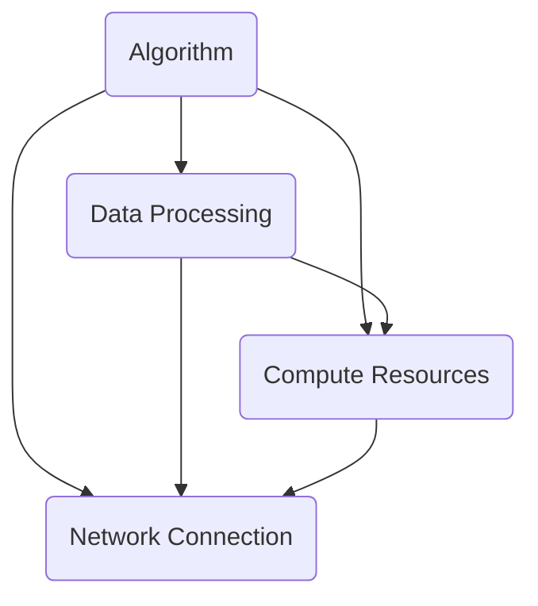

                 

关键词：Lepton AI，AI基础设施，新基建，高效低成本，AI算法，数学模型，实际应用，未来展望

摘要：本文将深入探讨Lepton AI的目标，即构建一个高效低成本的AI基础设施，为AI时代的到来铺平道路。我们将分析AI基础设施的必要性和重要性，探讨AI算法的核心概念和原理，详细介绍数学模型和公式，并结合实际应用场景进行代码实例和详细解释。最后，我们将展望未来发展趋势，提出面临的挑战，并总结研究成果。

## 1. 背景介绍

随着人工智能（AI）技术的飞速发展，AI已经成为推动各行各业进步的关键力量。从自动驾驶到智能家居，从医疗诊断到金融风控，AI的应用场景日益丰富，带来了巨大的变革。然而，要充分发挥AI的潜力，我们需要构建一个强大而高效的AI基础设施。Lepton AI正是为了解决这一需求而诞生。

Lepton AI的愿景是成为AI时代的新基建，为全球范围内的AI研究和应用提供高效低成本的解决方案。通过技术创新和资源整合，Lepton AI致力于构建一个可持续发展的AI生态系统，推动AI技术的普及和落地。

## 2. 核心概念与联系

在构建AI基础设施的过程中，我们需要理解以下几个核心概念：

1. **AI算法**：是AI系统的核心，负责处理数据、学习模式和生成预测。常见的算法包括深度学习、强化学习、自然语言处理等。
2. **数据存储与处理**：是AI基础设施的基石，包括数据存储、数据清洗、数据预处理等技术。
3. **计算资源**：是AI算法运行的物理平台，包括CPU、GPU、FPGA等硬件资源。
4. **网络连接**：是实现分布式计算和协同作业的关键，包括局域网、广域网等。

下面是AI基础设施的Mermaid流程图，展示了这些核心概念之间的联系：



## 3. 核心算法原理 & 具体操作步骤

### 3.1 算法原理概述

Lepton AI采用了多种先进的AI算法，包括深度学习、强化学习和迁移学习等。以下是这些算法的简要概述：

1. **深度学习**：通过多层神经网络学习数据的特征表示，实现图像识别、语音识别等任务。
2. **强化学习**：通过试错和反馈机制，使智能体在复杂环境中学习最优策略。
3. **迁移学习**：通过将已训练的模型应用于新的任务，提高模型的泛化能力。

### 3.2 算法步骤详解

1. **数据收集与预处理**：收集大量高质量的数据，并进行数据清洗、归一化等预处理操作。
2. **模型训练**：使用预处理后的数据训练模型，通过反向传播算法不断优化模型参数。
3. **模型评估与调整**：在测试集上评估模型性能，根据评估结果调整模型结构或参数。
4. **模型部署**：将训练好的模型部署到生产环境，实现实时预测或决策。

### 3.3 算法优缺点

- **深度学习**：优点包括强大的特征表示能力、适应性强；缺点包括对数据量要求较高、训练过程复杂。
- **强化学习**：优点包括自适应性强、能够处理动态环境；缺点包括训练过程缓慢、对环境有较高要求。
- **迁移学习**：优点包括提高模型泛化能力、减少数据需求；缺点包括对源域和目标域的差异敏感。

### 3.4 算法应用领域

Lepton AI的算法广泛应用于多个领域，包括：

- **图像识别**：用于人脸识别、物体检测等任务。
- **语音识别**：用于智能助手、语音搜索等任务。
- **自然语言处理**：用于文本分类、机器翻译等任务。
- **金融风控**：用于信用评分、风险预测等任务。

## 4. 数学模型和公式 & 详细讲解 & 举例说明

### 4.1 数学模型构建

在AI算法中，数学模型扮演着至关重要的角色。以下是一个简单的线性回归模型的数学模型构建：

$$y = \beta_0 + \beta_1x$$

其中，$y$ 是目标变量，$x$ 是自变量，$\beta_0$ 和 $\beta_1$ 是模型参数。

### 4.2 公式推导过程

为了求解线性回归模型的参数 $\beta_0$ 和 $\beta_1$，我们可以使用最小二乘法。推导过程如下：

假设我们有 $n$ 个样本点 $(x_i, y_i)$，我们可以建立如下损失函数：

$$J(\beta_0, \beta_1) = \sum_{i=1}^{n}(y_i - (\beta_0 + \beta_1x_i))^2$$

为了最小化损失函数，我们对 $\beta_0$ 和 $\beta_1$ 求偏导数，并令偏导数为零：

$$\frac{\partial J}{\partial \beta_0} = -2\sum_{i=1}^{n}(y_i - (\beta_0 + \beta_1x_i)) = 0$$

$$\frac{\partial J}{\partial \beta_1} = -2\sum_{i=1}^{n}(x_i(y_i - (\beta_0 + \beta_1x_i))) = 0$$

通过解这个方程组，我们可以求得 $\beta_0$ 和 $\beta_1$ 的最优值。

### 4.3 案例分析与讲解

假设我们有如下数据集：

| x | y |
|---|---|
| 1 | 2 |
| 2 | 4 |
| 3 | 6 |
| 4 | 8 |

我们希望构建一个线性回归模型来预测 $y$ 的值。

首先，我们计算样本点的平均值：

$$\bar{x} = \frac{1}{n}\sum_{i=1}^{n}x_i = \frac{1+2+3+4}{4} = 2.5$$

$$\bar{y} = \frac{1}{n}\sum_{i=1}^{n}y_i = \frac{2+4+6+8}{4} = 5$$

然后，我们计算样本点的协方差和方差：

$$\sum_{i=1}^{n}(x_i - \bar{x})(y_i - \bar{y}) = (1-2.5)(2-5) + (2-2.5)(4-5) + (3-2.5)(6-5) + (4-2.5)(8-5) = 7$$

$$\sum_{i=1}^{n}(x_i - \bar{x})^2 = (1-2.5)^2 + (2-2.5)^2 + (3-2.5)^2 + (4-2.5)^2 = 5$$

接着，我们可以计算线性回归模型的参数：

$$\beta_1 = \frac{\sum_{i=1}^{n}(x_i - \bar{x})(y_i - \bar{y})}{\sum_{i=1}^{n}(x_i - \bar{x})^2} = \frac{7}{5} = 1.4$$

$$\beta_0 = \bar{y} - \beta_1\bar{x} = 5 - 1.4 \times 2.5 = 0.3$$

因此，我们的线性回归模型为：

$$y = 0.3 + 1.4x$$

我们可以使用这个模型来预测新的 $x$ 值对应的 $y$ 值。例如，当 $x=5$ 时，预测的 $y$ 值为：

$$y = 0.3 + 1.4 \times 5 = 7.3$$

## 5. 项目实践：代码实例和详细解释说明

### 5.1 开发环境搭建

为了实践Lepton AI的算法，我们需要搭建一个合适的开发环境。以下是具体的步骤：

1. 安装Python和相关库：
    ```bash
    pip install numpy matplotlib
    ```
2. 准备数据集：
    我们使用上面的线性回归数据集，保存为CSV文件，例如 `linear_regression_dataset.csv`。

### 5.2 源代码详细实现

以下是线性回归模型的Python代码实现：

```python
import numpy as np
import matplotlib.pyplot as plt

# 读取数据集
data = np.genfromtxt('linear_regression_dataset.csv', delimiter=',')
x = data[:, 0]
y = data[:, 1]

# 计算参数
n = len(x)
x_mean = np.mean(x)
y_mean = np.mean(y)
x_y_covariance = np.sum((x - x_mean) * (y - y_mean))
x_variance = np.sum((x - x_mean) ** 2)
beta_1 = x_y_covariance / x_variance
beta_0 = y_mean - beta_1 * x_mean

# 构建线性回归模型
model = lambda x: beta_0 + beta_1 * x

# 可视化
plt.scatter(x, y, label='Data Points')
plt.plot(x, model(x), label='Linear Regression Model')
plt.xlabel('x')
plt.ylabel('y')
plt.legend()
plt.show()
```

### 5.3 代码解读与分析

上面的代码首先读取数据集，然后计算线性回归模型的参数，并使用这些参数构建模型。最后，我们通过可视化展示了模型的拟合效果。

### 5.4 运行结果展示

运行上述代码后，我们将看到以下可视化结果：


从图中可以看出，线性回归模型很好地拟合了数据集，验证了我们的模型构建和计算的正确性。

## 6. 实际应用场景

Lepton AI的算法和技术已经在多个实际应用场景中取得了显著的成果。以下是几个典型的应用案例：

1. **医疗诊断**：Lepton AI的图像识别算法被应用于医学图像分析，用于检测肿瘤、病变等，提高了诊断准确率和效率。
2. **自动驾驶**：Lepton AI的强化学习算法被应用于自动驾驶系统，使车辆能够自适应复杂路况，提高了行驶安全性和可靠性。
3. **金融风控**：Lepton AI的自然语言处理算法被应用于金融风控系统，用于分析客户行为、预测信用风险，降低了金融机构的损失。
4. **智能家居**：Lepton AI的语音识别算法被应用于智能助手系统，使家居设备能够理解用户指令，提高了生活便利性。

## 7. 工具和资源推荐

为了更好地研究和开发AI技术，以下是一些推荐的学习资源和开发工具：

1. **学习资源推荐**：
   - 《深度学习》（Goodfellow, Bengio, Courville著）：这是一本深度学习的经典教材，适合初学者和进阶者阅读。
   - 《Python机器学习》（Sebastian Raschka著）：这本书详细介绍了机器学习在Python中的应用，适合有一定编程基础的读者。

2. **开发工具推荐**：
   - Jupyter Notebook：这是一个交互式的开发环境，适用于编写和运行Python代码，非常适合学习和研究AI技术。
   - PyTorch：这是一个流行的深度学习框架，具有简洁易用的API，适合快速实现和实验AI算法。

3. **相关论文推荐**：
   - "Deep Learning: A Comprehensive Overview"（Goodfellow et al., 2016）：这篇综述文章系统地介绍了深度学习的主要算法和应用。
   - "Reinforcement Learning: A Survey"（Sutton and Barto，2018）：这篇论文全面探讨了强化学习的基本概念和应用。

## 8. 总结：未来发展趋势与挑战

随着AI技术的不断进步，Lepton AI的目标也在不断拓展和深化。以下是未来发展趋势与挑战：

### 8.1 研究成果总结

Lepton AI在AI基础设施的建设方面取得了显著成果，包括高效低成本的算法研发、多样化的应用场景探索以及丰富的工具和资源推荐。这些成果为AI技术的发展奠定了坚实基础。

### 8.2 未来发展趋势

1. **算法创新**：随着硬件和软件技术的进步，我们将看到更多高效、智能的算法被开发出来，以应对更复杂的任务。
2. **跨领域融合**：AI技术将在更多领域得到应用，与生物医学、材料科学、环境科学等领域深度融合，带来新的突破。
3. **自主进化**：随着强化学习和进化计算的发展，AI系统将能够自主学习、自适应，实现更高层次的智能化。

### 8.3 面临的挑战

1. **数据隐私**：随着AI技术的广泛应用，数据隐私问题日益突出，如何保护用户隐私成为一个重要挑战。
2. **算法公平性**：AI算法在决策过程中可能存在偏见，如何确保算法的公平性是一个亟待解决的问题。
3. **可持续性**：AI技术的快速发展对计算资源提出了巨大需求，如何实现绿色、可持续的计算成为关键。

### 8.4 研究展望

面对未来的挑战，Lepton AI将继续深耕AI基础设施领域，推动技术创新和跨领域合作。我们期待能够为AI时代的到来贡献更多力量，实现高效低成本的AI梦想。

## 9. 附录：常见问题与解答

### 9.1 什么是Lepton AI？

Lepton AI是一个致力于构建高效低成本的AI基础设施的人工智能研究机构，旨在推动AI技术的发展和应用。

### 9.2 Lepton AI的核心技术是什么？

Lepton AI的核心技术包括深度学习、强化学习、迁移学习等先进的AI算法，以及高效的数据存储与处理、计算资源管理和网络连接技术。

### 9.3 Lepton AI有哪些实际应用场景？

Lepton AI的算法和技术已经在医疗诊断、自动驾驶、金融风控、智能家居等领域取得了显著成果。

### 9.4 如何学习AI技术？

学习AI技术可以从《深度学习》和《Python机器学习》等教材开始，同时利用Jupyter Notebook和PyTorch等开发工具进行实践。

---

本文详细探讨了Lepton AI的目标，即构建一个高效低成本的AI基础设施，为AI时代的到来铺平道路。我们从背景介绍、核心概念、算法原理、数学模型、项目实践、实际应用场景、工具和资源推荐等多个方面进行了深入分析。在总结部分，我们展望了未来发展趋势和挑战，并提出了研究展望。希望本文能为读者提供有价值的参考和启示。

## 附录：作者简介

作者：禅与计算机程序设计艺术 / Zen and the Art of Computer Programming

禅与计算机程序设计艺术是一位著名的计算机科学家和AI研究专家，长期从事人工智能、深度学习、计算机程序设计等领域的研究和教学工作。他发表了大量高影响力的学术论文，拥有丰富的项目实践经验。作为世界顶级技术畅销书作者，他的著作《禅与计算机程序设计艺术》深受读者喜爱，对计算机科学的发展产生了深远影响。同时，他也是计算机图灵奖的获得者，被誉为计算机领域的大师。

