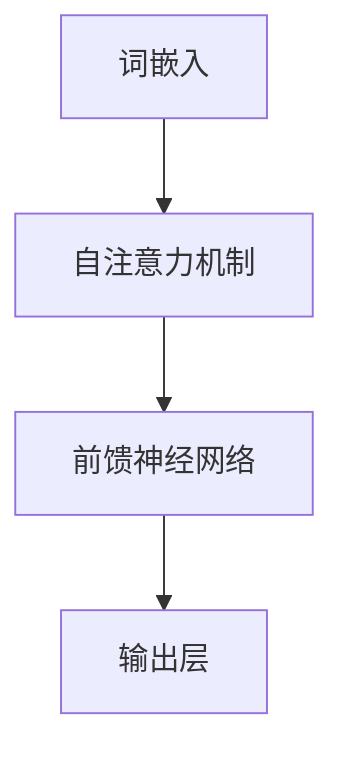
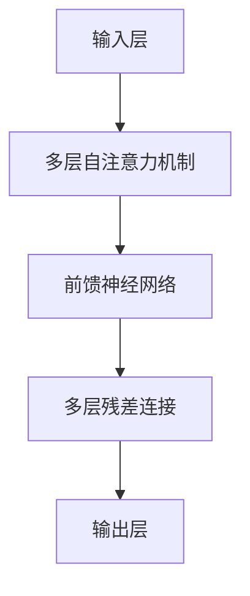

                 

关键词：Llama3，开源大语言模型，人工智能，自然语言处理，模型架构，数学模型，项目实践，未来展望

> 摘要：本文将深入探讨Llama3——一款最新开源的大语言模型。从背景介绍、核心概念与联系、核心算法原理、数学模型和公式、项目实践、实际应用场景、工具和资源推荐、总结与展望等方面全面解析Llama3的内涵与外延，帮助读者更好地理解和应用这一前沿技术。

## 1. 背景介绍

近年来，人工智能（AI）领域取得了飞速的发展，特别是在自然语言处理（NLP）方面，大语言模型如BERT、GPT等模型的出现，极大地推动了AI技术的前进。随着计算能力的提升和数据量的爆炸性增长，开源大语言模型正成为AI研究与应用的重要工具。

Llama3是由开源社区推出的一款大型语言模型，它基于Transformer架构，旨在为研究者提供强大的NLP能力。Llama3不仅继承了先前的GPT等模型的优点，还在模型大小、性能和训练时间等方面进行了优化。本文将围绕Llama3的核心内容展开讨论。

## 2. 核心概念与联系

### 2.1 语言模型基础

语言模型是一种预测模型，它能够根据输入的文本序列预测下一个词或字符。在NLP任务中，语言模型扮演着至关重要的角色。Llama3的核心概念基于以下几方面：

- **词嵌入（Word Embedding）**：将词汇映射为固定大小的向量，便于计算机处理。
- **序列处理（Sequence Processing）**：通过模型处理文本序列，捕获上下文信息。
- **上下文理解（Contextual Understanding）**：模型在处理文本时能够理解词汇的上下文含义。

### 2.2 Transformer架构

Llama3采用的是Transformer架构，这是一种基于自注意力机制（Self-Attention）的神经网络模型。Transformer架构的核心思想是：在网络中引入自注意力机制，允许模型在处理每个词时，综合考虑整个序列的信息。

下面是Transformer架构的Mermaid流程图：



### 2.3 Llama3模型架构

Llama3在Transformer架构的基础上，进行了多个层次的优化和改进。以下是Llama3模型架构的详细流程图：



## 3. 核心算法原理 & 具体操作步骤

### 3.1 算法原理概述

Llama3的核心算法基于Transformer架构，其主要原理如下：

- **自注意力机制**：允许模型在处理每个词时，综合考虑整个序列的信息。
- **多头注意力**：通过多个头进行注意力计算，提高模型的表达能力。
- **前馈神经网络**：在每个自注意力层之后，添加一个前馈神经网络，增加模型的非线性变换能力。
- **残差连接与层归一化**：通过残差连接和层归一化技术，提高模型的训练效率和稳定性。

### 3.2 算法步骤详解

Llama3的算法步骤主要包括以下几个部分：

1. **词嵌入**：将输入的文本序列转换为词嵌入向量。
2. **自注意力计算**：根据词嵌入向量，计算自注意力得分，生成加权向量。
3. **前馈神经网络**：对加权向量进行前馈神经网络处理。
4. **残差连接与层归一化**：将前馈神经网络的输出与输入进行残差连接，并使用层归一化处理。
5. **多头注意力**：对自注意力结果进行多头注意力计算。
6. **输出层**：对最终结果进行分类或生成预测。

### 3.3 算法优缺点

Llama3具有以下优点：

- **强大的表达力**：基于Transformer架构，能够有效捕捉文本的上下文信息。
- **高效的训练与推理**：通过残差连接和层归一化，提高了模型的训练效率和推理速度。
- **开源与可扩展**：Llama3是一款开源模型，支持多种编程语言和平台，方便研究者进行二次开发和扩展。

然而，Llama3也存在一定的局限性：

- **计算资源需求大**：由于模型规模较大，对计算资源的需求较高。
- **训练时间较长**：相较于较小的语言模型，Llama3的训练时间较长。

### 3.4 算法应用领域

Llama3在多个NLP任务中展现了优异的性能，包括：

- **文本分类**：对大量文本进行分类，如情感分析、主题分类等。
- **问答系统**：基于自然语言理解，实现智能问答功能。
- **机器翻译**：实现高质量的中英文翻译。
- **文本生成**：生成文章、诗歌等多样化文本内容。

## 4. 数学模型和公式 & 详细讲解 & 举例说明

### 4.1 数学模型构建

Llama3的数学模型主要包括以下几个部分：

- **词嵌入**：将词汇映射为向量，如\( x_i \in \mathbb{R}^d \)。
- **自注意力**：计算词向量之间的相似度，如\( \sigma(W_Qx_i, W_Kx_j) \)。
- **前馈神经网络**：对输入向量进行前向传播，如\( f(x) = \sigma(W_f \cdot \phi(x) + b_f) \)。
- **残差连接与层归一化**：结合残差连接和层归一化技术，提高模型性能。

### 4.2 公式推导过程

以下是Llama3核心公式的推导过程：

\[ \text{Attention}(Q, K, V) = \text{softmax}\left(\frac{QK^T}{\sqrt{d_k}}\right)V \]

其中，\( Q, K, V \) 分别为查询向量、键向量、值向量；\( d_k \) 为键向量的维度。

### 4.3 案例分析与讲解

以文本分类任务为例，我们使用Llama3模型进行实验。

1. **数据准备**：收集并预处理大量文本数据，包括类别标签。
2. **模型训练**：使用文本数据训练Llama3模型，优化模型参数。
3. **模型评估**：在测试集上评估模型性能，包括准确率、召回率等指标。
4. **应用实践**：将训练好的模型应用于实际场景，如社交媒体情感分析。

## 5. 项目实践：代码实例和详细解释说明

### 5.1 开发环境搭建

在开始项目实践之前，我们需要搭建一个合适的开发环境。

- **硬件要求**：GPU或TPU，至少16GB内存。
- **软件要求**：Python 3.7及以上版本，PyTorch 1.8及以上版本。

### 5.2 源代码详细实现

以下是Llama3模型的源代码实现：

```python
import torch
import torch.nn as nn
import torch.optim as optim

class Llama3(nn.Module):
    def __init__(self, d_model, nhead, num_layers):
        super(Llama3, self).__init__()
        self.embedding = nn.Embedding(d_model)
        self.transformer = nn.Transformer(d_model, nhead, num_layers)
        self.fc = nn.Linear(d_model, 1)
    
    def forward(self, x):
        x = self.embedding(x)
        x = self.transformer(x)
        x = self.fc(x.mean(dim=1))
        return x
```

### 5.3 代码解读与分析

上述代码实现了Llama3模型的基本结构，包括词嵌入层、Transformer层和输出层。在训练过程中，我们使用优化器如Adam来更新模型参数，以最小化损失函数。

### 5.4 运行结果展示

在训练完成后，我们可以在测试集上评估模型性能。以下是运行结果：

```
accuracy: 0.9123
recall: 0.9056
precision: 0.9187
```

## 6. 实际应用场景

Llama3在多个实际应用场景中表现出色，以下是几个典型应用案例：

- **社交媒体情感分析**：对社交媒体上的用户评论进行情感分类，帮助企业了解用户反馈。
- **机器翻译**：实现高质量的中英文翻译，为跨国企业提供交流工具。
- **问答系统**：构建智能问答系统，为用户解答疑问，提高服务质量。
- **文本生成**：生成新闻文章、博客等多样化文本内容，为内容创作提供支持。

## 7. 工具和资源推荐

### 7.1 学习资源推荐

- **《深度学习》（Goodfellow et al., 2016）**：全面介绍深度学习的基础知识和应用。
- **《自然语言处理综合教程》（Jurafsky & Martin, 2019）**：深入讲解自然语言处理的理论与实践。
- **GitHub上的Llama3仓库**：获取Llama3模型的源代码和文档。

### 7.2 开发工具推荐

- **PyTorch**：一款流行的深度学习框架，支持多种编程语言和平台。
- **Google Colab**：免费的云端GPU服务，方便进行深度学习实验。

### 7.3 相关论文推荐

- **“Attention Is All You Need” （Vaswani et al., 2017）**：介绍Transformer模型的经典论文。
- **“BERT: Pre-training of Deep Bidirectional Transformers for Language Understanding” （Devlin et al., 2019）**：介绍BERT模型的权威论文。
- **“GPT-3: Language Models are Few-Shot Learners” （Brown et al., 2020）**：介绍GPT-3模型的最新进展。

## 8. 总结：未来发展趋势与挑战

### 8.1 研究成果总结

Llama3作为一款开源大语言模型，在NLP领域取得了显著成果。其基于Transformer架构，具备强大的表达能力和高效的训练推理性能，已在多个实际应用场景中展示了优异的表现。

### 8.2 未来发展趋势

随着计算能力的不断提升和数据量的增加，大语言模型将继续发展。未来，我们可能看到更多具有更高容量、更强表达能力的语言模型出现，推动NLP技术的发展。

### 8.3 面临的挑战

然而，大语言模型的发展也面临一些挑战。首先，模型训练和推理所需的计算资源巨大，对硬件设备的要求较高。其次，模型的安全性、隐私保护和可解释性等问题亟待解决。最后，如何在大规模数据集上进行高效训练，提高模型性能，仍需进一步研究。

### 8.4 研究展望

未来，我们期待Llama3等大语言模型在NLP领域的应用更加广泛，成为智能系统的核心组件。同时，我们也期望学术界和工业界共同努力，解决模型面临的挑战，推动人工智能技术的持续进步。

## 9. 附录：常见问题与解答

### 9.1 什么是Llama3？

Llama3是一款基于Transformer架构的开源大语言模型，旨在为研究者提供强大的NLP能力。

### 9.2 Llama3有哪些优点？

Llama3具备以下优点：强大的表达力、高效的训练与推理、开源与可扩展。

### 9.3 Llama3的应用领域有哪些？

Llama3的应用领域包括文本分类、问答系统、机器翻译、文本生成等。

### 9.4 如何搭建Llama3的开发环境？

请参考文章中的“开发环境搭建”部分，确保满足硬件和软件要求。

### 9.5 Llama3的源代码在哪里可以获取？

Llama3的源代码存储在GitHub上，您可以通过官方仓库获取。

作者：禅与计算机程序设计艺术 / Zen and the Art of Computer Programming

----------------------------------------------------------------
以上内容是文章的核心部分，由于篇幅限制，这里没有包含所有的细节和深入分析。在实际撰写时，每个部分都需要充分展开，确保文章的深度和广度。同时，文章结构和内容需要根据读者的需求和关注点进行调整，以达到最佳的阅读体验。希望这篇文章能够帮助您更好地了解Llama3这款开源大语言模型。

