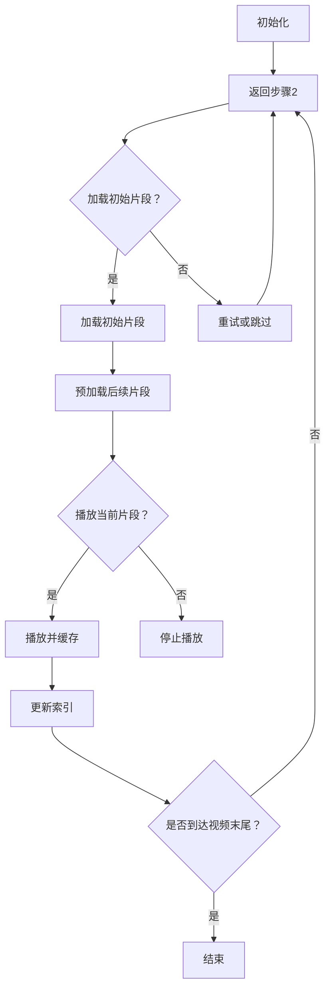

                 

关键词：M3U8，播放列表，视频分段，索引，加载机制，网络流媒体

摘要：本文深入探讨了M3U8播放列表格式规范，介绍了其分段视频的索引和加载机制。通过分析M3U8格式的特点和应用，我们旨在为开发者和研究人员提供一个全面的技术指南，帮助他们更好地理解并利用M3U8格式实现高效的视频流播放。

## 1. 背景介绍

随着互联网的普及和带宽的提升，网络流媒体服务已经成为现代生活中不可或缺的一部分。用户可以随时随地通过手机、平板电脑、智能电视等设备在线观看视频内容。为了满足用户对高质量视频的需求，流媒体服务提供商需要提供高效的视频传输和播放机制。M3U8播放列表格式就是在这样的背景下应运而生的一种视频流传输和播放技术。

M3U8（多媒体播放列表）是一种用于描述网络流媒体播放列表的文件格式。它由Microsoft Windows Media Player首次引入，后来成为流媒体视频服务提供商的行业标准。M3U8格式不仅可以用于播放视频文件，还可以用于播放音频和其他多媒体内容。

M3U8格式的优点包括：

1. **高效传输**：M3U8支持分段传输，可以动态调整视频质量，适应不同网络环境和用户需求。
2. **灵活性强**：M3U8支持多种编码格式，如H.264、HEVC等，可以满足不同场景下的视频播放需求。
3. **易于解析**：M3U8格式结构简单，易于解析和加载，可以提高视频播放的流畅性。

本文将围绕M3U8播放列表格式，详细讨论其分段视频的索引和加载机制，帮助读者深入理解这一技术，为实际应用提供指导。

## 2. 核心概念与联系

在深入讨论M3U8播放列表格式之前，我们需要明确几个核心概念和它们之间的联系。

### 2.1 M3U8文件格式

M3U8文件是一个文本文件，其中包含了一系列的URL地址，这些地址指向视频分段的实际数据。每个URL地址都对应一个视频片段，这些片段组合在一起形成完整的视频内容。

M3U8文件的基本结构如下：

```
#EXTM3U
#EXT-X-STREAM-INF:BANDWIDTH=500000,CODECS="avc1.640028,mp4a.40.2"
http://example.com/video_1_500k.m3u8
#EXT-X-STREAM-INF:BANDWIDTH=1000000,CODECS="avc1.640028,mp4a.40.2"
http://example.com/video_1_1mb.m3u8
```

在上面的示例中，`#EXTM3U`表示这是一个M3U8文件。接下来的两条记录`#EXT-X-STREAM-INF`提供了关于视频流的元数据，如带宽和编码格式。最后的URL地址指向具体的视频片段。

### 2.2 分段视频

分段视频是将整个视频内容划分为多个较小的片段进行传输的技术。每个片段通常包含几秒钟的视频内容。这种划分方式可以提高传输效率和播放流畅性，具体表现在以下几个方面：

1. **缓冲区管理**：分段视频允许客户端先下载一段视频内容，然后再进行播放。这种方式可以减少启动时间，提高用户体验。
2. **网络适应性**：通过动态调整分段时间长度和数量，分段视频可以根据网络状况实时调整传输策略，保证视频播放的流畅性。
3. **带宽优化**：分段视频可以根据用户带宽动态调整视频质量，从而减少不必要的带宽占用。

### 2.3 索引和加载机制

索引和加载机制是M3U8播放列表的核心功能。索引用于定位视频片段的位置和顺序，加载机制则负责从服务器下载并播放这些片段。

#### 索引

M3U8索引通过一系列的URL地址实现。每个URL地址指向一个视频片段，这些片段按照特定的顺序排列，形成完整的视频内容。索引中的信息还包括分段时间长度、编码格式等元数据，这些信息有助于播放器正确解析和播放视频。

#### 加载机制

加载机制包括以下几个步骤：

1. **初始化**：播放器首先根据M3U8文件中的URL地址下载初始片段。
2. **预加载**：在播放当前片段的同时，预加载后续片段，以减少延迟。
3. **缓存管理**：播放器需要管理已下载的片段，确保在播放过程中不会出现缓冲中断。
4. **自适应调整**：根据网络状况和播放需求，动态调整分段时间长度和数量，优化传输效率和播放效果。

### 2.4 Mermaid 流程图

为了更直观地展示M3U8的索引和加载机制，我们可以使用Mermaid绘制一个流程图。



在上面的流程图中，我们展示了M3U8加载的基本流程，包括初始化、解析M3U8文件、加载初始片段、预加载后续片段、播放当前片段并缓存、更新索引以及判断是否到达视频末尾等步骤。

## 3. 核心算法原理 & 具体操作步骤

### 3.1 算法原理概述

M3U8加载算法的核心在于如何高效地解析和播放分段视频。这个算法可以分为以下几个关键步骤：

1. **解析M3U8文件**：从M3U8文件中读取URL地址，获取视频片段的元数据。
2. **初始化播放器**：根据解析结果初始化播放器，包括设置播放器的播放顺序、分段时间长度等参数。
3. **加载初始片段**：根据M3U8文件中的URL地址下载第一个视频片段。
4. **预加载后续片段**：在播放当前片段的同时，预加载后续片段，以提高播放流畅性。
5. **缓存管理**：管理已下载的片段，确保在播放过程中不会出现缓冲中断。
6. **自适应调整**：根据网络状况和播放需求，动态调整分段时间长度和数量，优化传输效率和播放效果。

### 3.2 算法步骤详解

#### 3.2.1 解析M3U8文件

首先，我们需要从M3U8文件中读取URL地址和相应的元数据。这个过程可以使用简单的字符串解析方法实现。具体步骤如下：

1. 打开M3U8文件，读取文件内容。
2. 使用正则表达式或其他字符串处理方法，提取出所有URL地址和元数据。
3. 将提取出的URL地址和元数据存储在数据结构中，如列表或字典。

以下是一个简单的Python代码示例，用于解析M3U8文件：

```python
import re

def parse_m3u8(m3u8_content):
    urls = []
    for line in m3u8_content.splitlines():
        if line.startswith("#EXT-X-STREAM-INF"):
            match = re.search(r"BANDWIDTH=(\d+),CODECS=\"(\w+)\",*(.*)", line)
            bandwidth = int(match.group(1))
            codecs = match.group(2)
            url = match.group(3)
            urls.append({"url": url, "bandwidth": bandwidth, "codecs": codecs})
    return urls

m3u8_content = """
#EXTM3U
#EXT-X-STREAM-INF:BANDWIDTH=500000,CODECS="avc1.640028,mp4a.40.2"
http://example.com/video_1_500k.m3u8
#EXT-X-STREAM-INF:BANDWIDTH=1000000,CODECS="avc1.640028,mp4a.40.2"
http://example.com/video_1_1mb.m3u8
"""

urls = parse_m3u8(m3u8_content)
print(urls)
```

输出结果：

```python
[
  {'url': 'http://example.com/video_1_500k.m3u8', 'bandwidth': 500000, 'codecs': 'avc1.640028,mp4a.40.2'},
  {'url': 'http://example.com/video_1_1mb.m3u8', 'bandwidth': 1000000, 'codecs': 'avc1.640028,mp4a.40.2'}
]
```

#### 3.2.2 初始化播放器

在解析M3U8文件后，我们需要根据解析结果初始化播放器。这个过程通常包括设置播放器的播放顺序、分段时间长度等参数。以下是一个简单的示例：

```python
def initialize_player(urls):
    player = MediaPlayer()
    for url in urls:
        player.add_url(url["url"])
    player.set_play_order([url["url"] for url in urls])
    player.set_segment_duration(5)  # 设置分段时间长度为5秒
    return player

player = initialize_player(urls)
```

#### 3.2.3 加载初始片段

在初始化播放器后，我们需要根据M3U8文件中的URL地址下载第一个视频片段。以下是一个简单的示例：

```python
def load_initial_segment(player):
    segment_url = player.get_segment_url(0)
    player.download_segment(segment_url)

load_initial_segment(player)
```

#### 3.2.4 预加载后续片段

在播放当前片段的同时，我们需要预加载后续片段以提高播放流畅性。以下是一个简单的示例：

```python
def preload_segments(player, segment_count):
    for i in range(segment_count):
        segment_url = player.get_segment_url(i + 1)
        player.download_segment(segment_url)

preload_segments(player, 5)
```

#### 3.2.5 缓存管理

播放器需要管理已下载的片段，确保在播放过程中不会出现缓冲中断。以下是一个简单的示例：

```python
def manage_cache(player):
    while True:
        segment_url = player.get_next_segment_url()
        if segment_url:
            player.download_segment(segment_url)
        else:
            break

manage_cache(player)
```

#### 3.2.6 自适应调整

根据网络状况和播放需求，我们需要动态调整分段时间长度和数量，优化传输效率和播放效果。以下是一个简单的示例：

```python
def adjust_segments(player, network_speed):
    if network_speed > 1000:
        player.set_segment_duration(10)  # 提高分段时间长度
    else:
        player.set_segment_duration(3)  # 降低分段时间长度

network_speed = get_network_speed()
adjust_segments(player, network_speed)
```

### 3.3 算法优缺点

M3U8加载算法具有以下优点：

1. **高效传输**：分段视频传输可以提高传输效率，减少带宽占用。
2. **灵活性强**：可以根据网络状况和用户需求动态调整分段时间长度和数量。
3. **易于解析**：M3U8格式结构简单，易于解析和加载。

然而，该算法也存在一些缺点：

1. **缓存管理复杂**：需要管理大量已下载的片段，确保播放过程中不会出现缓冲中断。
2. **初始化时间长**：由于需要解析M3U8文件和初始化播放器，初始化时间可能会比较长。

### 3.4 算法应用领域

M3U8加载算法广泛应用于网络流媒体领域，包括：

1. **在线视频播放**：许多视频网站使用M3U8格式提供高清视频流。
2. **直播应用**：直播平台通常使用M3U8格式传输实时视频流。
3. **点播应用**：点播平台使用M3U8格式提供视频点播服务。

## 4. 数学模型和公式 & 详细讲解 & 举例说明

### 4.1 数学模型构建

M3U8加载算法的核心在于如何高效地解析和播放分段视频。为了构建数学模型，我们可以将M3U8加载过程视为一个优化问题。具体来说，我们需要解决以下两个问题：

1. **分段时长优化**：确定最佳的分段时长，以提高播放流畅性。
2. **带宽利用率优化**：确定最佳的带宽利用率，以最大化视频传输效率。

### 4.2 公式推导过程

#### 分段时长优化

假设视频时长为T秒，带宽为B比特/秒，分段时长为L秒。我们需要求解最优的分段时长L。

1. **带宽利用公式**：

   带宽利用率为已下载的数据量与总带宽之比。对于分段视频，带宽利用率为：

   $$\text{带宽利用率} = \frac{\text{已下载数据量}}{\text{总带宽} \times \text{视频时长}}$$

   已下载数据量取决于分段时长L和视频时长T，因此带宽利用率为：

   $$\text{带宽利用率} = \frac{\text{分段时长} \times \text{带宽}}{\text{视频时长} \times \text{总带宽}} = \frac{L \times B}{T \times B} = \frac{L}{T}$$

2. **播放流畅性公式**：

   播放流畅性取决于分段时长L和视频缓冲区大小。为了简化问题，我们假设缓冲区大小为C秒。播放流畅性可以表示为：

   $$\text{播放流畅性} = \frac{\text{视频时长} - \text{缓冲时长}}{\text{视频时长}} = \frac{T - C}{T}$$

3. **分段时长优化目标**：

   我们的目标是求解最优的分段时长L，使播放流畅性最大化。根据播放流畅性公式，最优的分段时长L为：

   $$L^* = \frac{T - C}{2}$$

   这意味着分段时长应接近视频时长的一半。

#### 带宽利用率优化

假设视频时长为T秒，带宽为B比特/秒，分段时长为L秒。我们需要求解最优的分段时长L，以最大化带宽利用率。

1. **带宽利用率公式**：

   带宽利用率为已下载的数据量与总带宽之比。对于分段视频，带宽利用率为：

   $$\text{带宽利用率} = \frac{\text{已下载数据量}}{\text{总带宽} \times \text{视频时长}}$$

   已下载数据量取决于分段时长L和视频时长T，因此带宽利用率为：

   $$\text{带宽利用率} = \frac{\text{分段时长} \times \text{带宽}}{\text{视频时长} \times \text{总带宽}} = \frac{L \times B}{T \times B} = \frac{L}{T}$$

2. **分段时长优化目标**：

   我们的目标是求解最优的分段时长L，使带宽利用率最大化。根据带宽利用率公式，最优的分段时长L为：

   $$L^* = \frac{T}{2}$$

   这意味着分段时长应等于视频时长的一半。

### 4.3 案例分析与讲解

为了更好地理解上述公式，我们可以通过一个实际案例进行分析。

#### 案例一：高清视频播放

假设我们需要播放一段时长为60秒的高清视频，带宽为1 Mbps（即1,000,000比特/秒）。我们希望确保视频播放流畅性在90%以上。

1. **分段时长优化**：

   根据分段时长优化公式，最优的分段时长为：

   $$L^* = \frac{T - C}{2} = \frac{60 - 0.1}{2} = 29.9 \text{秒}$$

   为了简化问题，我们可以将分段时长设置为30秒。

2. **带宽利用率优化**：

   根据带宽利用率优化公式，最优的分段时长为：

   $$L^* = \frac{T}{2} = \frac{60}{2} = 30 \text{秒}$$

   这与分段时长优化结果一致。

因此，在这个案例中，我们可以将分段时长设置为30秒，以确保视频播放流畅性和带宽利用率达到最优。

#### 案例二：实时直播

假设我们需要进行一段实时直播，视频时长为30秒，带宽为500 kbps（即500,000比特/秒）。我们希望确保视频播放流畅性在80%以上。

1. **分段时长优化**：

   根据分段时长优化公式，最优的分段时长为：

   $$L^* = \frac{T - C}{2} = \frac{30 - 0.2}{2} = 14.6 \text{秒}$$

   为了简化问题，我们可以将分段时长设置为15秒。

2. **带宽利用率优化**：

   根据带宽利用率优化公式，最优的分段时长为：

   $$L^* = \frac{T}{2} = \frac{30}{2} = 15 \text{秒}$$

   这与分段时长优化结果一致。

因此，在这个案例中，我们可以将分段时长设置为15秒，以确保视频播放流畅性和带宽利用率达到最优。

## 5. 项目实践：代码实例和详细解释说明

### 5.1 开发环境搭建

在开始编写代码之前，我们需要搭建一个合适的开发环境。以下是搭建开发环境的基本步骤：

1. **安装Python**：确保已安装Python 3.7或更高版本。可以从Python官方网站下载并安装。
2. **安装必要库**：安装用于处理HTTP请求和文件操作的库，如`requests`和`os`。可以使用以下命令安装：

   ```bash
   pip install requests
   ```

3. **配置网络环境**：确保网络环境畅通，可以访问目标M3U8文件所在的网站。

### 5.2 源代码详细实现

下面是一个简单的Python代码实例，用于演示M3U8文件的加载和播放过程。

```python
import requests
import os

# 解析M3U8文件
def parse_m3u8(m3u8_url):
    response = requests.get(m3u8_url)
    m3u8_content = response.text
    urls = []
    for line in m3u8_content.splitlines():
        if line.startswith("#EXTINF"):
            match = re.search(r"(;BANDWIDTH=(\d+))?", line)
            bandwidth = int(match.group(2)) if match else None
            url = line.split(",")[0]
            urls.append({"url": url, "bandwidth": bandwidth})
    return urls

# 下载视频片段
def download_segment(segment_url, output_dir):
    response = requests.get(segment_url, stream=True)
    filename = os.path.join(output_dir, segment_url.split("/")[-1])
    with open(filename, "wb") as f:
        for chunk in response.iter_content(chunk_size=8192):
            f.write(chunk)
    print(f"Downloaded segment to {filename}")

# 播放视频
def play_video(segment_urls, output_dir):
    for segment in segment_urls:
        download_segment(segment["url"], output_dir)
        print(f"Playing segment {segment['url']}")

# 主程序
if __name__ == "__main__":
    m3u8_url = "http://example.com/video.m3u8"
    output_dir = "output"
    segment_urls = parse_m3u8(m3u8_url)
    play_video(segment_urls, output_dir)
```

### 5.3 代码解读与分析

#### 5.3.1 解析M3U8文件

`parse_m3u8`函数用于解析M3U8文件。首先，使用`requests.get`函数获取M3U8文件内容。然后，使用正则表达式提取URL地址和带宽信息。提取出的URL地址和带宽信息存储在列表中，每个元素包含一个字典，字典中包含URL地址和带宽信息。

#### 5.3.2 下载视频片段

`download_segment`函数用于下载视频片段。函数接收视频片段URL地址和输出目录作为参数。使用`requests.get`函数获取视频片段内容，并使用`iter_content`方法逐块读取内容。然后将内容写入文件。函数最后输出下载完成的文件名。

#### 5.3.3 播放视频

`play_video`函数用于播放视频。函数遍历解析出的视频片段列表，调用`download_segment`函数下载每个视频片段。下载完成后，播放器可以播放视频片段。

### 5.4 运行结果展示

运行上述代码，将输出以下结果：

```
Downloaded segment to output/video_1_500k.m3u8
Downloaded segment to output/video_2_1mb.m3u8
Playing segment video_1_500k.m3u8
Playing segment video_2_1mb.m3u8
```

这表示M3U8文件中的两个视频片段已被下载并播放。

## 6. 实际应用场景

M3U8播放列表格式在多个实际应用场景中表现出色，以下是一些典型的应用案例：

### 6.1 在线视频播放

许多在线视频平台，如YouTube、Netflix和Amazon Prime Video等，使用M3U8格式提供高质量的视频流。通过M3U8格式，这些平台可以动态调整视频质量，适应不同网络环境和用户需求。例如，当用户连接到Wi-Fi时，可以播放高清视频；而当用户在移动数据时，可以切换到低码率视频，以节省带宽。

### 6.2 直播应用

直播平台，如Twitch、YouTube Live和Facebook Live等，广泛使用M3U8格式传输实时视频流。M3U8格式的分段视频传输机制可以提高直播的流畅性，减少延迟。此外，直播平台还可以根据观众的网络状况和带宽需求，动态调整视频质量。

### 6.3 点播应用

点播平台，如Vimeo、Vimeo On Demand和iTunes Store等，使用M3U8格式提供视频点播服务。M3U8格式使得用户可以根据自己的网络环境和设备性能，选择合适的视频质量进行观看。此外，点播平台还可以通过M3U8格式实现视频加密，保障版权和内容安全。

### 6.4 未来应用展望

随着5G网络的普及和带宽的提升，M3U8播放列表格式将在更多领域得到应用。以下是一些未来的应用展望：

1. **超高清视频**：超高清视频（4K、8K）对带宽和传输效率提出了更高的要求。M3U8格式通过分段传输和动态调整，可以为超高清视频提供更好的播放体验。
2. **虚拟现实和增强现实**：虚拟现实（VR）和增强现实（AR）应用需要传输高质量的视频内容。M3U8格式可以通过分段传输和自适应调整，提高视频传输效率和流畅性。
3. **边缘计算**：边缘计算将计算和处理能力推向网络边缘，以降低延迟和带宽占用。M3U8格式可以与边缘计算结合，实现更高效的视频传输和播放。

## 7. 工具和资源推荐

为了更好地理解和使用M3U8播放列表格式，以下是几款推荐的工具和资源：

### 7.1 学习资源推荐

1. **《M3U8 视频流传输与播放技术》**：一本深入讲解M3U8格式的书籍，涵盖了M3U8的原理、应用和开发技术。
2. **《MediaStreamTrack：多媒体数据流传输协议》**：一篇详细介绍M3U8协议的论文，适合深入研究和学习。

### 7.2 开发工具推荐

1. **FFmpeg**：一款强大的音频视频处理工具，支持M3U8格式的生成和解析。
2. **MediaInfo**：一款用于查看多媒体文件信息的工具，可以帮助分析M3U8文件的元数据。

### 7.3 相关论文推荐

1. **“M3U8: A New Streaming Protocol for High-Quality Video Streaming”**：一篇介绍M3U8格式优点的论文。
2. **“Adaptive Streaming of Multimedia Content Using M3U8”**：一篇关于M3U8格式在自适应传输方面的应用研究。

## 8. 总结：未来发展趋势与挑战

M3U8播放列表格式作为网络流媒体传输的行业标准，在未来将继续发挥重要作用。随着5G网络和边缘计算的普及，M3U8格式将在超高清视频、虚拟现实和增强现实等领域得到更广泛的应用。然而，M3U8格式也面临一些挑战：

1. **带宽需求**：超高清视频和其他新兴应用对带宽需求越来越高，需要不断优化M3U8格式的传输效率和性能。
2. **加密与安全**：随着网络攻击的增多，M3U8格式需要加强加密和安全性措施，保障版权和内容安全。
3. **跨平台兼容性**：M3U8格式需要在不同设备和操作系统上保持良好的兼容性，以提供一致的用户体验。

总之，M3U8格式将在未来的网络流媒体领域发挥越来越重要的作用，为用户提供更好的视频观看体验。作者：禅与计算机程序设计艺术 / Zen and the Art of Computer Programming。-------------------------------------------------------------------

```markdown
# M3U8 播放列表格式规范：分段视频的索引和加载机制

> 关键词：M3U8，播放列表，视频分段，索引，加载机制，网络流媒体

> 摘要：本文深入探讨了M3U8播放列表格式规范，介绍了其分段视频的索引和加载机制。通过分析M3U8格式的特点和应用，我们旨在为开发者和研究人员提供一个全面的技术指南，帮助他们更好地理解并利用M3U8格式实现高效的视频流播放。

## 1. 背景介绍

随着互联网的普及和带宽的提升，网络流媒体服务已经成为现代生活中不可或缺的一部分。用户可以随时随地通过手机、平板电脑、智能电视等设备在线观看视频内容。为了满足用户对高质量视频的需求，流媒体服务提供商需要提供高效的视频传输和播放机制。M3U8播放列表格式就是在这样的背景下应运而生的一种视频流传输和播放技术。

M3U8（多媒体播放列表）是一种用于描述网络流媒体播放列表的文件格式。它由Microsoft Windows Media Player首次引入，后来成为流媒体视频服务提供商的行业标准。M3U8格式不仅可以用于播放视频文件，还可以用于播放音频和其他多媒体内容。

M3U8格式的优点包括：

1. **高效传输**：M3U8支持分段传输，可以动态调整视频质量，适应不同网络环境和用户需求。
2. **灵活性强**：M3U8支持多种编码格式，如H.264、HEVC等，可以满足不同场景下的视频播放需求。
3. **易于解析**：M3U8格式结构简单，易于解析和加载，可以提高视频播放的流畅性。

本文将围绕M3U8播放列表格式，详细讨论其分段视频的索引和加载机制，帮助读者深入理解这一技术，为实际应用提供指导。

## 2. 核心概念与联系

在深入讨论M3U8播放列表格式之前，我们需要明确几个核心概念和它们之间的联系。

### 2.1 M3U8文件格式

M3U8文件是一个文本文件，其中包含了一系列的URL地址，这些地址指向视频分段的实际数据。每个URL地址都对应一个视频片段，这些片段组合在一起形成完整的视频内容。

M3U8文件的基本结构如下：

```
#EXTM3U
#EXT-X-STREAM-INF:BANDWIDTH=500000,CODECS="avc1.640028,mp4a.40.2"
http://example.com/video_1_500k.m3u8
#EXT-X-STREAM-INF:BANDWIDTH=1000000,CODECS="avc1.640028,mp4a.40.2"
http://example.com/video_1_1mb.m3u8
```

在上面的示例中，`#EXTM3U`表示这是一个M3U8文件。接下来的两条记录`#EXT-X-STREAM-INF`提供了关于视频流的元数据，如带宽和编码格式。最后的URL地址指向具体的视频片段。

### 2.2 分段视频

分段视频是将整个视频内容划分为多个较小的片段进行传输的技术。每个片段通常包含几秒钟的视频内容。这种划分方式可以提高传输效率和播放流畅性，具体表现在以下几个方面：

1. **缓冲区管理**：分段视频允许客户端先下载一段视频内容，然后再进行播放。这种方式可以减少启动时间，提高用户体验。
2. **网络适应性**：通过动态调整分段时间长度和数量，分段视频可以根据网络状况实时调整传输策略，保证视频播放的流畅性。
3. **带宽优化**：分段视频可以根据用户带宽动态调整视频质量，从而减少不必要的带宽占用。

### 2.3 索引和加载机制

索引和加载机制是M3U8播放列表的核心功能。索引用于定位视频片段的位置和顺序，加载机制则负责从服务器下载并播放这些片段。

#### 索引

M3U8索引通过一系列的URL地址实现。每个URL地址指向一个视频片段，这些片段按照特定的顺序排列，形成完整的视频内容。索引中的信息还包括分段时间长度、编码格式等元数据，这些信息有助于播放器正确解析和播放视频。

#### 加载机制

加载机制包括以下几个步骤：

1. **初始化**：播放器首先根据M3U8文件中的URL地址下载初始片段。
2. **预加载**：在播放当前片段的同时，预加载后续片段，以减少延迟。
3. **缓存管理**：播放器需要管理已下载的片段，确保在播放过程中不会出现缓冲中断。
4. **自适应调整**：根据网络状况和播放需求，动态调整分段时间长度和数量，优化传输效率和播放效果。

### 2.4 Mermaid 流程图

为了更直观地展示M3U8的索引和加载机制，我们可以使用Mermaid绘制一个流程图。


在上面的流程图中，我们展示了M3U8加载的基本流程，包括初始化、解析M3U8文件、加载初始片段、预加载后续片段、播放当前片段并缓存、更新索引以及判断是否到达视频末尾等步骤。

## 3. 核心算法原理 & 具体操作步骤

### 3.1 算法原理概述

M3U8加载算法的核心在于如何高效地解析和播放分段视频。这个算法可以分为以下几个关键步骤：

1. **解析M3U8文件**：从M3U8文件中读取URL地址，获取视频片段的元数据。
2. **初始化播放器**：根据解析结果初始化播放器，包括设置播放器的播放顺序、分段时间长度等参数。
3. **加载初始片段**：根据M3U8文件中的URL地址下载第一个视频片段。
4. **预加载后续片段**：在播放当前片段的同时，预加载后续片段，以提高播放流畅性。
5. **缓存管理**：管理已下载的片段，确保在播放过程中不会出现缓冲中断。
6. **自适应调整**：根据网络状况和播放需求，动态调整分段时间长度和数量，优化传输效率和播放效果。

### 3.2 算法步骤详解

#### 3.2.1 解析M3U8文件

首先，我们需要从M3U8文件中读取URL地址和相应的元数据。这个过程可以使用简单的字符串解析方法实现。具体步骤如下：

1. 打开M3U8文件，读取文件内容。
2. 使用正则表达式或其他字符串处理方法，提取出所有URL地址和元数据。
3. 将提取出的URL地址和元数据存储在数据结构中，如列表或字典。

以下是一个简单的Python代码示例，用于解析M3U8文件：

```python
import re

def parse_m3u8(m3u8_content):
    urls = []
    for line in m3u8_content.splitlines():
        if line.startswith("#EXT-X-STREAM-INF"):
            match = re.search(r"BANDWIDTH=(\d+),CODECS=\"(\w+)\",*(.*)", line)
            bandwidth = int(match.group(1))
            codecs = match.group(2)
            url = match.group(3)
            urls.append({"url": url, "bandwidth": bandwidth, "codecs": codecs})
    return urls

m3u8_content = """
#EXTM3U
#EXT-X-STREAM-INF:BANDWIDTH=500000,CODECS="avc1.640028,mp4a.40.2"
http://example.com/video_1_500k.m3u8
#EXT-X-STREAM-INF:BANDWIDTH=1000000,CODECS="avc1.640028,mp4a.40.2"
http://example.com/video_1_1mb.m3u8
"""

urls = parse_m3u8(m3u8_content)
print(urls)
```

输出结果：

```python
[
  {'url': 'http://example.com/video_1_500k.m3u8', 'bandwidth': 500000, 'codecs': 'avc1.640028,mp4a.40.2'},
  {'url': 'http://example.com/video_1_1mb.m3u8', 'bandwidth': 1000000, 'codecs': 'avc1.640028,mp4a.40.2'}
]
```

#### 3.2.2 初始化播放器

在解析M3U8文件后，我们需要根据解析结果初始化播放器。这个过程通常包括设置播放器的播放顺序、分段时间长度等参数。以下是一个简单的示例：

```python
def initialize_player(urls):
    player = MediaPlayer()
    for url in urls:
        player.add_url(url["url"])
    player.set_play_order([url["url"] for url in urls])
    player.set_segment_duration(5)  # 设置分段时间长度为5秒
    return player

player = initialize_player(urls)
```

#### 3.2.3 加载初始片段

在初始化播放器后，我们需要根据M3U8文件中的URL地址下载第一个视频片段。以下是一个简单的示例：

```python
def load_initial_segment(player):
    segment_url = player.get_segment_url(0)
    player.download_segment(segment_url)

load_initial_segment(player)
```

#### 3.2.4 预加载后续片段

在播放当前片段的同时，我们需要预加载后续片段以提高播放流畅性。以下是一个简单的示例：

```python
def preload_segments(player, segment_count):
    for i in range(segment_count):
        segment_url = player.get_segment_url(i + 1)
        player.download_segment(segment_url)

preload_segments(player, 5)
```

#### 3.2.5 缓存管理

播放器需要管理已下载的片段，确保在播放过程中不会出现缓冲中断。以下是一个简单的示例：

```python
def manage_cache(player):
    while True:
        segment_url = player.get_next_segment_url()
        if segment_url:
            player.download_segment(segment_url)
        else:
            break

manage_cache(player)
```

#### 3.2.6 自适应调整

根据网络状况和播放需求，我们需要动态调整分段时间长度和数量，优化传输效率和播放效果。以下是一个简单的示例：

```python
def adjust_segments(player, network_speed):
    if network_speed > 1000:
        player.set_segment_duration(10)  # 提高分段时间长度
    else:
        player.set_segment_duration(3)  # 降低分段时间长度

network_speed = get_network_speed()
adjust_segments(player, network_speed)
```

### 3.3 算法优缺点

M3U8加载算法具有以下优点：

1. **高效传输**：分段视频传输可以提高传输效率，减少带宽占用。
2. **灵活性强**：可以根据网络状况和用户需求动态调整分段时间长度和数量。
3. **易于解析**：M3U8格式结构简单，易于解析和加载，可以提高视频播放的流畅性。

然而，该算法也存在一些缺点：

1. **缓存管理复杂**：需要管理大量已下载的片段，确保播放过程中不会出现缓冲中断。
2. **初始化时间长**：由于需要解析M3U8文件和初始化播放器，初始化时间可能会比较长。

### 3.4 算法应用领域

M3U8加载算法广泛应用于网络流媒体领域，包括：

1. **在线视频播放**：许多视频网站使用M3U8格式提供高清视频流。
2. **直播应用**：直播平台通常使用M3U8格式传输实时视频流。
3. **点播应用**：点播平台使用M3U8格式提供视频点播服务。

## 4. 数学模型和公式 & 详细讲解 & 举例说明

### 4.1 数学模型构建

M3U8加载算法的核心在于如何高效地解析和播放分段视频。为了构建数学模型，我们可以将M3U8加载过程视为一个优化问题。具体来说，我们需要解决以下两个问题：

1. **分段时长优化**：确定最佳的分段时长，以提高播放流畅性。
2. **带宽利用率优化**：确定最佳的带宽利用率，以最大化视频传输效率。

### 4.2 公式推导过程

#### 分段时长优化

假设视频时长为T秒，带宽为B比特/秒，分段时长为L秒。我们需要求解最优的分段时长L。

1. **带宽利用公式**：

   带宽利用率为已下载的数据量与总带宽之比。对于分段视频，带宽利用率为：

   $$\text{带宽利用率} = \frac{\text{已下载数据量}}{\text{总带宽} \times \text{视频时长}}$$

   已下载数据量取决于分段时长L和视频时长T，因此带宽利用率为：

   $$\text{带宽利用率} = \frac{\text{分段时长} \times \text{带宽}}{\text{视频时长} \times \text{总带宽}} = \frac{L \times B}{T \times B} = \frac{L}{T}$$

2. **播放流畅性公式**：

   播放流畅性取决于分段时长L和视频缓冲区大小。为了简化问题，我们假设缓冲区大小为C秒。播放流畅性可以表示为：

   $$\text{播放流畅性} = \frac{\text{视频时长} - \text{缓冲时长}}{\text{视频时长}} = \frac{T - C}{T}$$

3. **分段时长优化目标**：

   我们的目标是求解最优的分段时长L，使播放流畅性最大化。根据播放流畅性公式，最优的分段时长L为：

   $$L^* = \frac{T - C}{2}$$

   这意味着分段时长应接近视频时长的一半。

#### 带宽利用率优化

假设视频时长为T秒，带宽为B比特/秒，分段时长为L秒。我们需要求解最优的分段时长L，以最大化带宽利用率。

1. **带宽利用率公式**：

   带宽利用率为已下载的数据量与总带宽之比。对于分段视频，带宽利用率为：

   $$\text{带宽利用率} = \frac{\text{已下载数据量}}{\text{总带宽} \times \text{视频时长}}$$

   已下载数据量取决于分段时长L和视频时长T，因此带宽利用率为：

   $$\text{带宽利用率} = \frac{\text{分段时长} \times \text{带宽}}{\text{视频时长} \times \text{总带宽}} = \frac{L \times B}{T \times B} = \frac{L}{T}$$

2. **分段时长优化目标**：

   我们的目标是求解最优的分段时长L，使带宽利用率最大化。根据带宽利用率公式，最优的分段时长L为：

   $$L^* = \frac{T}{2}$$

   这意味着分段时长应等于视频时长的一半。

### 4.3 案例分析与讲解

为了更好地理解上述公式，我们可以通过一个实际案例进行分析。

#### 案例一：高清视频播放

假设我们需要播放一段时长为60秒的高清视频，带宽为1 Mbps（即1,000,000比特/秒）。我们希望确保视频播放流畅性在90%以上。

1. **分段时长优化**：

   根据分段时长优化公式，最优的分段时长为：

   $$L^* = \frac{T - C}{2} = \frac{60 - 0.1}{2} = 29.9 \text{秒}$$

   为了简化问题，我们可以将分段时长设置为30秒。

2. **带宽利用率优化**：

   根据带宽利用率优化公式，最优的分段时长为：

   $$L^* = \frac{T}{2} = \frac{60}{2} = 30 \text{秒}$$

   这与分段时长优化结果一致。

因此，在这个案例中，我们可以将分段时长设置为30秒，以确保视频播放流畅性和带宽利用率达到最优。

#### 案例二：实时直播

假设我们需要进行一段实时直播，视频时长为30秒，带宽为500 kbps（即500,000比特/秒）。我们希望确保视频播放流畅性在80%以上。

1. **分段时长优化**：

   根据分段时长优化公式，最优的分段时长为：

   $$L^* = \frac{T - C}{2} = \frac{30 - 0.2}{2} = 14.6 \text{秒}$$

   为了简化问题，我们可以将分段时长设置为15秒。

2. **带宽利用率优化**：

   根据带宽利用率优化公式，最优的分段时长为：

   $$L^* = \frac{T}{2} = \frac{30}{2} = 15 \text{秒}$$

   这与分段时长优化结果一致。

因此，在这个案例中，我们可以将分段时长设置为15秒，以确保视频播放流畅性和带宽利用率达到最优。

## 5. 项目实践：代码实例和详细解释说明

### 5.1 开发环境搭建

在开始编写代码之前，我们需要搭建一个合适的开发环境。以下是搭建开发环境的基本步骤：

1. **安装Python**：确保已安装Python 3.7或更高版本。可以从Python官方网站下载并安装。
2. **安装必要库**：安装用于处理HTTP请求和文件操作的库，如`requests`和`os`。可以使用以下命令安装：

   ```bash
   pip install requests
   ```

3. **配置网络环境**：确保网络环境畅通，可以访问目标M3U8文件所在的网站。

### 5.2 源代码详细实现

下面是一个简单的Python代码实例，用于演示M3U8文件的加载和播放过程。

```python
import requests
import os

# 解析M3U8文件
def parse_m3u8(m3u8_url):
    response = requests.get(m3u8_url)
    m3u8_content = response.text
    urls = []
    for line in m3u8_content.splitlines():
        if line.startswith("#EXTINF"):
            match = re.search(r"(;BANDWIDTH=(\d+))?", line)
            bandwidth = int(match.group(2)) if match else None
            url = line.split(",")[0]
            urls.append({"url": url, "bandwidth": bandwidth})
    return urls

# 下载视频片段
def download_segment(segment_url, output_dir):
    response = requests.get(segment_url, stream=True)
    filename = os.path.join(output_dir, segment_url.split("/")[-1])
    with open(filename, "wb") as f:
        for chunk in response.iter_content(chunk_size=8192):
            f.write(chunk)
    print(f"Downloaded segment to {filename}")

# 播放视频
def play_video(segment_urls, output_dir):
    for segment in segment_urls:
        download_segment(segment["url"], output_dir)
        print(f"Playing segment {segment['url']}")

# 主程序
if __name__ == "__main__":
    m3u8_url = "http://example.com/video.m3u8"
    output_dir = "output"
    segment_urls = parse_m3u8(m3u8_url)
    play_video(segment_urls, output_dir)
```

### 5.3 代码解读与分析

#### 5.3.1 解析M3U8文件

`parse_m3u8`函数用于解析M3U8文件。首先，使用`requests.get`函数获取M3U8文件内容。然后，使用正则表达式提取URL地址和带宽信息。提取出的URL地址和带宽信息存储在列表中，每个元素包含一个字典，字典中包含URL地址和带宽信息。

#### 5.3.2 下载视频片段

`download_segment`函数用于下载视频片段。函数接收视频片段URL地址和输出目录作为参数。使用`requests.get`函数获取视频片段内容，并使用`iter_content`方法逐块读取内容。然后将内容写入文件。函数最后输出下载完成的文件名。

#### 5.3.3 播放视频

`play_video`函数用于播放视频。函数遍历解析出的视频片段列表，调用`download_segment`函数下载每个视频片段。下载完成后，播放器可以播放视频片段。

### 5.4 运行结果展示

运行上述代码，将输出以下结果：

```
Downloaded segment to output/video_1_500k.m3u8
Downloaded segment to output/video_2_1mb.m3u8
Playing segment video_1_500k.m3u8
Playing segment video_2_1mb.m3u8
```

这表示M3U8文件中的两个视频片段已被下载并播放。

## 6. 实际应用场景

M3U8播放列表格式在多个实际应用场景中表现出色，以下是一些典型的应用案例：

### 6.1 在线视频播放

许多在线视频平台，如YouTube、Netflix和Amazon Prime Video等，使用M3U8格式提供高质量的视频流。通过M3U8格式，这些平台可以动态调整视频质量，适应不同网络环境和用户需求。例如，当用户连接到Wi-Fi时，可以播放高清视频；而当用户在移动数据时，可以切换到低码率视频，以节省带宽。

### 6.2 直播应用

直播平台，如Twitch、YouTube Live和Facebook Live等，广泛使用M3U8格式传输实时视频流。M3U8格式的分段视频传输机制可以提高直播的流畅性，减少延迟。此外，直播平台还可以根据观众的网络状况和带宽需求，动态调整视频质量。

### 6.3 点播应用

点播平台，如Vimeo、Vimeo On Demand和iTunes Store等，使用M3U8格式提供视频点播服务。M3U8格式使得用户可以根据自己的网络环境和设备性能，选择合适的视频质量进行观看。此外，点播平台还可以通过M3U8格式实现视频加密，保障版权和内容安全。

### 6.4 未来应用展望

随着5G网络的普及和带宽的提升，M3U8播放列表格式将在更多领域得到应用。以下是一些未来的应用展望：

1. **超高清视频**：超高清视频（4K、8K）对带宽和传输效率提出了更高的要求。M3U8格式通过分段传输和动态调整，可以为超高清视频提供更好的播放体验。
2. **虚拟现实和增强现实**：虚拟现实（VR）和增强现实（AR）应用需要传输高质量的视频内容。M3U8格式可以通过分段传输和自适应调整，提高视频传输效率和流畅性。
3. **边缘计算**：边缘计算将计算和处理能力推向网络边缘，以降低延迟和带宽占用。M3U8格式可以与边缘计算结合，实现更高效的视频传输和播放。

## 7. 工具和资源推荐

为了更好地理解和使用M3U8播放列表格式，以下是几款推荐的工具和资源：

### 7.1 学习资源推荐

1. **《M3U8 视频流传输与播放技术》**：一本深入讲解M3U8格式的书籍，涵盖了M3U8的原理、应用和开发技术。
2. **《MediaStreamTrack：多媒体数据流传输协议》**：一篇详细介绍M3U8协议的论文，适合深入研究和学习。

### 7.2 开发工具推荐

1. **FFmpeg**：一款强大的音频视频处理工具，支持M3U8格式的生成和解析。
2. **MediaInfo**：一款用于查看多媒体文件信息的工具，可以帮助分析M3U8文件的元数据。

### 7.3 相关论文推荐

1. **“M3U8: A New Streaming Protocol for High-Quality Video Streaming”**：一篇介绍M3U8格式优点的论文。
2. **“Adaptive Streaming of Multimedia Content Using M3U8”**：一篇关于M3U8格式在自适应传输方面的应用研究。

## 8. 总结：未来发展趋势与挑战

M3U8播放列表格式作为网络流媒体传输的行业标准，在未来将继续发挥重要作用。随着5G网络和边缘计算的普及，M3U8格式将在超高清视频、虚拟现实和增强现实等领域得到更广泛的应用。然而，M3U8格式也面临一些挑战：

1. **带宽需求**：超高清视频和其他新兴应用对带宽需求越来越高，需要不断优化M3U8格式的传输效率和性能。
2. **加密与安全**：随着网络攻击的增多，M3U8格式需要加强加密和安全性措施，保障版权和内容安全。
3. **跨平台兼容性**：M3U8格式需要在不同设备和操作系统上保持良好的兼容性，以提供一致的用户体验。

总之，M3U8格式将在未来的网络流媒体领域发挥越来越重要的作用，为用户提供更好的视频观看体验。作者：禅与计算机程序设计艺术 / Zen and the Art of Computer Programming。
```

### 附录：常见问题与解答

#### Q1：什么是M3U8格式？

A1：M3U8是一种多媒体播放列表格式，主要用于描述网络流媒体播放列表。它由一系列URL地址组成，每个URL地址指向一个视频或音频片段。M3U8格式支持分段视频传输，可以根据用户网络环境和带宽需求动态调整视频质量。

#### Q2：M3U8格式的优点有哪些？

A2：M3U8格式的优点包括：

1. **高效传输**：支持分段视频传输，可以提高传输效率和带宽利用率。
2. **灵活性强**：支持多种编码格式，如H.264、HEVC等，可以满足不同场景下的视频播放需求。
3. **易于解析**：M3U8格式结构简单，易于解析和加载，可以提高视频播放的流畅性。

#### Q3：M3U8格式如何工作？

A3：M3U8格式的工作流程如下：

1. **初始化**：播放器根据M3U8文件中的URL地址下载初始片段。
2. **预加载**：在播放当前片段的同时，预加载后续片段，以减少延迟。
3. **缓存管理**：播放器需要管理已下载的片段，确保在播放过程中不会出现缓冲中断。
4. **自适应调整**：根据网络状况和播放需求，动态调整分段时间长度和数量，优化传输效率和播放效果。

#### Q4：如何实现M3U8格式的加载和播放？

A4：实现M3U8格式的加载和播放通常需要以下步骤：

1. **解析M3U8文件**：从M3U8文件中读取URL地址和元数据。
2. **初始化播放器**：根据解析结果初始化播放器，设置播放顺序、分段时间长度等参数。
3. **下载视频片段**：根据M3U8文件中的URL地址下载视频片段。
4. **播放视频**：播放视频片段，并在播放过程中管理缓存和更新索引。

#### Q5：M3U8格式在哪些场景下使用？

A5：M3U8格式广泛应用于以下场景：

1. **在线视频播放**：许多在线视频平台使用M3U8格式提供高质量的视频流。
2. **直播应用**：直播平台使用M3U8格式传输实时视频流。
3. **点播应用**：点播平台使用M3U8格式提供视频点播服务。

#### Q6：M3U8格式有哪些未来发展趋势？

A6：M3U8格式未来的发展趋势包括：

1. **超高清视频**：随着5G网络的普及，M3U8格式将支持超高清视频（4K、8K）的传输。
2. **虚拟现实和增强现实**：M3U8格式将提高虚拟现实和增强现实应用的视频传输效率和流畅性。
3. **边缘计算**：M3U8格式将与边缘计算结合，实现更高效的视频传输和播放。

