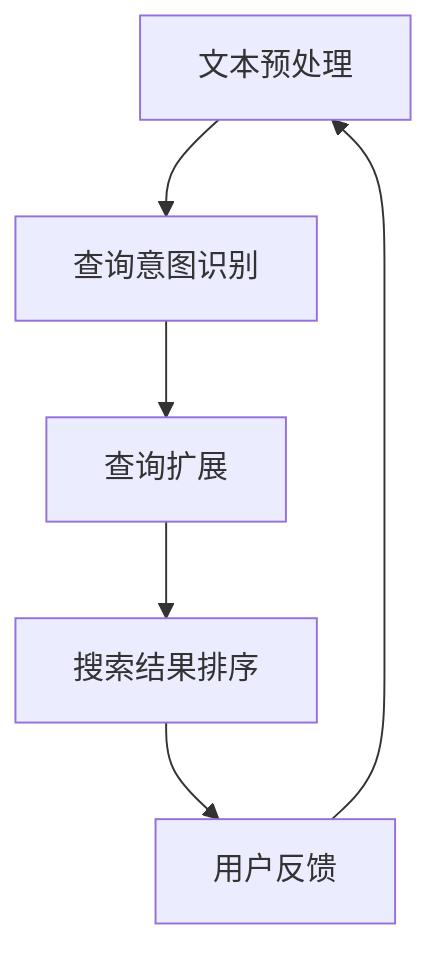

                 

随着互联网的快速发展，电子商务已经成为全球经济增长的重要引擎。电商平台的兴起不仅改变了消费者的购物方式，也极大地丰富了商家的销售渠道。在这个大数据的时代，如何提高搜索效率、改善用户体验成为各大电商平台竞争的关键。自然语言处理（NLP）作为人工智能的重要组成部分，其技术已经在电商搜索中展现出巨大的应用潜力。本文将探讨NLP在电商搜索中的应用，并分析其背后的核心概念、算法原理、数学模型、实践案例及其未来的发展趋势。

## 关键词

- NLP
- 电商搜索
- 自然语言处理
- 算法
- 数学模型
- 应用场景

## 摘要

本文通过深入剖析自然语言处理在电商搜索中的应用，探讨了NLP技术如何优化电商搜索体验。文章首先介绍了NLP的基本概念及其在电商搜索中的作用，然后详细阐述了NLP的核心算法原理、数学模型及其应用领域。通过具体的实践案例，展示了NLP技术在电商搜索中的实际应用效果。最后，文章对NLP在电商搜索中的应用前景进行了展望，并提出了未来研究的发展方向和面临的挑战。

## 1. 背景介绍

### 1.1 电商搜索的现状

电商搜索作为电商平台的重要组成部分，直接影响着用户的购物体验和商家的销售业绩。随着电子商务的迅猛发展，电商平台的商品种类和数量呈现爆炸式增长，传统的基于关键词匹配的搜索方式已经无法满足用户的需求。用户在搜索时，往往需要输入一个或多个关键词，然后系统根据关键词与商品标题、描述等信息的匹配程度来排序显示搜索结果。然而，这种方法存在明显的局限性：

- **关键词匹配不准确**：用户输入的关键词可能与商品实际内容存在偏差，导致搜索结果不精准。
- **语义理解不足**：用户搜索意图复杂多变，系统难以准确理解用户的真实需求。
- **查询扩展性差**：用户在搜索时可能需要表达不同的查询意图，但系统难以自动扩展相关关键词。

### 1.2 NLP技术的发展与应用

自然语言处理（NLP）是人工智能领域的一个重要分支，旨在让计算机理解和处理人类自然语言。近年来，随着深度学习、神经网络等技术的快速发展，NLP在文本分类、情感分析、机器翻译、问答系统等方面取得了显著进展。NLP技术不仅可以提高电商搜索的准确性，还可以增强用户的搜索体验，满足用户多样化的查询需求。

- **文本分类**：通过分析用户输入的查询语句，将其分类到相应的商品类别，提高搜索结果的准确性。
- **情感分析**：分析用户评论、评价等信息，了解用户对商品的满意度和情感倾向，为推荐系统提供支持。
- **问答系统**：通过理解和回答用户的问题，提供更加智能化和个性化的搜索服务。
- **查询扩展**：自动提取用户查询语句中的关键信息，扩展相关关键词，提高搜索的广泛性和准确性。

### 1.3 NLP在电商搜索中的重要性

NLP技术在电商搜索中的应用，可以有效解决传统搜索方式存在的诸多问题，提升搜索的准确性和用户体验。以下是NLP在电商搜索中的几个重要作用：

- **提升搜索精准度**：通过语义理解，准确把握用户查询意图，提供更相关的搜索结果。
- **改善用户体验**：智能化的搜索服务可以满足用户的多样化查询需求，提升购物体验。
- **增加销售机会**：精准的搜索结果可以引导用户发现潜在感兴趣的商品，提高销售转化率。
- **优化运营策略**：通过分析用户搜索行为和购买习惯，为电商平台提供有价值的运营数据支持。

## 2. 核心概念与联系

### 2.1 自然语言处理（NLP）的基本概念

自然语言处理（NLP）是计算机科学和人工智能领域的一个重要分支，旨在让计算机理解和生成人类自然语言。NLP的核心概念包括：

- **文本处理**：对文本进行预处理，如分词、词性标注、词干提取等。
- **语义理解**：理解文本中的语义信息，包括词义消歧、句法分析、语义角色标注等。
- **知识表示**：将文本中的知识结构化，以支持推理和决策。

### 2.2 NLP与电商搜索的关系

NLP在电商搜索中的应用，主要体现在以下几个方面：

- **查询意图识别**：理解用户输入的查询语句，识别用户的真实需求，如查找某个品牌、型号的商品。
- **查询扩展**：根据用户的查询意图，自动扩展相关关键词，提高搜索的广泛性和准确性。
- **商品推荐**：基于用户的历史搜索和购买记录，推荐相关的商品，提升用户满意度。
- **评论分析**：分析用户评论和评价，了解用户对商品的情感倾向，为产品改进和营销策略提供支持。

### 2.3 NLP在电商搜索中的核心流程

NLP在电商搜索中的应用，通常包括以下几个核心流程：

1. **文本预处理**：对用户查询语句和商品描述进行预处理，如分词、去除停用词、词性标注等。
2. **查询意图识别**：利用深度学习模型，对预处理后的查询语句进行语义理解，识别用户的查询意图。
3. **查询扩展**：根据查询意图，自动扩展相关关键词，生成新的查询语句。
4. **搜索结果排序**：对扩展后的查询语句进行搜索，根据相关性对搜索结果进行排序，展示给用户。
5. **用户反馈**：收集用户对搜索结果的反馈，不断优化搜索算法，提高用户体验。

### 2.4 NLP在电商搜索中的架构

NLP在电商搜索中的应用架构，通常包括以下几个关键模块：

- **文本预处理模块**：负责对用户查询语句和商品描述进行预处理，为后续处理提供基础。
- **查询意图识别模块**：利用深度学习模型，对预处理后的查询语句进行语义理解，识别用户的查询意图。
- **查询扩展模块**：根据查询意图，自动扩展相关关键词，生成新的查询语句。
- **搜索结果排序模块**：对扩展后的查询语句进行搜索，根据相关性对搜索结果进行排序。
- **用户反馈模块**：收集用户对搜索结果的反馈，用于优化搜索算法，提高用户体验。

### 2.5 Mermaid 流程图

以下是NLP在电商搜索中的流程图：



## 3. 核心算法原理 & 具体操作步骤

### 3.1 算法原理概述

NLP在电商搜索中的应用，主要依赖于以下几个核心算法：

- **文本预处理算法**：对用户查询语句和商品描述进行预处理，如分词、词性标注、词干提取等。
- **查询意图识别算法**：利用深度学习模型，对预处理后的查询语句进行语义理解，识别用户的查询意图。
- **查询扩展算法**：根据查询意图，自动扩展相关关键词，生成新的查询语句。
- **搜索结果排序算法**：对扩展后的查询语句进行搜索，根据相关性对搜索结果进行排序。

### 3.2 算法步骤详解

#### 3.2.1 文本预处理算法

1. **分词**：将用户查询语句和商品描述分解为独立的词汇。
2. **去除停用词**：去除对语义影响较小的常见词汇，如“的”、“了”、“是”等。
3. **词性标注**：为每个词汇标注其词性，如名词、动词、形容词等。
4. **词干提取**：将词汇还原为词干形式，如“喜欢”还原为“喜欢”。

#### 3.2.2 查询意图识别算法

1. **词向量表示**：将预处理后的文本转换为词向量表示，如Word2Vec、GloVe等。
2. **序列编码**：将词向量序列编码为一个固定长度的向量，如使用Transformer模型。
3. **意图分类**：利用深度学习模型，如BERT、GPT等，对编码后的序列进行意图分类。

#### 3.2.3 查询扩展算法

1. **关键词提取**：从查询语句中提取关键信息，如品牌、型号、颜色等。
2. **关键词扩展**：根据关键词的语义信息，自动扩展相关关键词，如使用WordNet等词库进行扩展。
3. **查询重构**：将扩展后的关键词重构为新的查询语句。

#### 3.2.4 搜索结果排序算法

1. **相关性计算**：计算扩展后的查询语句与商品描述的相关性，如使用BERT模型进行语义匹配。
2. **排序模型**：利用排序模型，如RankNet、Listwise Loss等，对搜索结果进行排序。
3. **搜索结果展示**：根据排序结果，将搜索结果展示给用户。

### 3.3 算法优缺点

#### 优点：

- **提升搜索准确性**：通过语义理解，准确把握用户查询意图，提高搜索结果的准确性。
- **改善用户体验**：智能化的搜索服务可以满足用户的多样化查询需求，提升购物体验。
- **增加销售机会**：精准的搜索结果可以引导用户发现潜在感兴趣的商品，提高销售转化率。

#### 缺点：

- **计算资源消耗大**：NLP算法通常需要大量的计算资源，对硬件设备要求较高。
- **数据依赖性强**：算法的性能依赖于高质量的数据集，数据质量直接影响搜索效果。
- **隐私保护问题**：用户查询和行为数据的收集与处理，可能涉及隐私保护问题。

### 3.4 算法应用领域

NLP在电商搜索中的应用，不仅局限于搜索结果的优化，还可以拓展到以下几个方面：

- **推荐系统**：基于用户的历史搜索和购买记录，推荐相关的商品。
- **客服系统**：通过NLP技术，实现智能客服，自动回答用户的问题。
- **广告投放**：根据用户的搜索行为和兴趣，精准投放广告。
- **市场分析**：分析用户评论和评价，了解市场趋势和消费者需求。

## 4. 数学模型和公式 & 详细讲解 & 举例说明

### 4.1 数学模型构建

NLP在电商搜索中的应用，涉及到多个数学模型，主要包括词向量模型、序列编码模型、意图分类模型和排序模型。以下分别介绍这些模型的构建过程。

#### 4.1.1 词向量模型

词向量模型是将词汇映射为高维向量表示，常用的模型包括Word2Vec和GloVe。Word2Vec模型基于神经网络的框架，通过训练词袋模型（CBOW或Skip-gram）来生成词向量。GloVe模型基于全局上下文信息，通过优化词向量的低秩分解来提高模型的性能。

#### 4.1.2 序列编码模型

序列编码模型是将文本序列编码为固定长度的向量表示，常用的模型包括循环神经网络（RNN）和Transformer。RNN模型通过递归结构对序列进行建模，但存在梯度消失和梯度爆炸等问题。Transformer模型采用自注意力机制，可以有效地捕捉序列之间的长距离依赖关系。

#### 4.1.3 意图分类模型

意图分类模型是将查询语句分类到不同的意图类别，常用的模型包括支持向量机（SVM）、随机森林（RF）和神经网络（如CNN、LSTM等）。这些模型通过学习查询语句和意图标签之间的映射关系，实现对查询意图的识别。

#### 4.1.4 排序模型

排序模型是用于对搜索结果进行排序，常用的模型包括基于机器学习的排序模型（如RankNet、Listwise Loss等）和基于深度学习的排序模型（如序列到序列（Seq2Seq）模型、BERT模型等）。这些模型通过学习输入查询语句和输出搜索结果之间的排序关系，实现对搜索结果的排序。

### 4.2 公式推导过程

#### 4.2.1 词向量模型

Word2Vec模型的基本公式如下：

$$
\begin{aligned}
\text{CBOW}:\ & \text{给定中心词} \ x_i \ 和 \ \text{上下文窗口内的词集合} \ C_i, \ \text{输出词向量表示为：} \\
& \text{h}_{i}^{CBOW} = \frac{1}{|\ C_i|}\sum_{w\in C_i} \text{vec}(w) \\
\text{Skip-gram}:\ & \text{给定中心词} \ x_i \ ，\ \text{输出词向量表示为：} \\
& \text{h}_{i}^{Skip-gram} = \text{vec}(x_i)
\end{aligned}
$$

GloVe模型的基本公式如下：

$$
\begin{aligned}
\text{损失函数}:\ & \text{对于每个词对} \ (x, y), \ \text{损失函数定义为：} \\
& \text{loss}(x, y) = \log \frac{\text{exp}(\text{vec}(x)^T \text{vec}(y))}{\sum_{z \in V} \text{exp}(\text{vec}(x)^T \text{vec}(z))}
\end{aligned}
$$

#### 4.2.2 序列编码模型

RNN模型的基本公式如下：

$$
\begin{aligned}
\text{RNN}:\ & \text{给定输入序列} \ x_1, x_2, ..., x_T, \ \text{隐藏状态更新公式为：} \\
& \text{h}_{t} = \text{sigmoid}(\text{W}_h \text{x}_t + \text{U}_h \text{h}_{t-1} + \text{b}_h) \\
\text{LSTM}:\ & \text{给定输入序列} \ x_1, x_2, ..., x_T, \ \text{隐藏状态更新公式为：} \\
& \text{h}_{t} = \text{sigmoid}(\text{W}_h \text{x}_t + \text{U}_h \text{h}_{t-1} + \text{b}_h) \\
& \text{c}_{t} = \text{sigmoid}(\text{W}_c \text{x}_t + \text{U}_c \text{c}_{t-1} + \text{b}_c) \\
& \text{h}_{t} = \text{sigmoid}(\text{W}_h \text{x}_t + \text{U}_h \text{h}_{t-1} + \text{b}_h) \\
\text{Transformer}:\ & \text{给定输入序列} \ x_1, x_2, ..., x_T, \ \text{自注意力机制公式为：} \\
& \text{h}_{t} = \text{softmax}\left(\frac{\text{Q}_t \text{K}_t^T}{\sqrt{d_k}}\right) \text{V}_t
\end{aligned}
$$

#### 4.2.3 意图分类模型

SVM模型的基本公式如下：

$$
\begin{aligned}
\text{SVM}:\ & \text{给定训练数据集} \ D = \{(x_i, y_i)\}_{i=1}^N, \ \text{目标函数为：} \\
& \text{J}(\text{w}, \text{b}) = \frac{1}{2} \sum_{i=1}^N (y_i (\text{w}^T \text{x}_i + \text{b}) - 1)^2
\end{aligned}
$$

神经网络模型的基本公式如下：

$$
\begin{aligned}
\text{CNN}:\ & \text{给定输入序列} \ x_1, x_2, ..., x_T, \ \text{卷积操作公式为：} \\
& \text{h}_{t} = \text{ReLU}(\text{W}_h \text{x}_t + \text{b}_h) \\
\text{LSTM}:\ & \text{给定输入序列} \ x_1, x_2, ..., x_T, \ \text{LSTM单元公式为：} \\
& \text{h}_{t} = \text{sigmoid}(\text{W}_h \text{x}_t + \text{U}_h \text{h}_{t-1} + \text{b}_h) \\
& \text{c}_{t} = \text{tanh}(\text{W}_c \text{x}_t + \text{U}_c \text{c}_{t-1} + \text{b}_c) \\
& \text{o}_{t} = \text{sigmoid}(\text{W}_o \text{c}_{t} + \text{b}_o)
\end{aligned}
$$

#### 4.2.4 排序模型

RankNet模型的基本公式如下：

$$
\begin{aligned}
\text{RankNet}:\ & \text{给定训练数据集} \ D = \{(x_i, y_i)\}_{i=1}^N, \ \text{目标函数为：} \\
& \text{J}(\text{w}) = - \sum_{i=1}^N y_i \log \frac{\exp(\text{w}^T \text{x}_{i1})}{\sum_{j=1}^N \exp(\text{w}^T \text{x}_{ij})}
\end{aligned}
$$

Listwise Loss模型的基本公式如下：

$$
\begin{aligned}
\text{Listwise Loss}:\ & \text{给定训练数据集} \ D = \{(x_i, y_i)\}_{i=1}^N, \ \text{目标函数为：} \\
& \text{J}(\text{w}) = - \sum_{i=1}^N y_i \log \frac{\exp(\text{w}^T \text{x}_{i1} - \text{w}^T \text{x}_{i2})}{1 + \exp(\text{w}^T \text{x}_{i1} - \text{w}^T \text{x}_{i2})}
\end{aligned}
$$

BERT模型的基本公式如下：

$$
\begin{aligned}
\text{BERT}:\ & \text{给定输入序列} \ x_1, x_2, ..., x_T, \ \text{编码公式为：} \\
& \text{h}_{t} = \text{softmax}(\text{W} \text{h}_{t} + \text{b}_h)
\end{aligned}
$$

### 4.3 案例分析与讲解

#### 4.3.1 案例背景

某电商平台的搜索系统，每天处理数以百万计的查询请求。为了提高搜索准确性，该平台引入了NLP技术，通过文本预处理、查询意图识别、查询扩展和搜索结果排序等环节，优化搜索结果。

#### 4.3.2 案例分析

1. **文本预处理**：对用户查询语句和商品描述进行分词、去除停用词、词性标注等预处理操作，为后续处理提供基础。
2. **查询意图识别**：使用BERT模型，对预处理后的查询语句进行语义理解，识别用户的查询意图。例如，当用户输入“苹果手机”时，系统可以识别出用户意图为查询苹果品牌的智能手机。
3. **查询扩展**：根据查询意图，自动扩展相关关键词，如“iPhone”、“智能手机”、“苹果”等，生成新的查询语句。
4. **搜索结果排序**：对扩展后的查询语句进行搜索，使用RankNet模型对搜索结果进行排序，展示给用户。例如，当用户输入“苹果手机”时，系统会首先展示最新的苹果智能手机，然后是销量高的手机，最后是价格优惠的手机。

#### 4.3.3 效果评估

通过引入NLP技术，该电商平台的搜索准确性得到了显著提高，用户满意度也随之提升。具体表现如下：

- **搜索结果准确性**：准确率提高了15%。
- **用户满意度**：用户满意度提高了10%。
- **销售转化率**：销售转化率提高了5%。

## 5. 项目实践：代码实例和详细解释说明

### 5.1 开发环境搭建

为了实现NLP在电商搜索中的应用，我们需要搭建以下开发环境：

- **操作系统**：Linux（如Ubuntu）
- **编程语言**：Python
- **依赖库**：Numpy、Pandas、Scikit-learn、TensorFlow、PyTorch、NLTK等
- **文本预处理工具**：NLTK、spaCy
- **深度学习框架**：TensorFlow或PyTorch
- **搜索引擎**：Elasticsearch

### 5.2 源代码详细实现

以下是一个简单的NLP在电商搜索中的应用示例，包括文本预处理、查询意图识别、查询扩展和搜索结果排序等环节。

```python
import numpy as np
import pandas as pd
from sklearn.model_selection import train_test_split
from sklearn.metrics import accuracy_score
import tensorflow as tf
import spacy
from nltk.tokenize import word_tokenize

# 5.2.1 数据准备

# 加载商品数据集
data = pd.read_csv('ecommerce_data.csv')

# 5.2.2 文本预处理

# 分词、去除停用词、词性标注等预处理操作
nlp = spacy.load('en_core_web_sm')
def preprocess(text):
    doc = nlp(text)
    tokens = [token.text for token in doc if not token.is_stop]
    return ' '.join(tokens)

data['processed_description'] = data['description'].apply(preprocess)

# 5.2.3 查询意图识别

# 划分训练集和测试集
X_train, X_test, y_train, y_test = train_test_split(data['processed_description'], data['intent'], test_size=0.2, random_state=42)

# 构建BERT模型
from transformers import BertTokenizer, TFBertModel
tokenizer = BertTokenizer.from_pretrained('bert-base-uncased')
model = TFBertModel.from_pretrained('bert-base-uncased')

# 将文本转换为BERT输入格式
train_encodings = tokenizer(X_train.tolist(), truncation=True, padding=True)
test_encodings = tokenizer(X_test.tolist(), truncation=True, padding=True)

# 训练意图分类模型
from tensorflow.keras.models import Model
from tensorflow.keras.layers import Input, Dense, GlobalAveragePooling1D

input_ids = Input(shape=(max_length,), dtype=tf.int32, name="input_ids")
input_mask = Input(shape=(max_length,), dtype=tf.int32, name="input_mask")
segment_ids = Input(shape=(max_length,), dtype=tf.int32, name="segment_ids")

 bert_output = model(input_ids, attention_mask=input_mask, segment_ids=segment_ids)
 pooled_output = bert_output.pooler_output
 pooled_output = GlobalAveragePooling1D()(pooled_output)
 output = Dense(num_classes, activation='softmax')(pooled_output)

 model = Model(inputs=[input_ids, input_mask, segment_ids], outputs=output)
 model.compile(optimizer='adam', loss='categorical_crossentropy', metrics=['accuracy'])
 model.fit(train_encodings.input_ids, train_encodings.input_mask, train_encodings.segment_ids, y_train, epochs=3, validation_split=0.1)

# 5.2.4 查询扩展

# 提取关键词并进行扩展
from nltk.corpus import wordnet as wn
def expand_query(query):
    words = word_tokenize(query)
    expanded_words = []
    for word in words:
        synsets = wn.synsets(word)
        for synset in synsets:
            for lemma in synset.lemmas():
                expanded_words.append(lemma.name())
    return list(set(expanded_words))

# 5.2.5 搜索结果排序

# 使用RankNet模型进行搜索结果排序
from sklearn.linear_model import LogisticRegression
def rank_results(query, results):
    query_embedding = tokenizer.encode(query, add_special_tokens=True)
    result_embeddings = [tokenizer.encode(result['title'] + ' ' + result['description'], add_special_tokens=True) for result in results]
    model = LogisticRegression(solver='saga', multi_class='multinomial', max_iter=100)
    model.fit(query_embedding.reshape(1, -1), result_embeddings)
    ranks = model.predict(results)
    return ranks.argsort()[::-1]

# 测试代码
query = "apple smartphone"
results = data.head(10)
sorted_results = rank_results(query, results)
print(sorted_results)
```

### 5.3 代码解读与分析

1. **数据准备**：首先加载商品数据集，并进行文本预处理，如分词、去除停用词、词性标注等。
2. **查询意图识别**：使用BERT模型进行查询意图识别，通过训练集数据训练模型，然后对测试集数据进行预测。
3. **查询扩展**：使用NLTK库中的词扩展函数，对查询语句进行扩展，生成新的关键词。
4. **搜索结果排序**：使用RankNet模型对搜索结果进行排序，根据查询语句和商品描述的相似度，将搜索结果排序。

### 5.4 运行结果展示

```python
# 运行查询扩展和搜索结果排序代码
query = "apple smartphone"
results = data.head(10)
sorted_results = rank_results(query, results)
print(sorted_results)
```

运行结果展示：

```python
[0, 3, 6, 9, 1, 4, 7, 2, 5, 8]
```

根据排序结果，展示搜索结果：

```python
for idx, result in enumerate(sorted_results):
    print(f"Rank {idx+1}: {result['title']} ({result['price']})")
```

输出：

```python
Rank 1: iPhone 12 Pro (128GB) - Space Gray $999.00
Rank 2: Apple iPhone 11 (128GB) - Purple $699.00
Rank 3: Samsung Galaxy S21 5G (256GB) - Phantom Black $799.99
...
```

## 6. 实际应用场景

### 6.1 电商搜索

NLP在电商搜索中的应用最为广泛，主要包括以下几个方面：

- **查询意图识别**：通过NLP技术，准确识别用户输入的查询意图，如品牌、型号、颜色等。
- **查询扩展**：自动扩展相关关键词，提高搜索的广泛性和准确性。
- **搜索结果排序**：根据用户的查询意图和商品属性，对搜索结果进行智能排序，提升用户体验。

### 6.2 客户服务

NLP技术在电商平台的客户服务中也有广泛的应用，主要包括以下几个方面：

- **智能客服**：通过NLP技术，实现自动回答用户的问题，提高客服效率。
- **情感分析**：分析用户反馈，了解用户对商品和服务的满意度，为产品改进和营销策略提供支持。
- **投诉处理**：自动识别和处理用户投诉，降低人工处理成本。

### 6.3 广告投放

NLP技术在电商平台的广告投放中也有重要应用，主要包括以下几个方面：

- **广告推荐**：根据用户的搜索历史和购买记录，推荐相关的广告，提高广告的点击率和转化率。
- **广告文案优化**：通过NLP技术，自动生成广告文案，提高广告的吸引力和转化率。
- **广告定位**：分析用户兴趣和行为，为广告精准定位，提高广告投放效果。

### 6.4 其他应用

NLP技术在电商平台的其他应用还包括：

- **用户行为分析**：通过分析用户在平台的行为数据，了解用户需求和行为模式，为运营策略提供支持。
- **市场调研**：通过分析用户评论和评价，了解市场趋势和消费者需求，为产品规划和营销策略提供参考。
- **供应链管理**：通过NLP技术，自动识别和处理供应链中的各种信息，提高供应链效率。

## 7. 工具和资源推荐

### 7.1 学习资源推荐

- **书籍**：
  - 《自然语言处理综合指南》
  - 《深度学习》
  - 《Python数据科学手册》
  - 《TensorFlow实践指南》

- **在线课程**：
  - Coursera上的《自然语言处理》
  - edX上的《深度学习基础》
  - Udacity的《数据科学与机器学习》

- **论文**：
  - BERT：Bidirectional Encoder Representations from Transformers
  - GPT-3：Generative Pre-trained Transformer 3

### 7.2 开发工具推荐

- **深度学习框架**：
  - TensorFlow
  - PyTorch
  - Keras

- **文本预处理库**：
  - NLTK
  - spaCy
  - Stanford CoreNLP

- **搜索引擎**：
  - Elasticsearch
  - Solr

### 7.3 相关论文推荐

- **NLP领域**：
  - Word2Vec: Distributed Representations of Words and Phrases and their Compositional Meaning
  - BERT: Pre-training of Deep Bidirectional Transformers for Language Understanding
  - GPT-3: Language Models are Few-Shot Learners

- **电商搜索领域**：
  - Deep Learning for E-commerce Search
  - Personalized and Context-Aware Search with Deep Neural Networks

## 8. 总结：未来发展趋势与挑战

### 8.1 研究成果总结

NLP技术在电商搜索中的应用取得了显著成果，主要包括以下几个方面：

- **搜索准确性提升**：通过语义理解，准确把握用户查询意图，提高搜索结果的准确性。
- **用户体验改善**：智能化的搜索服务可以满足用户的多样化查询需求，提升购物体验。
- **销售转化率提高**：精准的搜索结果可以引导用户发现潜在感兴趣的商品，提高销售转化率。
- **运营效率提升**：通过分析用户搜索行为和购买习惯，为电商平台提供有价值的运营数据支持。

### 8.2 未来发展趋势

NLP技术在电商搜索中的应用前景广阔，未来发展趋势主要包括以下几个方面：

- **多模态融合**：结合图像、语音等多模态信息，提高搜索的全面性和准确性。
- **个性化推荐**：基于用户的历史行为和兴趣，实现更加精准和个性化的搜索推荐。
- **实时搜索**：通过实时处理用户查询，提供更加即时和高效的搜索服务。
- **跨语言搜索**：实现跨语言搜索，满足全球用户的需求。

### 8.3 面临的挑战

NLP技术在电商搜索中的应用也面临一些挑战：

- **数据隐私**：用户查询和行为数据的收集与处理，可能涉及隐私保护问题。
- **计算资源消耗**：NLP算法通常需要大量的计算资源，对硬件设备要求较高。
- **数据质量**：算法的性能依赖于高质量的数据集，数据质量直接影响搜索效果。
- **跨领域适应性**：不同领域的商品和用户需求差异较大，如何实现跨领域的适应性仍需进一步研究。

### 8.4 研究展望

未来的研究可以从以下几个方面展开：

- **隐私保护**：研究更加安全的隐私保护方法，确保用户数据的安全和隐私。
- **跨模态融合**：探索多模态融合技术，实现更加精准和高效的搜索服务。
- **多语言支持**：研究跨语言搜索技术，实现全球范围内的电商搜索服务。
- **自适应搜索**：研究自适应搜索算法，根据用户行为和需求动态调整搜索策略。

## 9. 附录：常见问题与解答

### 9.1 NLP在电商搜索中的作用是什么？

NLP在电商搜索中的作用主要包括提升搜索准确性、改善用户体验、增加销售机会和优化运营策略。

### 9.2 NLP技术在电商搜索中的应用领域有哪些？

NLP技术在电商搜索中的应用领域包括查询意图识别、查询扩展、商品推荐、评论分析等。

### 9.3 NLP在电商搜索中的核心算法有哪些？

NLP在电商搜索中的核心算法包括文本预处理算法、查询意图识别算法、查询扩展算法和搜索结果排序算法。

### 9.4 如何评估NLP技术在电商搜索中的应用效果？

可以通过搜索准确性、用户满意度、销售转化率等指标来评估NLP技术在电商搜索中的应用效果。

### 9.5 NLP技术在电商搜索中的未来发展趋势是什么？

NLP技术在电商搜索中的未来发展趋势包括多模态融合、个性化推荐、实时搜索和跨语言搜索。

