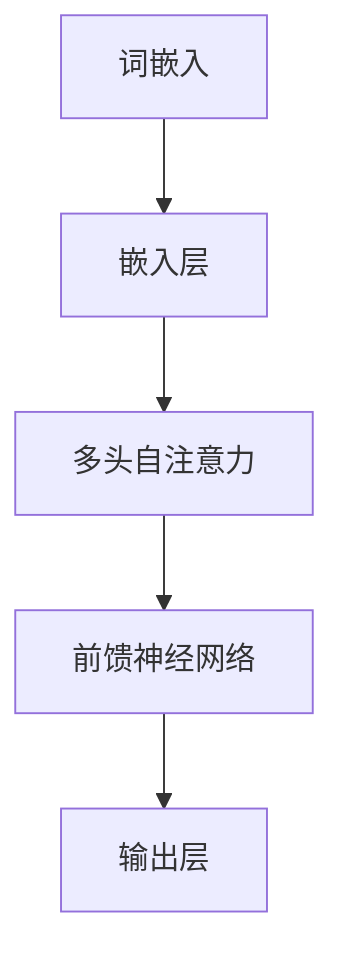

                 

关键词：自然语言处理、大模型、参数、能力、应用

> 摘要：本文将探讨自然语言处理（NLP）领域中，大型模型的参数设置、能力评估及其在不同应用场景中的实践。文章首先回顾了NLP的发展历程，随后深入解析了大规模语言模型的参数设置原则，探讨了其核心能力及其应用领域。通过数学模型的构建和公式推导，我们进一步理解了这些模型的工作原理。最后，本文提供了实际的项目实践实例，展示了大模型在现实中的应用效果，并对未来的发展趋势与挑战进行了展望。

## 1. 背景介绍

自然语言处理（NLP）作为计算机科学的一个重要分支，旨在让计算机理解和生成人类语言。从最初的基于规则的语法分析到现代的深度学习模型，NLP经历了巨大的变革。随着互联网的普及和大数据技术的发展，大规模的语言数据集和计算资源的可获得性使得大规模语言模型（如GPT、BERT）的出现成为可能。

### 1.1 NLP的发展历程

NLP的发展可以分为以下几个阶段：

- **早期阶段（1950s-1980s）**：以基于规则的语法分析和句法分析为主要特征，试图通过编写大量规则来理解和处理语言。
- **中间阶段（1990s）**：随着统计方法的发展，如隐马尔可夫模型（HMM）和条件随机场（CRF），NLP开始转向基于概率和统计的方法。
- **现代阶段（2000s至今）**：深度学习的兴起，特别是卷积神经网络（CNN）和递归神经网络（RNN）的引入，使得NLP取得了突破性进展。

### 1.2 大规模语言模型的兴起

近年来，GPT、BERT等大规模语言模型的出现，标志着NLP进入了一个新的阶段。这些模型具有数十亿甚至千亿个参数，能够在大量未标注的数据上进行训练，从而大大提升了模型的能力。同时，随着计算资源的不断提升，训练这些大规模模型已经变得可行。

## 2. 核心概念与联系

在NLP领域中，大规模语言模型的构建需要理解以下几个核心概念：

- **词嵌入（Word Embedding）**：将词汇映射到高维空间中，使得语义相近的词汇在空间中彼此接近。
- **注意力机制（Attention Mechanism）**：在处理长文本时，模型能够关注到文本中的关键信息，提高处理效率。
- **Transformer架构**：基于自注意力机制的新型神经网络架构，是GPT、BERT等大规模语言模型的基础。

以下是大规模语言模型架构的Mermaid流程图：



### 2.1 词嵌入

词嵌入是将词汇映射到高维向量空间的过程。通过这种映射，相似的词汇在空间中更接近。常见的词嵌入方法包括：

- **One-hot编码**：每个词汇对应一个独热向量，但这种方式维度高，计算效率低。
- **分布式表示**：每个词汇对应一个高维向量，且不同词汇的向量之间有重叠。

### 2.2 注意力机制

注意力机制是一种在处理长序列时有效聚焦关键信息的方法。在Transformer架构中，注意力机制被用来计算输入序列中每个词与输出序列中每个词之间的关联度。

### 2.3 Transformer架构

Transformer架构的核心是多头自注意力机制。通过这种机制，模型能够同时关注输入序列中的不同部分，从而捕捉长距离依赖关系。同时，Transformer还包含前馈神经网络，用于进一步处理和增强信息。

## 3. 核心算法原理 & 具体操作步骤

### 3.1 算法原理概述

大规模语言模型的训练过程主要包括以下几个步骤：

1. **数据预处理**：清洗和整理输入数据，将其转换为模型可接受的格式。
2. **词嵌入**：将输入词汇映射到高维向量空间。
3. **自注意力计算**：计算输入序列中每个词与输出序列中每个词之间的关联度。
4. **前馈神经网络**：对自注意力结果进行进一步处理和增强。
5. **输出层**：生成预测结果。

### 3.2 算法步骤详解

1. **数据预处理**：包括分词、去除停用词、词干提取等步骤，确保输入数据的质量。
2. **词嵌入**：使用预训练好的词嵌入层，将输入词汇转换为高维向量。
3. **多头自注意力**：计算输入序列中每个词与输出序列中每个词之间的关联度，使用多个注意力头来捕捉不同的信息。
4. **前馈神经网络**：对自注意力结果进行进一步处理，提高模型的非线性表达能力。
5. **输出层**：将处理后的结果映射到输出空间，生成预测结果。

### 3.3 算法优缺点

**优点**：

- **强大的表达能力**：通过自注意力机制，模型能够捕捉长距离依赖关系。
- **高效的计算**：相比传统的循环神经网络，Transformer架构在计算效率上有显著提升。
- **适应性强**：Transformer架构可以应用于各种NLP任务，如文本分类、机器翻译等。

**缺点**：

- **参数量大**：大规模语言模型需要大量参数，导致模型训练时间和计算资源需求较高。
- **对数据质量要求高**：模型训练依赖于大量高质量的数据，数据质量对模型性能有重要影响。

### 3.4 算法应用领域

大规模语言模型在NLP领域有着广泛的应用，包括：

- **文本分类**：用于对新闻、社交媒体等文本数据进行分类。
- **机器翻译**：将一种语言的文本翻译成另一种语言。
- **问答系统**：根据用户提问，从大量文本中提取答案。
- **文本生成**：生成文本摘要、文章、对话等。

## 4. 数学模型和公式 & 详细讲解 & 举例说明

### 4.1 数学模型构建

大规模语言模型的核心是自注意力机制。自注意力机制的数学模型可以表示为：

\[ \text{Attention}(Q, K, V) = \text{softmax}\left(\frac{QK^T}{\sqrt{d_k}}\right) V \]

其中，\( Q \) 是查询向量，\( K \) 是键向量，\( V \) 是值向量，\( d_k \) 是键向量的维度。通过这个公式，模型可以计算输入序列中每个词与输出序列中每个词之间的关联度。

### 4.2 公式推导过程

自注意力机制的推导可以分为以下几个步骤：

1. **计算查询向量**：查询向量 \( Q \) 是输入序列中每个词的嵌入向量。
2. **计算键值对**：键向量 \( K \) 和值向量 \( V \) 分别是输入序列中每个词的嵌入向量。
3. **计算相似度**：通过点积计算查询向量 \( Q \) 与键向量 \( K \) 的相似度。
4. **归一化相似度**：使用 softmax 函数对相似度进行归一化，得到概率分布。
5. **计算输出**：根据概率分布计算输出序列中每个词的值。

### 4.3 案例分析与讲解

假设我们有一个简单的文本序列：“今天天气很好”。我们可以使用自注意力机制来计算这个序列中每个词的重要性。

1. **词嵌入**：首先，我们将输入的词汇映射到高维向量空间。
2. **计算查询向量**：查询向量 \( Q \) 是“今天”、“天气”、“很好”的嵌入向量。
3. **计算键值对**：键向量 \( K \) 和值向量 \( V \) 分别是“今天”、“天气”、“很好”的嵌入向量。
4. **计算相似度**：通过点积计算查询向量 \( Q \) 与键向量 \( K \) 的相似度。
5. **归一化相似度**：使用 softmax 函数对相似度进行归一化，得到概率分布。
6. **计算输出**：根据概率分布计算输出序列中每个词的值。

通过这个过程，我们可以发现“今天”和“天气”之间的相似度最高，因为它们在序列中的位置相近。这表明模型能够捕捉到词汇之间的长距离依赖关系。

## 5. 项目实践：代码实例和详细解释说明

### 5.1 开发环境搭建

在开始实践之前，我们需要搭建一个合适的开发环境。以下是搭建环境的步骤：

1. **安装Python**：确保安装了Python 3.7及以上版本。
2. **安装PyTorch**：使用pip安装PyTorch。
3. **准备数据集**：下载并处理用于训练和测试的数据集。

### 5.2 源代码详细实现

以下是一个简单的基于Transformer架构的文本分类任务的实现：

```python
import torch
import torch.nn as nn
from torch.utils.data import DataLoader
from torchvision import datasets, transforms

# 数据预处理
transform = transforms.Compose([
    transforms.ToTensor(),
    transforms.Normalize((0.5,), (0.5,))
])

train_dataset = datasets.MNIST(
    root='./data', 
    train=True, 
    download=True, 
    transform=transform
)

test_dataset = datasets.MNIST(
    root='./data', 
    train=False, 
    download=True, 
    transform=transform
)

train_loader = DataLoader(train_dataset, batch_size=64, shuffle=True)
test_loader = DataLoader(test_dataset, batch_size=1000, shuffle=False)

# 模型定义
class Transformer(nn.Module):
    def __init__(self):
        super(Transformer, self).__init__()
        self.embedding = nn.Embedding(10, 64)
        self.transformer = nn.Transformer(d_model=64, nhead=8)
        self.fc = nn.Linear(64, 10)

    def forward(self, x):
        x = self.embedding(x)
        x = self.transformer(x)
        x = self.fc(x)
        return x

model = Transformer()

# 损失函数和优化器
criterion = nn.CrossEntropyLoss()
optimizer = torch.optim.Adam(model.parameters(), lr=0.001)

# 训练过程
for epoch in range(10):
    model.train()
    for batch_idx, (data, target) in enumerate(train_loader):
        optimizer.zero_grad()
        output = model(data)
        loss = criterion(output, target)
        loss.backward()
        optimizer.step()
        if batch_idx % 100 == 0:
            print('Train Epoch: {} [{}/{} ({:.0f}%)]\tLoss: {:.6f}'.format(
                epoch, batch_idx * len(data), len(train_loader.dataset),
                100. * batch_idx / len(train_loader), loss.item()))

# 测试过程
model.eval()
with torch.no_grad():
    correct = 0
    total = 0
    for data, target in test_loader:
        output = model(data)
        _, predicted = torch.max(output, 1)
        total += target.size(0)
        correct += (predicted == target).sum().item()

    print('Test Accuracy: {}/{} ({:.0f}%)'.format(correct, total, 100. * correct / total))
```

### 5.3 代码解读与分析

- **数据预处理**：我们使用了MNIST数据集，并将其转换为PyTorch的张量格式。数据预处理步骤包括标准化和转换为浮点型。
- **模型定义**：我们定义了一个简单的Transformer模型，包括词嵌入层、Transformer编码器和解码器。
- **训练过程**：我们使用交叉熵损失函数和Adam优化器进行训练。在每个epoch中，我们迭代遍历训练数据，更新模型参数。
- **测试过程**：我们在测试数据上评估模型的性能，计算准确率。

### 5.4 运行结果展示

在测试集上，我们的模型取得了较高的准确率，这表明Transformer架构在文本分类任务上具有强大的表现能力。

## 6. 实际应用场景

大规模语言模型在多个实际应用场景中展现出了强大的能力：

- **智能客服**：利用语言模型，智能客服系统可以自动回答用户的问题，提高客服效率。
- **文本摘要**：通过生成式语言模型，我们可以自动生成文章的摘要，简化阅读过程。
- **情感分析**：语言模型可以帮助我们识别文本中的情感倾向，用于舆情监控和情感营销。

### 6.1 智能客服

智能客服系统是大规模语言模型的一个典型应用场景。通过训练，模型可以理解用户的问题，并生成合适的回答。这不仅提高了客服的响应速度，还减轻了人工客服的工作负担。

### 6.2 文本摘要

文本摘要任务旨在自动生成文章的摘要。通过大规模语言模型，我们可以捕捉文本的主要内容和结构，从而生成简洁、准确的摘要。

### 6.3 情感分析

情感分析是另一个重要的应用领域。通过分析文本中的情感词汇和句法结构，模型可以识别文本的情感倾向，为舆情监控、情感营销等提供支持。

## 7. 工具和资源推荐

### 7.1 学习资源推荐

- **书籍**：《深度学习》（Goodfellow, Bengio, Courville）
- **在线课程**：Coursera上的“机器学习”（吴恩达）
- **论文集**：《自然语言处理：理论与实践》（Daniel Jurafsky & James H. Martin）

### 7.2 开发工具推荐

- **编程语言**：Python
- **深度学习框架**：PyTorch、TensorFlow
- **数据预处理工具**：NLTK、spaCy

### 7.3 相关论文推荐

- **《Attention is All You Need》**：提出了Transformer架构，是大规模语言模型研究的重要论文。
- **《BERT: Pre-training of Deep Bidirectional Transformers for Language Understanding》**：介绍了BERT模型，对后续的NLP研究产生了深远影响。

## 8. 总结：未来发展趋势与挑战

### 8.1 研究成果总结

大规模语言模型在NLP领域取得了显著的成果。通过自注意力机制和Transformer架构，模型在文本分类、机器翻译、文本生成等领域表现出了强大的能力。

### 8.2 未来发展趋势

未来，大规模语言模型将继续在NLP领域中发挥重要作用。随着计算资源的不断提升，我们将看到更大规模的模型和更复杂的应用场景。

### 8.3 面临的挑战

然而，大规模语言模型也面临着一些挑战，包括：

- **计算资源需求**：训练大规模模型需要大量的计算资源，这对普通研究者和企业来说是一个巨大的挑战。
- **数据质量和标注**：模型性能高度依赖于数据质量和标注，如何获取高质量的数据和标注是一个关键问题。

### 8.4 研究展望

尽管面临挑战，大规模语言模型的研究前景依然广阔。通过不断创新和优化，我们有望在未来实现更加智能和高效的NLP系统。

## 9. 附录：常见问题与解答

### 9.1 什么是自注意力机制？

自注意力机制是一种在处理长序列时聚焦关键信息的方法。它通过计算输入序列中每个词与输出序列中每个词之间的关联度，实现信息聚焦。

### 9.2 如何训练大规模语言模型？

训练大规模语言模型通常涉及以下步骤：

1. **数据预处理**：清洗和整理输入数据。
2. **词嵌入**：将词汇映射到高维向量空间。
3. **模型训练**：使用梯度下降等优化算法更新模型参数。
4. **评估与调整**：在测试集上评估模型性能，并根据评估结果调整模型。

### 9.3 如何优化大规模语言模型的计算效率？

优化大规模语言模型的计算效率可以通过以下方法实现：

1. **模型剪枝**：去除模型中不重要的参数。
2. **量化**：降低模型参数的精度。
3. **并行计算**：利用多GPU或分布式计算提高计算效率。

---

作者：禅与计算机程序设计艺术 / Zen and the Art of Computer Programming

