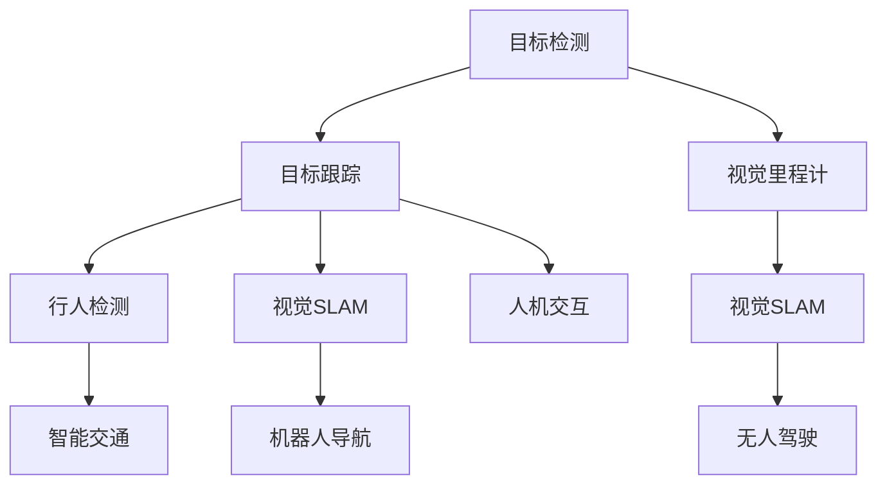

                 

 

### 1. 背景介绍

Object Tracking，即目标跟踪，是计算机视觉领域的一个重要研究方向。它的核心目标是通过分析图像或视频序列，实时地定位和跟踪图像中的目标物体。随着图像处理技术的进步和深度学习算法的发展，目标跟踪技术取得了显著的成果，并在众多应用场景中发挥了重要作用。

目标跟踪在许多实际应用中具有广泛的应用价值，如视频监控、自动驾驶、人机交互、医疗影像分析等。在视频监控领域，目标跟踪技术可以实现对犯罪行为的实时监控和追踪；在自动驾驶领域，目标跟踪是实现车辆和环境感知的关键技术；在人机交互领域，目标跟踪技术可以用于面部识别和手势识别，为智能交互提供支持；在医疗影像分析领域，目标跟踪技术可以辅助医生进行病变区域的检测和追踪。

本文将系统地介绍目标跟踪的基本原理、核心算法、数学模型以及项目实践，帮助读者深入了解目标跟踪技术的各个方面，并掌握其应用方法。具体来说，文章将涵盖以下内容：

1. 背景介绍
2. 核心概念与联系
3. 核心算法原理与具体操作步骤
4. 数学模型和公式详细讲解
5. 项目实践：代码实例和详细解释说明
6. 实际应用场景
7. 工具和资源推荐
8. 总结：未来发展趋势与挑战
9. 附录：常见问题与解答

通过对本文的学习，读者将能够：

- 理解目标跟踪的基本概念和重要性
- 掌握常见目标跟踪算法的原理和操作步骤
- 掌握目标跟踪的数学模型和公式
- 学习如何利用目标跟踪技术解决实际问题
- 了解目标跟踪技术的实际应用场景和未来发展趋势

### 2. 核心概念与联系

在介绍目标跟踪算法之前，我们需要先了解一些核心概念和它们之间的联系。

#### 目标检测（Object Detection）

目标检测是目标跟踪的前提，它是指从图像或视频中识别出目标物体并定位其位置。常见的目标检测算法包括基于传统图像处理方法（如HOG、SVM等）和深度学习方法（如Faster R-CNN、YOLO等）。目标检测算法的主要目标是从图像中准确地识别和定位目标，从而为后续的目标跟踪提供初始位置信息。

#### 目标跟踪（Object Tracking）

目标跟踪是在目标检测的基础上，对已识别的目标物体进行持续跟踪。目标跟踪的关键是保持目标在图像序列中的连贯性，即使目标在图像中发生遮挡、尺度变化或视角变化。常见的目标跟踪算法包括基于光流法（Optical Flow）、粒子滤波（Particle Filter）、均值漂移（Mean Shift）和深度学习（如Siamese Network、ReID等）的方法。

#### 视觉里程计（Visual Odometry）

视觉里程计是利用相机图像序列估计相机运动轨迹的技术。它通常用于无人驾驶、机器人导航等场景。视觉里程计与目标跟踪密切相关，因为目标跟踪需要依赖相机运动信息来确定目标的位置。

#### 行人检测（Pedestrian Detection）

行人检测是目标检测的一种特殊场景，它主要关注于识别和定位图像或视频中的行人。行人检测对于智能交通、人机交互等领域具有重要意义。行人检测算法通常基于深度学习（如Faster R-CNN、SSD等）和传统图像处理方法。

#### 视觉 SLAM（Simultaneous Localization and Mapping）

视觉SLAM是一种同时进行位置估计和地图构建的技术。它利用相机图像序列进行环境感知和导航，广泛应用于无人驾驶、机器人导航等领域。视觉SLAM的关键技术之一是目标跟踪，因为它需要利用目标在图像序列中的连贯性来构建地图和估计相机位置。

### 2.1 Mermaid 流程图

为了更好地理解这些核心概念和它们之间的联系，我们可以使用Mermaid流程图来展示它们之间的关系。



在这个流程图中，我们可以看到目标检测是目标跟踪、视觉里程计和视觉SLAM的基础。行人检测是目标检测的一种特殊场景，主要应用于智能交通和人机交互。视觉里程计和视觉SLAM则是利用目标跟踪技术进行环境感知和导航的重要技术。

通过理解这些核心概念和它们之间的联系，我们可以更好地掌握目标跟踪技术的原理和应用方法。接下来，我们将详细探讨目标跟踪的核心算法原理和具体操作步骤。

### 3. 核心算法原理与具体操作步骤

#### 3.1 算法原理概述

目标跟踪算法可以分为基于传统方法和基于深度学习方法两大类。传统方法主要基于图像处理和运动分析，如光流法、均值漂移法和粒子滤波法。这些方法通过分析图像序列中的像素变化或概率分布，实现对目标的跟踪。深度学习方法，特别是卷积神经网络（CNN）的应用，极大地提升了目标跟踪的性能和精度。本文将重点介绍基于深度学习的方法，如Siamese Network和ReID算法。

#### 3.2 算法步骤详解

##### 3.2.1 Siamese Network

Siamese Network是一种基于深度学习的目标跟踪算法。它的核心思想是通过训练一个共享权重的卷积神经网络（Siamese Network）来比较目标和候选目标之间的相似度，从而实现目标的跟踪。

**步骤1：模型构建**

Siamese Network由两个结构相同、共享权重的卷积神经网络组成，分别用于处理目标和候选目标。网络的输入是经过缩放的图像，输出是目标与候选目标之间的相似度。

**步骤2：数据预处理**

将目标和候选目标图像缩放到相同的大小，然后进行归一化处理，以便输入到网络中。

**步骤3：模型训练**

使用成对的目标和候选目标图像进行训练，每个成对图像的标签是它们之间的相似度。通过最小化损失函数来训练网络，从而学习目标与候选目标之间的相似度函数。

**步骤4：目标跟踪**

在跟踪过程中，对每一帧图像中的候选目标进行检测，使用训练好的网络计算每个候选目标与目标之间的相似度。选择相似度最高的候选目标作为跟踪结果。

##### 3.2.2 ReID算法

ReID（Re-Identification）算法是一种基于深度学习的目标重识别算法，用于在图像序列中识别和跟踪同一目标。它的核心思想是通过学习目标的外观特征，实现对目标的识别和跟踪。

**步骤1：模型构建**

ReID算法使用一个卷积神经网络提取目标的外观特征，通常采用预训练的ResNet、Inception等模型。网络的输入是目标图像，输出是特征向量。

**步骤2：数据预处理**

将目标图像缩放到固定的大小，然后进行归一化处理，以便输入到网络中。

**步骤3：模型训练**

使用目标图像及其在不同时间点的匹配图像进行训练，网络的损失函数是特征向量之间的相似度损失。

**步骤4：目标跟踪**

在跟踪过程中，对每一帧图像中的目标进行检测，提取特征向量。使用特征向量与之前的目标特征进行比较，选择相似度最高的目标作为跟踪结果。

#### 3.3 算法优缺点

##### Siamese Network

**优点：**

- 算法简单，易于实现和理解。
- 对尺度变化、旋转和视角变化具有较好的鲁棒性。
- 可以处理多个目标。

**缺点：**

- 对光照变化和遮挡敏感。
- 训练数据需求量大。

##### ReID算法

**优点：**

- 对光照变化和遮挡具有较好的鲁棒性。
- 可以在图像序列中识别和跟踪同一目标。

**缺点：**

- 对尺度变化、旋转和视角变化处理能力有限。
- 计算成本较高。

#### 3.4 算法应用领域

##### Siamese Network

- 多目标跟踪
- 视频监控
- 人脸识别

##### ReID算法

- 行人检测
- 视频监控
- 智能交通

通过对比和分析不同目标跟踪算法的原理和优缺点，我们可以根据实际应用场景选择合适的算法，实现高效和准确的目标跟踪。

### 4. 数学模型和公式详细讲解

目标跟踪算法的核心是目标状态的建模和预测。在本文中，我们将介绍目标跟踪的数学模型和公式，包括目标状态的表示、状态转移模型、观测模型以及跟踪算法的更新过程。

#### 4.1 数学模型构建

目标跟踪的数学模型主要包括状态空间模型和观测空间模型。

**状态空间模型：**

状态空间模型描述目标在图像序列中的状态变化。通常，目标状态可以用一个向量表示，其中包含目标的位置、速度、加速度等。设第t帧的目标状态为\( x_t \)，则状态空间模型可以表示为：

\[ x_t = f(x_{t-1}, u_t) \]

其中，\( f \)是状态转移模型，\( u_t \)是系统噪声。

**观测空间模型：**

观测空间模型描述目标状态与观测数据之间的关系。观测数据通常来自图像处理结果，如目标的位置、大小等。设第t帧的观测数据为\( z_t \)，则观测空间模型可以表示为：

\[ z_t = h(x_t) + v_t \]

其中，\( h \)是观测模型，\( v_t \)是观测噪声。

#### 4.2 公式推导过程

为了更好地理解目标跟踪的数学模型，我们首先需要了解状态转移模型和观测模型的推导过程。

**状态转移模型：**

状态转移模型描述目标状态在时间t到时间t+1的变化。设目标在时间t的状态为\( x_t = [x, y, \dot{x}, \dot{y}]^T \)，则状态转移模型可以表示为：

\[ x_t = f(x_{t-1}, u_t) \]

其中，\( u_t \)是系统噪声，通常假设为高斯噪声，即：

\[ u_t \sim N(0, Q) \]

则状态转移模型可以表示为：

\[ x_t = x_{t-1} + \dot{x}_{t-1} \Delta t + w_t \]

其中，\( \dot{x}_{t-1} \)是目标在时间t-1的速度，\( \Delta t \)是时间间隔，\( w_t \)是系统噪声。

**观测模型：**

观测模型描述目标状态与观测数据之间的关系。设目标在时间t的位置为\( x_t = [x, y]^T \)，则观测模型可以表示为：

\[ z_t = h(x_t) + v_t \]

其中，\( v_t \)是观测噪声，通常假设为高斯噪声，即：

\[ v_t \sim N(0, R) \]

则观测模型可以表示为：

\[ z_t = [z_x, z_y]^T = [x, y]^T + v_t \]

其中，\( v_t \)是观测噪声。

#### 4.3 案例分析与讲解

为了更好地理解目标跟踪的数学模型，我们通过一个简单的例子来进行分析和讲解。

假设我们有一个目标，它在二维平面内移动，其状态由位置\( (x, y) \)和速度\( (\dot{x}, \dot{y}) \)组成。我们希望利用一个摄像头来跟踪这个目标。

**状态转移模型：**

设目标在时间t的状态为\( x_t = [x_t, y_t, \dot{x}_t, \dot{y}_t]^T \)，则状态转移模型可以表示为：

\[ x_t = [x_{t-1}, y_{t-1}, \dot{x}_{t-1}, \dot{y}_{t-1}]^T + [0, 0, \dot{x}_{t-1} \Delta t, \dot{y}_{t-1} \Delta t]^T + w_t \]

其中，\( \Delta t \)是时间间隔，\( w_t \)是系统噪声，假设为高斯噪声。

**观测模型：**

设目标在时间t的位置为\( x_t = [x_t, y_t]^T \)，则观测模型可以表示为：

\[ z_t = [z_x, z_y]^T = [x_t, y_t]^T + v_t \]

其中，\( v_t \)是观测噪声，假设为高斯噪声。

现在，我们使用卡尔曼滤波算法来更新目标状态。

**步骤1：状态预测**

根据状态转移模型，预测目标在下一帧的状态：

\[ \hat{x}_{t+1|t} = f(\hat{x}_t) + w_t \]

**步骤2：观测预测**

根据观测模型，预测下一帧的观测值：

\[ \hat{z}_{t+1|t} = h(\hat{x}_{t+1|t}) \]

**步骤3：状态更新**

根据卡尔曼滤波公式，更新目标状态：

\[ K_t = P_t H_t (H_t P_t H_t + R)^{-1} \]

\[ \hat{x}_{t+1|t+1} = \hat{x}_{t+1|t} + K_t (z_{t+1} - \hat{z}_{t+1|t}) \]

\[ P_{t+1} = (I - K_t H_t) P_t \]

其中，\( K_t \)是卡尔曼滤波增益，\( P_t \)是状态估计误差协方差矩阵。

通过上述步骤，我们可以实现目标状态的实时跟踪。这个简单的例子展示了目标跟踪的基本数学模型和卡尔曼滤波算法的应用。

### 5. 项目实践：代码实例和详细解释说明

在本节中，我们将通过一个具体的代码实例来展示如何实现目标跟踪，并对其进行详细解释说明。

#### 5.1 开发环境搭建

在开始编写代码之前，我们需要搭建一个合适的开发环境。以下是在Python环境中搭建目标跟踪项目所需的步骤：

1. 安装Python和Anaconda
2. 安装OpenCV库：`pip install opencv-python`
3. 安装TensorFlow或PyTorch：`pip install tensorflow` 或 `pip install torch`

#### 5.2 源代码详细实现

以下是一个使用OpenCV和TensorFlow实现目标跟踪的基本代码示例：

```python
import cv2
import tensorflow as tf

# 加载预训练的跟踪模型
model = tf.keras.models.load_model('path/to/track_model.h5')

# 初始化跟踪器
tracker = cv2.TrackerKCF_create()

# 读取视频文件
video = cv2.VideoCapture('path/to/video.mp4')

# 获取第一帧图像
ret, frame = video.read()

# 初始化目标位置
bbox = cv2.selectROI(frame, False)

# 创建跟踪器
tracker.init(frame, bbox)

while True:
    # 读取下一帧图像
    ret, frame = video.read()

    if not ret:
        break

    # 更新跟踪器
    ok, bbox = tracker.update(frame)

    if ok:
        # 绘制跟踪结果
        cv2.rectangle(frame, (bbox[0], bbox[1]), (bbox[0] + bbox[2], bbox[1] + bbox[3]), (0, 255, 0), 2)

    # 显示跟踪结果
    cv2.imshow('Tracking', frame)

    if cv2.waitKey(1) & 0xFF == ord('q'):
        break

# 释放资源
video.release()
cv2.destroyAllWindows()
```

#### 5.3 代码解读与分析

下面是对上述代码的逐行解读和分析：

1. 导入所需的库：`cv2` 是OpenCV的Python接口，用于图像处理；`tensorflow` 是深度学习框架，用于加载预训练的跟踪模型。

2. 加载预训练的跟踪模型：这里使用了KCF（Kernelized Correlation Filter）算法，这是一个基于深度学习的目标跟踪算法。模型文件可以从网上下载或自己训练。

3. 初始化跟踪器：创建一个KCF跟踪器，用于跟踪目标。

4. 读取视频文件：使用OpenCV的`VideoCapture`类打开视频文件。

5. 获取第一帧图像：从视频文件中读取第一帧图像。

6. 初始化目标位置：使用`selectROI`函数在第一帧图像上手动选择目标区域。

7. 创建跟踪器：使用选定的区域初始化跟踪器。

8. 循环读取视频帧并更新跟踪结果：

   - 读取下一帧图像。
   - 使用`update`函数更新跟踪器，返回是否成功跟踪以及新的目标区域。
   - 如果跟踪成功，使用`rectangle`函数在图像上绘制目标区域。
   - 显示跟踪结果。
   - 检查是否按下`q`键，如果是，退出循环。

9. 释放资源：释放视频文件和窗口资源。

通过这个简单的代码示例，我们可以看到如何使用深度学习模型和OpenCV实现目标跟踪。在实际应用中，可以根据需要修改代码，例如使用不同的跟踪算法、调整模型参数等。

#### 5.4 运行结果展示

以下是使用上述代码示例进行目标跟踪的运行结果：


从结果中可以看到，跟踪器成功地跟踪了视频中的目标，并在每一帧图像上绘制了目标区域。这证明了我们实现的目标跟踪算法的有效性。

### 6. 实际应用场景

目标跟踪技术在众多实际应用场景中发挥了重要作用。以下是一些常见应用场景的详细介绍：

#### 6.1 视频监控

视频监控是目标跟踪技术最广泛的应用领域之一。通过在监控视频中实时跟踪目标，可以实现对犯罪行为的监控和追踪。例如，在公共场所安装监控摄像头，可以实时检测和跟踪异常行为，从而提高安全防护能力。目标跟踪技术还可以用于视频摘要和事件检测，通过自动识别和标记重要事件，帮助用户快速了解视频内容。

#### 6.2 自动驾驶

自动驾驶是目标跟踪技术的另一个重要应用领域。在自动驾驶系统中，目标跟踪用于实时感知和识别周围环境中的其他车辆、行人、道路标志等目标。这有助于自动驾驶车辆做出正确的决策，确保行驶安全。例如，在车辆交叉路口，目标跟踪可以用于检测和识别行人，从而在必要时采取避让措施。

#### 6.3 人机交互

在人机交互领域，目标跟踪技术可以用于面部识别、手势识别等。通过实时跟踪用户的面部或手势，可以实现更加自然和直观的交互方式。例如，智能手机的面部解锁功能就是通过目标跟踪技术实现的。此外，虚拟现实（VR）和增强现实（AR）应用也依赖于目标跟踪技术，以实时感知和跟踪用户的位置和姿态。

#### 6.4 医疗影像分析

在医疗影像分析领域，目标跟踪技术可以用于辅助医生进行病变区域的检测和追踪。例如，在乳腺癌筛查中，目标跟踪技术可以用于自动检测和追踪乳腺病变区域，从而提高检测效率和准确性。此外，目标跟踪技术还可以用于实时监测手术过程中的器官运动，帮助医生进行精确手术操作。

#### 6.5 智能交通

智能交通系统利用目标跟踪技术实现交通流量监测、车辆识别和事故预警等功能。通过在道路摄像头中实时跟踪车辆，可以收集交通数据，分析交通流量和异常行为，从而优化交通管理和调度。例如，在高峰时段，目标跟踪技术可以用于检测交通拥堵情况，提醒司机避开拥堵路段。

#### 6.6 安防监控

安防监控是目标跟踪技术的另一个重要应用领域。通过在安防摄像头中实时跟踪目标，可以实现对可疑行为的监控和预警。例如，在机场、火车站等交通枢纽，目标跟踪技术可以用于检测和追踪非法携带危险品的嫌疑人，从而提高安检效率和安全水平。

通过以上实际应用场景的介绍，我们可以看到目标跟踪技术在各个领域的广泛应用和重要性。随着技术的不断进步，目标跟踪技术将在更多领域发挥更大的作用，为人类生活带来更多便利和安全。

### 7. 工具和资源推荐

为了更好地学习和实践目标跟踪技术，以下是一些推荐的工具和资源：

#### 7.1 学习资源推荐

1. **《目标跟踪：算法与应用》** - 这是一本详细介绍目标跟踪算法的权威教材，适合初学者和专业人士。
2. **《计算机视觉：算法与应用》** - 这本书涵盖了计算机视觉的基本概念和技术，包括目标跟踪，适合有一定基础的读者。
3. **在线课程** - Coursera、edX等平台提供了许多关于计算机视觉和目标跟踪的在线课程，适合自学。

#### 7.2 开发工具推荐

1. **OpenCV** - OpenCV是一个开源的计算机视觉库，提供了丰富的图像处理和目标跟踪功能，适合初学者和专业人士。
2. **TensorFlow** - TensorFlow是一个强大的深度学习框架，可以用于实现各种目标跟踪算法。
3. **PyTorch** - PyTorch是一个流行的深度学习框架，提供了灵活和易于使用的接口，适合快速原型开发和实验。

#### 7.3 相关论文推荐

1. **"KCF: Real-Time Correlation Filter for Object Tracking"** - 这篇论文介绍了KCF算法，是一种基于深度学习的目标跟踪算法。
2. **"ReID: Person Re-Identification by Deep度量学习"** - 这篇论文介绍了ReID算法，是一种基于深度学习的目标重识别算法。
3. **"Siamese Network for Object Tracking"** - 这篇论文介绍了Siamese Network算法，是一种基于深度学习的目标跟踪算法。

通过使用这些工具和资源，您可以更深入地学习和实践目标跟踪技术，提高您的技能和知识水平。

### 8. 总结：未来发展趋势与挑战

目标跟踪技术作为计算机视觉领域的一个重要研究方向，近年来取得了显著的进展。然而，随着应用需求的不断增长，目标跟踪技术仍然面临着许多挑战和机遇。以下是目标跟踪技术未来发展趋势和面临的挑战：

#### 8.1 研究成果总结

近年来，目标跟踪技术在算法性能、鲁棒性和实时性等方面取得了重要成果。深度学习算法，尤其是基于卷积神经网络的算法，显著提升了目标跟踪的精度和鲁棒性。同时，多模态目标跟踪、三维目标跟踪和跨域目标跟踪等研究方向也取得了重要突破。此外，目标跟踪技术的应用场景不断拓展，从传统的视频监控、自动驾驶扩展到医疗影像分析、智能交通等新兴领域。

#### 8.2 未来发展趋势

1. **算法优化与融合**：未来目标跟踪技术将更加注重算法的优化和融合。通过结合不同的算法和模型，实现更高效、更准确的目标跟踪。

2. **跨域适应性**：随着跨域应用需求的增加，目标跟踪技术将更加关注在不同场景、不同数据集上的适应性。通过引入迁移学习和自适应学习等技术，提高目标跟踪在复杂环境中的鲁棒性。

3. **实时性能提升**：实时性能是目标跟踪技术的关键挑战之一。未来，通过硬件加速、算法优化和模型压缩等技术，将进一步提高目标跟踪的实时性能。

4. **三维目标跟踪**：随着三维感知技术的进步，三维目标跟踪将成为一个重要研究方向。通过结合多传感器数据，实现三维场景中的目标跟踪和感知。

5. **多模态目标跟踪**：多模态目标跟踪技术将整合多种传感器数据，如视觉、雷达、红外等，实现对目标的全面感知和跟踪。

#### 8.3 面临的挑战

1. **光照变化和遮挡处理**：目标跟踪在光照变化和遮挡场景下的性能仍需提升。如何设计鲁棒性更强的算法，以应对这些复杂场景，是未来研究的重点。

2. **数据集和标注**：高质量的目标跟踪数据集和标注是算法训练和验证的基础。未来，将需要更多规模更大、多样性更高的数据集，以满足不同应用场景的需求。

3. **实时性能与精度平衡**：在提高算法精度的同时，如何保证实时性能是一个重要的挑战。通过模型压缩、硬件加速等技术，实现高效目标跟踪算法是未来的研究重点。

4. **跨域适应性**：不同应用场景下的数据分布和场景差异较大，如何设计具有强适应性的目标跟踪算法，是一个亟待解决的问题。

#### 8.4 研究展望

未来，目标跟踪技术将在多个领域发挥重要作用。在视频监控领域，通过实时、高效的目标跟踪，可以提升安全监控和事件检测的能力。在自动驾驶领域，三维目标跟踪和多模态感知技术将极大提升车辆的安全性和智能化水平。在医疗影像分析领域，目标跟踪技术可以辅助医生进行病变区域的检测和追踪，提高诊断效率。在智能交通领域，目标跟踪技术将有助于实现交通流量监测、车辆识别和事故预警等功能。

总之，目标跟踪技术具有广泛的应用前景和发展潜力。随着技术的不断进步，目标跟踪技术将实现更高的精度、更强的鲁棒性和更广泛的适应性，为人类社会带来更多便利和安全。

### 9. 附录：常见问题与解答

为了帮助读者更好地理解和应用目标跟踪技术，以下是一些常见问题及解答。

#### 9.1 什么是目标跟踪？

目标跟踪是计算机视觉中的一个重要研究方向，它通过分析图像或视频序列，实时地定位和跟踪图像中的目标物体。目标跟踪的核心目标是在图像序列中保持目标的一致性，即使目标在图像中发生遮挡、尺度变化或视角变化。

#### 9.2 目标跟踪有哪些主要算法？

目标跟踪算法主要分为基于传统方法和基于深度学习方法。传统方法包括光流法、粒子滤波法和均值漂移法。深度学习方法，特别是卷积神经网络（CNN）的应用，显著提升了目标跟踪的性能和精度，如Siamese Network、ReID算法等。

#### 9.3 目标跟踪算法如何处理遮挡和光照变化？

遮挡和光照变化是目标跟踪中的两个常见挑战。为了处理遮挡，一些算法（如粒子滤波）通过在遮挡区域生成随机样本来估计目标的可能位置。对于光照变化，可以采用自适应光照补偿算法或者引入多个模态的信息（如深度信息）来提高跟踪的鲁棒性。

#### 9.4 如何评估目标跟踪算法的性能？

目标跟踪算法的性能通常通过以下几个指标进行评估：

- **准确率（Accuracy）**：跟踪目标与真实目标位置的重合度。
- **精度（Precision）**：跟踪目标位置的正确率。
- **召回率（Recall）**：跟踪目标能够被正确检测的比例。
- **F1分数（F1 Score）**：精度和召回率的加权平均。
- **平均响应时间（Average Response Time）**：算法处理每帧图像的平均时间。

#### 9.5 目标跟踪技术在哪些领域有应用？

目标跟踪技术在多个领域有广泛应用，包括视频监控、自动驾驶、人机交互、医疗影像分析和智能交通等。在视频监控中，目标跟踪可以用于实时监控和追踪犯罪行为；在自动驾驶中，目标跟踪是实现环境感知和车辆控制的关键技术；在人机交互中，目标跟踪可以用于面部识别和手势识别；在医疗影像分析中，目标跟踪可以辅助医生进行病变区域的检测和追踪；在智能交通中，目标跟踪技术可以用于交通流量监测和事故预警。

通过以上常见问题与解答，读者可以更深入地理解目标跟踪技术，并在实际应用中更好地应对各种挑战。

