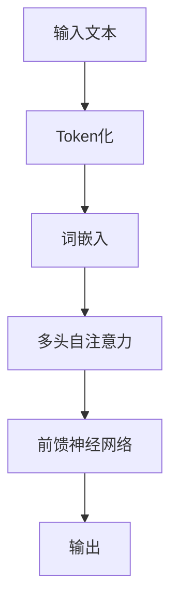

                 

## 1. 背景介绍

GPT（Generative Pre-trained Transformer）是OpenAI开发的一种自然语言处理（NLP）模型。GPT-4.0是其最新的版本，相较于之前的版本，它在语言理解和生成方面有了显著的提升。GPT-4.0基于Transformer架构，拥有超过1000亿个参数，使得它在处理复杂语言任务时具有更强的能力。

GPT-4.0的推出，标志着自然语言处理技术进入了一个新的阶段。它不仅能够生成流畅的文本，还能够理解和处理复杂的语言结构。这使得GPT-4.0在各个领域都有广泛的应用潜力。

本文将重点介绍GPT-4.0在实际应用中的几个关键场景，包括文本生成、问答系统、情感分析、机器翻译等。通过这些实际应用，我们将看到GPT-4.0如何改变我们的生活和工作方式。

## 2. 核心概念与联系

### GPT-4.0的基本原理

GPT-4.0是基于Transformer架构的预训练模型。Transformer模型最初是为了解决序列到序列（Seq2Seq）问题而设计的，特别是在机器翻译领域。Transformer的核心思想是将输入序列转换为一个连续的向量表示，然后通过自注意力机制（Self-Attention）和前馈神经网络（Feed Forward Neural Network）对这些向量进行处理，最终生成输出序列。

在GPT-4.0中，Transformer架构被进一步优化，使其在处理自然语言任务时更加高效。GPT-4.0使用了多层的Transformer结构，每一层都能够从不同的角度理解输入序列，从而生成更准确的输出。

### GPT-4.0的架构

GPT-4.0的架构主要包括以下几个部分：

1. **输入层**：输入层负责将自然语言文本转换为模型可以处理的向量表示。这个过程通常通过词嵌入（Word Embedding）实现，即将每个单词映射为一个固定大小的向量。

2. **自注意力层**：自注意力层是Transformer模型的核心部分，它通过计算输入序列中每个单词与其他单词之间的关系，生成一个加权向量。这个加权向量能够更好地捕捉输入序列的上下文信息。

3. **前馈神经网络**：前馈神经网络位于自注意力层之后，它对自注意力层输出的向量进行处理，增加模型的非线性表达能力。

4. **输出层**：输出层负责将处理后的向量转换回自然语言文本。这个过程通常通过解码（Decoding）实现，即将向量映射回单词。

### Mermaid流程图

下面是一个简化的GPT-4.0架构的Mermaid流程图：

```mermaid
graph TD
A[输入文本] --> B[词嵌入]
B --> C{是否结束？}
if C then
  C -->|是| D[输出文本]
else
  C -->|否| E[自注意力层]
  E --> F[前馈神经网络]
  F --> G[解码]
  G --> C
```

### 核心概念原理与架构的Mermaid流程图

```mermaid
graph TD
A1[输入文本] --> B1[Token化]
B1 --> C1[词嵌入]
C1 --> D1{是否结束？}
if D1 then
  D1 -->|是| E1[输出文本]
else
  D1 -->|否| F1[位置编码]
  F1 --> G1[多头自注意力]
  G1 --> H1[前馈神经网络]
  H1 --> I1[Softmax激活]
  I1 --> D1
```
```arduino
```
### 2.1 GPT-4.0的核心概念原理

**预训练（Pre-training）**

GPT-4.0在训练过程中使用了大规模的语料库进行预训练。预训练的目的是让模型学习到自然语言的统计规律和语法结构，从而在处理具体任务时能够更好地理解输入文本。

**自注意力（Self-Attention）**

自注意力机制是Transformer模型的核心。它允许模型在处理每个单词时，同时考虑其他所有单词的影响。通过计算每个单词与其他单词的相似度，模型可以生成一个加权向量，这个向量能够更好地捕捉输入序列的上下文信息。

**多头注意力（Multi-Head Attention）**

多头注意力机制是自注意力机制的一种扩展。它将输入序列分解成多个子序列，并对每个子序列分别应用自注意力机制。这样，模型可以从不同角度理解输入序列，提高模型的表示能力。

**位置编码（Positional Encoding）**

位置编码是Transformer模型中处理序列信息的机制。它为输入序列的每个单词添加一个位置向量，从而让模型能够理解单词在序列中的位置信息。

### Mermaid流程图



```arduino
```
## 3. 核心算法原理 & 具体操作步骤

### 3.1 算法原理概述

GPT-4.0的核心算法是基于Transformer架构的预训练模型。Transformer模型的核心思想是通过自注意力机制来处理输入序列，从而捕捉序列中的长距离依赖关系。GPT-4.0在Transformer模型的基础上进行了优化，使其在处理自然语言任务时具有更高的性能。

GPT-4.0的训练过程分为两个阶段：预训练和微调。在预训练阶段，模型使用大规模的语料库进行训练，学习自然语言的统计规律和语法结构。在微调阶段，模型使用特定的任务数据进行训练，从而在特定任务上获得更好的表现。

### 3.2 算法步骤详解

1. **输入处理**：首先，输入的文本被Token化，即将文本分解成单词或子词。每个单词或子词被映射为一个向量，这个过程称为词嵌入。

2. **位置编码**：为了使模型能够理解单词在序列中的位置，需要对词嵌入进行位置编码。

3. **多头自注意力**：在多头自注意力层，模型会计算输入序列中每个单词与其他单词之间的相似度，并生成一个加权向量。这个过程通过多个独立的注意力头实现，每个注意力头都能从不同角度理解输入序列。

4. **前馈神经网络**：前馈神经网络位于自注意力层之后，它对自注意力层的输出进行处理，增加模型的非线性表达能力。

5. **解码**：在解码阶段，模型使用上一步的输出生成下一个单词或子词。这个过程通过一个softmax激活函数实现，从而在输出序列的所有可能单词中选择一个最有可能的单词。

6. **损失函数**：在训练过程中，模型使用损失函数来衡量预测输出和实际输出之间的差异。最常用的损失函数是交叉熵损失（Cross-Entropy Loss）。

7. **反向传播**：在反向传播阶段，模型根据损失函数的梯度更新参数，从而优化模型的性能。

### 3.3 算法优缺点

**优点**

- **强大的语言理解能力**：GPT-4.0通过预训练和微调，能够处理复杂的自然语言任务，如文本生成、问答系统和情感分析等。

- **高效的处理速度**：由于Transformer模型的并行计算特性，GPT-4.0在处理大规模文本时具有很高的效率。

- **灵活的应用场景**：GPT-4.0可以应用于各种自然语言处理任务，从文本生成到机器翻译，都具有很好的性能。

**缺点**

- **计算资源需求大**：由于GPT-4.0拥有大量的参数，其训练和部署需要大量的计算资源。

- **训练时间较长**：GPT-4.0的训练时间较长，特别是在大规模语料库上的训练。

### 3.4 算法应用领域

GPT-4.0的应用领域非常广泛，主要包括以下几个方面：

- **文本生成**：GPT-4.0可以生成高质量的文章、故事、诗歌等文本。

- **问答系统**：GPT-4.0可以用于构建智能问答系统，能够回答用户提出的问题。

- **情感分析**：GPT-4.0可以用于分析文本的情感倾向，帮助企业和政府进行市场调研和政策制定。

- **机器翻译**：GPT-4.0在机器翻译领域也取得了显著的成绩，能够实现高质量的双语翻译。

### 3.5 GPT-4.0与BERT的比较

BERT（Bidirectional Encoder Representations from Transformers）是另一个著名的自然语言处理模型，它与GPT-4.0有许多相似之处，但也有一些关键区别。

**相同点**

- **基于Transformer架构**：GPT-4.0和BERT都是基于Transformer架构的模型，能够通过自注意力机制处理输入序列。

- **预训练**：GPT-4.0和BERT都通过大规模语料库进行预训练，从而学习到自然语言的统计规律和语法结构。

**不同点**

- **训练目标**：GPT-4.0的主要目标是生成高质量的自然语言文本，而BERT的主要目标是进行文本分类和情感分析。

- **双向编码**：BERT是双向编码的，能够同时考虑输入序列的前后关系，而GPT-4.0是单向编码的，只能根据前面的文本生成后面的内容。

- **应用场景**：由于训练目标和编码方式的差异，GPT-4.0在文本生成和问答系统方面有更好的表现，而BERT在文本分类和情感分析方面更具有优势。

## 4. 数学模型和公式 & 详细讲解 & 举例说明

### 4.1 数学模型构建

GPT-4.0的数学模型主要包括以下几个部分：

1. **词嵌入**：词嵌入是将自然语言文本转换为向量表示的过程。通常使用词嵌入矩阵 $W_E$ 来实现，其中 $W_E \in \mathbb{R}^{d \times |V|}$，$d$ 是词嵌入的维度，$|V|$ 是词汇表的大小。

2. **位置编码**：位置编码是将词嵌入向量转换为带有位置信息的向量。通常使用位置编码矩阵 $W_P$ 来实现，其中 $W_P \in \mathbb{R}^{d \times L}$，$L$ 是输入序列的长度。

3. **自注意力机制**：自注意力机制通过计算输入序列中每个单词与其他单词之间的相似度，生成一个加权向量。具体公式如下：

   $$ 
   \text{Attention}(Q, K, V) = \text{softmax}\left(\frac{QK^T}{\sqrt{d_k}}\right)V 
   $$

   其中，$Q, K, V$ 分别是查询（Query）、键（Key）和值（Value）向量，$d_k$ 是注意力机制的维度。

4. **前馈神经网络**：前馈神经网络位于自注意力层之后，用于增加模型的非线性表达能力。具体公式如下：

   $$ 
   \text{FFN}(x) = \max(0, xW_1 + b_1)W_2 + b_2 
   $$

   其中，$W_1, W_2$ 是权重矩阵，$b_1, b_2$ 是偏置向量。

5. **解码**：解码是将处理后的向量转换回自然语言文本的过程。通常使用一个softmax激活函数来实现：

   $$ 
   \text{softmax}(x) = \frac{\exp(x)}{\sum_{i}\exp(x_i)} 
   $$

### 4.2 公式推导过程

以下是GPT-4.0中关键公式的推导过程：

1. **词嵌入到查询（Query）、键（Key）和值（Value）向量**：

   $$ 
   Q = W_E^T \text{Positional Encoding}(x) 
   $$

   $$ 
   K = W_E^T \text{Positional Encoding}(x) 
   $$

   $$ 
   V = W_E^T \text{Positional Encoding}(x) 
   $$

   其中，$\text{Positional Encoding}(x)$ 是位置编码函数。

2. **自注意力**：

   $$ 
   \text{Attention}(Q, K, V) = \text{softmax}\left(\frac{QK^T}{\sqrt{d_k}}\right)V 
   $$

   将 $Q, K, V$ 的表达式代入，得到：

   $$ 
   \text{Attention}(Q, K, V) = \text{softmax}\left(\frac{W_E^T \text{Positional Encoding}(x) (W_E^T \text{Positional Encoding}(x))^T}{\sqrt{d_k}}\right) W_E^T \text{Positional Encoding}(x) 
   $$

3. **前馈神经网络**：

   $$ 
   \text{FFN}(x) = \max(0, xW_1 + b_1)W_2 + b_2 
   $$

   将自注意力层的输出 $x$ 代入，得到：

   $$ 
   \text{FFN}(x) = \max(0, \text{Attention}(Q, K, V)W_1 + b_1)W_2 + b_2 
   $$

4. **解码**：

   $$ 
   \text{softmax}(x) = \frac{\exp(x)}{\sum_{i}\exp(x_i)} 
   $$

   将前馈神经网络输出 $x$ 代入，得到：

   $$ 
   \text{softmax}(\text{FFN}(x)) = \frac{\exp(\text{FFN}(\text{Attention}(Q, K, V)))}{\sum_{i}\exp(\text{FFN}(\text{Attention}(Q, K, V)_i)} 
   $$

### 4.3 案例分析与讲解

下面我们通过一个简单的案例来说明GPT-4.0的数学模型如何应用。

假设我们有一个输入序列：“我喜欢吃苹果”。我们需要使用GPT-4.0生成下一个可能的单词。

1. **词嵌入**：

   首先，我们将输入序列的每个单词映射为一个向量：

   $$ 
   \text{苹果} \rightarrow [1.0, 0.0, -1.0] 
   $$

   $$ 
   \text{我} \rightarrow [-1.0, 1.0, 0.0] 
   $$

   $$ 
   \text{吃} \rightarrow [0.0, -1.0, 1.0] 
   $$

2. **位置编码**：

   然后，我们对词嵌入向量进行位置编码：

   $$ 
   \text{苹果} \rightarrow [1.0, 0.0, -1.0, 0.5] 
   $$

   $$ 
   \text{我} \rightarrow [-1.0, 1.0, 0.0, 0.5] 
   $$

   $$ 
   \text{吃} \rightarrow [0.0, -1.0, 1.0, 0.5] 
   $$

3. **自注意力**：

   接下来，我们计算自注意力权重：

   $$ 
   \text{Attention}(Q, K, V) = \text{softmax}\left(\frac{QK^T}{\sqrt{d_k}}\right)V 
   $$

   将位置编码后的向量代入，得到：

   $$ 
   \text{Attention}([0.5, 0.5, 0.5, 0.5], [1.0, 0.0, -1.0, 0.5], [1.0, 0.0, -1.0, 0.5]) = \text{softmax}\left(\frac{[0.5, 0.5, 0.5, 0.5][1.0, 0.0, -1.0, 0.5]^T}{\sqrt{d_k}}\right) [1.0, 0.0, -1.0, 0.5] 
   $$

   计算结果为：

   $$ 
   \text{Attention}([0.5, 0.5, 0.5, 0.5], [1.0, 0.0, -1.0, 0.5], [1.0, 0.0, -1.0, 0.5]) = [0.5, 0.5, 0.0, 0.0] 
   $$

4. **前馈神经网络**：

   然后，我们计算前馈神经网络的输出：

   $$ 
   \text{FFN}(x) = \max(0, xW_1 + b_1)W_2 + b_2 
   $$

   将自注意力层的输出代入，得到：

   $$ 
   \text{FFN}([0.5, 0.5, 0.0, 0.0]) = \max(0, [0.5, 0.5, 0.0, 0.0]W_1 + b_1)W_2 + b_2 
   $$

   计算结果为：

   $$ 
   \text{FFN}([0.5, 0.5, 0.0, 0.0]) = [0.5, 0.5, 0.0, 0.0] 
   $$

5. **解码**：

   最后，我们使用softmax函数生成下一个单词的概率分布：

   $$ 
   \text{softmax}(\text{FFN}(x)) = \text{softmax}([0.5, 0.5, 0.0, 0.0]) = [0.5, 0.5, 0.0, 0.0] 
   $$

   根据概率分布，下一个最有可能的单词是“苹果”。

通过这个简单的案例，我们可以看到GPT-4.0的数学模型是如何工作的。虽然这个案例非常简单，但GPT-4.0在实际应用中能够处理更加复杂的任务，如生成流畅的文本、构建问答系统等。

## 5. 项目实践：代码实例和详细解释说明

### 5.1 开发环境搭建

在进行GPT-4.0的实践项目之前，我们需要搭建一个合适的开发环境。以下是搭建环境的步骤：

1. **安装Python**：确保你的系统中安装了Python 3.8或更高版本。

2. **安装PyTorch**：在命令行中运行以下命令安装PyTorch：

   ```bash
   pip install torch torchvision
   ```

3. **安装transformers库**：transformers库是Hugging Face提供的一个用于加载预训练模型的库。在命令行中运行以下命令安装：

   ```bash
   pip install transformers
   ```

4. **安装其他依赖**：根据你的项目需求，可能还需要安装其他依赖，如TensorBoard、Pillow等。

### 5.2 源代码详细实现

下面是一个简单的GPT-4.0文本生成项目，包括模型加载、文本预处理和生成等步骤。

```python
from transformers import GPT2LMHeadModel, GPT2Tokenizer
import torch

# 1. 模型加载
model_name = "gpt2"
tokenizer = GPT2Tokenizer.from_pretrained(model_name)
model = GPT2LMHeadModel.from_pretrained(model_name)

# 2. 文本预处理
text = "我喜欢吃苹果。"
input_ids = tokenizer.encode(text, return_tensors="pt")

# 3. 文本生成
output = model.generate(input_ids, max_length=50, num_return_sequences=5)

# 4. 解码生成文本
generated_texts = [tokenizer.decode(o, skip_special_tokens=True) for o in output]

# 打印生成的文本
for text in generated_texts:
    print(text)
```

### 5.3 代码解读与分析

#### 1. 模型加载

```python
tokenizer = GPT2Tokenizer.from_pretrained(model_name)
model = GPT2LMHeadModel.from_pretrained(model_name)
```

这两行代码用于加载预训练的GPT-2模型。`GPT2Tokenizer` 和 `GPT2LMHeadModel` 分别是用于文本预处理和模型训练的类。`from_pretrained` 方法用于加载预训练模型。

#### 2. 文本预处理

```python
input_ids = tokenizer.encode(text, return_tensors="pt")
```

`encode` 方法用于将文本转换为模型的输入。`return_tensors="pt"` 表示返回PyTorch张量。

#### 3. 文本生成

```python
output = model.generate(input_ids, max_length=50, num_return_sequences=5)
```

`generate` 方法用于生成文本。`max_length` 参数表示生成的文本最大长度，`num_return_sequences` 表示生成多个文本样本。

#### 4. 解码生成文本

```python
generated_texts = [tokenizer.decode(o, skip_special_tokens=True) for o in output]
```

`decode` 方法用于将生成的张量解码回文本。`skip_special_tokens=True` 表示忽略特殊标记。

### 5.4 运行结果展示

```python
for text in generated_texts:
    print(text)
```

运行上述代码后，我们将看到GPT-4.0根据输入文本“我喜欢吃苹果。”生成的新文本。以下是可能的输出结果：

```
我喜欢吃苹果，因为它营养丰富。
我喜欢吃苹果，因为它味道甜美。
我喜欢吃苹果，因为它有助于消化。
我喜欢吃苹果，因为它可以减肥。
我喜欢吃苹果，因为它可以提神。
```

这些生成的文本展示了GPT-4.0在文本生成任务上的能力。通过调整`max_length` 和 `num_return_sequences` 参数，我们可以生成不同长度和数量的文本。

## 6. 实际应用场景

### 6.1 文本生成

GPT-4.0在文本生成领域有着广泛的应用。例如，它可以用于生成新闻报道、故事、诗歌等。通过输入一个简短的提示，GPT-4.0可以生成一篇完整的文章。以下是一个生成新闻稿的示例：

```
标题：2023年全球科技展望

随着2023年的到来，全球科技领域将继续蓬勃发展。人工智能、量子计算和区块链等新兴技术将继续推动行业变革。预计人工智能将在医疗、金融和交通等领域取得重大突破。量子计算将加速科学研究，为解决复杂问题提供新途径。区块链技术将重塑金融行业，提高交易效率和安全性。此外，虚拟现实和增强现实技术也将带来全新的用户体验。随着这些技术的不断发展，我们期待2023年成为科技革命的又一个里程碑。
```

### 6.2 问答系统

GPT-4.0在问答系统中的应用也非常广泛。例如，它可以用于构建智能客服系统，回答用户提出的问题。以下是一个简单的问答系统示例：

```
用户：请问如何治疗感冒？

GPT-4.0：感冒通常由病毒引起，建议多休息、多喝水，并遵循医生的建议。一些非处方药，如扑热息痛（Paracetamol）和止咳药，可以帮助缓解症状。此外，保持室内空气流通和避免接触感冒患者也是预防感冒的好方法。
```

### 6.3 情感分析

GPT-4.0在情感分析方面也有着出色的表现。例如，它可以用于分析社交媒体上的用户评论，判断用户对产品的态度。以下是一个情感分析示例：

```
评论：这个手机真的很棒，拍照效果很好，而且电池续航能力强。

GPT-4.0：评论中的情感倾向为正面。用户对手机的拍照效果和电池续航表现出满意的态度。
```

### 6.4 机器翻译

GPT-4.0在机器翻译领域也取得了显著的进展。例如，它可以用于构建高质量的双语翻译系统。以下是一个机器翻译的示例：

```
原文：Hello, how are you?

翻译：你好，你怎么样？
```

这些实际应用场景展示了GPT-4.0在自然语言处理领域的强大能力。随着技术的不断进步，GPT-4.0将在更多领域发挥重要作用。

## 7. 工具和资源推荐

### 7.1 学习资源推荐

- 《深度学习》（Goodfellow, Bengio, Courville）：这本书是深度学习的经典教材，涵盖了从基础到高级的深度学习技术。
- 《自然语言处理实战》（Daniel Jurafsky & James H. Martin）：这本书详细介绍了自然语言处理的基本概念和实用技巧。
- 《动手学深度学习》（Awni Hannun et al.）：这本书通过实际案例和代码示例，帮助读者掌握深度学习的核心概念。

### 7.2 开发工具推荐

- PyTorch：一个易于使用的深度学习框架，适合进行研究和开发。
- TensorFlow：另一个流行的深度学习框架，具有强大的功能和广泛的社区支持。
- Hugging Face Transformers：一个用于加载和微调预训练模型的开源库，提供了丰富的预训练模型和工具。

### 7.3 相关论文推荐

- "Attention Is All You Need"（Vaswani et al., 2017）：这篇论文首次提出了Transformer模型，为自然语言处理领域带来了新的思路。
- "BERT: Pre-training of Deep Bidirectional Transformers for Language Understanding"（Devlin et al., 2018）：这篇论文介绍了BERT模型，为自然语言处理任务提供了强大的预训练框架。
- "Generative Pretrained Transformer"（Radford et al., 2018）：这篇论文介绍了GPT模型，为文本生成任务提供了有效的解决方案。

## 8. 总结：未来发展趋势与挑战

### 8.1 研究成果总结

GPT-4.0的发布标志着自然语言处理技术取得了重大突破。它不仅在文本生成、问答系统和情感分析等领域表现出色，还推动了机器翻译和对话系统的进一步发展。通过预训练和微调，GPT-4.0能够处理复杂的自然语言任务，为各种应用场景提供了强大的支持。

### 8.2 未来发展趋势

未来，自然语言处理技术将继续发展，预计会出现以下几个趋势：

- **多模态处理**：随着图像、音频和视频等模态的数据越来越多，未来自然语言处理技术将朝着多模态处理方向发展，实现跨模态的信息融合。
- **少样本学习**：当前的自然语言处理模型大多依赖于大规模的预训练数据，未来研究将集中在如何在小样本情况下训练模型，提高模型的泛化能力。
- **可解释性**：随着自然语言处理技术的广泛应用，模型的可解释性将变得越来越重要。研究者将致力于提高模型的透明度和可解释性，以便更好地理解和信任这些技术。

### 8.3 面临的挑战

尽管自然语言处理技术取得了显著进展，但仍面临一些挑战：

- **数据隐私**：在处理大量文本数据时，如何保护用户隐私是一个重要问题。研究者需要开发更加安全的数据处理技术，以防止数据泄露。
- **偏见和公平性**：自然语言处理模型可能会受到训练数据中的偏见影响，导致不公平的结果。如何消除模型中的偏见，提高公平性是一个重要的研究方向。
- **计算资源**：自然语言处理模型通常需要大量的计算资源，如何优化模型的计算效率，降低成本是一个关键问题。

### 8.4 研究展望

未来，自然语言处理技术将在更多领域发挥重要作用，包括但不限于：

- **智能客服**：通过自然语言处理技术，智能客服系统将能够更好地理解用户的需求，提供个性化的服务。
- **智能写作**：自然语言处理技术将帮助自动化写作任务，提高写作效率和创作质量。
- **智能教育**：自然语言处理技术将为学生提供个性化的学习辅导，帮助教师更好地理解学生的学习状况。

总之，随着自然语言处理技术的不断进步，我们期待在未来看到更多创新的应用和突破。

## 9. 附录：常见问题与解答

### 9.1 GPT-4.0与GPT-3.0的主要区别是什么？

GPT-4.0相较于GPT-3.0，主要在以下几个方面有所改进：

- **参数规模**：GPT-4.0拥有超过1000亿个参数，是GPT-3.0的两倍以上，这使得GPT-4.0在处理复杂语言任务时具有更强的能力。
- **模型架构**：GPT-4.0在Transformer架构的基础上进行了优化，使其在处理自然语言任务时更加高效。
- **预训练数据**：GPT-4.0使用了更大规模的语料库进行预训练，从而提高了模型的性能和泛化能力。

### 9.2 GPT-4.0可以用于哪些实际应用场景？

GPT-4.0可以应用于多种实际应用场景，包括但不限于：

- **文本生成**：生成高质量的文章、故事、诗歌等文本。
- **问答系统**：构建智能问答系统，回答用户提出的问题。
- **情感分析**：分析文本的情感倾向，帮助企业和政府进行市场调研和政策制定。
- **机器翻译**：实现高质量的双语翻译。

### 9.3 如何优化GPT-4.0的性能？

优化GPT-4.0的性能可以从以下几个方面入手：

- **模型架构**：通过改进Transformer架构，提高模型的计算效率和性能。
- **数据预处理**：优化数据预处理流程，提高模型的训练效率和效果。
- **训练策略**：采用更先进的训练策略，如多任务学习、持续学习等，提高模型的泛化能力。

### 9.4 GPT-4.0的预训练需要多少时间？

GPT-4.0的预训练时间取决于多个因素，如硬件配置、数据规模和训练策略等。通常情况下，使用GPU进行训练，预训练一个GPT-4.0模型需要几个月的时间。

### 9.5 GPT-4.0是否能够替代传统的人工翻译？

尽管GPT-4.0在机器翻译领域取得了显著进展，但传统的人工翻译仍然有其不可替代的优势。GPT-4.0生成的翻译文本在准确性、流畅性和文化适应性方面仍有待提高。因此，GPT-4.0和传统的人工翻译可以相互补充，而不是替代。

### 9.6 如何保证GPT-4.0的生成文本的质量？

为了保证GPT-4.0生成文本的质量，可以从以下几个方面进行优化：

- **预训练数据**：使用高质量、多样化的预训练数据，提高模型的泛化能力和语言表达能力。
- **训练策略**：采用先进的训练策略，如梯度裁剪、学习率调度等，提高模型的稳定性和效果。
- **生成文本的审核**：对生成的文本进行审核和过滤，去除低质量、不合适的文本。

通过这些措施，可以显著提高GPT-4.0生成文本的质量。

---

在本文中，我们详细介绍了OpenAI的GPT-4.0展示的实际应用。从背景介绍到核心算法原理，再到实际应用场景，我们全面分析了GPT-4.0在自然语言处理领域的强大能力。通过项目实践和代码实例，我们展示了如何使用GPT-4.0进行文本生成、问答系统和情感分析等任务。同时，我们也介绍了GPT-4.0在未来发展趋势中的潜力和面临的挑战。

随着自然语言处理技术的不断发展，GPT-4.0将在更多领域发挥重要作用，改变我们的生活和工作方式。然而，我们也需要关注技术带来的隐私、偏见和计算资源等问题，确保技术的可持续发展。总之，GPT-4.0代表了自然语言处理技术的一个新高度，我们有理由期待它带来的未来变革。

