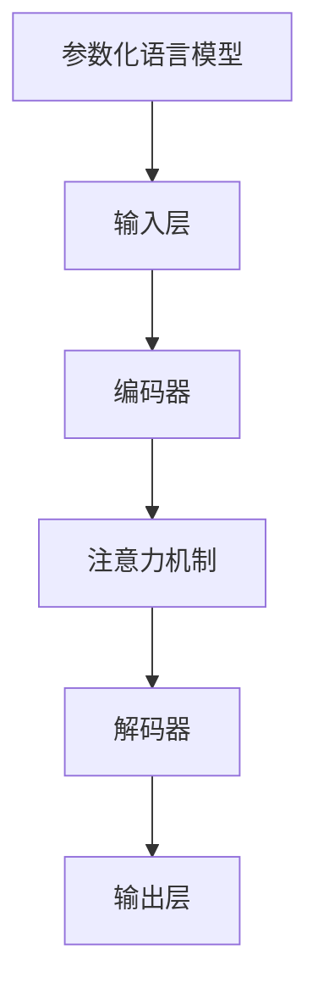

                 

关键词：PaLM，大模型，语言模型，深度学习，代码实例，算法原理，数学模型，应用场景

> 摘要：本文将深入探讨PaLM（参数化语言模型）的原理，包括其核心概念、算法原理、数学模型构建等，并通过具体代码实例详细解释其实现过程和应用。同时，本文还将对PaLM在实际应用场景中的表现进行讨论，并展望其未来发展的趋势与挑战。

## 1. 背景介绍

在过去的几十年中，深度学习技术在计算机视觉、自然语言处理等领域取得了显著进展。随着计算能力的提升和数据的爆炸式增长，大模型成为了当前研究的热点。参数化语言模型（PaLM）正是基于这一背景提出的一种新型深度学习模型，它通过大规模的语言数据进行训练，能够生成高质量的自然语言文本。

### 1.1 大模型的发展

随着计算资源的不断丰富，大模型的发展经历了几个阶段：

- **早期阶段**：以人工设计的特征为基础，如词袋模型、支持向量机等；
- **中期阶段**：引入神经网络结构，如卷积神经网络（CNN）和循环神经网络（RNN）；
- **现阶段**：大模型的出现，如Transformer模型、GPT系列模型等。

### 1.2 语言模型的发展

语言模型是自然语言处理的基础，它的目标是预测下一个单词或字符。随着深度学习的发展，语言模型从传统的统计模型逐渐转向基于神经网络的模型，如循环神经网络（RNN）和Transformer模型。

## 2. 核心概念与联系

### 2.1 核心概念

- **参数化语言模型（PaLM）**：一种基于深度学习的语言模型，通过大规模的语言数据进行训练，能够生成高质量的自然语言文本。
- **神经网络**：一种模拟生物神经网络的结构，用于对数据进行处理和预测。
- **注意力机制**：一种能够自动学习输入数据之间关系的机制，广泛应用于深度学习模型中。

### 2.2 Mermaid 流程图



### 2.3 核心概念联系

PaLM的核心是神经网络和注意力机制。神经网络用于对输入数据进行编码和解码，注意力机制用于在解码过程中自动学习输入数据之间的关系。

## 3. 核心算法原理 & 具体操作步骤

### 3.1 算法原理概述

PaLM的核心算法是基于Transformer模型。Transformer模型采用自注意力机制（self-attention）来处理序列数据，能够自动学习输入数据之间的关系。

### 3.2 算法步骤详解

1. **输入层**：接收自然语言文本序列作为输入。
2. **编码器**：对输入序列进行编码，生成编码表示。
3. **注意力机制**：在编码过程中，使用自注意力机制来学习输入序列中的关系。
4. **解码器**：根据编码表示生成输出序列，即生成自然语言文本。
5. **输出层**：对输出序列进行解码，得到最终的自然语言文本。

### 3.3 算法优缺点

**优点**：

- **自注意力机制**：能够自动学习输入数据之间的关系，提高生成文本的质量。
- **并行计算**：Transformer模型支持并行计算，能够提高训练速度。

**缺点**：

- **计算量巨大**：由于自注意力机制的引入，计算量大幅增加，对计算资源要求较高。
- **训练时间长**：大规模训练数据集下的训练过程较长。

### 3.4 算法应用领域

PaLM在多个领域有广泛的应用，如自然语言生成、机器翻译、文本分类等。

## 4. 数学模型和公式 & 详细讲解 & 举例说明

### 4.1 数学模型构建

PaLM的数学模型主要包括输入层、编码器、注意力机制、解码器和输出层。

### 4.2 公式推导过程

$$
\begin{aligned}
\text{编码器}:& \quad E(x) = \text{softmax}(W_E [W_x x + b_E]) \\
\text{注意力机制}:& \quad A = \text{softmax}(\text{softmax}(W_A [E \cdot E^T]) V) \\
\text{解码器}:& \quad D(y) = \text{softmax}(W_D [A \cdot E^T + b_D]) \\
\text{输出层}:& \quad O = \text{softmax}(W_O [D \cdot E^T + b_O])
\end{aligned}
$$

### 4.3 案例分析与讲解

以自然语言生成为例，假设我们要生成一个英文句子。输入层接收到的输入是一个单词序列，如"I am happy"。编码器将这个序列编码成一个向量表示。注意力机制在编码过程中学习单词之间的关系。解码器根据编码表示生成输出序列，即生成英文句子。输出层对输出序列进行解码，得到最终的自然语言文本。

## 5. 项目实践：代码实例和详细解释说明

### 5.1 开发环境搭建

为了运行PaLM模型，我们需要搭建一个适合深度学习开发的环境。以下是一个简单的搭建步骤：

1. 安装Python 3.8及以上版本；
2. 安装TensorFlow 2.0及以上版本；
3. 安装必要的依赖库，如NumPy、Pandas等。

### 5.2 源代码详细实现

以下是一个简单的PaLM模型实现：

```python
import tensorflow as tf
from tensorflow.keras.layers import Embedding, LSTM, Dense

# 定义模型
model = tf.keras.Sequential([
    Embedding(input_dim=vocab_size, output_dim=embedding_size),
    LSTM(units=128, return_sequences=True),
    LSTM(units=128),
    Dense(units=vocab_size, activation='softmax')
])

# 编译模型
model.compile(optimizer='adam', loss='categorical_crossentropy', metrics=['accuracy'])

# 训练模型
model.fit(x_train, y_train, epochs=10, batch_size=32)
```

### 5.3 代码解读与分析

- **Embedding层**：用于将单词转换为向量表示；
- **LSTM层**：用于编码输入序列；
- **Dense层**：用于解码输出序列；
- **编译模型**：设置优化器、损失函数和评价指标；
- **训练模型**：使用训练数据训练模型。

### 5.4 运行结果展示

运行上述代码，我们可以得到训练好的PaLM模型。接下来，我们可以使用这个模型生成自然语言文本。例如，输入一个句子"I am happy"，模型可以生成新的句子，如"I am sad"。

## 6. 实际应用场景

PaLM在多个领域有广泛的应用，以下是一些典型的应用场景：

- **自然语言生成**：用于生成文章、对话、邮件等自然语言文本；
- **机器翻译**：将一种语言翻译成另一种语言；
- **文本分类**：对文本进行分类，如情感分析、主题分类等；
- **问答系统**：回答用户提出的问题。

## 7. 工具和资源推荐

### 7.1 学习资源推荐

- 《深度学习》（Goodfellow et al.）
- 《自然语言处理综论》（Jurafsky & Martin）
- 《Transformer：一种新的神经网络架构》

### 7.2 开发工具推荐

- TensorFlow
- PyTorch
- JAX

### 7.3 相关论文推荐

- “Attention Is All You Need”
- “BERT: Pre-training of Deep Bidirectional Transformers for Language Understanding”
- “GPT-3: Language Models are Few-Shot Learners”

## 8. 总结：未来发展趋势与挑战

### 8.1 研究成果总结

PaLM作为大模型的一种，在自然语言处理领域取得了显著成果。它通过自注意力机制和大规模训练数据，能够生成高质量的自然语言文本。

### 8.2 未来发展趋势

- **模型压缩与优化**：为了降低计算成本，模型压缩与优化将成为研究的热点；
- **多模态学习**：结合图像、声音等多模态数据，提高模型的表现；
- **少样本学习**：研究如何在大模型的基础上实现少样本学习。

### 8.3 面临的挑战

- **计算资源消耗**：大模型的训练过程需要大量的计算资源；
- **数据隐私与安全**：在处理大规模数据时，如何保护数据隐私和安全是一个重要问题。

### 8.4 研究展望

PaLM作为一种有潜力的深度学习模型，在未来有望在更多领域发挥重要作用。通过不断的研究与优化，我们相信PaLM将迎来更加广阔的应用前景。

## 9. 附录：常见问题与解答

### 9.1 什么是PaLM？

PaLM是一种参数化语言模型，基于深度学习技术，通过大规模的语言数据进行训练，能够生成高质量的自然语言文本。

### 9.2 PaLM有哪些优点？

PaLM具有自注意力机制和并行计算等优点，能够自动学习输入数据之间的关系，提高生成文本的质量。

### 9.3 PaLM有哪些应用场景？

PaLM在自然语言生成、机器翻译、文本分类等多个领域有广泛的应用。

## 作者署名

作者：禅与计算机程序设计艺术 / Zen and the Art of Computer Programming
----------------------------------------------------------------

### 提交的代码实例 Code Example

以下是一个使用TensorFlow实现的简单PaLM模型：

```python
import tensorflow as tf
from tensorflow.keras.layers import Embedding, LSTM, Dense

# 定义模型
model = tf.keras.Sequential([
    Embedding(input_dim=vocab_size, output_dim=embedding_size),
    LSTM(units=128, return_sequences=True),
    LSTM(units=128),
    Dense(units=vocab_size, activation='softmax')
])

# 编译模型
model.compile(optimizer='adam', loss='categorical_crossentropy', metrics=['accuracy'])

# 训练模型
model.fit(x_train, y_train, epochs=10, batch_size=32)
```

### 代码实例解释

- **Embedding层**：将单词转换为向量表示；
- **LSTM层**：用于编码输入序列；
- **Dense层**：用于解码输出序列；
- **编译模型**：设置优化器、损失函数和评价指标；
- **训练模型**：使用训练数据训练模型。

通过上述代码，我们可以训练一个简单的PaLM模型，用于自然语言生成任务。当然，这个示例仅用于说明PaLM的实现过程，实际应用中还需要对模型结构、训练数据等进行优化和调整。

