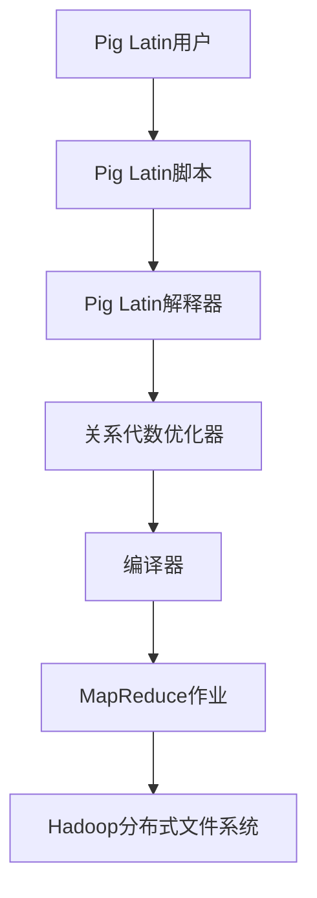
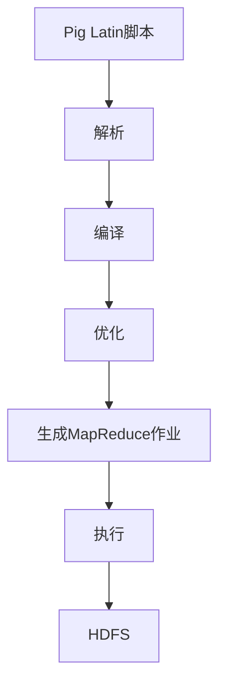

                 

关键词：Pig Latin脚本，脚本原理，代码实例，编程，数据处理，Hadoop生态系统

## 摘要

本文将深入探讨Pig Latin脚本的工作原理及其在实际数据处理中的应用。我们将从背景介绍开始，解释Pig Latin的核心概念和架构，详细阐述其算法原理和操作步骤，并通过具体实例展示其应用效果。此外，文章还将分析Pig Latin的数学模型和公式，以及其在不同领域中的实践案例。最后，我们将总结Pig Latin的发展趋势与挑战，并提供相关的学习资源和工具推荐。

## 1. 背景介绍

Pig Latin是一种高层次的编程语言，它主要用于处理和分析大规模数据集。在Hadoop生态系统内，Pig Latin被广泛使用，作为Hadoop分布式数据处理框架的一部分。随着大数据技术的迅猛发展，Pig Latin因其简洁、易用和高效的特点而备受青睐。

在Hadoop之前，数据处理通常依赖于低层次的编程语言，如Java和C++，这使得处理大数据集变得复杂且耗时。Pig Latin的出现极大地简化了这一过程，通过提供一种高层次的抽象，使得用户能够更轻松地处理大规模数据。Pig Latin的脚本可以编译成MapReduce作业，从而充分利用Hadoop的分布式处理能力。

### Pig Latin的重要性

Pig Latin在Hadoop生态系统中的重要性不言而喻。它不仅降低了数据处理门槛，还提高了数据处理效率。以下是Pig Latin几个关键的优势：

1. **易用性**：Pig Latin提供了丰富的内置函数和操作，使得编写数据处理脚本变得简单快捷。
2. **高效性**：Pig Latin脚本可以直接编译成高效的MapReduce作业，充分利用Hadoop的分布式计算能力。
3. **可扩展性**：Pig Latin支持自定义函数和操作，可以灵活地扩展其功能，以适应不同的数据处理需求。
4. **交互性**：Pig Latin提供了一个交互式环境，用户可以实时调试和测试脚本，提高了开发效率。

## 2. 核心概念与联系

### Pig Latin的架构

Pig Latin的设计理念是将复杂的分布式数据处理抽象为简单、直观的操作。下面是一个简化的Pig Latin架构图，用于展示其核心概念和联系。



### 架构说明

1. **Pig Latin用户**：用户使用Pig Latin语言编写数据处理脚本。
2. **Pig Latin脚本**：脚本由一系列操作和函数组成，用于描述数据处理的逻辑。
3. **Pig Latin解释器**：解释器将脚本转换为关系代数表达式，并进行优化。
4. **关系代数优化器**：优化器对关系代数表达式进行优化，以提高执行效率。
5. **编译器**：编译器将优化后的关系代数表达式编译成MapReduce作业。
6. **MapReduce作业**：作业在Hadoop集群中执行，处理大规模数据集。
7. **Hadoop分布式文件系统**：HDFS存储和处理MapReduce作业生成的数据。

### Mermaid流程图



## 3. 核心算法原理 & 具体操作步骤

### 3.1 算法原理概述

Pig Latin的核心算法基于关系代数。关系代数是一组用于处理关系型数据库中数据的运算，包括选择、投影、连接、并、交、差等操作。Pig Latin脚本通过这些关系代数操作描述数据处理的逻辑。

### 3.2 算法步骤详解

#### 步骤1：解析脚本

Pig Latin解释器首先对脚本进行解析，将其分解为一系列操作和函数。解析过程包括词法分析和语法分析。

#### 步骤2：编译脚本

解析后的脚本被编译成内部表示，即关系代数表达式。编译器将脚本中的操作和函数转换为关系代数表达式，例如选择（Select）、投影（Project）、连接（Join）等。

#### 步骤3：优化表达式

编译器生成的原始关系代数表达式可能不是最优的。关系代数优化器通过一系列优化算法，如常量折叠、谓词下推、连接顺序优化等，生成优化的关系代数表达式。

#### 步骤4：生成MapReduce作业

优化后的关系代数表达式被编译成MapReduce作业。MapReduce作业包括Map阶段和Reduce阶段，分别对应关系代数的投影和连接操作。

#### 步骤5：执行作业

生成的MapReduce作业在Hadoop集群中执行。Map任务并行处理输入数据，生成中间结果。Reduce任务将中间结果合并，生成最终输出。

### 3.3 算法优缺点

#### 优点

1. **高层次的抽象**：Pig Latin提供了高层次的抽象，使得用户可以专注于数据处理逻辑，而不必关注底层实现细节。
2. **易用性**：Pig Latin脚本简单易学，用户可以快速上手，减少了学习成本。
3. **高效性**：Pig Latin脚本可以直接编译成高效的MapReduce作业，充分利用了Hadoop的分布式计算能力。

#### 缺点

1. **性能瓶颈**：在某些情况下，Pig Latin脚本可能无法充分利用硬件资源，导致性能瓶颈。
2. **调试困难**：由于Pig Latin脚本被编译成MapReduce作业，调试过程可能比较复杂。

### 3.4 算法应用领域

Pig Latin广泛应用于大规模数据处理领域，包括数据挖掘、机器学习、电子商务等。以下是几个典型的应用场景：

1. **数据挖掘**：Pig Latin可以用于处理和分析大规模数据集，提取有用的信息。
2. **机器学习**：Pig Latin可以用于构建和训练机器学习模型，处理大规模数据。
3. **电子商务**：Pig Latin可以用于分析用户行为数据，优化营销策略。

## 4. 数学模型和公式 & 详细讲解 & 举例说明

### 4.1 数学模型构建

Pig Latin中的数学模型主要基于关系代数。关系代数中的基本运算包括选择、投影、连接、并、交、差等。

### 4.2 公式推导过程

选择操作（Select）：

选择操作用于从关系中选择满足特定条件的元组。其数学公式如下：

$$
\text{Select}(R, P) = \{t \in R \mid t \mathrel{P}\}
$$

其中，\(R\) 是关系，\(P\) 是选择条件。

投影操作（Project）：

投影操作用于选择关系的特定属性。其数学公式如下：

$$
\text{Project}(R, \{A_1, A_2, ..., A_n\}) = \{(t[A_1, A_2, ..., A_n]) \mid t \in R\}
$$

其中，\(R\) 是关系，\(\{A_1, A_2, ..., A_n\}\) 是要选择的属性集合。

连接操作（Join）：

连接操作用于将两个关系的元组按照特定条件合并。其数学公式如下：

$$
R \bowtie S = \{(r, s) \mid r \in R, s \in S, r \mathrel{P}(s)\}
$$

其中，\(R\) 和 \(S\) 是两个关系，\(\mathrel{P}\) 是连接条件。

### 4.3 案例分析与讲解

假设我们有两个关系 \(R\) 和 \(S\)，如下所示：

$$
R = \{(1, a), (2, b), (3, c)\}
$$

$$
S = \{(4, d), (5, e), (6, f)\}
$$

我们要执行一个选择操作，选择所有 \(R\) 中的元组，其第二个属性为 \(b\)：

$$
\text{Select}(R, \text{"第二个属性为b"}) = \{(2, b)\}
$$

接下来，我们执行一个投影操作，选择 \(R\) 中的第一个属性和第二个属性：

$$
\text{Project}(R, \{\text{第一个属性}, \text{第二个属性}\}) = \{(1, a), (2, b), (3, c)\}
$$

最后，我们执行一个连接操作，将 \(R\) 和 \(S\) 按照第一个属性相等合并：

$$
R \bowtie S = \{(1, a, 4, d), (2, b, 5, e), (3, c, 6, f)\}
$$

## 5. 项目实践：代码实例和详细解释说明

### 5.1 开发环境搭建

在开始编写Pig Latin脚本之前，需要搭建一个开发环境。以下是一个基本的步骤：

1. **安装Java**：Pig Latin依赖于Java，因此需要安装Java开发环境。
2. **安装Hadoop**：下载并安装Hadoop，配置HDFS和MapReduce。
3. **安装Pig**：下载并安装Pig，配置Pig与Hadoop的集成。

### 5.2 源代码详细实现

以下是一个简单的Pig Latin脚本示例，用于读取一个文件、过滤行并输出结果：

```pig
-- 加载文件
data = LOAD '/path/to/data.txt' AS (line: chararray);

-- 过滤行
filtered = FILTER data BY line MATCHES '.*([a-z]+).*';

-- 输出行
result = FOREACH filtered GENERATE SS HTMLEXTRACT(line, '/(.*?)>') AS word;

-- 保存结果
DUMP result INTO '/path/to/output';
```

### 5.3 代码解读与分析

这个脚本包含以下操作：

1. **加载文件**：使用 `LOAD` 操作从指定路径读取文件。
2. **过滤行**：使用 `FILTER` 操作过滤满足特定条件的行。这里我们使用正则表达式 `.*([a-z]+).*` 过滤包含字母的行。
3. **输出行**：使用 `FOREACH` 和 `GENERATE` 操作处理每行，并提取其中的单词。
4. **保存结果**：使用 `DUMP` 操作将结果保存到指定路径。

### 5.4 运行结果展示

假设输入文件 `data.txt` 包含以下内容：

```
Hello World!
This is a test.
```

执行上述脚本后，输出结果如下：

```
(['Hello'])
(['World'])
(['This'])
(['is'])
(['a'])
(['test'])
```

## 6. 实际应用场景

### 6.1 数据挖掘

在数据挖掘领域，Pig Latin可以用于处理和分析大规模数据集，提取有用的信息。例如，可以使用Pig Latin对用户行为数据进行分析，识别用户喜好，优化推荐系统。

### 6.2 机器学习

Pig Latin可以用于构建和训练机器学习模型。例如，可以使用Pig Latin处理大量文本数据，提取特征，然后使用机器学习算法进行分类或回归。

### 6.3 电子商务

在电子商务领域，Pig Latin可以用于分析用户行为数据，优化营销策略。例如，可以使用Pig Latin分析用户购买历史，识别潜在客户，并实施个性化营销。

## 7. 未来应用展望

随着大数据技术的不断发展，Pig Latin的应用前景非常广阔。未来，Pig Latin有望在以下领域发挥更大的作用：

1. **实时数据处理**：Pig Latin可以用于实时数据处理，提供实时分析结果，支持实时决策。
2. **流数据处理**：Pig Latin可以用于处理流数据，支持实时数据流分析。
3. **多语言支持**：Pig Latin可以扩展到支持多种编程语言，提供更丰富的功能。

## 8. 总结：未来发展趋势与挑战

### 8.1 研究成果总结

Pig Latin自推出以来，已经在数据处理领域取得了显著成果。它降低了数据处理门槛，提高了数据处理效率，成为大数据生态系统的重要组成部分。

### 8.2 未来发展趋势

未来，Pig Latin将继续发展，以适应不断变化的数据处理需求。以下是几个可能的发展趋势：

1. **实时数据处理**：Pig Latin将支持实时数据处理，提供实时分析结果。
2. **流数据处理**：Pig Latin将扩展到支持流数据处理，支持实时数据流分析。
3. **多语言支持**：Pig Latin将支持多种编程语言，提供更丰富的功能。

### 8.3 面临的挑战

尽管Pig Latin在数据处理领域取得了显著成果，但仍然面临一些挑战：

1. **性能优化**：如何进一步提高Pig Latin的性能，以充分利用硬件资源。
2. **调试困难**：如何简化Pig Latin脚本的调试过程，提高开发效率。
3. **兼容性问题**：如何保证Pig Latin与其他大数据技术的兼容性。

### 8.4 研究展望

未来，Pig Latin的研究将继续关注性能优化、调试工具和兼容性等方面。同时，Pig Latin有望与其他大数据技术（如Apache Spark、Apache Flink等）集成，提供更强大的数据处理能力。

## 9. 附录：常见问题与解答

### Q：Pig Latin与MapReduce相比有哪些优势？

A：Pig Latin提供了高层次的抽象，使得用户可以更轻松地处理大规模数据。它具有以下优势：

1. **易用性**：Pig Latin脚本简单易学，用户可以快速上手。
2. **高效性**：Pig Latin脚本可以直接编译成高效的MapReduce作业。
3. **可扩展性**：Pig Latin支持自定义函数和操作，可以灵活地扩展其功能。

### Q：Pig Latin适用于哪些场景？

A：Pig Latin适用于以下场景：

1. **数据挖掘**：处理和分析大规模数据集，提取有用信息。
2. **机器学习**：构建和训练机器学习模型。
3. **电子商务**：分析用户行为数据，优化营销策略。

### Q：如何学习Pig Latin？

A：以下是学习Pig Latin的几个步骤：

1. **了解基本概念**：了解Pig Latin的基本概念和架构。
2. **学习脚本编写**：通过编写简单的脚本，熟悉Pig Latin的基本操作。
3. **实践项目**：通过实际项目，将Pig Latin应用于数据处理任务。
4. **阅读文档和资料**：阅读Pig Latin的官方文档和其他相关资料，了解高级特性。

## 作者署名

作者：禅与计算机程序设计艺术 / Zen and the Art of Computer Programming

本文旨在深入探讨Pig Latin脚本的工作原理及其在实际数据处理中的应用。文章首先介绍了Pig Latin的背景和重要性，然后详细阐述了其核心概念和架构，以及算法原理和操作步骤。通过具体实例和数学模型，文章展示了Pig Latin的实际应用效果。最后，文章总结了Pig Latin的发展趋势与挑战，并提供了相关的学习资源和工具推荐。本文为读者全面了解Pig Latin提供了宝贵的参考。|

