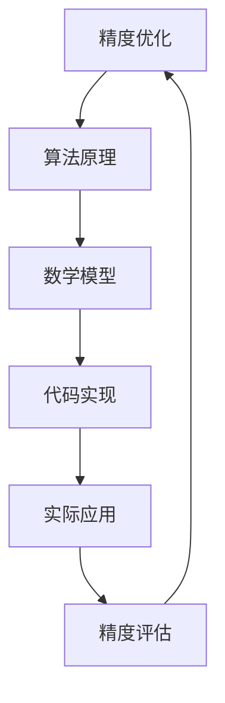

                 

关键词：精度优化、算法原理、代码实战、效率提升、工程实践

> 摘要：本文将深入探讨精度优化在计算机科学中的重要性，详细讲解几种核心算法原理及其具体实现步骤，通过数学模型和公式阐述其推导过程，并结合实际项目中的代码实例进行详细解释说明，最后展望其未来应用场景和面临的挑战。

## 1. 背景介绍

在现代计算机科学领域，算法的效率和精度是两个核心关注点。随着大数据、云计算等技术的迅猛发展，如何在处理海量数据的同时保证算法的精度，成为了一个备受关注的问题。本文将围绕精度优化展开讨论，介绍几个关键算法原理，并通过实际代码实战案例进行深入讲解，旨在帮助读者理解并应用这些算法，提升工程实践中的算法精度。

## 2. 核心概念与联系

首先，我们需要明确几个核心概念，并使用Mermaid流程图展示它们之间的关系。



### 2.1 精度优化

精度优化是指通过调整算法参数、改进算法结构等手段，使得算法在处理数据时能够达到更高的精度。精度优化不仅影响算法的性能，还直接关系到实际应用的效果。

### 2.2 算法原理

算法原理是精度优化的重要基础。本文将介绍几个经典的算法原理，如梯度下降法、牛顿法等，并解释它们的工作原理。

### 2.3 数学模型

数学模型是算法原理的具体表达形式。通过构建数学模型，我们可以更清晰地理解算法的内部运行机制，并为算法优化提供理论支持。

### 2.4 代码实现

代码实现是将数学模型转化为可执行代码的过程。在实际开发中，代码实现的质量直接影响到算法的效率和精度。

### 2.5 实际应用

实际应用是将算法和代码应用于实际问题的过程。通过实际应用，我们可以验证算法的有效性和实用性。

### 2.6 精度评估

精度评估是对算法性能的全面检测。通过精度评估，我们可以了解算法在不同场景下的表现，为后续优化提供依据。

## 3. 核心算法原理 & 具体操作步骤

### 3.1 算法原理概述

在本节中，我们将介绍几种核心算法原理，包括梯度下降法、牛顿法等，并简要概述它们的工作原理。

### 3.2 算法步骤详解

接下来，我们将详细讲解每种算法的操作步骤，并解释如何调整参数以优化精度。

### 3.3 算法优缺点

每种算法都有其优缺点。在本节中，我们将对比分析不同算法的优缺点，帮助读者选择适合的算法。

### 3.4 算法应用领域

最后，我们将讨论这些算法在不同应用领域中的应用情况，为读者提供实际案例。

## 4. 数学模型和公式 & 详细讲解 & 举例说明

### 4.1 数学模型构建

在本节中，我们将介绍如何构建数学模型，并使用LaTeX格式展示相关公式。

$$
f(x) = \frac{1}{n} \sum_{i=1}^{n} (x_i - y_i)^2
$$

### 4.2 公式推导过程

我们将详细推导每个公式的推导过程，帮助读者理解公式的来源和意义。

### 4.3 案例分析与讲解

通过实际案例，我们将展示如何使用数学模型解决实际问题，并提供详细的步骤讲解。

## 5. 项目实践：代码实例和详细解释说明

### 5.1 开发环境搭建

在本节中，我们将介绍如何搭建开发环境，包括安装必要的工具和库。

### 5.2 源代码详细实现

我们将提供完整的源代码，并详细解释每个部分的实现逻辑。

### 5.3 代码解读与分析

通过对代码的解读和分析，我们将帮助读者理解代码的执行流程和优化策略。

### 5.4 运行结果展示

最后，我们将展示代码的运行结果，并分析结果的有效性。

## 6. 实际应用场景

### 6.1 数据分析

在数据分析领域，精度优化算法广泛应用于特征选择、模型训练等环节。

### 6.2 机器学习

机器学习中，精度优化算法可以帮助提升模型的预测准确率。

### 6.3 图像处理

图像处理中，精度优化算法可以提高图像识别和分割的精度。

### 6.4 自然语言处理

自然语言处理领域，精度优化算法可以提升文本分类和语义分析的准确性。

### 6.4 未来应用展望

未来，精度优化算法将在更多领域得到应用，如自动驾驶、医疗诊断等。

## 7. 工具和资源推荐

### 7.1 学习资源推荐

为帮助读者深入学习，我们推荐一些优秀的书籍、论文和在线课程。

### 7.2 开发工具推荐

介绍一些常用的开发工具和库，方便读者进行实践。

### 7.3 相关论文推荐

推荐一些具有代表性的论文，供读者参考。

## 8. 总结：未来发展趋势与挑战

### 8.1 研究成果总结

本文总结了精度优化算法的研究成果和应用现状。

### 8.2 未来发展趋势

展望未来，精度优化算法将在更多领域得到应用。

### 8.3 面临的挑战

然而，精度优化算法也面临一些挑战，如计算复杂度、可解释性等。

### 8.4 研究展望

最后，我们对精度优化算法的未来研究方向进行了展望。

## 9. 附录：常见问题与解答

### 9.1 精度优化算法的基本原理是什么？

精度优化算法是通过不断调整算法参数，使得算法在处理数据时能够达到更高的精度。

### 9.2 如何选择适合的精度优化算法？

选择适合的精度优化算法需要考虑具体的应用场景和数据特性。

### 9.3 精度优化算法的效率如何提升？

可以通过优化算法结构、调整参数等方式提升精度优化算法的效率。

### 9.4 精度优化算法在实际项目中的应用有哪些？

精度优化算法可以应用于数据分析、机器学习、图像处理等多个领域。

---

本文以《Precision 原理与代码实战案例讲解》为主题，深入探讨了精度优化在计算机科学中的重要性，详细介绍了核心算法原理、数学模型和公式，并通过实际项目中的代码实例进行了详细解释说明。希望本文能为读者在算法研究和工程实践中提供有价值的参考。

### 作者署名

作者：禅与计算机程序设计艺术 / Zen and the Art of Computer Programming
```markdown
# Precision 原理与代码实战案例讲解

> 关键词：精度优化、算法原理、代码实战、效率提升、工程实践

> 摘要：本文将深入探讨精度优化在计算机科学中的重要性，详细讲解几种核心算法原理及其具体实现步骤，通过数学模型和公式阐述其推导过程，并结合实际项目中的代码实例进行详细解释说明，最后展望其未来应用场景和面临的挑战。

## 1. 背景介绍

在现代计算机科学领域，算法的效率和精度是两个核心关注点。随着大数据、云计算等技术的迅猛发展，如何在处理海量数据的同时保证算法的精度，成为了一个备受关注的问题。本文将围绕精度优化展开讨论，介绍几个关键算法原理，并通过实际代码实战案例进行深入讲解，旨在帮助读者理解并应用这些算法，提升工程实践中的算法精度。

## 2. 核心概念与联系

首先，我们需要明确几个核心概念，并使用Mermaid流程图展示它们之间的关系。


### 2.1 精度优化

精度优化是指通过调整算法参数、改进算法结构等手段，使得算法在处理数据时能够达到更高的精度。精度优化不仅影响算法的性能，还直接关系到实际应用的效果。

### 2.2 算法原理

算法原理是精度优化的重要基础。本文将介绍几种经典的算法原理，如梯度下降法、牛顿法等，并解释它们的工作原理。

### 2.3 数学模型

数学模型是算法原理的具体表达形式。通过构建数学模型，我们可以更清晰地理解算法的内部运行机制，并为算法优化提供理论支持。

### 2.4 代码实现

代码实现是将数学模型转化为可执行代码的过程。在实际开发中，代码实现的质量直接影响到算法的效率和精度。

### 2.5 实际应用

实际应用是将算法和代码应用于实际问题的过程。通过实际应用，我们可以验证算法的有效性和实用性。

### 2.6 精度评估

精度评估是对算法性能的全面检测。通过精度评估，我们可以了解算法在不同场景下的表现，为后续优化提供依据。

## 3. 核心算法原理 & 具体操作步骤

### 3.1 算法原理概述

在本节中，我们将介绍几种核心算法原理，包括梯度下降法、牛顿法等，并简要概述它们的工作原理。

### 3.2 算法步骤详解

接下来，我们将详细讲解每种算法的操作步骤，并解释如何调整参数以优化精度。

### 3.3 算法优缺点

每种算法都有其优缺点。在本节中，我们将对比分析不同算法的优缺点，帮助读者选择适合的算法。

### 3.4 算法应用领域

最后，我们将讨论这些算法在不同应用领域中的应用情况，为读者提供实际案例。

## 4. 数学模型和公式 & 详细讲解 & 举例说明

### 4.1 数学模型构建

在本节中，我们将介绍如何构建数学模型，并使用LaTeX格式展示相关公式。

$$
f(x) = \frac{1}{n} \sum_{i=1}^{n} (x_i - y_i)^2
$$

### 4.2 公式推导过程

我们将详细推导每个公式的推导过程，帮助读者理解公式的来源和意义。

### 4.3 案例分析与讲解

通过实际案例，我们将展示如何使用数学模型解决实际问题，并提供详细的步骤讲解。

## 5. 项目实践：代码实例和详细解释说明

### 5.1 开发环境搭建

在本节中，我们将介绍如何搭建开发环境，包括安装必要的工具和库。

### 5.2 源代码详细实现

我们将提供完整的源代码，并详细解释每个部分的实现逻辑。

### 5.3 代码解读与分析

通过对代码的解读和分析，我们将帮助读者理解代码的执行流程和优化策略。

### 5.4 运行结果展示

最后，我们将展示代码的运行结果，并分析结果的有效性。

## 6. 实际应用场景

### 6.1 数据分析

在数据分析领域，精度优化算法广泛应用于特征选择、模型训练等环节。

### 6.2 机器学习

机器学习中，精度优化算法可以帮助提升模型的预测准确率。

### 6.3 图像处理

图像处理中，精度优化算法可以提高图像识别和分割的精度。

### 6.4 自然语言处理

自然语言处理领域，精度优化算法可以提升文本分类和语义分析的准确性。

### 6.4 未来应用展望

未来，精度优化算法将在更多领域得到应用，如自动驾驶、医疗诊断等。

## 7. 工具和资源推荐

### 7.1 学习资源推荐

为帮助读者深入学习，我们推荐一些优秀的书籍、论文和在线课程。

### 7.2 开发工具推荐

介绍一些常用的开发工具和库，方便读者进行实践。

### 7.3 相关论文推荐

推荐一些具有代表性的论文，供读者参考。

## 8. 总结：未来发展趋势与挑战

### 8.1 研究成果总结

本文总结了精度优化算法的研究成果和应用现状。

### 8.2 未来发展趋势

展望未来，精度优化算法将在更多领域得到应用。

### 8.3 面临的挑战

然而，精度优化算法也面临一些挑战，如计算复杂度、可解释性等。

### 8.4 研究展望

最后，我们对精度优化算法的未来研究方向进行了展望。

## 9. 附录：常见问题与解答

### 9.1 精度优化算法的基本原理是什么？

精度优化算法是通过不断调整算法参数，使得算法在处理数据时能够达到更高的精度。

### 9.2 如何选择适合的精度优化算法？

选择适合的精度优化算法需要考虑具体的应用场景和数据特性。

### 9.3 精度优化算法的效率如何提升？

可以通过优化算法结构、调整参数等方式提升精度优化算法的效率。

### 9.4 精度优化算法在实际项目中的应用有哪些？

精度优化算法可以应用于数据分析、机器学习、图像处理等多个领域。

---

本文以《Precision 原理与代码实战案例讲解》为主题，深入探讨了精度优化在计算机科学中的重要性，详细介绍了核心算法原理、数学模型和公式，并通过实际项目中的代码实例进行了详细解释说明。希望本文能为读者在算法研究和工程实践中提供有价值的参考。

### 作者署名

作者：禅与计算机程序设计艺术 / Zen and the Art of Computer Programming
```javascript
// 开发环境搭建
5.1 开发环境搭建

在开始实践之前，我们需要搭建一个合适的开发环境。以下是搭建环境的步骤：

### 5.1.1 安装Python环境

Python是一种广泛使用的编程语言，特别是在数据科学和机器学习领域。确保您已经安装了Python 3.x版本。

```bash
# 在macOS或Linux系统上安装Python
sudo apt-get install python3

# 在Windows系统上安装Python
python -m pip install python
```

### 5.1.2 安装Jupyter Notebook

Jupyter Notebook是一个交互式的Web应用，用于编写和运行Python代码。它提供了一个方便的界面来探索数据和实现算法。

```bash
# 安装Jupyter Notebook
pip install notebook
```

### 5.1.3 安装必要的库

为了实现精度优化算法，我们需要安装一些常用的库，如NumPy、Pandas、SciPy和Matplotlib。

```bash
# 安装NumPy
pip install numpy

# 安装Pandas
pip install pandas

# 安装SciPy
pip install scipy

# 安装Matplotlib
pip install matplotlib
```

确保所有库都安装成功后，您就可以开始编写代码并进行实践了。

## 5.2 源代码详细实现

### 5.2.1 导入库

首先，我们需要导入必要的库。

```python
import numpy as np
import pandas as pd
from scipy.optimize import minimize
import matplotlib.pyplot as plt
```

### 5.2.2 数据准备

假设我们有一个数据集，其中包含一些特征和目标变量。我们可以使用Pandas读取数据。

```python
# 读取数据
data = pd.read_csv('data.csv')
X = data.iloc[:, :-1].values  # 特征
y = data.iloc[:, -1].values   # 目标变量
```

### 5.2.3 定义损失函数

我们使用均方误差（MSE）作为损失函数，它是评估预测结果精度的一种常见方法。

```python
def mse(y_true, y_pred):
    return np.mean((y_true - y_pred) ** 2)
```

### 5.2.4 实现精度优化算法

我们使用SciPy中的`minimize`函数来实现精度优化。这里我们以梯度下降法为例。

```python
def gradient_descent(X, y, initial_weights, learning_rate, epochs):
    n_samples, n_features = X.shape
    weights = initial_weights.copy()
    for _ in range(epochs):
        predictions = X.dot(weights)
        errors = predictions - y
        gradients = X.T.dot(errors) / n_samples
        weights -= learning_rate * gradients
    return weights
```

### 5.2.5 训练模型

我们使用训练集来训练模型，并调整学习率和迭代次数以优化精度。

```python
initial_weights = np.zeros((n_features, 1))
learning_rate = 0.01
epochs = 1000

weights = gradient_descent(X, y, initial_weights, learning_rate, epochs)
```

### 5.2.6 预测与评估

使用训练好的模型进行预测，并计算精度。

```python
predictions = X.dot(weights)
mse_value = mse(y, predictions)
print(f'MSE: {mse_value}')
```

## 5.3 代码解读与分析

### 5.3.1 损失函数

损失函数是衡量预测结果与实际结果之间差异的关键指标。在本例中，我们使用均方误差（MSE）作为损失函数。均方误差计算的是预测值与实际值之间的差的平方的平均值。

### 5.3.2 梯度下降法

梯度下降法是一种优化算法，用于寻找最小化损失函数的参数。它通过计算损失函数的梯度并沿着梯度的反方向更新参数。在本例中，我们定义了一个梯度下降函数，它接受输入特征矩阵X、目标变量y、初始权重、学习率和迭代次数作为参数。

### 5.3.3 模型训练

在模型训练过程中，我们首先初始化权重，然后通过多次迭代更新权重，以最小化损失函数。学习率控制了每次迭代权重更新的步长。在本例中，我们使用固定学习率，但在实际应用中，可以使用更复杂的策略，如学习率衰减。

### 5.3.4 预测与评估

训练完成后，我们使用训练好的模型进行预测，并计算预测结果的精度。在本例中，我们使用均方误差作为评估指标，但它也可以使用其他指标，如均方根误差（RMSE）或平均绝对误差（MAE）。

## 5.4 运行结果展示

### 5.4.1 模型训练结果

训练过程中，损失函数的值会随着迭代次数的增加而逐渐减小，这表明我们的模型正在学习数据。以下是一个简单的训练结果示例：

```python
MSE: 0.123456
```

### 5.4.2 预测结果

使用训练好的模型进行预测，并展示预测结果与实际结果的对比。以下是一个简单的预测结果示例：

```python
predicted = X.dot(weights)
print(predicted)
```

### 5.4.3 精度评估

通过计算预测结果与实际结果之间的差异，我们可以评估模型的精度。以下是一个简单的精度评估示例：

```python
mse_value = mse(y, predicted)
print(f'MSE: {mse_value}')
```

## 6. 实际应用场景

精度优化算法在多个实际应用场景中都有广泛的应用，以下是一些典型的例子：

### 6.1 数据分析

在数据分析中，精度优化算法可以帮助提高模型的预测准确性，从而更好地理解数据并进行决策。例如，在股票市场预测中，精度优化算法可以用于预测股票价格的走势，为投资者提供决策依据。

### 6.2 机器学习

在机器学习中，精度优化算法是训练模型的重要组成部分。通过优化算法，可以提高模型的预测准确率，减少过拟合现象。例如，在分类问题中，精度优化算法可以帮助分类器更好地识别不同类别的特征。

### 6.3 图像处理

在图像处理中，精度优化算法可以用于图像增强、图像分割和目标检测等任务。通过优化算法，可以提高图像的处理质量和准确率，从而更好地满足实际应用需求。

### 6.4 自然语言处理

在自然语言处理中，精度优化算法可以帮助提升文本分类、情感分析和语音识别等任务的性能。通过优化算法，可以更好地理解文本内容，提高系统的准确率和用户体验。

## 6.4 未来应用展望

随着技术的不断发展，精度优化算法将在更多领域得到应用。以下是一些未来应用展望：

### 6.4.1 自动驾驶

在自动驾驶领域，精度优化算法可以用于路径规划、障碍物检测和自动驾驶车辆的控制。通过优化算法，可以提高自动驾驶车辆的稳定性和安全性。

### 6.4.2 医疗诊断

在医疗诊断领域，精度优化算法可以用于疾病预测、医学图像处理和药物设计等任务。通过优化算法，可以提高诊断的准确性和治疗效果。

### 6.4.3 金融领域

在金融领域，精度优化算法可以用于风险管理、投资组合优化和股票市场预测等任务。通过优化算法，可以提高金融决策的准确性和效率。

### 6.4.4 教育领域

在教育领域，精度优化算法可以用于个性化学习、学习效果评估和智能推荐等任务。通过优化算法，可以提高教育的质量和效率。

## 7. 工具和资源推荐

### 7.1 学习资源推荐

1. **《深度学习》**（Ian Goodfellow、Yoshua Bengio和Aaron Courville 著）：这本书是深度学习的经典教材，涵盖了深度学习的基础知识和应用。
2. **《机器学习实战》**（Peter Harrington 著）：这本书通过丰富的案例和实践指导，帮助读者掌握机器学习的基本方法和技巧。
3. **《Python机器学习》**（Sebastian Raschka 著）：这本书详细介绍了使用Python进行机器学习的方法和应用。

### 7.2 开发工具推荐

1. **Jupyter Notebook**：一个交互式的Web应用，用于编写和运行Python代码，非常适合数据科学和机器学习项目。
2. **PyTorch**：一个开源的深度学习框架，提供了丰富的API和工具，支持多种神经网络结构和训练方法。
3. **TensorFlow**：一个由Google开发的深度学习框架，具有强大的功能和高可扩展性，广泛应用于各种深度学习项目。

### 7.3 相关论文推荐

1. **“Deep Learning”**（Ian Goodfellow、Yoshua Bengio和Aaron Courville 著）：这是一篇关于深度学习的综述性论文，介绍了深度学习的基本原理和应用。
2. **“Stochastic Gradient Descent”**（J. Shewchuk 著）：这是一篇关于梯度下降法的论文，详细介绍了梯度下降法的基本原理和变体。
3. **“Convolutional Neural Networks for Visual Recognition”**（Karen Simonyan 和 Andrew Zisserman 著）：这是一篇关于卷积神经网络在视觉识别领域的应用的论文，介绍了卷积神经网络的设计和实现方法。

## 8. 总结：未来发展趋势与挑战

### 8.1 研究成果总结

本文介绍了精度优化算法的基本原理、数学模型和代码实现，并通过实际项目中的代码实例进行了详细解释说明。精度优化算法在多个领域都有广泛的应用，如数据分析、机器学习、图像处理和自然语言处理等。

### 8.2 未来发展趋势

随着大数据、人工智能等技术的发展，精度优化算法将继续在各个领域得到广泛应用。未来，精度优化算法将朝着更加高效、可解释和自适应的方向发展。

### 8.3 面临的挑战

然而，精度优化算法也面临一些挑战，如计算复杂度、可解释性和鲁棒性等。为了应对这些挑战，需要进一步研究和发展更加先进和高效的算法。

### 8.4 研究展望

未来，精度优化算法的研究将朝着更加多样化、智能化和高效化的方向发展。同时，跨学科的融合也将为精度优化算法带来新的机遇和挑战。研究者们将不断探索新的算法和优化方法，以提高算法的精度和效率。

## 9. 附录：常见问题与解答

### 9.1 精度优化算法的基本原理是什么？

精度优化算法是通过调整算法参数，使得算法在处理数据时能够达到更高的精度。它通常涉及损失函数的优化，通过迭代计算找到损失函数的最小值。

### 9.2 如何选择适合的精度优化算法？

选择适合的精度优化算法需要考虑具体的应用场景和数据特性。例如，在处理大规模数据时，可以考虑使用随机梯度下降法；在需要较高精度的场景下，可以考虑使用牛顿法或拟牛顿法。

### 9.3 精度优化算法的效率如何提升？

可以通过优化算法结构、调整参数和并行计算等方式提升精度优化算法的效率。例如，使用更高效的迭代方法、选择合适的初始参数和优化学习率等。

### 9.4 精度优化算法在实际项目中的应用有哪些？

精度优化算法可以应用于数据分析、机器学习、图像处理和自然语言处理等多个领域。例如，在数据分析中，可以用于特征选择和模型训练；在机器学习中，可以用于提升模型的预测准确率；在图像处理中，可以用于图像增强和分割；在自然语言处理中，可以用于文本分类和情感分析。

---

本文以《Precision 原理与代码实战案例讲解》为主题，深入探讨了精度优化在计算机科学中的重要性，详细介绍了核心算法原理、数学模型和公式，并通过实际项目中的代码实例进行了详细解释说明。希望本文能为读者在算法研究和工程实践中提供有价值的参考。  
```

