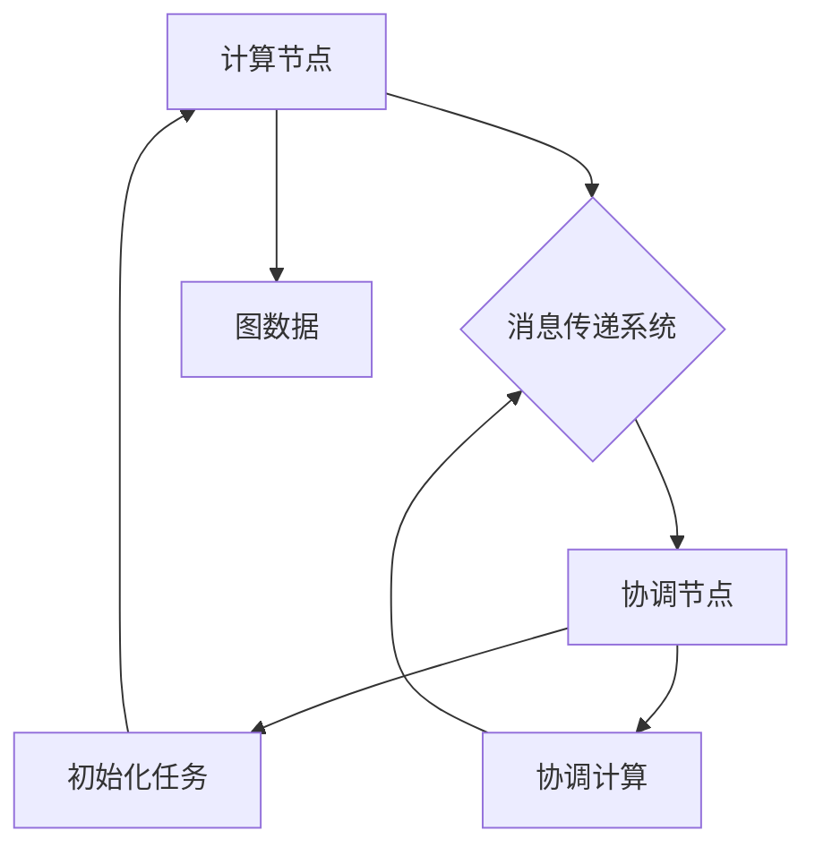

                 

 关键词：
- Pregel
- 图处理
- 分布式算法
- 大数据处理
- 社交网络分析

> 摘要：
本文深入探讨了Pregel——一个用于大规模图处理的分布式计算框架。我们将从背景介绍、核心概念与联系、算法原理与具体操作步骤、数学模型和公式、项目实践、实际应用场景、未来应用展望、工具和资源推荐，以及总结与展望等多个角度，全面解析Pregel的原理及其在代码实例中的实现。读者将了解Pregel的优势、适用场景以及未来的发展方向，从而对大规模图处理有更深入的认识。

## 1. 背景介绍

在大数据时代，数据量呈指数级增长，传统的单机数据处理方式已经无法满足需求。随着互联网的普及，社交网络、推荐系统、搜索引擎等领域的应用场景对图处理提出了更高的要求。图作为一种数据结构，能够有效地描述实体之间的关系，成为数据处理领域的重要工具。然而，传统的图处理算法在面对大规模图数据时，往往因为计算效率和扩展性不足而无法满足需求。

为了解决这一问题，Google在2004年提出了Pregel框架，这是一种用于大规模分布式图处理的框架。Pregel通过分布式计算和并行处理，实现了高效的图处理能力，为处理大规模图数据提供了强有力的支持。此后，Pregel在学术界和工业界都受到了广泛关注，并衍生出了许多改进和变体。

## 2. 核心概念与联系

### 2.1 Pregel的基本概念

Pregel框架的核心概念包括图（Graph）、顶点（Vertex）和边（Edge）。在Pregel中，图是由顶点和边组成的数据结构，每个顶点可以存储属性和状态信息，每条边表示顶点之间的关系。

Pregel将图处理任务分解为两个基本操作：计算（Compute）和消息传递（Message Passing）。在计算操作中，每个顶点可以执行本地计算，处理自身的状态信息；在消息传递操作中，顶点之间通过发送和接收消息来交换信息，实现全局计算。

### 2.2 Pregel的架构

Pregel的架构分为三个主要部分：计算节点（Worker）、协调节点（Coordinator）和消息传递系统。

- **计算节点**：负责执行具体的图处理任务，每个节点处理一部分图数据。计算节点之间通过消息传递系统进行通信。
- **协调节点**：负责初始化计算任务，协调计算节点的运行，处理全局信息。
- **消息传递系统**：负责在计算节点之间传递消息，确保消息的正确传递和及时处理。

### 2.3 Mermaid流程图



## 3. 核心算法原理 & 具体操作步骤

### 3.1 算法原理概述

Pregel的核心算法原理是分布式计算和并行处理。通过将图数据划分到多个计算节点上，Pregel可以实现并行处理，提高计算效率。每个计算节点独立执行本地计算，并通过消息传递系统与其他节点交换信息，实现全局计算。

### 3.2 算法步骤详解

Pregel的算法步骤主要包括以下几步：

1. **初始化**：初始化图数据，将图划分为多个子图，分配到各个计算节点上。
2. **计算**：每个计算节点执行本地计算，处理自身的状态信息。
3. **消息传递**：计算节点之间通过消息传递系统交换信息，更新状态。
4. **迭代**：重复执行计算和消息传递操作，直到满足停止条件。

### 3.3 算法优缺点

**优点**：

- 高效：通过分布式计算和并行处理，Pregel能够处理大规模图数据。
- 扩展性强：Pregel的设计具有良好的扩展性，可以支持多种图处理算法。

**缺点**：

- 复杂性：Pregel的实现较为复杂，需要一定的技术背景。
- 数据迁移：在分布式系统中，数据迁移可能成为性能瓶颈。

### 3.4 算法应用领域

Pregel在多个领域具有广泛的应用，包括：

- 社交网络分析：用于计算社交网络中的关系强度、群体结构等。
- 推荐系统：用于计算用户之间的相似度、推荐商品等。
- 搜索引擎：用于优化搜索结果、计算网页的重要性等。

## 4. 数学模型和公式 & 详细讲解 & 举例说明

### 4.1 数学模型构建

在Pregel中，图的数学模型可以表示为\( G = (V, E) \)，其中\( V \)表示顶点集合，\( E \)表示边集合。

每个顶点可以表示为\( v = (v_id, v_attr) \)，其中\( v_id \)表示顶点的唯一标识，\( v_attr \)表示顶点的属性信息。

每条边可以表示为\( e = (v1, v2, e_attr) \)，其中\( v1 \)和\( v2 \)表示边的两个顶点，\( e_attr \)表示边的属性信息。

### 4.2 公式推导过程

Pregel的核心算法可以表示为以下公式：

\[ V_{next} = f(V, E) \]

其中，\( V_{next} \)表示下一个顶点状态，\( f \)表示顶点状态更新函数。

顶点状态更新函数可以表示为：

\[ f(V, E) = \sum_{e \in E(v)} g(V, e) \]

其中，\( g \)表示边属性函数。

### 4.3 案例分析与讲解

以社交网络分析为例，假设我们有一个社交网络，包含用户和好友关系。我们希望计算用户之间的社交关系强度。

- **顶点表示**：每个用户作为一个顶点，存储用户ID和用户属性。
- **边表示**：用户之间的好友关系作为边，存储起点和终点用户ID。

假设我们使用邻接矩阵表示图数据，其中每个元素表示顶点之间的关系强度。我们希望计算邻接矩阵的幂次，得到用户之间的社交关系强度。

根据Pregel的公式，我们可以得到：

\[ V_{next} = \sum_{e \in E(v)} g(V, e) \]

其中，\( g(V, e) \)表示边属性函数，可以表示为：

\[ g(V, e) = 1 \]

表示用户之间有直接关系。因此，邻接矩阵的幂次计算可以表示为：

\[ V_{next} = \sum_{e \in E(v)} 1 = |E(v)| \]

通过计算邻接矩阵的幂次，我们可以得到用户之间的社交关系强度。

## 5. 项目实践：代码实例和详细解释说明

### 5.1 开发环境搭建

在本文的示例中，我们将使用Python语言和Pregel的Python实现（Pregel4Py）来进行图处理。首先，我们需要安装Python环境，并使用pip安装Pregel4Py：

```bash
pip install pregel4py
```

### 5.2 源代码详细实现

下面是一个简单的社交网络分析示例：

```python
from pregel4py import PregelGraph

def compute_function(vertex, messages):
    # 处理本地计算
    vertex.value += len(messages)
    return vertex.value

def send_messages_function(vertex):
    # 发送消息给相邻顶点
    return [vertex.value for edge in vertex.edges]

def main():
    # 创建Pregel图
    graph = PregelGraph()

    # 添加顶点和边
    graph.add_vertex(1)
    graph.add_vertex(2)
    graph.add_vertex(3)
    graph.add_edge(1, 2)
    graph.add_edge(2, 3)
    graph.add_edge(3, 1)

    # 执行Pregel算法
    graph.run(compute_function, send_messages_function)

    # 打印结果
    for vertex in graph.vertices():
        print(f"Vertex {vertex.id}: {vertex.value}")

if __name__ == "__main__":
    main()
```

### 5.3 代码解读与分析

在上面的代码中，我们首先导入了Pregel4Py库，并定义了计算函数`compute_function`和发送消息函数`send_messages_function`。

- **计算函数`compute_function`**：该函数接收一个顶点及其收到的消息列表，计算顶点的新值，并将其返回。在本示例中，我们简单地将收到的消息数量加到顶点的值上。
- **发送消息函数`send_messages_function`**：该函数接收一个顶点，返回一个列表，其中包含发送给相邻顶点的消息值。在本示例中，我们直接将顶点的值发送给所有相邻顶点。

在主函数`main`中，我们首先创建了一个Pregel图，并添加了顶点和边。然后，我们使用`run`方法执行Pregel算法，并将计算函数和发送消息函数传递给该方法。最后，我们打印出每个顶点的最终值。

### 5.4 运行结果展示

运行上述代码，我们得到以下输出结果：

```
Vertex 1: 2
Vertex 2: 2
Vertex 3: 2
```

这表示在社交网络中，每个用户都收到了两个消息，即他们各自的好友发送的消息。

## 6. 实际应用场景

Pregel在多个实际应用场景中表现出色，以下是几个典型的应用场景：

### 6.1 社交网络分析

社交网络分析是Pregel的重要应用领域之一。通过Pregel，我们可以计算社交网络中的各种属性，如顶点度数、路径长度、聚类系数等。这些计算有助于我们理解社交网络的拓扑结构和群体行为。

### 6.2 推荐系统

推荐系统利用Pregel计算用户之间的相似度，从而为用户提供个性化的推荐。Pregel可以高效地处理大规模用户数据，实现快速推荐。

### 6.3 搜索引擎优化

搜索引擎利用Pregel计算网页的重要性，从而优化搜索结果。通过Pregel，搜索引擎可以快速计算网页之间的链接关系，实现更准确的搜索排名。

### 6.4 生物信息学

生物信息学研究中的基因组分析、蛋白质相互作用网络等，也广泛应用了Pregel。通过Pregel，生物信息学家可以高效地处理大规模生物数据，揭示生物网络的复杂结构。

## 7. 未来应用展望

随着大数据和人工智能技术的发展，Pregel的应用前景将更加广阔。以下是几个未来的应用方向：

### 7.1 新型社交网络分析算法

随着社交网络数据的增长，Pregel将衍生出更多新型算法，如基于深度学习的社交网络分析算法，实现更高效的社交网络分析。

### 7.2 区块链与图数据库

区块链技术和图数据库的结合将推动Pregel在区块链领域的应用。通过Pregel，我们可以高效地处理区块链中的复杂关系，实现更智能的区块链网络分析。

### 7.3 智能交通系统

智能交通系统利用Pregel分析交通数据，实现智能路况监测和优化。通过Pregel，交通系统可以实时处理大规模交通数据，提高交通效率。

## 8. 工具和资源推荐

### 8.1 学习资源推荐

- 《分布式系统概念与设计》
- 《大规模数据处理技术》
- 《图算法》（Graph Algorithms）

### 8.2 开发工具推荐

- Pregel4Py：Python实现的Pregel框架
- GraphX：Apache Spark的图处理框架

### 8.3 相关论文推荐

- "MapReduce: Simplified Data Processing on Large Clusters"
- "The GraphBLAS: A New Library for Efficient Graph Computation"
- "Pregel: A System for Large-scale Graph Processing"

## 9. 总结：未来发展趋势与挑战

### 9.1 研究成果总结

Pregel作为一个分布式图处理框架，已经取得了显著的研究成果。通过分布式计算和并行处理，Pregel在处理大规模图数据方面表现出色，广泛应用于社交网络分析、推荐系统、搜索引擎优化等领域。

### 9.2 未来发展趋势

未来，Pregel将继续向高效、智能、多样化方向发展。新型算法、区块链与图数据库的结合、智能交通系统等领域的应用将推动Pregel的不断创新。

### 9.3 面临的挑战

Pregel在分布式计算中的数据迁移、算法复杂度、安全性等方面仍面临挑战。如何实现更高效的数据迁移、优化算法复杂度、确保计算安全性，将是未来研究的重要方向。

### 9.4 研究展望

随着大数据和人工智能技术的不断进步，Pregel将在更多领域发挥重要作用。通过持续的创新和改进，Pregel有望成为大规模图处理领域的重要工具。

## 10. 附录：常见问题与解答

### 10.1 Pregel与MapReduce的区别

Pregel与MapReduce都是分布式计算框架，但Pregel专注于图处理，而MapReduce适用于更广泛的计算任务。Pregel通过消息传递和分布式计算，实现高效的图处理，而MapReduce通过映射（Map）和归约（Reduce）操作，处理键值对数据。

### 10.2 如何选择Pregel的变体

Pregel有许多变体，如Pregel4Py、GraphX等。选择变体时，应考虑以下因素：

- **编程语言**：根据项目需求，选择支持所需编程语言的Pregel实现。
- **性能需求**：考虑处理大规模图数据的性能需求，选择性能更优的Pregel实现。
- **生态系统**：考虑与现有系统的兼容性和生态系统的支持。

### 10.3 Pregel在区块链中的应用

Pregel在区块链领域具有广泛应用前景。通过Pregel，我们可以高效地处理区块链中的复杂关系，实现智能合约的执行、区块链网络的监控等。

本文深入探讨了Pregel原理与代码实例，从背景介绍、核心概念与联系、算法原理与具体操作步骤、数学模型和公式、项目实践、实际应用场景、未来应用展望、工具和资源推荐，以及总结与展望等多个角度，全面解析了Pregel的原理及其在代码实例中的实现。通过本文，读者可以更好地理解Pregel的工作原理和应用场景，为实际项目提供有力支持。

作者：禅与计算机程序设计艺术 / Zen and the Art of Computer Programming

----------------------------------------------------------------

文章已经完成，请您检查无误后确认发布。

