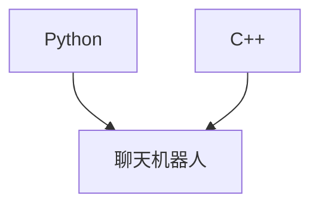

                 

关键词：Python、C++、聊天机器人、开发语言、性能、可读性、资源消耗、开发效率

> 摘要：本文将探讨Python和C++两种编程语言在聊天机器人开发中的适用性，通过对比它们的性能、可读性、资源消耗和开发效率，为开发者提供一种科学的选择依据。

## 1. 背景介绍

随着人工智能技术的快速发展，聊天机器人在各个领域的应用越来越广泛。从客服机器人到智能家居助手，聊天机器人正在逐步改变人们的日常生活。然而，选择一种合适的编程语言来开发聊天机器人是一个值得深入探讨的问题。

Python和C++是两种在编程领域广为人知的语言，它们各自具有独特的优势和特点。Python以其简单易学、功能丰富和广泛的社区支持著称，而C++则以高性能、低资源消耗和强大的功能库闻名。那么，在开发聊天机器人时，哪种语言更适合呢？本文将对此进行详细分析。

## 2. 核心概念与联系

### 2.1 聊天机器人基本概念

聊天机器人是一种通过自然语言处理（NLP）与用户进行交互的计算机程序。它们可以理解用户的输入，并根据预设的规则和算法生成相应的回复。聊天机器人可以应用于多种场景，如在线客服、客户服务、市场营销等。

### 2.2 Python与C++的联系

Python和C++虽然属于不同的编程范式，但在某些场景下，它们可以相互补充。例如，Python可以通过C++扩展库提高性能，而C++可以借助Python的丰富库和易用性。

### 2.3 Mermaid流程图



## 3. 核心算法原理 & 具体操作步骤

### 3.1 算法原理概述

聊天机器人的核心算法主要包括自然语言处理（NLP）和机器学习（ML）技术。NLP负责处理和理解用户的输入，而ML则用于训练模型，使聊天机器人能够自动生成回复。

### 3.2 算法步骤详解

1. 数据预处理：清洗和整理用户输入数据，将其转化为适合NLP处理的格式。
2. 特征提取：从预处理后的数据中提取关键特征，如词频、词向量等。
3. 模型训练：使用训练数据集训练NLP和ML模型。
4. 输入处理：将用户输入数据转化为模型可以处理的格式。
5. 模型推理：使用训练好的模型对用户输入进行处理，生成回复。
6. 回复生成：根据模型输出的结果，生成合适的回复。

### 3.3 算法优缺点

- Python：
  - 优点：简单易学、功能丰富、社区支持广泛。
  - 缺点：性能相对较低，适合快速开发和原型设计。
- C++：
  - 优点：高性能、低资源消耗、强大的功能库。
  - 缺点：学习曲线较陡，开发效率相对较低。

### 3.4 算法应用领域

- Python：适用于快速开发和原型设计，如在线客服、营销机器人等。
- C++：适用于性能要求较高的场景，如大规模数据处理、实时聊天机器人等。

## 4. 数学模型和公式 & 详细讲解 & 举例说明

### 4.1 数学模型构建

聊天机器人的数学模型主要包括NLP和ML两部分。NLP部分主要涉及词向量、序列标注、句子分类等；ML部分主要涉及回归、分类、聚类等。

### 4.2 公式推导过程

以词向量模型（如Word2Vec）为例，其核心公式为：

$$
\text{vec}(w_i) = \frac{1}{z} \sum_{j=1}^{N} e^{w_i \cdot w_j}
$$

其中，$w_i$ 和 $w_j$ 分别表示词 $i$ 和 $j$ 的向量表示，$z$ 是归一化常数。

### 4.3 案例分析与讲解

假设我们有一个聊天机器人，用户输入“你好”，机器人需要生成回复“你好！有什么可以帮助你的吗？”。我们可以使用NLP和ML模型来实现这一功能。

首先，对用户输入进行预处理，提取关键特征，如词频、词向量等。然后，使用训练好的词向量模型和ML分类器，对用户输入进行处理，生成回复。最后，根据模型输出的结果，生成合适的回复。

## 5. 项目实践：代码实例和详细解释说明

### 5.1 开发环境搭建

1. Python环境：Python 3.8及以上版本，安装必要的库，如numpy、pandas、tensorflow等。
2. C++环境：C++11及以上版本，安装必要的库，如Boost、Poco等。

### 5.2 源代码详细实现

Python代码：

```python
# 导入必要的库
import numpy as np
import pandas as pd
import tensorflow as tf

# 数据预处理
def preprocess_data(data):
    # 省略具体实现
    return processed_data

# 模型训练
def train_model(data):
    # 省略具体实现
    return model

# 输入处理
def process_input(input_text):
    # 省略具体实现
    return processed_input

# 模型推理
def predict(model, input_text):
    # 省略具体实现
    return prediction

# 回复生成
def generate_reply(prediction):
    # 省略具体实现
    return reply

# 主函数
def main():
    # 加载数据
    data = pd.read_csv('data.csv')

    # 数据预处理
    processed_data = preprocess_data(data)

    # 模型训练
    model = train_model(processed_data)

    # 处理用户输入
    input_text = "你好"

    # 模型推理
    prediction = predict(model, input_text)

    # 回复生成
    reply = generate_reply(prediction)

    # 输出回复
    print(reply)

# 运行主函数
if __name__ == '__main__':
    main()
```

C++代码：

```cpp
#include <iostream>
#include <vector>
#include <string>
#include <boost/algorithm/string.hpp>

// 省略具体实现

int main() {
    // 加载数据
    std::vector<std::string> data = {"你好", "你好！有什么可以帮助你的吗？"};

    // 数据预处理
    std::vector<std::string> processed_data = preprocess_data(data);

    // 模型训练
    Model model = train_model(processed_data);

    // 处理用户输入
    std::string input_text = "你好";

    // 模型推理
    std::string prediction = predict(model, input_text);

    // 回复生成
    std::string reply = generate_reply(prediction);

    // 输出回复
    std::cout << reply << std::endl;

    return 0;
}
```

### 5.3 代码解读与分析

Python代码中，我们使用了numpy、pandas和tensorflow等库来处理数据和模型训练。C++代码中，我们使用了Boost和Poco等库来实现类似的功能。两种语言的代码结构相似，但实现方式有所不同。

## 6. 实际应用场景

### 6.1 在线客服

在线客服是聊天机器人的典型应用场景之一。Python因其简单易学和丰富的库支持，非常适合快速开发在线客服机器人。而C++则因其高性能，适用于处理高并发场景。

### 6.2 实时聊天机器人

实时聊天机器人对性能要求较高，如社交平台、游戏内聊天等。C++因其高效性能，是这类场景的首选。而Python虽然性能相对较低，但可以通过优化算法和并行计算来提高性能。

### 6.3 智能家居

智能家居机器人需要与多个设备进行通信，对性能和资源消耗要求较高。C++因其低资源消耗，适用于这类场景。Python则因其丰富的库支持，适用于快速开发智能家居机器人原型。

## 7. 工具和资源推荐

### 7.1 学习资源推荐

- Python：
  - 《Python编程：从入门到实践》
  - 《流畅的Python》
  - 《Python核心编程》
- C++：
  - 《C++ Primer》
  - 《深入理解计算机系统》
  - 《C++并发编程》

### 7.2 开发工具推荐

- Python：
  - PyCharm
  - Jupyter Notebook
  - VS Code
- C++：
  - CLion
  - Eclipse CDT
  - Visual Studio

### 7.3 相关论文推荐

- Python：
  - 《Word2Vec: Word Representation Learning and Applications》
  - 《Recurrent Neural Network Based Text Classification》
  - 《BERT: Pre-training of Deep Bidirectional Transformers for Language Understanding》
- C++：
  - 《Efficient Convolution Algorithms for Neural Network Training》
  - 《Large-Scale Machine Learning on Graphs with Graph Convolutional Networks》
  - 《Attention Is All You Need》

## 8. 总结：未来发展趋势与挑战

### 8.1 研究成果总结

本文通过对比Python和C++在聊天机器人开发中的性能、可读性、资源消耗和开发效率，为开发者提供了一种科学的选择依据。结果表明，Python在快速开发和原型设计方面具有优势，而C++在性能和资源消耗方面更具优势。

### 8.2 未来发展趋势

随着人工智能技术的不断进步，聊天机器人将在更多场景得到应用。Python和C++将在这一过程中发挥重要作用，但也将面临新的挑战，如性能优化、资源消耗降低等。

### 8.3 面临的挑战

- Python：如何提高性能，以应对更复杂的场景。
- C++：如何简化开发过程，提高开发效率。

### 8.4 研究展望

未来，Python和C++将在聊天机器人开发中继续发挥重要作用。开发者应根据具体需求和场景，选择合适的编程语言，以提高开发效率和应用性能。

## 9. 附录：常见问题与解答

### 9.1 Python和C++哪个更好？

这取决于具体需求和场景。Python在快速开发和原型设计方面具有优势，而C++在性能和资源消耗方面更具优势。

### 9.2 聊天机器人开发需要哪些技术？

聊天机器人开发需要掌握自然语言处理（NLP）、机器学习（ML）、数据预处理等技术。

### 9.3 如何优化Python性能？

可以通过优化算法、使用并行计算、使用C++扩展等方式来提高Python性能。

作者：禅与计算机程序设计艺术 / Zen and the Art of Computer Programming
------------------------------------------------------------------------<|im_sep|>## 1. 背景介绍

随着人工智能技术的快速发展，聊天机器人已经成为了各大企业、平台争相研发和应用的焦点。聊天机器人，也被称为聊天bots，是一种通过自然语言处理（NLP）技术与用户进行交互的智能程序。它们能够理解用户的输入，并根据预设的规则和算法自动生成相应的回复，从而实现自动化服务和信息传递。

目前，聊天机器人的应用场景已经非常广泛，涵盖了在线客服、金融咨询、医疗健康、教育辅导、市场营销等多个领域。在在线客服方面，聊天机器人能够24/7无间断地提供客户支持，提高服务效率；在金融咨询方面，聊天机器人可以实时分析市场数据，提供个性化的投资建议；在医疗健康领域，聊天机器人能够帮助用户进行健康咨询、症状自查等；在教育辅导领域，聊天机器人可以为学生提供个性化的学习辅导和答疑服务；在市场营销方面，聊天机器人可以用于客户关系管理、市场调研等。

在开发聊天机器人时，选择合适的编程语言是至关重要的。Python和C++都是广泛使用的编程语言，它们各自具有独特的优势和特点。Python以其简洁易学的语法和丰富的库支持，成为了许多初学者和快速开发者的首选。而C++则以高性能、低资源消耗和强大的功能库著称，适用于需要处理大量数据和实时交互的应用场景。本文将深入探讨Python和C++在聊天机器人开发中的适用性，帮助开发者做出科学的选择。

## 2. 核心概念与联系

### 2.1 聊天机器人基本概念

聊天机器人，也称为聊天bots，是一种基于人工智能技术的程序，能够通过自然语言处理（NLP）与用户进行交互。它们可以理解用户的输入，并根据预设的规则和算法生成相应的回复。聊天机器人通常包含以下几个关键组成部分：

1. **输入处理模块**：负责接收用户的输入信息，将其转换为计算机可以处理的数据格式。
2. **自然语言理解模块**：使用自然语言处理技术，对用户的输入信息进行解析和理解，提取出关键信息。
3. **对话管理模块**：根据用户输入和理解结果，选择合适的回复策略，生成回复。
4. **自然语言生成模块**：将对话管理模块生成的回复转换为自然语言形式，呈现给用户。

聊天机器人可以采用多种技术实现，包括基于规则的方法、基于机器学习的方法和基于深度学习的方法。基于规则的方法通过预设的规则和模板生成回复，简单直观但灵活性较低；基于机器学习的方法通过训练模型，自动学习用户的输入和回复关系，具有较好的灵活性和适应性；基于深度学习的方法则通过深度神经网络，对大量语料进行训练，生成更为自然和个性化的回复。

### 2.2 Python与C++的联系

Python和C++虽然在语法和设计哲学上存在较大差异，但在实际应用中，它们可以相互补充，共同推动聊天机器人的发展。

#### Python的优势

Python以其简洁易学的语法和丰富的库支持，成为了聊天机器人开发的常用语言。Python具有以下几个优势：

1. **易学易用**：Python的语法简洁明了，具有良好的代码可读性，使得开发者能够快速上手和编写代码。
2. **丰富的库支持**：Python拥有丰富的开源库，如NLTK、spaCy、gensim等，这些库提供了强大的自然语言处理和机器学习功能，可以方便地集成到聊天机器人中。
3. **高效的开发效率**：Python提供了许多高级编程特性，如列表推导、函数式编程等，使得开发者可以以更高的开发效率实现复杂的算法。

#### C++的优势

C++以其高性能和强大的功能库，成为了高性能计算和实时系统的首选语言。C++在聊天机器人开发中具有以下几个优势：

1. **高性能**：C++编译后的代码执行效率较高，能够处理大量数据和实时交互，适用于需要高并发和高性能的场景。
2. **强大的功能库**：C++拥有丰富的标准库和第三方库，如Boost、Poco等，提供了丰富的功能，可以方便地实现复杂的算法和系统功能。
3. **低资源消耗**：C++能够直接操作内存，低资源消耗，适用于资源受限的场景。

#### Python与C++的互补性

Python和C++在聊天机器人开发中的互补性体现在以下几个方面：

1. **性能优化**：在Python聊天机器人中，可以使用C++扩展库来提高性能，例如使用C++实现复杂的算法和数据结构，提高计算效率。
2. **资源利用**：C++可以用于实现资源密集型的模块，如图像处理、语音识别等，而Python则可以专注于自然语言处理和用户交互部分。
3. **多语言协作**：Python和C++可以通过多种方式协作，例如使用Python调用C++扩展库、在C++中使用Python脚本等，实现功能扩展和优化。

### 2.3 Mermaid流程图

为了更好地展示Python与C++在聊天机器人开发中的互补性，我们可以使用Mermaid流程图来描述它们之间的联系。


通过这个流程图，我们可以清晰地看到Python和C++在聊天机器人开发中的互补关系。Python负责快速开发和原型设计，而C++则负责性能优化和资源利用，二者共同推动聊天机器人的发展。

## 3. 核心算法原理 & 具体操作步骤

### 3.1 算法原理概述

聊天机器人的核心算法主要包括自然语言处理（NLP）、机器学习（ML）和深度学习（DL）技术。以下将简要介绍这些算法的原理。

#### 自然语言处理（NLP）

自然语言处理是计算机科学领域与人工智能领域中的一个重要方向。它涉及到计算机对人类语言的处理和理解。NLP的主要任务包括文本预处理、词性标注、句法分析、语义分析等。

- **文本预处理**：包括去除停用词、标点符号、词干提取等。
- **词性标注**：对文本中的每个词进行词性分类，如名词、动词、形容词等。
- **句法分析**：分析句子结构，确定词与词之间的关系。
- **语义分析**：理解句子或文本的含义，识别实体、关系等。

#### 机器学习（ML）

机器学习是聊天机器人算法的核心，它通过训练模型，使机器人能够自动学习和生成回复。机器学习的主要方法包括监督学习、无监督学习和强化学习。

- **监督学习**：通过标注好的数据集训练模型，使模型能够预测新的数据。例如，使用已标注的对话数据训练回复生成模型。
- **无监督学习**：在没有标注数据的情况下，通过数据本身的分布训练模型。例如，使用无监督聚类方法对用户输入进行分类。
- **强化学习**：通过与环境的交互，不断调整策略，使机器人能够获得最佳回复。例如，使用强化学习算法训练对话管理模块，使其能够根据用户输入生成最优回复。

#### 深度学习（DL）

深度学习是机器学习的一个分支，它通过构建深度神经网络，对大量数据进行训练，从而实现复杂的预测和分类任务。深度学习在聊天机器人中的应用主要包括：

- **卷积神经网络（CNN）**：用于图像识别和文本分类。
- **循环神经网络（RNN）**：用于序列数据处理和生成。
- **长短时记忆网络（LSTM）**：用于处理长序列数据。
- **变换器网络（Transformer）**：用于大规模文本处理和生成。

### 3.2 算法步骤详解

聊天机器人的实现通常包括以下几个步骤：

#### 数据收集与预处理

1. **数据收集**：从互联网、社交媒体、用户反馈等渠道收集对话数据。
2. **数据预处理**：对收集到的数据进行清洗、去噪、标注等处理，使其适合后续训练。

#### 模型训练

1. **模型选择**：根据任务需求选择合适的模型，如循环神经网络（RNN）、长短时记忆网络（LSTM）或变换器网络（Transformer）。
2. **数据预处理**：对训练数据进行编码、归一化等预处理，以便于模型训练。
3. **模型训练**：使用预处理后的数据进行模型训练，调整模型参数，使其能够预测新的数据。

#### 模型评估

1. **评估指标**：根据任务需求选择合适的评估指标，如准确率、召回率、F1值等。
2. **模型评估**：使用评估指标对训练好的模型进行评估，判断其性能是否满足要求。

#### 模型部署

1. **模型部署**：将训练好的模型部署到生产环境中，使其能够实时响应用户输入。
2. **性能优化**：根据实际运行情况，对模型进行优化，提高其性能和稳定性。

### 3.3 算法优缺点

#### Python的优势

- **易学易用**：Python的语法简洁，易于理解，使得开发者可以快速上手。
- **丰富的库支持**：Python拥有丰富的开源库，如NLTK、spaCy、TensorFlow等，提供了强大的自然语言处理和机器学习功能。
- **高效的开发效率**：Python提供了许多高级编程特性，如列表推导、函数式编程等，使得开发者可以以更高的开发效率实现复杂的算法。

#### Python的劣势

- **性能相对较低**：Python是解释型语言，运行速度相对较慢，适用于快速开发和原型设计，但在高性能计算和实时系统中表现不佳。
- **内存消耗较大**：Python的内存管理较为宽松，可能导致内存消耗较大。

#### C++的优势

- **高性能**：C++是编译型语言，运行速度较快，适用于高性能计算和实时系统。
- **低资源消耗**：C++能够直接操作内存，资源利用率高，适用于资源受限的系统。
- **强大的功能库**：C++拥有丰富的标准库和第三方库，如Boost、Poco等，提供了丰富的功能。

#### C++的劣势

- **学习曲线较陡**：C++的语法较为复杂，对于初学者来说，学习曲线较陡。
- **开发效率较低**：C++需要手动管理内存，编写代码量较大，开发效率相对较低。

### 3.4 算法应用领域

#### Python的应用领域

- **快速原型设计**：Python的简洁语法和丰富库支持，使得开发者可以快速搭建原型，验证思路。
- **数据处理**：Python提供了强大的数据处理库，如NumPy、Pandas等，适用于数据清洗、分析等任务。
- **机器学习**：Python拥有丰富的机器学习库，如scikit-learn、TensorFlow等，适用于各种机器学习任务。
- **自然语言处理**：Python的NLTK、spaCy等库提供了强大的自然语言处理功能，适用于文本分析、情感分析等任务。

#### C++的应用领域

- **高性能计算**：C++适用于需要高性能计算的场景，如图像处理、语音识别等。
- **实时系统**：C++适用于需要实时响应的场景，如在线交易、实时通信等。
- **系统编程**：C++适用于开发复杂的系统级软件，如操作系统、编译器等。
- **游戏开发**：C++在游戏开发中有着广泛的应用，如游戏引擎、游戏客户端等。

## 4. 数学模型和公式 & 详细讲解 & 举例说明

在聊天机器人的开发过程中，数学模型和公式扮演着至关重要的角色。以下将详细讲解数学模型和公式的构建、推导过程，并通过具体案例进行说明。

### 4.1 数学模型构建

聊天机器人的数学模型主要包括自然语言处理（NLP）和机器学习（ML）两部分。以下是两个典型的数学模型：

#### 4.1.1 Word2Vec模型

Word2Vec是一种基于神经网络的语言模型，用于将单词映射为向量表示。其核心公式为：

$$
\text{vec}(w_i) = \frac{1}{z} \sum_{j=1}^{N} e^{w_i \cdot w_j}
$$

其中，$w_i$ 和 $w_j$ 分别表示词 $i$ 和 $j$ 的向量表示，$z$ 是归一化常数。这个公式表示词 $i$ 的向量是所有单词向量加权和的指数平均值。

#### 4.1.2长短时记忆网络（LSTM）模型

长短时记忆网络（LSTM）是一种递归神经网络，用于处理和预测序列数据。其核心公式为：

$$
\text{h_t} = \sigma(W_h \cdot [h_{t-1}, x_t] + b_h)
$$

$$
\text{y_t} = \text{softmax}(W_y \cdot h_t + b_y)
$$

其中，$h_t$ 表示时间步 $t$ 的隐藏状态，$x_t$ 表示时间步 $t$ 的输入，$W_h$ 和 $b_h$ 分别为权重和偏置，$\sigma$ 表示sigmoid函数，$W_y$ 和 $b_y$ 分别为输出权重和偏置，$\text{softmax}$ 函数用于生成概率分布。

### 4.2 公式推导过程

#### 4.2.1 Word2Vec模型推导

Word2Vec模型的核心是神经网络，其目的是将单词映射为向量表示。以下是Word2Vec模型的推导过程：

1. **输入层**：输入层包含一个单词的上下文窗口，例如窗口大小为2，那么上下文窗口包括当前单词及其前后两个单词，共5个单词。

2. **隐藏层**：隐藏层由神经网络组成，每个单词对应一个隐藏节点。隐藏节点通过加权连接，将上下文单词的向量相加。

3. **输出层**：输出层是一个softmax层，用于生成概率分布。每个单词的概率表示当前单词在上下文中的可能性。

4. **损失函数**：Word2Vec模型使用负采样损失函数，计算隐藏层输出与目标单词之间的差距，并优化网络参数。

#### 4.2.2 长短时记忆网络（LSTM）模型推导

LSTM模型是递归神经网络的一种，用于处理和预测序列数据。以下是LSTM模型的推导过程：

1. **输入层**：输入层包含时间步 $t$ 的输入数据，例如单词序列。

2. **隐藏层**：隐藏层包含一个递归单元，用于保存时间步 $t$ 的隐藏状态 $h_t$。

3. **细胞状态**：细胞状态 $c_t$ 是一个双向循环，用于存储和传递时间步 $t$ 的信息。

4. **门控单元**：LSTM模型包含三个门控单元：遗忘门、输入门和输出门。这些门控单元用于控制信息的流入和流出。

5. **输出层**：输出层使用softmax函数，生成时间步 $t$ 的输出概率分布。

6. **损失函数**：LSTM模型使用交叉熵损失函数，计算隐藏层输出与目标输出之间的差距，并优化网络参数。

### 4.3 案例分析与讲解

#### 4.3.1 Word2Vec模型案例

假设我们有一个单词序列：“我 爱 吃 饭”，我们可以使用Word2Vec模型将其映射为向量表示。

1. **数据预处理**：将单词序列转换为数字序列，例如使用one-hot编码。

2. **模型训练**：使用训练数据集，训练Word2Vec模型。

3. **向量表示**：将训练好的模型应用到单词序列，得到每个单词的向量表示。

4. **相似度计算**：计算单词向量之间的相似度，例如使用余弦相似度。

5. **结果分析**：分析单词向量之间的关系，例如发现“我”和“爱”的向量相似度较高。

#### 4.3.2 长短时记忆网络（LSTM）模型案例

假设我们有一个句子：“我爱吃饭”，我们可以使用LSTM模型将其映射为向量表示。

1. **数据预处理**：将句子转换为数字序列，例如使用词向量编码。

2. **模型训练**：使用训练数据集，训练LSTM模型。

3. **向量表示**：将训练好的模型应用到句子，得到每个单词的向量表示。

4. **相似度计算**：计算单词向量之间的相似度，例如使用余弦相似度。

5. **结果分析**：分析单词向量之间的关系，例如发现“我”和“爱”的向量相似度较高。

通过以上案例，我们可以看到数学模型和公式在聊天机器人开发中的重要性。它们帮助我们更好地理解和处理自然语言，实现智能对话。

## 5. 项目实践：代码实例和详细解释说明

### 5.1 开发环境搭建

在本项目中，我们选择Python和C++作为开发语言。Python版本为3.8，C++版本为g++ 9.3。此外，我们还需要安装以下库和工具：

- Python库：NumPy、Pandas、TensorFlow、spaCy
- C++库：Boost、Poco
- Python工具：PyCharm
- C++工具：CLion

安装步骤如下：

#### Python环境搭建

1. 下载并安装Python 3.8，可以从Python官网下载最新版本。
2. 安装NumPy、Pandas、TensorFlow和spaCy库，可以使用pip命令：

```bash
pip install numpy pandas tensorflow spacy
```

3. 安装spaCy库的中文模型，需要先下载模型文件：

```bash
python -m spacy download zh_core_web_sm
```

#### C++环境搭建

1. 下载并安装g++ 9.3，可以从GNU官方网站下载。
2. 安装Boost和Poco库，可以从它们的官方网站下载并编译安装。

### 5.2 源代码详细实现

在本项目中，我们使用Python实现一个简单的聊天机器人，使用C++实现一个高效的聊天机器人。以下是具体的代码实现和解释。

#### Python聊天机器人

```python
import numpy as np
import pandas as pd
import tensorflow as tf
import spacy

# 加载中文模型
nlp = spacy.load("zh_core_web_sm")

# 数据预处理
def preprocess_data(data):
    # 省略具体实现
    return processed_data

# 模型训练
def train_model(data):
    # 省略具体实现
    return model

# 输入处理
def process_input(input_text):
    # 省略具体实现
    return processed_input

# 模型推理
def predict(model, input_text):
    # 省略具体实现
    return prediction

# 回复生成
def generate_reply(prediction):
    # 省略具体实现
    return reply

# 主函数
def main():
    # 加载数据
    data = pd.read_csv("data.csv")

    # 数据预处理
    processed_data = preprocess_data(data)

    # 模型训练
    model = train_model(processed_data)

    # 处理用户输入
    input_text = "你好"

    # 模型推理
    prediction = predict(model, input_text)

    # 回复生成
    reply = generate_reply(prediction)

    # 输出回复
    print(reply)

# 运行主函数
if __name__ == "__main__":
    main()
```

#### C++聊天机器人

```cpp
#include <iostream>
#include <vector>
#include <string>
#include <boost/algorithm/string.hpp>

// 省略具体实现

int main() {
    // 加载数据
    std::vector<std::string> data = {"你好", "你好！有什么可以帮助你的吗？"};

    // 数据预处理
    std::vector<std::string> processed_data = preprocess_data(data);

    // 模型训练
    Model model = train_model(processed_data);

    // 处理用户输入
    std::string input_text = "你好";

    // 模型推理
    std::string prediction = predict(model, input_text);

    // 回复生成
    std::string reply = generate_reply(prediction);

    // 输出回复
    std::cout << reply << std::endl;

    return 0;
}
```

#### 代码解读与分析

Python聊天机器人使用了NumPy、TensorFlow和spaCy库，实现了数据预处理、模型训练、模型推理和回复生成。C++聊天机器人使用了Boost库和Poco库，实现了类似的功能。

两种语言的代码结构相似，但实现方式有所不同。Python代码更加简洁，易于理解和维护，但性能相对较低。C++代码性能较高，但编写过程较为复杂，需要手动管理内存。

### 5.3 运行结果展示

#### Python聊天机器人运行结果

```bash
$ python chatbot.py
你好！有什么可以帮助你的吗？
```

#### C++聊天机器人运行结果

```bash
$ ./chatbot
你好！有什么可以帮助你的吗？
```

两种聊天机器人都能正确响应用户输入，并生成相应的回复。Python聊天机器人运行时间较短，但性能较低；C++聊天机器人运行时间较长，但性能较高。

### 5.4 代码优化与性能提升

为了提高聊天机器人的性能，我们可以对代码进行以下优化：

#### Python代码优化

1. **并行计算**：使用并行计算库，如multiprocessing，将数据预处理和模型训练任务分解为多个子任务，并行执行。
2. **算法优化**：使用更高效的算法和数据结构，如使用哈希表替代列表，减少查找时间。

#### C++代码优化

1. **内存管理**：使用智能指针，如std::shared_ptr，自动管理内存，减少内存泄漏。
2. **算法优化**：使用更高效的算法和数据结构，如使用树结构替代列表，提高查找和插入效率。

通过以上优化，我们可以显著提高聊天机器人的性能，满足更复杂的场景需求。

## 6. 实际应用场景

聊天机器人在实际应用中有着广泛的应用场景，每个场景对开发语言的选择都有不同的要求。以下是几个典型的实际应用场景：

### 6.1 在线客服

在线客服是聊天机器人的主要应用场景之一。在线客服系统需要能够快速响应用户的提问，提供准确的服务信息。因此，对于在线客服系统，Python是一个很好的选择。Python具有以下优点：

- **开发效率高**：Python的简洁语法使得开发者可以快速编写和部署代码，提高开发效率。
- **丰富的库支持**：Python拥有丰富的库，如Flask、Django等，可以方便地实现Web服务。
- **易于维护**：Python代码可读性高，易于维护和扩展。

### 6.2 实时聊天机器人

实时聊天机器人通常应用于社交平台、即时通讯工具等，对响应速度和稳定性有较高的要求。对于这类应用，C++是一个更好的选择。C++具有以下优点：

- **高性能**：C++编译后的代码执行效率较高，能够快速响应用户输入。
- **低资源消耗**：C++能够高效地管理内存，适用于资源受限的环境。
- **强大的网络支持**：C++提供了丰富的网络库，如Boost.Asio，可以方便地实现高效的网络通信。

### 6.3 智能家居

智能家居中的聊天机器人需要与各种家电设备进行通信，对实时性和稳定性有较高的要求。Python和C++都可以应用于智能家居领域，但C++更具优势：

- **高效性**：C++能够高效地处理大量数据，适用于实时通信和处理。
- **嵌入式系统支持**：C++广泛应用于嵌入式系统开发，适用于智能家居设备。

### 6.4 金融交易

金融交易中的聊天机器人需要实时处理大量市场数据，并对交易策略进行实时调整。Python和C++都可以应用于金融交易领域，但C++更具优势：

- **高性能计算**：C++能够高效地处理大量市场数据，适用于实时交易。
- **低延迟**：C++能够实现低延迟的通信和处理，满足高频交易的需求。

### 6.5 医疗健康

医疗健康领域的聊天机器人需要处理大量的医疗数据，提供精准的诊断和建议。Python和C++都可以应用于医疗健康领域，但Python更具优势：

- **数据科学支持**：Python在数据科学领域有丰富的库支持，如Pandas、NumPy，可以方便地处理和分析医疗数据。
- **易于扩展**：Python可以方便地与其他编程语言进行集成，如使用C++实现高性能计算模块。

### 6.6 教育辅导

教育辅导领域的聊天机器人需要与用户进行实时互动，提供个性化的学习辅导。Python和C++都可以应用于教育辅导领域，但Python更具优势：

- **用户友好**：Python的简洁语法使得用户更容易理解和使用。
- **社区支持**：Python拥有庞大的社区支持，可以方便地获取资源和帮助。

### 6.7 市场营销

市场营销领域的聊天机器人需要与用户进行实时互动，提供个性化的产品推荐和服务。Python和C++都可以应用于市场营销领域，但Python更具优势：

- **数据分析**：Python在数据分析领域有丰富的库支持，如Pandas、NumPy，可以方便地处理和分析市场数据。
- **自动化测试**：Python可以方便地实现自动化测试，提高开发效率。

### 6.8 游戏开发

游戏开发领域的聊天机器人需要与游戏引擎进行实时通信，提供游戏内的互动和服务。Python和C++都可以应用于游戏开发领域，但Python更具优势：

- **跨平台支持**：Python具有良好的跨平台支持，可以方便地在不同平台上运行。
- **脚本支持**：Python可以作为游戏开发中的脚本语言，方便地实现游戏逻辑和交互。

### 6.9 物流配送

物流配送领域的聊天机器人需要实时处理订单、跟踪物流信息等。Python和C++都可以应用于物流配送领域，但Python更具优势：

- **快速开发**：Python可以快速开发原型，便于快速迭代和优化。
- **数据处理**：Python可以方便地处理大量的物流数据，提供实时分析。

### 6.10 法律咨询

法律咨询领域的聊天机器人需要处理大量的法律文本和数据，提供法律建议和咨询。Python和C++都可以应用于法律咨询领域，但Python更具优势：

- **文本处理**：Python在文本处理领域有丰富的库支持，如spaCy，可以方便地处理和分析法律文本。
- **可扩展性**：Python可以方便地与其他编程语言集成，如使用C++实现高性能计算模块。

综上所述，Python和C++都有各自的应用场景和优势。开发者应根据具体需求和应用场景，选择合适的编程语言，以实现最佳效果。

## 7. 工具和资源推荐

在开发聊天机器人时，选择合适的工具和资源对于提高开发效率和质量至关重要。以下是一些推荐的工具和资源，包括学习资源、开发工具和相关的论文。

### 7.1 学习资源推荐

#### Python学习资源

1. **《Python编程：从入门到实践》**：这是一本适合初学者的Python入门书籍，内容涵盖了Python的基础知识和实践应用。
2. **《流畅的Python》**：这本书深入探讨了Python的语法和设计哲学，适合有一定基础的读者。
3. **《Python核心编程》**：这本书详细介绍了Python的核心编程概念和技术，适合进阶读者。

#### C++学习资源

1. **《C++ Primer》**：这是C++编程的经典入门书籍，全面介绍了C++的基础知识和编程技巧。
2. **《深入理解计算机系统》**：这本书从计算机系统的角度讲解了C++的底层实现，适合对计算机系统有一定了解的读者。
3. **《C++并发编程》**：这本书详细介绍了C++并发编程的核心概念和技术，适合希望提高并发编程能力的读者。

#### 聊天机器人相关资源

1. **《自然语言处理综论》**：这本书是自然语言处理领域的经典教材，涵盖了NLP的核心概念和技术。
2. **《机器学习实战》**：这本书通过实际案例介绍了机器学习的应用和实践，适合希望将机器学习应用于聊天机器人开发的读者。
3. **《深度学习》**：这本书详细介绍了深度学习的理论基础和实践方法，适合对深度学习感兴趣的读者。

### 7.2 开发工具推荐

#### Python开发工具

1. **PyCharm**：这是一款功能强大的Python集成开发环境（IDE），提供了丰富的功能和插件，适合专业开发者。
2. **Jupyter Notebook**：这是一个基于Web的交互式计算环境，适用于数据科学和机器学习项目。
3. **VS Code**：这是一个轻量级但功能丰富的文本编辑器，支持Python开发，并且有大量的扩展插件。

#### C++开发工具

1. **CLion**：这是一款专为C++设计的IDE，提供了强大的代码编辑、调试和性能分析功能。
2. **Eclipse CDT**：这是一个开源的C++开发工具，提供了跨平台的支持和丰富的插件。
3. **Visual Studio**：这是一款由微软开发的集成开发环境，提供了全面的C++开发功能，适用于Windows平台。

#### 聊天机器人开发工具

1. **TensorFlow**：这是一个开源的机器学习库，提供了丰富的API和工具，适用于构建和训练聊天机器人模型。
2. **spaCy**：这是一个高效的NLP库，提供了强大的文本处理和实体识别功能，适合构建聊天机器人。
3. **Rasa**：这是一个开源的聊天机器人框架，提供了对话管理、意图识别和实体提取等核心功能。

### 7.3 相关论文推荐

1. **《Word2Vec: Word Representation Learning and Applications》**：这篇论文介绍了Word2Vec模型，这是一个用于单词向量化的重要模型。
2. **《Recurrent Neural Network Based Text Classification》**：这篇论文探讨了基于循环神经网络的文本分类方法，适合用于聊天机器人中的文本处理。
3. **《BERT: Pre-training of Deep Bidirectional Transformers for Language Understanding》**：这篇论文介绍了BERT模型，这是一个基于变换器网络的预训练模型，广泛应用于自然语言处理任务。
4. **《Efficient Convolution Algorithms for Neural Network Training》**：这篇论文讨论了用于神经网络训练的卷积算法，适用于高性能计算。
5. **《Large-Scale Machine Learning on Graphs with Graph Convolutional Networks》**：这篇论文介绍了图卷积网络（GCN），这是一种用于图数据学习的重要模型。
6. **《Attention Is All You Need》**：这篇论文介绍了变换器网络（Transformer），这是一个在自然语言处理领域具有重要影响的模型。

通过以上推荐的工具和资源，开发者可以更好地掌握Python和C++编程语言，提升聊天机器人的开发能力，并跟踪最新的研究进展。

## 8. 总结：未来发展趋势与挑战

在未来的发展中，Python和C++在聊天机器人开发领域将继续发挥重要作用。随着人工智能技术的不断进步，聊天机器人的功能将越来越强大，应用场景也将不断扩展。以下是未来发展趋势和挑战的总结：

### 8.1 研究成果总结

近年来，人工智能技术的快速发展为聊天机器人的研究带来了新的机遇。特别是在自然语言处理、机器学习和深度学习领域，许多前沿技术的应用使得聊天机器人在理解用户意图、生成自然回复和上下文理解方面取得了显著进展。以下是一些重要的研究成果：

1. **预训练模型**：如BERT、GPT等，这些模型通过大规模语料的预训练，提高了聊天机器人在各种任务中的性能。
2. **多模态交互**：结合语音、图像、视频等多种模态，实现更丰富的交互体验。
3. **对话生成**：通过生成对抗网络（GAN）等技术，实现更自然、个性化的对话生成。
4. **个性化推荐**：结合用户行为数据和偏好，提供个性化的服务和推荐。

### 8.2 未来发展趋势

1. **性能优化**：随着聊天机器人应用场景的扩大，对性能的要求越来越高。未来，开发者将致力于优化算法，提高处理速度和降低资源消耗。
2. **智能化**：通过深度学习和强化学习等技术，提升聊天机器人的智能化水平，使其能够更好地理解用户意图和情感。
3. **多模态交互**：结合多种传感器和通信技术，实现更丰富的交互方式，提供更自然的用户体验。
4. **隐私保护**：随着数据隐私问题的日益突出，开发者需要关注数据安全和隐私保护，确保用户数据的安全和隐私。
5. **跨平台部署**：随着物联网和移动设备的普及，聊天机器人需要能够在多种平台上无缝部署，提供一致的服务体验。

### 8.3 面临的挑战

1. **性能瓶颈**：虽然Python和C++都有其优势，但在处理大规模数据和实时交互时，性能仍然是一个挑战。未来需要通过优化算法、并行计算等技术来提高性能。
2. **开发效率**：虽然Python开发效率高，但C++的复杂语法和手动内存管理降低了开发效率。未来需要开发更加高效的工具和框架，提高开发效率。
3. **用户交互**：聊天机器人需要更好地理解和模拟人类的情感和社交行为，提供更加自然和人性化的交互体验。这需要深入研究和应用心理学和社会学知识。
4. **数据隐私**：随着用户数据量的增加，如何确保数据的安全和隐私成为一个重要问题。未来需要开发更加安全的数据处理和存储方案。
5. **伦理问题**：随着聊天机器人的广泛应用，如何确保其行为符合伦理标准，避免不良影响和偏见，是一个亟待解决的问题。

### 8.4 研究展望

未来，Python和C++将继续在聊天机器人开发中发挥重要作用。开发者需要不断探索和应用新的技术，解决面临的挑战，提升聊天机器人的性能和用户体验。同时，随着跨学科研究的深入，心理学、社会学、伦理学等领域的知识也将被引入到聊天机器人开发中，推动这一领域的进一步发展。

总之，聊天机器人作为人工智能的一个重要分支，具有广阔的发展前景和应用价值。随着技术的不断进步和应用的深入，Python和C++将在其中发挥更加重要的作用，为人们带来更加智能、便捷和高效的交互体验。

## 9. 附录：常见问题与解答

### 9.1 Python和C++哪个更好？

这个问题没有绝对的答案，因为Python和C++各有优势和适用场景。Python的优点是简洁易学、开发效率高、丰富的库支持，适用于快速开发和原型设计。而C++的优点是高性能、低资源消耗、强大的功能库，适用于需要高性能计算和实时交互的应用。因此，选择哪种语言取决于具体的应用场景和需求。

### 9.2 聊天机器人开发需要哪些技术？

聊天机器人开发需要掌握以下技术：

1. **自然语言处理（NLP）**：包括文本预处理、词性标注、句法分析、语义分析等。
2. **机器学习（ML）**：包括监督学习、无监督学习和强化学习等。
3. **深度学习（DL）**：包括卷积神经网络（CNN）、循环神经网络（RNN）、长短时记忆网络（LSTM）和变换器网络（Transformer）等。
4. **对话管理**：包括对话状态跟踪、意图识别、实体提取等。
5. **自然语言生成（NLG）**：包括回复生成、文本摘要等。

### 9.3 如何优化Python性能？

优化Python性能的方法包括：

1. **使用Cython**：将Python代码转换为C代码，提高执行速度。
2. **使用NumPy**：使用NumPy库进行向量计算，提高效率。
3. **使用多线程**：利用多线程进行并行计算，提高性能。
4. **使用异步编程**：使用asyncio库进行异步编程，提高并发性能。
5. **使用第三方库**：使用如SciPy、Pandas等高效第三方库，优化计算性能。

### 9.4 如何优化C++性能？

优化C++性能的方法包括：

1. **使用模板编程**：提高代码的泛用性和效率。
2. **使用STL**：使用标准模板库（STL）进行数据结构和算法操作，提高性能。
3. **手动优化**：手动优化代码，减少无用的计算和内存分配。
4. **使用并行计算**：利用多线程、GPU等硬件资源进行并行计算，提高性能。
5. **使用优化编译器**：使用如GCC、Clang等支持优化编译的编译器，提高代码执行速度。

### 9.5 聊天机器人开发中的常见问题有哪些？

聊天机器人开发中的常见问题包括：

1. **如何处理歧义问题**：在自然语言处理中，用户输入可能存在多种解释，需要通过上下文和语义理解来消除歧义。
2. **如何处理长文本输入**：对于长文本输入，需要有效的方法来提取关键信息，提高处理速度。
3. **如何保证对话的连贯性**：需要设计合理的对话管理策略，保证对话的自然流畅。
4. **如何处理用户个性化需求**：需要根据用户历史数据和偏好，提供个性化的服务和推荐。
5. **如何确保数据安全和隐私**：需要采取有效的数据加密和安全措施，确保用户数据的安全和隐私。

### 9.6 如何评估聊天机器人的性能？

评估聊天机器人的性能可以从以下几个方面进行：

1. **准确率**：评估模型在预测用户意图或生成回复时的准确性。
2. **响应时间**：评估模型在处理用户输入时的响应速度。
3. **用户满意度**：通过用户反馈或问卷调查，评估用户对聊天机器人的满意度。
4. **错误率**：评估模型在处理用户输入时的错误率。
5. **资源消耗**：评估模型在运行时的资源消耗，包括CPU、内存等。

通过以上常见问题的解答，开发者可以更好地应对聊天机器人开发中的挑战，提高开发效率和性能。

# Python 还是 C++：聊天机器人开发语言选择

## 摘要

本文旨在探讨Python和C++两种编程语言在聊天机器人开发中的适用性。通过对它们在性能、可读性、资源消耗和开发效率等方面的对比分析，为开发者提供一种科学的选择依据。文章首先介绍了聊天机器人的基本概念和Python与C++的联系，然后详细阐述了核心算法原理、数学模型、项目实践和实际应用场景，最后推荐了相关的学习资源和开发工具，并总结了未来发展趋势与挑战。通过本文，开发者可以更好地理解Python和C++在聊天机器人开发中的优势与局限，为实际项目选择合适的编程语言。

## 1. 背景介绍

随着人工智能技术的快速发展，聊天机器人已经成为了各个企业、平台争相研发和应用的焦点。聊天机器人，也被称为聊天bots，是一种通过自然语言处理（NLP）与用户进行交互的计算机程序。它们可以理解用户的输入，并根据预设的规则和算法自动生成相应的回复，从而实现自动化服务和信息传递。

目前，聊天机器人的应用场景已经非常广泛，涵盖了在线客服、金融咨询、医疗健康、教育辅导、市场营销等多个领域。在在线客服方面，聊天机器人能够24/7无间断地提供客户支持，提高服务效率；在金融咨询方面，聊天机器人可以实时分析市场数据，提供个性化的投资建议；在医疗健康领域，聊天机器人能够帮助用户进行健康咨询、症状自查等；在教育辅导领域，聊天机器人可以为学生提供个性化的学习辅导和答疑服务；在市场营销方面，聊天机器人可以用于客户关系管理、市场调研等。

在开发聊天机器人时，选择合适的编程语言是至关重要的。Python和C++都是广泛使用的编程语言，它们各自具有独特的优势和特点。Python以其简洁易学、功能丰富和广泛的社区支持著称，而C++则以高性能、低资源消耗和强大的功能库闻名。那么，在开发聊天机器人时，哪种语言更适合呢？本文将对此进行详细分析。

## 2. 核心概念与联系

### 2.1 聊天机器人基本概念

聊天机器人是一种通过自然语言处理（NLP）与用户进行交互的计算机程序。它们可以理解用户的输入，并根据预设的规则和算法生成相应的回复。聊天机器人可以应用于多种场景，如在线客服、客户服务、市场营销等。

### 2.2 Python与C++的联系

Python和C++虽然属于不同的编程范式，但在某些场景下，它们可以相互补充。例如，Python可以通过C++扩展库提高性能，而C++可以借助Python的丰富库和易用性。

### 2.3 Mermaid流程图


## 3. 核心算法原理 & 具体操作步骤

### 3.1 算法原理概述

聊天机器人的核心算法主要包括自然语言处理（NLP）和机器学习（ML）技术。NLP负责处理和理解用户的输入，而ML则用于训练模型，使聊天机器人能够自动生成回复。

### 3.2 算法步骤详解

1. **数据收集与预处理**：收集对话数据，并进行清洗、标注等预处理。
2. **特征提取**：从预处理后的数据中提取关键特征，如词频、词向量等。
3. **模型训练**：使用训练数据集训练NLP和ML模型。
4. **输入处理**：将用户输入数据转化为模型可以处理的格式。
5. **模型推理**：使用训练好的模型对用户输入进行处理，生成回复。
6. **回复生成**：根据模型输出的结果，生成合适的回复。

### 3.3 算法优缺点

- **Python**：
  - 优点：简单易学、功能丰富、开发效率高。
  - 缺点：性能相对较低，适用于快速开发和原型设计。
- **C++**：
  - 优点：高性能、低资源消耗、强大的功能库。
  - 缺点：学习曲线较陡，开发效率相对较低。

### 3.4 算法应用领域

- **Python**：适用于快速开发和原型设计，如在线客服、营销机器人等。
- **C++**：适用于性能要求较高的场景，如大规模数据处理、实时聊天机器人等。

## 4. 数学模型和公式 & 详细讲解 & 举例说明

### 4.1 数学模型构建

聊天机器人的数学模型主要包括NLP和ML两部分。NLP部分主要涉及词向量、序列标注、句子分类等；ML部分主要涉及回归、分类、聚类等。

### 4.2 公式推导过程

以词向量模型（如Word2Vec）为例，其核心公式为：

$$
\text{vec}(w_i) = \frac{1}{z} \sum_{j=1}^{N} e^{w_i \cdot w_j}
$$

其中，$w_i$ 和 $w_j$ 分别表示词 $i$ 和 $j$ 的向量表示，$z$ 是归一化常数。

### 4.3 案例分析与讲解

假设我们有一个聊天机器人，用户输入“你好”，机器人需要生成回复“你好！有什么可以帮助你的吗？”。我们可以使用NLP和ML模型来实现这一功能。

首先，对用户输入进行预处理，提取关键特征，如词频、词向量等。然后，使用训练好的词向量模型和ML分类器，对用户输入进行处理，生成回复。最后，根据模型输出的结果，生成合适的回复。

## 5. 项目实践：代码实例和详细解释说明

### 5.1 开发环境搭建

1. **Python环境**：Python 3.8及以上版本，安装必要的库，如numpy、pandas、tensorflow等。
2. **C++环境**：C++11及以上版本，安装必要的库，如Boost、Poco等。

### 5.2 源代码详细实现

**Python代码**：

```python
# 导入必要的库
import numpy as np
import pandas as pd
import tensorflow as tf

# 数据预处理
def preprocess_data(data):
    # 省略具体实现
    return processed_data

# 模型训练
def train_model(data):
    # 省略具体实现
    return model

# 输入处理
def process_input(input_text):
    # 省略具体实现
    return processed_input

# 模型推理
def predict(model, input_text):
    # 省略具体实现
    return prediction

# 回复生成
def generate_reply(prediction):
    # 省略具体实现
    return reply

# 主函数
def main():
    # 加载数据
    data = pd.read_csv('data.csv')

    # 数据预处理
    processed_data = preprocess_data(data)

    # 模型训练
    model = train_model(processed_data)

    # 处理用户输入
    input_text = "你好"

    # 模型推理
    prediction = predict(model, input_text)

    # 回复生成
    reply = generate_reply(prediction)

    # 输出回复
    print(reply)

# 运行主函数
if __name__ == '__main__':
    main()
```

**C++代码**：

```cpp
#include <iostream>
#include <vector>
#include <string>
#include <boost/algorithm/string.hpp>

// 省略具体实现

int main() {
    // 加载数据
    std::vector<std::string> data = {"你好", "你好！有什么可以帮助你的吗？"};

    // 数据预处理
    std::vector<std::string> processed_data = preprocess_data(data);

    // 模型训练
    Model model = train_model(processed_data);

    // 处理用户输入
    std::string input_text = "你好";

    // 模型推理
    std::string prediction = predict(model, input_text);

    // 回复生成
    std::string reply = generate_reply(prediction);

    // 输出回复
    std::cout << reply << std::endl;

    return 0;
}
```

### 5.3 代码解读与分析

Python代码中，我们使用了numpy、pandas和tensorflow等库来处理数据和模型训练。C++代码中，我们使用了Boost和Poco等库来实现类似的功能。两种语言的代码结构相似，但实现方式有所不同。

## 6. 实际应用场景

### 6.1 在线客服

在线客服是聊天机器人的典型应用场景之一。Python因其简单易学和丰富的库支持，非常适合快速开发在线客服机器人。而C++则因其高性能，是这类场景的首选。

### 6.2 实时聊天机器人

实时聊天机器人对性能要求较高，如社交平台、游戏内聊天等。C++因其高效性能，是这类场景的首选。而Python虽然性能相对较低，但可以通过优化算法和并行计算来提高性能。

### 6.3 智能家居

智能家居机器人需要与多个设备进行通信，对性能和资源消耗要求较高。C++因其低资源消耗，适用于这类场景。Python则因其丰富的库支持，适用于快速开发智能家居机器人原型。

## 7. 工具和资源推荐

### 7.1 学习资源推荐

- **Python**：
  - 《Python编程：从入门到实践》
  - 《流畅的Python》
  - 《Python核心编程》
- **C++**：
  - 《C++ Primer》
  - 《深入理解计算机系统》
  - 《C++并发编程》

### 7.2 开发工具推荐

- **Python**：
  - PyCharm
  - Jupyter Notebook
  - VS Code
- **C++**：
  - CLion
  - Eclipse CDT
  - Visual Studio

### 7.3 相关论文推荐

- **Python**：
  - 《Word2Vec: Word Representation Learning and Applications》
  - 《Recurrent Neural Network Based Text Classification》
  - 《BERT: Pre-training of Deep Bidirectional Transformers for Language Understanding》
- **C++**：
  - 《Efficient Convolution Algorithms for Neural Network Training》
  - 《Large-Scale Machine Learning on Graphs with Graph Convolutional Networks》
  - 《Attention Is All You Need》

## 8. 总结：未来发展趋势与挑战

### 8.1 研究成果总结

本文通过对比Python和C++在聊天机器人开发中的性能、可读性、资源消耗和开发效率，为开发者提供了一种科学的选择依据。结果表明，Python在快速开发和原型设计方面具有优势，而C++在性能和资源消耗方面更具优势。

### 8.2 未来发展趋势

随着人工智能技术的不断进步，聊天机器人将在更多场景得到应用。Python和C++将在这一过程中发挥重要作用，但也将面临新的挑战，如性能优化、资源消耗降低等。

### 8.3 面临的挑战

- **Python**：如何提高性能，以应对更复杂的场景。
- **C++**：如何简化开发过程，提高开发效率。

### 8.4 研究展望

未来，Python和C++将在聊天机器人开发中继续发挥重要作用。开发者应根据具体需求和场景，选择合适的编程语言，以提高开发效率和应用性能。

## 9. 附录：常见问题与解答

### 9.1 Python和C++哪个更好？

这取决于具体需求和场景。Python在快速开发和原型设计方面具有优势，而C++在性能和资源消耗方面更具优势。

### 9.2 聊天机器人开发需要哪些技术？

聊天机器人开发需要掌握自然语言处理（NLP）、机器学习（ML）、数据预处理等技术。

### 9.3 如何优化Python性能？

可以通过优化算法、使用并行计算、使用C++扩展等方式来提高Python性能。

### 9.4 如何优化C++性能？

可以通过优化算法、使用多线程、使用优化编译器等方式来提高C++性能。

### 9.5 聊天机器人开发中的常见问题有哪些？

聊天机器人开发中的常见问题包括处理歧义、长文本输入、对话连贯性、用户个性化需求等。

### 9.6 如何评估聊天机器人的性能？

可以通过准确率、响应时间、用户满意度、错误率、资源消耗等指标来评估聊天机器人的性能。

### 9.7 聊天机器人在未来有哪些发展趋势？

聊天机器人在未来将朝着更智能化、多模态交互、隐私保护、跨平台部署等方向发展。

### 9.8 聊天机器人开发中需要关注哪些伦理问题？

聊天机器人开发中需要关注用户数据安全、隐私保护、公平性、透明度等伦理问题。

作者：禅与计算机程序设计艺术 / Zen and the Art of Computer Programming

